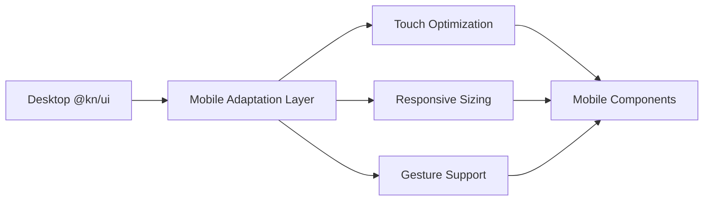
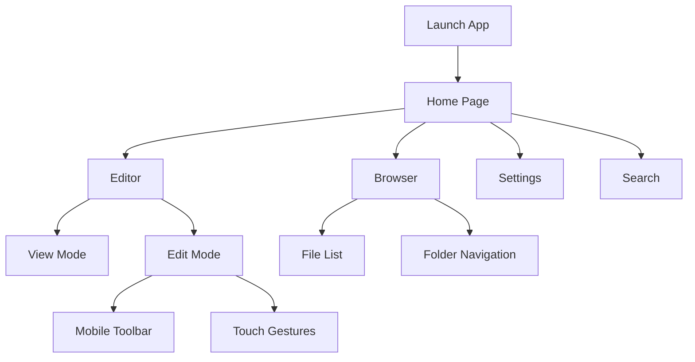
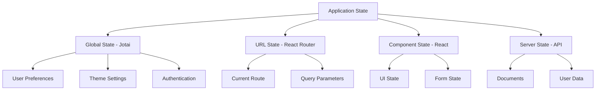
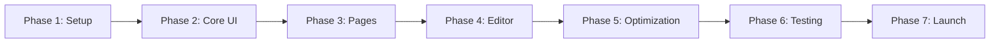

# Mobile Development Design Document

## 1. Overview

This document outlines the design for developing a mobile web application using the existing monorepo infrastructure. The mobile application will leverage web technologies and reuse core packages from the knowledge-repo project while implementing mobile-specific adaptations.

### 1.1 Objectives

- Develop a mobile web application using React and Vite
- Reuse and adapt existing components from @kn/core and @kn/ui packages
- Implement mobile-responsive UI components with touch optimization
- Maintain consistency with the existing monorepo architecture
- Support cross-platform mobile browsers with responsive design

### 1.2 Scope

The mobile application will be developed within the apps directory as a new Vite-based project, following the architectural patterns established by the existing apps/vite project while incorporating mobile-specific optimizations.

## 2. Architecture Design

### 2.1 Project Structure

```
apps/
  mobile/                           # New mobile application
    src/
      app/                           # Application entry and configuration
        App.tsx                      # Root application component
        main.tsx                     # Application entry point
      pages/                         # Page-level components
        Home/                        # Home page
        Editor/                      # Mobile editor page
        Settings/                    # Settings page
      components/                    # Mobile-specific components
        layout/                      # Layout components
          MobileHeader.tsx
          MobileNavigation.tsx
          MobileFooter.tsx
        common/                      # Common mobile components
      hooks/                         # Mobile-specific custom hooks
        useTouch.ts                  # Touch event handling
        useResponsive.ts             # Responsive utilities
        useViewport.ts               # Viewport detection
      styles/                        # Mobile-specific styles
        mobile.css                   # Mobile layout styles
        touch.css                    # Touch interaction styles
      utils/                         # Mobile utilities
        responsive.ts                # Responsive helper functions
        touch.ts                     # Touch gesture utilities
    public/                          # Static assets
      icons/                         # Mobile app icons
      manifest.json                  # PWA manifest
    index.html                       # HTML template
    vite.config.ts                   # Vite configuration
    tsconfig.json                    # TypeScript configuration
    package.json                     # Package dependencies
    tailwind.config.js               # Tailwind configuration
```

### 2.2 System Architecture

```mermaid
graph TB
    A[Mobile Application] --> B[@kn/core]
    A --> C[@kn/ui - Mobile Adapted]
    A --> D[@kn/editor]
    A --> E[@kn/common]
    
    C --> F[Base UI Components]
    C --> G[Mobile UI Extensions]
    
    G --> H[Touch Interactions]
    G --> I[Responsive Layout]
    G --> J[Mobile Gestures]
    
    B --> K[Core Business Logic]
    B --> L[State Management]
    B --> M[API Integration]
    
    D --> N[Editor Core]
    D --> O[Mobile Editor Adaptations]
```

### 2.3 Technology Stack

| Category | Technology | Version | Purpose |
|----------|-----------|---------|---------|
| Framework | React | 18.x | UI component framework |
| Build Tool | Vite | 5.x | Build and development server |
| Language | TypeScript | 5.x | Type-safe development |
| Styling | Tailwind CSS | 3.x | Utility-first styling |
| UI Library | @kn/ui | workspace | Shared component library |
| Core Logic | @kn/core | workspace | Business logic and state |
| Editor | @kn/editor | workspace | Rich text editing |
| State Management | Jotai | Latest | Global state management |
| Routing | React Router | 6.x | Client-side routing |

## 3. Component Adaptation Strategy

### 3.1 @kn/ui Mobile Adaptation Approach

The adaptation will extend @kn/ui components with mobile-specific enhancements without modifying the original desktop implementations.

#### 3.1.1 Adaptation Layers



#### 3.1.2 Component Adaptation Categories

| Component Type | Adaptation Strategy | Key Changes |
|----------------|---------------------|-------------|
| Input Components | Touch-first interaction | Larger touch targets, improved focus states |
| Navigation | Mobile patterns | Bottom navigation, slide-out menus, swipe gestures |
| Dialogs/Modals | Full-screen on mobile | Slide-up animations, easier dismissal |
| Data Tables | Horizontal scroll + cards | Responsive breakpoints, card view for small screens |
| Dropdowns/Selects | Native-like behavior | Full-screen overlays, improved scroll performance |
| Tooltips | Tap to reveal | Replace hover with tap interactions |

#### 3.1.3 Responsive Breakpoints

```
Mobile Breakpoints:
- xs: 320px - 480px   (Small phones)
- sm: 481px - 768px   (Large phones, small tablets)
- md: 769px - 1024px  (Tablets)
- lg: 1025px+         (Desktop fallback)
```

### 3.2 Mobile-Specific Component Extensions

Create mobile-enhanced versions in the mobile app that wrap @kn/ui components:

```
apps/mobile/src/components/adapted/
  Button.tsx              # Touch-optimized button
  Input.tsx               # Mobile keyboard-friendly input
  Select.tsx              # Full-screen select modal
  Dialog.tsx              # Slide-up dialog
  Navigation.tsx          # Bottom navigation bar
  ScrollArea.tsx          # Touch scroll with momentum
```

### 3.3 Touch Interaction Design

#### 3.3.1 Touch Target Specifications

| Element Type | Minimum Size | Recommended Size | Spacing |
|--------------|--------------|------------------|---------|
| Buttons | 44x44px | 48x48px | 8px |
| Input Fields | 44px height | 48px height | 12px |
| List Items | 44px height | 56px height | 0px |
| Icons | 24x24px | 32x32px | 16px padding |
| Links | 44x44px tap area | 48x48px tap area | 8px |

#### 3.3.2 Gesture Support

| Gesture | Use Case | Implementation |
|---------|----------|----------------|
| Swipe Left/Right | Navigate between pages, delete items | Custom hook with touch events |
| Pull to Refresh | Refresh content lists | Native scroll behavior or custom |
| Long Press | Context menus, additional options | Touch event timing detection |
| Pinch Zoom | Image viewing, canvas interactions | Transform CSS with touch events |
| Tap | Primary interaction | Standard click events |

## 4. Application Structure

### 4.1 Page Architecture

#### 4.1.1 Core Pages

| Page | Route | Purpose | Key Components |
|------|-------|---------|----------------|
| Home | / | Dashboard and entry point | Navigation, quick actions, recent items |
| Editor | /editor/:id | Mobile document editing | Mobile toolbar, touch editor, keyboard toolbar |
| Browser | /browse | File and document browser | Touch-friendly list, search, filters |
| Settings | /settings | App configuration | Mobile-optimized forms, toggles |
| Search | /search | Global search interface | Touch keyboard, result cards |

#### 4.1.2 Page Flow



### 4.2 Layout System

#### 4.2.1 Mobile Layout Components

| Component | Responsibility | Behavior |
|-----------|---------------|----------|
| MobileHeader | Top app bar with title and actions | Fixed position, collapsible on scroll |
| MobileNavigation | Bottom navigation bar | Fixed bottom, icon-based navigation |
| MobileContent | Main content container | Scrollable, safe area aware |
| MobileFooter | Optional footer content | Contextual actions |
| MobileSidebar | Slide-out navigation drawer | Overlay with backdrop, swipe to close |

#### 4.2.2 Safe Area Handling

The layout system will respect device safe areas for notches, home indicators, and system UI:

- Use CSS environment variables: safe-area-inset-top, safe-area-inset-bottom, safe-area-inset-left, safe-area-inset-right
- Apply safe area padding to fixed positioned elements
- Ensure interactive elements are not obscured by system UI

## 5. Development Configuration

### 5.1 Package Dependencies

The mobile app package.json will include:

**Core Dependencies:**
- @kn/core: workspace - Business logic and state management
- @kn/ui: workspace - Component library
- @kn/editor: workspace - Rich text editor
- @kn/common: workspace - Shared utilities
- react: 18.x - UI framework
- react-dom: 18.x - DOM renderer
- react-router-dom: 6.x - Routing

**Mobile-Specific Dependencies:**
- use-gesture: Touch and gesture detection
- react-spring: Smooth animations
- workbox-webpack-plugin: PWA service worker
- react-device-detect: Device detection utilities

**Development Dependencies:**
- vite: 5.x - Build tool
- @vitejs/plugin-react: React plugin for Vite
- typescript: 5.x - Type checking
- tailwindcss: 3.x - Styling framework
- vite-tsconfig-paths: Path mapping support

### 5.2 Vite Configuration

Key configuration aspects for mobile development:

| Configuration | Value | Reason |
|--------------|-------|--------|
| base | / | Root-relative paths for mobile browsers |
| build.target | es2020 | Modern browser support |
| build.minify | terser | Better compression for mobile |
| build.cssCodeSplit | true | Optimize CSS loading |
| optimizeDeps | Include @kn/* packages | Ensure workspace packages are optimized |
| server.host | 0.0.0.0 | Allow network access for device testing |
| server.port | 3001 | Avoid conflict with existing apps |

### 5.3 TypeScript Configuration

TypeScript setup aligned with monorepo standards:

- Extend @kn/typescript-config/react-library.json
- Enable strict mode for type safety
- Include paths mapping for @kn/* packages
- Target ES2020 for modern mobile browsers
- Enable JSX preserve for React 18

### 5.4 Build Scripts

| Script | Command | Purpose |
|--------|---------|---------|
| dev | vite | Start development server |
| build | vite build | Production build |
| preview | vite preview | Preview production build |
| lint | eslint . --ext ts,tsx | Code quality checks |
| type-check | tsc --noEmit | Type checking without build |

## 6. Responsive Design System

### 6.1 Responsive Utilities

Create utility functions for responsive behavior:

**Viewport Detection:**
- detectViewportSize: Determine current breakpoint
- isPortrait: Check device orientation
- getViewportDimensions: Get current dimensions

**Responsive Hooks:**
- useResponsive: Access current breakpoint and orientation
- useMediaQuery: Custom media query hook
- useViewportSize: Reactive viewport dimensions

### 6.2 Responsive Component Patterns

#### 6.2.1 Conditional Rendering

Components adapt their structure based on screen size:

- Mobile: Simplified layouts, single-column, stacked elements
- Tablet: Two-column layouts, side-by-side elements
- Desktop: Full feature set with multi-column layouts

#### 6.2.2 Progressive Enhancement

Start with mobile-first design and enhance for larger screens:

- Base styles target mobile devices
- Use min-width media queries to add complexity
- Ensure core functionality works on all screen sizes

### 6.3 Typography Scale

| Element | Mobile | Tablet | Desktop |
|---------|--------|--------|---------|
| H1 | 1.75rem (28px) | 2rem (32px) | 2.5rem (40px) |
| H2 | 1.5rem (24px) | 1.75rem (28px) | 2rem (32px) |
| H3 | 1.25rem (20px) | 1.5rem (24px) | 1.75rem (28px) |
| Body | 1rem (16px) | 1rem (16px) | 1rem (16px) |
| Small | 0.875rem (14px) | 0.875rem (14px) | 0.875rem (14px) |
| Caption | 0.75rem (12px) | 0.75rem (12px) | 0.75rem (12px) |

## 7. Performance Optimization

### 7.1 Mobile Performance Targets

| Metric | Target | Priority |
|--------|--------|----------|
| First Contentful Paint | < 1.5s | High |
| Time to Interactive | < 3.5s | High |
| Total Bundle Size | < 200KB (gzipped) | High |
| Largest Contentful Paint | < 2.5s | Medium |
| Cumulative Layout Shift | < 0.1 | Medium |

### 7.2 Optimization Strategies

#### 7.2.1 Code Splitting

- Route-based splitting: Each page loaded on demand
- Component-level splitting: Heavy components lazy-loaded
- Third-party library splitting: Separate vendor bundles

#### 7.2.2 Asset Optimization

- Image optimization: WebP format with fallbacks, responsive images
- Icon strategy: SVG sprites for icons, inline critical icons
- Font loading: System fonts for body, web fonts for headings only

#### 7.2.3 Caching Strategy

- Service worker: Cache static assets and API responses
- Browser caching: Appropriate cache headers for assets
- Local storage: Persist user preferences and draft content

### 7.3 Bundle Size Management

Strategies to keep bundle size minimal:

- Tree shaking: Import only used components from @kn/ui
- Dynamic imports: Load features on demand
- Dependency audit: Regularly review and minimize dependencies
- Compression: Enable gzip/brotli compression

## 8. State Management

### 8.1 State Architecture



### 8.2 State Management Patterns

| State Type | Storage | Persistence | Update Pattern |
|------------|---------|-------------|----------------|
| User authentication | Jotai atom | Local storage | Login/logout actions |
| Theme preferences | Jotai atom | Local storage | User selection |
| Current document | Component state | None | Editor changes |
| Navigation state | React Router | URL | Route changes |
| API cache | React Query / Jotai | Session storage | Automatic background refresh |
| Draft content | Local storage | Persistent | Auto-save on change |

### 8.3 Offline Support Strategy

Enable basic offline functionality:

- Cache previously viewed documents in IndexedDB
- Queue API requests when offline
- Sync changes when connection restored
- Provide clear offline/online indicators

## 9. Editor Mobile Adaptations

### 9.1 Mobile Editor Requirements

The @kn/editor package needs mobile-specific adaptations for optimal touch-based editing:

#### 9.1.1 Editor Challenges on Mobile

| Challenge | Solution |
|-----------|----------|
| Small screen space | Collapsible toolbar, contextual menus |
| Touch selection | Larger touch handles, improved selection UI |
| Keyboard management | Smart keyboard appearance, toolbar positioning |
| Performance | Virtualized rendering for long documents |
| Gestures | Swipe to undo/redo, pinch to zoom |

### 9.2 Mobile Toolbar Design

#### 9.2.1 Toolbar Layout

- Primary toolbar: Fixed bottom position above keyboard
- Contextual toolbar: Appears on text selection
- Format drawer: Slide-up panel for advanced formatting
- Quick actions: Floating action button for common tasks

#### 9.2.2 Toolbar Actions Priority

**Primary Actions (Always Visible):**
- Bold, Italic, Underline
- Heading levels
- List creation
- Link insertion

**Secondary Actions (Drawer):**
- Text color
- Background color
- Alignment
- Advanced formatting

### 9.3 Touch Selection Enhancement

Improve text selection experience:

- Larger selection handles (minimum 44x44px touch target)
- Visual feedback during selection
- Quick action toolbar on selection
- Smart selection (word, sentence, paragraph)

## 10. Integration with Existing Packages

### 10.1 @kn/core Integration

The mobile app will consume @kn/core services:

| Core Module | Mobile Usage | Adaptation Required |
|-------------|--------------|---------------------|
| API Services | Direct reuse | Add mobile-specific error handling |
| State Management | Direct reuse | Optimize for mobile memory constraints |
| Business Logic | Direct reuse | None |
| Utilities | Direct reuse | Add touch utilities |
| Localization | Direct reuse | None |

### 10.2 @kn/ui Component Reuse

#### 10.2.1 Direct Reuse Components

Components that work well on mobile without changes:

- Badge, Avatar, Separator
- Toast notifications
- Progress indicators
- Card layouts
- Typography components

#### 10.2.2 Adapted Components

Components requiring mobile-specific wrappers:

| Component | Mobile Adaptation |
|-----------|------------------|
| Button | Larger touch targets, loading states |
| Input | Mobile keyboard handling, auto-focus management |
| Select | Full-screen overlay on mobile |
| Dialog | Slide-up animation, full-screen on small devices |
| Dropdown Menu | Touch-optimized spacing, larger items |
| Tooltip | Tap-to-show instead of hover |
| Navigation Menu | Bottom navigation bar |
| Tabs | Swipeable tab panels |

### 10.3 Plugin System Consideration

Evaluate plugin compatibility for mobile:

**Mobile-Compatible Plugins:**
- @kn/plugin-ai: Text generation, mobile-optimized UI
- @kn/plugin-block-reference: Reference insertion with touch
- @kn/plugin-database: Mobile-responsive table views

**Plugins Requiring Adaptation:**
- @kn/plugin-excalidraw: Touch drawing, gesture support
- @kn/plugin-drawio: Mobile canvas interaction
- @kn/plugin-mermaid: Zoom and pan on mobile
- @kn/plugin-bitable: Horizontal scroll, card views

**Decision:** Initially launch mobile app without plugins, add them incrementally with proper mobile adaptations.

## 11. Testing Strategy

### 11.1 Testing Approach

| Test Type | Coverage | Tools |
|-----------|----------|-------|
| Unit Tests | Component logic, utilities | Vitest, React Testing Library |
| Integration Tests | Page flows, user journeys | Vitest, React Testing Library |
| E2E Tests | Critical user paths | Playwright |
| Visual Tests | Component appearance | Storybook, Chromatic |
| Performance Tests | Load time, bundle size | Lighthouse, Web Vitals |
| Device Tests | Real device testing | BrowserStack, physical devices |

### 11.2 Device Testing Matrix

**Priority Devices:**
- iOS: iPhone 12/13/14 (Safari)
- Android: Samsung Galaxy S21/S22 (Chrome)
- Tablet: iPad Air (Safari), Samsung Galaxy Tab (Chrome)

**Testing Scenarios:**
- Portrait and landscape orientations
- Different screen sizes (320px to 1024px)
- Touch interactions (tap, swipe, pinch, long press)
- Keyboard interactions (show/hide, toolbar positioning)
- Network conditions (3G, 4G, WiFi, offline)

### 11.3 Accessibility Testing

Ensure mobile accessibility:

- Touch target sizes meet WCAG guidelines
- Screen reader compatibility (VoiceOver, TalkBack)
- Keyboard navigation for external keyboard users
- Color contrast ratios for outdoor visibility
- Focus management for modal interactions

## 12. Development Workflow

### 12.1 Development Phases



#### Phase 1: Project Setup
- Create mobile app structure in apps/mobile
- Configure Vite, TypeScript, Tailwind
- Set up routing and basic layout
- Integrate @kn/core and @kn/ui

#### Phase 2: Core UI Components
- Adapt @kn/ui components for mobile
- Implement responsive utilities
- Create mobile-specific layout components
- Build touch interaction hooks

#### Phase 3: Page Implementation
- Implement Home page with navigation
- Build Browser page with file management
- Create Settings page with forms
- Develop Search interface

#### Phase 4: Editor Integration
- Integrate @kn/editor with mobile adaptations
- Build mobile toolbar
- Implement touch selection
- Add gesture support

#### Phase 5: Performance Optimization
- Implement code splitting
- Optimize bundle size
- Add caching strategies
- Implement PWA features

#### Phase 6: Testing & QA
- Unit and integration tests
- Device testing on target devices
- Performance benchmarking
- Accessibility audit

#### Phase 7: Launch Preparation
- Documentation
- Deployment configuration
- Monitoring setup
- User feedback collection

### 12.2 Monorepo Integration

The mobile app will integrate seamlessly with the existing monorepo:

**Turbo Configuration:**
- Add mobile app to turbo.json task pipeline
- Configure build dependencies on @kn/* packages
- Set up parallel builds for efficiency

**Package Scripts:**
- Root package.json: Add mobile:dev, mobile:build, mobile:preview
- Use pnpm filter to target mobile app: pnpm --filter mobile dev

**Shared Configuration:**
- Extend @kn/typescript-config
- Use @kn/eslint-config for linting
- Share Tailwind configuration with desktop apps

## 13. Deployment Considerations

### 13.1 Build Output

The Vite build will produce:

- Optimized JavaScript bundles (code-split by route)
- CSS files (extracted and minified)
- Static assets (images, icons, fonts)
- Service worker for PWA support
- HTML entry point with meta tags for mobile

### 13.2 Hosting Requirements

**Server Configuration:**
- Serve index.html for all routes (SPA routing)
- Enable gzip/brotli compression
- Set appropriate cache headers for assets
- HTTPS required for PWA features
- Configure CORS for API access

**CDN Strategy:**
- Serve static assets from CDN
- Cache JavaScript and CSS bundles
- Use versioned URLs for cache busting

### 13.3 Progressive Web App (PWA)

Enable PWA features for app-like experience:

- Web app manifest with icons and theme colors
- Service worker for offline support and caching
- Install prompt for add to home screen
- Splash screen configuration
- Status bar theming

## 14. Security Considerations

### 14.1 Mobile-Specific Security

| Security Concern | Mitigation Strategy |
|-----------------|---------------------|
| Unsecured WiFi | Enforce HTTPS, certificate pinning |
| Local storage exposure | Encrypt sensitive data, clear on logout |
| Token theft | Short-lived tokens, secure storage |
| XSS attacks | Content Security Policy, input sanitization |
| CSRF attacks | CSRF tokens, SameSite cookies |
| Screen capture | Disable screenshots for sensitive screens (via meta tag) |

### 14.2 Data Privacy

- Minimize local data storage
- Clear cache and local storage on logout
- Implement auto-logout after inactivity
- Provide clear data deletion options

## 15. Future Enhancements

### 15.1 Native App Wrapper

Consider wrapping the mobile web app in native containers:

- **Capacitor/Ionic**: Cross-platform native wrapper
- **React Native Web**: Share components with React Native apps
- **PWA as TWA**: Trusted Web Activity for Android

### 15.2 Advanced Features

Potential future enhancements:

- Offline editing with sync
- Real-time collaboration on mobile
- Voice input for content creation
- Camera integration for image insertion
- Push notifications for updates
- Biometric authentication
- Dark mode with system preference sync

### 15.3 Platform-Specific Optimizations

**iOS Specific:**
- Safari-specific CSS fixes
- iOS keyboard toolbar handling
- Home screen icon optimization
- Haptic feedback integration

**Android Specific:**
- Chrome custom tabs integration
- Android share target support
- Material Design enhancements
- Back button handling

## 16. Success Metrics

### 16.1 Technical Metrics

| Metric | Target | Measurement |
|--------|--------|-------------|
| Page Load Time | < 2s on 4G | Lighthouse, Analytics |
| Bundle Size | < 200KB gzipped | Build output analysis |
| Performance Score | > 90 (Lighthouse) | Lighthouse CI |
| Accessibility Score | > 95 (Lighthouse) | Lighthouse CI |
| Error Rate | < 1% sessions | Error tracking |

### 16.2 User Experience Metrics

| Metric | Target | Measurement |
|--------|--------|-------------|
| Time to First Edit | < 5 seconds | Analytics tracking |
| Task Completion Rate | > 90% | User testing |
| User Satisfaction | > 4/5 rating | Feedback surveys |
| Return User Rate | > 60% | Analytics tracking |

## 17. Dependencies and Constraints

### 17.1 Technical Dependencies

- Monorepo packages (@kn/core, @kn/ui, @kn/editor) must remain stable
- Backend API must support mobile use cases
- Vite build system must support workspace packages
- Modern browser requirements (ES2020+ support)

### 17.2 Development Constraints

- Mobile app must reuse existing packages without forking
- UI adaptations must not break desktop functionality
- Performance must be optimized for 3G network conditions
- Development must follow existing monorepo standards

### 17.3 Timeline Considerations

The phased approach allows for incremental delivery:

- MVP (Phases 1-3): Core functionality without editor
- Full Release (Phases 1-6): Complete feature set with testing
- Enhancement Phase (Phase 7): PWA and optimization features

## 18. Risk Assessment

| Risk | Probability | Impact | Mitigation |
|------|------------|--------|------------|
| Performance issues on low-end devices | Medium | High | Aggressive code splitting, lazy loading |
| Touch interaction conflicts | Medium | Medium | Extensive device testing, touch utilities |
| Editor complexity on mobile | High | High | Start without editor, add incrementally |
| Package compatibility issues | Low | High | Thorough integration testing |
| Bundle size exceeds targets | Medium | Medium | Regular bundle analysis, tree shaking |
| Browser inconsistencies | Medium | Medium | Cross-browser testing, polyfills |

## 19. Documentation Requirements

### 19.1 Technical Documentation

- Architecture overview and component diagrams
- API integration guide for mobile-specific endpoints
- Mobile component usage examples
- Touch interaction implementation guide
- Performance optimization checklist

### 19.2 Developer Documentation

- Mobile app setup and development guide
- Contribution guidelines for mobile features
- Testing procedures for mobile devices
- Debugging tips for mobile browsers
- Deployment and build process

### 19.3 User Documentation

- Mobile app user guide
- Gesture and interaction guide
- Troubleshooting common issues
- PWA installation instructions
- Accessibility features guide
