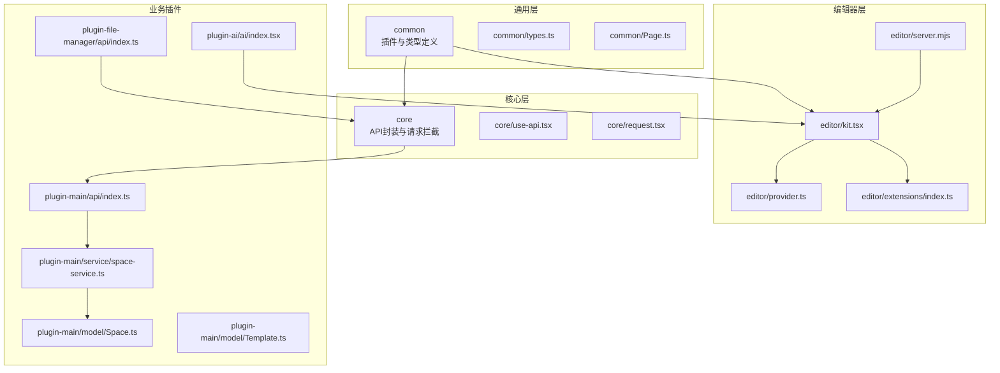
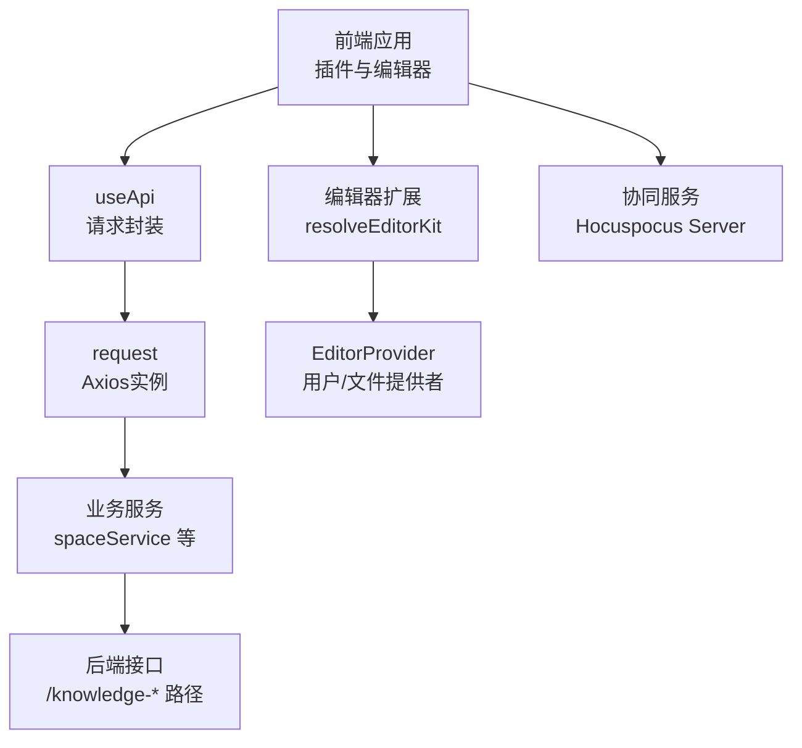
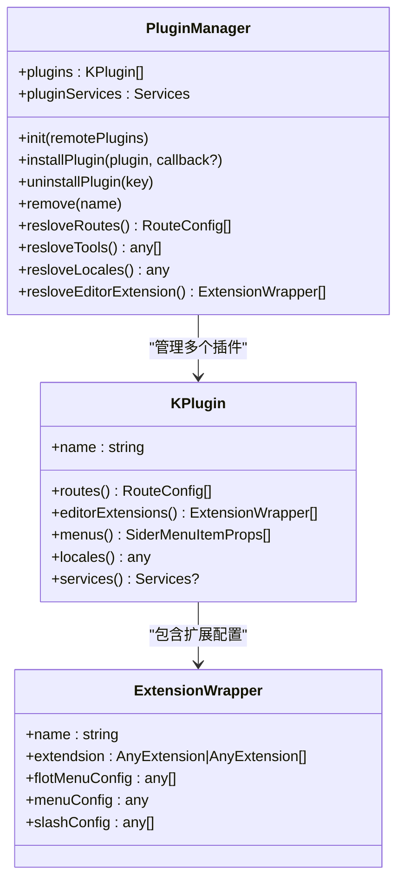
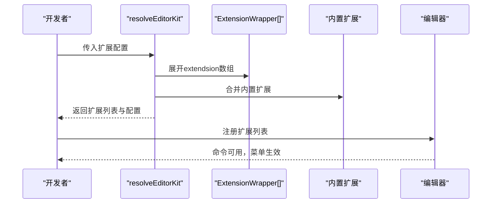
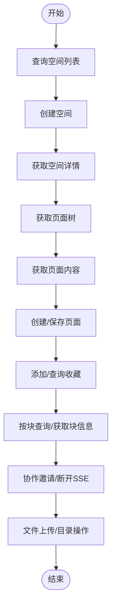
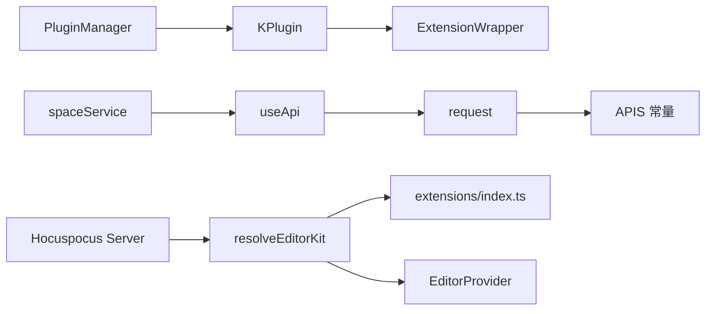

# API参考

<cite>
**本文引用的文件**
- [packages/common/src/core/PluginManager.ts](file://packages/common/src/core/PluginManager.ts)
- [packages/common/src/core/types.ts](file://packages/common/src/core/types.ts)
- [packages/common/src/entity/Page.ts](file://packages/common/src/entity/Page.ts)
- [packages/core/src/hooks/use-api.tsx](file://packages/core/src/hooks/use-api.tsx)
- [packages/core/src/utils/request.tsx](file://packages/core/src/utils/request.tsx)
- [packages/plugin-main/src/api/index.ts](file://packages/plugin-main/src/api/index.ts)
- [packages/plugin-main/src/service/space-service.ts](file://packages/plugin-main/src/service/space-service.ts)
- [packages/plugin-main/src/model/Space.ts](file://packages/plugin-main/src/model/Space.ts)
- [packages/plugin-main/src/model/Template.ts](file://packages/plugin-main/src/model/Template.ts)
- [packages/plugin-ai/src/ai/index.tsx](file://packages/plugin-ai/src/ai/index.tsx)
- [packages/plugin-file-manager/src/api/index.ts](file://packages/plugin-file-manager/src/api/index.ts)
- [packages/editor/src/editor/kit.tsx](file://packages/editor/src/editor/kit.tsx)
- [packages/editor/src/editor/provider.ts](file://packages/editor/src/editor/provider.ts)
- [packages/editor/src/extensions/index.ts](file://packages/editor/src/extensions/index.ts)
- [packages/editor/src/server/server.mjs](file://packages/editor/src/server/server.mjs)
</cite>

## 目录
1. [简介](#简介)
2. [项目结构](#项目结构)
3. [核心组件](#核心组件)
4. [架构总览](#架构总览)
5. [详细组件分析](#详细组件分析)
6. [依赖关系分析](#依赖关系分析)
7. [性能考量](#性能考量)
8. [故障排查指南](#故障排查指南)
9. [结论](#结论)
10. [附录](#附录)

## 简介
本文件为知识库管理系统的API参考文档，覆盖插件API规范（插件接口、生命周期与配置）、编辑器扩展API（扩展注册、命令系统、状态管理）、以及服务接口文档（空间管理、页面操作、协作与文件管理）。文档提供参数说明、返回值定义、错误处理机制，并给出调用示例与最佳实践，同时解释版本兼容性、废弃策略与迁移建议，帮助开发者准确理解并使用系统的公共接口。

## 项目结构
系统采用多包工作区组织，核心API与通用能力位于common、core、editor等包中；业务服务与插件在plugin-*系列包中实现；编辑器扩展在editor包中集中管理；协同服务通过独立的Hocuspocus服务器运行。

**图表来源**
- [packages/common/src/core/types.ts](file://packages/common/src/core/types.ts#L1-L4)
- [packages/common/src/entity/Page.ts](file://packages/common/src/entity/Page.ts#L1-L8)
- [packages/core/src/hooks/use-api.tsx](file://packages/core/src/hooks/use-api.tsx#L1-L51)
- [packages/core/src/utils/request.tsx](file://packages/core/src/utils/request.tsx#L1-L118)
- [packages/editor/src/editor/kit.tsx](file://packages/editor/src/editor/kit.tsx#L1-L87)
- [packages/editor/src/editor/provider.ts](file://packages/editor/src/editor/provider.ts#L1-L53)
- [packages/editor/src/extensions/index.ts](file://packages/editor/src/extensions/index.ts#L1-L64)
- [packages/editor/src/server/server.mjs](file://packages/editor/src/server/server.mjs#L1-L26)
- [packages/plugin-main/src/api/index.ts](file://packages/plugin-main/src/api/index.ts#L1-L120)
- [packages/plugin-main/src/service/space-service.ts](file://packages/plugin-main/src/service/space-service.ts#L1-L59)
- [packages/plugin-main/src/model/Space.ts](file://packages/plugin-main/src/model/Space.ts#L1-L8)
- [packages/plugin-main/src/model/Template.ts](file://packages/plugin-main/src/model/Template.ts#L1-L2)
- [packages/plugin-ai/src/ai/index.tsx](file://packages/plugin-ai/src/ai/index.tsx#L1-L42)
- [packages/plugin-file-manager/src/api/index.ts](file://packages/plugin-file-manager/src/api/index.ts#L1-L27)

**章节来源**
- [packages/common/src/core/PluginManager.ts](file://packages/common/src/core/PluginManager.ts#L1-L170)
- [packages/common/src/core/types.ts](file://packages/common/src/core/types.ts#L1-L4)
- [packages/common/src/entity/Page.ts](file://packages/common/src/entity/Page.ts#L1-L8)
- [packages/core/src/hooks/use-api.tsx](file://packages/core/src/hooks/use-api.tsx#L1-L51)
- [packages/core/src/utils/request.tsx](file://packages/core/src/utils/request.tsx#L1-L118)
- [packages/editor/src/editor/kit.tsx](file://packages/editor/src/editor/kit.tsx#L1-L87)
- [packages/editor/src/editor/provider.ts](file://packages/editor/src/editor/provider.ts#L1-L53)
- [packages/editor/src/extensions/index.ts](file://packages/editor/src/extensions/index.ts#L1-L64)
- [packages/editor/src/server/server.mjs](file://packages/editor/src/server/server.mjs#L1-L26)
- [packages/plugin-main/src/api/index.ts](file://packages/plugin-main/src/api/index.ts#L1-L120)
- [packages/plugin-main/src/service/space-service.ts](file://packages/plugin-main/src/service/space-service.ts#L1-L59)
- [packages/plugin-main/src/model/Space.ts](file://packages/plugin-main/src/model/Space.ts#L1-L8)
- [packages/plugin-main/src/model/Template.ts](file://packages/plugin-main/src/model/Template.ts#L1-L2)
- [packages/plugin-ai/src/ai/index.tsx](file://packages/plugin-ai/src/ai/index.tsx#L1-L42)
- [packages/plugin-file-manager/src/api/index.ts](file://packages/plugin-file-manager/src/api/index.ts#L1-L27)

## 核心组件
- 插件管理与生命周期
  - 插件配置与实例：KPlugin与PluginManager负责插件的注册、安装、卸载、路由与菜单解析、国际化合并、服务聚合。
  - 生命周期钩子：初始化、安装、卸载、刷新事件触发。
- 编辑器扩展与工具
  - 扩展装配：resolveExtesions、resloveSlash、resolveEditorKit用于将插件扩展与内置扩展合并到编辑器运行时。
  - 提供者接口：EditorProvider定义用户、文件等外部能力注入点。
- API封装与请求拦截
  - useApi：统一发起HTTP请求，支持路径参数替换、方法分发。
  - request：Axios实例，设置基础路径、鉴权头、响应拦截与错误提示。

**章节来源**
- [packages/common/src/core/PluginManager.ts](file://packages/common/src/core/PluginManager.ts#L1-L170)
- [packages/editor/src/editor/kit.tsx](file://packages/editor/src/editor/kit.tsx#L1-L87)
- [packages/editor/src/editor/provider.ts](file://packages/editor/src/editor/provider.ts#L1-L53)
- [packages/core/src/hooks/use-api.tsx](file://packages/core/src/hooks/use-api.tsx#L1-L51)
- [packages/core/src/utils/request.tsx](file://packages/core/src/utils/request.tsx#L1-L118)

## 架构总览
系统由“前端插件与编辑器”、“核心API层”、“业务服务层”和“协同服务层”组成。前端通过useApi与request进行HTTP通信，业务服务封装常用接口，编辑器通过扩展与提供者接入协作与第三方能力，协同服务通过Hocuspocus提供实时协作。

**图表来源**
- [packages/core/src/hooks/use-api.tsx](file://packages/core/src/hooks/use-api.tsx#L1-L51)
- [packages/core/src/utils/request.tsx](file://packages/core/src/utils/request.tsx#L1-L118)
- [packages/plugin-main/src/service/space-service.ts](file://packages/plugin-main/src/service/space-service.ts#L1-L59)
- [packages/editor/src/editor/kit.tsx](file://packages/editor/src/editor/kit.tsx#L1-L87)
- [packages/editor/src/editor/provider.ts](file://packages/editor/src/editor/provider.ts#L1-L53)
- [packages/editor/src/server/server.mjs](file://packages/editor/src/server/server.mjs#L1-L26)

## 详细组件分析

### 插件API规范
- 插件接口定义
  - 插件配置：name、status、routes、globalRoutes、menus、editorExtension、locales、services。
  - 插件实例：KPlugin提供只读访问器，暴露routes、editorExtensions、menus、locales、services。
  - 插件管理：PluginManager负责初始化、安装、卸载、解析路由/菜单/国际化/编辑器扩展、聚合服务。
- 生命周期钩子
  - 初始化：init加载内置与远程插件，合并服务。
  - 安装/卸载：installPlugin、uninstallPlugin动态增删插件并触发刷新事件。
  - 解析：resloveRoutes、resloveTools、resloveLocales、resloveEditorExtension按插件聚合结果。
- 配置选项
  - 路由与菜单：支持全局与局部路由、侧边栏菜单项。
  - 编辑器扩展：ExtensionWrapper数组，支持扩展、浮动菜单、静态菜单、slash菜单。
  - 国际化与服务：多插件locales合并，services聚合至全局。

**图表来源**
- [packages/common/src/core/PluginManager.ts](file://packages/common/src/core/PluginManager.ts#L1-L170)
- [packages/common/src/core/types.ts](file://packages/common/src/core/types.ts#L1-L4)

**章节来源**
- [packages/common/src/core/PluginManager.ts](file://packages/common/src/core/PluginManager.ts#L1-L170)
- [packages/common/src/core/types.ts](file://packages/common/src/core/types.ts#L1-L4)

### 编辑器扩展API
- 扩展注册与装配
  - resolveExtesions：将ExtensionWrapper中的扩展展开为Tiptap扩展数组。
  - resloveSlash：从插件扩展中收集slash条目，组装slash菜单。
  - resolveEditorKit：合并内置扩展、插件扩展与运行时扩展，返回编辑器扩展列表与配置。
- 命令系统与状态管理
  - 通过扩展提供的命令（如AI扩展的插入块命令）与菜单集成，实现状态驱动的UI更新。
  - 提供者接口EditorProvider注入用户与文件能力，供扩展在运行时访问。
- 示例
  - AI扩展通过ExtensionWrapper声明扩展、浮动菜单、静态菜单与slash条目，实现“/ai”快捷插入。

**图表来源**
- [packages/editor/src/editor/kit.tsx](file://packages/editor/src/editor/kit.tsx#L1-L87)
- [packages/plugin-ai/src/ai/index.tsx](file://packages/plugin-ai/src/ai/index.tsx#L1-L42)

**章节来源**
- [packages/editor/src/editor/kit.tsx](file://packages/editor/src/editor/kit.tsx#L1-L87)
- [packages/editor/src/editor/provider.ts](file://packages/editor/src/editor/provider.ts#L1-L53)
- [packages/plugin-ai/src/ai/index.tsx](file://packages/plugin-ai/src/ai/index.tsx#L1-L42)

### 服务接口文档（空间、页面、协作、文件）
- 空间管理
  - 查询空间列表：GET /knowledge-wiki/space/list
  - 获取个人空间：GET /knowledge-wiki/space/personal
  - 创建空间：POST /knowledge-wiki/space
  - 获取空间详情：GET /knowledge-wiki/space/:id/detail
  - 添加空间收藏：POST /knowledge-wiki/space/:id/favorite
  - 保存空间为模板：POST /knowledge-wiki/space/template
- 页面操作
  - 查询页面列表：GET /knowledge-wiki/space/page/list
  - 获取页面树：GET /knowledge-wiki/space/:id/page/tree
  - 获取页面内容：GET /knowledge-wiki/space/page/:id/content
  - 创建或保存页面：POST /knowledge-wiki/space/page
  - 页面收藏：POST /knowledge-wiki/space/page/:id/favorite
  - 收藏列表：GET /knowledge-wiki/space/page/favorites
  - 删除到回收站：DELETE /knowledge-wiki/space/page/:id/trash
  - 从回收站恢复：PUT /knowledge-wiki/space/page/:id/restore
  - 最近页面：GET /knowledge-wiki/space/page/recent
  - 按块查询页面：GET /knowledge-wiki/space/page/blocks
  - 获取块信息：GET /knowledge-wiki/space/page/block
  - 保存为模板：POST /knowledge-wiki/space/page/:id/template
- 协作与通知
  - 断开SSE：GET /knowledge-message/sse/disconnect
  - 创建协作邀请：POST /knowledge-wiki/space/collaborationInvitation
- 文件与资源
  - 上传文件：POST /knowledge-resource/oss/endpoint/put-file
  - 文件中心：获取根目录、上传文件、获取子节点、创建文件夹等（见文件管理插件API）。
- 用户与认证
  - 登录：POST /knowledge-auth/token
  - 注册：POST /knowledge-system/user/register
  - 获取用户信息：GET /knowledge-system/user/info

**图表来源**
- [packages/plugin-main/src/api/index.ts](file://packages/plugin-main/src/api/index.ts#L1-L120)
- [packages/plugin-file-manager/src/api/index.ts](file://packages/plugin-file-manager/src/api/index.ts#L1-L27)

**章节来源**
- [packages/plugin-main/src/api/index.ts](file://packages/plugin-main/src/api/index.ts#L1-L120)
- [packages/plugin-main/src/service/space-service.ts](file://packages/plugin-main/src/service/space-service.ts#L1-L59)
- [packages/plugin-main/src/model/Space.ts](file://packages/plugin-main/src/model/Space.ts#L1-L8)
- [packages/plugin-main/src/model/Template.ts](file://packages/plugin-main/src/model/Template.ts#L1-L2)
- [packages/plugin-file-manager/src/api/index.ts](file://packages/plugin-file-manager/src/api/index.ts#L1-L27)

### API调用示例与最佳实践
- 使用useApi与APIS常量调用后端接口，自动处理路径参数与请求方法。
- 在请求拦截器中统一注入鉴权头与Basic认证，避免重复代码。
- 对于分页数据，遵循Page<T>模型，统一处理records、current、pageSize、total字段。
- 错误处理：当响应code非200或状态码异常时，toast提示并拒绝Promise；401时引导重新登录。

**章节来源**
- [packages/core/src/hooks/use-api.tsx](file://packages/core/src/hooks/use-api.tsx#L1-L51)
- [packages/core/src/utils/request.tsx](file://packages/core/src/utils/request.tsx#L1-L118)
- [packages/common/src/entity/Page.ts](file://packages/common/src/entity/Page.ts#L1-L8)

### 版本兼容性、废弃策略与迁移指南
- 版本兼容性
  - 插件扩展接口以ExtensionWrapper为核心契约，保持扩展、菜单、slash配置字段稳定，便于向后兼容。
  - API常量APIS提供稳定的端点名称与方法，迁移时优先沿用相同语义的端点。
- 废弃策略
  - 当某API不再维护时，保留其在APIS中的定义并在响应中返回明确的废弃提示与替代方案指引。
- 迁移指南
  - 插件迁移：将旧扩展封装为ExtensionWrapper，确保extendsion、menuConfig、slashConfig齐备；在resolveEditorKit中合并。
  - 接口迁移：若端点变更，新增对应APIS常量并逐步替换调用方；对旧端点保留有限期内的兼容逻辑。

**章节来源**
- [packages/common/src/core/PluginManager.ts](file://packages/common/src/core/PluginManager.ts#L1-L170)
- [packages/plugin-main/src/api/index.ts](file://packages/plugin-main/src/api/index.ts#L1-L120)

## 依赖关系分析
- 组件耦合
  - PluginManager与KPlugin高内聚，低耦合于具体插件实现；通过ExtensionWrapper抽象扩展。
  - useApi与request形成清晰的请求层，业务服务通过useApi间接依赖后端接口。
  - 编辑器扩展通过resolveEditorKit与provider解耦于具体业务。
- 外部依赖
  - Hocuspocus Server作为协同后端，通过环境变量配置数据库与缓存。
  - Axios实例统一处理鉴权与错误提示。

**图表来源**
- [packages/common/src/core/PluginManager.ts](file://packages/common/src/core/PluginManager.ts#L1-L170)
- [packages/editor/src/editor/kit.tsx](file://packages/editor/src/editor/kit.tsx#L1-L87)
- [packages/editor/src/editor/provider.ts](file://packages/editor/src/editor/provider.ts#L1-L53)
- [packages/editor/src/extensions/index.ts](file://packages/editor/src/extensions/index.ts#L1-L64)
- [packages/editor/src/server/server.mjs](file://packages/editor/src/server/server.mjs#L1-L26)
- [packages/plugin-main/src/service/space-service.ts](file://packages/plugin-main/src/service/space-service.ts#L1-L59)
- [packages/core/src/hooks/use-api.tsx](file://packages/core/src/hooks/use-api.tsx#L1-L51)
- [packages/core/src/utils/request.tsx](file://packages/core/src/utils/request.tsx#L1-L118)

**章节来源**
- [packages/common/src/core/PluginManager.ts](file://packages/common/src/core/PluginManager.ts#L1-L170)
- [packages/editor/src/editor/kit.tsx](file://packages/editor/src/editor/kit.tsx#L1-L87)
- [packages/editor/src/editor/provider.ts](file://packages/editor/src/editor/provider.ts#L1-L53)
- [packages/editor/src/extensions/index.ts](file://packages/editor/src/extensions/index.ts#L1-L64)
- [packages/editor/src/server/server.mjs](file://packages/editor/src/server/server.mjs#L1-L26)
- [packages/plugin-main/src/service/space-service.ts](file://packages/plugin-main/src/service/space-service.ts#L1-L59)
- [packages/core/src/hooks/use-api.tsx](file://packages/core/src/hooks/use-api.tsx#L1-L51)
- [packages/core/src/utils/request.tsx](file://packages/core/src/utils/request.tsx#L1-L118)

## 性能考量
- 请求批量化：批量安装/卸载插件时，利用Promise并发加载远程脚本，减少等待时间。
- 缓存与刷新：插件安装/卸载后触发刷新事件，避免重复渲染与无谓计算。
- 编辑器扩展合并：在resolveEditorKit中一次性合并扩展，降低多次渲染成本。
- 协同服务：合理配置Redis/SQLite扩展与日志扩展，平衡性能与可观测性。

[本节为通用指导，无需列出具体文件来源]

## 故障排查指南
- 登录态失效
  - 现象：401响应，toast提示并跳转登录。
  - 处理：检查本地存储的令牌键值，确认Basic认证信息是否正确。
- 网络异常
  - 现象：网络错误或超时，toast提示后端接口异常或超时。
  - 处理：检查后端服务连通性与超时阈值，必要时增加重试。
- 分页数据不一致
  - 现象：records与total不符。
  - 处理：确认Page<T>模型字段与后端返回一致，避免手动拼装分页参数。

**章节来源**
- [packages/core/src/utils/request.tsx](file://packages/core/src/utils/request.tsx#L1-L118)

## 结论
本文档系统梳理了知识库管理系统的插件API、编辑器扩展API与服务接口，明确了调用方式、参数与返回、错误处理与最佳实践，并提供了架构视图与依赖关系图。开发者可据此快速集成插件、扩展编辑器能力并稳定调用后端接口。

[本节为总结性内容，无需列出具体文件来源]

## 附录
- 关键接口一览（摘要）
  - 空间：查询列表、个人空间、创建、详情、收藏、保存为模板
  - 页面：列表、树、内容、创建/保存、收藏、回收站、最近、按块查询、块信息、保存为模板
  - 协作：断开SSE、创建协作邀请
  - 文件：上传、根目录、子节点、创建文件夹
  - 认证：登录、注册、用户信息

**章节来源**
- [packages/plugin-main/src/api/index.ts](file://packages/plugin-main/src/api/index.ts#L1-L120)
- [packages/plugin-file-manager/src/api/index.ts](file://packages/plugin-file-manager/src/api/index.ts#L1-L27)