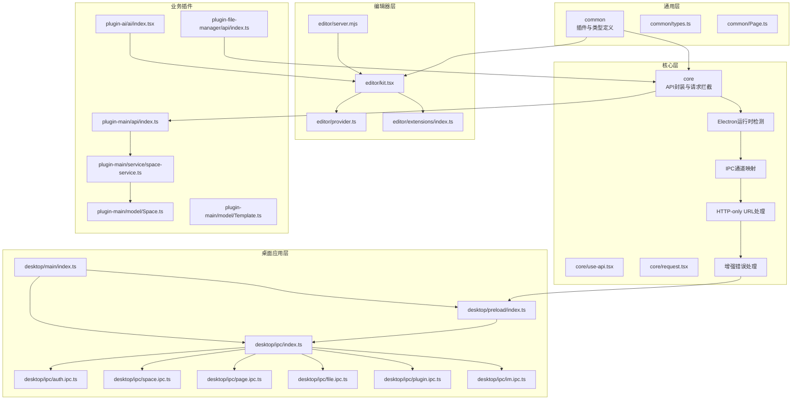
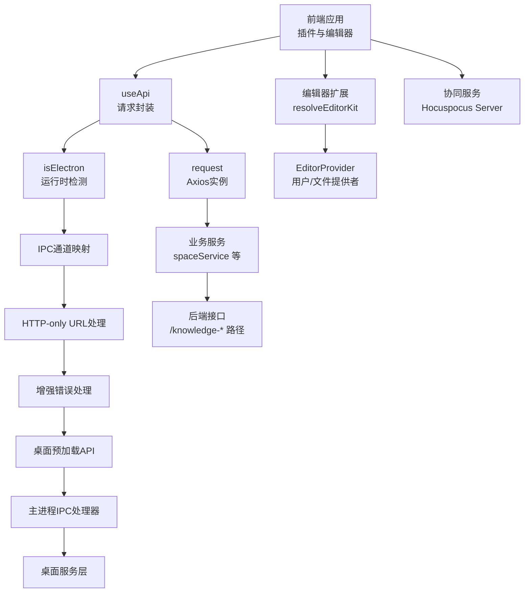
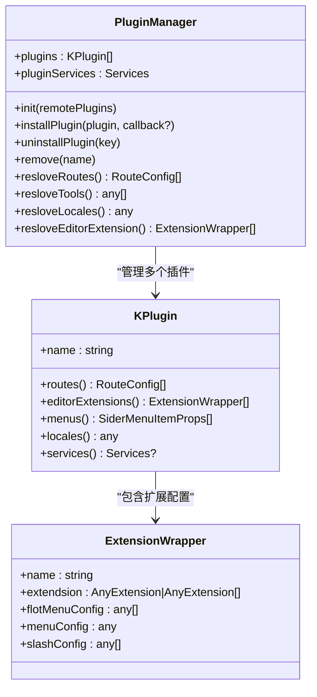
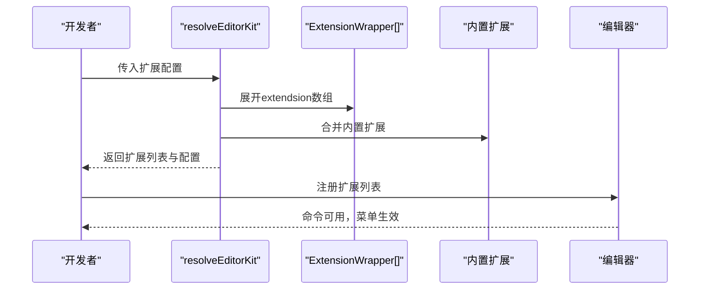
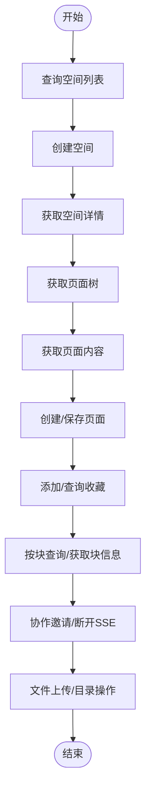
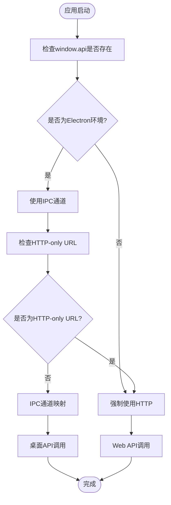
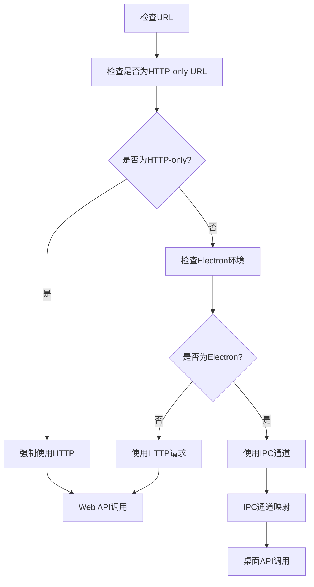
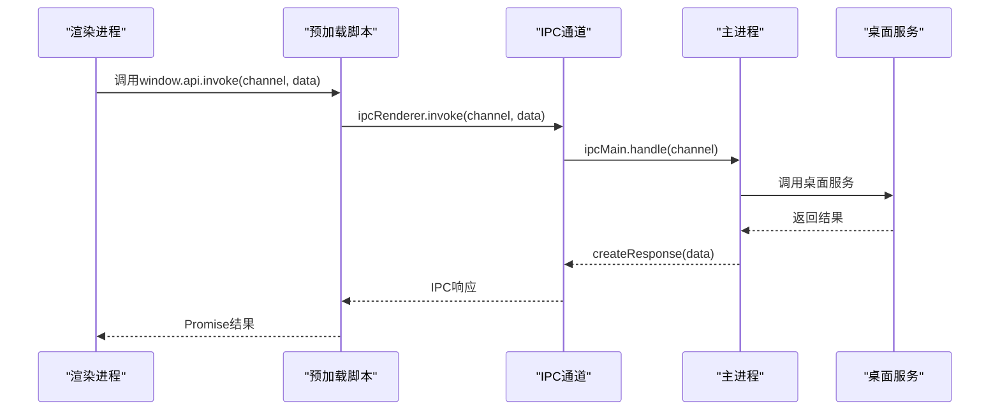
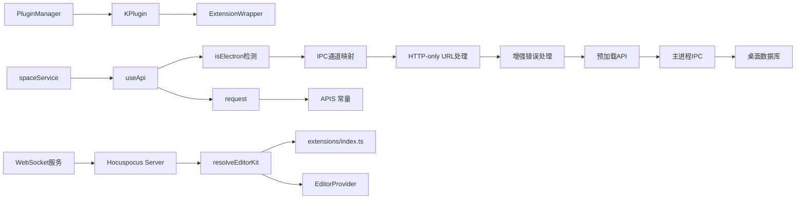

# API参考

<cite>
**本文引用的文件**
- [packages/common/src/core/PluginManager.ts](file://packages/common/src/core/PluginManager.ts)
- [packages/common/src/core/types.ts](file://packages/common/src/core/types.ts)
- [packages/common/src/entity/Page.ts](file://packages/common/src/entity/Page.ts)
- [packages/core/src/hooks/use-api.tsx](file://packages/core/src/hooks/use-api.tsx)
- [packages/core/src/utils/request.tsx](file://packages/core/src/utils/request.tsx)
- [packages/plugin-main/src/api/index.ts](file://packages/plugin-main/src/api/index.ts)
- [packages/plugin-main/src/service/space-service.ts](file://packages/plugin-main/src/service/space-service.ts)
- [packages/plugin-main/src/model/Space.ts](file://packages/plugin-main/src/model/Space.ts)
- [packages/plugin-main/src/model/Template.ts](file://packages/plugin-main/src/model/Template.ts)
- [packages/plugin-ai/src/ai/index.tsx](file://packages/plugin-ai/src/ai/index.tsx)
- [packages/plugin-file-manager/src/api/index.ts](file://packages/plugin-file-manager/src/api/index.ts)
- [packages/editor/src/editor/kit.tsx](file://packages/editor/src/editor/kit.tsx)
- [packages/editor/src/editor/provider.ts](file://packages/editor/src/editor/provider.ts)
- [packages/editor/src/extensions/index.ts](file://packages/editor/src/extensions/index.ts)
- [packages/editor/src/server/server.mjs](file://packages/editor/src/server/server.mjs)
- [apps/desktop/src/preload/index.ts](file://apps/desktop/src/preload/index.ts)
- [apps/desktop/src/main/ipc/index.ts](file://apps/desktop/src/main/ipc/index.ts)
- [apps/desktop/src/main/ipc/auth.ipc.ts](file://apps/desktop/src/main/ipc/auth.ipc.ts)
- [apps/desktop/src/main/ipc/user.ipc.ts](file://apps/desktop/src/main/ipc/user.ipc.ts)
- [apps/desktop/src/main/ipc/space.ipc.ts](file://apps/desktop/src/main/ipc/space.ipc.ts)
- [apps/desktop/src/main/ipc/page.ipc.ts](file://apps/desktop/src/main/ipc/page.ipc.ts)
- [apps/desktop/src/main/ipc/file.ipc.ts](file://apps/desktop/src/main/ipc/file.ipc.ts)
- [apps/desktop/src/main/ipc/plugin.ipc.ts](file://apps/desktop/src/main/ipc/plugin.ipc.ts)
- [apps/desktop/src/main/ipc/im.ipc.ts](file://apps/desktop/src/main/ipc/im.ipc.ts)
- [apps/desktop/src/main/index.ts](file://apps/desktop/src/main/index.ts)
</cite>

## 更新摘要
**所做更改**
- 新增HTTP-only URL支持，专门处理登录、注册和WebSocket操作
- 改进IPC通道映射机制，支持更复杂的动态URL模式匹配
- 增强错误处理机制，提供更好的IPC错误日志和回退策略
- 更新WebSocket操作处理，所有IM相关操作通过HTTP处理
- 新增IPC通道映射表和运行时检测机制说明

## 目录
1. [简介](#简介)
2. [项目结构](#项目结构)
3. [核心组件](#核心组件)
4. [架构总览](#架构总览)
5. [详细组件分析](#详细组件分析)
6. [Electron运行时检测与IPC通道映射](#electron运行时检测与ipc通道映射)
7. [依赖关系分析](#依赖关系分析)
8. [性能考量](#性能考量)
9. [故障排查指南](#故障排查指南)
10. [结论](#结论)
11. [附录](#附录)

## 简介
本文件为知识库管理系统的API参考文档，覆盖插件API规范（插件接口、生命周期与配置）、编辑器扩展API（扩展注册、命令系统、状态管理）、服务接口文档（空间管理、页面操作、协作与文件管理），以及新增的Electron运行时检测和IPC通道映射功能。文档提供参数说明、返回值定义、错误处理机制，并给出调用示例与最佳实践，同时解释版本兼容性、废弃策略与迁移建议，帮助开发者准确理解并使用系统的公共接口。

## 项目结构
系统采用多包工作区组织，核心API与通用能力位于common、core、editor等包中；业务服务与插件在plugin-*系列包中实现；编辑器扩展在editor包中集中管理；协同服务通过独立的Hocuspocus服务器运行；桌面应用通过Electron提供原生功能支持。

```mermaid
graph TB
subgraph "通用层"
Common["common<br/>插件与类型定义"]
Types["common/types.ts"]
PageModel["common/Page.ts"]
end
subgraph "核心层"
Core["core<br/>API封装与请求拦截"]
UseApi["core/use-api.tsx"]
Request["core/request.tsx"]
ElectronDetect["Electron运行时检测"]
IPCMapper["IPC通道映射"]
HTTPOnly["HTTP-only URL处理"]
ErrorHandle["增强错误处理"]
end
subgraph "编辑器层"
EditorKit["editor/kit.tsx"]
Provider["editor/provider.ts"]
ExtIndex["editor/extensions/index.ts"]
ServerMJS["editor/server.mjs"]
end
subgraph "业务插件"
MainAPI["plugin-main/api/index.ts"]
SpaceService["plugin-main/service/space-service.ts"]
SpaceModel["plugin-main/model/Space.ts"]
TemplateModel["plugin-main/model/Template.ts"]
AIExt["plugin-ai/ai/index.tsx"]
FileAPI["plugin-file-manager/api/index.ts"]
end
subgraph "桌面应用层"
Preload["desktop/preload/index.ts"]
IPCIndex["desktop/ipc/index.ts"]
IPCAuth["desktop/ipc/auth.ipc.ts"]
IPCSpace["desktop/ipc/space.ipc.ts"]
IPCPage["desktop/ipc/page.ipc.ts"]
IPCFile["desktop/ipc/file.ipc.ts"]
IPCPlugin["desktop/ipc/plugin.ipc.ts"]
IPCIM["desktop/ipc/im.ipc.ts"]
MainIndex["desktop/main/index.ts"]
end
Common --> Core
Common --> EditorKit
Core --> MainAPI
Core --> ElectronDetect
ElectronDetect --> IPCMapper
IPCMapper --> HTTPOnly
HTTPOnly --> ErrorHandle
ErrorHandle --> Preload
Preload --> IPCIndex
IPCIndex --> IPCAuth
IPCIndex --> IPCSpace
IPCIndex --> IPCPage
IPCIndex --> IPCFile
IPCIndex --> IPCPlugin
IPCIndex --> IPCIM
MainIndex --> IPCIndex
MainIndex --> Preload
MainAPI --> SpaceService
SpaceService --> SpaceModel
EditorKit --> ExtIndex
EditorKit --> Provider
ServerMJS --> EditorKit
AIExt --> EditorKit
FileAPI --> Core
```

**图表来源**
- [packages/common/src/core/types.ts](file://packages/common/src/core/types.ts#L1-L4)
- [packages/common/src/entity/Page.ts](file://packages/common/src/entity/Page.ts#L1-L8)
- [packages/core/src/hooks/use-api.tsx](file://packages/core/src/hooks/use-api.tsx#L1-L209)
- [packages/core/src/utils/request.tsx](file://packages/core/src/utils/request.tsx#L1-L118)
- [packages/editor/src/editor/kit.tsx](file://packages/editor/src/editor/kit.tsx#L1-L87)
- [packages/editor/src/editor/provider.ts](file://packages/editor/src/editor/provider.ts#L1-L53)
- [packages/editor/src/extensions/index.ts](file://packages/editor/src/extensions/index.ts#L1-L64)
- [packages/editor/src/server/server.mjs](file://packages/editor/src/server/server.mjs#L1-L26)
- [packages/plugin-main/src/api/index.ts](file://packages/plugin-main/src/api/index.ts#L1-L171)
- [packages/plugin-main/src/service/space-service.ts](file://packages/plugin-main/src/service/space-service.ts#L1-L59)
- [packages/plugin-main/src/model/Space.ts](file://packages/plugin-main/src/model/Space.ts#L1-L8)
- [packages/plugin-main/src/model/Template.ts](file://packages/plugin-main/src/model/Template.ts#L1-L2)
- [packages/plugin-ai/src/ai/index.tsx](file://packages/plugin-ai/src/ai/index.tsx#L1-L42)
- [packages/plugin-file-manager/src/api/index.ts](file://packages/plugin-file-manager/src/api/index.ts#L1-L27)
- [apps/desktop/src/preload/index.ts](file://apps/desktop/src/preload/index.ts#L1-L174)
- [apps/desktop/src/main/ipc/index.ts](file://apps/desktop/src/main/ipc/index.ts#L1-L53)
- [apps/desktop/src/main/ipc/auth.ipc.ts](file://apps/desktop/src/main/ipc/auth.ipc.ts#L1-L32)
- [apps/desktop/src/main/ipc/user.ipc.ts](file://apps/desktop/src/main/ipc/user.ipc.ts#L1-L49)
- [apps/desktop/src/main/ipc/space.ipc.ts](file://apps/desktop/src/main/ipc/space.ipc.ts#L1-L106)
- [apps/desktop/src/main/ipc/page.ipc.ts](file://apps/desktop/src/main/ipc/page.ipc.ts#L1-L166)
- [apps/desktop/src/main/ipc/file.ipc.ts](file://apps/desktop/src/main/ipc/file.ipc.ts#L1-L88)
- [apps/desktop/src/main/ipc/plugin.ipc.ts](file://apps/desktop/src/main/ipc/plugin.ipc.ts#L1-L86)
- [apps/desktop/src/main/ipc/im.ipc.ts](file://apps/desktop/src/main/ipc/im.ipc.ts#L1-L126)
- [apps/desktop/src/main/index.ts](file://apps/desktop/src/main/index.ts#L1-L81)

**章节来源**
- [packages/common/src/core/PluginManager.ts](file://packages/common/src/core/PluginManager.ts#L1-L170)
- [packages/common/src/core/types.ts](file://packages/common/src/core/types.ts#L1-L4)
- [packages/common/src/entity/Page.ts](file://packages/common/src/entity/Page.ts#L1-L8)
- [packages/core/src/hooks/use-api.tsx](file://packages/core/src/hooks/use-api.tsx#L1-L209)
- [packages/core/src/utils/request.tsx](file://packages/core/src/utils/request.tsx#L1-L118)
- [packages/editor/src/editor/kit.tsx](file://packages/editor/src/editor/kit.tsx#L1-L87)
- [packages/editor/src/editor/provider.ts](file://packages/editor/src/editor/provider.ts#L1-L53)
- [packages/editor/src/extensions/index.ts](file://packages/editor/src/extensions/index.ts#L1-L64)
- [packages/editor/src/server/server.mjs](file://packages/editor/src/server/server.mjs#L1-L26)
- [packages/plugin-main/src/api/index.ts](file://packages/plugin-main/src/api/index.ts#L1-L171)
- [packages/plugin-main/src/service/space-service.ts](file://packages/plugin-main/src/service/space-service.ts#L1-L59)
- [packages/plugin-main/src/model/Space.ts](file://packages/plugin-main/src/model/Space.ts#L1-L8)
- [packages/plugin-main/src/model/Template.ts](file://packages/plugin-main/src/model/Template.ts#L1-L2)
- [packages/plugin-ai/src/ai/index.tsx](file://packages/plugin-ai/src/ai/index.tsx#L1-L42)
- [packages/plugin-file-manager/src/api/index.ts](file://packages/plugin-file-manager/src/api/index.ts#L1-L27)
- [apps/desktop/src/preload/index.ts](file://apps/desktop/src/preload/index.ts#L1-L174)
- [apps/desktop/src/main/ipc/index.ts](file://apps/desktop/src/main/ipc/index.ts#L1-L53)
- [apps/desktop/src/main/ipc/auth.ipc.ts](file://apps/desktop/src/main/ipc/auth.ipc.ts#L1-L32)
- [apps/desktop/src/main/ipc/user.ipc.ts](file://apps/desktop/src/main/ipc/user.ipc.ts#L1-L49)
- [apps/desktop/src/main/ipc/space.ipc.ts](file://apps/desktop/src/main/ipc/space.ipc.ts#L1-L106)
- [apps/desktop/src/main/ipc/page.ipc.ts](file://apps/desktop/src/main/ipc/page.ipc.ts#L1-L166)
- [apps/desktop/src/main/ipc/file.ipc.ts](file://apps/desktop/src/main/ipc/file.ipc.ts#L1-L88)
- [apps/desktop/src/main/ipc/plugin.ipc.ts](file://apps/desktop/src/main/ipc/plugin.ipc.ts#L1-L86)
- [apps/desktop/src/main/ipc/im.ipc.ts](file://apps/desktop/src/main/ipc/im.ipc.ts#L1-L126)
- [apps/desktop/src/main/index.ts](file://apps/desktop/src/main/index.ts#L1-L81)

## 核心组件
- 插件管理与生命周期
  - 插件配置与实例：KPlugin与PluginManager负责插件的注册、安装、卸载、路由与菜单解析、国际化合并、服务聚合。
  - 生命周期钩子：初始化、安装、卸载、刷新事件触发。
- 编辑器扩展与工具
  - 扩展装配：resolveExtesions、resloveSlash、resolveEditorKit用于将插件扩展与内置扩展合并到编辑器运行时。
  - 提供者接口：EditorProvider定义用户、文件等外部能力注入点。
- API封装与请求拦截
  - useApi：统一发起HTTP请求，支持路径参数替换、方法分发。
  - request：Axios实例，设置基础路径、鉴权头、响应拦截与错误提示。
- **新增** Electron运行时检测与IPC通道映射
  - isElectron：检测当前运行环境是否为Electron桌面应用。
  - IPC通道映射：将HTTP API URL映射到对应的IPC通道，实现桌面应用的原生性能优化。
  - **新增** HTTP-only URL处理：专门处理必须使用HTTP的URL，如登录、注册和WebSocket操作。
  - **新增** 增强错误处理：改进IPC错误处理机制，提供更好的错误日志和回退策略。

**章节来源**
- [packages/common/src/core/PluginManager.ts](file://packages/common/src/core/PluginManager.ts#L1-L170)
- [packages/editor/src/editor/kit.tsx](file://packages/editor/src/editor/kit.tsx#L1-L87)
- [packages/editor/src/editor/provider.ts](file://packages/editor/src/editor/provider.ts#L1-L53)
- [packages/core/src/hooks/use-api.tsx](file://packages/core/src/hooks/use-api.tsx#L1-L209)
- [packages/core/src/utils/request.tsx](file://packages/core/src/utils/request.tsx#L1-L118)

## 架构总览
系统由"前端插件与编辑器"、"核心API层"、"业务服务层"、"协同服务层"和"桌面应用层"组成。前端通过useApi与request进行HTTP通信，业务服务封装常用接口，编辑器通过扩展与提供者接入协作与第三方能力，协同服务通过Hocuspocus提供实时协作。桌面应用通过Electron提供原生功能支持，通过IPC通道实现高性能的数据访问。

```mermaid
graph TB
FE["前端应用<br/>插件与编辑器"] --> API["useApi<br/>请求封装"]
API --> Detect["isElectron<br/>运行时检测"]
Detect --> IPC["IPC通道映射"]
IPC --> HTTPOnly["HTTP-only URL处理"]
HTTPOnly --> ErrorHandle["增强错误处理"]
ErrorHandle --> Preload["桌面预加载API"]
Preload --> MainProc["主进程IPC处理器"]
MainProc --> Services["桌面服务层"]
API --> Req["request<br/>Axios实例"]
Req --> Srv["业务服务<br/>spaceService 等"]
Srv --> Endpoints["后端接口<br/>/knowledge-* 路径"]
FE --> Ext["编辑器扩展<br/>resolveEditorKit"]
Ext --> Provider["EditorProvider<br/>用户/文件提供者"]
FE --> Collab["协同服务<br/>Hocuspocus Server"]
```

**图表来源**
- [packages/core/src/hooks/use-api.tsx](file://packages/core/src/hooks/use-api.tsx#L1-L209)
- [packages/core/src/utils/request.tsx](file://packages/core/src/utils/request.tsx#L1-L118)
- [packages/plugin-main/src/service/space-service.ts](file://packages/plugin-main/src/service/space-service.ts#L1-L59)
- [packages/editor/src/editor/kit.tsx](file://packages/editor/src/editor/kit.tsx#L1-L87)
- [packages/editor/src/editor/provider.ts](file://packages/editor/src/editor/provider.ts#L1-L53)
- [packages/editor/src/server/server.mjs](file://packages/editor/src/server/server.mjs#L1-L26)
- [apps/desktop/src/preload/index.ts](file://apps/desktop/src/preload/index.ts#L1-L174)
- [apps/desktop/src/main/ipc/index.ts](file://apps/desktop/src/main/ipc/index.ts#L1-L53)
- [apps/desktop/src/main/index.ts](file://apps/desktop/src/main/index.ts#L1-L81)

## 详细组件分析

### 插件API规范
- 插件接口定义
  - 插件配置：name、status、routes、globalRoutes、menus、editorExtension、locales、services。
  - 插件实例：KPlugin提供只读访问器，暴露routes、editorExtensions、menus、locales、services。
  - 插件管理：PluginManager负责初始化、安装、卸载、解析路由/菜单/国际化/编辑器扩展、聚合服务。
- 生命周期钩子
  - 初始化：init加载内置与远程插件，合并服务。
  - 安装/卸载：installPlugin、uninstallPlugin动态增删插件并触发刷新事件。
  - 解析：resloveRoutes、resloveTools、resloveLocales、resloveEditorExtension按插件聚合结果。
- 配置选项
  - 路由与菜单：支持全局与局部路由、侧边栏菜单项。
  - 编辑器扩展：ExtensionWrapper数组，支持扩展、浮动菜单、静态菜单、slash菜单。
  - 国际化与服务：多插件locales合并，services聚合至全局。

```mermaid
classDiagram
class KPlugin {
+name : string
+routes() RouteConfig[]
+editorExtensions() ExtensionWrapper[]
+menus() SiderMenuItemProps[]
+locales() any
+services() Services?
}
class PluginManager {
+plugins : KPlugin[]
+init(remotePlugins)
+installPlugin(plugin, callback?)
+uninstallPlugin(key)
+remove(name)
+resloveRoutes() RouteConfig[]
+resloveTools() any[]
+resloveLocales() any
+resloveEditorExtension() ExtensionWrapper[]
+pluginServices : Services
}
class ExtensionWrapper {
+name : string
+extendsion : AnyExtension|AnyExtension[]
+flotMenuConfig : any[]
+menuConfig : any
+slashConfig : any[]
}
PluginManager --> KPlugin : "管理多个插件"
KPlugin --> ExtensionWrapper : "包含扩展配置"
```

**图表来源**
- [packages/common/src/core/PluginManager.ts](file://packages/common/src/core/PluginManager.ts#L1-L170)
- [packages/common/src/core/types.ts](file://packages/common/src/core/types.ts#L1-L4)

**章节来源**
- [packages/common/src/core/PluginManager.ts](file://packages/common/src/core/PluginManager.ts#L1-L170)
- [packages/common/src/core/types.ts](file://packages/common/src/core/types.ts#L1-L4)

### 编辑器扩展API
- 扩展注册与装配
  - resolveExtesions：将ExtensionWrapper中的扩展展开为Tiptap扩展数组。
  - resloveSlash：从插件扩展中收集slash条目，组装slash菜单。
  - resolveEditorKit：合并内置扩展、插件扩展与运行时扩展，返回编辑器扩展列表与配置。
- 命令系统与状态管理
  - 通过扩展提供的命令（如AI扩展的插入块命令）与菜单集成，实现状态驱动的UI更新。
  - 提供者接口EditorProvider注入用户与文件能力，供扩展在运行时访问。
- 示例
  - AI扩展通过ExtensionWrapper声明扩展、浮动菜单、静态菜单与slash条目，实现"/ai"快捷插入。

```mermaid
sequenceDiagram
participant Dev as "开发者"
participant Kit as "resolveEditorKit"
participant Ext as "ExtensionWrapper[]"
participant BuiltIn as "内置扩展"
participant Editor as "编辑器"
Dev->>Kit : 传入扩展配置
Kit->>Ext : 展开extendsion数组
Kit->>BuiltIn : 合并内置扩展
Kit-->>Dev : 返回扩展列表与配置
Dev->>Editor : 注册扩展列表
Editor-->>Dev : 命令可用，菜单生效
```

**图表来源**
- [packages/editor/src/editor/kit.tsx](file://packages/editor/src/editor/kit.tsx#L1-L87)
- [packages/plugin-ai/src/ai/index.tsx](file://packages/plugin-ai/src/ai/index.tsx#L1-L42)

**章节来源**
- [packages/editor/src/editor/kit.tsx](file://packages/editor/src/editor/kit.tsx#L1-L87)
- [packages/editor/src/editor/provider.ts](file://packages/editor/src/editor/provider.ts#L1-L53)
- [packages/plugin-ai/src/ai/index.tsx](file://packages/plugin-ai/src/ai/index.tsx#L1-L42)

### 服务接口文档（空间、页面、协作、文件）
- 空间管理
  - 查询空间列表：GET /knowledge-wiki/space/list
  - 获取个人空间：GET /knowledge-wiki/space/personal
  - 创建空间：POST /knowledge-wiki/space
  - 获取空间详情：GET /knowledge-wiki/space/:id/detail
  - 添加空间收藏：POST /knowledge-wiki/space/:id/favorite
  - 保存空间为模板：POST /knowledge-wiki/space/template
- 页面操作
  - 查询页面列表：GET /knowledge-wiki/space/page/list
  - 获取页面树：GET /knowledge-wiki/space/:id/page/tree
  - 获取页面内容：GET /knowledge-wiki/space/page/:id/content
  - 创建或保存页面：POST /knowledge-wiki/space/page
  - 页面收藏：POST /knowledge-wiki/space/page/:id/favorite
  - 收藏列表：GET /knowledge-wiki/space/page/favorites
  - 删除到回收站：DELETE /knowledge-wiki/space/page/:id/trash
  - 从回收站恢复：PUT /knowledge-wiki/space/page/:id/restore
  - 最近页面：GET /knowledge-wiki/space/page/recent
  - 按块查询页面：GET /knowledge-wiki/space/page/blocks
  - 获取块信息：GET /knowledge-wiki/space/page/block
  - 保存为模板：POST /knowledge-wiki/space/page/:id/template
- 协作与通知
  - 断开SSE：GET /knowledge-message/sse/disconnect
  - 创建协作邀请：POST /knowledge-wiki/space/collaborationInvitation
- 文件与资源
  - 上传文件：POST /knowledge-resource/oss/endpoint/put-file
  - 文件中心：获取根目录、上传文件、获取子节点、创建文件夹等（见文件管理插件API）。
- 用户与认证
  - 登录：POST /knowledge-auth/token
  - 注册：POST /knowledge-system/user/register
  - 获取用户信息：GET /knowledge-system/user/info

```mermaid
flowchart TD
Start(["开始"]) --> ListSpaces["查询空间列表"]
ListSpaces --> CreateSpace["创建空间"]
CreateSpace --> GetSpaceDetail["获取空间详情"]
GetSpaceDetail --> GetPageTree["获取页面树"]
GetPageTree --> GetPageContent["获取页面内容"]
GetPageContent --> SavePage["创建/保存页面"]
SavePage --> Favorite["添加/查询收藏"]
Favorite --> Blocks["按块查询/获取块信息"]
Blocks --> Collaboration["协作邀请/断开SSE"]
Collaboration --> Files["文件上传/目录操作"]
Files --> End(["结束"])
```

**图表来源**
- [packages/plugin-main/src/api/index.ts](file://packages/plugin-main/src/api/index.ts#L1-L171)
- [packages/plugin-file-manager/src/api/index.ts](file://packages/plugin-file-manager/src/api/index.ts#L1-L27)

**章节来源**
- [packages/plugin-main/src/api/index.ts](file://packages/plugin-main/src/api/index.ts#L1-L171)
- [packages/plugin-main/src/service/space-service.ts](file://packages/plugin-main/src/service/space-service.ts#L1-L59)
- [packages/plugin-main/src/model/Space.ts](file://packages/plugin-main/src/model/Space.ts#L1-L8)
- [packages/plugin-main/src/model/Template.ts](file://packages/plugin-main/src/model/Template.ts#L1-L2)
- [packages/plugin-file-manager/src/api/index.ts](file://packages/plugin-file-manager/src/api/index.ts#L1-L27)

### API调用示例与最佳实践
- 使用useApi与APIS常量调用后端接口，自动处理路径参数与请求方法。
- 在请求拦截器中统一注入鉴权头与Basic认证，避免重复代码。
- 对于分页数据，遵循Page<T>模型，统一处理records、current、pageSize、total字段。
- 错误处理：当响应code非200或状态码异常时，toast提示并拒绝Promise；401时引导重新登录。
- **新增** Electron桌面应用支持：自动检测运行环境，优先使用IPC通道而非HTTP请求，提升性能。
- **新增** HTTP-only URL处理：登录、注册和WebSocket操作始终通过HTTP处理，确保正确的认证流程和连接管理。
- **新增** 增强错误处理：IPC调用失败时提供详细的错误日志，并自动回退到HTTP请求。

**章节来源**
- [packages/core/src/hooks/use-api.tsx](file://packages/core/src/hooks/use-api.tsx#L1-L209)
- [packages/core/src/utils/request.tsx](file://packages/core/src/utils/request.tsx#L1-L118)
- [packages/common/src/entity/Page.ts](file://packages/common/src/entity/Page.ts#L1-L8)

### 版本兼容性、废弃策略与迁移指南
- 版本兼容性
  - 插件扩展接口以ExtensionWrapper为核心契约，保持扩展、菜单、slash配置字段稳定，便于向后兼容。
  - API常量APIS提供稳定的端点名称与方法，迁移时优先沿用相同语义的端点。
  - **新增** Electron运行时检测机制向后兼容，不影响现有Web版本功能。
  - **新增** HTTP-only URL处理提供渐进式兼容，确保关键操作的正确行为。
- 废弃策略
  - 当某API不再维护时，保留其在APIS中的定义并在响应中返回明确的废弃提示与替代方案指引。
  - **新增** IPC通道映射提供渐进式迁移支持，新功能优先支持IPC通道。
  - **新增** WebSocket操作通过HTTP处理，确保与现有IM服务的兼容性。
- 迁移指南
  - 插件迁移：将旧扩展封装为ExtensionWrapper，确保extendsion、menuConfig、slashConfig齐备；在resolveEditorKit中合并。
  - 接口迁移：若端点变更，新增对应APIS常量并逐步替换调用方；对旧端点保留有限期内的兼容逻辑。
  - **新增** 桌面应用迁移：新功能开发时优先实现IPC通道映射，确保桌面应用获得最佳性能。
  - **新增** IM功能迁移：所有IM相关操作通过HTTP处理，WebSocket连接管理由后端服务负责。

**章节来源**
- [packages/common/src/core/PluginManager.ts](file://packages/common/src/core/PluginManager.ts#L1-L170)
- [packages/plugin-main/src/api/index.ts](file://packages/plugin-main/src/api/index.ts#L1-L171)
- [packages/core/src/hooks/use-api.tsx](file://packages/core/src/hooks/use-api.tsx#L1-L209)

## Electron运行时检测与IPC通道映射

### 运行时检测机制
系统通过`isElectron()`函数检测当前运行环境，该函数检查`window.api`的存在性来判断是否在Electron环境中运行。

```mermaid
flowchart TD
Start(["应用启动"]) --> CheckEnv["检查window.api是否存在"]
CheckEnv --> IsElectron{是否为Electron环境?}
IsElectron --> |是| UseIPC["使用IPC通道"]
IsElectron --> |否| UseHTTP["使用HTTP请求"]
UseIPC --> CheckHTTPOnly["检查HTTP-only URL"]
CheckHTTPOnly --> IsHTTPOnly{是否为HTTP-only URL?}
IsHTTPOnly --> |是| UseHTTP["强制使用HTTP"]
IsHTTPOnly --> |否| IPCMapping["IPC通道映射"]
UseHTTP --> WebAPI["Web API调用"]
IPCMapping --> DesktopAPI["桌面API调用"]
DesktopAPI --> End(["完成"])
WebAPI --> End
```

**图表来源**
- [packages/core/src/hooks/use-api.tsx](file://packages/core/src/hooks/use-api.tsx#L12-L15)
- [packages/core/src/hooks/use-api.tsx](file://packages/core/src/hooks/use-api.tsx#L192-L205)

### HTTP-only URL处理机制
系统专门处理必须使用HTTP的URL，确保关键操作的正确行为：

- **登录操作**：`/knowledge-auth/token` - 必须通过HTTP处理，确保认证流程正确
- **用户注册**：`/knowledge-system/user/register` - 必须通过HTTP处理，确保用户创建流程
- **WebSocket操作**：`/instant-message/` - 所有IM相关操作通过HTTP处理，WebSocket连接由后端服务管理

```mermaid
flowchart TD
CheckURL["检查URL"] --> CheckHTTPOnly["检查是否为HTTP-only URL"]
CheckHTTPOnly --> IsHTTPOnly{是否为HTTP-only?}
IsHTTPOnly --> |是| ForceHTTP["强制使用HTTP"]
IsHTTPOnly --> |否| CheckElectron["检查Electron环境"]
ForceHTTP --> WebAPI["Web API调用"]
CheckElectron --> IsElectron{是否为Electron?}
IsElectron --> |是| UseIPC["使用IPC通道"]
IsElectron --> |否| UseHTTP["使用HTTP请求"]
UseIPC --> IPCMapping["IPC通道映射"]
IPCMapping --> DesktopAPI["桌面API调用"]
UseHTTP --> WebAPI
```

**图表来源**
- [packages/core/src/hooks/use-api.tsx](file://packages/core/src/hooks/use-api.tsx#L50-L55)
- [packages/core/src/hooks/use-api.tsx](file://packages/core/src/hooks/use-api.tsx#L195-L197)

### IPC通道映射表
系统提供完整的HTTP到IPC通道映射，支持静态URL和动态URL模式：

#### 静态映射表
| HTTP端点 | IPC通道 | 用途 | 备注 |
|---------|---------|------|------|
| /knowledge-auth/token | 无 | 登录认证 | **HTTP-only** |
| /knowledge-system/user/info | user:getInfo | 获取用户信息 |  |
| /knowledge-system/user/register | 无 | 用户注册 | **HTTP-only** |
| /knowledge-system/user/search | user:search | 用户搜索 |  |
| /knowledge-wiki/space/list | space:list | 空间列表 |  |
| /knowledge-wiki/space/personal | space:getPersonal | 个人空间 |  |
| /knowledge-wiki/space | space:create | 创建空间 |  |
| /knowledge-wiki/plugin | plugin:list | 插件列表 |  |
| /knowledge-wiki/plugin/install | plugin:install | 安装插件 |  |
| /knowledge-wiki/plugin/install/list | plugin:getInstalled | 已安装插件 |  |
| /knowledge-wiki/plugin/uninstall | plugin:uninstall | 卸载插件 |  |
| /knowledge-wiki/plugin/update | plugin:update | 更新插件 |  |
| /knowledge-resource/oss/endpoint/put-file | file:upload | 文件上传 |  |
| /knowledge-file-center/folder/root | file:getRootFolder | 根目录 |  |
| /knowledge-file-center/folder/children | file:getChildren | 子目录 |  |
| /knowledge-file-center/file | file:createFolder | 创建文件夹 |  |
| /knowledge-file-center/file/download | file:download | 下载文件 |  |
| /knowledge-wiki/space/page | page:save | 保存页面 |  |
| /knowledge-wiki/space/page/list | page:list | 页面列表 |  |
| /knowledge-wiki/space/page/favorites | page:getFavorites | 收藏页面 |  |
| /knowledge-wiki/space/page/recent | page:getRecent | 最近页面 |  |
| /knowledge-wiki/space/page/templates | page:getTemplates | 页面模板 |  |
| /knowledge-wiki/space/page/blocks | page:getBlocks | 按块查询 |  |
| /knowledge-wiki/space/page/block | page:getBlockInfo | 块信息 |  |
| /instant-message/ | 无 | 即时通讯 | **HTTP-only** |

#### 动态URL模式映射
系统支持复杂的动态URL模式匹配：

| URL模式 | IPC通道 | 参数提取 | 备注 |
|---------|---------|----------|------|
| /knowledge-wiki/space/:id/detail | space:getDetail | id |  |
| /knowledge-wiki/space/:id/page/tree | page:getTree | id | 特殊参数处理 |
| /knowledge-wiki/space/page/:id/content | page:getContent | id |  |
| /knowledge-wiki/space/page/:id/trash | page:moveToTrash | id |  |
| /knowledge-wiki/space/page/:id/restore | page:restore | id |  |
| /knowledge-wiki/space/page/:id/template | page:saveAsTemplate | id |  |
| /knowledge-wiki/space/page/:id/favorite | page:addFavorite | id |  |
| /knowledge-wiki/space/page/:id/collaborators | page:getCollaborators | id |  |
| /knowledge-wiki/space/:id/favorite | space:addFavorite | id |  |
| /knowledge-wiki/space/:id/members | space:getMembers | id |  |
| /knowledge-wiki/plugin/:id | plugin:get | id |  |
| /knowledge-wiki/favorite/:id | page:removeFavorite | id |  |

### 桌面应用IPC架构
桌面应用通过预加载脚本提供安全的API桥接：

```mermaid
sequenceDiagram
participant Renderer as "渲染进程"
participant Preload as "预加载脚本"
participant IPC as "IPC通道"
participant Main as "主进程"
participant Service as "桌面服务"
Renderer->>Preload : 调用window.api.invoke(channel, data)
Preload->>IPC : ipcRenderer.invoke(channel, data)
IPC->>Main : ipcMain.handle(channel)
Main->>Service : 调用桌面服务
Service-->>Main : 返回结果
Main-->>IPC : createResponse(data)
IPC-->>Preload : IPC响应
Preload-->>Renderer : Promise结果
```

**图表来源**
- [apps/desktop/src/preload/index.ts](file://apps/desktop/src/preload/index.ts#L162-L162)
- [apps/desktop/src/main/ipc/index.ts](file://apps/desktop/src/main/ipc/index.ts#L31-L50)

### 桌面应用API接口
桌面应用提供完整的API接口，涵盖认证、用户、空间、页面、插件、文件和即时通讯功能：

#### 认证API
- `auth.login(data)` - 用户登录
- `auth.register(data)` - 用户注册

#### 用户API
- `user.getInfo()` - 获取当前用户信息
- `user.search(query)` - 搜索用户
- `user.updateProfile(data)` - 更新用户资料
- `user.getById(id)` - 根据ID获取用户

#### 空间API
- `space.list()` - 获取空间列表
- `space.getPersonal()` - 获取个人空间
- `space.getDetail(id)` - 获取空间详情
- `space.create(data)` - 创建空间
- `space.update(id, data)` - 更新空间
- `space.delete(id)` - 删除空间
- `space.addFavorite(id)` - 添加收藏
- `space.removeFavorite(id)` - 移除收藏
- `space.getMembers(id)` - 获取成员列表
- `space.saveAsTemplate(id)` - 保存为模板

#### 页面API
- `page.getTree(spaceId, searchValue)` - 获取页面树
- `page.getContent(id)` - 获取页面内容
- `page.create(data)` - 创建页面
- `page.save(data)` - 保存页面
- `page.moveToTrash(id)` - 移动到回收站
- `page.restore(id)` - 从回收站恢复
- `page.list(params)` - 列出页面
- `page.getFavorites(params)` - 获取收藏页面
- `page.getRecent()` - 获取最近页面
- `page.getTemplates()` - 获取模板
- `page.saveAsTemplate(id)` - 保存为模板
- `page.addFavorite(id)` - 添加收藏
- `page.removeFavorite(id)` - 移除收藏
- `page.getBlocks(params)` - 按块查询
- `page.getBlockInfo(id)` - 获取块信息
- `page.getCollaborators(pageId)` - 获取协作者

#### 插件API
- `plugin.list()` - 获取插件列表
- `plugin.get(id)` - 获取插件详情
- `plugin.create(data)` - 创建插件
- `plugin.install(id)` - 安装插件
- `plugin.uninstall(id)` - 卸载插件
- `plugin.update(data)` - 更新插件
- `plugin.getInstalled()` - 获取已安装插件
- `plugin.toggle(id, enabled)` - 启用/禁用插件

#### 文件API
- `file.upload(data)` - 上传文件
- `file.getRootFolder()` - 获取根目录
- `file.getChildren(parentId)` - 获取子目录
- `file.createFolder(data)` - 创建文件夹
- `file.delete(id)` - 删除文件
- `file.download(id)` - 下载文件
- `file.rename(id, newName)` - 重命名
- `file.getUrl(fileName)` - 获取文件URL

#### 即时通讯API
- `im.send(data)` - 发送消息
- `im.getConversation(userId)` - 获取会话
- `im.getConversations()` - 获取所有会话
- `im.getUnreadCount()` - 获取未读数量
- `im.getUnreadMessages()` - 获取未读消息
- `im.markRead(messageIds)` - 标记已读
- `im.markAllRead()` - 全部标记已读
- `im.deleteMessage(messageId)` - 删除消息
- `im.clearConversation(userId)` - 清空会话
- `im.getOnlineUsers()` - 获取在线用户
- `im.checkUserOnline(userId)` - 检查用户在线状态
- `im.getOnlineCount()` - 获取在线人数

**章节来源**
- [packages/core/src/hooks/use-api.tsx](file://packages/core/src/hooks/use-api.tsx#L1-L209)
- [apps/desktop/src/preload/index.ts](file://apps/desktop/src/preload/index.ts#L1-L174)
- [apps/desktop/src/main/ipc/index.ts](file://apps/desktop/src/main/ipc/index.ts#L1-L53)
- [apps/desktop/src/main/ipc/auth.ipc.ts](file://apps/desktop/src/main/ipc/auth.ipc.ts#L1-L32)
- [apps/desktop/src/main/ipc/user.ipc.ts](file://apps/desktop/src/main/ipc/user.ipc.ts#L1-L49)
- [apps/desktop/src/main/ipc/space.ipc.ts](file://apps/desktop/src/main/ipc/space.ipc.ts#L1-L106)
- [apps/desktop/src/main/ipc/page.ipc.ts](file://apps/desktop/src/main/ipc/page.ipc.ts#L1-L166)
- [apps/desktop/src/main/ipc/file.ipc.ts](file://apps/desktop/src/main/ipc/file.ipc.ts#L1-L88)
- [apps/desktop/src/main/ipc/plugin.ipc.ts](file://apps/desktop/src/main/ipc/plugin.ipc.ts#L1-L86)
- [apps/desktop/src/main/ipc/im.ipc.ts](file://apps/desktop/src/main/ipc/im.ipc.ts#L1-L126)
- [apps/desktop/src/main/index.ts](file://apps/desktop/src/main/index.ts#L1-L81)

## 依赖关系分析
- 组件耦合
  - PluginManager与KPlugin高内聚，低耦合于具体插件实现；通过ExtensionWrapper抽象扩展。
  - useApi与request形成清晰的请求层，业务服务通过useApi间接依赖后端接口。
  - 编辑器扩展通过resolveEditorKit与provider解耦于具体业务。
  - **新增** Electron运行时检测与IPC映射提供透明的跨平台支持。
  - **新增** HTTP-only URL处理确保关键操作的正确行为。
  - **新增** 增强错误处理机制提供更好的用户体验。
- 外部依赖
  - Hocuspocus Server作为协同后端，通过环境变量配置数据库与缓存。
  - Axios实例统一处理鉴权与错误提示。
  - **新增** Electron框架提供桌面应用原生功能支持。
  - **新增** WebSocket服务处理IM相关操作。

```mermaid
graph LR
PM["PluginManager"] --> KP["KPlugin"]
KP --> EW["ExtensionWrapper"]
SS["spaceService"] --> UA["useApi"]
UA --> Detect["isElectron检测"]
Detect --> IPCMap["IPC通道映射"]
IPCMap --> HTTPOnly["HTTP-only URL处理"]
HTTPOnly --> ErrorHandle["增强错误处理"]
ErrorHandle --> Preload["预加载API"]
Preload --> MainIPC["主进程IPC"]
UA --> REQ["request"]
REQ --> API["APIS 常量"]
EKit["resolveEditorKit"] --> ExtIdx["extensions/index.ts"]
EKit --> Prov["EditorProvider"]
HS["Hocuspocus Server"] --> EKit
MainIPC --> DB["桌面数据库"]
WS["WebSocket服务"] --> HS
```

**图表来源**
- [packages/common/src/core/PluginManager.ts](file://packages/common/src/core/PluginManager.ts#L1-L170)
- [packages/editor/src/editor/kit.tsx](file://packages/editor/src/editor/kit.tsx#L1-L87)
- [packages/editor/src/editor/provider.ts](file://packages/editor/src/editor/provider.ts#L1-L53)
- [packages/editor/src/extensions/index.ts](file://packages/editor/src/extensions/index.ts#L1-L64)
- [packages/editor/src/server/server.mjs](file://packages/editor/src/server/server.mjs#L1-L26)
- [packages/plugin-main/src/service/space-service.ts](file://packages/plugin-main/src/service/space-service.ts#L1-L59)
- [packages/core/src/hooks/use-api.tsx](file://packages/core/src/hooks/use-api.tsx#L1-L209)
- [packages/core/src/utils/request.tsx](file://packages/core/src/utils/request.tsx#L1-L118)
- [apps/desktop/src/preload/index.ts](file://apps/desktop/src/preload/index.ts#L1-L174)
- [apps/desktop/src/main/ipc/index.ts](file://apps/desktop/src/main/ipc/index.ts#L1-L53)

**章节来源**
- [packages/common/src/core/PluginManager.ts](file://packages/common/src/core/PluginManager.ts#L1-L170)
- [packages/editor/src/editor/kit.tsx](file://packages/editor/src/editor/kit.tsx#L1-L87)
- [packages/editor/src/editor/provider.ts](file://packages/editor/src/editor/provider.ts#L1-L53)
- [packages/editor/src/extensions/index.ts](file://packages/editor/src/extensions/index.ts#L1-L64)
- [packages/editor/src/server/server.mjs](file://packages/editor/src/server/server.mjs#L1-L26)
- [packages/plugin-main/src/service/space-service.ts](file://packages/plugin-main/src/service/space-service.ts#L1-L59)
- [packages/core/src/hooks/use-api.tsx](file://packages/core/src/hooks/use-api.tsx#L1-L209)
- [packages/core/src/utils/request.tsx](file://packages/core/src/utils/request.tsx#L1-L118)

## 性能考量
- 请求批量化：批量安装/卸载插件时，利用Promise并发加载远程脚本，减少等待时间。
- 缓存与刷新：插件安装/卸载后触发刷新事件，避免重复渲染与无谓计算。
- 编辑器扩展合并：在resolveEditorKit中一次性合并扩展，降低多次渲染成本。
- 协同服务：合理配置Redis/SQLite扩展与日志扩展，平衡性能与可观测性。
- **新增** IPC通道优化：桌面应用通过IPC通道直接访问本地服务，避免HTTP往返开销，显著提升性能。
- **新增** 运行时检测：自动选择最优传输方式，Web版本使用HTTP，桌面版本使用IPC。
- **新增** HTTP-only URL处理：确保关键操作（登录、注册、WebSocket）使用正确的传输方式。
- **新增** 增强错误处理：IPC调用失败时快速回退到HTTP，避免应用崩溃。

## 故障排查指南
- 登录态失效
  - 现象：401响应，toast提示并跳转登录。
  - 处理：检查本地存储的令牌键值，确认Basic认证信息是否正确。
- 网络异常
  - 现象：网络错误或超时，toast提示后端接口异常或超时。
  - 处理：检查后端服务连通性与超时阈值，必要时增加重试。
- 分页数据不一致
  - 现象：records与total不符。
  - 处理：确认Page<T>模型字段与后端返回一致，避免手动拼装分页参数。
- **新增** IPC通道问题
  - 现象：桌面应用API调用失败或无响应。
  - 处理：检查预加载脚本是否正确加载，确认IPC通道映射是否正确，验证主进程处理器是否注册。
- **新增** HTTP-only URL问题
  - 现象：登录、注册或IM操作异常。
  - 处理：确认这些操作确实应该通过HTTP处理，检查URL是否正确匹配HTTP-only规则。
- **新增** 运行时检测问题
  - 现象：Electron环境检测失败，导致HTTP回退。
  - 处理：确认window.api对象是否正确暴露，检查预加载脚本执行顺序。
- **新增** 增强错误处理问题
  - 现象：IPC错误没有正确回退到HTTP。
  - 处理：检查console日志中的错误信息，确认错误处理逻辑正常工作。

**章节来源**
- [packages/core/src/utils/request.tsx](file://packages/core/src/utils/request.tsx#L1-L118)
- [packages/core/src/hooks/use-api.tsx](file://packages/core/src/hooks/use-api.tsx#L1-L209)

## 结论
本文档系统梳理了知识库管理系统的插件API、编辑器扩展API、服务接口以及新增的Electron运行时检测和IPC通道映射功能。通过统一的API抽象层，系统实现了桌面应用与Web版本的无缝兼容，开发者可以基于相同的接口在不同环境下部署应用，同时享受桌面应用的原生性能优势。新增的HTTP-only URL处理和增强的错误处理机制进一步提升了系统的稳定性和用户体验。

## 附录
- 关键接口一览（摘要）
  - 空间：查询列表、个人空间、创建、详情、收藏、保存为模板
  - 页面：列表、树、内容、创建/保存、收藏、回收站、最近、按块查询、块信息、保存为模板
  - 协作：断开SSE、创建协作邀请
  - 文件：上传、根目录、子节点、创建文件夹
  - 认证：登录、注册、用户信息
  - **新增** 桌面应用：完整的IPC API接口集合，涵盖所有业务功能
  - **新增** 运行时检测：自动识别Electron环境，智能选择传输方式
  - **新增** HTTP-only URL处理：确保关键操作使用正确的传输方式
  - **新增** 增强错误处理：提供更好的IPC错误日志和回退机制

**章节来源**
- [packages/plugin-main/src/api/index.ts](file://packages/plugin-main/src/api/index.ts#L1-L171)
- [packages/plugin-file-manager/src/api/index.ts](file://packages/plugin-file-manager/src/api/index.ts#L1-L27)
- [packages/core/src/hooks/use-api.tsx](file://packages/core/src/hooks/use-api.tsx#L1-L209)
- [apps/desktop/src/preload/index.ts](file://apps/desktop/src/preload/index.ts#L1-L174)