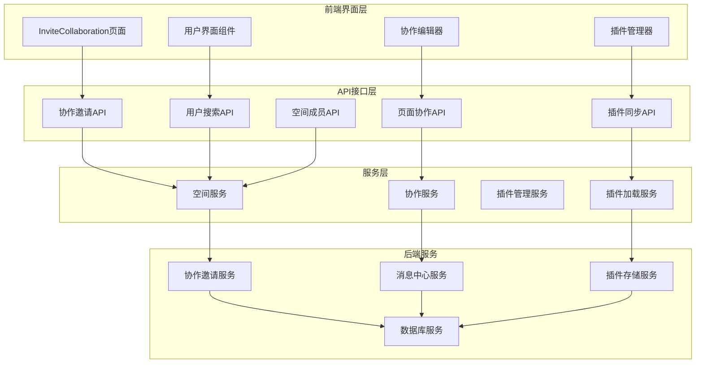
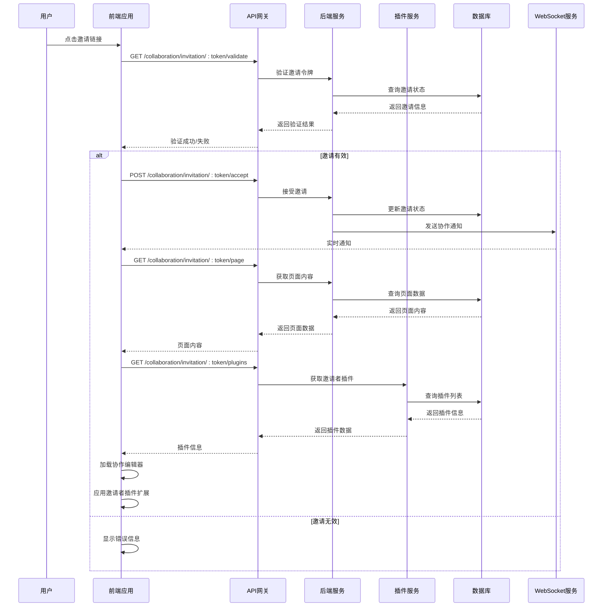
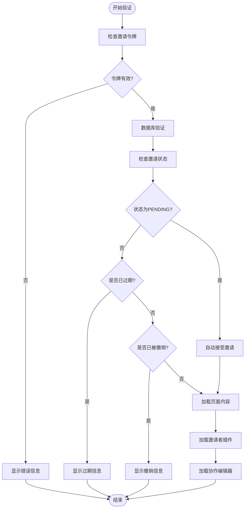
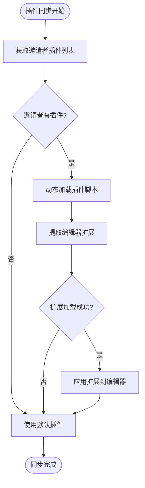
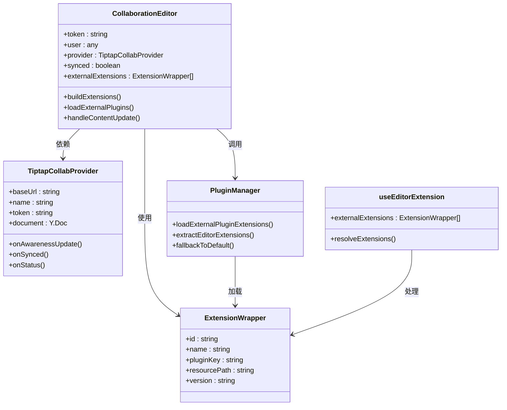

# 协作邀请API

<cite>
**本文档引用的文件**
- [COLLABORATION_API.md](file://packages/plugin-main/docs/COLLABORATION_API.md)
- [index.tsx](file://packages/plugin-main/src/pages/InviteCollaboration/index.tsx)
- [api/index.ts](file://packages/plugin-main/src/api/index.ts)
- [space-service.ts](file://packages/plugin-main/src/service/space-service.ts)
- [collaboration.tsx](file://packages/editor/src/editor/collaboration.tsx)
- [use-api.tsx](file://packages/core/src/hooks/use-api.tsx)
- [PluginManager.ts](file://packages/common/src/core/PluginManager.ts)
- [use-extension.ts](file://packages/editor/src/editor/use-extension.ts)
</cite>

## 更新摘要
**变更内容**
- 新增 GET_INVITER_PLUGINS 端点用于获取邀请者插件列表
- 新增插件同步功能确保邀请者和受邀者编辑器体验一致
- 更新协作编辑器以支持外部扩展加载
- 增强插件管理器的外部插件加载能力

## 目录
1. [简介](#简介)
2. [项目结构](#项目结构)
3. [核心组件](#核心组件)
4. [架构概览](#架构概览)
5. [详细组件分析](#详细组件分析)
6. [依赖关系分析](#依赖关系分析)
7. [性能考虑](#性能考虑)
8. [故障排除指南](#故障排除指南)
9. [结论](#结论)

## 简介

协作邀请API是知识库系统中一个重要的功能模块，允许用户邀请其他用户协作编辑页面内容。该功能实现了完整的协作邀请流程，包括用户搜索、邀请创建、实时通知、邀请接受和协作编辑等功能。

**更新** 新增了插件同步功能，确保邀请者和受邀者的编辑器体验保持一致。通过获取邀请者安装的插件列表并动态加载到受邀者的编辑器中，实现了无缝的协作体验。

本API文档基于项目中的协作邀请功能实现，涵盖了从邀请发起到协作编辑的完整生命周期管理，包括新增的插件同步机制。

## 项目结构

协作邀请功能主要分布在以下模块中：



**图表来源**
- [index.tsx](file://packages/plugin-main/src/pages/InviteCollaboration/index.tsx#L74-L495)
- [api/index.ts](file://packages/plugin-main/src/api/index.ts#L100-L171)
- [PluginManager.ts](file://packages/common/src/core/PluginManager.ts#L440-L484)

**章节来源**
- [index.tsx](file://packages/plugin-main/src/pages/InviteCollaboration/index.tsx#L1-L495)
- [api/index.ts](file://packages/plugin-main/src/api/index.ts#L1-L171)

## 核心组件

协作邀请API系统包含以下核心组件：

### 1. 邀请验证组件
负责处理邀请链接的有效性验证和状态检查

### 2. 协作编辑器
基于Yjs的实时协作编辑器，支持多用户同时编辑

### 3. 插件管理系统
动态加载邀请者安装的插件，确保编辑体验一致性

### 4. 实时通信组件
通过WebSocket实现实时通知和协作状态同步

### 5. 插件同步机制
**新增** 自动检测并加载邀请者插件，确保双方编辑器功能一致

**章节来源**
- [index.tsx](file://packages/plugin-main/src/pages/InviteCollaboration/index.tsx#L183-L240)
- [collaboration.tsx](file://packages/editor/src/editor/collaboration.tsx#L46-L162)
- [PluginManager.ts](file://packages/common/src/core/PluginManager.ts#L440-L484)

## 架构概览

协作邀请系统的整体架构采用分层设计，**更新** 新增了插件同步层：



**图表来源**
- [COLLABORATION_API.md](file://packages/plugin-main/docs/COLLABORATION_API.md#L537-L805)
- [index.tsx](file://packages/plugin-main/src/pages/InviteCollaboration/index.tsx#L183-L240)
- [PluginManager.ts](file://packages/common/src/core/PluginManager.ts#L440-L484)

## 详细组件分析

### 邀请验证流程

邀请验证是协作邀请流程的第一步，负责确保邀请链接的有效性和安全性：



**图表来源**
- [index.tsx](file://packages/plugin-main/src/pages/InviteCollaboration/index.tsx#L183-L240)

### 插件同步机制

**新增** 插件同步是协作邀请的核心功能，确保邀请者和受邀者拥有相同的编辑器体验：



**图表来源**
- [index.tsx](file://packages/plugin-main/src/pages/InviteCollaboration/index.tsx#L281-L298)
- [PluginManager.ts](file://packages/common/src/core/PluginManager.ts#L440-L484)

### 协作编辑器集成

协作编辑器通过外部扩展机制集成邀请者的插件：



**图表来源**
- [collaboration.tsx](file://packages/editor/src/editor/collaboration.tsx#L26-L162)
- [index.tsx](file://packages/plugin-main/src/pages/InviteCollaboration/index.tsx#L216-L232)
- [use-extension.ts](file://packages/editor/src/editor/use-extension.ts#L20-L64)

**章节来源**
- [index.tsx](file://packages/plugin-main/src/pages/InviteCollaboration/index.tsx#L183-L240)
- [collaboration.tsx](file://packages/editor/src/editor/collaboration.tsx#L46-L162)
- [PluginManager.ts](file://packages/common/src/core/PluginManager.ts#L440-L484)

### API接口定义

协作邀请API提供了完整的RESTful接口，**更新** 新增了插件同步相关接口：

| 接口名称 | 方法 | 路径 | 功能描述 |
|---------|------|------|----------|
| 创建邀请 | POST | `/knowledge-wiki/space/collaborationInvitation` | 发送协作邀请 |
| 验证邀请 | GET | `/knowledge-wiki/collaboration/invitation/:token/validate` | 验证邀请令牌 |
| 接受邀请 | POST | `/knowledge-wiki/collaboration/invitation/:token/accept` | 接受协作邀请 |
| 获取页面 | GET | `/knowledge-wiki/collaboration/invitation/:token/page` | 获取协作页面内容 |
| **获取邀请者插件** | **GET** | **`/knowledge-wiki/collaboration/invitation/:token/plugins`** | **获取邀请者插件列表** |
| 搜索用户 | GET | `/knowledge-system/user/search` | 搜索可邀请的用户 |
| 获取成员 | GET | `/knowledge-wiki/space/:id/members` | 获取空间成员列表 |

**章节来源**
- [api/index.ts](file://packages/plugin-main/src/api/index.ts#L100-L171)
- [COLLABORATION_API.md](file://packages/plugin-main/docs/COLLABORATION_API.md#L67-L198)

## 依赖关系分析

协作邀请系统涉及多个层面的依赖关系，**更新** 新增了插件同步相关依赖：

```mermaid
graph TB
subgraph "外部依赖"
A[Yjs协作框架]
B[@tiptap/extension-collaboration]
C[WebSocket连接]
D[HTTP客户端]
E[插件CDN服务]
end
subgraph "内部模块"
F[InviteCollaboration页面]
G[协作编辑器]
H[API服务层]
I[插件管理器]
J[协作服务]
K[插件加载服务]
end
subgraph "数据存储"
L[协作邀请表]
M[页面协作者表]
N[分享链接表]
O[用户插件表]
end
F --> G
F --> H
G --> A
G --> B
H --> I
H --> J
J --> K
K --> E
J --> L
J --> M
J --> N
I --> O
K --> O
H --> D
J --> C
```

**图表来源**
- [index.tsx](file://packages/plugin-main/src/pages/InviteCollaboration/index.tsx#L1-L495)
- [collaboration.tsx](file://packages/editor/src/editor/collaboration.tsx#L1-L162)
- [PluginManager.ts](file://packages/common/src/core/PluginManager.ts#L440-L484)

**章节来源**
- [index.tsx](file://packages/plugin-main/src/pages/InviteCollaboration/index.tsx#L1-L495)
- [collaboration.tsx](file://packages/editor/src/editor/collaboration.tsx#L1-L162)

## 性能考虑

协作邀请系统在设计时充分考虑了性能优化，**更新** 新增了插件同步相关的性能优化：

### 1. 插件加载优化
- 支持按需加载邀请者插件
- 提供插件加载失败的降级方案
- 缓存已加载的插件资源
- **新增** 异步加载避免阻塞主流程

### 2. 实时协作优化
- 使用增量更新减少网络传输
- 连接状态监控和自动重连机制
- 内存使用优化，避免泄漏

### 3. 前端性能优化
- 组件懒加载和代码分割
- 状态管理优化
- 渲染性能提升

### 4. 插件同步性能
- **新增** 并行加载多个插件脚本
- **新增** 插件缓存机制
- **新增** 失败重试和超时处理

## 故障排除指南

### 常见问题及解决方案

| 问题类型 | 症状 | 可能原因 | 解决方案 |
|---------|------|----------|----------|
| 邀请链接无效 | 显示"无效邀请" | 令牌格式错误或过期 | 检查URL参数，确认邀请未过期 |
| 邀请已过期 | 显示"邀请已过期" | 邀请超过有效期 | 重新发送邀请 |
| 邀请被撤销 | 显示"邀请已被撤销" | 邀请被原邀请者撤销 | 联系邀请者重新邀请 |
| **插件加载失败** | **编辑器功能不完整** | **外部插件加载失败** | **使用默认插件，联系管理员** |
| **插件同步超时** | **协作编辑器加载缓慢** | **插件CDN访问超时** | **检查网络连接，稍后重试** |
| 协作连接断开 | 编辑器无法同步 | 网络连接不稳定 | 检查网络，刷新页面重试 |

### 调试步骤

1. **检查网络连接**
   - 确认WebSocket连接正常
   - 验证API接口响应时间

2. **验证身份认证**
   - 确认用户已登录
   - 检查访问令牌有效性

3. **调试插件加载**
   - 查看浏览器控制台错误
   - 验证插件资源URL可达性
   - **新增** 检查插件CDN服务状态

4. **插件同步调试**
   - **新增** 查看插件加载日志
   - **新增** 验证插件版本兼容性
   - **新增** 检查跨域访问设置

**章节来源**
- [index.tsx](file://packages/plugin-main/src/pages/InviteCollaboration/index.tsx#L289-L313)
- [COLLABORATION_API.md](file://packages/plugin-main/docs/COLLABORATION_API.md#L613-L622)

## 结论

协作邀请API系统提供了一个完整、可靠的协作编辑解决方案，**更新** 新增的插件同步功能进一步提升了用户体验的一致性。通过精心设计的架构和完善的错误处理机制，该系统能够满足现代团队协作的需求。

### 主要优势

1. **完整的协作流程**：从邀请创建到编辑完成的全生命周期管理
2. **实时协作能力**：基于Yjs的实时同步技术
3. **插件兼容性**：动态插件加载确保编辑体验一致性
4. **用户体验友好**：直观的界面和流畅的操作体验
5. **可扩展性**：模块化设计便于功能扩展和维护
6. ****新增** 插件同步机制**：自动匹配邀请者和受邀者的编辑器功能

### 技术特点

- 采用React + TypeScript开发，类型安全
- 基于Yjs的实时协作框架，性能优异
- RESTful API设计，易于集成和扩展
- 完善的错误处理和状态管理
- 支持多种权限级别和协作模式
- **新增** 异步插件加载和缓存机制
- **新增** 插件版本管理和兼容性检查

该协作邀请API为知识库系统提供了强大的协作能力，能够有效提升团队的工作效率和协作体验。新增的插件同步功能确保了邀请者和受邀者在协作过程中拥有完全一致的编辑器体验，进一步增强了系统的实用性和用户体验。