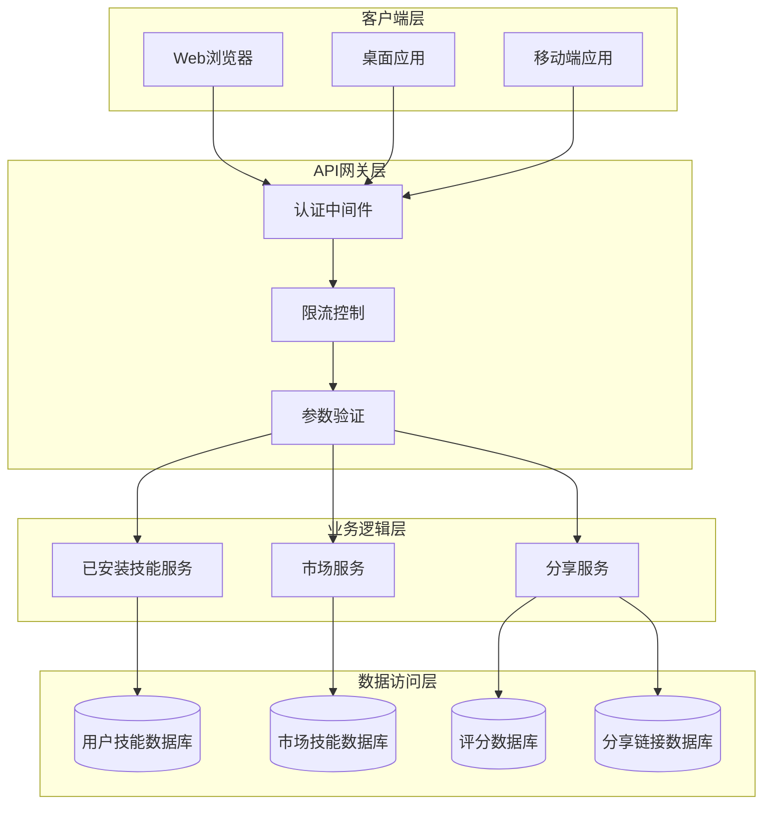
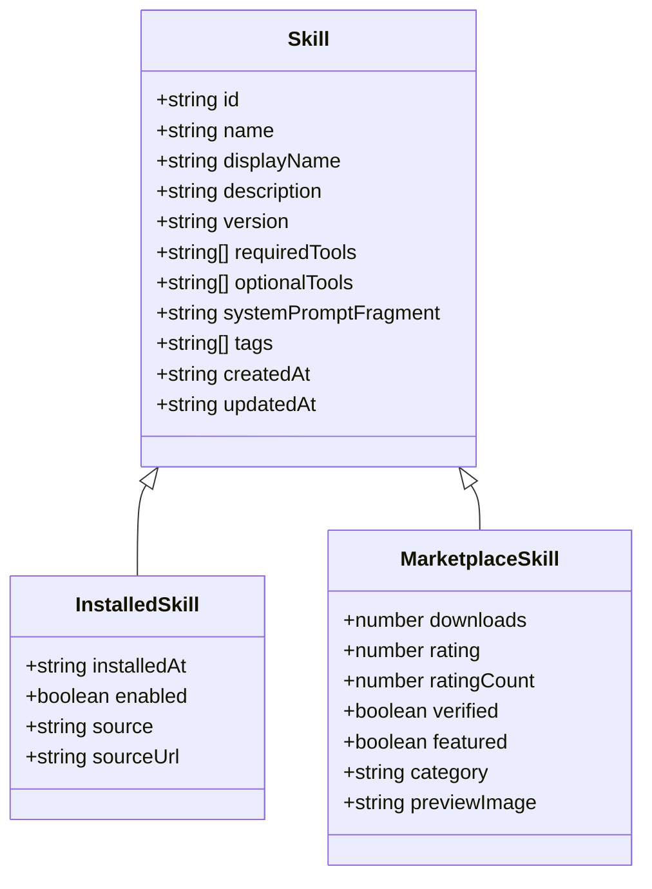
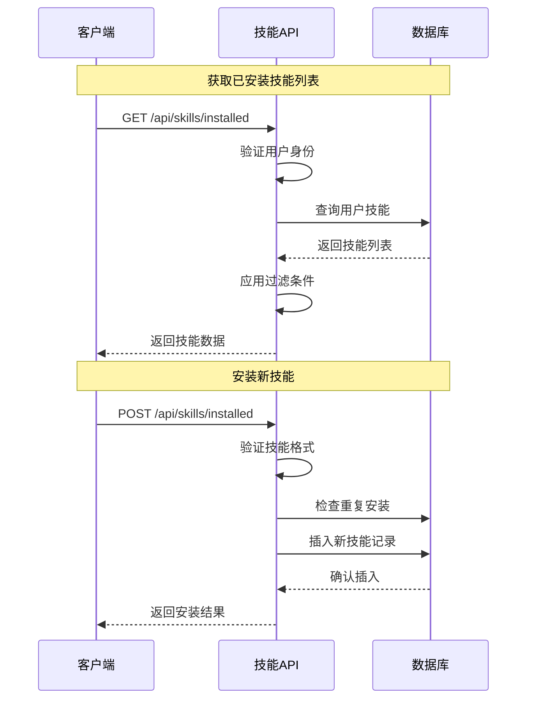
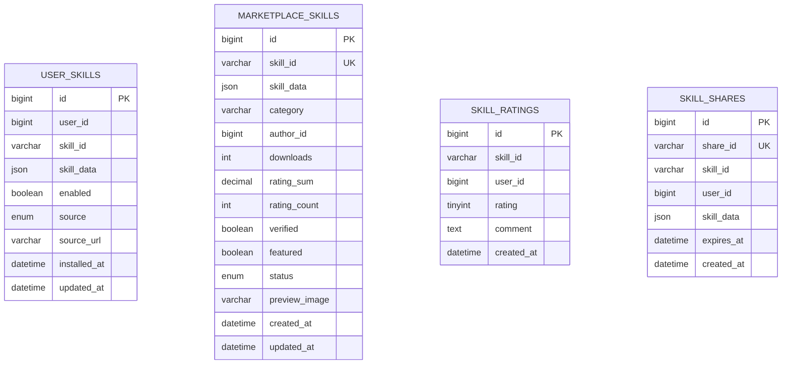
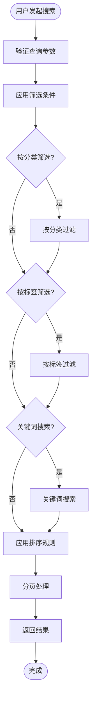
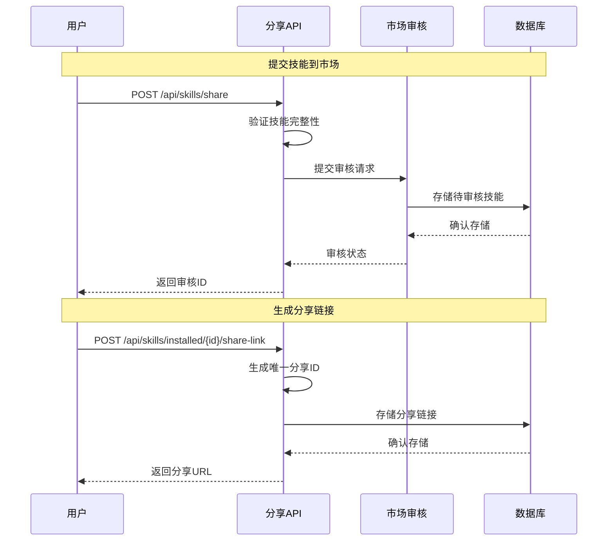

# 技能API接口文档

<cite>
**本文档引用的文件**
- [skills-api.md](file://docs/api/skills-api.md)
- [README.md](file://README.md)
- [package.json](file://package.json)
- [index.ts](file://packages/core/src/index.ts)
- [package.json](file://packages/core/package.json)
</cite>

## 目录
1. [简介](#简介)
2. [项目结构](#项目结构)
3. [核心组件](#核心组件)
4. [架构概览](#架构概览)
5. [详细组件分析](#详细组件分析)
6. [依赖关系分析](#依赖关系分析)
7. [性能考虑](#性能考虑)
8. [故障排除指南](#故障排除指南)
9. [结论](#结论)

## 简介

技能API接口是知识库平台的核心功能模块，提供用户自定义技能的完整生命周期管理。该系统支持技能的安装、卸载、启用/禁用、分享等操作，并提供技能市场功能，允许用户浏览、搜索和评价第三方技能。

**基础URL**: `/api/skills`

**认证方式**: Bearer Token (在Header中传递 `Authorization: Bearer <token>`)

## 项目结构

知识库项目采用现代化的Monorepo架构，使用Turborepo进行构建管理。技能API作为核心功能模块，位于packages/core包中，与前端应用通过统一的API接口进行交互。

```mermaid
graph TB
subgraph "应用层"
Vite[Vite应用]
Landing[Landing页面]
Desktop[桌面应用]
end
subgraph "核心包"
Core[@kn/core 核心包]
Common[@kn/common 公共包]
UI[@kn/ui 组件库]
end
subgraph "插件系统"
PluginAI[AI插件]
PluginMain[主插件]
PluginEditor[编辑器插件]
end
subgraph "API服务"
SkillsAPI[技能API]
AuthAPI[认证API]
RoomServer[协作服务器]
end
Vite --> Core
Landing --> Core
Desktop --> Core
Core --> SkillsAPI
Core --> AuthAPI
Core --> RoomServer
PluginAI --> Core
PluginMain --> Core
PluginEditor --> Core
```

**图表来源**
- [README.md](file://README.md#L66-L97)
- [package.json](file://package.json#L1-L120)

**章节来源**
- [README.md](file://README.md#L66-L97)
- [package.json](file://package.json#L1-L120)

## 核心组件

技能API系统包含三个主要组件：

### 1. 已安装技能管理
负责用户本地技能的存储和管理，支持批量同步、状态更新等功能。

### 2. 技能市场
提供技能发现和分发功能，包含技能浏览、搜索、评价等市场功能。

### 3. 技能分享
支持技能的分享和导入，包括市场审核和直接分享两种模式。

**章节来源**
- [skills-api.md](file://docs/api/skills-api.md#L64-L593)

## 架构概览

技能API采用分层架构设计，确保功能模块的清晰分离和良好的可维护性。



**图表来源**
- [skills-api.md](file://docs/api/skills-api.md#L653-L731)

## 详细组件分析

### 已安装技能管理

已安装技能管理是技能API的核心功能，提供完整的技能生命周期管理。

#### 数据模型



**图表来源**
- [skills-api.md](file://docs/api/skills-api.md#L15-L58)

#### API接口流程



**图表来源**
- [skills-api.md](file://docs/api/skills-api.md#L66-L284)

**章节来源**
- [skills-api.md](file://docs/api/skills-api.md#L64-L284)

### 技能市场功能

技能市场提供技能发现和分发机制，支持多种筛选和排序功能。

#### 市场技能数据模型



**图表来源**
- [skills-api.md](file://docs/api/skills-api.md#L653-L731)

#### 市场搜索流程



**图表来源**
- [skills-api.md](file://docs/api/skills-api.md#L313-L367)

**章节来源**
- [skills-api.md](file://docs/api/skills-api.md#L311-L494)

### 技能分享机制

技能分享功能支持两种分享模式：市场审核分享和直接分享链接。

#### 分享流程



**图表来源**
- [skills-api.md](file://docs/api/skills-api.md#L529-L619)

**章节来源**
- [skills-api.md](file://docs/api/skills-api.md#L529-L619)

## 依赖关系分析

技能API系统依赖于多个核心包和外部服务，形成完整的功能生态系统。

```mermaid
graph LR
subgraph "核心依赖"
React[React 18]
TypeScript[TypeScript 5]
Redux[Redux状态管理]
Axios[Axios HTTP客户端]
end
subgraph "UI组件"
Tailwind[Tailwind CSS]
ShadcnUI[shadcn/ui]
Tiptap[Tiptap编辑器]
end
subgraph "AI集成"
VercelSDK[Vercel AI SDK]
DeepSeek[DeepSeek AI]
Anthropic[Anthropic]
end
subgraph "工具库"
Lodash[Lodash工具库]
Moment[Moment.js]
UUID[UUID生成器]
end
CorePackage[@kn/core] --> React
CorePackage --> Redux
CorePackage --> Axios
CorePackage --> Tailwind
CorePackage --> ShadcnUI
CorePackage --> VercelSDK
CorePackage --> DeepSeek
CorePackage --> Lodash
CorePackage --> Moment
CorePackage --> UUID
```

**图表来源**
- [package.json](file://packages/core/package.json#L17-L33)
- [README.md](file://README.md#L43-L65)

**章节来源**
- [package.json](file://packages/core/package.json#L1-L42)
- [README.md](file://README.md#L43-L65)

## 性能考虑

技能API系统在设计时充分考虑了性能优化，特别是在高并发场景下的表现。

### 缓存策略
- 市场技能列表采用多级缓存机制
- 用户技能列表支持客户端缓存
- 图片资源使用CDN加速

### 数据库优化
- 用户技能表建立复合索引
- 市场技能表使用分区查询
- 评分数据采用聚合存储

### 并发控制
- 限流机制防止API滥用
- 连接池管理数据库连接
- 异步处理耗时操作

## 故障排除指南

### 常见错误及解决方案

| 错误代码 | HTTP状态码 | 描述 | 解决方案 |
|---------|-----------|------|---------|
| UNAUTHORIZED | 401 | 未授权访问 | 检查Bearer Token有效性 |
| SKILL_NOT_FOUND | 404 | 技能不存在 | 验证技能ID正确性 |
| SKILL_ALREADY_INSTALLED | 409 | 技能已安装 | 检查用户技能列表 |
| INVALID_SKILL_FORMAT | 400 | 技能格式无效 | 验证技能JSON结构 |
| SHARE_LINK_EXPIRED | 410 | 分享链接已过期 | 重新生成分享链接 |

### 调试建议

1. **网络请求调试**
   - 检查API响应头中的Content-Type
   - 验证请求参数的完整性和格式
   - 监控API响应时间

2. **数据库问题排查**
   - 检查用户技能表的索引使用情况
   - 验证市场技能数据的完整性
   - 监控数据库连接池状态

3. **性能问题诊断**
   - 分析慢查询日志
   - 检查缓存命中率
   - 监控内存使用情况

**章节来源**
- [skills-api.md](file://docs/api/skills-api.md#L623-L649)

## 结论

技能API接口文档全面描述了知识库平台的技能管理系统，包括完整的API规范、数据模型设计和最佳实践指导。该系统采用现代化的架构设计，支持高并发访问和良好的扩展性。

通过标准化的接口设计和完善的错误处理机制，技能API为用户提供了灵活、可靠的技能管理体验。同时，系统的模块化设计也为未来的功能扩展和技术演进奠定了坚实的基础。

建议开发者在集成时重点关注：
- 认证机制的正确实现
- 数据验证和错误处理
- 性能优化和缓存策略
- 安全性考虑和权限控制