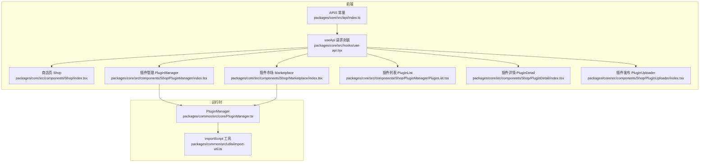
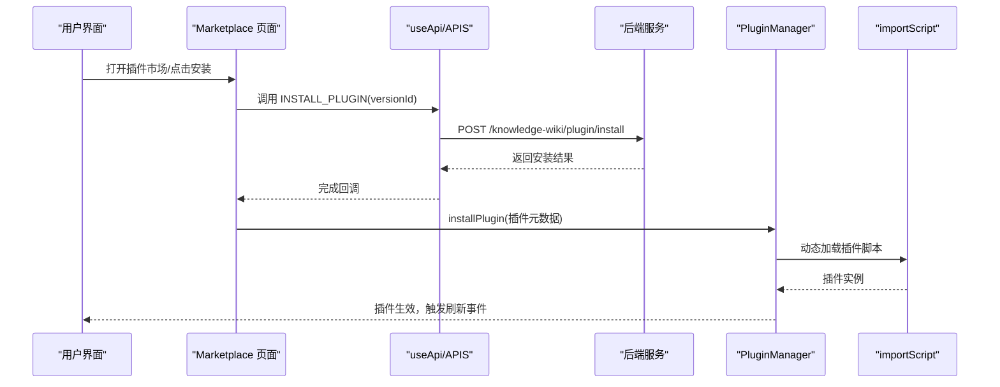
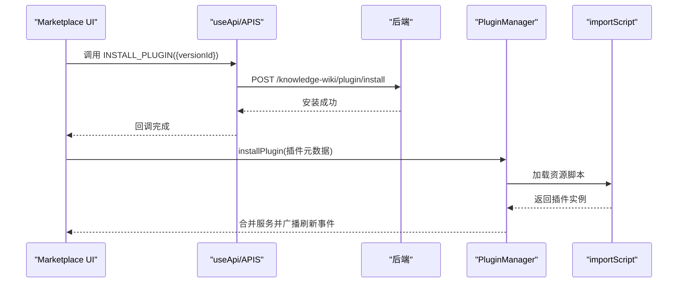
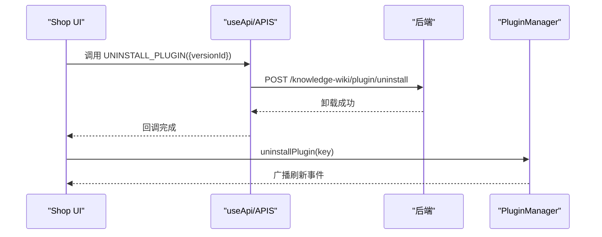
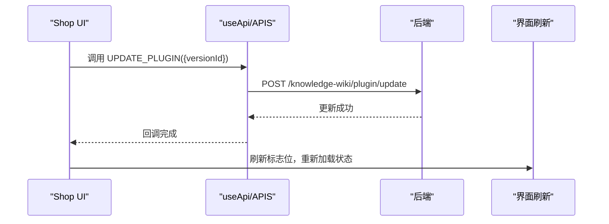
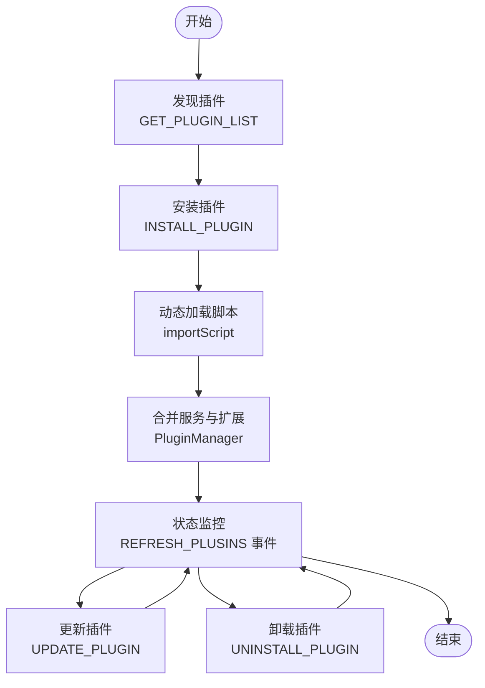
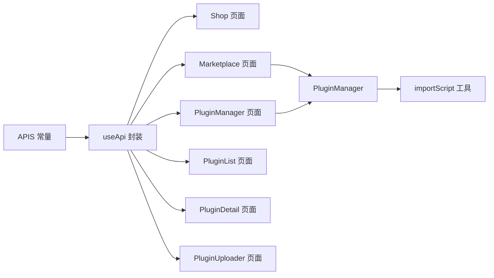

# 插件管理API

<cite>
**本文引用的文件**
- [packages/core/src/api/index.ts](file://packages/core/src/api/index.ts)
- [packages/core/src/hooks/use-api.tsx](file://packages/core/src/hooks/use-api.tsx)
- [packages/core/src/components/Shop/index.tsx](file://packages/core/src/components/Shop/index.tsx)
- [packages/core/src/components/Shop/Marketplace/index.tsx](file://packages/core/src/components/Shop/Marketplace/index.tsx)
- [packages/core/src/components/Shop/PluginManager/index.tsx](file://packages/core/src/components/Shop/PluginManager/index.tsx)
- [packages/core/src/components/Shop/PluginManager/PluginList.tsx](file://packages/core/src/components/Shop/PluginManager/PluginList.tsx)
- [packages/core/src/components/Shop/PluginDetail/index.tsx](file://packages/core/src/components/Shop/PluginDetail/index.tsx)
- [packages/core/src/components/Shop/PluginUploader/index.tsx](file://packages/core/src/components/Shop/PluginUploader/index.tsx)
- [packages/common/src/core/PluginManager.ts](file://packages/common/src/core/PluginManager.ts)
- [packages/common/src/utils/import-util.ts](file://packages/common/src/utils/import-util.ts)
- [packages/core/src/utils/utils.ts](file://packages/core/src/utils/utils.ts)
- [packages/core/src/App.tsx](file://packages/core/src/App.tsx)
</cite>

## 目录
1. [简介](#简介)
2. [项目结构](#项目结构)
3. [核心组件](#核心组件)
4. [架构总览](#架构总览)
5. [详细组件分析](#详细组件分析)
6. [依赖分析](#依赖分析)
7. [性能考虑](#性能考虑)
8. [故障排查指南](#故障排查指南)
9. [结论](#结论)
10. [附录](#附录)

## 简介
本文件面向知识库管理系统中的“插件管理API”，系统化梳理并说明以下能力与流程：
- 插件列表获取：GET_PLUGIN_LIST
- 已安装插件查询：GET_INSTALLED_PLUGINS
- 插件安装：INSTALL_PLUGIN
- 插件卸载：UNINSTALL_PLUGIN
- 插件更新：UPDATE_PLUGIN
- 插件创建：CREATE_PLUGIN（含开发规范与发布流程）
- 生命周期示例：插件发现、安装配置、状态监控
- 安全验证、权限控制与版本兼容性管理

上述接口在前端通过统一的 useApi 封装调用，后端路由由 APIS 常量定义；插件运行时由 PluginManager 负责加载、合并服务与事件通知。

## 项目结构
围绕插件管理API的关键目录与文件如下：
- API定义与封装
  - packages/core/src/api/index.ts：集中声明各API常量（包含 GET_PLUGIN_LIST、INSTALL_PLUGIN、GET_INSTALLED_PLUGINS、CREATE_PLUGIN、UNINSTALL_PLUGIN、UPDATE_PLUGIN）
  - packages/core/src/hooks/use-api.tsx：通用请求封装，支持路径参数填充与不同HTTP方法
- 前端页面与交互
  - packages/core/src/components/Shop/index.tsx：商店页，包含卸载确认、更新触发等
  - packages/core/src/components/Shop/Marketplace/index.tsx：插件市场页，负责拉取插件列表与安装
  - packages/core/src/components/Shop/PluginManager/index.tsx：插件管理弹窗，展示插件列表
  - packages/core/src/components/Shop/PluginManager/PluginList.tsx：插件列表与发布新版本入口
  - packages/core/src/components/Shop/PluginDetail/index.tsx：插件详情页，展示版本描述
  - packages/core/src/components/Shop/PluginUploader/index.tsx：插件发布向导（多步骤）
- 运行时插件管理
  - packages/common/src/core/PluginManager.ts：插件初始化、安装、卸载、服务合并、事件广播
  - packages/common/src/utils/import-util.ts 与 packages/core/src/utils/utils.ts：动态加载脚本工具
- 应用集成
  - packages/core/src/App.tsx：路由挂载、国际化与插件路由注入、事件监听

图表来源
- [packages/core/src/api/index.ts](file://packages/core/src/api/index.ts#L1-L49)
- [packages/core/src/hooks/use-api.tsx](file://packages/core/src/hooks/use-api.tsx#L1-L51)
- [packages/core/src/components/Shop/index.tsx](file://packages/core/src/components/Shop/index.tsx#L110-L210)
- [packages/core/src/components/Shop/Marketplace/index.tsx](file://packages/core/src/components/Shop/Marketplace/index.tsx#L33-L61)
- [packages/core/src/components/Shop/PluginManager/index.tsx](file://packages/core/src/components/Shop/PluginManager/index.tsx#L1-L32)
- [packages/core/src/components/Shop/PluginManager/PluginList.tsx](file://packages/core/src/components/Shop/PluginManager/PluginList.tsx#L37-L95)
- [packages/core/src/components/Shop/PluginDetail/index.tsx](file://packages/core/src/components/Shop/PluginDetail/index.tsx#L1-L85)
- [packages/core/src/components/Shop/PluginUploader/index.tsx](file://packages/core/src/components/Shop/PluginUploader/index.tsx#L1-L297)
- [packages/common/src/core/PluginManager.ts](file://packages/common/src/core/PluginManager.ts#L63-L170)
- [packages/common/src/utils/import-util.ts](file://packages/common/src/utils/import-util.ts#L1-L23)

章节来源
- [packages/core/src/api/index.ts](file://packages/core/src/api/index.ts#L1-L49)
- [packages/core/src/hooks/use-api.tsx](file://packages/core/src/hooks/use-api.tsx#L1-L51)
- [packages/common/src/core/PluginManager.ts](file://packages/common/src/core/PluginManager.ts#L63-L170)

## 核心组件
- APIS 常量：集中定义所有插件相关API的URL、方法与名称，便于统一调用与维护。
- useApi：对请求进行统一封装，自动处理路径参数替换、不同HTTP方法与默认头部。
- PluginManager：负责远程插件的初始化、安装、卸载、服务合并与事件广播，动态加载插件资源。

章节来源
- [packages/core/src/api/index.ts](file://packages/core/src/api/index.ts#L1-L49)
- [packages/core/src/hooks/use-api.tsx](file://packages/core/src/hooks/use-api.tsx#L1-L51)
- [packages/common/src/core/PluginManager.ts](file://packages/common/src/core/PluginManager.ts#L63-L170)

## 架构总览
下图展示了从UI到运行时插件管理的整体调用链路与数据流：

图表来源
- [packages/core/src/components/Shop/Marketplace/index.tsx](file://packages/core/src/components/Shop/Marketplace/index.tsx#L33-L61)
- [packages/core/src/api/index.ts](file://packages/core/src/api/index.ts#L21-L48)
- [packages/core/src/hooks/use-api.tsx](file://packages/core/src/hooks/use-api.tsx#L24-L51)
- [packages/common/src/core/PluginManager.ts](file://packages/common/src/core/PluginManager.ts#L105-L112)
- [packages/common/src/utils/import-util.ts](file://packages/common/src/utils/import-util.ts#L1-L23)

## 详细组件分析

### 接口清单与调用方式

- 获取插件列表：GET_PLUGIN_LIST
  - 方法与URL：GET /knowledge-wiki/plugin
  - 参数：可选分页与分类参数（如 pageSize、category）
  - 使用位置：
    - 商店页：packages/core/src/components/Shop/PluginManager/index.tsx
    - 市场页：packages/core/src/components/Shop/Marketplace/index.tsx
  - 返回：插件记录列表，用于渲染市场与管理界面

- 已安装插件查询：GET_INSTALLED_PLUGINS
  - 方法与URL：GET /knowledge-wiki/plugin/install/list
  - 使用位置：packages/core/src/api/index.ts 中定义
  - 用途：查询当前已安装插件集合，供状态展示与后续操作判断

- 安装插件：INSTALL_PLUGIN
  - 方法与URL：POST /knowledge-wiki/plugin/install
  - 必填参数：versionId（目标版本标识）
  - 流程要点：
    - 前端调用后端安装接口
    - 成功后由 PluginManager 动态加载插件资源并合并服务
  - 使用位置：
    - 市场页安装流程：packages/core/src/components/Shop/Marketplace/index.tsx

- 卸载插件：UNINSTALL_PLUGIN
  - 方法与URL：POST /knowledge-wiki/plugin/uninstall
  - 必填参数：versionId（待卸载版本标识）
  - 行为：调用后移除插件实例并广播刷新事件
  - 使用位置：packages/core/src/components/Shop/index.tsx

- 更新插件：UPDATE_PLUGIN
  - 方法与URL：POST /knowledge-wiki/plugin/update
  - 必填参数：versionId（目标版本标识）
  - 行为：调用后触发刷新标志，促使界面重新加载最新状态
  - 使用位置：packages/core/src/components/Shop/index.tsx

- 创建插件（发布新版本）：CREATE_PLUGIN
  - 方法与URL：POST /knowledge-wiki/plugin
  - 参数要点（来自发布向导）：
    - id：插件唯一标识（可选）
    - resourcePath：插件资源文件名（上传后返回的名称）
    - publish：是否直接发布（布尔）
    - versionDescs：版本描述数组，每项包含 label 与 content（content 为JSON字符串）
  - 发布流程（向导步骤）：
    1) 填写基本信息（名称、插件Key、版本、标签、描述）
    2) 上传图标（多尺寸）
    3) 编辑版本描述（Feature、Detail、ChangeLog等）
    4) 上传插件JS资源文件（限制大小与类型）
    5) 提交审核
  - 使用位置：
    - 发布向导：packages/core/src/components/Shop/PluginUploader/index.tsx
    - 插件列表发布入口：packages/core/src/components/Shop/PluginManager/PluginList.tsx

章节来源
- [packages/core/src/api/index.ts](file://packages/core/src/api/index.ts#L21-L48)
- [packages/core/src/components/Shop/Marketplace/index.tsx](file://packages/core/src/components/Shop/Marketplace/index.tsx#L33-L61)
- [packages/core/src/components/Shop/index.tsx](file://packages/core/src/components/Shop/index.tsx#L110-L210)
- [packages/core/src/components/Shop/PluginManager/PluginList.tsx](file://packages/core/src/components/Shop/PluginManager/PluginList.tsx#L37-L95)
- [packages/core/src/components/Shop/PluginUploader/index.tsx](file://packages/core/src/components/Shop/PluginUploader/index.tsx#L1-L297)

### 安装流程（INSTALL_PLUGIN）

图表来源
- [packages/core/src/components/Shop/Marketplace/index.tsx](file://packages/core/src/components/Shop/Marketplace/index.tsx#L33-L61)
- [packages/core/src/api/index.ts](file://packages/core/src/api/index.ts#L25-L28)
- [packages/common/src/core/PluginManager.ts](file://packages/common/src/core/PluginManager.ts#L105-L112)
- [packages/common/src/utils/import-util.ts](file://packages/common/src/utils/import-util.ts#L1-L23)

### 卸载流程（UNINSTALL_PLUGIN）

图表来源
- [packages/core/src/components/Shop/index.tsx](file://packages/core/src/components/Shop/index.tsx#L193-L210)
- [packages/core/src/api/index.ts](file://packages/core/src/api/index.ts#L41-L44)
- [packages/common/src/core/PluginManager.ts](file://packages/common/src/core/PluginManager.ts#L99-L103)

### 更新流程（UPDATE_PLUGIN）

图表来源
- [packages/core/src/components/Shop/index.tsx](file://packages/core/src/components/Shop/index.tsx#L127-L131)
- [packages/core/src/api/index.ts](file://packages/core/src/api/index.ts#L45-L48)

### 创建插件（CREATE_PLUGIN）开发规范与发布流程

- 开发规范
  - 插件需导出一个符合约定的包名（packageName），以便运行时通过 window[packageName] 获取插件实例
  - 插件资源文件应为 JS 脚本，遵循统一的模块加载与命名规范
  - 插件应提供必要的服务与扩展点，以便 PluginManager 合并其服务与路由

- 发布流程（向导）
  1) 填写基本信息：名称、插件Key、版本、标签、描述
  2) 上传图标：支持多尺寸（64x64、100x100、120x120、150x150）
  3) 编辑版本描述：Feature、Detail、ChangeLog 等
  4) 上传插件资源：限制大小与类型（仅允许文本JavaScript）
  5) 提交审核：调用 CREATE_PLUGIN 完成发布

- 参数说明
  - id：插件唯一标识（可选）
  - resourcePath：上传后的资源文件名
  - publish：是否直接发布
  - versionDescs：版本描述数组，每项包含 label 与 content（content 为JSON字符串）

章节来源
- [packages/core/src/components/Shop/PluginUploader/index.tsx](file://packages/core/src/components/Shop/PluginUploader/index.tsx#L1-L297)
- [packages/core/src/components/Shop/PluginManager/PluginList.tsx](file://packages/core/src/components/Shop/PluginManager/PluginList.tsx#L37-L95)
- [packages/common/src/utils/import-util.ts](file://packages/common/src/utils/import-util.ts#L1-L23)

### 插件生命周期管理示例

- 插件发现
  - 通过 GET_PLUGIN_LIST 拉取可用插件列表，渲染至市场或管理界面
  - 可结合分类与分页参数筛选

- 安装配置
  - 调用 INSTALL_PLUGIN 完成后，由 PluginManager 动态加载插件脚本
  - 插件实例的服务与扩展将被合并入全局服务与编辑器扩展

- 状态监控
  - 卸载与更新均会触发 REFRESH_PLUSINS 事件，监听该事件的组件会刷新状态
  - 插件详情页可展示下载量、评分、版本描述等信息

图表来源
- [packages/core/src/api/index.ts](file://packages/core/src/api/index.ts#L21-L48)
- [packages/common/src/core/PluginManager.ts](file://packages/common/src/core/PluginManager.ts#L78-L112)
- [packages/core/src/components/Shop/index.tsx](file://packages/core/src/components/Shop/index.tsx#L110-L210)

## 依赖分析

图表来源
- [packages/core/src/api/index.ts](file://packages/core/src/api/index.ts#L1-L49)
- [packages/core/src/hooks/use-api.tsx](file://packages/core/src/hooks/use-api.tsx#L1-L51)
- [packages/common/src/core/PluginManager.ts](file://packages/common/src/core/PluginManager.ts#L63-L170)
- [packages/common/src/utils/import-util.ts](file://packages/common/src/utils/import-util.ts#L1-L23)

章节来源
- [packages/core/src/api/index.ts](file://packages/core/src/api/index.ts#L1-L49)
- [packages/core/src/hooks/use-api.tsx](file://packages/core/src/hooks/use-api.tsx#L1-L51)
- [packages/common/src/core/PluginManager.ts](file://packages/common/src/core/PluginManager.ts#L63-L170)

## 性能考虑
- 资源缓存：动态加载脚本时通过缓存避免重复请求，提升二次安装与切换性能
- 并行加载：初始化阶段对多个插件采用并行加载策略，缩短整体初始化时间
- 事件驱动刷新：通过事件机制统一刷新，减少不必要的全量重渲染

章节来源
- [packages/common/src/core/PluginManager.ts](file://packages/common/src/core/PluginManager.ts#L78-L97)
- [packages/common/src/utils/import-util.ts](file://packages/common/src/utils/import-util.ts#L1-L23)

## 故障排查指南
- 安装失败
  - 检查 INSTALL_PLUGIN 的 versionId 是否正确
  - 查看后端返回状态与错误信息
  - 确认插件资源路径与包名一致，确保 importScript 能成功解析

- 卸载无效
  - 确认 UNINSTALL_PLUGIN 的 versionId 正确
  - 检查 REFRESH_PLUSINS 事件是否被监听与触发

- 更新未生效
  - 确认 UPDATE_PLUGIN 调用成功
  - 检查界面刷新逻辑是否基于刷新标志位重新加载

- 发布异常
  - 确认上传的资源文件类型与大小符合要求
  - 检查版本描述内容是否为合法JSON字符串

章节来源
- [packages/core/src/components/Shop/Marketplace/index.tsx](file://packages/core/src/components/Shop/Marketplace/index.tsx#L33-L61)
- [packages/core/src/components/Shop/index.tsx](file://packages/core/src/components/Shop/index.tsx#L110-L210)
- [packages/core/src/components/Shop/PluginUploader/index.tsx](file://packages/core/src/components/Shop/PluginUploader/index.tsx#L224-L236)

## 结论
本文档系统性地梳理了知识库管理系统的插件管理API，覆盖了从插件发现、安装、更新、卸载到创建发布的完整流程，并对运行时插件管理与事件机制进行了深入分析。建议在实际接入时严格遵循参数规范与开发规范，确保插件资源的稳定性与安全性。

## 附录

### API定义速览
- GET_PLUGIN_LIST：获取插件列表（支持分页与分类）
- GET_INSTALLED_PLUGINS：获取已安装插件列表
- INSTALL_PLUGIN：安装指定版本插件
- UNINSTALL_PLUGIN：卸载指定版本插件
- UPDATE_PLUGIN：更新指定版本插件
- CREATE_PLUGIN：创建插件并提交审核（支持多步骤发布）

章节来源
- [packages/core/src/api/index.ts](file://packages/core/src/api/index.ts#L21-L48)