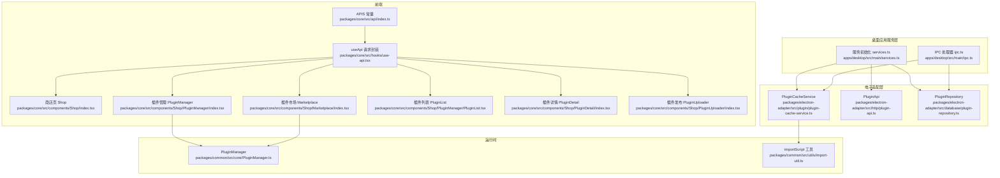
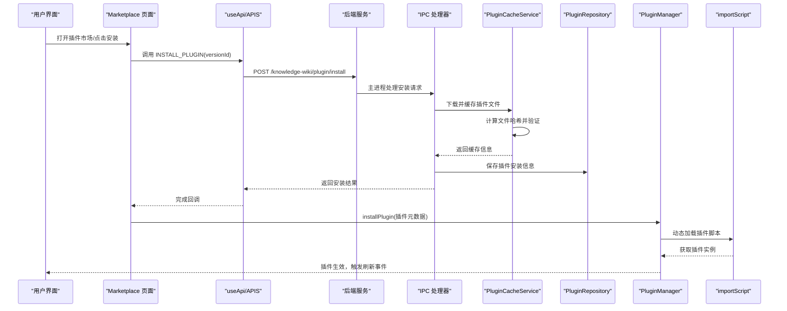
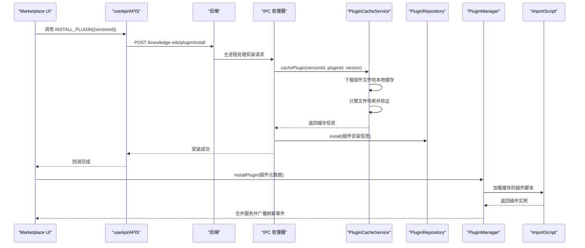
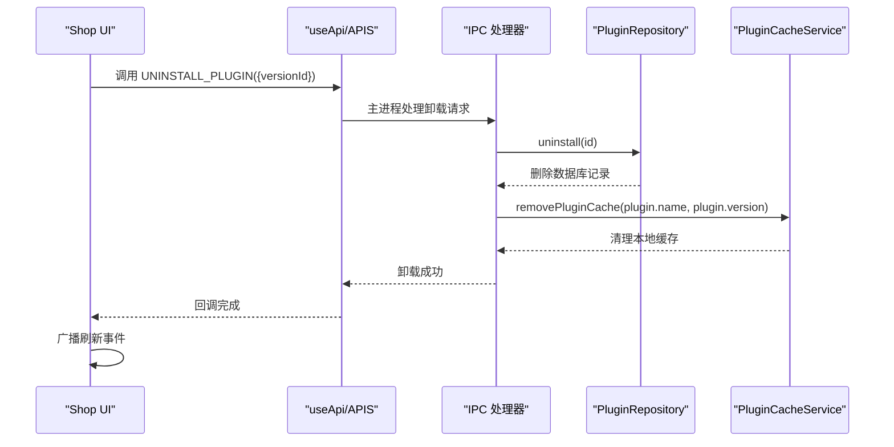
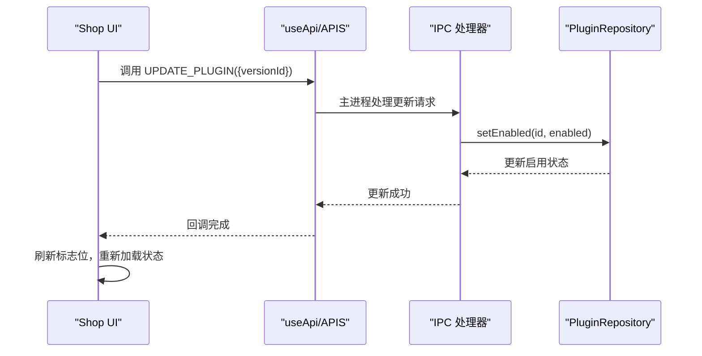
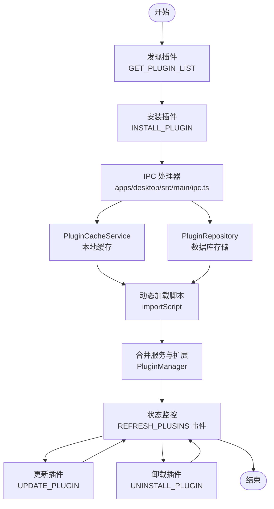
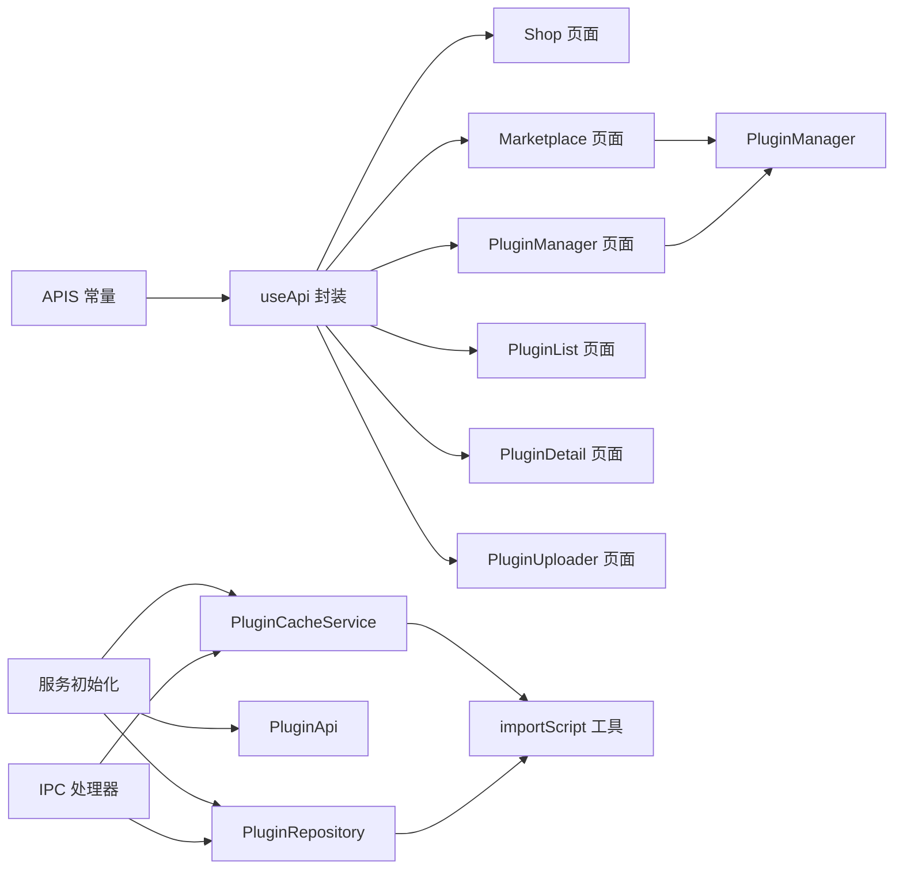

# 插件管理API

<cite>
**本文引用的文件**
- [packages/core/src/api/index.ts](file://packages/core/src/api/index.ts)
- [packages/core/src/hooks/use-api.tsx](file://packages/core/src/hooks/use-api.tsx)
- [packages/core/src/components/Shop/index.tsx](file://packages/core/src/components/Shop/index.tsx)
- [packages/core/src/components/Shop/Marketplace/index.tsx](file://packages/core/src/components/Shop/Marketplace/index.tsx)
- [packages/core/src/components/Shop/PluginManager/index.tsx](file://packages/core/src/components/Shop/PluginManager/index.tsx)
- [packages/core/src/components/Shop/PluginManager/PluginList.tsx](file://packages/core/src/components/Shop/PluginManager/PluginList.tsx)
- [packages/core/src/components/Shop/PluginDetail/index.tsx](file://packages/core/src/components/Shop/PluginDetail/index.tsx)
- [packages/core/src/components/Shop/PluginUploader/index.tsx](file://packages/core/src/components/Shop/PluginUploader/index.tsx)
- [packages/common/src/core/PluginManager.ts](file://packages/common/src/core/PluginManager.ts)
- [packages/common/src/utils/import-util.ts](file://packages/common/src/utils/import-util.ts)
- [packages/core/src/utils/utils.ts](file://packages/core/src/utils/utils.ts)
- [packages/core/src/App.tsx](file://packages/core/src/App.tsx)
- [packages/plugin-main/src/index.tsx](file://packages/plugin-main/src/index.tsx)
- [packages/plugin-ai/src/index.tsx](file://packages/plugin-ai/src/index.tsx)
- [packages/plugin-bilibili/src/index.tsx](file://packages/plugin-bilibili/src/index.tsx)
- [packages/electron-adapter/src/plugin/plugin-cache-service.ts](file://packages/electron-adapter/src/plugin/plugin-cache-service.ts)
- [packages/electron-adapter/src/http/plugin-api.ts](file://packages/electron-adapter/src/http/plugin-api.ts)
- [packages/electron-adapter/src/database/plugin-repository.ts](file://packages/electron-adapter/src/database/plugin-repository.ts)
- [apps/desktop/src/main/services.ts](file://apps/desktop/src/main/services.ts)
- [apps/desktop/src/main/ipc.ts](file://apps/desktop/src/main/ipc.ts)
</cite>

## 更新摘要
**所做更改**
- 更新了插件管理架构，从分布式IPC模式迁移到集中式服务架构
- 新增了PluginCacheService缓存服务的详细说明
- 完善了插件安装流程的本地缓存机制
- 更新了插件管理API的实现细节和安全验证机制
- 新增了数据库层的插件存储和缓存管理
- 完善了插件生命周期管理的详细说明

## 目录
1. [简介](#简介)
2. [项目结构](#项目结构)
3. [核心组件](#核心组件)
4. [架构总览](#架构总览)
5. [详细组件分析](#详细组件分析)
6. [依赖分析](#依赖分析)
7. [性能考虑](#性能考虑)
8. [故障排查指南](#故障排查指南)
9. [结论](#结论)
10. [附录](#附录)

## 简介
本文件面向知识库管理系统中的"插件管理API"，系统化梳理并说明以下能力与流程：
- 插件列表获取：GET_PLUGIN_LIST
- 已安装插件查询：GET_INSTALLED_PLUGINS
- 插件安装：INSTALL_PLUGIN
- 插件卸载：UNINSTALL_PLUGIN
- 插件更新：UPDATE_PLUGIN
- 插件创建：CREATE_PLUGIN（含开发规范与发布流程）
- 生命周期示例：插件发现、安装配置、状态监控
- 安全验证、权限控制与版本兼容性管理

**重要变更**：插件管理架构已从分布式IPC模式完全迁移到集中式服务架构，通过electron-adapter的PluginCacheService实现本地缓存和数据库管理，提升了系统的稳定性和性能。

上述接口在前端通过统一的 useApi 封装调用，后端路由由 APIS 常量定义；插件运行时由 PluginManager 负责加载、合并服务与事件通知。

## 项目结构
围绕插件管理API的关键目录与文件如下：
- API定义与封装
  - packages/core/src/api/index.ts：集中声明各API常量（包含 GET_PLUGIN_LIST、INSTALL_PLUGIN、GET_INSTALLED_PLUGINS、CREATE_PLUGIN、UNINSTALL_PLUGIN、UPDATE_PLUGIN）
  - packages/core/src/hooks/use-api.tsx：通用请求封装，支持路径参数填充与不同HTTP方法
- 前端页面与交互
  - packages/core/src/components/Shop/index.tsx：商店页，包含卸载确认、更新触发等
  - packages/core/src/components/Shop/Marketplace/index.tsx：插件市场页，负责拉取插件列表与安装
  - packages/core/src/components/Shop/PluginManager/index.tsx：插件管理弹窗，展示插件列表
  - packages/core/src/components/Shop/PluginManager/PluginList.tsx：插件列表与发布新版本入口
  - packages/core/src/components/Shop/PluginDetail/index.tsx：插件详情页，展示版本描述
  - packages/core/src/components/Shop/PluginUploader/index.tsx：插件发布向导（多步骤）
- 运行时插件管理
  - packages/common/src/core/PluginManager.ts：插件初始化、安装、卸载、服务合并、事件广播
  - packages/common/src/utils/import-util.ts 与 packages/core/src/utils/utils.ts：动态加载脚本工具
- 桌面应用服务层
  - apps/desktop/src/main/services.ts：服务初始化，包含PluginCacheService和数据库管理
  - apps/desktop/src/main/ipc.ts：IPC处理器，实现插件管理的主进程逻辑
- 电子适配层
  - packages/electron-adapter/src/plugin/plugin-cache-service.ts：插件缓存服务，管理本地缓存和哈希验证
  - packages/electron-adapter/src/http/plugin-api.ts：插件API客户端，封装HTTP请求
  - packages/electron-adapter/src/database/plugin-repository.ts：插件数据库仓库，管理插件安装状态
- 应用集成
  - packages/core/src/App.tsx：路由挂载、国际化与插件路由注入、事件监听


```mermaid
graph TB
subgraph "前端"
API["APIS 常量<br/>packages/core/src/api/index.ts"]
Hook["useApi 请求封装<br/>packages/core/src/hooks/use-api.tsx"]
Shop["商店页 Shop<br/>packages/core/src/components/Shop/index.tsx"]
Market["插件市场 Marketplace<br/>packages/core/src/components/Shop/Marketplace/index.tsx"]
PMgr["插件管理 PluginManager<br/>packages/core/src/components/Shop/PluginManager/index.tsx"]
PList["插件列表 PluginList<br/>packages/core/src/components/Shop/PluginManager/PluginList.tsx"]
Detail["插件详情 PluginDetail<br/>packages/core/src/components/Shop/PluginDetail/index.tsx"]
Uploader["插件发布 PluginUploader<br/>packages/core/src/components/Shop/PluginUploader/index.tsx"]
end
subgraph "桌面应用服务层"
Services["服务初始化 services.ts<br/>apps/desktop/src/main/services.ts"]
IPC["IPC 处理器 ipc.ts<br/>apps/desktop/src/main/ipc.ts"]
end
subgraph "电子适配层"
Cache["PluginCacheService<br/>packages/electron-adapter/src/plugin/plugin-cache-service.ts"]
PluginAPI["PluginApi<br/>packages/electron-adapter/src/http/plugin-api.ts"]
Repo["PluginRepository<br/>packages/electron-adapter/src/database/plugin-repository.ts"]
end
subgraph "运行时"
PM["PluginManager<br/>packages/common/src/core/PluginManager.ts"]
ImportUtil["importScript 工具<br/>packages/common/src/utils/import-util.ts"]
end
API --> Hook
Hook --> Shop
Hook --> Market
Hook --> PMgr
Hook --> PList
Hook --> Detail
Hook --> Uploader
PMgr --> PM
Market --> PM
Services --> Cache
Services --> PluginAPI
Services --> Repo
IPC --> Cache
IPC --> Repo
Cache --> ImportUtil
```

**图表来源**
- [packages/core/src/api/index.ts](file://packages/core/src/api/index.ts#L1-L111)
- [packages/core/src/hooks/use-api.tsx](file://packages/core/src/hooks/use-api.tsx#L1-L51)
- [packages/core/src/components/Shop/index.tsx](file://packages/core/src/components/Shop/index.tsx#L95-L220)
- [packages/core/src/components/Shop/Marketplace/index.tsx](file://packages/core/src/components/Shop/Marketplace/index.tsx#L35-L74)
- [packages/core/src/components/Shop/PluginManager/index.tsx](file://packages/core/src/components/Shop/PluginManager/index.tsx#L40-L65)
- [packages/core/src/components/Shop/PluginManager/PluginList.tsx](file://packages/core/src/components/Shop/PluginManager/PluginList.tsx#L253-L290)
- [packages/core/src/components/Shop/PluginDetail/index.tsx](file://packages/core/src/components/Shop/PluginDetail/index.tsx)
- [packages/core/src/components/Shop/PluginUploader/index.tsx](file://packages/core/src/components/Shop/PluginUploader/index.tsx#L23-L745)
- [packages/common/src/core/PluginManager.ts](file://packages/common/src/core/PluginManager.ts#L99-L489)
- [packages/common/src/utils/import-util.ts](file://packages/common/src/utils/import-util.ts#L12-L39)
- [apps/desktop/src/main/services.ts](file://apps/desktop/src/main/services.ts#L1-L197)
- [apps/desktop/src/main/ipc.ts](file://apps/desktop/src/main/ipc.ts#L1-L227)
- [packages/electron-adapter/src/plugin/plugin-cache-service.ts](file://packages/electron-adapter/src/plugin/plugin-cache-service.ts#L1-L148)
- [packages/electron-adapter/src/http/plugin-api.ts](file://packages/electron-adapter/src/http/plugin-api.ts#L1-L105)
- [packages/electron-adapter/src/database/plugin-repository.ts](file://packages/electron-adapter/src/database/plugin-repository.ts#L1-L180)

**章节来源**
- [packages/core/src/api/index.ts](file://packages/core/src/api/index.ts#L1-L111)
- [packages/core/src/hooks/use-api.tsx](file://packages/core/src/hooks/use-api.tsx#L1-L51)
- [packages/common/src/core/PluginManager.ts](file://packages/common/src/core/PluginManager.ts#L99-L489)
- [apps/desktop/src/main/services.ts](file://apps/desktop/src/main/services.ts#L1-L197)
- [apps/desktop/src/main/ipc.ts](file://apps/desktop/src/main/ipc.ts#L1-L227)

## 核心组件
- APIS 常量：集中定义所有插件相关API的URL、方法与名称，便于统一调用与维护。
- useApi：对请求进行统一封装，自动处理路径参数替换、不同HTTP方法与默认头部。
- PluginManager：负责远程插件的初始化、安装、卸载、服务合并与事件广播，动态加载插件资源。
- PluginCacheService：新的集中式缓存服务，管理插件文件的本地缓存、哈希验证和存储。
- PluginRepository：数据库仓库，管理插件的安装状态、启用禁用和缓存元数据。
- PluginApi：HTTP客户端，封装插件相关的网络请求，包括安装、卸载、更新等操作。

**更新**：插件管理架构已完全迁移到集中式服务架构，通过PluginCacheService和PluginRepository实现本地缓存和数据库管理，移除了原有的分布式IPC模式。

**章节来源**
- [packages/core/src/api/index.ts](file://packages/core/src/api/index.ts#L1-L111)
- [packages/core/src/hooks/use-api.tsx](file://packages/core/src/hooks/use-api.tsx#L1-L51)
- [packages/common/src/core/PluginManager.ts](file://packages/common/src/core/PluginManager.ts#L99-L489)
- [packages/electron-adapter/src/plugin/plugin-cache-service.ts](file://packages/electron-adapter/src/plugin/plugin-cache-service.ts#L15-L148)
- [packages/electron-adapter/src/database/plugin-repository.ts](file://packages/electron-adapter/src/database/plugin-repository.ts#L4-L180)
- [packages/electron-adapter/src/http/plugin-api.ts](file://packages/electron-adapter/src/http/plugin-api.ts#L11-L105)

## 架构总览
下图展示了从UI到集中式服务架构的整体调用链路与数据流：


```mermaid
sequenceDiagram
participant U as "用户界面"
participant Mkt as "Marketplace 页面"
participant API as "useApi/APIS"
participant BE as "后端服务"
participant IPC as "IPC 处理器"
participant Cache as "PluginCacheService"
participant Repo as "PluginRepository"
participant PM as "PluginManager"
participant Loader as "importScript"
U->>Mkt : 打开插件市场/点击安装
Mkt->>API : 调用 INSTALL_PLUGIN(versionId)
API->>BE : POST /knowledge-wiki/plugin/install
BE->>IPC : 主进程处理安装请求
IPC->>Cache : 下载并缓存插件文件
Cache->>Cache : 计算文件哈希并验证
Cache-->>IPC : 返回缓存信息
IPC->>Repo : 保存插件安装信息
IPC-->>API : 返回安装结果
API-->>Mkt : 完成回调
Mkt->>PM : installPlugin(插件元数据)
PM->>Loader : 动态加载插件脚本
Loader-->>PM : 获取插件实例
PM-->>U : 插件生效，触发刷新事件
```

**图表来源**
- [packages/core/src/components/Shop/Marketplace/index.tsx](file://packages/core/src/components/Shop/Marketplace/index.tsx#L62-L74)
- [packages/core/src/api/index.ts](file://packages/core/src/api/index.ts#L25-L28)
- [packages/core/src/hooks/use-api.tsx](file://packages/core/src/hooks/use-api.tsx#L24-L51)
- [apps/desktop/src/main/ipc.ts](file://apps/desktop/src/main/ipc.ts#L153-L173)
- [packages/electron-adapter/src/plugin/plugin-cache-service.ts](file://packages/electron-adapter/src/plugin/plugin-cache-service.ts#L31-L58)
- [packages/electron-adapter/src/database/plugin-repository.ts](file://packages/electron-adapter/src/database/plugin-repository.ts#L10-L31)
- [packages/common/src/core/PluginManager.ts](file://packages/common/src/core/PluginManager.ts#L250-L290)
- [packages/common/src/utils/import-util.ts](file://packages/common/src/utils/import-util.ts#L12-L39)

## 详细组件分析

### 接口清单与调用方式

- 获取插件列表：GET_PLUGIN_LIST
  - 方法与URL：GET /knowledge-wiki/plugin
  - 参数：可选分页与分类参数（如 pageSize、category）
  - 使用位置：
    - 商店页：packages/core/src/components/Shop/PluginManager/index.tsx
    - 市场页：packages/core/src/components/Shop/Marketplace/index.tsx
  - 返回：插件记录列表，用于渲染市场与管理界面

- 已安装插件查询：GET_INSTALLED_PLUGINS
  - 方法与URL：GET /knowledge-wiki/plugin/install/list
  - 使用位置：packages/core/src/api/index.ts 中定义
  - 用途：查询当前已安装插件集合，供状态展示与后续操作判断

- 安装插件：INSTALL_PLUGIN
  - 方法与URL：POST /knowledge-wiki/plugin/install
  - 必填参数：versionId（目标版本标识）
  - 流程要点：
    - 前端调用后端安装接口
    - 主进程通过IPC处理器处理，使用PluginCacheService下载并缓存插件
    - PluginRepository保存插件安装信息到数据库
    - 成功后由 PluginManager 动态加载插件资源并合并服务
  - 使用位置：
    - 市场页安装流程：packages/core/src/components/Shop/Marketplace/index.tsx

- 卸载插件：UNINSTALL_PLUGIN
  - 方法与URL：POST /knowledge-wiki/plugin/uninstall
  - 必填参数：versionId（待卸载版本标识）
  - 行为：通过IPC处理器调用PluginRepository.uninstall删除数据库记录，并清理本地缓存
  - 使用位置：packages/core/src/components/Shop/index.tsx

- 更新插件：UPDATE_PLUGIN
  - 方法与URL：POST /knowledge-wiki/plugin/update
  - 必填参数：versionId（目标版本标识）
  - 行为：调用后触发刷新标志，促使界面重新加载最新状态
  - 使用位置：packages/core/src/components/Shop/index.tsx

- 创建插件（发布新版本）：CREATE_PLUGIN
  - 方法与URL：POST /knowledge-wiki/plugin
  - 参数要点（来自发布向导）：
    - id：插件唯一标识（可选）
    - resourcePath：插件资源文件名（上传后返回的名称）
    - publish：是否直接发布（布尔）
    - versionDescs：版本描述数组，每项包含 label 与 content（content 为JSON字符串）
  - 发布流程（向导步骤）：
    1) 填写基本信息（名称、插件Key、版本、标签、描述）
    2) 上传图标（多尺寸）
    3) 编辑版本描述（Feature、Detail、ChangeLog等）
    4) 上传插件JS资源文件（限制大小与类型）
    5) 提交审核
  - 使用位置：
    - 发布向导：packages/core/src/components/Shop/PluginUploader/index.tsx
    - 插件列表发布入口：packages/core/src/components/Shop/PluginManager/PluginList.tsx

**章节来源**
- [packages/core/src/api/index.ts](file://packages/core/src/api/index.ts#L21-L48)
- [packages/core/src/components/Shop/Marketplace/index.tsx](file://packages/core/src/components/Shop/Marketplace/index.tsx#L35-L74)
- [packages/core/src/components/Shop/index.tsx](file://packages/core/src/components/Shop/index.tsx#L122-L131)
- [packages/core/src/components/Shop/PluginManager/PluginList.tsx](file://packages/core/src/components/Shop/PluginManager/PluginList.tsx#L253-L290)
- [packages/core/src/components/Shop/PluginUploader/index.tsx](file://packages/core/src/components/Shop/PluginUploader/index.tsx#L149-L172)
- [apps/desktop/src/main/ipc.ts](file://apps/desktop/src/main/ipc.ts#L153-L173)
- [packages/electron-adapter/src/plugin/plugin-cache-service.ts](file://packages/electron-adapter/src/plugin/plugin-cache-service.ts#L31-L58)
- [packages/electron-adapter/src/database/plugin-repository.ts](file://packages/electron-adapter/src/database/plugin-repository.ts#L98-L102)

### 安装流程（INSTALL_PLUGIN）


```mermaid
sequenceDiagram
participant UI as "Marketplace UI"
participant API as "useApi/APIS"
participant BE as "后端"
participant IPC as "IPC 处理器"
participant Cache as "PluginCacheService"
participant Repo as "PluginRepository"
participant PM as "PluginManager"
participant Loader as "importScript"
UI->>API : 调用 INSTALL_PLUGIN({versionId})
API->>BE : POST /knowledge-wiki/plugin/install
BE->>IPC : 主进程处理安装请求
IPC->>Cache : cachePlugin(versionId, pluginId, version)
Cache->>Cache : 下载插件文件到本地缓存
Cache->>Cache : 计算文件哈希并验证
Cache-->>IPC : 返回缓存信息
IPC->>Repo : install(插件安装信息)
IPC-->>API : 安装成功
API-->>UI : 回调完成
UI->>PM : installPlugin(插件元数据)
PM->>Loader : 加载缓存的插件脚本
Loader-->>PM : 返回插件实例
PM-->>UI : 合并服务并广播刷新事件
```

**图表来源**
- [packages/core/src/components/Shop/Marketplace/index.tsx](file://packages/core/src/components/Shop/Marketplace/index.tsx#L62-L74)
- [packages/core/src/api/index.ts](file://packages/core/src/api/index.ts#L25-L28)
- [apps/desktop/src/main/ipc.ts](file://apps/desktop/src/main/ipc.ts#L153-L173)
- [packages/electron-adapter/src/plugin/plugin-cache-service.ts](file://packages/electron-adapter/src/plugin/plugin-cache-service.ts#L31-L58)
- [packages/electron-adapter/src/database/plugin-repository.ts](file://packages/electron-adapter/src/database/plugin-repository.ts#L10-L31)
- [packages/common/src/core/PluginManager.ts](file://packages/common/src/core/PluginManager.ts#L250-L290)
- [packages/common/src/utils/import-util.ts](file://packages/common/src/utils/import-util.ts#L12-L39)

**更新**：安装流程已完全迁移到集中式服务架构，通过PluginCacheService实现本地缓存和PluginRepository实现数据库持久化，移除了DefaultPluginInstance依赖。

### 卸载流程（UNINSTALL_PLUGIN）


```mermaid
sequenceDiagram
participant UI as "Shop UI"
participant API as "useApi/APIS"
participant IPC as "IPC 处理器"
participant Repo as "PluginRepository"
participant Cache as "PluginCacheService"
UI->>API : 调用 UNINSTALL_PLUGIN({versionId})
API->>IPC : 主进程处理卸载请求
IPC->>Repo : uninstall(id)
Repo-->>IPC : 删除数据库记录
IPC->>Cache : removePluginCache(plugin.name, plugin.version)
Cache-->>IPC : 清理本地缓存
IPC-->>API : 卸载成功
API-->>UI : 回调完成
UI->>UI : 广播刷新事件
```

**图表来源**
- [packages/core/src/components/Shop/index.tsx](file://packages/core/src/components/Shop/index.tsx#L208-L214)
- [packages/core/src/api/index.ts](file://packages/core/src/api/index.ts#L41-L44)
- [apps/desktop/src/main/ipc.ts](file://apps/desktop/src/main/ipc.ts#L175-L189)
- [packages/electron-adapter/src/database/plugin-repository.ts](file://packages/electron-adapter/src/database/plugin-repository.ts#L98-L102)
- [packages/electron-adapter/src/plugin/plugin-cache-service.ts](file://packages/electron-adapter/src/plugin/plugin-cache-service.ts#L97-L100)

### 更新流程（UPDATE_PLUGIN）


```mermaid
sequenceDiagram
participant UI as "Shop UI"
participant API as "useApi/APIS"
participant IPC as "IPC 处理器"
participant Repo as "PluginRepository"
UI->>API : 调用 UPDATE_PLUGIN({versionId})
API->>IPC : 主进程处理更新请求
IPC->>Repo : setEnabled(id, enabled)
Repo-->>IPC : 更新启用状态
IPC-->>API : 更新成功
API-->>UI : 回调完成
UI->>UI : 刷新标志位，重新加载状态
```

**图表来源**
- [packages/core/src/components/Shop/index.tsx](file://packages/core/src/components/Shop/index.tsx#L127-L131)
- [packages/core/src/api/index.ts](file://packages/core/src/api/index.ts#L45-L48)
- [apps/desktop/src/main/ipc.ts](file://apps/desktop/src/main/ipc.ts#L196-L199)
- [packages/electron-adapter/src/database/plugin-repository.ts](file://packages/electron-adapter/src/database/plugin-repository.ts#L89-L95)

### 创建插件（CREATE_PLUGIN）开发规范与发布流程

- 开发规范
  - 插件需导出一个符合约定的包名（packageName），以便运行时通过 window[packageName] 获取插件实例
  - 插件资源文件应为 JS 脚本，遵循统一的模块加载与命名规范
  - 插件应提供必要的服务与扩展点，以便 PluginManager 合并其服务与路由

- 发布流程（向导）
  1) 填写基本信息：名称、插件Key、版本、标签、描述
  2) 上传图标：支持多尺寸（64x64、100x100、120x120、150x150）
  3) 编辑版本描述：Feature、Detail、ChangeLog 等
  4) 上传插件资源：限制大小与类型（仅允许文本JavaScript）
  5) 提交审核：调用 CREATE_PLUGIN 完成发布

- 参数说明
  - id：插件唯一标识（可选）
  - resourcePath：上传后的资源文件名
  - publish：是否直接发布
  - versionDescs：版本描述数组，每项包含 label 与 content（content 为JSON字符串）

**章节来源**
- [packages/core/src/components/Shop/PluginUploader/index.tsx](file://packages/core/src/components/Shop/PluginUploader/index.tsx#L149-L172)
- [packages/core/src/components/Shop/PluginManager/PluginList.tsx](file://packages/core/src/components/Shop/PluginManager/PluginList.tsx#L253-L290)
- [packages/common/src/utils/import-util.ts](file://packages/common/src/utils/import-util.ts#L12-L39)

### 插件生命周期管理示例

- 插件发现
  - 通过 GET_PLUGIN_LIST 拉取可用插件列表，渲染至市场或管理界面
  - 可结合分类与分页参数筛选

- 安装配置
  - 调用 INSTALL_PLUGIN 完成后，通过IPC处理器协调PluginCacheService和PluginRepository
  - PluginCacheService下载并缓存插件文件，计算哈希值进行验证
  - PluginRepository保存插件安装信息到数据库
  - 由 PluginManager 动态加载插件脚本，插件实例的服务与扩展将被合并入全局服务与编辑器扩展

- 状态监控
  - 卸载与更新均会触发 REFRESH_PLUSINS 事件，监听该事件的组件会刷新状态
  - 插件详情页可展示下载量、评分、版本描述等信息
  - 数据库层提供插件状态查询和启用禁用管理


```mermaid
flowchart TD
Start(["开始"]) --> Discover["发现插件<br/>GET_PLUGIN_LIST"]
Discover --> Install["安装插件<br/>INSTALL_PLUGIN"]
Install --> IPC["IPC 处理器<br/>apps/desktop/src/main/ipc.ts"]
IPC --> Cache["PluginCacheService<br/>本地缓存"]
IPC --> Repo["PluginRepository<br/>数据库存储"]
Cache --> Load["动态加载脚本<br/>importScript"]
Repo --> Load
Load --> Merge["合并服务与扩展<br/>PluginManager"]
Merge --> Monitor["状态监控<br/>REFRESH_PLUSINS 事件"]
Monitor --> Update["更新插件<br/>UPDATE_PLUGIN"]
Monitor --> Uninstall["卸载插件<br/>UNINSTALL_PLUGIN"]
Update --> Monitor
Uninstall --> Monitor
Monitor --> End(["结束"])
```

**图表来源**
- [packages/core/src/api/index.ts](file://packages/core/src/api/index.ts#L21-L48)
- [apps/desktop/src/main/ipc.ts](file://apps/desktop/src/main/ipc.ts#L153-L173)
- [packages/electron-adapter/src/plugin/plugin-cache-service.ts](file://packages/electron-adapter/src/plugin/plugin-cache-service.ts#L31-L58)
- [packages/electron-adapter/src/database/plugin-repository.ts](file://packages/electron-adapter/src/database/plugin-repository.ts#L10-L31)
- [packages/common/src/core/PluginManager.ts](file://packages/common/src/core/PluginManager.ts#L250-L290)
- [packages/core/src/components/Shop/index.tsx](file://packages/core/src/components/Shop/index.tsx#L110-L131)

**更新**：生命周期管理已完全迁移到集中式服务架构，通过PluginCacheService和PluginRepository实现本地缓存和数据库持久化，移除了DefaultPluginInstance依赖。

## 依赖分析


```mermaid
graph LR
APIS["APIS 常量"] --> UseApi["useApi 封装"]
UseApi --> UI_Shop["Shop 页面"]
UseApi --> UI_Market["Marketplace 页面"]
UseApi --> UI_PM["PluginManager 页面"]
UseApi --> UI_PList["PluginList 页面"]
UseApi --> UI_Detail["PluginDetail 页面"]
UseApi --> UI_Uploader["PluginUploader 页面"]
UI_Market --> PM["PluginManager"]
UI_PM --> PM
Services["服务初始化"] --> Cache["PluginCacheService"]
Services --> PluginAPI["PluginApi"]
Services --> Repo["PluginRepository"]
IPC["IPC 处理器"] --> Cache
IPC --> Repo
Cache --> ImportUtil["importScript 工具"]
Repo --> ImportUtil
```

**图表来源**
- [packages/core/src/api/index.ts](file://packages/core/src/api/index.ts#L1-L111)
- [packages/core/src/hooks/use-api.tsx](file://packages/core/src/hooks/use-api.tsx#L1-L51)
- [packages/common/src/core/PluginManager.ts](file://packages/common/src/core/PluginManager.ts#L99-L489)
- [packages/common/src/utils/import-util.ts](file://packages/common/src/utils/import-util.ts#L12-L39)
- [apps/desktop/src/main/services.ts](file://apps/desktop/src/main/services.ts#L1-L197)
- [apps/desktop/src/main/ipc.ts](file://apps/desktop/src/main/ipc.ts#L1-L227)
- [packages/electron-adapter/src/plugin/plugin-cache-service.ts](file://packages/electron-adapter/src/plugin/plugin-cache-service.ts#L1-L148)
- [packages/electron-adapter/src/database/plugin-repository.ts](file://packages/electron-adapter/src/database/plugin-repository.ts#L1-L180)

**章节来源**
- [packages/core/src/api/index.ts](file://packages/core/src/api/index.ts#L1-L111)
- [packages/core/src/hooks/use-api.tsx](file://packages/core/src/hooks/use-api.tsx#L1-L51)
- [packages/common/src/core/PluginManager.ts](file://packages/common/src/core/PluginManager.ts#L99-L489)
- [apps/desktop/src/main/services.ts](file://apps/desktop/src/main/services.ts#L1-L197)
- [apps/desktop/src/main/ipc.ts](file://apps/desktop/src/main/ipc.ts#L1-L227)

## 性能考虑
- 本地缓存：PluginCacheService通过本地文件系统缓存插件文件，避免重复下载，提升安装和启动性能
- 哈希验证：使用SHA-256算法验证插件文件完整性，确保缓存有效性
- 数据库持久化：PluginRepository将插件状态持久化到SQLite数据库，支持快速查询和状态管理
- 并行处理：IPC处理器支持并发处理多个插件操作，提升整体响应速度
- 事件驱动刷新：通过事件机制统一刷新，减少不必要的全量重渲染

**更新**：性能优化已针对新的集中式服务架构进行调整，通过PluginCacheService和PluginRepository实现本地缓存和数据库持久化，显著提升了插件管理的性能表现。

**章节来源**
- [packages/electron-adapter/src/plugin/plugin-cache-service.ts](file://packages/electron-adapter/src/plugin/plugin-cache-service.ts#L137-L146)
- [packages/electron-adapter/src/database/plugin-repository.ts](file://packages/electron-adapter/src/database/plugin-repository.ts#L107-L134)
- [apps/desktop/src/main/ipc.ts](file://apps/desktop/src/main/ipc.ts#L153-L173)
- [packages/common/src/core/PluginManager.ts](file://packages/common/src/core/PluginManager.ts#L177-L218)
- [packages/common/src/utils/import-util.ts](file://packages/common/src/utils/import-util.ts#L12-L39)

## 故障排查指南
- 安装失败
  - 检查 INSTALL_PLUGIN 的 versionId 是否正确
  - 查看后端返回状态与错误信息
  - 确认插件资源路径与包名一致，确保 importScript 能成功解析
  - 检查PluginCacheService是否能正常下载和缓存插件文件
  - 验证PluginRepository是否能正确保存插件安装信息

- 卸载无效
  - 确认 UNINSTALL_PLUGIN 的 versionId 正确
  - 检查 REFRESH_PLUSINS 事件是否被监听与触发
  - 验证PluginRepository的uninstall方法是否执行成功
  - 检查PluginCacheService的removePluginCache方法是否清理本地缓存

- 更新未生效
  - 确认 UPDATE_PLUGIN 调用成功
  - 检查界面刷新逻辑是否基于刷新标志位重新加载
  - 验证PluginRepository的setEnabled方法是否正确更新插件状态

- 发布异常
  - 确认上传的资源文件类型与大小符合要求
  - 检查版本描述内容是否为合法JSON字符串

- 缓存问题
  - 检查PluginCacheService的initialize方法是否正确初始化缓存目录
  - 验证文件哈希计算是否正常工作
  - 确认缓存清理和验证功能正常

- 数据库问题
  - 检查PluginRepository的数据库连接和表结构
  - 验证插件状态查询和更新操作
  - 确认数据库迁移和版本管理正常

**更新**：新增了集中式服务架构相关的故障排查指南，包括PluginCacheService缓存问题、PluginRepository数据库问题等。

**章节来源**
- [packages/core/src/components/Shop/Marketplace/index.tsx](file://packages/core/src/components/Shop/Marketplace/index.tsx#L62-L74)
- [packages/core/src/components/Shop/index.tsx](file://packages/core/src/components/Shop/index.tsx#L122-L131)
- [packages/core/src/components/Shop/PluginUploader/index.tsx](file://packages/core/src/components/Shop/PluginUploader/index.tsx#L149-L172)
- [packages/common/src/utils/import-util.ts](file://packages/common/src/utils/import-util.ts#L12-L39)
- [packages/electron-adapter/src/plugin/plugin-cache-service.ts](file://packages/electron-adapter/src/plugin/plugin-cache-service.ts#L24-L26)
- [packages/electron-adapter/src/database/plugin-repository.ts](file://packages/electron-adapter/src/database/plugin-repository.ts#L78-L86)
- [apps/desktop/src/main/ipc.ts](file://apps/desktop/src/main/ipc.ts#L175-L189)

## 结论
本文档系统性地梳理了知识库管理系统的插件管理API，覆盖了从插件发现、安装、更新、卸载到创建发布的完整流程，并对运行时插件管理与事件机制进行了深入分析。

**重要更新**：插件管理架构已完全迁移到集中式服务架构，通过electron-adapter的PluginCacheService实现本地缓存和数据库持久化，通过PluginRepository实现插件状态管理。这一重大变更移除了原有的分布式IPC模式，提升了系统的稳定性、性能和可维护性。

建议在实际接入时严格遵循参数规范与开发规范，确保插件资源的稳定性与安全性。新的架构通过本地缓存和数据库持久化机制，为插件管理提供了更好的用户体验和更可靠的服务保障。

## 附录

### API定义速览
- GET_PLUGIN_LIST：获取插件列表（支持分页与分类）
- GET_INSTALLED_PLUGINS：获取已安装插件列表
- INSTALL_PLUGIN：安装指定版本插件（通过IPC处理器协调缓存和数据库）
- UNINSTALL_PLUGIN：卸载指定版本插件（清理缓存和数据库记录）
- UPDATE_PLUGIN：更新指定版本插件（更新启用状态）
- CREATE_PLUGIN：创建插件并提交审核（支持多步骤发布）

**更新**：API定义保持不变，但内部实现已完全适配新的集中式服务架构。

**章节来源**
- [packages/core/src/api/index.ts](file://packages/core/src/api/index.ts#L21-L48)

### 插件开发示例

#### 基础插件结构
```typescript
import { KPlugin, PluginConfig } from "@kn/common"

interface MyPluginConfig extends PluginConfig {
  // 自定义配置
}

class MyPlugin extends KPlugin<MyPluginConfig> {
  // 插件实现
}

export const myPlugin = new MyPlugin({
  name: 'My Plugin',
  status: 'ACTIVE',
  // 其他配置...
})
```

#### AI插件示例
```typescript
import { KPlugin, PluginConfig } from "@kn/common"
import { AIExtension } from "./ai"
import { AISettings } from "./ai/AISettings"

class AiPlugin extends KPlugin<AiPluginConfig> {
  // AI插件实现
}

export const ai = new AiPlugin({
  name: 'AI Assistant',
  editorExtension: [AIExtension],
  settings: {
    key: 'ai-settings',
    label: 'AI 助手',
    component: AISettings
  }
})
```

#### 集中式服务架构下的插件管理
```typescript
// 通过IPC处理器管理插件生命周期
const handlePluginInstall = async (versionId: number, pluginId: string, version: string) => {
  try {
    // 使用PluginCacheService下载并缓存插件
    const cachedInfo = await pluginCacheService.cachePlugin(versionId, pluginId, version);
    
    // 使用PluginRepository保存安装信息
    await pluginRepository.install({
      id: `${pluginId}-${version}`,
      pluginId: versionId,
      name: pluginId,
      version,
      category: 'unknown',
      isPremium: false,
      filePath: cachedInfo.filePath,
      enabled: true,
    });
    
    return cachedInfo;
  } catch (error) {
    console.error('Plugin installation failed:', error);
    throw error;
  }
};
```

**章节来源**
- [packages/plugin-main/src/index.tsx](file://packages/plugin-main/src/index.tsx#L27-L319)
- [packages/plugin-ai/src/index.tsx](file://packages/plugin-ai/src/index.tsx#L29-L84)
- [packages/plugin-bilibili/src/index.tsx](file://packages/plugin-bilibili/src/index.tsx#L29-L35)
- [apps/desktop/src/main/ipc.ts](file://apps/desktop/src/main/ipc.ts#L153-L173)
- [packages/electron-adapter/src/plugin/plugin-cache-service.ts](file://packages/electron-adapter/src/plugin/plugin-cache-service.ts#L31-L58)
- [packages/electron-adapter/src/database/plugin-repository.ts](file://packages/electron-adapter/src/database/plugin-repository.ts#L10-L31)

### 集中式服务架构优势
- **性能提升**：本地缓存减少网络请求，数据库持久化支持快速查询
- **稳定性增强**：集中式管理避免分布式环境下的同步问题
- **安全性加强**：统一的缓存验证和数据库访问控制
- **可维护性改善**：清晰的服务边界和职责分离
- **用户体验优化**：更快的插件安装和启动响应

**章节来源**
- [packages/electron-adapter/src/plugin/plugin-cache-service.ts](file://packages/electron-adapter/src/plugin/plugin-cache-service.ts#L1-L148)
- [packages/electron-adapter/src/database/plugin-repository.ts](file://packages/electron-adapter/src/database/plugin-repository.ts#L1-L180)
- [apps/desktop/src/main/services.ts](file://apps/desktop/src/main/services.ts#L112-L116)