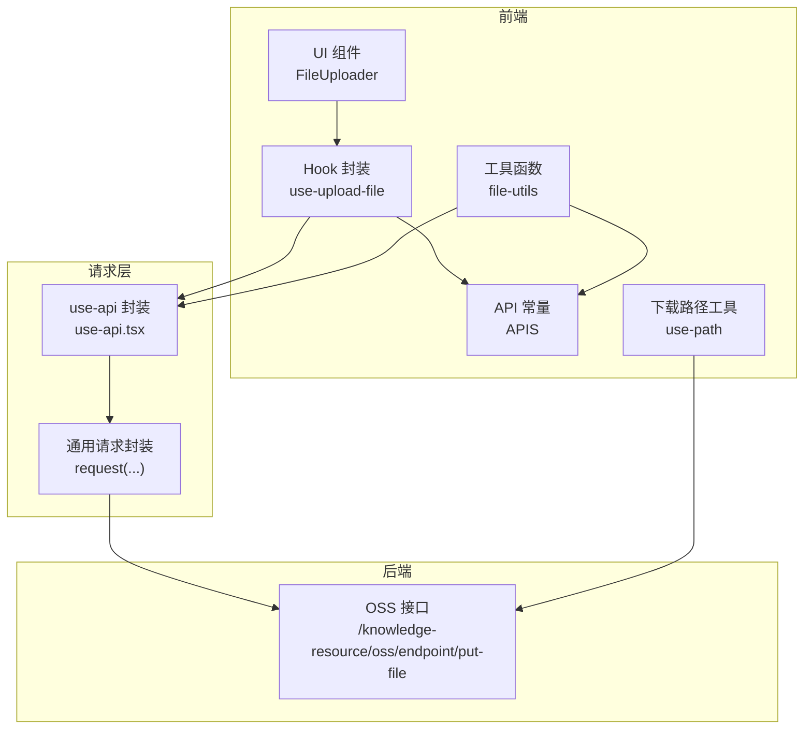
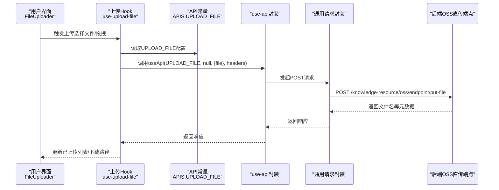
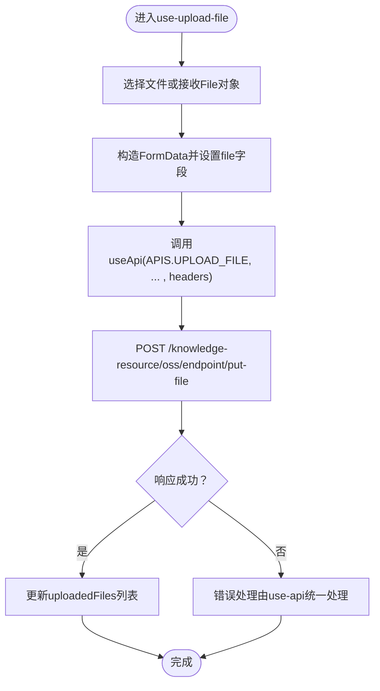
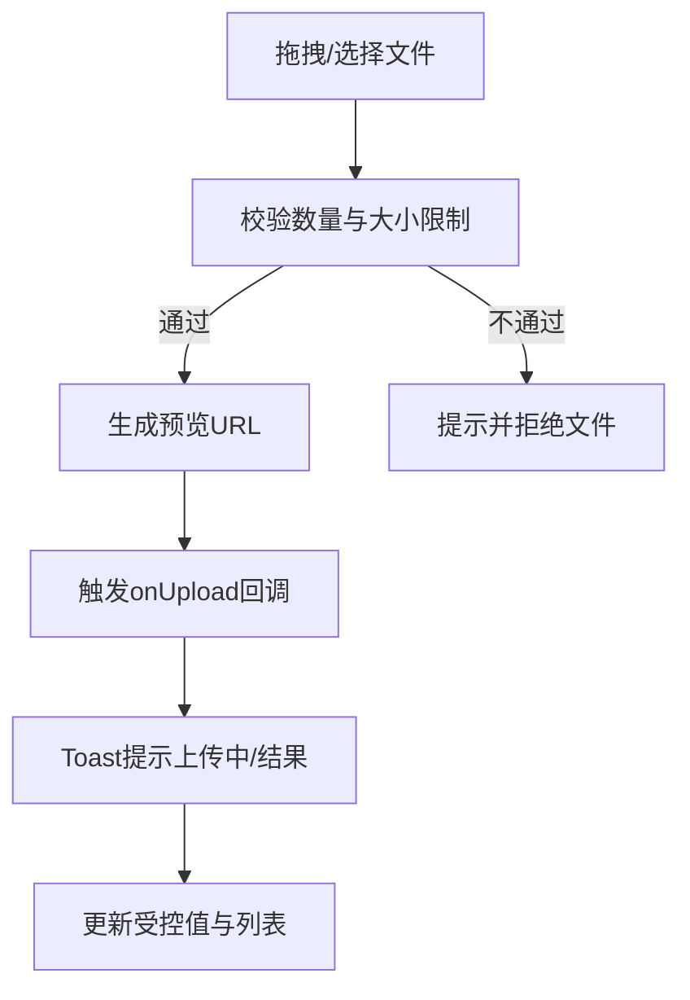
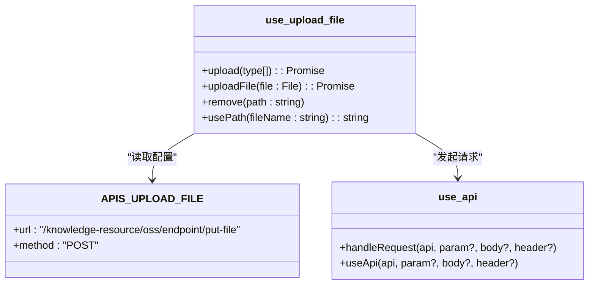
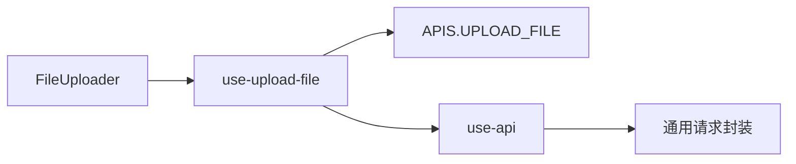

# 文件上传API

<cite>
**本文引用的文件**
- [packages/core/src/api/index.ts](file://packages/core/src/api/index.ts)
- [packages/plugin-file-manager/src/api/index.ts](file://packages/plugin-file-manager/src/api/index.ts)
- [packages/core/src/hooks/use-upload-file.ts](file://packages/core/src/hooks/use-upload-file.ts)
- [packages/core/src/utils/file-utils.ts](file://packages/core/src/utils/file-utils.ts)
- [packages/core/src/hooks/use-api.tsx](file://packages/core/src/hooks/use-api.tsx)
- [packages/ui/src/components/ui/file-upload.tsx](file://packages/ui/src/components/ui/file-upload.tsx)
- [apps/landing-page-vite/src/utils/use-path.ts](file://apps/landing-page-vite/src/utils/use-path.ts)
- [packages/core/src/components/Shop/PluginUploader/index.tsx](file://packages/core/src/components/Shop/PluginUploader/index.tsx)
- [packages/plugin-main/src/api/index.ts](file://packages/plugin-main/src/api/index.ts)
- [packages/rollup-config/index.js](file://packages/rollup-config/index.js)
</cite>

## 目录
1. [简介](#简介)
2. [项目结构](#项目结构)
3. [核心组件](#核心组件)
4. [架构总览](#架构总览)
5. [详细组件分析](#详细组件分析)
6. [依赖分析](#依赖分析)
7. [性能考虑](#性能考虑)
8. [故障排查指南](#故障排查指南)
9. [结论](#结论)
10. [附录](#附录)

## 简介
本文件面向知识库管理系统的“文件上传API”（UPLOAD_FILE），系统性梳理上传接口的URL路径、请求方式、参数与响应约定、前端集成方式、进度与错误处理、下载与访问控制等关键信息，并给出大文件上传与断点续传的实践建议。本文所有技术细节均来自仓库中的实际源码与调用关系。

## 项目结构
围绕文件上传的关键模块分布如下：
- 前端API常量定义：统一在各包的APIS对象中声明，便于跨组件复用
- 上传逻辑封装：通过自定义Hook与通用请求封装进行调用
- UI组件：提供拖拽上传、进度展示、多文件与大小限制等能力
- 下载路径：提供基于后端返回的文件名拼接的下载地址工具函数
- 打包场景：构建脚本直接使用上传接口上传打包产物

图表来源
- [packages/ui/src/components/ui/file-upload.tsx](file://packages/ui/src/components/ui/file-upload.tsx#L92-L184)
- [packages/core/src/hooks/use-upload-file.ts](file://packages/core/src/hooks/use-upload-file.ts#L20-L59)
- [packages/core/src/utils/file-utils.ts](file://packages/core/src/utils/file-utils.ts#L1-L13)
- [packages/core/src/api/index.ts](file://packages/core/src/api/index.ts#L13-L16)
- [packages/core/src/hooks/use-api.tsx](file://packages/core/src/hooks/use-api.tsx#L24-L51)
- [apps/landing-page-vite/src/utils/use-path.ts](file://apps/landing-page-vite/src/utils/use-path.ts#L3-L8)

章节来源
- [packages/core/src/api/index.ts](file://packages/core/src/api/index.ts#L13-L16)
- [packages/plugin-file-manager/src/api/index.ts](file://packages/plugin-file-manager/src/api/index.ts#L11-L15)
- [packages/core/src/hooks/use-upload-file.ts](file://packages/core/src/hooks/use-upload-file.ts#L20-L59)
- [packages/ui/src/components/ui/file-upload.tsx](file://packages/ui/src/components/ui/file-upload.tsx#L92-L184)
- [apps/landing-page-vite/src/utils/use-path.ts](file://apps/landing-page-vite/src/utils/use-path.ts#L3-L8)

## 核心组件
- API常量（UPLOAD_FILE）
  - 路径：/knowledge-resource/oss/endpoint/put-file
  - 方法：POST
  - 用途：上传文件至OSS直传端点
- 上传Hook（use-upload-file）
  - 提供upload与uploadFile方法，统一走useApi封装
  - 支持从本地文件系统选择或直接传入File对象
  - 返回数据结构包含文件名等字段，用于后续下载
- 通用请求封装（use-api）
  - 根据APIS定义自动填充路径参数，发起HTTP请求
- UI上传组件（FileUploader）
  - 支持accept、maxSize、maxFileCount、multiple等配置
  - 内置拖拽、预览、进度条与错误提示
- 下载路径工具（use-path）
  - 基于后端返回的文件名拼接下载URL前缀

章节来源
- [packages/core/src/api/index.ts](file://packages/core/src/api/index.ts#L13-L16)
- [packages/core/src/hooks/use-upload-file.ts](file://packages/core/src/hooks/use-upload-file.ts#L20-L59)
- [packages/core/src/hooks/use-api.tsx](file://packages/core/src/hooks/use-api.tsx#L24-L51)
- [packages/ui/src/components/ui/file-upload.tsx](file://packages/ui/src/components/ui/file-upload.tsx#L92-L184)
- [apps/landing-page-vite/src/utils/use-path.ts](file://apps/landing-page-vite/src/utils/use-path.ts#L3-L8)

## 架构总览
下图展示了从前端到后端OSS的完整上传链路，包括UI交互、Hook封装、请求封装与后端直传端点。

图表来源
- [packages/ui/src/components/ui/file-upload.tsx](file://packages/ui/src/components/ui/file-upload.tsx#L142-L159)
- [packages/core/src/hooks/use-upload-file.ts](file://packages/core/src/hooks/use-upload-file.ts#L32-L49)
- [packages/core/src/api/index.ts](file://packages/core/src/api/index.ts#L13-L16)
- [packages/core/src/hooks/use-api.tsx](file://packages/core/src/hooks/use-api.tsx#L24-L51)

## 详细组件分析

### 组件A：上传Hook（use-upload-file）
- 功能要点
  - upload：打开本地文件选择器，支持mimeTypes过滤，默认接受任意类型
  - uploadFile：直接上传指定File对象
  - remove/usePath：维护已上传文件列表与下载路径拼接
- 数据结构
  - KnowledgeFile：包含name（后端返回的文件名）、originalName等
- 错误处理
  - 通过useApi封装统一处理网络异常与业务错误
- 性能与体验
  - 采用multipart/form-data传输，避免额外序列化开销

图表来源
- [packages/core/src/hooks/use-upload-file.ts](file://packages/core/src/hooks/use-upload-file.ts#L32-L49)
- [packages/core/src/api/index.ts](file://packages/core/src/api/index.ts#L13-L16)
- [packages/core/src/hooks/use-api.tsx](file://packages/core/src/hooks/use-api.tsx#L24-L51)

章节来源
- [packages/core/src/hooks/use-upload-file.ts](file://packages/core/src/hooks/use-upload-file.ts#L20-L59)

### 组件B：UI上传组件（FileUploader）
- 配置项
  - accept：可接受的MIME类型集合
  - maxSize：单文件最大字节数（默认2MB）
  - maxFileCount：最大文件数量（默认1）
  - multiple：是否允许多文件
  - disabled：禁用状态
- 行为
  - 拖拽/点击选择文件
  - 预览与进度展示
  - 上传成功后更新受控值
- 错误处理
  - 对超过数量或大小限制的文件进行拒绝与提示

图表来源
- [packages/ui/src/components/ui/file-upload.tsx](file://packages/ui/src/components/ui/file-upload.tsx#L114-L159)
- [packages/ui/src/components/ui/file-upload.tsx](file://packages/ui/src/components/ui/file-upload.tsx#L161-L184)

章节来源
- [packages/ui/src/components/ui/file-upload.tsx](file://packages/ui/src/components/ui/file-upload.tsx#L92-L184)

### 组件C：API常量与请求封装
- API常量（UPLOAD_FILE）
  - url: /knowledge-resource/oss/endpoint/put-file
  - method: POST
- 请求封装（use-api）
  - 自动根据APIS定义填充路径参数
  - 统一处理POST/GET/DELETE/PUT
- 实际调用示例位置
  - use-upload-file：调用useApi(APIS.UPLOAD_FILE, ...)
  - file-utils：调用useApi(APIS.UPLOAD_FILE, ...)
  - plugin-main：同样使用UPLOAD_FILE
  - 打包脚本：直接以FormData调用PUT文件端点

图表来源
- [packages/core/src/api/index.ts](file://packages/core/src/api/index.ts#L13-L16)
- [packages/core/src/hooks/use-upload-file.ts](file://packages/core/src/hooks/use-upload-file.ts#L32-L49)
- [packages/core/src/hooks/use-api.tsx](file://packages/core/src/hooks/use-api.tsx#L24-L51)

章节来源
- [packages/core/src/api/index.ts](file://packages/core/src/api/index.ts#L13-L16)
- [packages/core/src/hooks/use-upload-file.ts](file://packages/core/src/hooks/use-upload-file.ts#L32-L49)
- [packages/core/src/hooks/use-api.tsx](file://packages/core/src/hooks/use-api.tsx#L24-L51)

### 组件D：下载与访问控制
- 下载路径工具
  - 基于后端返回的文件名拼接下载URL前缀
- 访问控制
  - 仓库未暴露具体鉴权头或Token参数；上传端点为直传OSS的后端接口，通常由后端签发临时凭证或令牌
  - 若需鉴权，请在headers中补充相应认证信息（如Authorization）

章节来源
- [apps/landing-page-vite/src/utils/use-path.ts](file://apps/landing-page-vite/src/utils/use-path.ts#L3-L8)

## 依赖分析
- 组件耦合
  - UI组件依赖use-upload-file提供的上传能力
  - use-upload-file依赖APIS常量与use-api封装
  - use-api封装依赖通用请求库
- 外部依赖
  - browser-fs-access：用于本地文件选择
  - react-dropzone：用于拖拽上传
  - sonner：用于Toast提示
- 可能的循环依赖
  - 当前结构清晰，无明显循环导入

图表来源
- [packages/ui/src/components/ui/file-upload.tsx](file://packages/ui/src/components/ui/file-upload.tsx#L92-L184)
- [packages/core/src/hooks/use-upload-file.ts](file://packages/core/src/hooks/use-upload-file.ts#L20-L59)
- [packages/core/src/hooks/use-api.tsx](file://packages/core/src/hooks/use-api.tsx#L24-L51)

章节来源
- [packages/ui/src/components/ui/file-upload.tsx](file://packages/ui/src/components/ui/file-upload.tsx#L92-L184)
- [packages/core/src/hooks/use-upload-file.ts](file://packages/core/src/hooks/use-upload-file.ts#L20-L59)
- [packages/core/src/hooks/use-api.tsx](file://packages/core/src/hooks/use-api.tsx#L24-L51)

## 性能考虑
- 传输格式
  - 使用multipart/form-data，避免额外编码开销
- 并发与批量
  - UI组件默认单文件上传；若需批量，可通过maxFileCount与multiple配置
- 进度与反馈
  - UI组件内置进度条；建议后端返回上传进度时结合progresses属性展示
- 大文件与断点续传
  - 当前仓库未提供分片/断点续传实现；建议采用后端直传OSS并结合服务端签名策略，前端按分片并发上传并持久化断点索引

## 故障排查指南
- 常见问题
  - 无法选择文件：检查accept与浏览器兼容性
  - 超过大小限制：调整maxSize或后端允许的最大值
  - 数量超限：调整maxFileCount或multiple
  - 上传失败：检查useApi封装的headers与后端返回的错误信息
- 定位方法
  - 在UI层观察Toast提示
  - 在use-upload-file中确认useApi调用是否执行
  - 在use-api中确认路径与方法是否匹配APIS定义

章节来源
- [packages/ui/src/components/ui/file-upload.tsx](file://packages/ui/src/components/ui/file-upload.tsx#L114-L159)
- [packages/core/src/hooks/use-upload-file.ts](file://packages/core/src/hooks/use-upload-file.ts#L32-L49)
- [packages/core/src/hooks/use-api.tsx](file://packages/core/src/hooks/use-api.tsx#L24-L51)

## 结论
本仓库将文件上传抽象为统一的APIS常量与use-upload-file Hook，前端通过UI组件完成交互与进度展示，请求通过use-api封装统一发出。下载路径由后端返回的文件名与固定前缀拼接而成。对于大文件与断点续传，当前仓库未提供实现，建议结合后端直传OSS与签名策略扩展分片上传能力。

## 附录

### API定义与参数
- 端点：/knowledge-resource/oss/endpoint/put-file
- 方法：POST
- 请求体：multipart/form-data，字段名为file
- 响应：包含文件名等元数据（具体字段以后端返回为准）

章节来源
- [packages/core/src/api/index.ts](file://packages/core/src/api/index.ts#L13-L16)
- [packages/core/src/hooks/use-upload-file.ts](file://packages/core/src/hooks/use-upload-file.ts#L32-L49)

### 前端集成要点
- 选择文件
  - 通过UI组件的accept/maxSize/maxFileCount/multiple配置约束
- 上传
  - 调用use-upload-file.upload或uploadFile，内部统一走useApi
- 进度与错误
  - UI组件内置Toast与进度条；错误由use-api封装统一处理
- 下载
  - 使用usePath拼接下载URL，结合后端返回的文件名

章节来源
- [packages/ui/src/components/ui/file-upload.tsx](file://packages/ui/src/components/ui/file-upload.tsx#L92-L184)
- [packages/core/src/hooks/use-upload-file.ts](file://packages/core/src/hooks/use-upload-file.ts#L20-L59)
- [apps/landing-page-vite/src/utils/use-path.ts](file://apps/landing-page-vite/src/utils/use-path.ts#L3-L8)

### 示例代码片段路径
- 本地文件选择并上传
  - [packages/core/src/hooks/use-upload-file.ts](file://packages/core/src/hooks/use-upload-file.ts#L32-L41)
- 直接上传指定文件
  - [packages/core/src/hooks/use-upload-file.ts](file://packages/core/src/hooks/use-upload-file.ts#L43-L49)
- 通用请求封装
  - [packages/core/src/hooks/use-api.tsx](file://packages/core/src/hooks/use-api.tsx#L24-L51)
- UI上传组件（拖拽/预览/进度）
  - [packages/ui/src/components/ui/file-upload.tsx](file://packages/ui/src/components/ui/file-upload.tsx#L114-L184)
- 下载路径拼接
  - [apps/landing-page-vite/src/utils/use-path.ts](file://apps/landing-page-vite/src/utils/use-path.ts#L3-L8)
- 插件打包产物上传（构建脚本）
  - [packages/rollup-config/index.js](file://packages/rollup-config/index.js#L100-L118)

### 大文件上传与断点续传最佳实践
- 后端策略
  - 采用分片上传与断点续传，结合服务端签名与令牌控制
- 前端策略
  - 分片并发上传，持久化断点索引，失败重试与进度回显
- 安全策略
  - 严格限制文件类型与大小，对敏感资源增加鉴权头或Token
- 体验优化
  - 展示实时速度与剩余时间，提供暂停/恢复操作