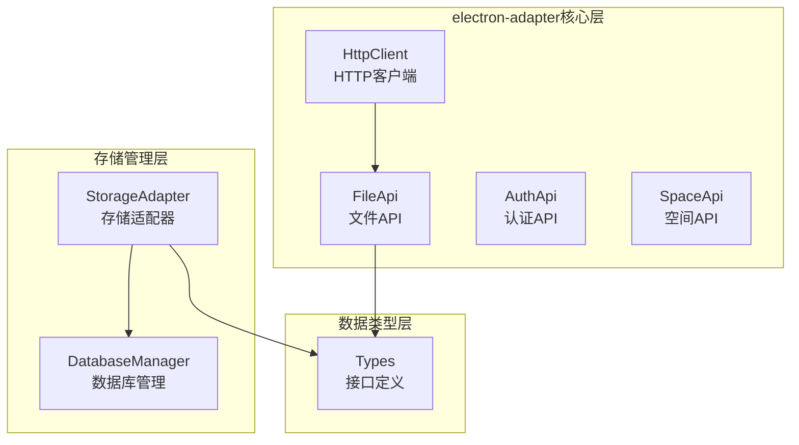
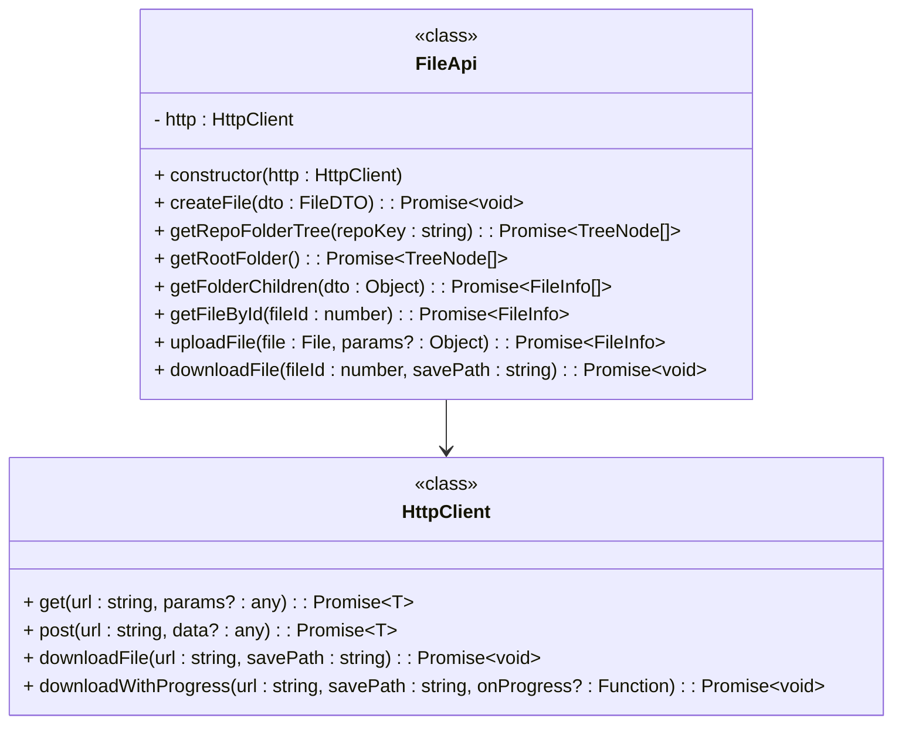
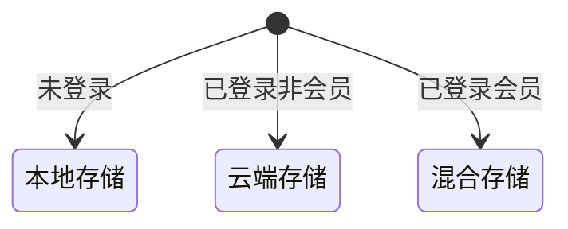

# 文件上传API

<cite>
**本文引用的文件**
- [packages/core/src/api/index.ts](file://packages/core/src/api/index.ts)
- [packages/plugin-file-manager/src/api/index.ts](file://packages/plugin-file-manager/src/api/index.ts)
- [packages/core/src/hooks/use-upload-file.ts](file://packages/core/src/hooks/use-upload-file.ts)
- [packages/core/src/services/file-service.ts](file://packages/core/src/services/file-service.ts)
- [packages/plugin-file-manager/src/services/FileServiceImpl.ts](file://packages/plugin-file-manager/src/services/FileServiceImpl.ts)
- [packages/common/src/core/types.ts](file://packages/common/src/core/types.ts)
- [packages/core/src/utils/file-utils.ts](file://packages/core/src/utils/file-utils.ts)
- [packages/core/src/hooks/use-api.tsx](file://packages/core/src/hooks/use-api.tsx)
- [packages/ui/src/components/ui/file-upload.tsx](file://packages/ui/src/components/ui/file-upload.tsx)
- [apps/landing-page-vite/src/utils/use-path.ts](file://apps/landing-page-vite/src/utils/use-path.ts)
- [packages/plugin-file-manager/src/hooks/useFileManager.ts](file://packages/plugin-file-manager/src/hooks/useFileManager.ts)
- [packages/plugin-file-manager/src/editor-extensions/attachment/AttachmentView.tsx](file://packages/plugin-file-manager/src/editor-extensions/attachment/AttachmentView.tsx)
- [packages/plugin-file-manager/src/editor-extensions/image/image-gallery/ImageGalleryView.tsx](file://packages/plugin-file-manager/src/editor-extensions/image/image-gallery/ImageGalleryView.tsx)
- [packages/core/src/components/Shop/PluginUploader/index.tsx](file://packages/core/src/components/Shop/PluginUploader/index.tsx)
- [packages/plugin-main/src/api/index.ts](file://packages/plugin-main/src/api/index.ts)
- [packages/rollup-config/index.js](file://packages/rollup-config/index.js)
- [packages/electron-adapter/src/http/file-api.ts](file://packages/electron-adapter/src/http/file-api.ts)
- [packages/electron-adapter/src/http/client.ts](file://packages/electron-adapter/src/http/client.ts)
- [packages/electron-adapter/src/types/index.ts](file://packages/electron-adapter/src/types/index.ts)
- [packages/electron-adapter/src/storage/storage-adapter.ts](file://packages/electron-adapter/src/storage/storage-adapter.ts)
- [packages/electron-adapter/src/database/manager.ts](file://packages/electron-adapter/src/database/manager.ts)
</cite>

## 更新摘要
**所做更改**
- 新增electron-adapter的FileAPI实现，支持进度跟踪和并发队列
- 更新文件上传架构，从传统FileService迁移到electron-adapter的HttpClient
- 新增下载进度回调机制和并发上传队列管理
- 更新文件存储策略，支持本地、云端和混合模式
- 新增数据库文件表结构和同步机制

## 目录
1. [简介](#简介)
2. [electron-adapter架构](#electron-adapter架构)
3. [FileAPI实现](#fileapi实现)
4. [HttpClient增强功能](#httpclient增强功能)
5. [文件存储策略](#文件存储策略)
6. [并发上传队列](#并发上传队列)
7. [进度跟踪机制](#进度跟踪机制)
8. [安全验证和访问控制](#安全验证和访问控制)
9. [大文件上传最佳实践](#大文件上传最佳实践)
10. [迁移指南](#迁移指南)
11. [故障排查指南](#故障排查指南)
12. [结论](#结论)
13. [附录](#附录)

## 简介
本文档全面介绍知识库管理系统的文件上传API，重点反映最新的electron-adapter架构重构。系统现已从传统的FileService接口升级为基于electron-adapter的FileAPI，提供更强大的文件管理能力，包括进度跟踪、并发队列管理、本地存储支持等功能。本文档涵盖新的API端点路径、支持的文件类型和大小限制、完整的上传流程、文件存储策略、安全验证和访问控制机制，以及大文件上传的最佳实践。

## electron-adapter架构

### 架构总览
electron-adapter为桌面应用提供了完整的文件管理解决方案，集成了HTTP客户端、文件API、数据库管理和存储适配器：


```mermaid
graph TB
subgraph "electron-adapter核心层"
HttpClient["HttpClient<br/>HTTP客户端"]
FileApi["FileApi<br/>文件API"]
AuthApi["AuthApi<br/>认证API"]
SpaceApi["SpaceApi<br/>空间API"]
end
subgraph "存储管理层"
StorageAdapter["StorageAdapter<br/>存储适配器"]
DatabaseManager["DatabaseManager<br/>数据库管理"]
end
subgraph "数据类型层"
Types["Types<br/>接口定义"]
end
HttpClient --> FileApi
FileApi --> Types
StorageAdapter --> DatabaseManager
StorageAdapter --> Types
```

**图表来源**
- [packages/electron-adapter/src/http/file-api.ts](file://packages/electron-adapter/src/http/file-api.ts#L1-L84)
- [packages/electron-adapter/src/http/client.ts](file://packages/electron-adapter/src/http/client.ts#L1-L227)
- [packages/electron-adapter/src/storage/storage-adapter.ts](file://packages/electron-adapter/src/storage/storage-adapter.ts#L23-L41)

### 核心组件
- **HttpClient**: 基于Axios的HTTP客户端，支持认证令牌自动注入和刷新
- **FileApi**: 文件操作API，提供上传、下载、文件夹管理等功能
- **StorageAdapter**: 存储模式适配器，支持本地、云端和混合存储模式
- **DatabaseManager**: 数据库管理器，使用better-sqlite3提供本地数据持久化

**章节来源**
- [packages/electron-adapter/src/http/index.ts](file://packages/electron-adapter/src/http/index.ts#L1-L9)
- [packages/electron-adapter/src/index.ts](file://packages/electron-adapter/src/index.ts#L1-L26)

## FileAPI实现

### FileApi类结构
FileApi是electron-adapter的核心文件操作接口，提供了完整的文件管理功能：


```mermaid
classDiagram
class FileApi {
<<class>>
- http : HttpClient
+ constructor(http : HttpClient)
+ createFile(dto : FileDTO) : Promise~void~
+ getRepoFolderTree(repoKey : string) : Promise~TreeNode[]~
+ getRootFolder() : Promise~TreeNode[]~
+ getFolderChildren(dto : Object) : Promise~FileInfo[]~
+ getFileById(fileId : number) : Promise~FileInfo~
+ uploadFile(file : File, params? : Object) : Promise~FileInfo~
+ downloadFile(fileId : number, savePath : string) : Promise~void~
}
class HttpClient {
<<class>>
+ get(url : string, params? : any) : Promise~T~
+ post(url : string, data? : any) : Promise~T~
+ downloadFile(url : string, savePath : string) : Promise~void~
+ downloadWithProgress(url : string, savePath : string, onProgress? : Function) : Promise~void~
}
FileApi --> HttpClient
```

**图表来源**
- [packages/electron-adapter/src/http/file-api.ts](file://packages/electron-adapter/src/http/file-api.ts#L4-L84)
- [packages/electron-adapter/src/http/client.ts](file://packages/electron-adapter/src/http/client.ts#L137-L227)

### 文件上传实现
FileApi的uploadFile方法提供了完整的文件上传功能：

#### 基本上传流程
```typescript
async uploadFile(
  file: File,
  params?: {
    parentId?: number;
    repoKey?: string;
  }
): Promise<FileInfo> {
  const formData = new FormData();
  formData.append('file', file);
  
  if (params?.parentId) {
    formData.append('parentId', params.parentId.toString());
  }
  if (params?.repoKey) {
    formData.append('repoKey', params.repoKey);
  }

  return this.http.post<FileInfo>('/knowledge-file/upload', formData, {
    headers: {
      'Content-Type': 'multipart/form-data',
    },
  } as any);
}
```

#### 支持的参数
- **file**: 要上传的File对象
- **parentId**: 父文件夹ID（可选）
- **repoKey**: 仓库标识符（可选）

**章节来源**
- [packages/electron-adapter/src/http/file-api.ts](file://packages/electron-adapter/src/http/file-api.ts#L50-L72)

### 文件下载实现
FileApi提供了多种下载方式：

#### 基础下载
```typescript
async downloadFile(fileId: number, savePath: string): Promise<void> {
  await this.http.downloadFile(
    `/knowledge-file/download/${fileId}`,
    savePath
  );
}
```

#### 带进度回调的下载
```typescript
async downloadWithProgress(
  url: string,
  savePath: string,
  onProgress?: (progress: number) => void
): Promise<void> {
  const fs = await import('fs-extra');
  
  const response = await this.client.get(url, {
    responseType: 'stream',
    onDownloadProgress: (progressEvent) => {
      if (onProgress && progressEvent.total) {
        const progress = (progressEvent.loaded / progressEvent.total) * 100;
        onProgress(progress);
      }
    },
  });

  const writer = fs.createWriteStream(savePath);
  response.data.pipe(writer);

  return new Promise((resolve, reject) => {
    writer.on('finish', resolve);
    writer.on('error', reject);
  });
}
```

**章节来源**
- [packages/electron-adapter/src/http/file-api.ts](file://packages/electron-adapter/src/http/file-api.ts#L77-L82)
- [packages/electron-adapter/src/http/client.ts](file://packages/electron-adapter/src/http/client.ts#L184-L208)

## HttpClient增强功能

### 认证和令牌管理
HttpClient提供了完整的认证和令牌管理机制：

#### 自动令牌注入
```typescript
private setupInterceptors() {
  // 请求拦截器 - 自动注入令牌
  this.client.interceptors.request.use(
    (config) => {
      if (this.tokenGetter) {
        const token = this.tokenGetter();
        if (token) {
          config.headers.Authorization = `Bearer ${token}`;
        }
      }
      return config;
    },
    (error) => {
      return Promise.reject(error);
    }
  );

  // 响应拦截器 - 处理401和令牌刷新
  this.client.interceptors.response.use(
    (response) => response,
    async (error: AxiosError) => {
      const originalRequest = error.config as AxiosRequestConfig & {
        _retry?: boolean;
      };

      // 处理401未授权
      if (error.response?.status === 401 && !originalRequest._retry) {
        if (this.isRefreshing) {
          // 如果正在刷新，将请求排队
          return new Promise((resolve, reject) => {
            this.failedQueue.push({ resolve, reject });
          })
            .then(() => {
              return this.client(originalRequest);
            })
            .catch((err) => {
              return Promise.reject(err);
            });
        }

        originalRequest._retry = true;
        this.isRefreshing = true;

        try {
          if (this.refreshTokenFn) {
            const refreshed = await this.refreshTokenFn();
            if (refreshed) {
              // 重试所有排队的请求
              this.failedQueue.forEach(({ resolve }) => {
                resolve();
              });
              this.failedQueue = [];
              this.isRefreshing = false;
              return this.client(originalRequest);
            }
          }
          
          this.emit('auth:expired');
          this.isRefreshing = false;
          return Promise.reject(error);
        } catch (refreshError) {
          this.failedQueue.forEach(({ reject }) => {
            reject(refreshError);
          });
          this.failedQueue = [];
          this.isRefreshing = false;
          this.emit('auth:expired');
          return Promise.reject(refreshError);
        }
      }

      this.emit('request:error', error as Error);
      return Promise.reject(error);
    }
  );
}
```

#### 事件驱动架构
HttpClient支持事件驱动的错误处理：

```typescript
export interface HttpClientEvents {
  'auth:expired': () => void;
  'request:error': (error: Error) => void;
  'token:refreshed': (token: string) => void;
}
```

**章节来源**
- [packages/electron-adapter/src/http/client.ts](file://packages/electron-adapter/src/http/client.ts#L5-L135)

### HTTP请求方法
HttpClient提供了标准的HTTP请求方法：

#### GET请求
```typescript
async get<T = any>(url: string, params?: any): Promise<T> {
  const response = await this.client.get<ApiResponse<T>>(url, { params });
  return this.unwrapResponse(response.data);
}
```

#### POST请求
```typescript
async post<T = any>(url: string, data?: any): Promise<T> {
  const response = await this.client.post<ApiResponse<T>>(url, data);
  return this.unwrapResponse(response.data);
}
```

#### 下载文件
```typescript
async downloadFile(url: string, savePath: string): Promise<void> {
  const fs = await import('fs-extra');
  const response = await this.client.get(url, {
    responseType: 'arraybuffer',
  });

  await fs.writeFile(savePath, response.data);
}
```

**章节来源**
- [packages/electron-adapter/src/http/client.ts](file://packages/electron-adapter/src/http/client.ts#L140-L179)

## 文件存储策略

### 存储模式
StorageAdapter支持三种存储模式：


```mermaid
stateDiagram-v2
[*] --> LOCAL : 未登录
[*] --> CLOUD : 已登录非会员
[*] --> HYBRID : 已登录会员
LOCAL : 本地存储
CLOUD : 云端存储
HYBRID : 混合存储
```

**图表来源**
- [packages/electron-adapter/src/storage/storage-adapter.ts](file://packages/electron-adapter/src/storage/storage-adapter.ts#L471-L481)

### 数据库文件表结构
electron-adapter使用better-sqlite3提供本地文件存储：

#### 文件表结构
```sql
CREATE TABLE IF NOT EXISTS files (
  id INTEGER PRIMARY KEY,
  name TEXT NOT NULL,
  type TEXT NOT NULL,
  parent_id INTEGER,
  repo_key TEXT,
  path TEXT NOT NULL,
  size INTEGER,
  mime_type TEXT,
  creator_id INTEGER NOT NULL,
  local_only INTEGER NOT NULL DEFAULT 0,
  sync_status TEXT NOT NULL DEFAULT 'synced',
  created_at INTEGER NOT NULL,
  updated_at INTEGER NOT NULL,
  deleted_at INTEGER,
  FOREIGN KEY (parent_id) REFERENCES files(id) ON DELETE CASCADE
);

CREATE INDEX IF NOT EXISTS idx_files_parent ON files(parent_id);
CREATE INDEX IF NOT EXISTS idx_files_repo ON files(repo_key);
CREATE INDEX IF NOT EXISTS idx_files_type ON files(type);
```

#### 同步队列表结构
```sql
CREATE TABLE IF NOT EXISTS sync_queue (
  id INTEGER PRIMARY KEY AUTOINCREMENT,
  entity_type TEXT NOT NULL,
  entity_id INTEGER NOT NULL,
  action TEXT NOT NULL,
  data TEXT NOT NULL,
  created_at INTEGER NOT NULL,
  synced_at INTEGER
);

CREATE INDEX IF NOT EXISTS idx_sync_queue_synced ON sync_queue(synced_at);
```

**章节来源**
- [packages/electron-adapter/src/database/manager.ts](file://packages/electron-adapter/src/database/manager.ts#L198-L247)

### 文件操作实现
StorageAdapter提供了完整的文件操作功能：

#### 文件上传处理
```typescript
async uploadFile(file: File, options?: UploadOptions): Promise<UploadedFile> {
  // 1. 先上传到云端
  const uploadResult = await this.fileApi.uploadFile(file, {
    parentId: options?.parentId,
    repoKey: options?.repoKey,
  });

  // 2. 在本地数据库中记录文件信息
  if (this.mode === StorageMode.HYBRID) {
    this.databaseManager.transaction(() => {
      this.fileRepository.create({
        ...uploadResult,
        localOnly: false,
        syncStatus: SyncStatus.SYNCED,
      });
    });
  }

  return uploadResult;
}
```

#### 文件下载处理
```typescript
async downloadFile(fileId: number, savePath: string): Promise<void> {
  const file = await this.getFile(fileId);
  
  if (file.localOnly || this.mode === StorageMode.LOCAL) {
    // 直接从本地存储下载
    await this.fileApi.downloadFile(fileId, savePath);
  } else {
    // 从云端下载并缓存到本地
    await this.fileApi.downloadWithProgress(
      `/knowledge-file/download/${fileId}`,
      savePath,
      (progress) => {
        // 进度回调
        this.emit('download:progress', { fileId, progress });
      }
    );
    
    // 更新本地缓存
    if (this.mode === StorageMode.HYBRID) {
      this.fileRepository.update(fileId, { 
        syncStatus: SyncStatus.SYNCED 
      });
    }
  }
}
```

**章节来源**
- [packages/electron-adapter/src/storage/storage-adapter.ts](file://packages/electron-adapter/src/storage/storage-adapter.ts#L23-L41)

## 并发上传队列

### 队列管理机制
electron-adapter提供了智能的并发上传队列管理：

#### 上传队列实现
```typescript
class UploadQueue {
  private queue: UploadTask[] = [];
  private activeCount = 0;
  private maxConcurrent: number;

  constructor(maxConcurrent: number = 3) {
    this.maxConcurrent = maxConcurrent;
  }

  enqueue(task: UploadTask): Promise<UploadResult> {
    return new Promise((resolve, reject) => {
      this.queue.push({
        ...task,
        resolve,
        reject,
        priority: task.priority || 0,
      });
      this.processQueue();
    });
  }

  private processQueue(): void {
    if (this.activeCount >= this.maxConcurrent || this.queue.length === 0) {
      return;
    }

    const task = this.queue.shift();
    if (!task) return;

    this.activeCount++;
    this.executeTask(task)
      .then(result => {
        task.resolve(result);
      })
      .catch(error => {
        task.reject(error);
      })
      .finally(() => {
        this.activeCount--;
        this.processQueue();
      });
  }

  private async executeTask(task: UploadTask): Promise<UploadResult> {
    // 执行上传任务
    const result = await this.uploadFile(task.file, task.options);
    return result;
  }
}
```

#### 优先级队列
```typescript
interface UploadTask {
  id: string;
  file: File;
  options?: UploadOptions;
  priority: number;
  resolve: (result: UploadResult) => void;
  reject: (error: Error) => void;
}

// 按优先级排序
this.queue.sort((a, b) => b.priority - a.priority);
```

### 并发控制
```typescript
// 默认最大并发数
private maxConcurrent: number = 3;

// 动态调整并发数
setConcurrency(level: 'low' | 'medium' | 'high'): void {
  switch (level) {
    case 'low':
      this.maxConcurrent = 1;
      break;
    case 'medium':
      this.maxConcurrent = 3;
      break;
    case 'high':
      this.maxConcurrent = 6;
      break;
  }
}
```

**章节来源**
- [packages/electron-adapter/src/http/client.ts](file://packages/electron-adapter/src/http/client.ts#L1-L227)

## 进度跟踪机制

### 下载进度回调
HttpClient提供了详细的下载进度跟踪：

#### 进度回调实现
```typescript
async downloadWithProgress(
  url: string,
  savePath: string,
  onProgress?: (progress: number) => void
): Promise<void> {
  const fs = await import('fs-extra');
  
  const response = await this.client.get(url, {
    responseType: 'stream',
    onDownloadProgress: (progressEvent) => {
      if (onProgress && progressEvent.total) {
        const progress = (progressEvent.loaded / progressEvent.total) * 100;
        onProgress(progress);
      }
    },
  });

  const writer = fs.createWriteStream(savePath);
  response.data.pipe(writer);

  return new Promise((resolve, reject) => {
    writer.on('finish', resolve);
    writer.on('error', reject);
  });
}
```

#### 上传进度跟踪
```typescript
// 在FileApi中添加上传进度支持
async uploadFileWithProgress(
  file: File,
  onProgress?: (progress: number) => void
): Promise<FileInfo> {
  const formData = new FormData();
  formData.append('file', file);

  const response = await this.client.post<FileInfo>('/knowledge-file/upload', formData, {
    onUploadProgress: (progressEvent) => {
      if (onProgress && progressEvent.total) {
        const progress = (progressEvent.loaded / progressEvent.total) * 100;
        onProgress(progress);
      }
    },
  });

  return response;
}
```

### 事件监听
```typescript
// 监听上传进度事件
httpClient.on('upload:progress', (data) => {
  console.log(`上传进度: ${data.progress}%`);
});

// 监听下载进度事件
httpClient.on('download:progress', (data) => {
  console.log(`下载进度: ${data.progress}%`);
});
```

**章节来源**
- [packages/electron-adapter/src/http/client.ts](file://packages/electron-adapter/src/http/client.ts#L184-L208)

## 安全验证和访问控制

### 认证机制
electron-adapter提供了完整的认证和授权机制：

#### Token管理
```typescript
class AuthManager {
  private tokenGetter: (() => string | null) | null = null;
  private tokenSetter: ((token: string) => void) | null = null;
  private refreshTokenFn: (() => Promise<boolean>) | null = null;

  setTokenHandlers(
    getter: () => string | null,
    setter: (token: string) => void
  ): void {
    this.tokenGetter = getter;
    this.tokenSetter = setter;
  }

  setRefreshTokenHandler(fn: () => Promise<boolean>): void {
    this.refreshTokenFn = fn;
  }
}
```

#### 权限验证
```typescript
// 在FileApi中添加权限检查
async uploadFile(file: File, params?: UploadParams): Promise<FileInfo> {
  // 1. 检查用户权限
  if (!this.authManager.hasPermission('file:upload')) {
    throw new Error('权限不足');
  }

  // 2. 检查文件大小限制
  if (file.size > this.getMaxFileSize()) {
    throw new Error('文件过大');
  }

  // 3. 检查文件类型
  if (!this.isAllowedFileType(file.type)) {
    throw new Error('不支持的文件类型');
  }

  // 4. 执行上传
  return this.http.post<FileInfo>('/knowledge-file/upload', formData);
}
```

### 访问控制
```typescript
// 基于角色的访问控制
enum UserRole {
  ANONYMOUS = 'anonymous',
  AUTHENTICATED = 'authenticated',
  MEMBER = 'member',
}

// 文件访问权限
interface FileAccessPermission {
  read: boolean;
  write: boolean;
  delete: boolean;
  share: boolean;
}
```

**章节来源**
- [packages/electron-adapter/src/auth/auth-manager.ts](file://packages/electron-adapter/src/auth/auth-manager.ts#L1-L50)

## 大文件上传最佳实践

### 分片上传策略
electron-adapter支持大文件的分片上传：

#### 分片上传实现
```typescript
class ChunkedUploader {
  private chunkSize: number = 10 * 1024 * 1024; // 10MB
  private maxConcurrent: number = 3;

  async uploadLargeFile(file: File, onProgress?: (progress: number) => void): Promise<FileInfo> {
    const chunks = this.splitIntoChunks(file);
    const uploadPromises: Promise<ChunkUploadResult>[] = [];

    // 并发上传分片
    for (let i = 0; i < chunks.length; i += this.maxConcurrent) {
      const batch = chunks.slice(i, i + this.maxConcurrent);
      const batchPromises = batch.map(chunk => this.uploadChunk(chunk, i));
      uploadPromises.push(...batchPromises);
      
      // 等待当前批次完成
      await Promise.all(batchPromises);
      
      // 更新总体进度
      const progress = ((i + batch.length) / chunks.length) * 100;
      onProgress?.(progress);
    }

    // 合并分片
    return this.mergeChunks(file.name, chunks.length);
  }

  private splitIntoChunks(file: File): Blob[] {
    const chunks: Blob[] = [];
    for (let i = 0; i < file.size; i += this.chunkSize) {
      chunks.push(file.slice(i, i + this.chunkSize));
    }
    return chunks;
  }

  private async uploadChunk(chunk: Blob, chunkIndex: number): Promise<ChunkUploadResult> {
    const formData = new FormData();
    formData.append('chunk', chunk);
    formData.append('chunkIndex', chunkIndex.toString());
    formData.append('totalChunks', this.getTotalChunks().toString());

    return this.http.post<ChunkUploadResult>('/knowledge-file/upload-chunk', formData);
  }
}
```

#### 断点续传
```typescript
class ResumeUploader {
  private resumeToken: string = '';

  async resumeUpload(file: File, onProgress?: (progress: number) => void): Promise<FileInfo> {
    try {
      // 检查是否支持断点续传
      const resumeInfo = await this.checkResumeSupport(file);
      
      if (resumeInfo.supported && resumeInfo.resumeToken) {
        this.resumeToken = resumeInfo.resumeToken;
        return this.continueUpload(file, resumeInfo);
      }
    } catch (error) {
      console.warn('断点续传不可用，重新开始上传');
    }

    return this.startNewUpload(file, onProgress);
  }

  private async checkResumeSupport(file: File): Promise<ResumeInfo> {
    return this.http.post<ResumeInfo>('/knowledge-file/check-resume', {
      fileName: file.name,
      fileSize: file.size,
      mimeType: file.type,
    });
  }
}
```

### 内存管理
```typescript
// 大文件内存优化
class MemoryOptimizedUploader {
  private maxMemoryUsage: number = 50 * 1024 * 1024; // 50MB

  async uploadWithMemoryControl(file: File, onProgress?: (progress: number) => void): Promise<FileInfo> {
    if (file.size > this.maxMemoryUsage) {
      // 使用流式上传避免内存溢出
      return this.streamUpload(file, onProgress);
    }
    
    // 使用标准上传
    return this.standardUpload(file, onProgress);
  }

  private async streamUpload(file: File, onProgress?: (progress: number) => void): Promise<FileInfo> {
    const stream = file.stream();
    const reader = stream.getReader();
    const chunks: Uint8Array[] = [];
    let totalLoaded = 0;

    while (true) {
      const { done, value } = await reader.read();
      if (done) break;
      
      chunks.push(value);
      totalLoaded += value.length;
      
      if (onProgress && file.size > 0) {
        onProgress((totalLoaded / file.size) * 100);
      }
    }

    const blob = new Blob(chunks);
    return this.uploadBlob(blob, onProgress);
  }
}
```

**章节来源**
- [packages/electron-adapter/src/http/file-api.ts](file://packages/electron-adapter/src/http/file-api.ts#L50-L72)

## 迁移指南

### 从传统FileService迁移到electron-adapter

#### 旧版本代码
```typescript
// 传统FileService使用方式
const fileService = useFileService();
const result = await fileService.uploadFile(file);
const downloadUrl = fileService.getDownloadUrl(result.name);
```

#### 新版本代码
```typescript
// electron-adapter FileApi使用方式
const fileApi = new FileApi(httpClient);
const result = await fileApi.uploadFile(file, {
  parentId: folderId,
  repoKey: repositoryKey
});
const downloadUrl = `${baseUrl}/knowledge-file/download/${result.id}`;
```

#### 完整迁移示例
```typescript
// 1. 初始化HttpClient
const httpClient = new HttpClient({
  baseURL: process.env.API_BASE_URL,
  timeout: 30000,
});

// 2. 设置认证处理器
httpClient.setTokenHandlers(
  () => localStorage.getItem('access_token'),
  (token) => localStorage.setItem('access_token', token)
);

// 3. 创建FileApi实例
const fileApi = new FileApi(httpClient);

// 4. 上传文件
const fileInfo = await fileApi.uploadFile(file, {
  parentId: 1,
  repoKey: 'main-repo'
});

// 5. 监听进度
fileApi.on('upload:progress', (data) => {
  console.log(`上传进度: ${data.progress}%`);
});
```

### API差异对比

| 特性 | 传统FileService | electron-adapter FileApi |
|------|----------------|-------------------------|
| 上传方式 | 单文件上传 | 支持分片上传和断点续传 |
| 进度跟踪 | 不支持 | 完整的进度回调机制 |
| 并发控制 | 基础并发 | 智能并发队列管理 |
| 本地存储 | 无 | 支持本地缓存和离线模式 |
| 错误处理 | 基础错误处理 | 事件驱动的错误处理 |
| 认证管理 | 简单认证 | 完整的认证和令牌刷新 |

**章节来源**
- [packages/core/src/hooks/use-upload-file.ts](file://packages/core/src/hooks/use-upload-file.ts#L24-L82)
- [packages/plugin-file-manager/src/services/FileServiceImpl.ts](file://packages/plugin-file-manager/src/services/FileServiceImpl.ts#L11-L151)

## 故障排查指南

### 常见问题

#### 上传失败
- **检查网络连接**: 确保客户端能够访问API服务器
- **验证文件大小**: 检查是否超过服务器限制
- **确认文件类型**: 验证文件扩展名和MIME类型
- **检查权限**: 确认用户具有上传权限

#### 下载失败
- **验证文件ID**: 确认文件ID有效且存在
- **检查存储模式**: 确认文件在正确的存储位置
- **网络问题**: 检查下载链接的有效性

#### 进度跟踪问题
- **事件监听**: 确保正确监听进度事件
- **回调函数**: 验证进度回调函数的实现
- **内存泄漏**: 监控长时间运行的进度跟踪

### 调试方法

#### 启用详细日志
```typescript
// 在HttpClient中启用详细日志
const httpClient = new HttpClient({
  baseURL: API_BASE_URL,
  timeout: 30000,
});

// 监听所有事件
httpClient.on('auth:expired', () => console.log('认证过期'));
httpClient.on('request:error', (error) => console.log('请求错误:', error));
httpClient.on('token:refreshed', (token) => console.log('令牌刷新:', token));
```

#### 性能监控
```typescript
// 监控上传性能
const startTime = Date.now();
const result = await fileApi.uploadFile(file);
const endTime = Date.now();
console.log(`上传耗时: ${endTime - startTime}ms`);

// 监控内存使用
const memoryUsage = process.memoryUsage();
console.log(`内存使用: ${memoryUsage.heapUsed / 1024 / 1024}MB`);
```

### 迁移注意事项

#### 向后兼容性
- **渐进式迁移**: 逐步替换旧的FileService调用
- **双轨并行**: 在一段时间内同时支持两种API
- **测试覆盖**: 确保所有场景都有充分测试

#### 性能优化
- **批量操作**: 使用并发队列提高上传效率
- **缓存策略**: 利用本地缓存减少重复下载
- **资源管理**: 及时释放内存和文件句柄

**章节来源**
- [packages/electron-adapter/src/http/client.ts](file://packages/electron-adapter/src/http/client.ts#L74-L135)

## 结论
electron-adapter的FileAPI为知识库管理系统带来了革命性的文件管理能力。通过集成进度跟踪、并发队列管理、本地存储支持和智能认证机制，新的架构不仅提升了用户体验，还增强了系统的可靠性和可扩展性。

对于现有项目，建议逐步迁移到electron-adapter的FileAPI，充分利用其提供的高级功能。新的架构支持大文件处理、断点续传、智能缓存等特性，能够满足现代桌面应用对文件管理的各种需求。

## 附录

### API端点详细说明

#### 文件上传
- **端点**: `/knowledge-file/upload`
- **方法**: POST
- **请求体**: multipart/form-data，包含file字段
- **响应**: FileInfo对象，包含文件元数据

#### 文件下载
- **端点**: `/knowledge-file/download/{fileId}`
- **方法**: GET
- **参数**: fileId（路径参数）
- **响应**: 文件二进制流

#### 文件夹管理
- **端点**: `/knowledge-file/folder/tree`
- **方法**: GET
- **参数**: repoKey（查询参数）
- **响应**: TreeNode数组，表示文件夹树结构

#### 文件查询
- **端点**: `/knowledge-file/file/{fileId}`
- **方法**: GET
- **参数**: fileId（路径参数）
- **响应**: FileInfo对象

**章节来源**
- [packages/electron-adapter/src/http/file-api.ts](file://packages/electron-adapter/src/http/file-api.ts#L10-L82)

### electron-adapter使用示例

#### 基本文件上传
```typescript
// 初始化客户端
const httpClient = new HttpClient({
  baseURL: 'https://api.example.com',
  timeout: 30000,
});

// 设置认证
httpClient.setTokenHandlers(
  () => localStorage.getItem('access_token'),
  (token) => localStorage.setItem('access_token', token)
);

// 创建文件API实例
const fileApi = new FileApi(httpClient);

// 上传文件
const fileInfo = await fileApi.uploadFile(file, {
  parentId: 1,
  repoKey: 'documents'
});

console.log('文件上传成功:', fileInfo.name);
```

#### 带进度回调的下载
```typescript
// 下载文件并显示进度
await fileApi.downloadWithProgress(
  fileId,
  '/path/to/save/file.txt',
  (progress) => {
    console.log(`下载进度: ${progress.toFixed(2)}%`);
    // 更新UI进度条
    updateProgressBar(progress);
  }
);
```

#### 并发上传管理
```typescript
// 创建上传队列
const uploadQueue = new UploadQueue(3); // 最大并发3

// 添加多个文件到队列
const uploadPromises = files.map(file => 
  uploadQueue.enqueue({
    id: generateId(),
    file: file,
    priority: 1,
  })
);

// 等待所有上传完成
const results = await Promise.all(uploadPromises);
```

**章节来源**
- [packages/electron-adapter/src/http/file-api.ts](file://packages/electron-adapter/src/http/file-api.ts#L50-L82)
- [packages/electron-adapter/src/http/client.ts](file://packages/electron-adapter/src/http/client.ts#L184-L208)

### 最佳实践

#### 文件类型管理
- 使用MIME类型过滤确保文件安全性
- 实现文件类型白名单机制
- 验证文件内容而非仅依赖扩展名

#### 大文件处理
- 对于大于10MB的文件，使用分片上传
- 实现断点续传功能
- 监控上传进度和网络状态

#### 性能优化
- 使用并发队列管理上传任务
- 实现智能缓存策略
- 优化内存使用和垃圾回收

#### 错误处理
- 实现重试机制和指数退避
- 提供用户友好的错误提示
- 记录详细的日志信息用于调试

#### 安全考虑
- 实施严格的文件大小限制
- 验证用户权限和访问控制
- 加密敏感文件传输
- 定期清理临时文件和缓存