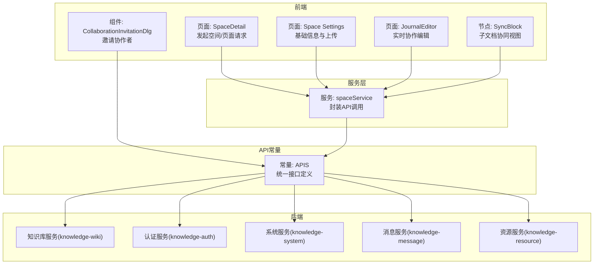
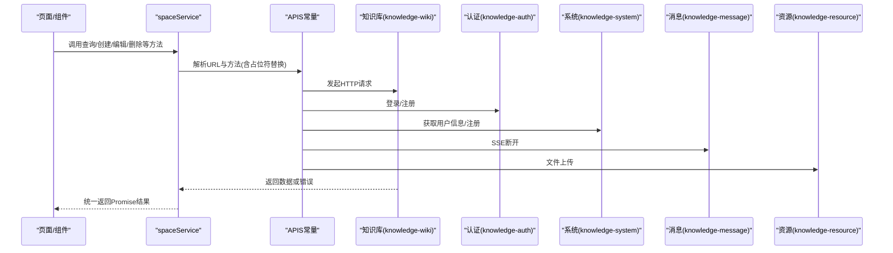
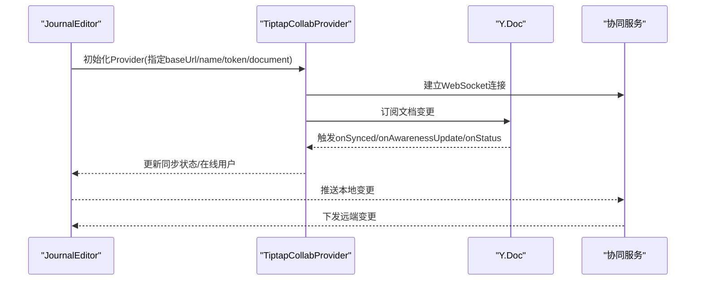
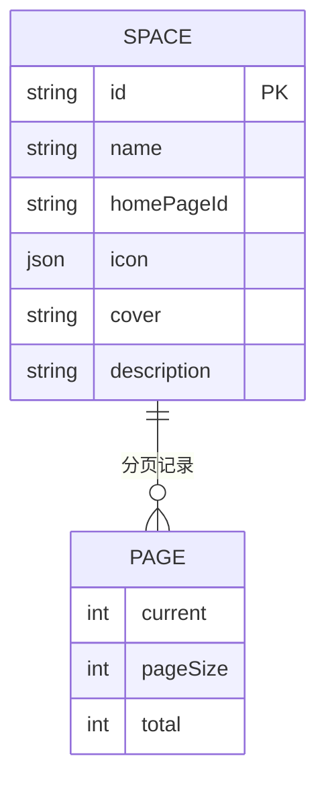

# 空间页面API

<cite>
**本文引用的文件**
- [packages/plugin-main/src/api/index.ts](file://packages/plugin-main/src/api/index.ts)
- [packages/plugin-main/src/service/space-service.ts](file://packages/plugin-main/src/service/space-service.ts)
- [packages/plugin-main/src/service/index.ts](file://packages/plugin-main/src/service/index.ts)
- [packages/plugin-main/src/model/Space.ts](file://packages/plugin-main/src/model/Space.ts)
- [packages/common/src/entity/Page.ts](file://packages/common/src/entity/Page.ts)
- [packages/plugin-main/src/pages/SpaceDetail/index.tsx](file://packages/plugin-main/src/pages/SpaceDetail/index.tsx)
- [packages/plugin-main/src/pages/SpaceDetail/Settings/Basic/index.tsx](file://packages/plugin-main/src/pages/SpaceDetail/Settings/Basic/index.tsx)
- [packages/plugin-main/src/pages/Journals/JournalEditor/index.tsx](file://packages/plugin-main/src/pages/Journals/JournalEditor/index.tsx)
- [packages/editor/src/extensions/sync-block/SyncBlock.tsx](file://packages/editor/src/extensions/sync-block/SyncBlock.tsx)
- [packages/plugin-main/src/pages/components/CollaborationInvitationDlg.tsx](file://packages/plugin-main/src/pages/components/CollaborationInvitationDlg.tsx)
</cite>

## 目录
1. [简介](#简介)
2. [项目结构](#项目结构)
3. [核心组件](#核心组件)
4. [架构总览](#架构总览)
5. [详细组件分析](#详细组件分析)
6. [依赖分析](#依赖分析)
7. [性能考虑](#性能考虑)
8. [故障排查指南](#故障排查指南)
9. [结论](#结论)
10. [附录](#附录)

## 简介
本文件面向知识库管理系统的“空间与页面”API，系统性梳理空间管理（创建、查询、详情、收藏、模板保存）与页面管理（创建、查询、树形结构、内容获取、回收站、收藏、模板、块查询、块信息）的接口定义与调用方式；同时覆盖页面协作编辑（实时同步、状态管理、冲突处理）、权限与成员邀请能力，并给出数据模型定义与常见错误处理策略。

## 项目结构
围绕“空间与页面”的API，主要涉及以下模块：
- API常量定义：统一声明后端接口URL、方法与用途
- 服务层封装：对API进行组合与参数化，屏蔽路由占位符与分页结构
- 页面与设置：前端页面使用服务层发起请求并渲染UI
- 协作编辑：基于Yjs与Tiptap的协同编辑扩展，支持实时同步与状态展示
- 数据模型：Space与Page分页实体的字段说明

图表来源
- [packages/plugin-main/src/pages/SpaceDetail/index.tsx](file://packages/plugin-main/src/pages/SpaceDetail/index.tsx#L1-L200)
- [packages/plugin-main/src/pages/SpaceDetail/Settings/Basic/index.tsx](file://packages/plugin-main/src/pages/SpaceDetail/Settings/Basic/index.tsx#L1-L113)
- [packages/plugin-main/src/pages/Journals/JournalEditor/index.tsx](file://packages/plugin-main/src/pages/Journals/JournalEditor/index.tsx#L1-L54)
- [packages/editor/src/extensions/sync-block/SyncBlock.tsx](file://packages/editor/src/extensions/sync-block/SyncBlock.tsx#L1-L87)
- [packages/plugin-main/src/pages/components/CollaborationInvitationDlg.tsx](file://packages/plugin-main/src/pages/components/CollaborationInvitationDlg.tsx#L1-L115)
- [packages/plugin-main/src/service/space-service.ts](file://packages/plugin-main/src/service/space-service.ts#L1-L59)
- [packages/plugin-main/src/api/index.ts](file://packages/plugin-main/src/api/index.ts#L1-L120)

章节来源
- [packages/plugin-main/src/api/index.ts](file://packages/plugin-main/src/api/index.ts#L1-L120)
- [packages/plugin-main/src/service/space-service.ts](file://packages/plugin-main/src/service/space-service.ts#L1-L59)
- [packages/plugin-main/src/service/index.ts](file://packages/plugin-main/src/service/index.ts#L1-L13)

## 核心组件
- API常量APIS：集中定义所有空间与页面相关接口，含HTTP方法、路径与用途注释
- 服务spaceService：对APIS进行二次封装，负责参数拼装、路由占位符替换、分页对象Page的透传
- 数据模型：
  - Space：空间实体，包含标识、名称、主页ID、图标、封面、描述等
  - Page<T>：通用分页容器，包含records、current、pageSize、total

章节来源
- [packages/plugin-main/src/api/index.ts](file://packages/plugin-main/src/api/index.ts#L1-L120)
- [packages/plugin-main/src/service/space-service.ts](file://packages/plugin-main/src/service/space-service.ts#L1-L59)
- [packages/plugin-main/src/model/Space.ts](file://packages/plugin-main/src/model/Space.ts#L1-L8)
- [packages/common/src/entity/Page.ts](file://packages/common/src/entity/Page.ts#L1-L8)

## 架构总览
下图展示从页面到服务层再到API常量与后端服务的整体调用链路。

图表来源
- [packages/plugin-main/src/service/space-service.ts](file://packages/plugin-main/src/service/space-service.ts#L1-L59)
- [packages/plugin-main/src/api/index.ts](file://packages/plugin-main/src/api/index.ts#L1-L120)

## 详细组件分析

### 空间管理API
- 查询空间列表
  - 方法与路径：GET /knowledge-wiki/space/list
  - 入参：无
  - 出参：Page<Space> 分页结构
  - 使用场景：空间列表页加载
  - 参考调用：[packages/plugin-main/src/service/space-service.ts](file://packages/plugin-main/src/service/space-service.ts#L27-L30)

- 获取个人空间
  - 方法与路径：GET /knowledge-wiki/space/personal
  - 入参：无
  - 出参：Space
  - 使用场景：跳转至个人空间
  - 参考调用：[packages/plugin-main/src/pages/SpaceDetail/index.tsx](file://packages/plugin-main/src/pages/SpaceDetail/index.tsx#L140-L158)

- 创建空间
  - 方法与路径：POST /knowledge-wiki/space
  - 入参：Space对象（id可选）
  - 出参：Space
  - 使用场景：空间设置表单提交
  - 参考调用：[packages/plugin-main/src/pages/SpaceDetail/Settings/Basic/index.tsx](file://packages/plugin-main/src/pages/SpaceDetail/Settings/Basic/index.tsx#L37-L42)

- 获取空间详情
  - 方法与路径：GET /knowledge-wiki/space/:id/detail
  - 入参：id
  - 出参：Space
  - 使用场景：空间详情页初始化
  - 参考调用：[packages/plugin-main/src/service/space-service.ts](file://packages/plugin-main/src/service/space-service.ts#L24-L26)

- 收藏空间
  - 方法与路径：POST /knowledge-wiki/space/:id/favorite
  - 入参：id
  - 出参：无
  - 使用场景：空间收藏/取消
  - 参考调用：[packages/plugin-main/src/pages/SpaceDetail/index.tsx](file://packages/plugin-main/src/pages/SpaceDetail/index.tsx#L174-L178)

- 将空间保存为模板
  - 方法与路径：POST /knowledge-wiki/space/template
  - 入参：spaceId
  - 出参：无
  - 使用场景：空间模板化
  - 参考调用：[packages/plugin-main/src/service/space-service.ts](file://packages/plugin-main/src/service/space-service.ts#L55-L58)

章节来源
- [packages/plugin-main/src/api/index.ts](file://packages/plugin-main/src/api/index.ts#L1-L120)
- [packages/plugin-main/src/service/space-service.ts](file://packages/plugin-main/src/service/space-service.ts#L1-L59)
- [packages/plugin-main/src/pages/SpaceDetail/index.tsx](file://packages/plugin-main/src/pages/SpaceDetail/index.tsx#L140-L178)
- [packages/plugin-main/src/pages/SpaceDetail/Settings/Basic/index.tsx](file://packages/plugin-main/src/pages/SpaceDetail/Settings/Basic/index.tsx#L37-L42)

### 页面管理API
- 获取页面树
  - 方法与路径：GET /knowledge-wiki/space/:id/page/tree
  - 入参：id, searchValue(可选)
  - 出参：树形结构数组
  - 使用场景：侧边栏导航树
  - 参考调用：[packages/plugin-main/src/service/space-service.ts](file://packages/plugin-main/src/service/space-service.ts#L31-L34)

- 查询页面列表
  - 方法与路径：GET /knowledge-wiki/space/page/list
  - 入参：spaceId(可选), status(可选)
  - 出参：Page<any>
  - 使用场景：分页查询、回收站
  - 参考调用：[packages/plugin-main/src/service/space-service.ts](file://packages/plugin-main/src/service/space-service.ts#L35-L38)

- 创建/保存页面
  - 方法与路径：POST /knowledge-wiki/space/page
  - 入参：创建参数（如spaceId、parentId、content、templateId等）
  - 出参：页面对象
  - 使用场景：新建空白页、按模板创建、编辑保存
  - 参考调用：
    - [packages/plugin-main/src/pages/SpaceDetail/index.tsx](file://packages/plugin-main/src/pages/SpaceDetail/index.tsx#L107-L138)
    - [packages/plugin-main/src/pages/SpaceDetail/index.tsx](file://packages/plugin-main/src/pages/SpaceDetail/index.tsx#L140-L149)

- 获取页面内容
  - 方法与路径：GET /knowledge-wiki/space/page/:id/content
  - 入参：id
  - 出参：页面内容
  - 使用场景：编辑器加载内容
  - 参考调用：[packages/plugin-main/src/service/space-service.ts](file://packages/plugin-main/src/service/space-service.ts#L43-L45)

- 回收站：移动到回收站/恢复
  - 移动到回收站：DELETE /knowledge-wiki/space/page/:id/trash
  - 恢复页面：PUT /knowledge-wiki/space/page/:id/restore
  - 入参：id
  - 出参：无
  - 使用场景：页面删除与恢复
  - 参考调用：
    - [packages/plugin-main/src/pages/SpaceDetail/index.tsx](file://packages/plugin-main/src/pages/SpaceDetail/index.tsx#L160-L165)
    - [packages/plugin-main/src/pages/SpaceDetail/index.tsx](file://packages/plugin-main/src/pages/SpaceDetail/index.tsx#L167-L171)

- 收藏/取消收藏页面
  - 收藏：POST /knowledge-wiki/space/page/:id/favorite
  - 取消：DELETE /knowledge-wiki/favorite/:id
  - 入参：id 或 :id
  - 出参：无
  - 使用场景：页面收藏管理
  - 参考调用：
    - [packages/plugin-main/src/api/index.ts](file://packages/plugin-main/src/api/index.ts#L52-L60)
    - [packages/plugin-main/src/pages/SpaceDetail/index.tsx](file://packages/plugin-main/src/pages/SpaceDetail/index.tsx#L160-L165)

- 模板相关
  - 保存页面为模板：POST /knowledge-wiki/space/page/:id/template
  - 查询页面模板：GET /knowledge-wiki/space/page/templates
  - 入参：id 或 无
  - 出参：无 或 模板列表
  - 使用场景：页面模板化与复用
  - 参考调用：
    - [packages/plugin-main/src/api/index.ts](file://packages/plugin-main/src/api/index.ts#L64-L71)

- 块级内容
  - 查询块：GET /knowledge-wiki/space/page/blocks
  - 获取块信息：GET /knowledge-wiki/space/page/block
  - 入参：pageId/pageTitle/spaceId 或 blockId
  - 出参：块集合或块详情
  - 使用场景：块级编辑与引用
  - 参考调用：
    - [packages/plugin-main/src/service/space-service.ts](file://packages/plugin-main/src/service/space-service.ts#L47-L54)
    - [packages/plugin-main/src/api/index.ts](file://packages/plugin-main/src/api/index.ts#L104-L111)

章节来源
- [packages/plugin-main/src/api/index.ts](file://packages/plugin-main/src/api/index.ts#L1-L120)
- [packages/plugin-main/src/service/space-service.ts](file://packages/plugin-main/src/service/space-service.ts#L1-L59)
- [packages/plugin-main/src/pages/SpaceDetail/index.tsx](file://packages/plugin-main/src/pages/SpaceDetail/index.tsx#L107-L171)

### 协作编辑API与流程
- 实时同步
  - 编辑器通过Tiptap Collab Provider连接协同服务，建立Yjs文档同步
  - 状态回调：onAwarenessUpdate、onSynced、onStatus用于展示在线用户、同步状态与连接状态
  - 参考实现：
    - [packages/plugin-main/src/pages/Journals/JournalEditor/index.tsx](file://packages/plugin-main/src/pages/Journals/JournalEditor/index.tsx#L1-L54)
    - [packages/editor/src/extensions/sync-block/SyncBlock.tsx](file://packages/editor/src/extensions/sync-block/SyncBlock.tsx#L1-L87)

- 冲突解决与状态管理
  - 编辑器内部通过装饰与事务过滤减少UI抖动与选择状态异常
  - 参考实现：
    - [packages/editor/src/extensions/selection/selection.ts](file://packages/editor/src/extensions/selection/selection.ts#L75-L106)

- 子文档协同
  - SyncBlock为特定块建立独立的协同通道，格式化命名空间以隔离不同块
  - 参考实现：
    - [packages/editor/src/extensions/sync-block/SyncBlock.tsx](file://packages/editor/src/extensions/sync-block/SyncBlock.tsx#L1-L87)

图表来源
- [packages/plugin-main/src/pages/Journals/JournalEditor/index.tsx](file://packages/plugin-main/src/pages/Journals/JournalEditor/index.tsx#L1-L54)
- [packages/editor/src/extensions/sync-block/SyncBlock.tsx](file://packages/editor/src/extensions/sync-block/SyncBlock.tsx#L1-L87)

章节来源
- [packages/plugin-main/src/pages/Journals/JournalEditor/index.tsx](file://packages/plugin-main/src/pages/Journals/JournalEditor/index.tsx#L1-L54)
- [packages/editor/src/extensions/sync-block/SyncBlock.tsx](file://packages/editor/src/extensions/sync-block/SyncBlock.tsx#L1-L87)
- [packages/editor/src/extensions/selection/selection.ts](file://packages/editor/src/extensions/selection/selection.ts#L75-L106)

### 权限管理与成员邀请
- 成员邀请
  - 提交方式：POST /knowledge-wiki/space/collaborationInvitation
  - 入参：spaceId、pageId、collaboratorEmails、permissions
  - 出参：无
  - 使用场景：通过邮箱邀请协作者并设定READ/WRITE权限
  - 参考实现：
    - [packages/plugin-main/src/pages/components/CollaborationInvitationDlg.tsx](file://packages/plugin-main/src/pages/components/CollaborationInvitationDlg.tsx#L51-L61)
    - [packages/plugin-main/src/api/index.ts](file://packages/plugin-main/src/api/index.ts#L100-L103)

- 成员设置
  - 页面提供“通过邀请链接添加成员”入口与Tab切换（成员/群组/访客）
  - 参考实现：
    - [packages/plugin-main/src/pages/components/settings/components/Member.tsx](file://packages/plugin-main/src/pages/components/settings/components/Member.tsx#L1-L39)

章节来源
- [packages/plugin-main/src/pages/components/CollaborationInvitationDlg.tsx](file://packages/plugin-main/src/pages/components/CollaborationInvitationDlg.tsx#L1-L115)
- [packages/plugin-main/src/api/index.ts](file://packages/plugin-main/src/api/index.ts#L100-L103)

### 数据模型定义
- Space（空间）
  - 字段：id、name、homePageId(可选)、icon(可选)、cover(可选)、description(可选)
  - 用途：空间基本信息与展示
  - 参考定义：[packages/plugin-main/src/model/Space.ts](file://packages/plugin-main/src/model/Space.ts#L1-L8)

- Page<T>（分页容器）
  - 字段：records、current、pageSize、total
  - 用途：承载列表型数据的分页结构
  - 参考定义：[packages/common/src/entity/Page.ts](file://packages/common/src/entity/Page.ts#L1-L8)

图表来源
- [packages/plugin-main/src/model/Space.ts](file://packages/plugin-main/src/model/Space.ts#L1-L8)
- [packages/common/src/entity/Page.ts](file://packages/common/src/entity/Page.ts#L1-L8)

## 依赖分析
- 组件耦合
  - 页面组件依赖服务层spaceService，避免直接与API常量耦合
  - 服务层统一通过useApi执行HTTP请求，便于拦截与错误处理
- 外部依赖
  - 协同编辑依赖Yjs与Tiptap Collab Provider
  - 文件上传依赖资源服务端点
- 潜在循环依赖
  - 当前结构清晰，未发现循环依赖迹象

图表来源
- [packages/plugin-main/src/service/space-service.ts](file://packages/plugin-main/src/service/space-service.ts#L1-L59)
- [packages/plugin-main/src/api/index.ts](file://packages/plugin-main/src/api/index.ts#L1-L120)

章节来源
- [packages/plugin-main/src/service/space-service.ts](file://packages/plugin-main/src/service/space-service.ts#L1-L59)
- [packages/plugin-main/src/api/index.ts](file://packages/plugin-main/src/api/index.ts#L1-L120)

## 性能考虑
- 列表分页：优先使用PAGE参数控制分页大小，避免一次性拉取过多数据
- 懒加载：页面树与模板列表建议按需加载，减少首屏压力
- 协同编辑：合理设置onStatus与onSynced回调频率，避免频繁重渲染
- 文件上传：采用直传策略，结合进度反馈优化用户体验

## 故障排查指南
- 常见错误与定位
  - 401/403：检查登录态与权限，确认认证服务可用
  - 404：核对URL占位符是否正确替换（如:id）
  - 5xx：关注后端服务健康度与网络连通性
- 日志与监控
  - 在调用层增加try/catch与统一toast提示
  - 对SSE断开与协同连接状态进行降级处理
- 协同编辑问题
  - 若同步失败，检查Provider初始化参数（baseUrl、name、token、document）
  - 关注onStatus回调中的连接状态变化

## 结论
本文档系统化梳理了空间与页面API、服务层封装、协作编辑机制与权限邀请流程，并提供了数据模型与调用示例路径。建议在生产环境中统一接入鉴权与错误处理中间件，确保接口稳定性与可观测性。

## 附录

### API一览表（摘要）
- 空间
  - GET /knowledge-wiki/space/list → Page<Space>
  - GET /knowledge-wiki/space/personal → Space
  - POST /knowledge-wiki/space → Space
  - GET /knowledge-wiki/space/:id/detail → Space
  - POST /knowledge-wiki/space/:id/favorite → 无
  - POST /knowledge-wiki/space/template → 无
- 页面
  - GET /knowledge-wiki/space/:id/page/tree → 树
  - GET /knowledge-wiki/space/page/list → Page<any>
  - POST /knowledge-wiki/space/page → 页面
  - GET /knowledge-wiki/space/page/:id/content → 内容
  - DELETE /knowledge-wiki/space/page/:id/trash → 无
  - PUT /knowledge-wiki/space/page/:id/restore → 无
  - POST /knowledge-wiki/space/page/:id/favorite → 无
  - DELETE /knowledge-wiki/favorite/:id → 无
  - POST /knowledge-wiki/space/page/:id/template → 无
  - GET /knowledge-wiki/space/page/templates → 模板列表
  - GET /knowledge-wiki/space/page/blocks → 块集合
  - GET /knowledge-wiki/space/page/block → 块详情
- 协作与系统
  - POST /knowledge-wiki/space/collaborationInvitation → 无
  - GET /knowledge-auth/token → 登录
  - GET /knowledge-system/user/info → 用户信息
  - GET /knowledge-message/sse/disconnect → 断开SSE
  - POST /knowledge-resource/oss/endpoint/put-file → 上传

章节来源
- [packages/plugin-main/src/api/index.ts](file://packages/plugin-main/src/api/index.ts#L1-L120)