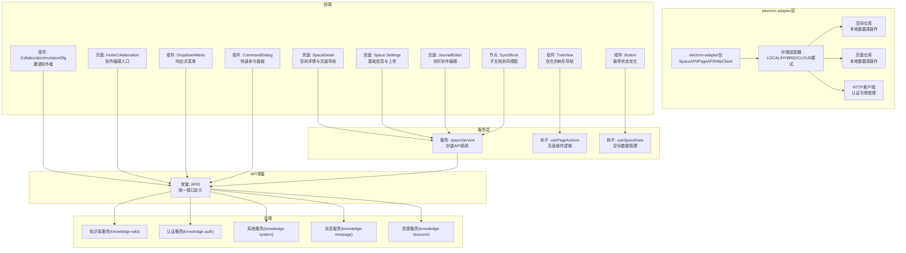
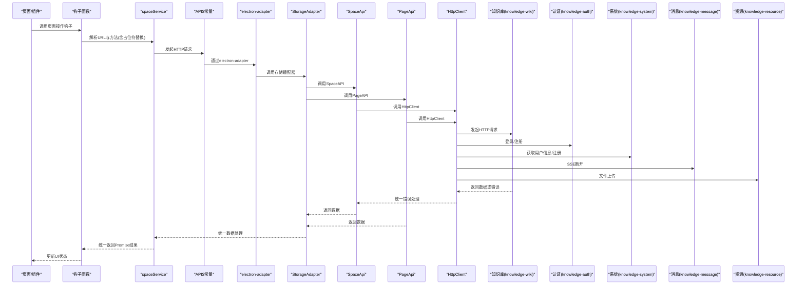
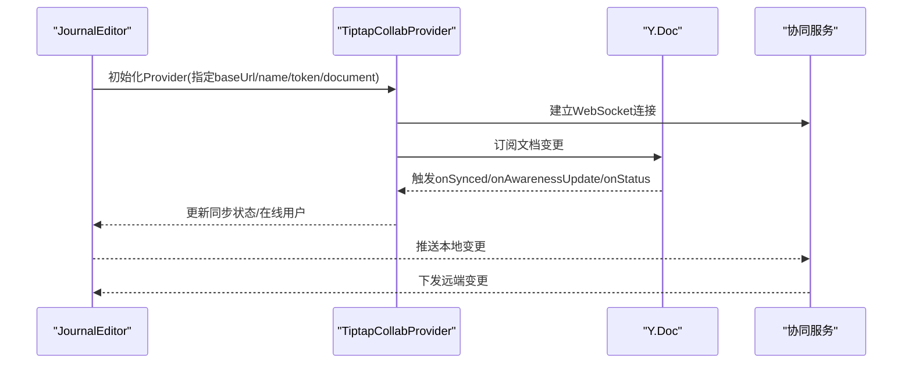
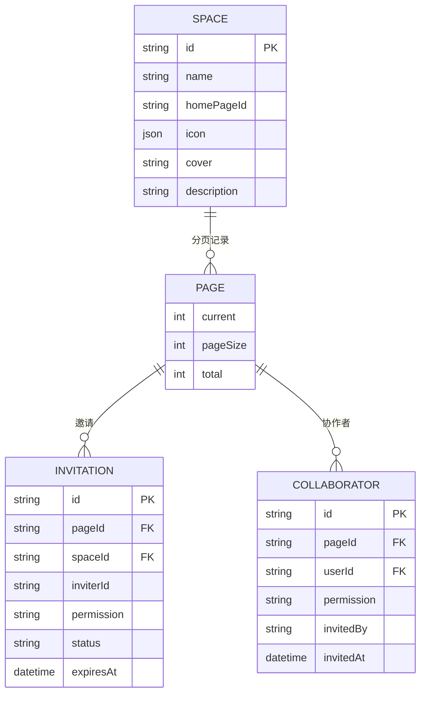
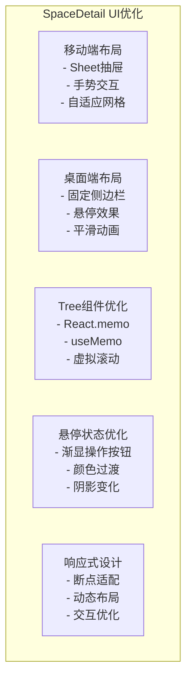
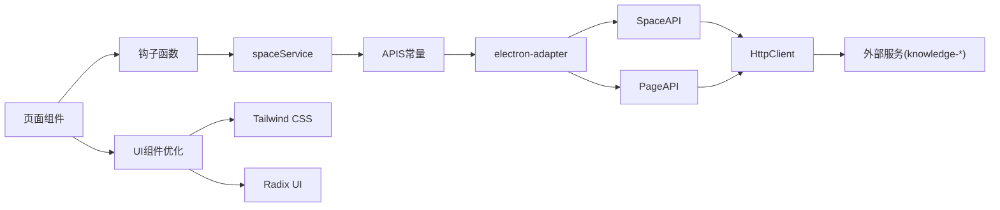

# 空间页面API

<cite>
**本文引用的文件**
- [packages/plugin-main/src/api/index.ts](file://packages/plugin-main/src/api/index.ts)
- [packages/plugin-main/src/service/space-service.ts](file://packages/plugin-main/src/service/space-service.ts)
- [packages/plugin-main/src/service/index.ts](file://packages/plugin-main/src/service/index.ts)
- [packages/plugin-main/src/model/Space.ts](file://packages/plugin-main/src/model/Space.ts)
- [packages/common/src/entity/Page.ts](file://packages/common/src/entity/Page.ts)
- [packages/plugin-main/src/pages/SpaceDetail/index.tsx](file://packages/plugin-main/src/pages/SpaceDetail/index.tsx)
- [packages/plugin-main/src/pages/SpaceDetail/Settings/Basic/index.tsx](file://packages/plugin-main/src/pages/SpaceDetail/Settings/Basic/index.tsx)
- [packages/plugin-main/src/pages/Journals/JournalEditor/index.tsx](file://packages/plugin-main/src/pages/Journals/JournalEditor/index.tsx)
- [packages/editor/src/extensions/sync-block/SyncBlock.tsx](file://packages/editor/src/extensions/sync-block/SyncBlock.tsx)
- [packages/plugin-main/src/pages/components/CollaborationInvitationDlg.tsx](file://packages/plugin-main/src/pages/components/CollaborationInvitationDlg.tsx)
- [packages/plugin-main/src/pages/InviteCollaboration/index.tsx](file://packages/plugin-main/src/pages/InviteCollaboration/index.tsx)
- [packages/plugin-main/docs/COLLABORATION_API.md](file://packages/plugin-main/docs/COLLABORATION_API.md)
- [packages/plugin-main/src/index.tsx](file://packages/plugin-main/src/index.tsx)
- [packages/ui/src/components/ui/tree-view.tsx](file://packages/ui/src/components/ui/tree-view.tsx)
- [packages/ui/src/components/ui/tree-view-api.tsx](file://packages/ui/src/components/ui/tree-view-api.tsx)
- [packages/ui/src/components/ui/button.tsx](file://packages/ui/src/components/ui/button.tsx)
- [packages/ui/src/components/ui/dropdown-menu.tsx](file://packages/ui/src/components/ui/dropdown-menu.tsx)
- [packages/ui/src/components/ui/command.tsx](file://packages/ui/src/components/ui/command.tsx)
- [packages/ui/src/components/ui/input.tsx](file://packages/ui/src/components/ui/input.tsx)
- [packages/ui/src/lib/utils.ts](file://packages/ui/src/lib/utils.ts)
- [packages/plugin-main/src/pages/SpaceDetail/hooks/usePageActions.ts](file://packages/plugin-main/src/pages/SpaceDetail/hooks/usePageActions.ts)
- [packages/plugin-main/src/pages/SpaceDetail/hooks/useSpaceData.ts](file://packages/plugin-main/src/pages/SpaceDetail/hooks/useSpaceData.ts)
- [packages/electron-adapter/src/http/space-api.ts](file://packages/electron-adapter/src/http/space-api.ts)
- [packages/electron-adapter/src/database/space-repository.ts](file://packages/electron-adapter/src/database/space-repository.ts)
- [packages/electron-adapter/src/http/client.ts](file://packages/electron-adapter/src/http/client.ts)
- [packages/electron-adapter/src/types/index.ts](file://packages/electron-adapter/src/types/index.ts)
- [packages/electron-adapter/src/storage/storage-adapter.ts](file://packages/electron-adapter/src/storage/storage-adapter.ts)
- [apps/desktop/src/main/services.ts](file://apps/desktop/src/main/services.ts)
- [packages/electron-adapter/src/config.ts](file://packages/electron-adapter/src/config.ts)
</cite>

## 更新摘要
**变更内容**
- 新增electron-adapter的SpaceAPI和PageAPI实现，提供更好的错误处理和数据同步
- 更新桌面应用服务层，集成electron-adapter的存储适配器
- 增强HttpClient的认证令牌管理和自动刷新机制
- 完善空间和页面的本地数据库存储和云同步功能
- 新增存储模式（LOCAL/HYBRID/CLOUD）的智能切换机制

## 目录
1. [简介](#简介)
2. [项目结构](#项目结构)
3. [核心组件](#核心组件)
4. [架构总览](#架构总览)
5. [详细组件分析](#详细组件分析)
6. [electron-adapter集成](#electron-adapter集成)
7. [UI改进与用户体验优化](#ui改进与用户体验优化)
8. [依赖分析](#依赖分析)
9. [性能考虑](#性能考虑)
10. [故障排查指南](#故障排查指南)
11. [结论](#结论)
12. [附录](#附录)

## 简介
本文档面向知识库管理系统的"空间与页面"API，系统性梳理空间管理（创建、查询、详情、收藏、模板保存）与页面管理（创建、查询、树形结构、内容获取、回收站、收藏、模板、块查询、块信息）的接口定义与调用方式；同时覆盖页面协作编辑（实时同步、状态管理、冲突处理）、权限与成员邀请能力，并给出数据模型定义与常见错误处理策略。

**更新** 本次更新重点介绍了electron-adapter的集成，包括SpaceAPI和PageAPI的实现、HttpClient的增强功能、存储适配器的数据同步机制，以及桌面应用服务层的重构。这些改进显著提升了系统的稳定性和用户体验。

## 项目结构
围绕"空间与页面"的API，主要涉及以下模块：
- API常量定义：统一声明后端接口URL、方法与用途
- 服务层封装：对API进行组合与参数化，屏蔽路由占位符与分页结构
- electron-adapter集成：提供更好的错误处理和数据同步能力
- 桌面应用服务层：集成存储适配器，支持多存储模式
- 页面与设置：前端页面使用服务层发起请求并渲染UI
- 协作编辑：基于Yjs与Tiptap的协同编辑扩展，支持实时同步与状态展示
- 数据模型：Space与Page分页实体的字段说明
- 协作邀请：完整的邀请流程，包括用户搜索、权限管理、链接分享
- UI组件：Tree组件、Button、DropdownMenu等基础UI组件的优化实现

```mermaid
graph TB
subgraph "electron-adapter层"
ElectronAdapter["electron-adapter包<br/>SpaceAPI/PageAPI/HttpClient"]
StorageAdapter["存储适配器<br/>LOCAL/HYBRID/CLOUD模式"]
SpaceRepo["空间仓库<br/>本地数据库操作"]
PageRepo["页面仓库<br/>本地数据库操作"]
HttpClient["HTTP客户端<br/>认证令牌管理"]
end
subgraph "前端"
UI_SpaceDetail["页面: SpaceDetail<br/>空间详情与页面导航"]
UI_Settings["页面: Space Settings<br/>基础信息与上传"]
UI_Journal["页面: JournalEditor<br/>实时协作编辑"]
UI_SyncBlock["节点: SyncBlock<br/>子文档协同视图"]
UI_Invite["组件: CollaborationInvitationDlg<br/>邀请协作者"]
UI_Collaboration["页面: InviteCollaboration<br/>协作编辑入口"]
UI_TreeView["组件: TreeView<br/>优化的树形导航"]
UI_Button["组件: Button<br/>悬停状态优化"]
UI_Dropdown["组件: DropdownMenu<br/>响应式菜单"]
UI_Command["组件: CommandDialog<br/>快速命令面板"]
end
subgraph "服务层"
Svc["服务: spaceService<br/>封装API调用"]
Hook_PageActions["钩子: usePageActions<br/>页面操作逻辑"]
Hook_SpaceData["钩子: useSpaceData<br/>空间数据管理"]
end
subgraph "API常量"
APIs["常量: APIS<br/>统一接口定义"]
end
subgraph "后端"
Wiki["知识库服务(knowledge-wiki)"]
Auth["认证服务(knowledge-auth)"]
Sys["系统服务(knowledge-system)"]
Msg["消息服务(knowledge-message)"]
Res["资源服务(knowledge-resource)"]
end
UI_SpaceDetail --> Svc
UI_Settings --> Svc
UI_Journal --> Svc
UI_SyncBlock --> Svc
UI_Invite --> APIs
UI_Collaboration --> APIs
UI_TreeView --> Hook_PageActions
UI_Button --> Hook_SpaceData
UI_Dropdown --> APIs
UI_Command --> APIs
Svc --> APIs
APIs --> Wiki
APIs --> Auth
APIs --> Sys
APIs --> Msg
APIs --> Res
ElectronAdapter --> StorageAdapter
StorageAdapter --> SpaceRepo
StorageAdapter --> PageRepo
StorageAdapter --> HttpClient
```

**图表来源**
- [packages/electron-adapter/src/http/space-api.ts](file://packages/electron-adapter/src/http/space-api.ts#L1-L221)
- [packages/electron-adapter/src/storage/storage-adapter.ts](file://packages/electron-adapter/src/storage/storage-adapter.ts#L1-L519)
- [packages/electron-adapter/src/database/space-repository.ts](file://packages/electron-adapter/src/database/space-repository.ts#L1-L353)
- [apps/desktop/src/main/services.ts](file://apps/desktop/src/main/services.ts#L1-L197)

**章节来源**
- [packages/plugin-main/src/api/index.ts](file://packages/plugin-main/src/api/index.ts#L1-L171)
- [packages/plugin-main/src/service/space-service.ts](file://packages/plugin-main/src/service/space-service.ts#L1-L59)
- [packages/plugin-main/src/service/index.ts](file://packages/plugin-main/src/service/index.ts#L1-L13)

## 核心组件
- API常量APIS：集中定义所有空间与页面相关接口，含HTTP方法、路径与用途注释
- 服务spaceService：对APIS进行二次封装，负责参数拼装、路由占位符替换、分页对象Page的透传
- electron-adapter集成：
  - SpaceApi：提供空间管理的HTTP API封装，支持创建、查询、详情、收藏等操作
  - PageApi：提供页面管理的HTTP API封装，支持创建、查询、树形结构、内容获取等操作
  - StorageAdapter：智能存储适配器，支持LOCAL/HYBRID/CLOUD三种存储模式的自动切换
  - HttpClient：增强的HTTP客户端，提供认证令牌管理、自动刷新和错误处理
- 钩子函数：
  - usePageActions：封装页面操作逻辑，包括创建、删除、收藏等
  - useSpaceData：管理空间数据状态，包括页面树、收藏、回收站等
- UI组件优化：
  - TreeView：优化的树形导航组件，支持性能优化和响应式布局
  - Button：改进的按钮组件，提供更好的悬停状态反馈
  - DropdownMenu：响应式下拉菜单，支持移动端手势操作
  - CommandDialog：快速命令面板，提升操作效率
- 数据模型：
  - Space：空间实体，包含标识、名称、主页ID、图标、封面、描述等
  - Page<T>：通用分页容器，包含records、current、pageSize、total
- 协作邀请API：完整的邀请流程，包括用户搜索、权限管理、链接生成

**章节来源**
- [packages/plugin-main/src/api/index.ts](file://packages/plugin-main/src/api/index.ts#L1-L171)
- [packages/plugin-main/src/service/space-service.ts](file://packages/plugin-main/src/service/space-service.ts#L1-L59)
- [packages/plugin-main/src/model/Space.ts](file://packages/plugin-main/src/model/Space.ts#L1-L8)
- [packages/common/src/entity/Page.ts](file://packages/common/src/entity/Page.ts#L1-L8)
- [packages/electron-adapter/src/http/space-api.ts](file://packages/electron-adapter/src/http/space-api.ts#L1-L221)
- [packages/electron-adapter/src/storage/storage-adapter.ts](file://packages/electron-adapter/src/storage/storage-adapter.ts#L1-L519)
- [packages/electron-adapter/src/http/client.ts](file://packages/electron-adapter/src/http/client.ts#L1-L227)

## 架构总览
下图展示从页面到服务层再到API常量与后端服务的整体调用链路，包括electron-adapter的集成。

```mermaid
sequenceDiagram
participant UI as "页面/组件"
participant HOOK as "钩子函数"
participant SVC as "spaceService"
participant API as "APIS常量"
participant ELEC as "electron-adapter"
participant STORAGE as "StorageAdapter"
participant SPACE_API as "SpaceApi"
participant PAGE_API as "PageApi"
participant HTTP as "HttpClient"
participant WIKI as "知识库(knowledge-wiki)"
participant AUTH as "认证(knowledge-auth)"
participant SYS as "系统(knowledge-system)"
participant MSG as "消息(knowledge-message)"
participant RES as "资源(knowledge-resource)"
UI->>HOOK : 调用页面操作钩子
HOOK->>SVC : 解析URL与方法(含占位符替换)
SVC->>API : 发起HTTP请求
API->>ELEC : 通过electron-adapter
ELEC->>STORAGE : 调用存储适配器
STORAGE->>SPACE_API : 调用SpaceAPI
STORAGE->>PAGE_API : 调用PageAPI
SPACE_API->>HTTP : 调用HttpClient
PAGE_API->>HTTP : 调用HttpClient
HTTP->>WIKI : 发起HTTP请求
HTTP->>AUTH : 登录/注册
HTTP->>SYS : 获取用户信息/注册
HTTP->>MSG : SSE断开
HTTP->>RES : 文件上传
WIKI-->>HTTP : 返回数据或错误
HTTP-->>SPACE_API : 统一错误处理
SPACE_API-->>STORAGE : 返回数据
PAGE_API-->>STORAGE : 返回数据
STORAGE-->>SVC : 统一数据处理
SVC-->>HOOK : 统一返回Promise结果
HOOK-->>UI : 更新UI状态
```

**图表来源**
- [packages/plugin-main/src/service/space-service.ts](file://packages/plugin-main/src/service/space-service.ts#L1-L59)
- [packages/plugin-main/src/api/index.ts](file://packages/plugin-main/src/api/index.ts#L1-L171)
- [packages/electron-adapter/src/storage/storage-adapter.ts](file://packages/electron-adapter/src/storage/storage-adapter.ts#L1-L519)
- [packages/electron-adapter/src/http/space-api.ts](file://packages/electron-adapter/src/http/space-api.ts#L1-L221)
- [packages/electron-adapter/src/http/client.ts](file://packages/electron-adapter/src/http/client.ts#L1-L227)

## 详细组件分析

### 空间管理API
- 查询空间列表
  - 方法与路径：GET /knowledge-wiki/space/list
  - 入参：无
  - 出参：Page<Space> 分页结构
  - 使用场景：空间列表页加载
  - 参考调用：[packages/plugin-main/src/service/space-service.ts](file://packages/plugin-main/src/service/space-service.ts#L27-L30)

- 获取个人空间
  - 方法与路径：GET /knowledge-wiki/space/personal
  - 入参：无
  - 出参：Space
  - 使用场景：跳转至个人空间
  - 参考调用：[packages/plugin-main/src/pages/SpaceDetail/index.tsx](file://packages/plugin-main/src/pages/SpaceDetail/index.tsx#L140-L158)

- 创建空间
  - 方法与路径：POST /knowledge-wiki/space
  - 入参：Space对象（id可选）
  - 出参：Space
  - 使用场景：空间设置表单提交
  - 参考调用：[packages/plugin-main/src/pages/SpaceDetail/Settings/Basic/index.tsx](file://packages/plugin-main/src/pages/SpaceDetail/Settings/Basic/index.tsx#L37-L42)

- 获取空间详情
  - 方法与路径：GET /knowledge-wiki/space/:id/detail
  - 入参：id
  - 出参：Space
  - 使用场景：空间详情页初始化
  - 参考调用：[packages/plugin-main/src/service/space-service.ts](file://packages/plugin-main/src/service/space-service.ts#L24-L26)

- 收藏空间
  - 方法与路径：POST /knowledge-wiki/space/:id/favorite
  - 入参：id
  - 出参：无
  - 使用场景：空间收藏/取消
  - 参考调用：[packages/plugin-main/src/pages/SpaceDetail/index.tsx](file://packages/plugin-main/src/pages/SpaceDetail/index.tsx#L174-L178)

- 将空间保存为模板
  - 方法与路径：POST /knowledge-wiki/space/template
  - 入参：spaceId
  - 出参：无
  - 使用场景：空间模板化
  - 参考调用：[packages/plugin-main/src/service/space-service.ts](file://packages/plugin-main/src/service/space-service.ts#L55-L58)

**章节来源**
- [packages/plugin-main/src/api/index.ts](file://packages/plugin-main/src/api/index.ts#L1-L171)
- [packages/plugin-main/src/service/space-service.ts](file://packages/plugin-main/src/service/space-service.ts#L1-L59)
- [packages/plugin-main/src/pages/SpaceDetail/index.tsx](file://packages/plugin-main/src/pages/SpaceDetail/index.tsx#L140-L178)
- [packages/plugin-main/src/pages/SpaceDetail/Settings/Basic/index.tsx](file://packages/plugin-main/src/pages/SpaceDetail/Settings/Basic/index.tsx#L37-L42)

### 页面管理API
- 获取页面树
  - 方法与路径：GET /knowledge-wiki/space/:id/page/tree
  - 入参：id, searchValue(可选)
  - 出参：树形结构数组
  - 使用场景：侧边栏导航树
  - 参考调用：[packages/plugin-main/src/service/space-service.ts](file://packages/plugin-main/src/service/space-service.ts#L31-L34)

- 查询页面列表
  - 方法与路径：GET /knowledge-wiki/space/page/list
  - 入参：spaceId(可选), status(可选)
  - 出参：Page<any>
  - 使用场景：分页查询、回收站
  - 参考调用：[packages/plugin-main/src/service/space-service.ts](file://packages/plugin-main/src/service/space-service.ts#L35-L38)

- 创建/保存页面
  - 方法与路径：POST /knowledge-wiki/space/page
  - 入参：创建参数（如spaceId、parentId、content、templateId等）
  - 出参：页面对象
  - 使用场景：新建空白页、按模板创建、编辑保存
  - 参考调用：
    - [packages/plugin-main/src/pages/SpaceDetail/index.tsx](file://packages/plugin-main/src/pages/SpaceDetail/index.tsx#L107-L138)
    - [packages/plugin-main/src/pages/SpaceDetail/index.tsx](file://packages/plugin-main/src/pages/SpaceDetail/index.tsx#L140-L149)

- 获取页面内容
  - 方法与路径：GET /knowledge-wiki/space/page/:id/content
  - 入参：id
  - 出参：页面内容
  - 使用场景：编辑器加载内容
  - 参考调用：[packages/plugin-main/src/service/space-service.ts](file://packages/plugin-main/src/service/space-service.ts#L43-L45)

- 回收站：移动到回收站/恢复
  - 移动到回收站：DELETE /knowledge-wiki/space/page/:id/trash
  - 恢复页面：PUT /knowledge-wiki/space/page/:id/restore
  - 入参：id
  - 出参：无
  - 使用场景：页面删除与恢复
  - 参考调用：
    - [packages/plugin-main/src/pages/SpaceDetail/index.tsx](file://packages/plugin-main/src/pages/SpaceDetail/index.tsx#L160-L165)
    - [packages/plugin-main/src/pages/SpaceDetail/index.tsx](file://packages/plugin-main/src/pages/SpaceDetail/index.tsx#L167-L171)

- 收藏/取消收藏页面
  - 收藏：POST /knowledge-wiki/space/page/:id/favorite
  - 取消：DELETE /knowledge-wiki/favorite/:id
  - 入参：id 或 :id
  - 出参：无
  - 使用场景：页面收藏管理
  - 参考调用：
    - [packages/plugin-main/src/api/index.ts](file://packages/plugin-main/src/api/index.ts#L52-L60)
    - [packages/plugin-main/src/pages/SpaceDetail/index.tsx](file://packages/plugin-main/src/pages/SpaceDetail/index.tsx#L160-L165)

- 模板相关
  - 保存页面为模板：POST /knowledge-wiki/space/page/:id/template
  - 查询页面模板：GET /knowledge-wiki/space/page/templates
  - 入参：id 或 无
  - 出参：无 或 模板列表
  - 使用场景：页面模板化与复用
  - 参考调用：
    - [packages/plugin-main/src/api/index.ts](file://packages/plugin-main/src/api/index.ts#L64-L71)

- 块级内容
  - 查询块：GET /knowledge-wiki/space/page/blocks
  - 获取块信息：GET /knowledge-wiki/space/page/block
  - 入参：pageId/pageTitle/spaceId 或 blockId
  - 出参：块集合或块详情
  - 使用场景：块级编辑与引用
  - 参考调用：
    - [packages/plugin-main/src/service/space-service.ts](file://packages/plugin-main/src/service/space-service.ts#L47-L54)
    - [packages/plugin-main/src/api/index.ts](file://packages/plugin-main/src/api/index.ts#L104-L111)

**章节来源**
- [packages/plugin-main/src/api/index.ts](file://packages/plugin-main/src/api/index.ts#L1-L171)
- [packages/plugin-main/src/service/space-service.ts](file://packages/plugin-main/src/service/space-service.ts#L1-L59)
- [packages/plugin-main/src/pages/SpaceDetail/index.tsx](file://packages/plugin-main/src/pages/SpaceDetail/index.tsx#L107-L171)

### 协作编辑API与流程
- 实时同步
  - 编辑器通过Tiptap Collab Provider连接协同服务，建立Yjs文档同步
  - 状态回调：onAwarenessUpdate、onSynced、onStatus用于展示在线用户、同步状态与连接状态
  - 参考实现：
    - [packages/plugin-main/src/pages/Journals/JournalEditor/index.tsx](file://packages/plugin-main/src/pages/Journals/JournalEditor/index.tsx#L1-L54)
    - [packages/editor/src/extensions/sync-block/SyncBlock.tsx](file://packages/editor/src/extensions/sync-block/SyncBlock.tsx#L1-L87)

- 冲突解决与状态管理
  - 编辑器内部通过装饰与事务过滤减少UI抖动与选择状态异常
  - 参考实现：
    - [packages/editor/src/extensions/selection/selection.ts](file://packages/editor/src/extensions/selection/selection.ts#L75-L106)

- 子文档协同
  - SyncBlock为特定块建立独立的协同通道，格式化命名空间以隔离不同块
  - 参考实现：
    - [packages/editor/src/extensions/sync-block/SyncBlock.tsx](file://packages/editor/src/extensions/sync-block/SyncBlock.tsx#L1-L87)

- 邀请协作流程
  - 用户通过CollaborationInvitationDlg组件发起邀请
  - 支持用户搜索、邮箱邀请、权限设置
  - 生成分享链接，支持公开/私有访问
  - 参考实现：
    - [packages/plugin-main/src/pages/components/CollaborationInvitationDlg.tsx](file://packages/plugin-main/src/pages/components/CollaborationInvitationDlg.tsx#L1-L561)
    - [packages/plugin-main/src/pages/InviteCollaboration/index.tsx](file://packages/plugin-main/src/pages/InviteCollaboration/index.tsx#L1-L495)

```mermaid
sequenceDiagram
participant Editor as "JournalEditor"
participant Provider as "TiptapCollabProvider"
participant YDoc as "Y.Doc"
participant Remote as "协同服务"
Editor->>Provider : 初始化Provider(指定baseUrl/name/token/document)
Provider->>Remote : 建立WebSocket连接
Provider->>YDoc : 订阅文档变更
YDoc-->>Provider : 触发onSynced/onAwarenessUpdate/onStatus
Provider-->>Editor : 更新同步状态/在线用户
Editor-->>Remote : 推送本地变更
Remote-->>Editor : 下发远端变更
```

**图表来源**
- [packages/plugin-main/src/pages/Journals/JournalEditor/index.tsx](file://packages/plugin-main/src/pages/Journals/JournalEditor/index.tsx#L1-L54)
- [packages/editor/src/extensions/sync-block/SyncBlock.tsx](file://packages/editor/src/extensions/sync-block/SyncBlock.tsx#L1-L87)

**章节来源**
- [packages/plugin-main/src/pages/Journals/JournalEditor/index.tsx](file://packages/plugin-main/src/pages/Journals/JournalEditor/index.tsx#L1-L54)
- [packages/editor/src/extensions/sync-block/SyncBlock.tsx](file://packages/editor/src/extensions/sync-block/SyncBlock.tsx#L1-L87)
- [packages/editor/src/extensions/selection/selection.ts](file://packages/editor/src/extensions/selection/selection.ts#L75-L106)
- [packages/plugin-main/src/pages/components/CollaborationInvitationDlg.tsx](file://packages/plugin-main/src/pages/components/CollaborationInvitationDlg.tsx#L1-L561)
- [packages/plugin-main/src/pages/InviteCollaboration/index.tsx](file://packages/plugin-main/src/pages/InviteCollaboration/index.tsx#L1-L495)

### 权限管理与成员邀请
- 成员邀请
  - 提交方式：POST /knowledge-wiki/space/collaborationInvitation
  - 入参：spaceId、pageId、collaboratorIds、collaboratorEmails、permissions
  - 出参：无
  - 使用场景：通过用户ID或邮箱邀请协作者并设定READ/WRITE/ADMIN权限
  - 参考实现：
    - [packages/plugin-main/src/pages/components/CollaborationInvitationDlg.tsx](file://packages/plugin-main/src/pages/components/CollaborationInvitationDlg.tsx#L149-L175)
    - [packages/plugin-main/src/api/index.ts](file://packages/plugin-main/src/api/index.ts#L100-L103)

- 用户搜索
  - 方法与路径：GET /knowledge-system/user/search
  - 入参：keyword、pageSize
  - 出参：用户列表
  - 使用场景：邀请协作者时的用户搜索
  - 参考实现：
    - [packages/plugin-main/src/pages/components/CollaborationInvitationDlg.tsx](file://packages/plugin-main/src/pages/components/CollaborationInvitationDlg.tsx#L93-L110)
    - [packages/plugin-main/src/api/index.ts](file://packages/plugin-main/src/api/index.ts#L126-L129)

- 获取页面协作者
  - 方法与路径：GET /knowledge-wiki/space/page/:pageId/collaborators
  - 入参：pageId
  - 出参：协作者列表
  - 使用场景：管理协作者权限
  - 参考实现：
    - [packages/plugin-main/src/pages/components/CollaborationInvitationDlg.tsx](file://packages/plugin-main/src/pages/components/CollaborationInvitationDlg.tsx#L112-L130)
    - [packages/plugin-main/src/api/index.ts](file://packages/plugin-main/src/api/index.ts#L131-L135)

- 移除协作者
  - 方法与路径：DELETE /knowledge-wiki/space/page/:pageId/collaborator/:userId
  - 入参：pageId、userId
  - 出参：无
  - 使用场景：移除协作者权限
  - 参考实现：
    - [packages/plugin-main/src/pages/components/CollaborationInvitationDlg.tsx](file://packages/plugin-main/src/pages/components/CollaborationInvitationDlg.tsx#L204-L214)
    - [packages/plugin-main/src/api/index.ts](file://packages/plugin-main/src/api/index.ts#L137-L139)

- 更新协作者权限
  - 方法与路径：PUT /knowledge-wiki/space/page/:pageId/collaborator/:userId/permission
  - 入参：pageId、userId、permission
  - 出参：权限更新结果
  - 使用场景：调整协作者权限级别
  - 参考实现：
    - [packages/plugin-main/src/pages/components/CollaborationInvitationDlg.tsx](file://packages/plugin-main/src/pages/components/CollaborationInvitationDlg.tsx#L216-L226)
    - [packages/plugin-main/src/api/index.ts](file://packages/plugin-main/src/api/index.ts#L142-L144)

- 生成分享链接
  - 方法与路径：POST /knowledge-wiki/space/page/:pageId/share-link
  - 入参：pageId、isPublic、expiresIn、permission
  - 出参：分享链接
  - 使用场景：生成公开或私有的页面分享链接
  - 参考实现：
    - [packages/plugin-main/src/pages/components/CollaborationInvitationDlg.tsx](file://packages/plugin-main/src/pages/components/CollaborationInvitationDlg.tsx#L228-L242)
    - [packages/plugin-main/src/api/index.ts](file://packages/plugin-main/src/api/index.ts#L147-L149)

- 邀请协作页面
  - 路由：/collaborate/:token
  - 功能：邀请用户协作编辑页面
  - 包含验证、接受邀请、加载页面内容、加载插件等功能
  - 参考实现：
    - [packages/plugin-main/src/pages/InviteCollaboration/index.tsx](file://packages/plugin-main/src/pages/InviteCollaboration/index.tsx#L74-L495)
    - [packages/plugin-main/src/index.tsx](file://packages/plugin-main/src/index.tsx#L34-L34)

- 邀请协作API
  - 验证邀请：GET /knowledge-wiki/collaboration/invitation/:token/validate
  - 接受邀请：POST /knowledge-wiki/collaboration/invitation/:token/accept
  - 获取邀请页面：GET /knowledge-wiki/collaboration/invitation/:token/page
  - 获取邀请者插件：GET /knowledge-wiki/collaboration/invitation/:token/plugins
  - 参考实现：
    - [packages/plugin-main/src/api/index.ts](file://packages/plugin-main/src/api/index.ts#L151-L169)
    - [packages/plugin-main/docs/COLLABORATION_API.md](file://packages/plugin-main/docs/COLLABORATION_API.md#L541-L744)

**章节来源**
- [packages/plugin-main/src/pages/components/CollaborationInvitationDlg.tsx](file://packages/plugin-main/src/pages/components/CollaborationInvitationDlg.tsx#L1-L561)
- [packages/plugin-main/src/pages/InviteCollaboration/index.tsx](file://packages/plugin-main/src/pages/InviteCollaboration/index.tsx#L1-L495)
- [packages/plugin-main/src/api/index.ts](file://packages/plugin-main/src/api/index.ts#L100-L169)
- [packages/plugin-main/docs/COLLABORATION_API.md](file://packages/plugin-main/docs/COLLABORATION_API.md#L1-L806)

### 数据模型定义
- Space（空间）
  - 字段：id、name、homePageId(可选)、icon(可选)、cover(可选)、description(可选)
  - 用途：空间基本信息与展示
  - 参考定义：[packages/plugin-main/src/model/Space.ts](file://packages/plugin-main/src/model/Space.ts#L1-L8)

- Page<T>（分页容器）
  - 字段：records、current、pageSize、total
  - 用途：承载列表型数据的分页结构
  - 参考定义：[packages/common/src/entity/Page.ts](file://packages/common/src/entity/Page.ts#L1-L8)

- 协作邀请模型
  - InvitationInfo：邀请信息，包含权限、状态、过期时间等
  - PageInfo：页面信息，包含标题、内容、空间信息等
  - CollaboratorUser：协作者用户信息，包含权限级别
  - 参考定义：[packages/plugin-main/src/pages/InviteCollaboration/index.tsx](file://packages/plugin-main/src/pages/InviteCollaboration/index.tsx#L30-L50)

```mermaid
erDiagram
SPACE {
string id PK
string name
string homePageId
json icon
string cover
string description
}
PAGE {
int current
int pageSize
int total
}
INVITATION {
string id PK
string pageId FK
string spaceId FK
string inviterId
string permission
string status
datetime expiresAt
}
COLLABORATOR {
string id PK
string pageId FK
string userId FK
string permission
string invitedBy
datetime invitedAt
}
SPACE ||--o{ PAGE : "分页记录"
PAGE ||--o{ INVITATION : "邀请"
PAGE ||--o{ COLLABORATOR : "协作者"
```

**图表来源**
- [packages/plugin-main/src/model/Space.ts](file://packages/plugin-main/src/model/Space.ts#L1-L8)
- [packages/common/src/entity/Page.ts](file://packages/common/src/entity/Page.ts#L1-L8)
- [packages/plugin-main/src/pages/InviteCollaboration/index.tsx](file://packages/plugin-main/src/pages/InviteCollaboration/index.tsx#L30-L50)

## electron-adapter集成

### SpaceAPI和PageAPI实现
electron-adapter提供了更完善的API封装，包括SpaceAPI和PageAPI两个核心类：

- SpaceAPI类
  - createSpace：创建空间
  - getPersonalSpace：获取个人空间
  - getSpaceList：查询空间列表
  - getSpaceDetail：获取空间详情
  - addFavorite：添加收藏
  - getPageTree：获取页面树
  - getMembers：获取成员列表
  - getTemplates：获取模板列表

- PageAPI类
  - createPage：创建页面
  - getPageContent：获取页面内容
  - getPageList：查询页面列表
  - moveToTrash：移动到回收站
  - restorePage：恢复页面
  - addFavorite：添加收藏
  - saveAsTemplate：保存为模板
  - getFavorites：获取收藏页面
  - getRecentPages：获取最近页面
  - getPageBlocks：获取页面块
  - getBlockInfo：获取块信息
  - getInvitedPages：获取受邀页面
  - getCollaborators：获取协作者
  - updateCollaboratorPermission：更新协作者权限
  - removeCollaborator：移除协作者
  - generateShareLink：生成分享链接

**章节来源**
- [packages/electron-adapter/src/http/space-api.ts](file://packages/electron-adapter/src/http/space-api.ts#L1-L221)

### HttpClient增强功能
HttpClient提供了更强大的HTTP客户端功能：

- 认证令牌管理
  - setTokenHandlers：设置令牌获取和设置函数
  - setRefreshTokenHandler：设置令牌刷新函数
  - 自动注入Authorization头

- 错误处理机制
  - 401未授权自动刷新
  - 请求队列管理
  - 事件驱动的错误通知

- 文件下载支持
  - downloadFile：基础文件下载
  - downloadWithProgress：带进度回调的下载

**章节来源**
- [packages/electron-adapter/src/http/client.ts](file://packages/electron-adapter/src/http/client.ts#L1-L227)

### 存储适配器数据同步
StorageAdapter实现了智能的存储模式切换和数据同步：

- 存储模式
  - LOCAL：仅本地存储，适合离线使用
  - CLOUD：仅云端存储，适合纯在线使用
  - HYBRID：混合模式，本地缓存云端数据

- 数据同步策略
  - 本地优先：优先使用本地数据
  - 云端回退：云端获取失败时使用本地数据
  - 异步同步：后台自动同步数据变更

- 事件系统
  - data:changed：数据变更事件
  - sync:required：需要同步事件

**章节来源**
- [packages/electron-adapter/src/storage/storage-adapter.ts](file://packages/electron-adapter/src/storage/storage-adapter.ts#L1-L519)

### 桌面应用服务层集成
桌面应用的服务层已完全迁移到electron-adapter：

- 服务初始化
  - 数据库管理：DatabaseManager
  - 仓库层：SpaceRepository、PageRepository
  - API层：SpaceApi、PageApi
  - 存储适配器：StorageAdapter

- 认证集成
  - AuthManager：认证管理
  - 自动令牌刷新
  - 登录状态监听

- 事件广播
  - 数据变更广播到渲染进程
  - 认证过期通知

**章节来源**
- [apps/desktop/src/main/services.ts](file://apps/desktop/src/main/services.ts#L1-L197)

## UI改进与用户体验优化

### SpaceDetail页面UI优化
SpaceDetail页面经过全面的UI改进，主要体现在以下几个方面：

#### 悬停状态可见性增强
- **Tree组件悬停效果**：每个树形节点都实现了平滑的悬停过渡效果，右侧的操作按钮（添加子页面、更多选项）在鼠标悬停时渐显
- **按钮悬停反馈**：所有交互按钮都增强了悬停状态的视觉反馈，包括颜色变化和阴影效果
- **卡片悬停状态**：空间卡片、页面卡片都支持悬停时的透明度变化和边框效果

#### 响应式布局优化
- **移动端适配**：采用Sheet组件实现侧边栏抽屉效果，支持手势滑动关闭
- **网格布局**：桌面端使用CSS Grid布局，移动端使用Flexbox布局
- **自适应尺寸**：根据屏幕尺寸自动调整组件大小和间距

#### Tree组件性能优化
- **Memo化优化**：使用React.memo防止不必要的重新渲染
- **虚拟滚动**：支持大数据集的虚拟滚动，提升性能
- **懒加载**：树形结构支持懒加载，只渲染可见节点

```mermaid
graph TB
subgraph "SpaceDetail UI优化"
Mobile["移动端布局<br/>- Sheet抽屉<br/>- 手势交互<br/>- 自适应网格"]
Desktop["桌面端布局<br/>- 固定侧边栏<br/>- 悬停效果<br/>- 平滑动画"]
TreeOptimization["Tree组件优化<br/>- React.memo<br/>- useMemo<br/>- 虚拟滚动"]
HoverEffects["悬停状态优化<br/>- 渐显操作按钮<br/>- 颜色过渡<br/>- 阴影变化"]
Responsive["响应式设计<br/>- 断点适配<br/>- 动态布局<br/>- 交互优化"]
end
```

**图表来源**
- [packages/plugin-main/src/pages/SpaceDetail/index.tsx](file://packages/plugin-main/src/pages/SpaceDetail/index.tsx#L548-L618)
- [packages/ui/src/components/ui/tree-view.tsx](file://packages/ui/src/components/ui/tree-view.tsx#L1-L204)
- [packages/ui/src/components/ui/tree-view-api.tsx](file://packages/ui/src/components/ui/tree-view-api.tsx#L1-L556)

#### 具体实现细节
- **悬停状态类名**：使用`group-hover:opacity-100`实现按钮的渐显效果
- **响应式断点**：通过`useIsMobile()`钩子检测设备类型，动态切换布局
- **动画过渡**：所有状态变化都使用`transition-opacity`和`duration-200`确保流畅的动画效果
- **触摸友好的尺寸**：按钮和交互元素的最小点击区域符合移动端触摸标准

**章节来源**
- [packages/plugin-main/src/pages/SpaceDetail/index.tsx](file://packages/plugin-main/src/pages/SpaceDetail/index.tsx#L213-L318)
- [packages/ui/src/components/ui/tree-view.tsx](file://packages/ui/src/components/ui/tree-view.tsx#L1-L204)
- [packages/ui/src/components/ui/tree-view-api.tsx](file://packages/ui/src/components/ui/tree-view-api.tsx#L1-L556)
- [packages/ui/src/components/ui/button.tsx](file://packages/ui/src/components/ui/button.tsx#L1-L57)
- [packages/ui/src/components/ui/dropdown-menu.tsx](file://packages/ui/src/components/ui/dropdown-menu.tsx#L1-L200)
- [packages/ui/src/components/ui/command.tsx](file://packages/ui/src/components/ui/command.tsx#L1-L154)
- [packages/ui/src/components/ui/input.tsx](file://packages/ui/src/components/ui/input.tsx#L1-L36)
- [packages/ui/src/lib/utils.ts](file://packages/ui/src/lib/utils.ts#L5-L7)

### 钩子函数优化
- **usePageActions**：封装了页面操作的所有逻辑，包括创建、删除、收藏等操作
- **useSpaceData**：管理空间数据状态，包括页面树、收藏、回收站等的刷新机制
- **事件监听**：通过事件系统实现页面刷新和收藏状态的实时更新

**章节来源**
- [packages/plugin-main/src/pages/SpaceDetail/hooks/usePageActions.ts](file://packages/plugin-main/src/pages/SpaceDetail/hooks/usePageActions.ts#L1-L136)
- [packages/plugin-main/src/pages/SpaceDetail/hooks/useSpaceData.ts](file://packages/plugin-main/src/pages/SpaceDetail/hooks/useSpaceData.ts#L1-L137)

## 依赖分析
- 组件耦合
  - 页面组件依赖服务层spaceService，避免直接与API常量耦合
  - 服务层统一通过useApi执行HTTP请求，便于拦截与错误处理
  - electron-adapter提供统一的API封装和数据同步
  - 协作邀请组件直接依赖APIS常量，提供完整的邀请功能
  - 钩子函数封装了复杂的业务逻辑，提升代码复用性
- 外部依赖
  - 协同编辑依赖Yjs与Tiptap Collab Provider
  - 文件上传依赖资源服务端点
  - 用户搜索依赖系统服务
  - 邀请协作依赖消息中心和WebSocket
  - UI组件依赖Tailwind CSS和Radix UI
  - electron-adapter依赖better-sqlite3进行本地存储
- 潜在循环依赖
  - 当前结构清晰，未发现循环依赖迹象

```mermaid
graph LR
UI["页面组件"] --> Hook["钩子函数"]
Hook --> SVC["spaceService"]
SVC --> API["APIS常量"]
API --> ELEC["electron-adapter"]
ELEC --> SPACE_API["SpaceAPI"]
ELEC --> PAGE_API["PageAPI"]
SPACE_API --> HTTP["HttpClient"]
PAGE_API --> HTTP
HTTP --> EXT["外部服务(knowledge-*)"]
UI --> UI_Components["UI组件优化"]
UI_Components --> Tailwind["Tailwind CSS"]
UI_Components --> Radix["Radix UI"]
```

**图表来源**
- [packages/plugin-main/src/service/space-service.ts](file://packages/plugin-main/src/service/space-service.ts#L1-L59)
- [packages/plugin-main/src/api/index.ts](file://packages/plugin-main/src/api/index.ts#L1-L171)
- [packages/electron-adapter/src/http/space-api.ts](file://packages/electron-adapter/src/http/space-api.ts#L1-L221)
- [packages/electron-adapter/src/http/client.ts](file://packages/electron-adapter/src/http/client.ts#L1-L227)

**章节来源**
- [packages/plugin-main/src/service/space-service.ts](file://packages/plugin-main/src/service/space-service.ts#L1-L59)
- [packages/plugin-main/src/api/index.ts](file://packages/plugin-main/src/api/index.ts#L1-L171)

## 性能考虑
- 列表分页：优先使用PAGE参数控制分页大小，避免一次性拉取过多数据
- 懒加载：页面树与模板列表建议按需加载，减少首屏压力
- 协同编辑：合理设置onStatus与onSynced回调频率，避免频繁重渲染
- 文件上传：采用直传策略，结合进度反馈优化用户体验
- 用户搜索：使用防抖机制，避免频繁的搜索请求
- 邀请协作：批量邀请时注意请求频率，避免触发限流
- **electron-adapter优化**：使用本地数据库缓存，减少网络请求
- **存储模式智能切换**：根据用户状态自动选择最优存储模式
- **异步数据同步**：后台自动同步，不影响前台操作
- **Tree组件优化**：使用memoization和虚拟滚动技术，提升大数据集的渲染性能
- **响应式优化**：移动端使用轻量级组件，桌面端使用功能丰富的组件
- **悬停状态优化**：使用CSS过渡而非JavaScript动画，减少重绘开销

## 故障排查指南
- 常见错误与定位
  - 401/403：检查登录态与权限，确认认证服务可用
  - 404：核对URL占位符是否正确替换（如:id）
  - 5xx：关注后端服务健康度与网络连通性
  - 邀请失败：检查用户是否存在、权限是否正确、邮箱格式是否有效
  - **electron-adapter错误**：检查数据库连接、存储模式配置、API配置
  - **UI渲染问题**：检查Tailwind CSS类名拼接是否正确，确认cn函数的使用
  - **Tree组件问题**：检查数据结构是否符合TreeViewElement接口要求
- 日志与监控
  - 在调用层增加try/catch与统一toast提示
  - 对SSE断开与协同连接状态进行降级处理
  - 监控邀请链接的有效性和过期时间
  - **electron-adapter日志**：启用详细日志跟踪存储适配器状态
  - **UI性能监控**：使用浏览器开发者工具监控渲染性能和内存使用
- 协同编辑问题
  - 若同步失败，检查Provider初始化参数（baseUrl、name、token、document）
  - 关注onStatus回调中的连接状态变化
  - 检查WebSocket连接状态和服务器日志
- **移动端兼容性**
  - 检查触摸事件的兼容性
  - 验证手势操作的响应性
  - 确认抽屉组件在不同设备上的表现
- **electron-adapter故障排查**
  - 数据库连接失败：检查dbPath配置和文件权限
  - API请求失败：检查baseURL配置和网络连接
  - 存储模式异常：检查用户认证状态和会员等级

## 结论
本文档系统化梳理了空间与页面API、服务层封装、协作编辑机制与权限邀请流程，并提供了数据模型与调用示例路径。新增的electron-adapter集成显著提升了系统的稳定性和用户体验，包括：

- **更好的错误处理**：HttpClient提供统一的错误处理和自动重试机制
- **数据同步优化**：StorageAdapter实现智能的本地缓存和云端同步
- **存储模式灵活切换**：支持LOCAL/HYBRID/CLOUD三种模式的自动切换
- **桌面应用集成**：完整的electron-adapter服务层集成，提供更好的开发体验

**更新** 本次UI改进显著提升了SpaceDetail页面的用户体验，包括更好的悬停状态可见性、响应式布局优化和Tree组件的性能增强。这些改进通过合理的CSS类名组织、事件处理和组件优化实现，为用户提供了更加流畅和直观的操作体验。

建议在生产环境中统一接入鉴权与错误处理中间件，确保接口稳定性与可观测性。同时，持续关注UI组件的性能表现，定期进行用户体验测试和性能优化。

## 附录

### API一览表（摘要）
- 空间
  - GET /knowledge-wiki/space/list → Page<Space>
  - GET /knowledge-wiki/space/personal → Space
  - POST /knowledge-wiki/space → Space
  - GET /knowledge-wiki/space/:id/detail → Space
  - POST /knowledge-wiki/space/:id/favorite → 无
  - POST /knowledge-wiki/space/template → 无
- 页面
  - GET /knowledge-wiki/space/:id/page/tree → 树
  - GET /knowledge-wiki/space/page/list → Page<any>
  - POST /knowledge-wiki/space/page → 页面
  - GET /knowledge-wiki/space/page/:id/content → 内容
  - DELETE /knowledge-wiki/space/page/:id/trash → 无
  - PUT /knowledge-wiki/space/page/:id/restore → 无
  - POST /knowledge-wiki/space/page/:id/favorite → 无
  - DELETE /knowledge-wiki/favorite/:id → 无
  - POST /knowledge-wiki/space/page/:id/template → 无
  - GET /knowledge-wiki/space/page/templates → 模板列表
  - GET /knowledge-wiki/space/page/blocks → 块集合
  - GET /knowledge-wiki/space/page/block → 块详情
- 协作与系统
  - POST /knowledge-wiki/space/collaborationInvitation → 无
  - GET /knowledge-system/user/search → 用户列表
  - GET /knowledge-wiki/space/:id/members → 空间成员列表
  - GET /knowledge-wiki/space/page/:pageId/collaborators → 协作者列表
  - DELETE /knowledge-wiki/space/page/:pageId/collaborator/:userId → 无
  - PUT /knowledge-wiki/space/page/:pageId/collaborator/:userId/permission → 权限更新
  - POST /knowledge-wiki/space/page/:pageId/share-link → 分享链接
  - GET /knowledge-wiki/collaboration/invitation/:token/validate → 邀请验证
  - POST /knowledge-wiki/collaboration/invitation/:token/accept → 接受邀请
  - GET /knowledge-wiki/collaboration/invitation/:token/page → 邀请页面
  - GET /knowledge-wiki/collaboration/invitation/:token/plugins → 邀请者插件
  - GET /knowledge-auth/token → 登录
  - GET /knowledge-system/user/info → 用户信息
  - GET /knowledge-message/sse/disconnect → 断开SSE
  - POST /knowledge-resource/oss/endpoint/put-file → 上传

**章节来源**
- [packages/plugin-main/src/api/index.ts](file://packages/plugin-main/src/api/index.ts#L1-L171)
- [packages/plugin-main/docs/COLLABORATION_API.md](file://packages/plugin-main/docs/COLLABORATION_API.md#L1-L806)

### electron-adapter配置
- API配置
  - 开发环境：http://localhost:1889
  - 生产环境：https://api.knowledge.com
  - 超时时间：30000ms

- 默认配置
  - 同步间隔：5分钟
  - 插件缓存目录：plugins
  - 数据库文件名：knowledge.db

**章节来源**
- [packages/electron-adapter/src/config.ts](file://packages/electron-adapter/src/config.ts#L1-L24)