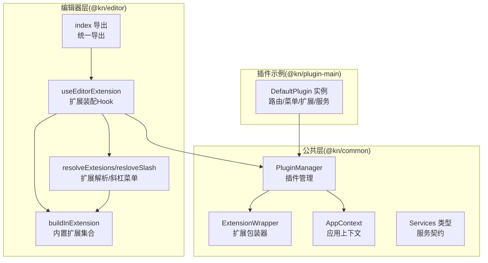
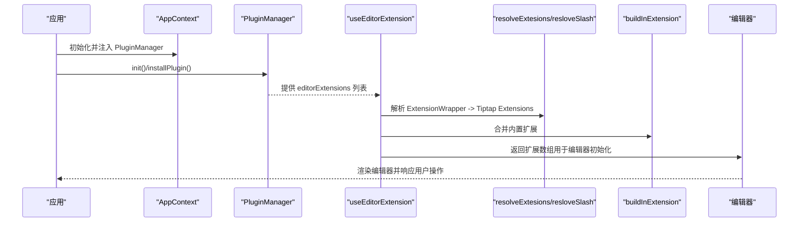
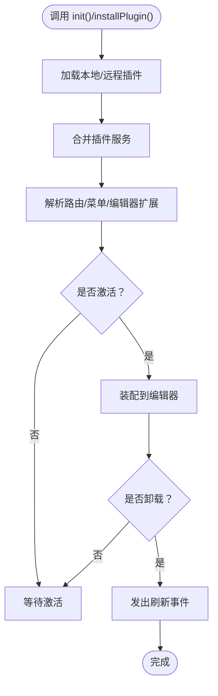
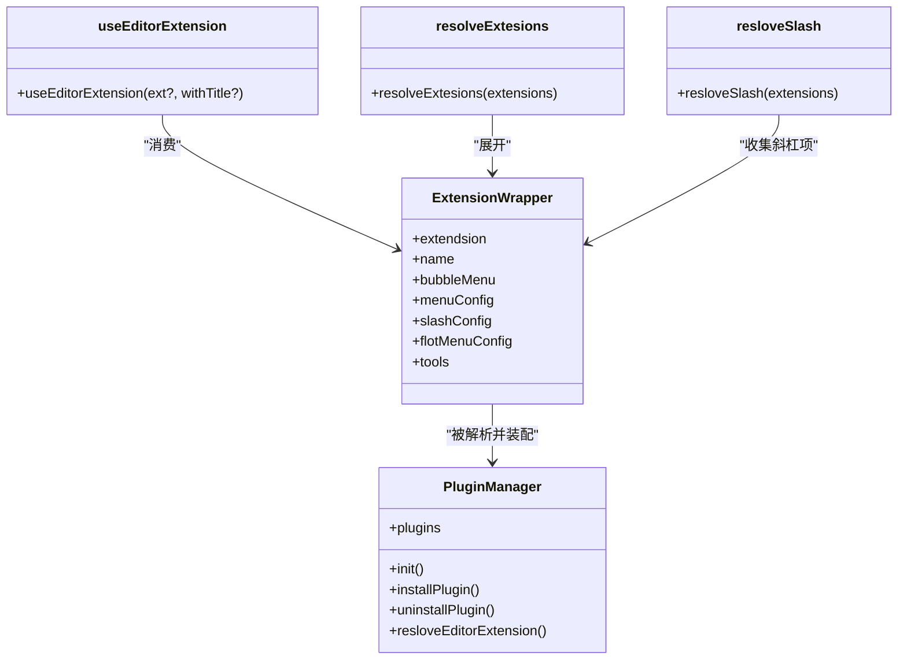
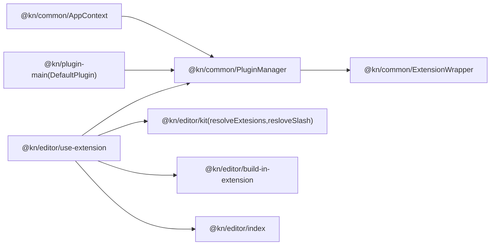

# 编辑器扩展API

<cite>
**本文引用的文件**
- [packages/common/src/core/PluginManager.ts](file://packages/common/src/core/PluginManager.ts)
- [packages/common/src/core/editor.ts](file://packages/common/src/core/editor.ts)
- [packages/common/src/core/types.ts](file://packages/common/src/core/types.ts)
- [packages/common/src/core/AppContext.ts](file://packages/common/src/core/AppContext.ts)
- [packages/editor/src/index.ts](file://packages/editor/src/index.ts)
- [packages/editor/src/editor/use-extension.ts](file://packages/editor/src/editor/use-extension.ts)
- [packages/editor/src/editor/kit.tsx](file://packages/editor/src/editor/kit.tsx)
- [packages/editor/src/editor/build-in-extension.ts](file://packages/editor/src/editor/build-in-extension.ts)
- [packages/editor/src/editor/context.tsx](file://packages/editor/src/editor/context.tsx)
- [packages/editor/src/extensions/index.ts](file://packages/editor/src/extensions/index.ts)
- [packages/editor/src/extensions/code-block/code-block.ts](file://packages/editor/src/extensions/code-block/code-block.ts)
- [packages/plugin-main/src/index.tsx](file://packages/plugin-main/src/index.tsx)
</cite>

## 目录
1. [简介](#简介)
2. [项目结构](#项目结构)
3. [核心组件](#核心组件)
4. [架构总览](#架构总览)
5. [详细组件分析](#详细组件分析)
6. [依赖分析](#依赖分析)
7. [性能考虑](#性能考虑)
8. [故障排查指南](#故障排查指南)
9. [结论](#结论)
10. [附录：扩展开发示例与最佳实践](#附录扩展开发示例与最佳实践)

## 简介
本文件面向知识库管理系统中的“编辑器扩展API”，系统性地记录编辑器扩展的注册机制、扩展接口规范、生命周期钩子（初始化/激活/停用/销毁）、命令系统API（自定义命令注册、执行与状态管理）、扩展配置与参数传递、编辑器状态管理（文档内容、光标与选择区域）等。同时提供可复用的扩展开发示例、测试与集成方法，以及扩展间依赖与冲突处理建议。

## 项目结构
围绕编辑器扩展API的关键模块分布如下：
- 公共层（@kn/common）
  - 插件管理与上下文：PluginManager、AppContext、类型与工具
- 编辑器层（@kn/editor）
  - 扩展包装器与解析：ExtensionWrapper、resolveExtesions、resloveSlash
  - 内置扩展集合：build-in-extension
  - 扩展使用与装配：useEditorExtension、index导出
- 插件示例（@kn/plugin-main）
  - 默认插件示例：展示如何通过KPlugin注册路由、菜单、编辑器扩展与服务

图表来源
- [packages/common/src/core/PluginManager.ts](file://packages/common/src/core/PluginManager.ts#L63-L170)
- [packages/common/src/core/editor.ts](file://packages/common/src/core/editor.ts#L1-L31)
- [packages/common/src/core/AppContext.ts](file://packages/common/src/core/AppContext.ts#L1-L13)
- [packages/editor/src/editor/use-extension.ts](file://packages/editor/src/editor/use-extension.ts#L1-L63)
- [packages/editor/src/editor/kit.tsx](file://packages/editor/src/editor/kit.tsx#L1-L87)
- [packages/editor/src/editor/build-in-extension.ts](file://packages/editor/src/editor/build-in-extension.ts#L1-L56)
- [packages/editor/src/index.ts](file://packages/editor/src/index.ts#L1-L23)
- [packages/plugin-main/src/index.tsx](file://packages/plugin-main/src/index.tsx#L1-L118)

章节来源
- [packages/common/src/core/PluginManager.ts](file://packages/common/src/core/PluginManager.ts#L1-L170)
- [packages/common/src/core/editor.ts](file://packages/common/src/core/editor.ts#L1-L31)
- [packages/common/src/core/AppContext.ts](file://packages/common/src/core/AppContext.ts#L1-L13)
- [packages/editor/src/editor/use-extension.ts](file://packages/editor/src/editor/use-extension.ts#L1-L63)
- [packages/editor/src/editor/kit.tsx](file://packages/editor/src/editor/kit.tsx#L1-L87)
- [packages/editor/src/editor/build-in-extension.ts](file://packages/editor/src/editor/build-in-extension.ts#L1-L56)
- [packages/editor/src/index.ts](file://packages/editor/src/index.ts#L1-L23)
- [packages/plugin-main/src/index.tsx](file://packages/plugin-main/src/index.tsx#L1-L118)

## 核心组件
- 插件管理器（PluginManager）
  - 职责：加载本地/远程插件、合并服务、解析路由/菜单/编辑器扩展、事件通知刷新
  - 关键能力：初始化、安装/卸载、解析聚合
- 扩展包装器（ExtensionWrapper）
  - 规范：扩展主体、名称、菜单/气泡菜单/斜杠菜单/浮动菜单、工具命令等
- 应用上下文（AppContext）
  - 提供插件管理器实例给编辑器装配流程
- 扩展解析与装配（resolveExtesions、resloveSlash、useEditorExtension）
  - 将扩展包装器转换为Tiptap扩展数组，并注入斜杠菜单与运行时扩展
- 内置扩展集合（buildInExtension）
  - 预置大量常用扩展，作为默认装配基线
- 插件示例（DefaultPlugin）
  - 展示如何通过KPlugin注册路由、菜单、编辑器扩展与服务

章节来源
- [packages/common/src/core/PluginManager.ts](file://packages/common/src/core/PluginManager.ts#L63-L170)
- [packages/common/src/core/editor.ts](file://packages/common/src/core/editor.ts#L1-L31)
- [packages/common/src/core/AppContext.ts](file://packages/common/src/core/AppContext.ts#L1-L13)
- [packages/editor/src/editor/kit.tsx](file://packages/editor/src/editor/kit.tsx#L1-L87)
- [packages/editor/src/editor/use-extension.ts](file://packages/editor/src/editor/use-extension.ts#L1-L63)
- [packages/editor/src/editor/build-in-extension.ts](file://packages/editor/src/editor/build-in-extension.ts#L1-L56)
- [packages/plugin-main/src/index.tsx](file://packages/plugin-main/src/index.tsx#L1-L118)

## 架构总览
编辑器扩展API的总体交互流程如下：

图表来源
- [packages/common/src/core/AppContext.ts](file://packages/common/src/core/AppContext.ts#L1-L13)
- [packages/common/src/core/PluginManager.ts](file://packages/common/src/core/PluginManager.ts#L78-L112)
- [packages/editor/src/editor/use-extension.ts](file://packages/editor/src/editor/use-extension.ts#L1-L63)
- [packages/editor/src/editor/kit.tsx](file://packages/editor/src/editor/kit.tsx#L23-L87)
- [packages/editor/src/editor/build-in-extension.ts](file://packages/editor/src/editor/build-in-extension.ts#L1-L56)

## 详细组件分析

### 组件A：插件管理与生命周期
- 注册机制
  - 通过KPlugin构造函数接收插件配置（名称、状态、路由、菜单、编辑器扩展、语言包、服务等）
  - PluginManager在初始化时加载本地与远程插件，动态导入脚本并通过对象映射生成插件实例
- 生命周期钩子
  - 初始化：init()完成插件加载与服务合并
  - 激活：通过解析editorExtensions参与编辑器装配
  - 停用/卸载：uninstallPlugin()移除插件并触发刷新事件
  - 销毁：remove()从列表中剔除（无显式销毁回调）
- 事件与刷新
  - 卸载/安装后通过事件系统发出刷新信号，驱动UI或编辑器重新渲染

图表来源
- [packages/common/src/core/PluginManager.ts](file://packages/common/src/core/PluginManager.ts#L78-L112)
- [packages/common/src/core/PluginManager.ts](file://packages/common/src/core/PluginManager.ts#L114-L170)

章节来源
- [packages/common/src/core/PluginManager.ts](file://packages/common/src/core/PluginManager.ts#L1-L170)
- [packages/plugin-main/src/index.tsx](file://packages/plugin-main/src/index.tsx#L1-L118)

### 组件B：扩展接口规范与装配
- ExtensionWrapper 接口
  - 必填：extendsion、name
  - 可选：bubbleMenu、menuConfig、slashConfig、flotMenuConfig、tools
  - tools支持描述、输入模式与执行函数，便于在编辑器中以命令方式触发
- 解析与装配
  - resolveExtesions：将ExtensionWrapper中的扩展主体展开为Tiptap扩展数组
  - resloveSlash：将各扩展的slashConfig聚合成斜杠菜单项
  - useEditorExtension：组合运行时扩展、内置扩展、插件扩展与斜杠菜单，返回最终扩展数组
- 内置扩展集合
  - buildInExtension集中导出大量常用扩展，作为默认装配基线

图表来源
- [packages/common/src/core/editor.ts](file://packages/common/src/core/editor.ts#L1-L31)
- [packages/common/src/core/PluginManager.ts](file://packages/common/src/core/PluginManager.ts#L146-L154)
- [packages/editor/src/editor/use-extension.ts](file://packages/editor/src/editor/use-extension.ts#L1-L63)
- [packages/editor/src/editor/kit.tsx](file://packages/editor/src/editor/kit.tsx#L23-L49)
- [packages/editor/src/editor/build-in-extension.ts](file://packages/editor/src/editor/build-in-extension.ts#L1-L56)

章节来源
- [packages/common/src/core/editor.ts](file://packages/common/src/core/editor.ts#L1-L31)
- [packages/editor/src/editor/kit.tsx](file://packages/editor/src/editor/kit.tsx#L1-L87)
- [packages/editor/src/editor/use-extension.ts](file://packages/editor/src/editor/use-extension.ts#L1-L63)
- [packages/editor/src/editor/build-in-extension.ts](file://packages/editor/src/editor/build-in-extension.ts#L1-L56)

### 组件C：命令系统API（tools）
- 注册
  - 在ExtensionWrapper.tools中声明命令：描述、输入模式schema、执行函数
- 执行
  - 通过编辑器上下文或扩展菜单触发执行
- 状态管理
  - 命令执行结果可用于更新编辑器状态或UI反馈
- 示例路径
  - 扩展包装器接口定义：[packages/common/src/core/editor.ts](file://packages/common/src/core/editor.ts#L1-L31)
  - 扩展装配入口：[packages/editor/src/editor/use-extension.ts](file://packages/editor/src/editor/use-extension.ts#L1-L63)

章节来源
- [packages/common/src/core/editor.ts](file://packages/common/src/core/editor.ts#L1-L31)
- [packages/editor/src/editor/use-extension.ts](file://packages/editor/src/editor/use-extension.ts#L1-L63)

### 组件D：编辑器状态管理API
- 文档内容获取
  - 使用编辑器提供的状态与视图API访问当前文档内容
- 光标位置控制
  - 通过选择与链式命令控制光标移动与插入点
- 选择区域管理
  - 使用选择相关插件与命令对选区进行读取与修改
- 参考路径
  - 编辑器统一导出：[packages/editor/src/index.ts](file://packages/editor/src/index.ts#L1-L23)
  - 扩展示例（代码块扩展）中展示了键盘快捷键与选择逻辑的结合：[packages/editor/src/extensions/code-block/code-block.ts](file://packages/editor/src/extensions/code-block/code-block.ts#L1-L84)

章节来源
- [packages/editor/src/index.ts](file://packages/editor/src/index.ts#L1-L23)
- [packages/editor/src/extensions/code-block/code-block.ts](file://packages/editor/src/extensions/code-block/code-block.ts#L1-L84)

### 组件E：扩展配置与参数传递
- 配置项
  - name、status、routes、globalRoutes、menus、editorExtension、locales、services
- 参数传递
  - 通过ExtensionWrapper的options或扩展内部配置进行参数注入
- 参考路径
  - 插件配置接口：[packages/common/src/core/PluginManager.ts](file://packages/common/src/core/PluginManager.ts#L9-L18)
  - 扩展包装器接口：[packages/common/src/core/editor.ts](file://packages/common/src/core/editor.ts#L1-L31)
  - 代码块扩展的配置与节点视图：[packages/editor/src/extensions/code-block/code-block.ts](file://packages/editor/src/extensions/code-block/code-block.ts#L1-L84)

章节来源
- [packages/common/src/core/PluginManager.ts](file://packages/common/src/core/PluginManager.ts#L9-L18)
- [packages/common/src/core/editor.ts](file://packages/common/src/core/editor.ts#L1-L31)
- [packages/editor/src/extensions/code-block/code-block.ts](file://packages/editor/src/extensions/code-block/code-block.ts#L1-L84)

### 组件F：扩展间的依赖关系与冲突处理
- 依赖关系
  - 通过resolveExtesions将多个扩展包装器合并为扩展数组
  - 内置扩展与插件扩展共同参与装配
- 冲突处理
  - 通过扩展优先级、过滤与排序策略减少冲突
  - 对于重复扩展，可在装配时按名称去重或覆盖
- 参考路径
  - 扩展解析与装配：[packages/editor/src/editor/kit.tsx](file://packages/editor/src/editor/kit.tsx#L23-L87)
  - 内置扩展集合：[packages/editor/src/editor/build-in-extension.ts](file://packages/editor/src/editor/build-in-extension.ts#L1-L56)
  - 运行时扩展装配与去重：[packages/editor/src/editor/use-extension.ts](file://packages/editor/src/editor/use-extension.ts#L1-L63)

章节来源
- [packages/editor/src/editor/kit.tsx](file://packages/editor/src/editor/kit.tsx#L23-L87)
- [packages/editor/src/editor/build-in-extension.ts](file://packages/editor/src/editor/build-in-extension.ts#L1-L56)
- [packages/editor/src/editor/use-extension.ts](file://packages/editor/src/editor/use-extension.ts#L1-L63)

## 依赖分析
- 组件耦合
  - AppContext向编辑器装配提供PluginManager，形成弱耦合
  - PluginManager聚合扩展并暴露解析接口，降低上层复杂度
  - useEditorExtension集中处理扩展解析、内置扩展与斜杠菜单
- 外部依赖
  - Tiptap生态（core/react/pm/state/view等）
  - 浮动UI与协作库（@floating-ui、@hocuspocus/provider）

图表来源
- [packages/common/src/core/AppContext.ts](file://packages/common/src/core/AppContext.ts#L1-L13)
- [packages/common/src/core/PluginManager.ts](file://packages/common/src/core/PluginManager.ts#L63-L170)
- [packages/common/src/core/editor.ts](file://packages/common/src/core/editor.ts#L1-L31)
- [packages/editor/src/editor/use-extension.ts](file://packages/editor/src/editor/use-extension.ts#L1-L63)
- [packages/editor/src/editor/kit.tsx](file://packages/editor/src/editor/kit.tsx#L1-L87)
- [packages/editor/src/editor/build-in-extension.ts](file://packages/editor/src/editor/build-in-extension.ts#L1-L56)
- [packages/editor/src/index.ts](file://packages/editor/src/index.ts#L1-L23)
- [packages/plugin-main/src/index.tsx](file://packages/plugin-main/src/index.tsx#L1-L118)

章节来源
- [packages/common/src/core/AppContext.ts](file://packages/common/src/core/AppContext.ts#L1-L13)
- [packages/common/src/core/PluginManager.ts](file://packages/common/src/core/PluginManager.ts#L63-L170)
- [packages/editor/src/editor/use-extension.ts](file://packages/editor/src/editor/use-extension.ts#L1-L63)
- [packages/editor/src/editor/kit.tsx](file://packages/editor/src/editor/kit.tsx#L1-L87)
- [packages/editor/src/editor/build-in-extension.ts](file://packages/editor/src/editor/build-in-extension.ts#L1-L56)
- [packages/editor/src/index.ts](file://packages/editor/src/index.ts#L1-L23)
- [packages/plugin-main/src/index.tsx](file://packages/plugin-main/src/index.tsx#L1-L118)

## 性能考虑
- 动态导入与懒加载
  - 远程插件通过动态导入脚本，避免启动时全量加载
- 扩展解析优化
  - 合理组织ExtensionWrapper，减少重复扩展与无效解析
- 事件刷新
  - 卸载/安装后统一刷新，避免细粒度重复渲染

## 故障排查指南
- 插件未生效
  - 检查PluginManager.init()/installPlugin()是否正确加载并合并服务
  - 确认ExtensionWrapper的name与extendsion配置正确
- 斜杠菜单不显示
  - 检查ExtensionWrapper.slashConfig是否正确填充
  - 确认resloveSlash已将配置注入
- 命令无法执行
  - 检查tools中execute函数签名与参数schema
  - 确认编辑器上下文可访问到命令
- 冲突与覆盖
  - 若出现功能冲突，检查扩展优先级与装配顺序，必要时在装配阶段去重或覆盖

章节来源
- [packages/common/src/core/PluginManager.ts](file://packages/common/src/core/PluginManager.ts#L78-L112)
- [packages/common/src/core/editor.ts](file://packages/common/src/core/editor.ts#L1-L31)
- [packages/editor/src/editor/kit.tsx](file://packages/editor/src/editor/kit.tsx#L36-L49)
- [packages/editor/src/editor/use-extension.ts](file://packages/editor/src/editor/use-extension.ts#L1-L63)

## 结论
编辑器扩展API通过统一的ExtensionWrapper与PluginManager实现了插件化扩展的注册、装配与生命周期管理；借助resolveExtesions与resloveSlash，能够灵活地将扩展能力注入到编辑器中。配合tools命令系统与编辑器状态API，开发者可以快速构建自定义扩展并进行测试与集成。

## 附录：扩展开发示例与最佳实践
- 创建自定义扩展
  - 定义ExtensionWrapper：设置name、extendsion、slashConfig、tools等
  - 参考路径：[packages/common/src/core/editor.ts](file://packages/common/src/core/editor.ts#L1-L31)
- 注册到插件
  - 在KPlugin的editorExtension中加入自定义扩展包装器
  - 参考路径：[packages/plugin-main/src/index.tsx](file://packages/plugin-main/src/index.tsx#L1-L118)
- 装配到编辑器
  - 使用useEditorExtension或resolveExtesions完成装配
  - 参考路径：[packages/editor/src/editor/use-extension.ts](file://packages/editor/src/editor/use-extension.ts#L1-L63)、[packages/editor/src/editor/kit.tsx](file://packages/editor/src/editor/kit.tsx#L23-L87)
- 测试与集成
  - 在本地开发环境中通过init()加载插件，观察编辑器行为变化
  - 通过卸载/安装验证生命周期钩子与事件刷新
  - 参考路径：[packages/common/src/core/PluginManager.ts](file://packages/common/src/core/PluginManager.ts#L78-L112)
- 最佳实践
  - 明确扩展职责边界，避免与内置扩展重复
  - 合理设计slashConfig与tools，确保命令易用且可维护
  - 使用唯一name并做好版本兼容，减少冲突风险

章节来源
- [packages/common/src/core/editor.ts](file://packages/common/src/core/editor.ts#L1-L31)
- [packages/plugin-main/src/index.tsx](file://packages/plugin-main/src/index.tsx#L1-L118)
- [packages/editor/src/editor/use-extension.ts](file://packages/editor/src/editor/use-extension.ts#L1-L63)
- [packages/editor/src/editor/kit.tsx](file://packages/editor/src/editor/kit.tsx#L23-L87)
- [packages/common/src/core/PluginManager.ts](file://packages/common/src/core/PluginManager.ts#L78-L112)