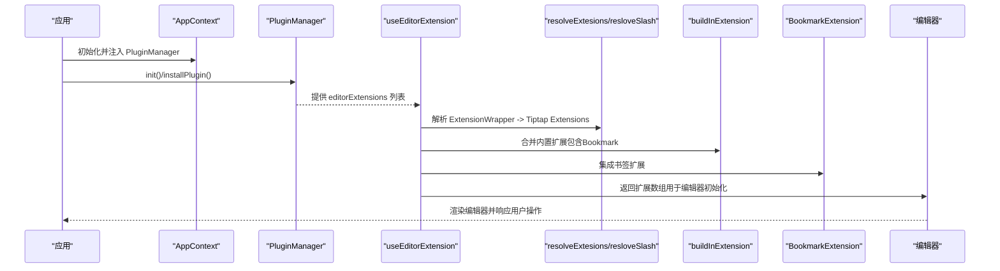
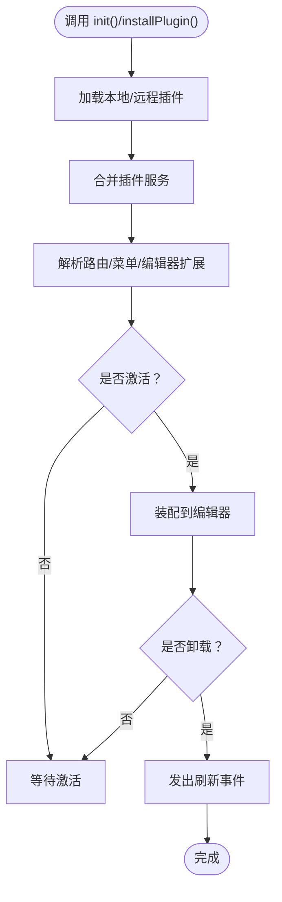
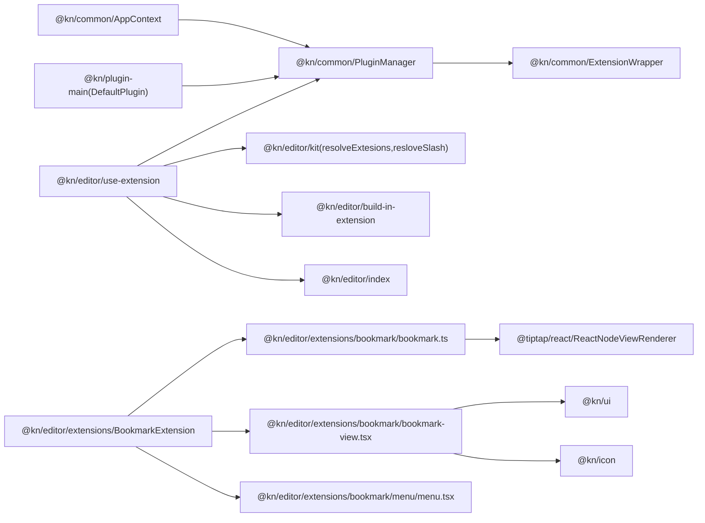

# 编辑器扩展API

<cite>
**本文引用的文件**
- [packages/common/src/core/PluginManager.ts](file://packages/common/src/core/PluginManager.ts)
- [packages/common/src/core/editor.ts](file://packages/common/src/core/editor.ts)
- [packages/common/src/core/types.ts](file://packages/common/src/core/types.ts)
- [packages/common/src/core/AppContext.ts](file://packages/common/src/core/AppContext.ts)
- [packages/editor/src/index.ts](file://packages/editor/src/index.ts)
- [packages/editor/src/editor/use-extension.ts](file://packages/editor/src/editor/use-extension.ts)
- [packages/editor/src/editor/kit.tsx](file://packages/editor/src/editor/kit.tsx)
- [packages/editor/src/editor/build-in-extension.ts](file://packages/editor/src/editor/build-in-extension.ts)
- [packages/editor/src/editor/context.tsx](file://packages/editor/src/editor/context.tsx)
- [packages/editor/src/extensions/index.ts](file://packages/editor/src/extensions/index.ts)
- [packages/editor/src/extensions/code-block/code-block.ts](file://packages/editor/src/extensions/code-block/code-block.ts)
- [packages/editor/src/extensions/bookmark/bookmark.ts](file://packages/editor/src/extensions/bookmark/bookmark.ts)
- [packages/editor/src/extensions/bookmark/bookmark-view.tsx](file://packages/editor/src/extensions/bookmark/bookmark-view.tsx)
- [packages/editor/src/extensions/bookmark/menu/menu.tsx](file://packages/editor/src/extensions/bookmark/menu/menu.tsx)
- [packages/editor/src/extensions/bookmark/index.tsx](file://packages/editor/src/extensions/bookmark/index.tsx)
- [packages/editor/src/extensions/bookmark/README.md](file://packages/editor/src/extensions/bookmark/README.md)
- [packages/plugin-main/src/index.tsx](file://packages/plugin-main/src/index.tsx)
</cite>

## 更新摘要
**变更内容**
- 新增Bookmark扩展API的完整文档，包括扩展定义、视图组件、工具栏菜单集成
- 添加Bookmark扩展的属性系统、命令API和键盘快捷键支持
- 更新扩展开发示例，展示如何创建和集成Bookmark类型的扩展
- 增强扩展间依赖关系和冲突处理章节，包含Bookmark扩展的集成方式

## 目录
1. [简介](#简介)
2. [项目结构](#项目结构)
3. [核心组件](#核心组件)
4. [架构总览](#架构总览)
5. [详细组件分析](#详细组件分析)
6. [依赖分析](#依赖分析)
7. [性能考虑](#性能考虑)
8. [故障排查指南](#故障排查指南)
9. [结论](#结论)
10. [附录：扩展开发示例与最佳实践](#附录扩展开发示例与最佳实践)

## 简介
本文件面向知识库管理系统中的"编辑器扩展API"，系统性地记录编辑器扩展的注册机制、扩展接口规范、生命周期钩子（初始化/激活/停用/销毁）、命令系统API（自定义命令注册、执行与状态管理）、扩展配置与参数传递、编辑器状态管理（文档内容、光标与选择区域）等。同时提供可复用的扩展开发示例、测试与集成方法，以及扩展间依赖与冲突处理建议。

**更新** 本版本新增了Bookmark扩展API的详细文档，为开发者提供完整的书签功能集成能力。

## 项目结构
围绕编辑器扩展API的关键模块分布如下：
- 公共层（@kn/common）
  - 插件管理与上下文：PluginManager、AppContext、类型与工具
- 编辑器层（@kn/editor）
  - 扩展包装器与解析：ExtensionWrapper、resolveExtesions、resloveSlash
  - 内置扩展集合：build-in-extension
  - 扩展使用与装配：useEditorExtension、index导出
- 扩展示例（@kn/editor/extensions）
  - 包含Bookmark扩展在内的多种扩展实现
- 插件示例（@kn/plugin-main）
  - 默认插件示例：展示如何通过KPlugin注册路由、菜单、编辑器扩展与服务

```mermaid
graph TB
subgraph "公共层(@kn/common)"
PM["PluginManager<br/>插件管理"]
EW["ExtensionWrapper<br/>扩展包装器"]
AC["AppContext<br/>应用上下文"]
TY["Services 类型<br/>服务契约"]
end
subgraph "编辑器层(@kn/editor)"
UE["useEditorExtension<br/>扩展装配Hook"]
KIT["resolveExtesions/resloveSlash<br/>扩展解析/斜杠菜单"]
BI["buildInExtension<br/>内置扩展集合"]
IDX["index 导出<br/>统一导出"]
BE["BookmarkExtension<br/>书签扩展"]
end
subgraph "扩展示例(@kn/editor/extensions)"
BM["bookmark.ts<br/>书签节点定义"]
BV["bookmark-view.tsx<br/>书签视图组件"]
BSM["menu/menu.tsx<br/>工具栏菜单"]
END
subgraph "插件示例(@kn/plugin-main)"
DP["DefaultPlugin 实例<br/>路由/菜单/扩展/服务"]
end
PM --> AC
PM --> EW
UE --> PM
UE --> BI
UE --> KIT
KIT --> BI
BE --> BM
BE --> BV
BE --> BSM
DP --> PM
IDX --> UE
```

**图表来源**
- [packages/common/src/core/PluginManager.ts](file://packages/common/src/core/PluginManager.ts#L63-L170)
- [packages/common/src/core/editor.ts](file://packages/common/src/core/editor.ts#L1-L31)
- [packages/common/src/core/AppContext.ts](file://packages/common/src/core/AppContext.ts#L1-L13)
- [packages/editor/src/editor/use-extension.ts](file://packages/editor/src/editor/use-extension.ts#L1-L63)
- [packages/editor/src/editor/kit.tsx](file://packages/editor/src/editor/kit.tsx#L1-L87)
- [packages/editor/src/editor/build-in-extension.ts](file://packages/editor/src/editor/build-in-extension.ts#L1-L57)
- [packages/editor/src/extensions/bookmark/index.tsx](file://packages/editor/src/extensions/bookmark/index.tsx#L1-L15)
- [packages/editor/src/extensions/bookmark/bookmark.ts](file://packages/editor/src/extensions/bookmark/bookmark.ts#L1-L132)
- [packages/editor/src/extensions/bookmark/bookmark-view.tsx](file://packages/editor/src/extensions/bookmark/bookmark-view.tsx#L1-L496)
- [packages/editor/src/extensions/bookmark/menu/menu.tsx](file://packages/editor/src/extensions/bookmark/menu/menu.tsx#L1-L32)
- [packages/editor/src/index.ts](file://packages/editor/src/index.ts#L1-L23)
- [packages/plugin-main/src/index.tsx](file://packages/plugin-main/src/index.tsx#L1-L118)

**章节来源**
- [packages/common/src/core/PluginManager.ts](file://packages/common/src/core/PluginManager.ts#L1-L170)
- [packages/common/src/core/editor.ts](file://packages/common/src/core/editor.ts#L1-L31)
- [packages/common/src/core/AppContext.ts](file://packages/common/src/core/AppContext.ts#L1-L13)
- [packages/editor/src/editor/use-extension.ts](file://packages/editor/src/editor/use-extension.ts#L1-L63)
- [packages/editor/src/editor/kit.tsx](file://packages/editor/src/editor/kit.tsx#L1-L87)
- [packages/editor/src/editor/build-in-extension.ts](file://packages/editor/src/editor/build-in-extension.ts#L1-L57)
- [packages/editor/src/extensions/bookmark/index.tsx](file://packages/editor/src/extensions/bookmark/index.tsx#L1-L15)
- [packages/editor/src/extensions/bookmark/bookmark.ts](file://packages/editor/src/extensions/bookmark/bookmark.ts#L1-L132)
- [packages/editor/src/extensions/bookmark/bookmark-view.tsx](file://packages/editor/src/extensions/bookmark/bookmark-view.tsx#L1-L496)
- [packages/editor/src/extensions/bookmark/menu/menu.tsx](file://packages/editor/src/extensions/bookmark/menu/menu.tsx#L1-L32)
- [packages/editor/src/index.ts](file://packages/editor/src/index.ts#L1-L23)
- [packages/plugin-main/src/index.tsx](file://packages/plugin-main/src/index.tsx#L1-L118)

## 核心组件
- 插件管理器（PluginManager）
  - 职责：加载本地/远程插件、合并服务、解析路由/菜单/编辑器扩展、事件通知刷新
  - 关键能力：初始化、安装/卸载、解析聚合
- 扩展包装器（ExtensionWrapper）
  - 规范：扩展主体、名称、菜单/气泡菜单/斜杠菜单/浮动菜单、工具命令等
- 应用上下文（AppContext）
  - 提供插件管理器实例给编辑器装配流程
- 扩展解析与装配（resolveExtesions、resloveSlash、useEditorExtension）
  - 将扩展包装器转换为Tiptap扩展数组，并注入斜杠菜单与运行时扩展
- 内置扩展集合（buildInExtension）
  - 预置大量常用扩展，包括新增的Bookmark扩展，作为默认装配基线
- 扩展示例（BookmarkExtension）
  - 展示如何创建Rich Text扩展，包含节点定义、视图组件和工具栏集成
- 插件示例（DefaultPlugin）
  - 展示如何通过KPlugin注册路由、菜单、编辑器扩展与服务

**更新** 新增Bookmark扩展作为内置扩展的一部分，提供完整的书签功能集成。

**章节来源**
- [packages/common/src/core/PluginManager.ts](file://packages/common/src/core/PluginManager.ts#L63-L170)
- [packages/common/src/core/editor.ts](file://packages/common/src/core/editor.ts#L1-L31)
- [packages/common/src/core/AppContext.ts](file://packages/common/src/core/AppContext.ts#L1-L13)
- [packages/editor/src/editor/kit.tsx](file://packages/editor/src/editor/kit.tsx#L1-L87)
- [packages/editor/src/editor/use-extension.ts](file://packages/editor/src/editor/use-extension.ts#L1-L63)
- [packages/editor/src/editor/build-in-extension.ts](file://packages/editor/src/editor/build-in-extension.ts#L1-L57)
- [packages/editor/src/extensions/bookmark/index.tsx](file://packages/editor/src/extensions/bookmark/index.tsx#L1-L15)
- [packages/plugin-main/src/index.tsx](file://packages/plugin-main/src/index.tsx#L1-L118)

## 架构总览
编辑器扩展API的总体交互流程如下：

```mermaid
sequenceDiagram
participant App as "应用"
participant Ctx as "AppContext"
participant PM as "PluginManager"
participant UE as "useEditorExtension"
participant KIT as "resolveExtesions/resloveSlash"
participant BI as "buildInExtension"
participant BE as "BookmarkExtension"
participant ED as "编辑器"
App->>Ctx : 初始化并注入 PluginManager
App->>PM : init()/installPlugin()
PM-->>UE : 提供 editorExtensions 列表
UE->>KIT : 解析 ExtensionWrapper -> Tiptap Extensions
UE->>BI : 合并内置扩展包含Bookmark
UE->>BE : 集成书签扩展
UE->>ED : 返回扩展数组用于编辑器初始化
ED-->>App : 渲染编辑器并响应用户操作
```

**图表来源**
- [packages/common/src/core/AppContext.ts](file://packages/common/src/core/AppContext.ts#L1-L13)
- [packages/common/src/core/PluginManager.ts](file://packages/common/src/core/PluginManager.ts#L78-L112)
- [packages/editor/src/editor/use-extension.ts](file://packages/editor/src/editor/use-extension.ts#L1-L63)
- [packages/editor/src/editor/kit.tsx](file://packages/editor/src/editor/kit.tsx#L23-L87)
- [packages/editor/src/editor/build-in-extension.ts](file://packages/editor/src/editor/build-in-extension.ts#L1-L57)
- [packages/editor/src/extensions/bookmark/index.tsx](file://packages/editor/src/extensions/bookmark/index.tsx#L1-L15)

## 详细组件分析

### 组件A：插件管理与生命周期
- 注册机制
  - 通过KPlugin构造函数接收插件配置（名称、状态、路由、菜单、编辑器扩展、语言包、服务等）
  - PluginManager在初始化时加载本地与远程插件，动态导入脚本并通过对象映射生成插件实例
- 生命周期钩子
  - 初始化：init()完成插件加载与服务合并
  - 激活：通过解析editorExtensions参与编辑器装配
  - 停用/卸载：uninstallPlugin()移除插件并触发刷新事件
  - 销毁：remove()从列表中剔除（无显式销毁回调）
- 事件与刷新
  - 卸载/安装后通过事件系统发出刷新信号，驱动UI或编辑器重新渲染

```mermaid
flowchart TD
Start(["调用 init()/installPlugin()"]) --> Load["加载本地/远程插件"]
Load --> Merge["合并插件服务"]
Merge --> Resolve["解析路由/菜单/编辑器扩展"]
Resolve --> Active{"是否激活？"}
Active --> |是| Assemble["装配到编辑器"]
Active --> |否| Wait["等待激活"]
Assemble --> Uninstall{"是否卸载？"}
Uninstall --> |是| Emit["发出刷新事件"]
Emit --> End(["完成"])
Uninstall --> |否| Wait
```

**图表来源**
- [packages/common/src/core/PluginManager.ts](file://packages/common/src/core/PluginManager.ts#L78-L112)
- [packages/common/src/core/PluginManager.ts](file://packages/common/src/core/PluginManager.ts#L114-L170)

**章节来源**
- [packages/common/src/core/PluginManager.ts](file://packages/common/src/core/PluginManager.ts#L1-L170)
- [packages/plugin-main/src/index.tsx](file://packages/plugin-main/src/index.tsx#L1-L118)

### 组件B：扩展接口规范与装配
- ExtensionWrapper 接口
  - 必填：extendsion、name
  - 可选：bubbleMenu、menuConfig、slashConfig、flotMenuConfig、tools
  - tools支持描述、输入模式与执行函数，便于在编辑器中以命令方式触发
- 解析与装配
  - resolveExtesions：将ExtensionWrapper中的扩展主体展开为Tiptap扩展数组
  - resloveSlash：将各扩展的slashConfig聚合成斜杠菜单项
  - useEditorExtension：组合运行时扩展、内置扩展、插件扩展与斜杠菜单，返回最终扩展数组
- 内置扩展集合
  - buildInExtension集中导出大量常用扩展，包括新增的BookmarkExtension，作为默认装配基线

**更新** BookmarkExtension现已集成到内置扩展集合中，提供完整的书签功能。

```mermaid
classDiagram
class ExtensionWrapper {
+extendsion
+name
+bubbleMenu
+menuConfig
+slashConfig
+flotMenuConfig
+tools
}
class PluginManager {
+plugins
+init()
+installPlugin()
+uninstallPlugin()
+resloveEditorExtension()
}
class useEditorExtension {
+useEditorExtension(ext?, withTitle?)
}
class resolveExtesions {
+resolveExtesions(extensions)
}
class resloveSlash {
+resloveSlash(extensions)
}
class BookmarkExtension {
+name : "bookmark"
+extendsion : Bookmark
+menuConfig : {group, menu}
}
ExtensionWrapper --> PluginManager : "被解析并装配"
useEditorExtension --> ExtensionWrapper : "消费"
resolveExtesions --> ExtensionWrapper : "展开"
resloveSlash --> ExtensionWrapper : "收集斜杠项"
BookmarkExtension --> ExtensionWrapper : "继承"
```

**图表来源**
- [packages/common/src/core/editor.ts](file://packages/common/src/core/editor.ts#L1-L31)
- [packages/common/src/core/PluginManager.ts](file://packages/common/src/core/PluginManager.ts#L146-L154)
- [packages/editor/src/editor/use-extension.ts](file://packages/editor/src/editor/use-extension.ts#L1-L63)
- [packages/editor/src/editor/kit.tsx](file://packages/editor/src/editor/kit.tsx#L23-L49)
- [packages/editor/src/editor/build-in-extension.ts](file://packages/editor/src/editor/build-in-extension.ts#L1-L57)
- [packages/editor/src/extensions/bookmark/index.tsx](file://packages/editor/src/extensions/bookmark/index.tsx#L1-L15)

**章节来源**
- [packages/common/src/core/editor.ts](file://packages/common/src/core/editor.ts#L1-L31)
- [packages/editor/src/editor/kit.tsx](file://packages/editor/src/editor/kit.tsx#L1-L87)
- [packages/editor/src/editor/use-extension.ts](file://packages/editor/src/editor/use-extension.ts#L1-L63)
- [packages/editor/src/editor/build-in-extension.ts](file://packages/editor/src/editor/build-in-extension.ts#L1-L57)
- [packages/editor/src/extensions/bookmark/index.tsx](file://packages/editor/src/extensions/bookmark/index.tsx#L1-L15)

### 组件C：命令系统API（tools）
- 注册
  - 在ExtensionWrapper.tools中声明命令：描述、输入模式schema、执行函数
- 执行
  - 通过编辑器上下文或扩展菜单触发执行
- 状态管理
  - 命令执行结果可用于更新编辑器状态或UI反馈
- 示例路径
  - 扩展包装器接口定义：[packages/common/src/core/editor.ts](file://packages/common/src/core/editor.ts#L1-L31)
  - 扩展装配入口：[packages/editor/src/editor/use-extension.ts](file://packages/editor/src/editor/use-extension.ts#L1-L63)

**更新** Bookmark扩展新增了insertBookmark命令，支持程序化插入书签节点。

**章节来源**
- [packages/common/src/core/editor.ts](file://packages/common/src/core/editor.ts#L1-L31)
- [packages/editor/src/editor/use-extension.ts](file://packages/editor/src/editor/use-extension.ts#L1-L63)
- [packages/editor/src/extensions/bookmark/bookmark.ts](file://packages/editor/src/extensions/bookmark/bookmark.ts#L118-L131)

### 组件D：编辑器状态管理API
- 文档内容获取
  - 使用编辑器提供的状态与视图API访问当前文档内容
- 光标位置控制
  - 通过选择与链式命令控制光标移动与插入点
- 选择区域管理
  - 使用选择相关插件与命令对选区进行读取与修改
- 参考路径
  - 编辑器统一导出：[packages/editor/src/index.ts](file://packages/editor/src/index.ts#L1-L23)
  - 扩展示例（代码块扩展）中展示了键盘快捷键与选择逻辑的结合：[packages/editor/src/extensions/code-block/code-block.ts](file://packages/editor/src/extensions/code-block/code-block.ts#L1-L84)

**更新** Bookmark扩展支持键盘快捷键（Mod-Shift-k）插入书签，提供更好的用户体验。

**章节来源**
- [packages/editor/src/index.ts](file://packages/editor/src/index.ts#L1-L23)
- [packages/editor/src/extensions/code-block/code-block.ts](file://packages/editor/src/extensions/code-block/code-block.ts#L1-L84)
- [packages/editor/src/extensions/bookmark/bookmark.ts](file://packages/editor/src/extensions/bookmark/bookmark.ts#L112-L116)

### 组件E：扩展配置与参数传递
- 配置项
  - name、status、routes、globalRoutes、menus、editorExtension、locales、services
- 参数传递
  - 通过ExtensionWrapper的options或扩展内部配置进行参数注入
- 参考路径
  - 插件配置接口：[packages/common/src/core/PluginManager.ts](file://packages/common/src/core/PluginManager.ts#L9-L18)
  - 扩展包装器接口：[packages/common/src/core/editor.ts](file://packages/common/src/core/editor.ts#L1-L31)
  - 代码块扩展的配置与节点视图：[packages/editor/src/extensions/code-block/code-block.ts](file://packages/editor/src/extensions/code-block/code-block.ts#L1-L84)

**更新** Bookmark扩展支持丰富的属性配置，包括URL、标题、描述、favicon和预览图片等。

**章节来源**
- [packages/common/src/core/PluginManager.ts](file://packages/common/src/core/PluginManager.ts#L9-L18)
- [packages/common/src/core/editor.ts](file://packages/common/src/core/editor.ts#L1-L31)
- [packages/editor/src/extensions/code-block/code-block.ts](file://packages/editor/src/extensions/code-block/code-block.ts#L1-L84)
- [packages/editor/src/extensions/bookmark/bookmark.ts](file://packages/editor/src/extensions/bookmark/bookmark.ts#L31-L94)

### 组件F：扩展间的依赖关系与冲突处理
- 依赖关系
  - 通过resolveExtesions将多个扩展包装器合并为扩展数组
  - 内置扩展与插件扩展共同参与装配，包括新增的Bookmark扩展
- 冲突处理
  - 通过扩展优先级、过滤与排序策略减少冲突
  - 对于重复扩展，可在装配时按名称去重或覆盖
- 参考路径
  - 扩展解析与装配：[packages/editor/src/editor/kit.tsx](file://packages/editor/src/editor/kit.tsx#L23-L87)
  - 内置扩展集合：[packages/editor/src/editor/build-in-extension.ts](file://packages/editor/src/editor/build-in-extension.ts#L1-L57)
  - 运行时扩展装配与去重：[packages/editor/src/editor/use-extension.ts](file://packages/editor/src/editor/use-extension.ts#L1-L63)

**更新** Bookmark扩展已集成到内置扩展集合中，作为标准扩展提供给所有编辑器实例使用。

**章节来源**
- [packages/editor/src/editor/kit.tsx](file://packages/editor/src/editor/kit.tsx#L23-L87)
- [packages/editor/src/editor/build-in-extension.ts](file://packages/editor/src/editor/build-in-extension.ts#L1-L57)
- [packages/editor/src/editor/use-extension.ts](file://packages/editor/src/editor/use-extension.ts#L1-L63)

### 组件G：Bookmark扩展API详解
- 扩展定义
  - Node.create()创建书签节点，支持拖拽、原子节点特性
  - 定义完整的属性系统：url、title、description、favicon、image
- 视图组件
  - BookmarkView组件提供富文本卡片界面
  - 支持URL验证、元数据自动抓取、编辑模式切换
  - 包含预览图片、域名显示、操作按钮等功能
- 工具栏菜单集成
  - BookmarkStaticMenu提供工具栏按钮
  - 支持键盘快捷键（Mod-Shift-k）插入书签
- 命令系统
  - insertBookmark命令支持程序化插入
  - 自动焦点管理和内容插入
- 属性系统
  - 支持HTML解析和渲染
  - 自动解析和渲染data-*属性
  - URL相对路径解析和绝对化处理

**新增** Bookmark扩展提供了完整的书签功能集成，包括节点定义、视图组件、工具栏集成和命令API。

**章节来源**
- [packages/editor/src/extensions/bookmark/bookmark.ts](file://packages/editor/src/extensions/bookmark/bookmark.ts#L1-L132)
- [packages/editor/src/extensions/bookmark/bookmark-view.tsx](file://packages/editor/src/extensions/bookmark/bookmark-view.tsx#L1-L496)
- [packages/editor/src/extensions/bookmark/menu/menu.tsx](file://packages/editor/src/extensions/bookmark/menu/menu.tsx#L1-L32)
- [packages/editor/src/extensions/bookmark/index.tsx](file://packages/editor/src/extensions/bookmark/index.tsx#L1-L15)
- [packages/editor/src/extensions/bookmark/README.md](file://packages/editor/src/extensions/bookmark/README.md#L1-L88)

## 依赖分析
- 组件耦合
  - AppContext向编辑器装配提供PluginManager，形成弱耦合
  - PluginManager聚合扩展并暴露解析接口，降低上层复杂度
  - useEditorExtension集中处理扩展解析、内置扩展与斜杠菜单
- 外部依赖
  - Tiptap生态（core/react/pm/state/view等）
  - 浮动UI与协作库（@floating-ui、@hocuspocus/provider）
  - React组件库（@kn/ui）和图标库（@kn/icon）
- 内置扩展依赖
  - BookmarkExtension依赖ReactNodeViewRenderer进行视图渲染
  - 依赖@kn/ui的Button、Input、Textarea等组件
  - 依赖@kn/icon的Bookmark、ExternalLink、Edit、Trash2等图标

**更新** Bookmark扩展增加了对@kn/ui和@kn/icon的依赖，提供丰富的UI组件和图标支持。

```mermaid
graph LR
AC["@kn/common/AppContext"] --> PM["@kn/common/PluginManager"]
PM --> EW["@kn/common/ExtensionWrapper"]
UE["@kn/editor/use-extension"] --> PM
UE --> KIT["@kn/editor/kit(resolveExtesions,resloveSlash)"]
UE --> BI["@kn/editor/build-in-extension"]
UE --> IDX["@kn/editor/index"]
BE["@kn/editor/extensions/BookmarkExtension"] --> BM["@kn/editor/extensions/bookmark/bookmark.ts"]
BE --> BV["@kn/editor/extensions/bookmark/bookmark-view.tsx"]
BE --> BSM["@kn/editor/extensions/bookmark/menu/menu.tsx"]
DP["@kn/plugin-main(DefaultPlugin)"] --> PM
BM --> RNV["@tiptap/react/ReactNodeViewRenderer"]
BV --> UI["@kn/ui"]
BV --> ICON["@kn/icon"]
```

**图表来源**
- [packages/common/src/core/AppContext.ts](file://packages/common/src/core/AppContext.ts#L1-L13)
- [packages/common/src/core/PluginManager.ts](file://packages/common/src/core/PluginManager.ts#L63-L170)
- [packages/common/src/core/editor.ts](file://packages/common/src/core/editor.ts#L1-L31)
- [packages/editor/src/editor/use-extension.ts](file://packages/editor/src/editor/use-extension.ts#L1-L63)
- [packages/editor/src/editor/kit.tsx](file://packages/editor/src/editor/kit.tsx#L1-L87)
- [packages/editor/src/editor/build-in-extension.ts](file://packages/editor/src/editor/build-in-extension.ts#L1-L57)
- [packages/editor/src/extensions/bookmark/index.tsx](file://packages/editor/src/extensions/bookmark/index.tsx#L1-L15)
- [packages/editor/src/extensions/bookmark/bookmark.ts](file://packages/editor/src/extensions/bookmark/bookmark.ts#L1-L3)
- [packages/editor/src/extensions/bookmark/bookmark-view.tsx](file://packages/editor/src/extensions/bookmark/bookmark-view.tsx#L1-L6)
- [packages/editor/src/index.ts](file://packages/editor/src/index.ts#L1-L23)
- [packages/plugin-main/src/index.tsx](file://packages/plugin-main/src/index.tsx#L1-L118)

**章节来源**
- [packages/common/src/core/AppContext.ts](file://packages/common/src/core/AppContext.ts#L1-L13)
- [packages/common/src/core/PluginManager.ts](file://packages/common/src/core/PluginManager.ts#L63-L170)
- [packages/editor/src/editor/use-extension.ts](file://packages/editor/src/editor/use-extension.ts#L1-L63)
- [packages/editor/src/editor/kit.tsx](file://packages/editor/src/editor/kit.tsx#L1-L87)
- [packages/editor/src/editor/build-in-extension.ts](file://packages/editor/src/editor/build-in-extension.ts#L1-L57)
- [packages/editor/src/extensions/bookmark/bookmark.ts](file://packages/editor/src/extensions/bookmark/bookmark.ts#L1-L3)
- [packages/editor/src/extensions/bookmark/bookmark-view.tsx](file://packages/editor/src/extensions/bookmark/bookmark-view.tsx#L1-L6)
- [packages/editor/src/index.ts](file://packages/editor/src/index.ts#L1-L23)
- [packages/plugin-main/src/index.tsx](file://packages/plugin-main/src/index.tsx#L1-L118)

## 性能考虑
- 动态导入与懒加载
  - 远程插件通过动态导入脚本，避免启动时全量加载
- 扩展解析优化
  - 合理组织ExtensionWrapper，减少重复扩展与无效解析
- 事件刷新
  - 卸载/安装后统一刷新，避免细粒度重复渲染
- Bookmark扩展性能优化
  - 使用memo优化视图组件渲染
  - 实现URL变更的防抖处理（500ms）
  - 支持请求取消，避免竞态条件
  - 图片加载错误的优雅降级处理

**更新** Bookmark扩展实现了多项性能优化措施，包括防抖处理、请求取消和错误处理。

**章节来源**
- [packages/editor/src/extensions/bookmark/bookmark-view.tsx](file://packages/editor/src/extensions/bookmark/bookmark-view.tsx#L135-L187)
- [packages/editor/src/extensions/bookmark/bookmark-view.tsx](file://packages/editor/src/extensions/bookmark/bookmark-view.tsx#L189-L247)

## 故障排查指南
- 插件未生效
  - 检查PluginManager.init()/installPlugin()是否正确加载并合并服务
  - 确认ExtensionWrapper的name与extendsion配置正确
- 斜杠菜单不显示
  - 检查ExtensionWrapper.slashConfig是否正确填充
  - 确认resloveSlash已将配置注入
- 命令无法执行
  - 检查tools中execute函数签名与参数schema
  - 确认编辑器上下文可访问到命令
- 冲突与覆盖
  - 若出现功能冲突，检查扩展优先级与装配顺序，必要时在装配阶段去重或覆盖
- Bookmark扩展问题
  - 检查URL格式是否正确（必须以http://或https://开头）
  - 确认网络请求是否被CORS限制
  - 验证元数据抓取功能是否正常工作
  - 检查视图组件的依赖是否正确安装

**更新** 新增Bookmark扩展相关的故障排查指导。

**章节来源**
- [packages/common/src/core/PluginManager.ts](file://packages/common/src/core/PluginManager.ts#L78-L112)
- [packages/common/src/core/editor.ts](file://packages/common/src/core/editor.ts#L1-L31)
- [packages/editor/src/editor/kit.tsx](file://packages/editor/src/editor/kit.tsx#L36-L49)
- [packages/editor/src/editor/use-extension.ts](file://packages/editor/src/editor/use-extension.ts#L1-L63)
- [packages/editor/src/extensions/bookmark/bookmark-view.tsx](file://packages/editor/src/extensions/bookmark/bookmark-view.tsx#L7-L15)

## 结论
编辑器扩展API通过统一的ExtensionWrapper与PluginManager实现了插件化扩展的注册、装配与生命周期管理；借助resolveExtesions与resloveSlash，能够灵活地将扩展能力注入到编辑器中。配合tools命令系统与编辑器状态API，开发者可以快速构建自定义扩展并进行测试与集成。

**更新** 新增的Bookmark扩展为编辑器提供了完整的书签功能，包括Rich Text节点、交互式视图组件、工具栏集成和命令API，进一步丰富了编辑器的功能生态。

## 附录：扩展开发示例与最佳实践
- 创建自定义扩展
  - 定义ExtensionWrapper：设置name、extendsion、slashConfig、tools等
  - 参考路径：[packages/common/src/core/editor.ts](file://packages/common/src/core/editor.ts#L1-L31)
- 注册到插件
  - 在KPlugin的editorExtension中加入自定义扩展包装器
  - 参考路径：[packages/plugin-main/src/index.tsx](file://packages/plugin-main/src/index.tsx#L1-L118)
- 装配到编辑器
  - 使用useEditorExtension或resolveExtesions完成装配
  - 参考路径：[packages/editor/src/editor/use-extension.ts](file://packages/editor/src/editor/use-extension.ts#L1-L63)、[packages/editor/src/editor/kit.tsx](file://packages/editor/src/editor/kit.tsx#L23-L87)
- 测试与集成
  - 在本地开发环境中通过init()加载插件，观察编辑器行为变化
  - 通过卸载/安装验证生命周期钩子与事件刷新
  - 参考路径：[packages/common/src/core/PluginManager.ts](file://packages/common/src/core/PluginManager.ts#L78-L112)
- Bookmark扩展开发示例
  - 参考BookmarkExtension的实现模式
  - 学习如何创建节点定义、视图组件和工具栏集成
  - 参考路径：[packages/editor/src/extensions/bookmark/index.tsx](file://packages/editor/src/extensions/bookmark/index.tsx#L1-L15)
- 最佳实践
  - 明确扩展职责边界，避免与内置扩展重复
  - 合理设计slashConfig与tools，确保命令易用且可维护
  - 使用唯一name并做好版本兼容，减少冲突风险
  - 实现性能优化，如防抖、缓存和错误处理

**更新** 新增Bookmark扩展开发示例和最佳实践指导。

**章节来源**
- [packages/common/src/core/editor.ts](file://packages/common/src/core/editor.ts#L1-L31)
- [packages/plugin-main/src/index.tsx](file://packages/plugin-main/src/index.tsx#L1-L118)
- [packages/editor/src/editor/use-extension.ts](file://packages/editor/src/editor/use-extension.ts#L1-L63)
- [packages/editor/src/editor/kit.tsx](file://packages/editor/src/editor/kit.tsx#L23-L87)
- [packages/common/src/core/PluginManager.ts](file://packages/common/src/core/PluginManager.ts#L78-L112)
- [packages/editor/src/extensions/bookmark/index.tsx](file://packages/editor/src/extensions/bookmark/index.tsx#L1-L15)