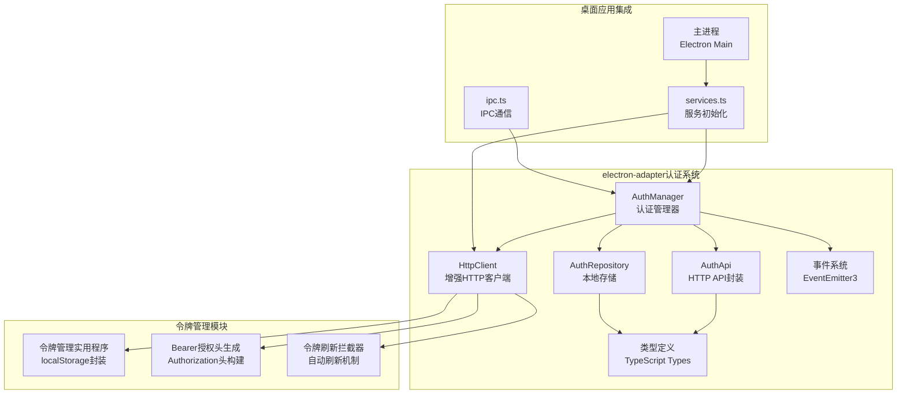
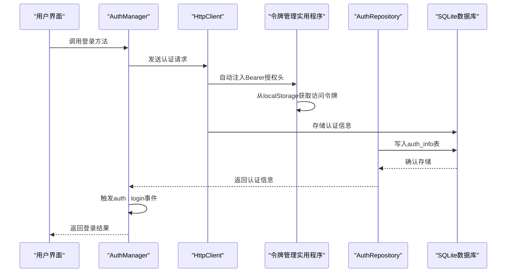
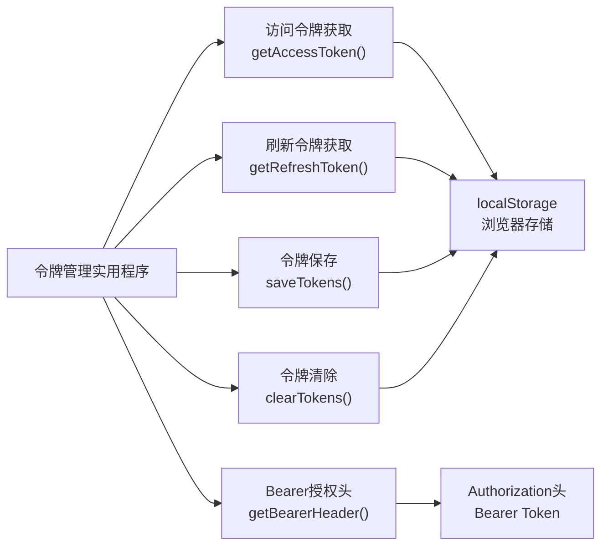
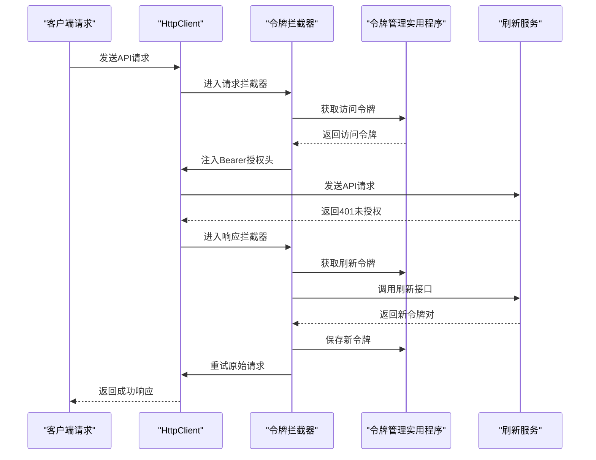
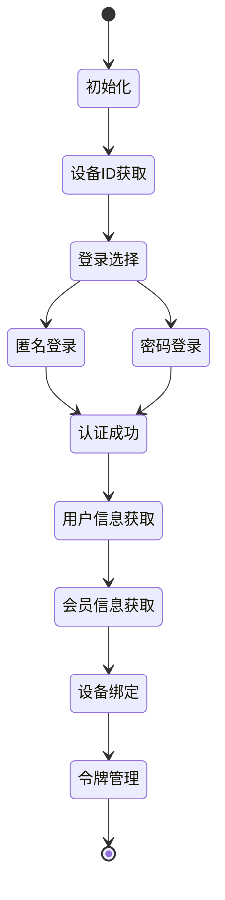
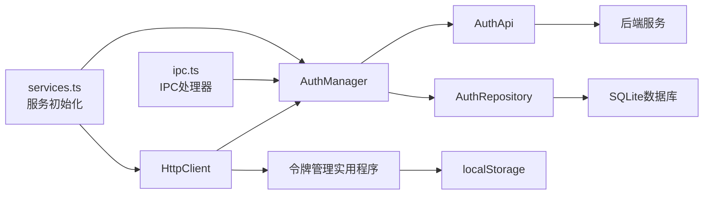

# 认证API

<cite>
**本文引用的文件**
- [packages/core/src/api/index.ts](file://packages/core/src/api/index.ts)
- [packages/electron-adapter/src/auth/auth-manager.ts](file://packages/electron-adapter/src/auth/auth-manager.ts)
- [packages/electron-adapter/src/auth/index.ts](file://packages/electron-adapter/src/auth/index.ts)
- [packages/electron-adapter/src/database/auth-repository.ts](file://packages/electron-adapter/src/database/auth-repository.ts)
- [packages/electron-adapter/src/http/auth-api.ts](file://packages/electron-adapter/src/http/auth-api.ts)
- [packages/electron-adapter/src/http/client.ts](file://packages/electron-adapter/src/http/client.ts)
- [packages/electron-adapter/src/types/index.ts](file://packages/electron-adapter/src/types/index.ts)
- [packages/electron-adapter/src/index.ts](file://packages/electron-adapter/src/index.ts)
- [packages/core/src/utils/auth.ts](file://packages/core/src/utils/auth.ts)
- [packages/core/src/utils/request.tsx](file://packages/core/src/utils/request.tsx)
- [packages/core/src/ai/model-provider/knowledge-provider.ts](file://packages/core/src/ai/model-provider/knowledge-provider.ts)
- [apps/desktop/src/main/services.ts](file://apps/desktop/src/main/services.ts)
- [apps/desktop/src/main/ipc.ts](file://apps/desktop/src/main/ipc.ts)
- [packages/core/src/hooks/use-api.tsx](file://packages/core/src/hooks/use-api.tsx)
- [packages/core/src/components/Login/index.tsx](file://packages/core/src/components/Login/index.tsx)
- [packages/core/src/components/SignUp/index.tsx](file://packages/core/src/components/SignUp/index.tsx)
- [packages/core/src/components/Welcome/index.tsx](file://packages/core/src/components/Welcome/index.tsx)
- [packages/core/src/Layout.tsx](file://packages/core/src/Layout.tsx)
- [packages/core/src/App.tsx](file://packages/core/src/App.tsx)
</cite>

## 更新摘要
**变更内容**
- 引入中央化令牌管理实用程序，提供OAuth2访问令牌和刷新令牌的安全存储与检索功能
- 新增令牌获取、保存、清除和Bearer授权头生成等核心功能
- 集成令牌刷新拦截器，实现自动令牌刷新机制
- 扩展AuthManager事件驱动架构，支持令牌刷新和过期处理
- 增强桌面应用与Web应用的令牌管理一致性

## 目录
1. [简介](#简介)
2. [项目结构](#项目结构)
3. [核心组件](#核心组件)
4. [架构总览](#架构总览)
5. [详细组件分析](#详细组件分析)
6. [中央化令牌管理](#中央化令牌管理)
7. [令牌刷新机制](#令牌刷新机制)
8. [认证流程增强](#认证流程增强)
9. [匿名用户支持](#匿名用户支持)
10. [设备绑定功能](#设备绑定功能)
11. [事件驱动架构](#事件驱动架构)
12. [本地存储机制](#本地存储机制)
13. [依赖关系分析](#依赖关系分析)
14. [性能考量](#性能考量)
15. [故障排除指南](#故障排除指南)
16. [结论](#结论)

## 简介
本文档面向知识库管理系统的认证API，重点介绍基于electron-adapter的AuthManager认证系统以及新增的中央化令牌管理实用程序。该系统支持匿名用户登录、设备绑定、事件驱动架构、本地存储以及OAuth2令牌管理等特性，为桌面应用和Web应用提供完整的认证解决方案。

内容涵盖HTTP方法、URL路径、请求参数、响应格式、权限要求、参数校验与错误处理机制、调用示例、安全考虑与最佳实践、错误码说明与故障排除。

## 项目结构
认证系统采用分层架构设计，核心位于electron-adapter包中，新增了中央化的令牌管理模块：

- **AuthManager**：认证管理器，提供登录、登出、令牌刷新等核心功能
- **AuthApi**：HTTP API封装，负责与后端服务通信
- **AuthRepository**：本地存储管理，使用SQLite数据库存储认证信息
- **HttpClient**：增强的HTTP客户端，支持令牌自动注入和刷新
- **令牌管理实用程序**：中央化令牌存储与检索功能
- **事件系统**：基于EventEmitter3的事件驱动架构
- **类型定义**：完整的TypeScript类型系统支持


```mermaid
graph TB
subgraph "electron-adapter认证系统"
A["AuthManager<br/>认证管理器"]
B["AuthApi<br/>HTTP API封装"]
C["AuthRepository<br/>本地存储"]
D["HttpClient<br/>增强HTTP客户端"]
E["事件系统<br/>EventEmitter3"]
F["类型定义<br/>TypeScript Types"]
end
subgraph "令牌管理模块"
G["令牌管理实用程序<br/>localStorage封装"]
H["Bearer授权头生成<br/>Authorization头构建"]
I["令牌刷新拦截器<br/>自动刷新机制"]
end
subgraph "桌面应用集成"
J["services.ts<br/>服务初始化"]
K["ipc.ts<br/>IPC通信"]
L["主进程<br/>Electron Main"]
end
A --> B
A --> C
A --> D
A --> E
B --> F
C --> F
D --> G
D --> H
D --> I
J --> A
J --> D
K --> A
L --> J
```

**图表来源**
- [packages/electron-adapter/src/auth/auth-manager.ts:23-32](file://packages/electron-adapter/src/auth/auth-manager.ts#L23-L32)
- [packages/electron-adapter/src/http/auth-api.ts:11-12](file://packages/electron-adapter/src/http/auth-api.ts#L11-L12)
- [packages/electron-adapter/src/http/client.ts:11-13](file://packages/electron-adapter/src/http/client.ts#L11-L13)
- [packages/electron-adapter/src/database/auth-repository.ts:4-5](file://packages/electron-adapter/src/database/auth-repository.ts#L4-L5)
- [packages/core/src/utils/auth.ts:1-49](file://packages/core/src/utils/auth.ts#L1-L49)
- [apps/desktop/src/main/services.ts:71-72](file://apps/desktop/src/main/services.ts#L71-L72)
- [apps/desktop/src/main/ipc.ts:2-2](file://apps/desktop/src/main/ipc.ts#L2-L2)

## 核心组件

### AuthManager（认证管理器）
- **职责**：核心认证逻辑处理，包括登录、登出、令牌刷新、用户状态管理
- **特性**：支持匿名登录、设备绑定、会员状态检查、事件发射
- **存储**：本地SQLite数据库存储认证信息和用户数据
- **令牌管理**：集成中央化令牌管理实用程序，提供访问令牌获取功能

### AuthApi（HTTP API封装）
- **职责**：封装所有认证相关的HTTP请求
- **接口**：匿名登录、密码登录、令牌刷新、用户信息获取、设备绑定等
- **参数**：标准化的请求参数和响应类型

### AuthRepository（本地存储）
- **职责**：管理认证信息的本地持久化存储
- **数据库**：使用better-sqlite3 SQLite数据库
- **表结构**：auth_info、user_info、membership_info三张核心表

### HttpClient（增强HTTP客户端）
- **职责**：基于axios的HTTP客户端，支持令牌自动注入和刷新
- **特性**：请求拦截器自动添加Bearer授权头，响应拦截器处理401错误并触发令牌刷新
- **事件系统**：支持auth:expired、request:error、token:refreshed等事件

### 令牌管理实用程序
- **职责**：中央化OAuth2令牌存储与检索
- **功能**：访问令牌获取、刷新令牌获取、令牌保存、令牌清除、Bearer授权头生成
- **存储**：基于localStorage的安全令牌存储

### 事件驱动架构
- **事件类型**：auth:login、auth:logout、auth:expired、auth:refreshed、membership:changed、token:refreshed
- **用途**：组件间解耦通信，状态同步通知

**章节来源**
- [packages/electron-adapter/src/auth/auth-manager.ts:23-32](file://packages/electron-adapter/src/auth/auth-manager.ts#L23-L32)
- [packages/electron-adapter/src/http/auth-api.ts:11-142](file://packages/electron-adapter/src/http/auth-api.ts#L11-L142)
- [packages/electron-adapter/src/http/client.ts:11-13](file://packages/electron-adapter/src/http/client.ts#L11-L13)
- [packages/electron-adapter/src/database/auth-repository.ts:4-187](file://packages/electron-adapter/src/database/auth-repository.ts#L4-L187)
- [packages/electron-adapter/src/types/index.ts:15-77](file://packages/electron-adapter/src/types/index.ts#L15-L77)
- [packages/core/src/utils/auth.ts:1-49](file://packages/core/src/utils/auth.ts#L1-L49)

## 架构总览
electron-adapter认证系统采用事件驱动的分层架构，新增了中央化的令牌管理模块：


```mermaid
sequenceDiagram
participant U as "用户界面"
participant AM as "AuthManager"
participant HC as "HttpClient"
participant TM as "令牌管理实用程序"
participant AR as "AuthRepository"
participant DB as "SQLite数据库"
U->>AM : 调用登录方法
AM->>HC : 发送认证请求
HC->>TM : 自动注入Bearer授权头
TM->>TM : 从localStorage获取访问令牌
HC->>DB : 存储认证信息
AR->>DB : 写入auth_info表
DB-->>AR : 确认存储
AR-->>AM : 返回认证信息
AM->>AM : 触发auth : login事件
AM-->>U : 返回登录结果
```

**图表来源**
- [packages/electron-adapter/src/auth/auth-manager.ts:70-96](file://packages/electron-adapter/src/auth/auth-manager.ts#L70-L96)
- [packages/electron-adapter/src/http/auth-api.ts:24-43](file://packages/electron-adapter/src/http/auth-api.ts#L24-L43)
- [packages/electron-adapter/src/http/client.ts:54-69](file://packages/electron-adapter/src/http/client.ts#L54-L69)
- [packages/core/src/utils/auth.ts:44-48](file://packages/core/src/utils/auth.ts#L44-L48)
- [packages/electron-adapter/src/database/auth-repository.ts:10-35](file://packages/electron-adapter/src/database/auth-repository.ts#L10-L35)

## 详细组件分析

### 登录接口（LOGIN）
- **HTTP方法**：POST
- **URL路径**：/knowledge-auth/token
- **请求参数**：
  - account：用户名（必填）
  - password：密码（必填）
  - grantType：固定为"password"
  - tenantId：租户ID（可选）
- **响应格式**：AuthInfo接口
- **权限要求**：无需已登录
- **错误处理**：AuthManager统一捕获和处理认证错误
- **令牌管理**：登录成功后，AuthManager将令牌保存到AuthRepository中

**章节来源**
- [packages/electron-adapter/src/http/auth-api.ts:24-43](file://packages/electron-adapter/src/http/auth-api.ts#L24-L43)
- [packages/electron-adapter/src/types/index.ts:9-19](file://packages/electron-adapter/src/types/index.ts#L9-L19)

### 匿名登录接口（ANONYMOUS_LOGIN）
- **HTTP方法**：POST
- **URL路径**：/knowledge-auth/anonymous
- **请求参数**：
  - deviceId：设备唯一标识符（必填）
  - deviceName：设备名称（必填）
- **响应格式**：AuthInfo接口
- **权限要求**：无需已登录
- **特性**：首次启动桌面应用时的匿名访问
- **令牌管理**：匿名登录成功后同样会保存令牌信息

**章节来源**
- [packages/electron-adapter/src/http/auth-api.ts:17-19](file://packages/electron-adapter/src/http/auth-api.ts#L17-L19)
- [packages/electron-adapter/src/types/index.ts:29-32](file://packages/electron-adapter/src/types/index.ts#L29-L32)

### 获取用户信息接口（GET_USER_INFO）
- **HTTP方法**：GET
- **URL路径**：/knowledge-system/user/info
- **使用方式**：登录成功后自动获取并存储用户信息
- **响应格式**：UserInfo接口
- **存储机制**：AuthRepository保存到user_info表

**章节来源**
- [packages/electron-adapter/src/http/auth-api.ts:76-78](file://packages/electron-adapter/src/http/auth-api.ts#L76-L78)
- [packages/electron-adapter/src/database/auth-repository.ts:82-135](file://packages/electron-adapter/src/database/auth-repository.ts#L82-L135)

### 设备绑定接口（BIND_DEVICE）
- **HTTP方法**：POST
- **URL路径**：/knowledge-system/user/device/bind
- **请求参数**：
  - deviceId：设备ID（必填）
  - deviceName：设备名称（必填）
  - platform：操作系统平台（必填）
- **响应格式**：void
- **触发时机**：用户认证成功后自动尝试绑定

**章节来源**
- [packages/electron-adapter/src/http/auth-api.ts:120-126](file://packages/electron-adapter/src/http/auth-api.ts#L120-L126)
- [packages/electron-adapter/src/auth/auth-manager.ts:306-317](file://packages/electron-adapter/src/auth/auth-manager.ts#L306-L317)

### 用户注册接口（REGISTER）
- **HTTP方法**：POST
- **URL路径**：/knowledge-system/user/register
- **请求参数**：
  - account：用户名（必填）
  - password：密码（必填）
  - name：姓名（可选）
  - email：邮箱（可选）
  - phone：电话（可选）
- **响应格式**：void
- **错误处理**：AuthManager统一处理注册异常

**章节来源**
- [packages/electron-adapter/src/http/auth-api.ts:107-115](file://packages/electron-adapter/src/http/auth-api.ts#L107-L115)
- [packages/electron-adapter/src/auth/auth-manager.ts:218-226](file://packages/electron-adapter/src/auth/auth-manager.ts#L218-L226)

## 中央化令牌管理

### 令牌管理实用程序概述
中央化令牌管理实用程序提供了一套完整的OAuth2令牌存储与检索功能，确保令牌管理的一致性和安全性：


```mermaid
graph LR
A["令牌管理实用程序"] --> B["访问令牌获取<br/>getAccessToken()"]
A --> C["刷新令牌获取<br/>getRefreshToken()"]
A --> D["令牌保存<br/>saveTokens()"]
A --> E["令牌清除<br/>clearTokens()"]
A --> F["Bearer授权头<br/>getBearerHeader()"]
B --> G["localStorage<br/>浏览器存储"]
C --> G
D --> G
E --> G
F --> H["Authorization头<br/>Bearer Token"]
```

**图表来源**
- [packages/core/src/utils/auth.ts:1-49](file://packages/core/src/utils/auth.ts#L1-L49)

### 核心功能详解

#### 访问令牌获取（getAccessToken）
- **功能**：从localStorage中获取当前存储的OAuth2访问令牌
- **实现**：检查localStorage可用性，使用'knowledge-access-token'键获取令牌
- **返回值**：字符串或null（当localStorage不可用或令牌不存在时）

#### 刷新令牌获取（getRefreshToken）
- **功能**：从localStorage中获取OAuth2刷新令牌
- **实现**：使用'knowledge-refresh-token'键获取刷新令牌
- **用途**：用于令牌刷新流程

#### 令牌保存（saveTokens）
- **功能**：同时保存访问令牌和刷新令牌
- **实现**：分别使用localStorage.setItem存储两个令牌
- **时机**：登录成功或令牌刷新后调用

#### 令牌清除（clearTokens）
- **功能**：清除所有认证相关令牌（登出或会话过期时）
- **实现**：移除localStorage中的访问令牌和刷新令牌
- **用途**：安全退出登录

#### Bearer授权头生成（getBearerHeader）
- **功能**：生成标准的OAuth2 Bearer授权头对象
- **实现**：基于访问令牌构建Authorization: Bearer {token}格式
- **返回值**：包含Authorization头的对象或空对象

**章节来源**
- [packages/core/src/utils/auth.ts:1-49](file://packages/core/src/utils/auth.ts#L1-L49)

## 令牌刷新机制

### 自动令牌刷新流程
HttpClient集成了智能的令牌刷新机制，能够在令牌过期时自动处理刷新：


```mermaid
sequenceDiagram
participant C as "客户端请求"
participant HC as "HttpClient"
participant TI as "令牌拦截器"
participant TM as "令牌管理实用程序"
participant RS as "刷新服务"
C->>HC : 发送API请求
HC->>TI : 进入请求拦截器
TI->>TM : 获取访问令牌
TM-->>TI : 返回访问令牌
TI->>HC : 注入Bearer授权头
HC->>RS : 发送API请求
RS-->>HC : 返回401未授权
HC->>TI : 进入响应拦截器
TI->>TM : 获取刷新令牌
TI->>RS : 调用刷新接口
RS-->>TI : 返回新令牌对
TI->>TM : 保存新令牌
TI->>HC : 重试原始请求
HC-->>C : 返回成功响应
```

**图表来源**
- [packages/electron-adapter/src/http/client.ts:54-135](file://packages/electron-adapter/src/http/client.ts#L54-L135)
- [packages/core/src/utils/request.tsx:124-182](file://packages/core/src/utils/request.tsx#L124-L182)

### 令牌刷新拦截器特性
- **并发控制**：防止多个401错误同时触发刷新
- **队列机制**：在刷新进行中排队等待的请求
- **事件通知**：通过auth:expired事件通知UI处理
- **自动重试**：刷新成功后自动重试原始请求

**章节来源**
- [packages/electron-adapter/src/http/client.ts:54-135](file://packages/electron-adapter/src/http/client.ts#L54-L135)
- [packages/core/src/utils/request.tsx:124-182](file://packages/core/src/utils/request.tsx#L124-L182)

## 认证流程增强

### 事件驱动认证流程
electron-adapter采用事件驱动架构，提供更灵活的认证流程：


```mermaid
stateDiagram-v2
[*] --> 初始化
初始化 --> 设备ID获取
设备ID获取 --> 登录选择
登录选择 --> 匿名登录
登录选择 --> 密码登录
匿名登录 --> 认证成功
密码登录 --> 认证成功
认证成功 --> 用户信息获取
用户信息获取 --> 会员信息获取
会员信息获取 --> 设备绑定
设备绑定 --> 令牌管理
令牌管理 --> [*]
```

**图表来源**
- [packages/electron-adapter/src/auth/auth-manager.ts:37-96](file://packages/electron-adapter/src/auth/auth-manager.ts#L37-L96)

### 令牌管理增强
- **自动刷新**：支持refreshToken自动刷新机制
- **过期处理**：检测令牌过期并触发auth:expired事件
- **状态同步**：通过auth:refreshed事件通知UI更新
- **桌面应用集成**：通过AuthManager.getAccessToken()提供统一访问接口

**章节来源**
- [packages/electron-adapter/src/auth/auth-manager.ts:101-124](file://packages/electron-adapter/src/auth/auth-manager.ts#L101-L124)
- [packages/electron-adapter/src/http/auth-api.ts:48-62](file://packages/electron-adapter/src/http/auth-api.ts#L48-L62)

## 匿名用户支持

### 匿名登录流程
桌面应用首次启动时支持匿名访问：

1. **设备ID生成**：自动生成UUID作为设备标识
2. **匿名登录**：向服务器发送匿名登录请求
3. **临时认证**：获得临时访问令牌
4. **功能限制**：匿名用户享有基础功能限制

### 匿名用户特性
- **设备绑定**：匿名用户也可绑定设备
- **数据隔离**：匿名数据与认证用户数据隔离存储
- **升级路径**：匿名用户可升级为认证用户

**章节来源**
- [packages/electron-adapter/src/auth/auth-manager.ts:44-65](file://packages/electron-adapter/src/auth/auth-manager.ts#L44-L65)
- [packages/electron-adapter/src/auth/auth-manager.ts:281-301](file://packages/electron-adapter/src/auth/auth-manager.ts#L281-L301)

## 设备绑定功能

### 设备绑定机制
- **自动绑定**：认证成功后自动尝试绑定设备
- **平台检测**：自动检测操作系统平台
- **设备列表**：支持查询和管理已绑定设备

### 设备管理接口
- **绑定设备**：/knowledge-system/user/device/bind
- **设备列表**：/knowledge-system/user/device/list  
- **解绑设备**：/knowledge-system/user/device/{deviceId}

**章节来源**
- [packages/electron-adapter/src/auth/auth-manager.ts:306-317](file://packages/electron-adapter/src/auth/auth-manager.ts#L306-L317)
- [packages/electron-adapter/src/http/auth-api.ts:131-140](file://packages/electron-adapter/src/http/auth-api.ts#L131-L140)

## 事件驱动架构

### 事件类型定义
- **auth:login**：用户登录成功事件
- **auth:logout**：用户登出事件  
- **auth:expired**：令牌过期事件
- **auth:refreshed**：令牌刷新事件
- **membership:changed**：会员状态变更事件
- **token:refreshed**：令牌刷新完成事件

### 事件使用示例
```typescript
authManager.on('auth:login', (authInfo) => {
  // 处理登录成功后的UI更新
});

authManager.on('membership:changed', (membership) => {
  // 更新用户权限状态
});

httpClient.on('auth:expired', () => {
  // 处理令牌过期，跳转到登录页面
});
```

**章节来源**
- [packages/electron-adapter/src/auth/auth-manager.ts:17-23](file://packages/electron-adapter/src/auth/auth-manager.ts#L17-L23)
- [packages/electron-adapter/src/http/client.ts:5-9](file://packages/electron-adapter/src/http/client.ts#L5-L9)

## 本地存储机制

### 数据库设计
AuthRepository使用SQLite数据库存储三类核心信息：

#### 认证信息表（auth_info）
- access_token：访问令牌
- refresh_token：刷新令牌  
- token_type：令牌类型
- expires_in：过期时间
- user_id：用户ID
- user_role：用户角色

#### 用户信息表（user_info）
- account：用户名
- name：姓名
- avatar：头像URL
- email：邮箱地址
- phone：电话号码

#### 会员信息表（membership_info）
- level：会员等级
- expire_time：过期时间
- max_devices：最大设备数
- features：功能列表

**章节来源**
- [packages/electron-adapter/src/database/auth-repository.ts:10-187](file://packages/electron-adapter/src/database/auth-repository.ts#L10-L187)

## 依赖关系分析

### 桌面应用集成
electron-adapter通过IPC通信与桌面应用集成：


```mermaid
graph LR
Services["services.ts<br/>服务初始化"] --> AuthManager["AuthManager"]
Services --> HttpClient["HttpClient"]
IPC["ipc.ts<br/>IPC处理器"] --> AuthManager
AuthManager --> AuthApi["AuthApi"]
AuthManager --> AuthRepository["AuthRepository"]
HttpClient --> AuthManager
HttpClient --> TokenManager["令牌管理实用程序"]
AuthApi --> Backend["后端服务"]
AuthRepository --> Database["SQLite数据库"]
TokenManager --> LocalStorage["localStorage"]
```

**图表来源**
- [apps/desktop/src/main/services.ts:71-86](file://apps/desktop/src/main/services.ts#L71-L86)
- [apps/desktop/src/main/ipc.ts:2-68](file://apps/desktop/src/main/ipc.ts#L2-L68)

### 类型系统集成
electron-adapter提供完整的TypeScript类型定义：

- **AuthInfo**：认证信息接口
- **UserInfo**：用户信息接口  
- **MembershipInfo**：会员信息接口
- **UserRole**：用户角色枚举
- **MembershipLevel**：会员等级枚举

**章节来源**
- [packages/electron-adapter/src/types/index.ts:1-309](file://packages/electron-adapter/src/types/index.ts#L1-L309)
- [packages/electron-adapter/src/index.ts:1-26](file://packages/electron-adapter/src/index.ts#L1-L26)

## 性能考量

### 存储优化
- **SQLite优化**：使用better-sqlite3提供高性能本地存储
- **批量操作**：用户信息和会员信息并行获取
- **缓存策略**：本地存储减少网络请求频率

### 网络优化
- **连接复用**：HttpClient复用HTTP连接
- **超时控制**：合理的请求超时和重试机制
- **错误处理**：统一的网络错误处理和降级策略
- **令牌缓存**：AuthManager缓存访问令牌，避免频繁查询

### 内存管理
- **事件清理**：及时清理事件监听器
- **资源释放**：数据库连接和文件句柄的正确释放
- **内存监控**：定期检查内存使用情况

## 故障排除指南

### 常见问题诊断

#### 认证失败
- **检查网络连接**：确认能够访问后端服务
- **验证凭据**：检查用户名和密码是否正确
- **查看日志**：AuthManager会记录详细的错误信息

#### 设备绑定失败
- **检查设备ID**：确认设备ID生成和存储正常
- **验证平台信息**：确认操作系统平台检测正确
- **查看后端响应**：检查设备绑定接口的返回状态

#### 本地存储问题
- **数据库权限**：确认应用程序有写入数据库的权限
- **磁盘空间**：检查磁盘空间是否充足
- **文件锁定**：确认数据库文件没有被其他进程占用

#### 事件监听问题
- **事件注册**：确认事件监听器正确注册
- **作用域问题**：检查事件回调函数的作用域
- **内存泄漏**：确认及时移除不需要的事件监听器

#### 令牌管理问题
- **localStorage可用性**：确认浏览器支持localStorage
- **令牌格式**：检查令牌格式是否正确
- **存储键名**：确认使用正确的存储键名

**章节来源**
- [packages/electron-adapter/src/auth/auth-manager.ts:61-64](file://packages/electron-adapter/src/auth/auth-manager.ts#L61-L64)
- [packages/electron-adapter/src/auth/auth-manager.ts:84-87](file://packages/electron-adapter/src/auth/auth-manager.ts#L84-L87)
- [packages/electron-adapter/src/database/auth-repository.ts:289-301](file://packages/electron-adapter/src/database/auth-repository.ts#L289-L301)
- [packages/core/src/utils/auth.ts:12-15](file://packages/core/src/utils/auth.ts#L12-L15)

## 结论
electron-adapter的AuthManager为知识库管理系统提供了现代化的认证解决方案，新增的中央化令牌管理实用程序进一步增强了系统的安全性和易用性。该系统通过事件驱动架构、本地存储机制、设备绑定功能以及智能令牌管理，为桌面应用和Web应用提供了完整的认证能力。

主要优势包括：
- **事件驱动**：灵活的组件间通信机制
- **本地存储**：高性能的SQLite数据库支持
- **设备绑定**：跨设备的一致性体验
- **匿名支持**：完整的匿名用户访问能力
- **令牌管理**：中央化的OAuth2令牌存储与检索
- **自动刷新**：智能的令牌刷新机制
- **类型安全**：完整的TypeScript类型定义

建议在生产环境中：
- 严格遵循令牌生命周期管理
- 实现适当的错误恢复和重试机制
- 定期备份本地认证数据
- 监控数据库性能和存储空间
- 实施安全的密钥管理和加密存储
- 提供完善的用户反馈和错误提示
- 使用localStorage的安全存储策略
- 实现令牌过期的优雅降级处理