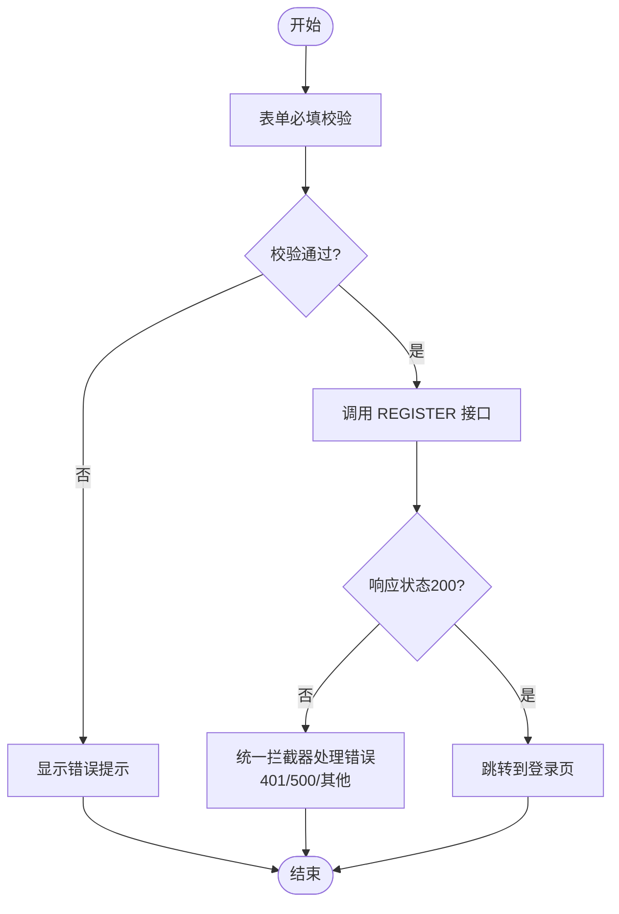

# 认证API

<cite>
**本文引用的文件**
- [packages/core/src/api/index.ts](file://packages/core/src/api/index.ts)
- [packages/plugin-main/src/api/index.ts](file://packages/plugin-main/src/api/index.ts)
- [packages/core/src/hooks/use-api.tsx](file://packages/core/src/hooks/use-api.tsx)
- [packages/core/src/utils/request.tsx](file://packages/core/src/utils/request.tsx)
- [packages/core/src/components/Login/index.tsx](file://packages/core/src/components/Login/index.tsx)
- [packages/core/src/components/SignUp/index.tsx](file://packages/core/src/components/SignUp/index.tsx)
- [packages/core/src/Layout.tsx](file://packages/core/src/Layout.tsx)
- [packages/core/src/App.tsx](file://packages/core/src/App.tsx)
</cite>

## 目录
1. [简介](#简介)
2. [项目结构](#项目结构)
3. [核心组件](#核心组件)
4. [架构总览](#架构总览)
5. [详细组件分析](#详细组件分析)
6. [依赖关系分析](#依赖关系分析)
7. [性能考量](#性能考量)
8. [故障排除指南](#故障排除指南)
9. [结论](#结论)

## 简介
本文件面向知识库管理系统的认证API，聚焦以下接口：
- 登录接口（LOGIN）
- 获取用户信息接口（GET_USER_INFO）
- 用户注册接口（REGISTER）

内容涵盖HTTP方法、URL路径、请求参数、响应格式、权限要求、参数校验与错误处理机制、调用示例、安全考虑与最佳实践、错误码说明与故障排除。

## 项目结构
认证相关能力由前端模块化封装，核心位于“@kn/core”与“@kn/plugin-main”两个包：
- API常量集中于各包的 api/index.ts
- 请求封装与拦截器位于 @kn/core 的 request.tsx
- 调用入口 useApi 封装在 hooks/use-api.tsx
- 登录/注册表单组件分别在 core 包的 Login/SignUp 组件中发起调用
- 页面布局 Layout 在进入受保护路由前拉取用户信息

图表来源
- [packages/core/src/api/index.ts](file://packages/core/src/api/index.ts#L1-L49)
- [packages/plugin-main/src/api/index.ts](file://packages/plugin-main/src/api/index.ts#L1-L120)
- [packages/core/src/hooks/use-api.tsx](file://packages/core/src/hooks/use-api.tsx#L1-L51)
- [packages/core/src/utils/request.tsx](file://packages/core/src/utils/request.tsx#L1-L118)
- [packages/core/src/components/Login/index.tsx](file://packages/core/src/components/Login/index.tsx#L1-L146)
- [packages/core/src/components/SignUp/index.tsx](file://packages/core/src/components/SignUp/index.tsx#L1-L108)
- [packages/core/src/Layout.tsx](file://packages/core/src/Layout.tsx#L70-L84)

章节来源
- [packages/core/src/api/index.ts](file://packages/core/src/api/index.ts#L1-L49)
- [packages/plugin-main/src/api/index.ts](file://packages/plugin-main/src/api/index.ts#L1-L120)

## 核心组件
- API 常量：统一声明 LOGIN、GET_USER_INFO、REGISTER 等接口的 URL 与方法
- useApi：对 API 常量进行封装，支持路径参数替换、GET/POST/PUT/DELETE 分发
- request：基于 axios 实例，设置基础路径、鉴权头、统一拦截器与错误处理
- 登录/注册组件：表单校验通过后调用 useApi 发起请求
- Layout：应用初始化时拉取用户信息并更新全局状态；失败则跳转登录

章节来源
- [packages/core/src/hooks/use-api.tsx](file://packages/core/src/hooks/use-api.tsx#L1-L51)
- [packages/core/src/utils/request.tsx](file://packages/core/src/utils/request.tsx#L1-L118)
- [packages/core/src/components/Login/index.tsx](file://packages/core/src/components/Login/index.tsx#L1-L146)
- [packages/core/src/components/SignUp/index.tsx](file://packages/core/src/components/SignUp/index.tsx#L1-L108)
- [packages/core/src/Layout.tsx](file://packages/core/src/Layout.tsx#L70-L84)

## 架构总览
认证API调用链路如下：

图表来源
- [packages/core/src/components/Login/index.tsx](file://packages/core/src/components/Login/index.tsx#L44-L59)
- [packages/core/src/hooks/use-api.tsx](file://packages/core/src/hooks/use-api.tsx#L24-L51)
- [packages/core/src/utils/request.tsx](file://packages/core/src/utils/request.tsx#L41-L57)
- [packages/core/src/api/index.ts](file://packages/core/src/api/index.ts#L1-L20)

## 详细组件分析

### 登录接口（LOGIN）
- HTTP 方法：POST
- URL 路径：/knowledge-auth/token
- 请求参数（来自登录表单）：
  - account：必填
  - password：必填
  - grantType：默认值为 "password"
  - type：默认值为 "account"
  - scope：默认值为 "all"
- 响应格式（成功）：
  - data.accessToken：用于后续请求鉴权
  - 其他用户信息字段由后端返回（具体以实际接口为准）
- 权限要求：无需已登录，开放接口
- 参数校验：前端使用表单校验框架进行必填校验
- 错误处理：统一拦截器处理401/500等错误并提示，必要时重定向登录

章节来源
- [packages/core/src/api/index.ts](file://packages/core/src/api/index.ts#L1-L12)
- [packages/core/src/components/Login/index.tsx](file://packages/core/src/components/Login/index.tsx#L27-L37)
- [packages/core/src/components/Login/index.tsx](file://packages/core/src/components/Login/index.tsx#L44-L59)
- [packages/core/src/utils/request.tsx](file://packages/core/src/utils/request.tsx#L59-L96)

### 获取用户信息接口（GET_USER_INFO）
- HTTP 方法：GET
- URL 路径：/knowledge-system/user/info
- 使用方式：
  - 登录成功后，前端存储令牌并在进入受保护页面时调用该接口
  - Layout 初始化时调用该接口，将返回数据写入全局状态；若失败则跳转登录页
- 权限要求：需携带认证令牌（自动注入）
- 响应格式（成功）：
  - data：包含用户基本信息（如账号、昵称、头像等，具体以实际接口为准）

章节来源
- [packages/core/src/api/index.ts](file://packages/core/src/api/index.ts#L9-L12)
- [packages/core/src/Layout.tsx](file://packages/core/src/Layout.tsx#L73-L84)
- [packages/core/src/App.tsx](file://packages/core/src/App.tsx#L108-L127)

### 用户注册接口（REGISTER）
- HTTP 方法：POST
- URL 路径：/knowledge-system/user/register
- 请求参数（来自注册表单）：
  - name：昵称
  - account：账号（邮箱）
  - password：密码
  - avatar：头像文件名（可选）
- 响应格式（成功）：
  - 通常返回注册结果或空对象，前端收到后跳转登录页
- 参数校验与错误处理：
  - 表单层进行必填校验
  - useApi 与 request 统一处理网络错误、超时、401/500 等异常

章节来源
- [packages/core/src/api/index.ts](file://packages/core/src/api/index.ts#L17-L20)
- [packages/core/src/components/SignUp/index.tsx](file://packages/core/src/components/SignUp/index.tsx#L28-L42)
- [packages/core/src/components/SignUp/index.tsx](file://packages/core/src/components/SignUp/index.tsx#L48-L55)
- [packages/core/src/utils/request.tsx](file://packages/core/src/utils/request.tsx#L97-L118)

### API 调用序列图（登录）

图表来源
- [packages/core/src/components/Login/index.tsx](file://packages/core/src/components/Login/index.tsx#L44-L59)
- [packages/core/src/hooks/use-api.tsx](file://packages/core/src/hooks/use-api.tsx#L24-L51)
- [packages/core/src/utils/request.tsx](file://packages/core/src/utils/request.tsx#L41-L57)
- [packages/core/src/api/index.ts](file://packages/core/src/api/index.ts#L1-L12)

### 参数校验与错误处理流程（注册）

图表来源
- [packages/core/src/components/SignUp/index.tsx](file://packages/core/src/components/SignUp/index.tsx#L28-L55)
- [packages/core/src/hooks/use-api.tsx](file://packages/core/src/hooks/use-api.tsx#L24-L51)
- [packages/core/src/utils/request.tsx](file://packages/core/src/utils/request.tsx#L59-L118)

## 依赖关系分析
- 登录/注册组件依赖 useApi 进行请求
- useApi 依赖 request 进行实际网络请求与拦截
- request 设置基础路径与鉴权头，统一处理响应与错误
- Layout 依赖 GET_USER_INFO 完成用户态初始化

图表来源
- [packages/core/src/components/Login/index.tsx](file://packages/core/src/components/Login/index.tsx#L1-L146)
- [packages/core/src/components/SignUp/index.tsx](file://packages/core/src/components/SignUp/index.tsx#L1-L108)
- [packages/core/src/Layout.tsx](file://packages/core/src/Layout.tsx#L70-L84)
- [packages/core/src/hooks/use-api.tsx](file://packages/core/src/hooks/use-api.tsx#L1-L51)
- [packages/core/src/utils/request.tsx](file://packages/core/src/utils/request.tsx#L1-L118)
- [packages/core/src/api/index.ts](file://packages/core/src/api/index.ts#L1-L49)
- [packages/plugin-main/src/api/index.ts](file://packages/plugin-main/src/api/index.ts#L1-L120)

章节来源
- [packages/core/src/hooks/use-api.tsx](file://packages/core/src/hooks/use-api.tsx#L1-L51)
- [packages/core/src/utils/request.tsx](file://packages/core/src/utils/request.tsx#L1-L118)
- [packages/core/src/api/index.ts](file://packages/core/src/api/index.ts#L1-L49)
- [packages/plugin-main/src/api/index.ts](file://packages/plugin-main/src/api/index.ts#L1-L120)

## 性能考量
- 请求超时与重试：request 设置了超时时间，建议在调用侧合理设置重试策略与退避
- 头部携带：统一注入 Authorization Basic 与自定义鉴权头，避免重复拼装
- 响应解析：拦截器集中处理非200状态与业务错误码，减少重复判断逻辑
- 路由守卫：Layout 中在进入受保护页面前拉取用户信息，避免多次无意义请求

## 故障排除指南
- 登录后无法进入首页
  - 检查是否正确存储 accessToken 并在 request 中注入
  - 查看拦截器是否返回401并触发重定向
- 获取用户信息失败
  - 确认已携带令牌
  - 观察拦截器对401/500的处理与提示
- 注册失败
  - 确认表单必填项已填写
  - 查看拦截器对网络错误、超时、业务错误的提示
- 常见错误码与含义
  - 401：未授权/会话过期，需重新登录
  - 500：服务器内部错误
  - 其他非200：业务错误，消息体包含具体提示

章节来源
- [packages/core/src/utils/request.tsx](file://packages/core/src/utils/request.tsx#L59-L118)
- [packages/core/src/Layout.tsx](file://packages/core/src/Layout.tsx#L73-L84)
- [packages/core/src/App.tsx](file://packages/core/src/App.tsx#L108-L127)

## 结论
本文档梳理了知识库管理系统认证API的登录、获取用户信息与注册三大接口，明确了请求路径、方法、参数、响应与错误处理机制，并结合前端实现展示了调用链路与安全注意事项。建议在生产环境中：
- 严格遵循令牌生命周期管理
- 对敏感操作增加二次确认与权限校验
- 在网关或服务端补充速率限制与防爆破策略
- 对外暴露的接口完善文档与契约校验