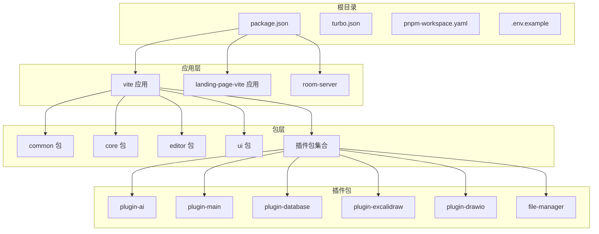
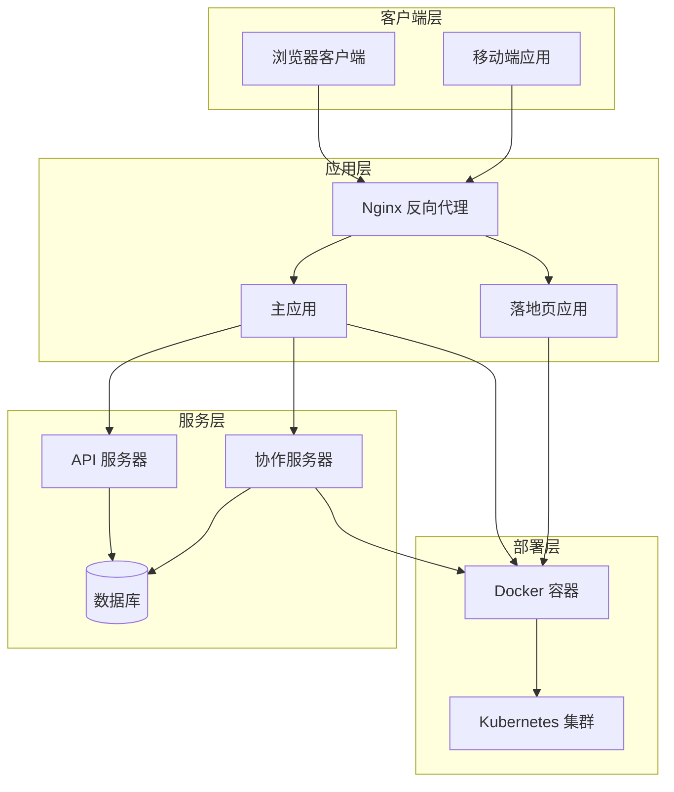
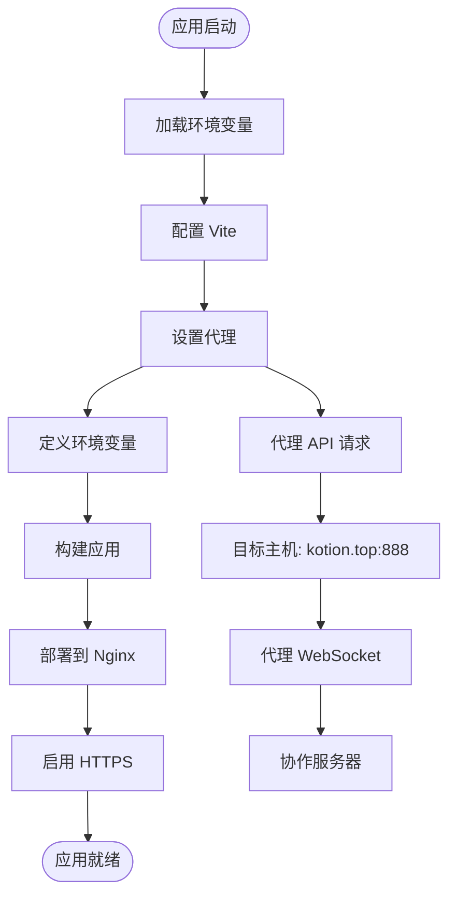
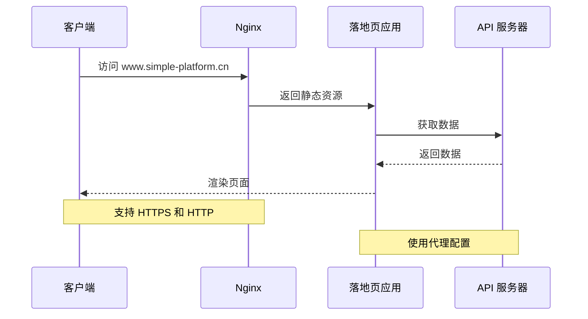
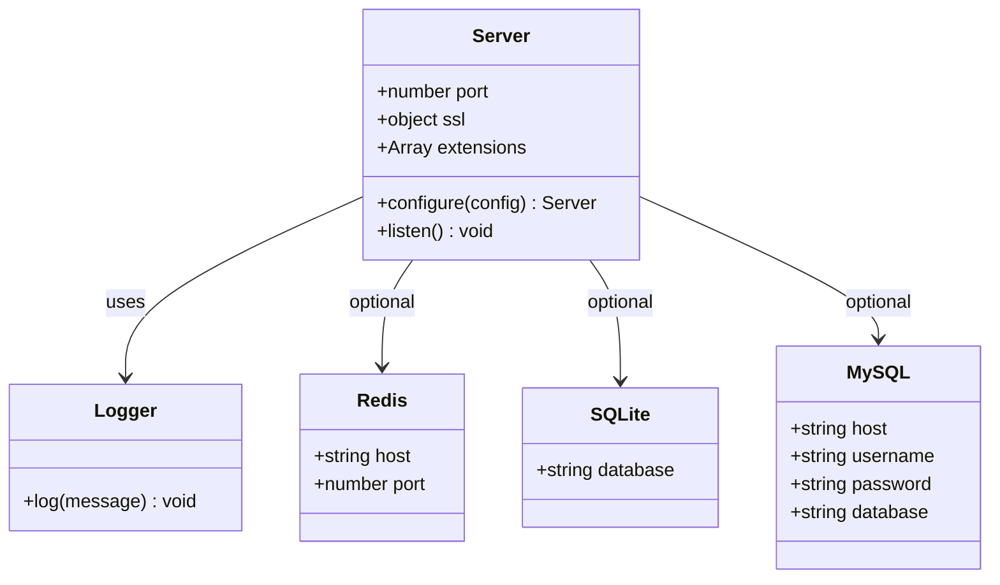
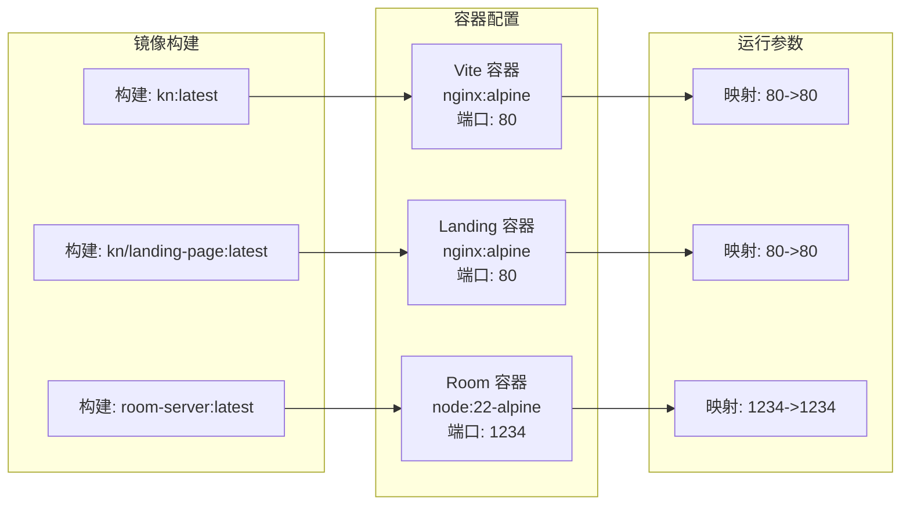
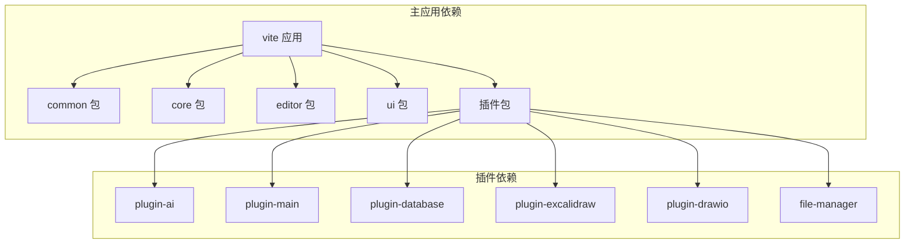
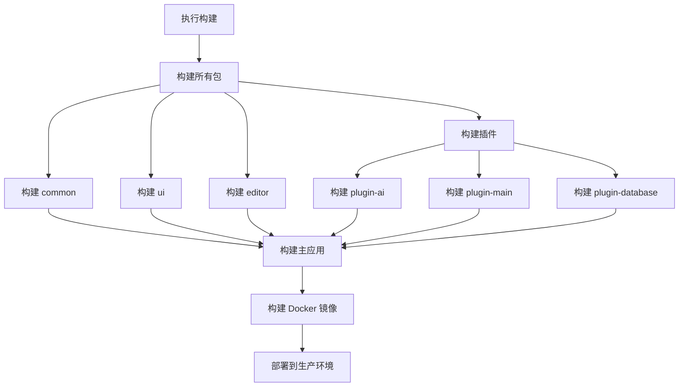

# 部署配置

<cite>
**本文档引用的文件**
- [package.json](file://package.json)
- [turbo.json](file://turbo.json)
- [pnpm-workspace.yaml](file://pnpm-workspace.yaml)
- [.env.example](file://.env.example)
- [apps/vite/Dockerfile](file://apps/vite/Dockerfile)
- [apps/landing-page-vite/Dockerfile](file://apps/landing-page-vite/Dockerfile)
- [packages/room-server/Dockerfile](file://packages/room-server/Dockerfile)
- [apps/vite/vite.config.ts](file://apps/vite/vite.config.ts)
- [apps/landing-page-vite/vite.config.ts](file://apps/landing-page-vite/vite.config.ts)
- [apps/vite/nginx/nginx.conf](file://apps/vite/nginx/nginx.conf)
- [apps/landing-page-vite/nginx/nginx.conf](file://apps/landing-page-vite/nginx/nginx.conf)
- [packages/room-server/src/server.mjs](file://packages/room-server/src/server.mjs)
- [packages/room-server/package.json](file://packages/room-server/package.json)
- [apps/vite/package.json](file://apps/vite/package.json)
- [apps/landing-page-vite/package.json](file://apps/landing-page-vite/package.json)
- [packages/common/package.json](file://packages/common/package.json)
</cite>

## 目录
1. [简介](#简介)
2. [项目结构](#项目结构)
3. [核心组件](#核心组件)
4. [架构概览](#架构概览)
5. [详细组件分析](#详细组件分析)
6. [依赖关系分析](#依赖关系分析)
7. [性能考虑](#性能考虑)
8. [故障排除指南](#故障排除指南)
9. [结论](#结论)

## 简介

这是一个基于 Turborepo 的多包管理知识库项目，采用现代化的前端技术栈和容器化部署策略。项目包含多个应用程序和插件包，支持协作编辑、实时通信和丰富的文档处理功能。

## 项目结构

该项目采用 Monorepo 架构，使用 pnpm workspace 进行包管理，主要分为以下几部分：

**图表来源**
- [pnpm-workspace.yaml](file://pnpm-workspace.yaml#L1-L4)
- [package.json](file://package.json#L1-L113)

**章节来源**
- [pnpm-workspace.yaml](file://pnpm-workspace.yaml#L1-L4)
- [package.json](file://package.json#L1-L113)

## 核心组件

### 应用程序组件

项目包含三个主要应用程序：

1. **主应用 (vite)**：核心知识库应用，提供完整的编辑和协作功能
2. **落地页应用 (landing-page-vite)**：独立的展示页面应用
3. **房间服务器 (room-server)**：WebSocket 协作服务器

### 包管理结构

采用分层包管理策略：
- **基础包**：common、ui 提供通用功能
- **核心包**：core、editor 提供核心编辑器功能
- **插件包**：各种功能插件的集合

**章节来源**
- [apps/vite/package.json](file://apps/vite/package.json#L1-L50)
- [apps/landing-page-vite/package.json](file://apps/landing-page-vite/package.json#L1-L39)
- [packages/common/package.json](file://packages/common/package.json#L1-L35)

## 架构概览

系统采用三层架构设计，结合容器化部署：

**图表来源**
- [apps/vite/nginx/nginx.conf](file://apps/vite/nginx/nginx.conf#L31-L69)
- [packages/room-server/src/server.mjs](file://packages/room-server/src/server.mjs#L30-L55)

## 详细组件分析

### 主应用部署配置

主应用采用 Vite 构建工具，支持开发和生产环境：

**图表来源**
- [apps/vite/vite.config.ts](file://apps/vite/vite.config.ts#L6-L26)
- [apps/vite/nginx/nginx.conf](file://apps/vite/nginx/nginx.conf#L45-L58)

**章节来源**
- [apps/vite/vite.config.ts](file://apps/vite/vite.config.ts#L1-L27)
- [apps/vite/nginx/nginx.conf](file://apps/vite/nginx/nginx.conf#L1-L113)

### 落地页应用配置

落地页应用专门用于展示和营销：

**图表来源**
- [apps/landing-page-vite/nginx/nginx.conf](file://apps/landing-page-vite/nginx/nginx.conf#L31-L69)
- [apps/landing-page-vite/vite.config.ts](file://apps/landing-page-vite/vite.config.ts#L21-L32)

**章节来源**
- [apps/landing-page-vite/vite.config.ts](file://apps/landing-page-vite/vite.config.ts#L1-L33)
- [apps/landing-page-vite/nginx/nginx.conf](file://apps/landing-page-vite/nginx/nginx.conf#L1-L113)

### 协作服务器配置

房间服务器提供实时协作功能：

**图表来源**
- [packages/room-server/src/server.mjs](file://packages/room-server/src/server.mjs#L30-L55)

**章节来源**
- [packages/room-server/src/server.mjs](file://packages/room-server/src/server.mjs#L1-L59)
- [packages/room-server/package.json](file://packages/room-server/package.json#L1-L32)

### Docker 容器配置

各组件的 Docker 配置如下：

**图表来源**
- [apps/vite/Dockerfile](file://apps/vite/Dockerfile#L1-L10)
- [apps/landing-page-vite/Dockerfile](file://apps/landing-page-vite/Dockerfile#L1-L12)
- [packages/room-server/Dockerfile](file://packages/room-server/Dockerfile#L1-L29)

**章节来源**
- [apps/vite/Dockerfile](file://apps/vite/Dockerfile#L1-L10)
- [apps/landing-page-vite/Dockerfile](file://apps/landing-page-vite/Dockerfile#L1-L12)
- [packages/room-server/Dockerfile](file://packages/room-server/Dockerfile#L1-L29)

## 依赖关系分析

### 包依赖关系

**图表来源**
- [apps/vite/package.json](file://apps/vite/package.json#L14-L37)

**章节来源**
- [apps/vite/package.json](file://apps/vite/package.json#L1-L50)
- [packages/common/package.json](file://packages/common/package.json#L1-L35)

### 构建流程依赖

**图表来源**
- [package.json](file://package.json#L9-L32)
- [turbo.json](file://turbo.json#L6-L25)

**章节来源**
- [package.json](file://package.json#L1-L113)
- [turbo.json](file://turbo.json#L1-L27)

## 性能考虑

### 构建优化

1. **代码分割**：使用 Vite 的自动代码分割功能
2. **缓存策略**：利用浏览器缓存和 CDN 加速
3. **压缩优化**：启用 Gzip 压缩和资源压缩
4. **懒加载**：按需加载插件和组件

### 服务器配置

1. **连接池**：合理配置 Nginx 连接数
2. **超时设置**：优化代理超时时间
3. **SSL 配置**：启用 HTTPS 加速
4. **负载均衡**：支持多实例部署

## 故障排除指南

### 常见部署问题

1. **端口冲突**
   - 检查端口占用情况
   - 修改 Docker 端口映射
   - 验证防火墙设置

2. **SSL 证书问题**
   - 确认证书文件路径正确
   - 验证证书权限设置
   - 检查证书格式兼容性

3. **代理配置错误**
   - 验证 API 基础 URL 设置
   - 检查 CORS 配置
   - 确认 WebSocket 代理设置

4. **环境变量配置**
   - 复制 `.env.example` 为 `.env.local`
   - 验证必需的环境变量设置
   - 检查变量命名一致性

**章节来源**
- [packages/room-server/src/server.mjs](file://packages/room-server/src/server.mjs#L16-L28)
- [.env.example](file://.env.example#L1-L24)

### 开发环境调试

1. **启动顺序**
   - 先启动协作服务器
   - 再启动 API 服务器
   - 最后启动前端应用

2. **日志监控**
   - 查看 Docker 容器日志
   - 监控 Nginx 错误日志
   - 检查应用运行状态

3. **网络诊断**
   - 验证服务间连通性
   - 检查 DNS 解析
   - 测试端口可达性

## 结论

该部署配置展现了现代前端应用的最佳实践，通过容器化、微服务架构和自动化构建实现了高效的开发和部署流程。关键优势包括：

1. **模块化设计**：清晰的包管理和依赖关系
2. **容器化部署**：标准化的 Docker 配置
3. **多环境支持**：灵活的环境变量配置
4. **性能优化**：全面的构建和运行时优化
5. **可扩展性**：支持水平扩展和集群部署

建议在生产环境中进一步完善监控、日志收集和自动化运维流程，以确保系统的稳定性和可维护性。