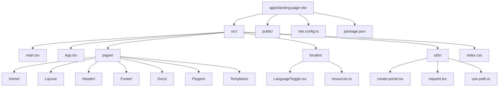
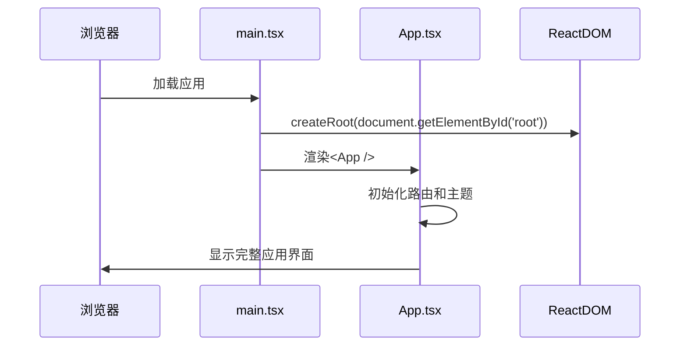
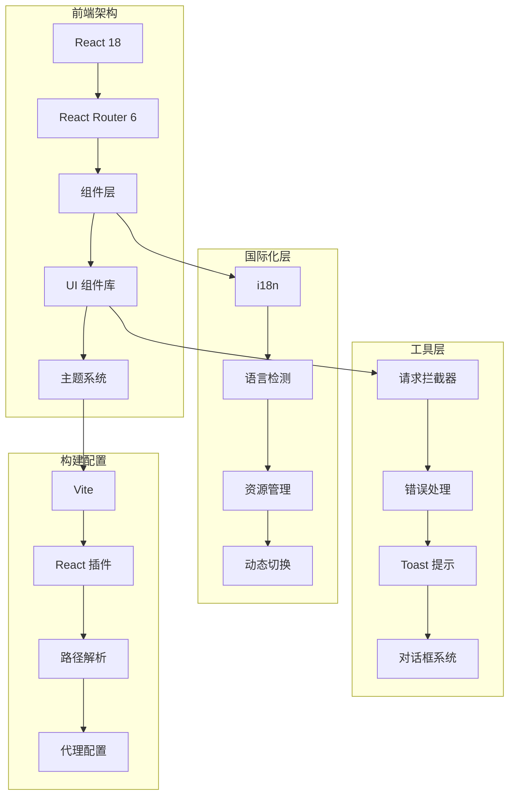
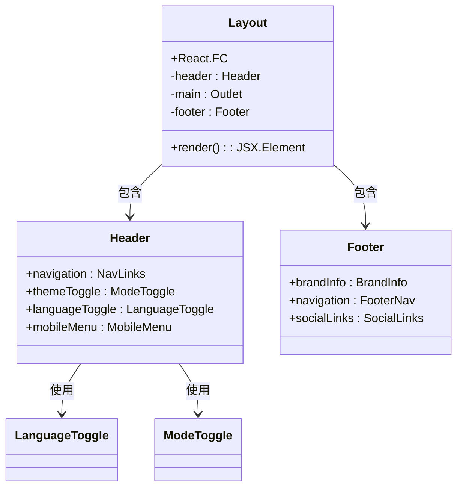
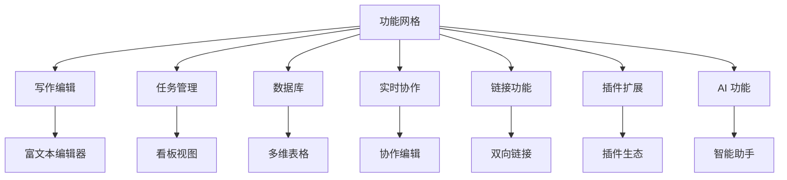
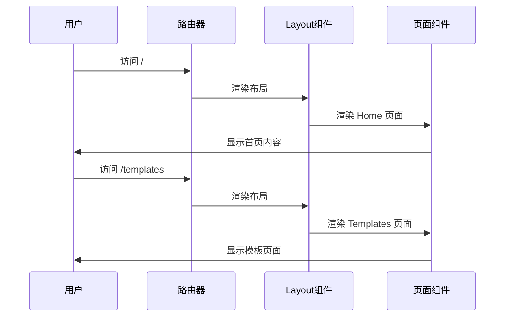
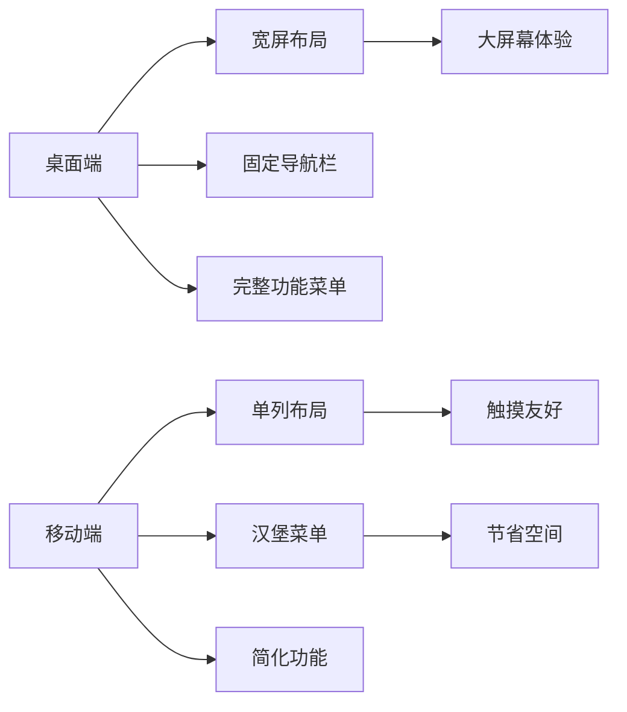
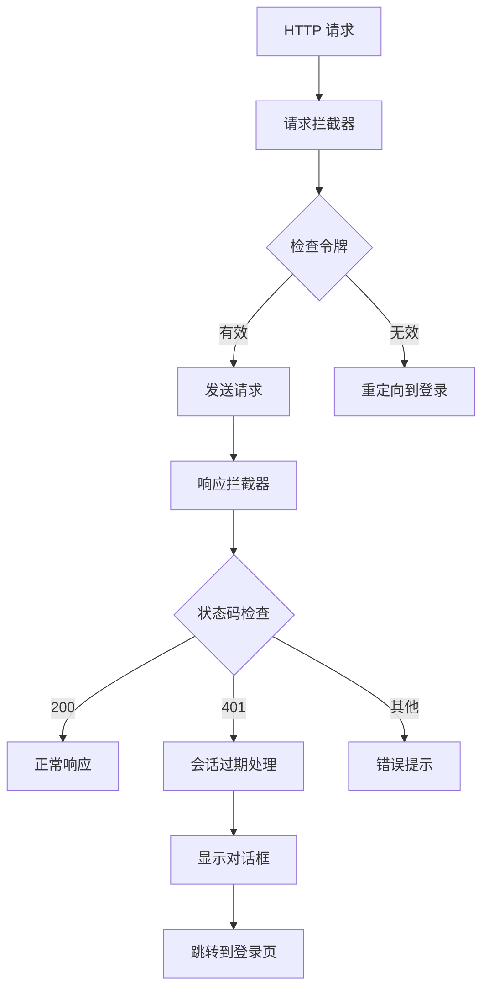

# Landing Page Vite

<cite>
**本文档引用的文件**
- [package.json](file://apps/landing-page-vite/package.json)
- [vite.config.ts](file://apps/landing-page-vite/vite.config.ts)
- [main.tsx](file://apps/landing-page-vite/src/main.tsx)
- [App.tsx](file://apps/landing-page-vite/src/App.tsx)
- [index.html](file://apps/landing-page-vite/index.html)
- [Home/index.tsx](file://apps/landing-page-vite/src/pages/Home/index.tsx)
- [Layout/index.tsx](file://apps/landing-page-vite/src/pages/Layout/index.tsx)
- [Header/index.tsx](file://apps/landing-page-vite/src/pages/Header/index.tsx)
- [Footer/index.tsx](file://apps/landing-page-vite/src/pages/Footer/index.tsx)
- [resources.ts](file://apps/landing-page-vite/src/locales/resources.ts)
- [LanguageToggle.tsx](file://apps/landing-page-vite/src/locales/LanguageToggle.tsx)
- [request.tsx](file://apps/landing-page-vite/src/utils/request.tsx)
- [create-portal.tsx](file://apps/landing-page-vite/src/utils/create-portal.tsx)
- [tsconfig.json](file://apps/landing-page-vite/tsconfig.json)
- [tailwind.config.js](file://apps/landing-page-vite/tailwind.config.js)
</cite>

## 目录
1. [项目概述](#项目概述)
2. [项目结构](#项目结构)
3. [核心组件](#核心组件)
4. [架构概览](#架构概览)
5. [详细组件分析](#详细组件分析)
6. [国际化系统](#国际化系统)
7. [路由与导航](#路由与导航)
8. [响应式设计](#响应式设计)
9. [性能优化](#性能优化)
10. [错误处理](#错误处理)
11. [部署配置](#部署配置)
12. [总结](#总结)

## 项目概述

Landing Page Vite 是一个基于 Vite 构建的现代化知识管理平台落地页应用。该项目采用 React 18 + TypeScript 技术栈，结合 Tailwind CSS 实现响应式设计，为用户提供美观、流畅的用户体验。

### 主要特性

- **现代化构建工具**: 基于 Vite 7.x 的快速开发体验
- **国际化支持**: 支持中英文双语切换
- **响应式设计**: 完全适配移动端和桌面端
- **实时协作**: 集成协作编辑功能
- **插件生态**: 支持丰富的插件系统
- **多视图数据库**: 提供多种数据展示方式

## 项目结构



**图表来源**
- [package.json](file://apps/landing-page-vite/package.json#L1-L39)
- [vite.config.ts](file://apps/landing-page-vite/vite.config.ts#L1-L44)

**章节来源**
- [package.json](file://apps/landing-page-vite/package.json#L1-L39)
- [vite.config.ts](file://apps/landing-page-vite/vite.config.ts#L1-L44)

## 核心组件

### 应用入口

应用的入口点位于 `src/main.tsx`，负责初始化 React 应用并渲染根组件：



**图表来源**
- [main.tsx](file://apps/landing-page-vite/src/main.tsx#L1-L10)
- [App.tsx](file://apps/landing-page-vite/src/App.tsx#L1-L73)

### 应用主组件

`App.tsx` 是整个应用的核心组件，负责：

- **路由配置**: 设置页面路由和嵌套路由
- **主题管理**: 配置暗黑模式支持
- **国际化**: 初始化 i18n 国际化系统
- **平滑滚动**: 实现锚点链接的平滑滚动效果

**章节来源**
- [App.tsx](file://apps/landing-page-vite/src/App.tsx#L1-L73)

## 架构概览



**图表来源**
- [App.tsx](file://apps/landing-page-vite/src/App.tsx#L13-L26)
- [request.tsx](file://apps/landing-page-vite/src/utils/request.tsx#L6-L9)
- [vite.config.ts](file://apps/landing-page-vite/vite.config.ts#L9-L11)

## 详细组件分析

### 布局系统

#### 主布局组件

`Layout/index.tsx` 提供了应用的基础布局结构：



**图表来源**
- [Layout/index.tsx](file://apps/landing-page-vite/src/pages/Layout/index.tsx#L8-L21)
- [Header/index.tsx](file://apps/landing-page-vite/src/pages/Header/index.tsx#L1-L159)
- [Footer/index.tsx](file://apps/landing-page-vite/src/pages/Footer/index.tsx#L1-L113)

#### 头部导航组件

头部组件实现了响应式导航栏，包含：

- **品牌标识**: Kotion 品牌展示
- **主导航**: 功能、模板、价格、文档等链接
- **操作按钮**: GitHub、主题切换、语言切换、登录和免费获取按钮
- **移动端菜单**: 下拉式移动端导航

**章节来源**
- [Header/index.tsx](file://apps/landing-page-vite/src/pages/Header/index.tsx#L1-L159)

### 首页内容

#### 英雄区域

首页的英雄区域包含了：

- **特色徽章**: "AI 驱动的知识库" 等标签
- **主标题**: 分两行显示的标题
- **描述文本**: 项目核心价值说明
- **CTA 按钮**: 免费开始和 GitHub Star 按钮
- **统计数据**: 用户数、插件数、运行时间等指标

#### 功能展示网格

采用 bento 样式的网格布局展示核心功能：



**图表来源**
- [Home/index.tsx](file://apps/landing-page-vite/src/pages/Home/index.tsx#L218-L375)

**章节来源**
- [Home/index.tsx](file://apps/landing-page-vite/src/pages/Home/index.tsx#L1-L1004)

### 页脚组件

页脚组件提供了完整的站点信息：

- **品牌信息**: Kotion 品牌标识和简介
- **产品导航**: 功能、模板、价格、插件等链接
- **资源链接**: 文档、指南、API 参考、社区等
- **公司信息**: 关于、博客、职业、联系等
- **法律信息**: 隐私政策、服务条款、Cookie 政策
- **社交媒体**: Twitter、GitHub、LinkedIn 链接

**章节来源**
- [Footer/index.tsx](file://apps/landing-page-vite/src/pages/Footer/index.tsx#L1-L113)

## 国际化系统

### 资源管理

项目实现了完整的国际化支持，包括：

#### 语言资源结构

```mermaid
graph TD
A[i18n 资源] --> B[中文资源(zh)]
A --> C[英文资源(en)]
B --> D[头部导航]
B --> E[首页内容]
B --> F[插件页面]
B --> G[文档内容]
B --> H[模板页面]
C --> I[头部导航]
C --> J[首页内容]
C --> K[插件页面]
C --> L[文档内容]
C --> M[模板页面]
```

**图表来源**
- [resources.ts](file://apps/landing-page-vite/src/locales/resources.ts#L1-L800)

#### 语言切换功能

语言切换组件支持：

- **自动检测**: 基于浏览器语言设置
- **手动切换**: 下拉菜单选择语言
- **本地存储**: 记住用户选择的语言偏好
- **旗帜图标**: 不同语言对应的国旗表情

**章节来源**
- [resources.ts](file://apps/landing-page-vite/src/locales/resources.ts#L1-L1154)
- [LanguageToggle.tsx](file://apps/landing-page-vite/src/locales/LanguageToggle.tsx#L1-L44)

## 路由与导航

### 路由配置

应用使用 React Router 6 实现页面路由：



**图表来源**
- [App.tsx](file://apps/landing-page-vite/src/App.tsx#L31-L43)

### 平滑滚动

应用实现了锚点链接的平滑滚动功能：

- **事件监听**: 监听页面点击事件
- **条件判断**: 仅处理以 # 开头的锚点链接
- **滚动动画**: 使用 smooth behavior 实现平滑滚动
- **区块对齐**: 滚动到目标元素的顶部对齐

**章节来源**
- [App.tsx](file://apps/landing-page-vite/src/App.tsx#L45-L67)

## 响应式设计

### 设计原则

项目采用 Tailwind CSS 实现响应式设计：

- **移动端优先**: 从小屏幕开始设计
- **断点系统**: 使用 md、lg、xl 断点
- **弹性布局**: grid 和 flexbox 结合使用
- **自适应组件**: 组件根据屏幕尺寸调整布局

### 关键响应式特性



**图表来源**
- [Header/index.tsx](file://apps/landing-page-vite/src/pages/Header/index.tsx#L107-L157)

## 性能优化

### 构建配置

Vite 配置实现了多项性能优化：

#### 依赖优化

- **去重处理**: dedupe react、react-dom、react-router-dom
- **别名配置**: 直接指向 node_modules 中的 React 包
- **预优化**: optimizeDeps 包含核心依赖

#### 代码分割

- **手动分块**: 将 react 和 react-dom 单独打包为 'react-vendor'
- **懒加载**: 路由级别的代码分割
- **缓存策略**: 利用浏览器缓存机制

#### 开发体验

- **端口配置**: 默认 5174 端口避免冲突
- **代理设置**: 开发时代理到后端 API
- **热重载**: 快速的开发体验

**章节来源**
- [vite.config.ts](file://apps/landing-page-vite/vite.config.ts#L1-L44)

### 运行时优化

- **虚拟滚动**: 大列表的性能优化
- **防抖节流**: 输入和滚动事件的优化
- **图片优化**: 使用现代格式和适当的尺寸

## 错误处理

### 请求拦截器

项目实现了统一的 HTTP 请求处理：



**图表来源**
- [request.tsx](file://apps/landing-page-vite/src/utils/request.tsx#L36-L50)

### 错误处理机制

- **401 处理**: 自动检测会话过期并提示
- **网络错误**: 友好的网络异常提示
- **超时处理**: 请求超时的专门处理
- **状态码错误**: 根据状态码提供具体错误信息

**章节来源**
- [request.tsx](file://apps/landing-page-vite/src/utils/request.tsx#L1-L93)

### 对话框系统

项目使用 Portal 技术实现模态对话框：

- **创建 Portal**: 动态创建 DOM 节点
- **状态管理**: React 状态控制对话框显示
- **生命周期**: 自动清理 Portal 节点
- **回调处理**: 确认和取消操作的回调

**章节来源**
- [create-portal.tsx](file://apps/landing-page-vite/src/utils/create-portal.tsx#L1-L55)

## 部署配置

### 构建脚本

项目提供了完整的构建和部署脚本：

#### 开发环境

- `npm run dev`: 启动 Vite 开发服务器
- `npm run preview`: 预览生产构建结果

#### 生产构建

- `npm run build`: 生成生产环境构建
- `npm run build:docker`: 构建 Docker 镜像

#### 其他工具

- `npm run lint`: 代码质量检查
- `npm run build-plugin`: 插件构建

### 环境配置

- **开发环境**: `.env.development`
- **生产环境**: `.env.production`
- **Docker 配置**: `Dockerfile` 和 `nginx.conf`

**章节来源**
- [package.json](file://apps/landing-page-vite/package.json#L6-L12)

## 总结

Landing Page Vite 是一个功能完整、设计精良的现代化前端应用。项目展现了以下特点：

### 技术优势

- **现代化技术栈**: React 18 + TypeScript + Vite
- **优秀的开发体验**: 快速热重载和智能类型检查
- **完善的工具链**: ESLint、Prettier、TypeScript 配置
- **响应式设计**: 完整的移动端适配

### 架构特色

- **模块化组件**: 清晰的组件层次结构
- **国际化支持**: 完整的多语言解决方案
- **主题系统**: 暗黑模式支持
- **错误处理**: 统一的错误处理机制

### 用户体验

- **流畅的交互**: 平滑滚动和动画效果
- **直观的导航**: 清晰的信息架构
- **一致的设计**: 基于 Tailwind CSS 的设计系统
- **无障碍访问**: 良好的可访问性支持

该项目为知识管理平台提供了优秀的前端基础，具有良好的扩展性和维护性，是现代前端开发的优秀范例。