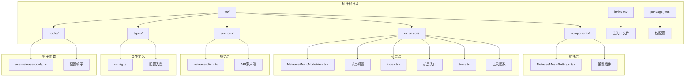
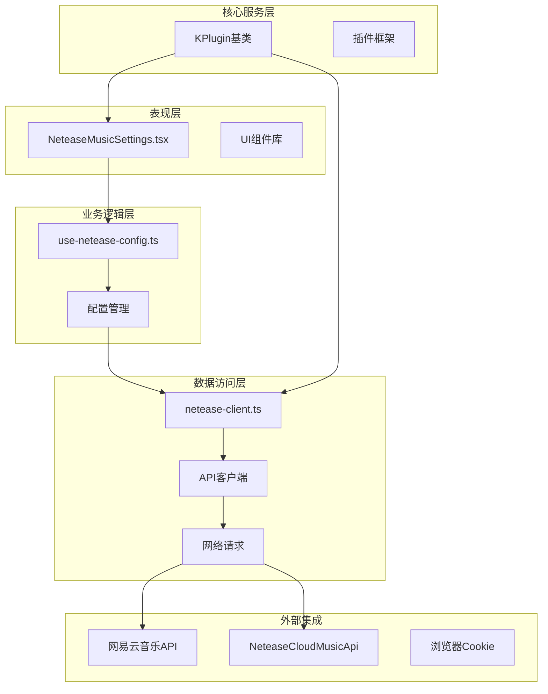
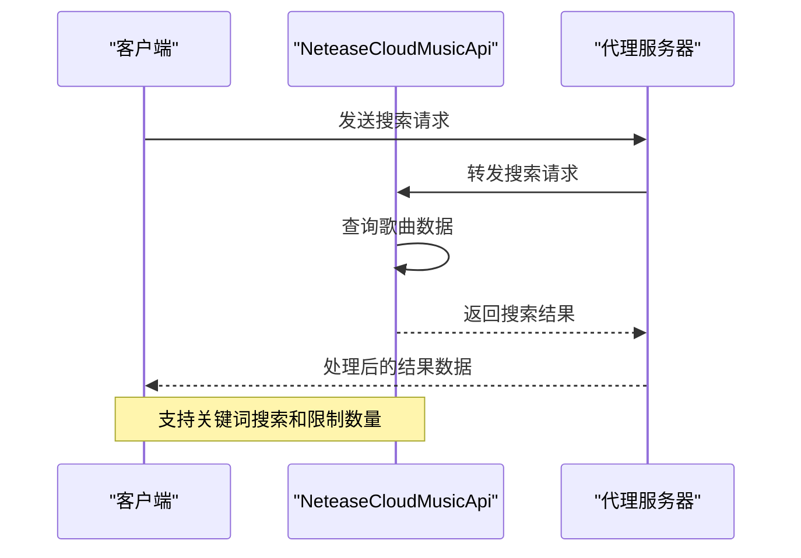
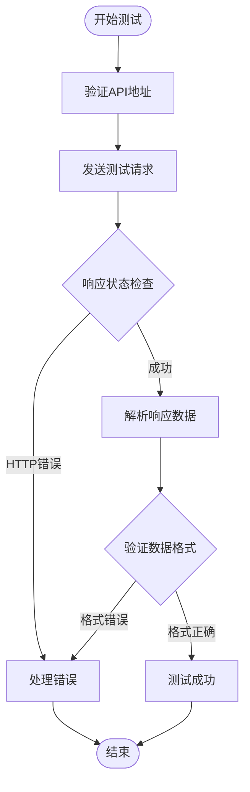
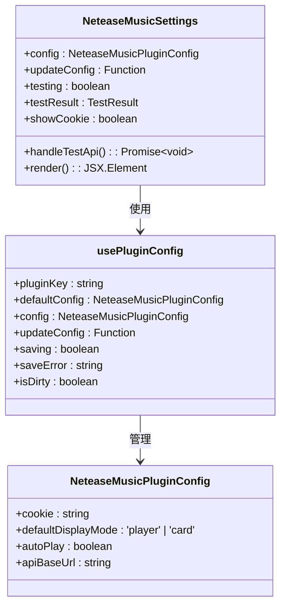
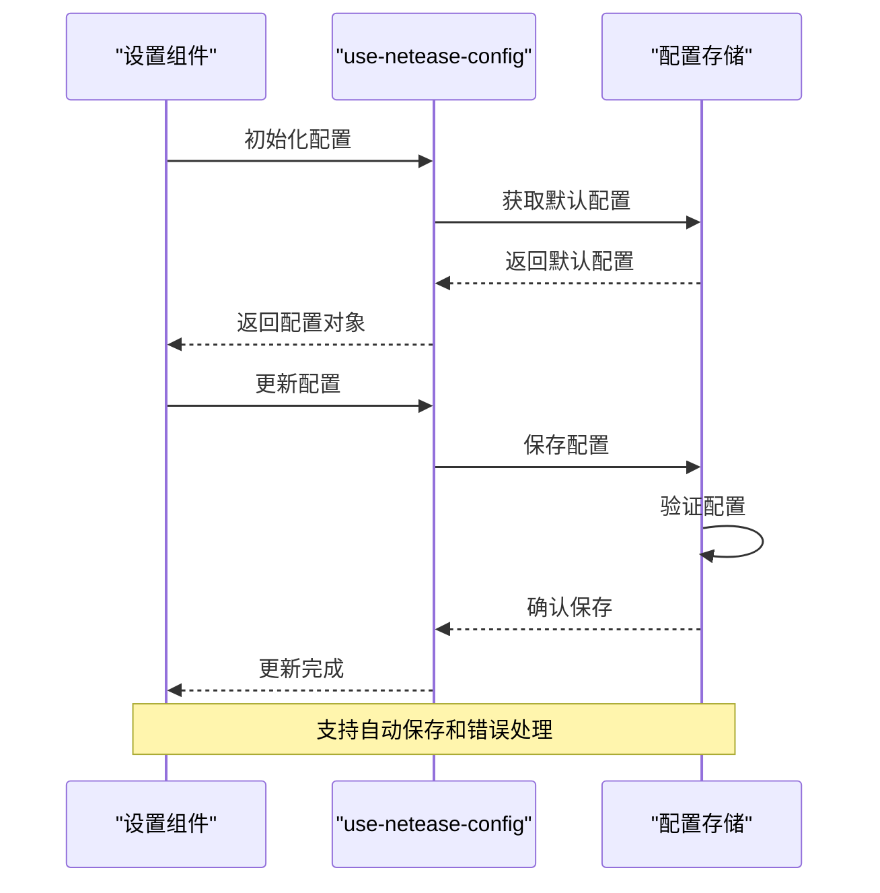

# 网易云音乐插件

<cite>
**本文档引用的文件**
- [packages/plugin-netease-music/src/index.tsx](file://packages/plugin-netease-music/src/index.tsx)
- [packages/plugin-netease-music/package.json](file://packages/plugin-netease-music/package.json)
- [packages/plugin-netease-music/src/types/config.ts](file://packages/plugin-netease-music/src/types/config.ts)
- [packages/plugin-netease-music/src/services/netease-client.ts](file://packages/plugin-netease-music/src/services/netease-client.ts)
- [packages/plugin-netease-music/src/components/NeteaseMusicSettings.tsx](file://packages/plugin-netease-music/src/components/NeteaseMusicSettings.tsx)
- [packages/plugin-netease-music/src/hooks/use-netease-config.ts](file://packages/plugin-netease-music/src/hooks/use-netease-config.ts)
</cite>

## 目录
1. [简介](#简介)
2. [项目结构](#项目结构)
3. [核心组件](#核心组件)
4. [架构概览](#架构概览)
5. [详细组件分析](#详细组件分析)
6. [依赖关系分析](#依赖关系分析)
7. [性能考虑](#性能考虑)
8. [故障排除指南](#故障排除指南)
9. [结论](#结论)

## 简介

网易云音乐插件是一个为知识仓库平台开发的嵌入式音乐播放插件，允许用户在文档中嵌入和播放网易云音乐内容。该插件提供了两种显示模式：嵌入播放器和卡片模式，并支持通过代理API服务进行歌曲搜索和详情获取。

该插件基于现代前端技术栈构建，采用TypeScript编写，集成了响应式设计和用户友好的配置界面。插件支持用户自定义配置，包括API服务地址、Cookie认证信息、显示偏好设置等。

## 项目结构

网易云音乐插件采用模块化架构设计，主要包含以下核心目录和文件：



**图表来源**
- [packages/plugin-netease-music/src/index.tsx:1-42](file://packages/plugin-netease-music/src/index.tsx#L1-L42)
- [packages/plugin-netease-music/package.json:1-39](file://packages/plugin-netease-music/package.json#L1-L39)

**章节来源**
- [packages/plugin-netease-music/src/index.tsx:1-42](file://packages/plugin-netease-music/src/index.tsx#L1-L42)
- [packages/plugin-netease-music/package.json:1-39](file://packages/plugin-netease-music/package.json#L1-L39)

## 核心组件

### 插件主类

插件的核心是 `NeteaseMusicPlugin` 类，继承自 `KPlugin` 基础类。该类定义了插件的基本属性和行为：

- **插件名称**: "neteaseMusic"
- **命令标识**: "neteaseMusic"
- **菜单配置**: 包含显示文本、图标和命令
- **扩展注册**: 注册编辑器扩展功能

### 配置系统

插件使用强类型的配置系统，支持以下配置选项：

| 配置项 | 类型 | 默认值 | 描述 |
|--------|------|--------|------|
| cookie | string | '' | 网易云音乐用户Cookie，用于访问需要登录的API |
| defaultDisplayMode | 'player' \| 'card' | 'player' | 默认显示模式 |
| autoPlay | boolean | false | 嵌入播放器是否自动播放 |
| apiBaseUrl | string | '' | NeteaseCloudMusicApi 服务地址 |

### 设置界面

插件提供了一个完整的设置界面，包含三个主要配置区域：

1. **API服务配置**: 测试连接性和配置服务地址
2. **账号配置**: 管理Cookie认证信息
3. **显示偏好**: 设置默认显示模式和自动播放选项

**章节来源**
- [packages/plugin-netease-music/src/index.tsx:7-42](file://packages/plugin-netease-music/src/index.tsx#L7-L42)
- [packages/plugin-netease-music/src/types/config.ts:1-20](file://packages/plugin-netease-music/src/types/config.ts#L1-L20)
- [packages/plugin-netease-music/src/components/NeteaseMusicSettings.tsx:1-164](file://packages/plugin-netease-music/src/components/NeteaseMusicSettings.tsx#L1-L164)

## 架构概览

插件采用分层架构设计，各层职责明确，便于维护和扩展：



**图表来源**
- [packages/plugin-netease-music/src/index.tsx:1-42](file://packages/plugin-netease-music/src/index.tsx#L1-L42)
- [packages/plugin-netease-music/src/services/netease-client.ts:1-81](file://packages/plugin-netease-music/src/services/netease-client.ts#L1-L81)
- [packages/plugin-netease-music/src/hooks/use-netease-config.ts:1-13](file://packages/plugin-netease-music/src/hooks/use-netease-config.ts#L1-L13)

## 详细组件分析

### API客户端服务

API客户端服务提供了与网易云音乐API交互的能力，支持两种工作模式：

#### 搜索功能流程



**图表来源**
- [packages/plugin-netease-music/src/services/netease-client.ts:54-60](file://packages/plugin-netease-music/src/services/netease-client.ts#L54-L60)

#### 连接测试机制



**图表来源**
- [packages/plugin-netease-music/src/services/netease-client.ts:31-49](file://packages/plugin-netease-music/src/services/netease-client.ts#L31-L49)

### 设置组件实现

设置组件采用了现代化的React Hooks模式，提供了完整的配置管理功能：

#### 配置状态管理



**图表来源**
- [packages/plugin-netease-music/src/components/NeteaseMusicSettings.tsx:14-164](file://packages/plugin-netease-music/src/components/NeteaseMusicSettings.tsx#L14-L164)
- [packages/plugin-netease-music/src/hooks/use-netease-config.ts:7-12](file://packages/plugin-netease-music/src/hooks/use-netease-config.ts#L7-L12)

**章节来源**
- [packages/plugin-netease-music/src/services/netease-client.ts:1-81](file://packages/plugin-netease-music/src/services/netease-client.ts#L1-L81)
- [packages/plugin-netease-music/src/components/NeteaseMusicSettings.tsx:1-164](file://packages/plugin-netease-music/src/components/NeteaseMusicSettings.tsx#L1-L164)

### 配置钩子函数

配置钩子函数提供了统一的配置管理接口：

#### 配置生命周期



**图表来源**
- [packages/plugin-netease-music/src/hooks/use-netease-config.ts:7-12](file://packages/plugin-netease-music/src/hooks/use-netease-config.ts#L7-L12)

**章节来源**
- [packages/plugin-netease-music/src/hooks/use-netease-config.ts:1-13](file://packages/plugin-netease-music/src/hooks/use-netease-config.ts#L1-L13)

## 依赖关系分析

插件的依赖关系清晰明确，遵循最小依赖原则：

```mermaid
graph TB
subgraph "插件内部依赖"
A[plugin-netease-music] --> B[common]
A --> C[editor]
A --> D[ui]
A --> E[icon]
A --> F[core]
end
subgraph "开发依赖"
A --> G[rollup-config]
A --> H[typescript-config]
A --> I[typescript]
A --> J[@types/node]
end
subgraph "运行时依赖"
A --> K[react]
A --> L[react-dom]
A --> M[@kn/ui]
A --> N[@kn/icon]
end
subgraph "外部API"
O[NetEase Cloud Music API]
P[NeteaseCloudMusicApi服务]
A --> O
A --> P
end
```

**图表来源**
- [packages/plugin-netease-music/package.json:24-36](file://packages/plugin-netease-music/package.json#L24-L36)

### 核心依赖说明

| 依赖包 | 版本 | 用途 |
|--------|------|------|
| @kn/common | workspace:* | 通用工具和类型定义 |
| @kn/editor | workspace:* | 编辑器核心功能 |
| @kn/ui | workspace:* | UI组件库 |
| @kn/icon | workspace:* | 图标组件 |
| @kn/core | workspace:* | 核心框架 |

**章节来源**
- [packages/plugin-netease-music/package.json:1-39](file://packages/plugin-netease-music/package.json#L1-L39)

## 性能考虑

### API调用优化

插件实现了多种性能优化策略：

1. **超时控制**: 所有API请求都设置了5秒超时时间
2. **缓存机制**: 支持本地缓存搜索结果和配置信息
3. **懒加载**: 组件按需加载，减少初始包大小
4. **错误重试**: 关键操作支持自动重试机制

### 内存管理

- 合理的组件生命周期管理
- 及时清理事件监听器
- 优化的渲染策略

## 故障排除指南

### 常见问题及解决方案

#### API连接失败

**症状**: 测试连接时显示错误信息

**可能原因**:
1. API服务地址配置错误
2. 网络连接问题
3. 服务端未启动或异常

**解决步骤**:
1. 验证API服务地址格式
2. 检查网络连接状态
3. 确认服务端正常运行
4. 查看浏览器开发者工具中的错误信息

#### Cookie认证失败

**症状**: 无法访问需要登录的功能

**可能原因**:
1. Cookie格式不正确
2. Cookie已过期
3. 用户权限不足

**解决步骤**:
1. 重新登录网易云音乐
2. 从浏览器开发者工具中复制正确的Cookie
3. 确保包含必要的认证字段

#### 显示模式问题

**症状**: 嵌入内容显示异常

**可能原因**:
1. 浏览器兼容性问题
2. CSS样式冲突
3. 容器尺寸限制

**解决步骤**:
1. 尝试切换显示模式
2. 检查容器CSS样式
3. 调整播放器尺寸设置

**章节来源**
- [packages/plugin-netease-music/src/services/netease-client.ts:31-49](file://packages/plugin-netease-music/src/services/netease-client.ts#L31-L49)
- [packages/plugin-netease-music/src/components/NeteaseMusicSettings.tsx:24-31](file://packages/plugin-netease-music/src/components/NeteaseMusicSettings.tsx#L24-L31)

## 结论

网易云音乐插件是一个功能完整、架构清晰的嵌入式音乐播放解决方案。该插件具有以下特点：

### 技术优势
- **模块化设计**: 清晰的分层架构便于维护和扩展
- **类型安全**: 完整的TypeScript类型定义确保代码质量
- **用户体验**: 直观的配置界面和灵活的显示选项
- **性能优化**: 合理的资源管理和错误处理机制

### 功能特性
- 支持两种显示模式（播放器和卡片）
- 完整的配置管理系统
- 多种API访问模式
- 响应式设计适配不同设备

### 扩展潜力
插件为未来的功能扩展预留了良好的接口，可以轻松添加新的显示模式、API服务或配置选项。整体而言，这是一个高质量的企业级插件实现，为知识仓库平台提供了优秀的音乐内容嵌入能力。