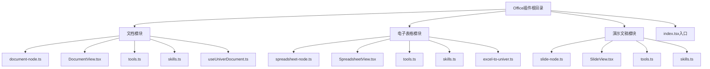
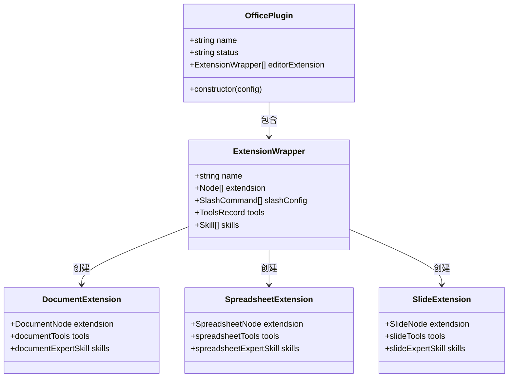
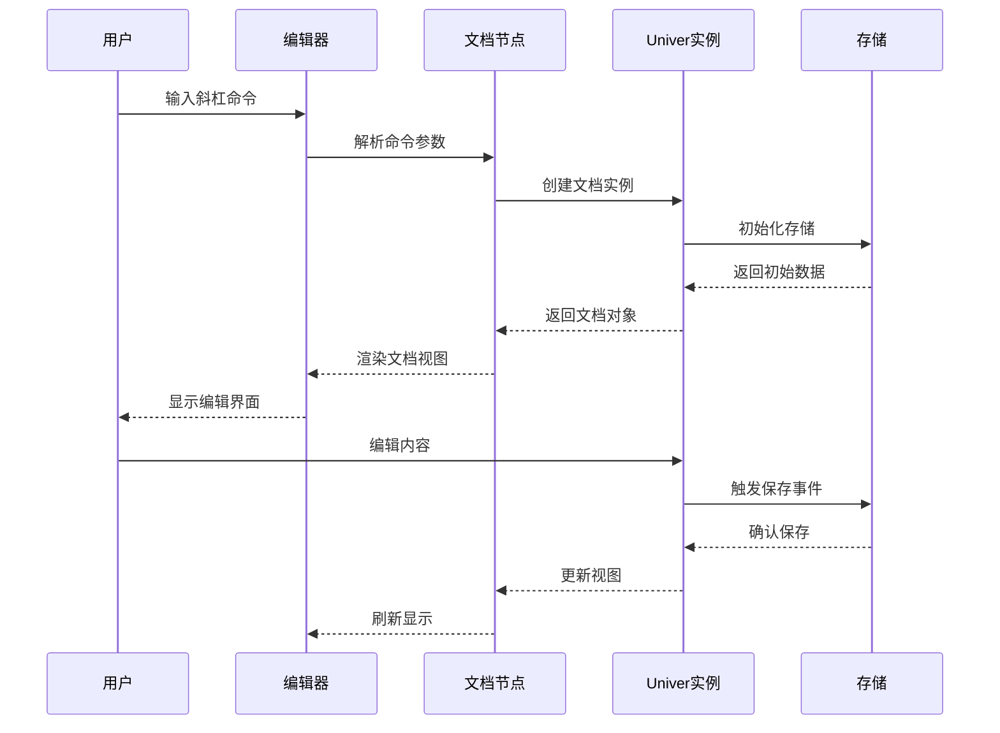
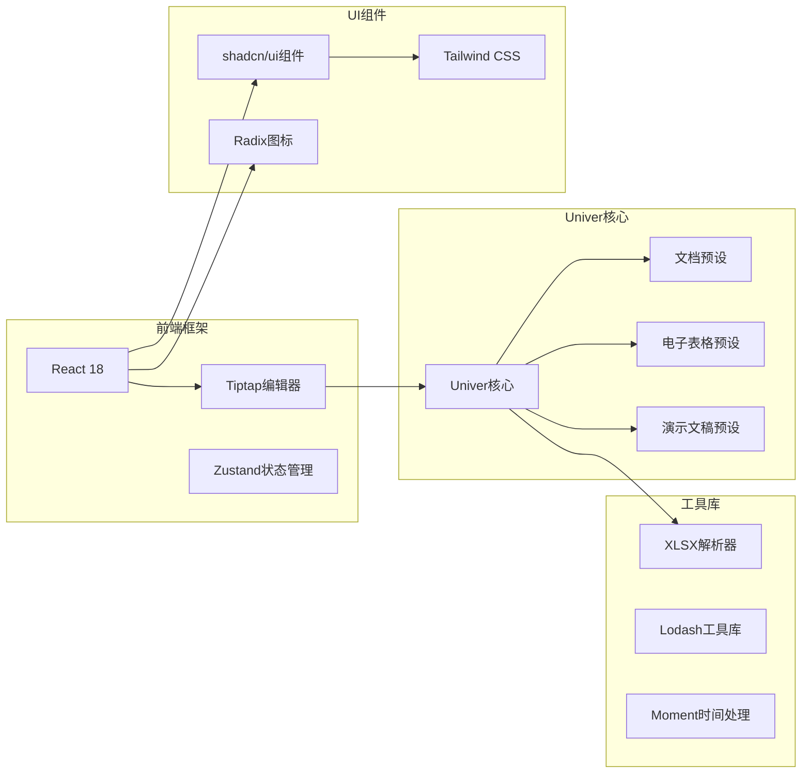
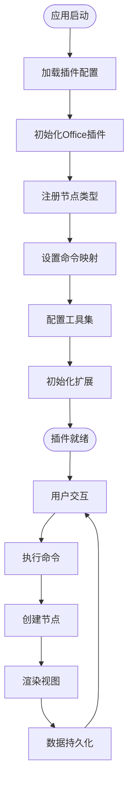
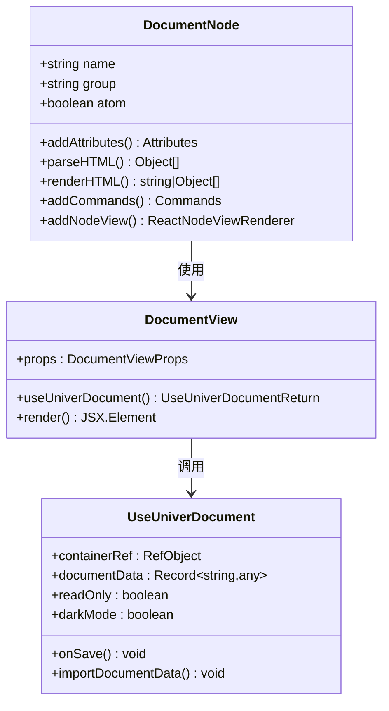
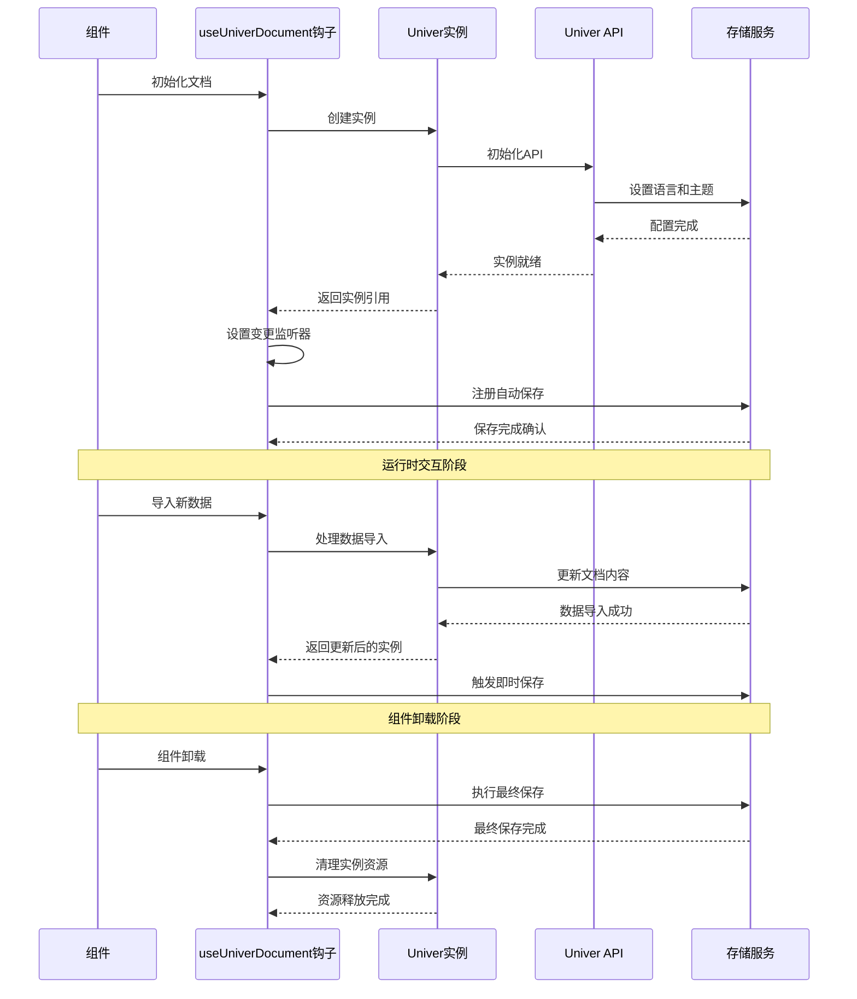
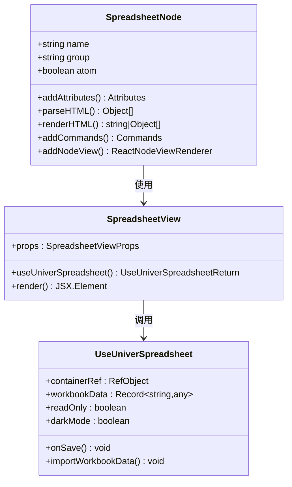
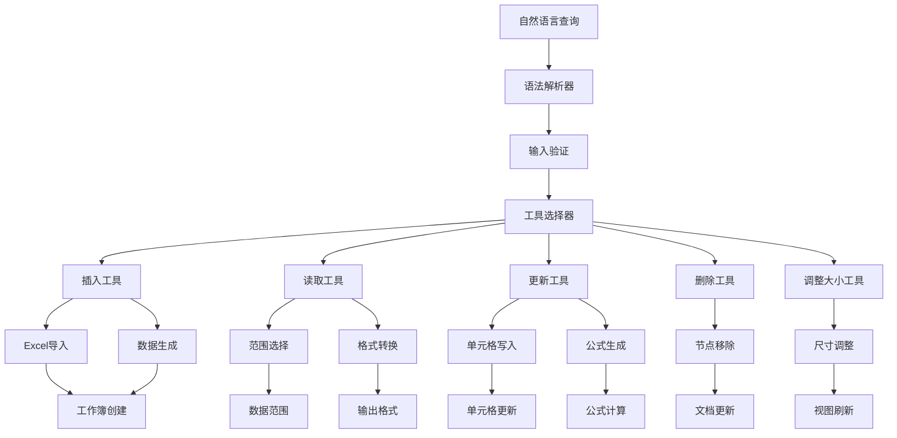
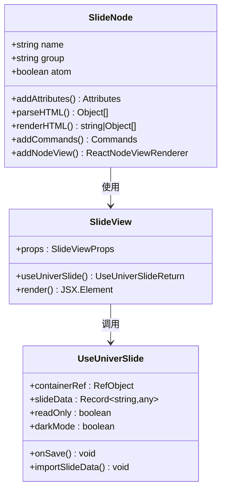

# Office文档集成系统

<cite>
**本文档引用的文件**
- [README.md](file://README.md)
- [package.json](file://package.json)
- [packages/plugin-office/src/index.tsx](file://packages/plugin-office/src/index.tsx)
- [packages/plugin-office/src/document/index.tsx](file://packages/plugin-office/src/document/index.tsx)
- [packages/plugin-office/src/spreadsheet/index.tsx](file://packages/plugin-office/src/spreadsheet/index.tsx)
- [packages/plugin-office/src/slide/index.tsx](file://packages/plugin-office/src/slide/index.tsx)
- [packages/plugin-office/src/document/useUniverDocument.ts](file://packages/plugin-office/src/document/useUniverDocument.ts)
- [packages/plugin-office/src/document/document-node.ts](file://packages/plugin-office/src/document/document-node.ts)
- [packages/plugin-office/src/spreadsheet/spreadsheet-node.ts](file://packages/plugin-office/src/spreadsheet/spreadsheet-node.ts)
- [packages/plugin-office/src/slide/slide-node.ts](file://packages/plugin-office/src/slide/slide-node.ts)
- [packages/plugin-office/src/spreadsheet/tools.ts](file://packages/plugin-office/src/spreadsheet/tools.ts)
- [packages/plugin-office/package.json](file://packages/plugin-office/package.json)
</cite>

## 目录
1. [简介](#简介)
2. [项目结构](#项目结构)
3. [核心组件](#核心组件)
4. [架构概览](#架构概览)
5. [详细组件分析](#详细组件分析)
6. [依赖关系分析](#依赖关系分析)
7. [性能考虑](#性能考虑)
8. [故障排除指南](#故障排除指南)
9. [结论](#结论)

## 简介

Office文档集成系统是Knowledge Repo平台的一个重要插件，专门用于在知识管理应用中集成Microsoft Office兼容的文档处理能力。该系统基于Univer办公套件，提供了三种核心功能：富文本文档编辑、电子表格处理和演示文稿制作。

系统采用现代化的技术栈构建，使用React 18、TypeScript 5、Tiptap富文本编辑器框架和Hocuspocus实时协作后端。通过插件架构设计，用户可以在文档中直接嵌入和编辑各种Office格式的内容，实现真正的"所见即所得"的办公体验。

## 项目结构

### 整体架构布局

```mermaid
graph TB
subgraph "应用层"
ViteApp[Vite主应用]
LandingPage[着陆页面]
DesktopApp[桌面应用]
end
subgraph "核心包"
Core[@kn/core]
Editor[@kn/editor]
Common[@kn/common]
UI[@kn/ui]
end
subgraph "插件系统"
OfficePlugin[Office插件]
AIPlugin[AI插件]
FileManager[文件管理器]
DatabasePlugin[数据库插件]
end
subgraph "Univer集成"
UniverDocs[文档处理]
UniverSheets[电子表格]
UniverSlides[演示文稿]
end
ViteApp --> Core
Core --> OfficePlugin
OfficePlugin --> UniverDocs
OfficePlugin --> UniverSheets
OfficePlugin --> UniverSlides
OfficePlugin --> AIPlugin
OfficePlugin --> FileManager
```

**图表来源**
- [README.md](file://README.md#L66-L97)
- [package.json](file://package.json#L1-L124)

### 插件目录结构

Office插件遵循标准的monorepo组织方式，采用分层架构设计：



**图表来源**
- [packages/plugin-office/src/index.tsx](file://packages/plugin-office/src/index.tsx#L1-L18)

**章节来源**
- [README.md](file://README.md#L66-L97)
- [packages/plugin-office/package.json](file://packages/plugin-office/package.json#L1-L34)

## 核心组件

### Office插件架构

Office插件作为Knowledge Repo的核心扩展，提供了完整的Office文档处理解决方案。插件采用KPlugin基类设计，支持多种编辑器扩展和工具集。



**图表来源**
- [packages/plugin-office/src/index.tsx](file://packages/plugin-office/src/index.tsx#L7-L17)
- [packages/plugin-office/src/document/index.tsx](file://packages/plugin-office/src/document/index.tsx#L8-L39)
- [packages/plugin-office/src/spreadsheet/index.tsx](file://packages/plugin-office/src/spreadsheet/index.tsx#L16-L59)
- [packages/plugin-office/src/slide/index.tsx](file://packages/plugin-office/src/slide/index.tsx#L8-L39)

### 数据流架构

系统采用事件驱动的数据流模式，通过命令模式实现组件间的解耦：



**图表来源**
- [packages/plugin-office/src/document/useUniverDocument.ts](file://packages/plugin-office/src/document/useUniverDocument.ts#L51-L101)
- [packages/plugin-office/src/document/document-node.ts](file://packages/plugin-office/src/document/document-node.ts#L38-L50)

**章节来源**
- [packages/plugin-office/src/index.tsx](file://packages/plugin-office/src/index.tsx#L1-L18)
- [packages/plugin-office/src/document/index.tsx](file://packages/plugin-office/src/document/index.tsx#L1-L39)

## 架构概览

### 技术栈集成

Office插件集成了多个技术组件，形成了完整的文档处理生态系统：



**图表来源**
- [packages/plugin-office/package.json](file://packages/plugin-office/package.json#L14-L26)
- [README.md](file://README.md#L43-L65)

### 插件加载流程

系统采用动态插件加载机制，确保运行时的灵活性和可扩展性：



**图表来源**
- [packages/plugin-office/src/index.tsx](file://packages/plugin-office/src/index.tsx#L10-L17)

**章节来源**
- [README.md](file://README.md#L43-L65)
- [packages/plugin-office/package.json](file://packages/plugin-office/package.json#L1-L34)

## 详细组件分析

### 文档处理模块

#### DocumentNode节点实现

DocumentNode是Office插件中最复杂的组件之一，负责处理富文本文档的创建、编辑和渲染：



**图表来源**
- [packages/plugin-office/src/document/document-node.ts](file://packages/plugin-office/src/document/document-node.ts#L14-L58)
- [packages/plugin-office/src/document/useUniverDocument.ts](file://packages/plugin-office/src/document/useUniverDocument.ts#L22-L199)

#### 文档生命周期管理

文档组件实现了完整的生命周期管理，包括初始化、数据导入、自动保存和清理：



**图表来源**
- [packages/plugin-office/src/document/useUniverDocument.ts](file://packages/plugin-office/src/document/useUniverDocument.ts#L51-L134)
- [packages/plugin-office/src/document/useUniverDocument.ts](file://packages/plugin-office/src/document/useUniverDocument.ts#L144-L196)

**章节来源**
- [packages/plugin-office/src/document/document-node.ts](file://packages/plugin-office/src/document/document-node.ts#L1-L58)
- [packages/plugin-office/src/document/useUniverDocument.ts](file://packages/plugin-office/src/document/useUniverDocument.ts#L1-L199)

### 电子表格处理模块

#### SpreadsheetNode节点设计

SpreadsheetNode提供了强大的电子表格功能，支持复杂的数据操作和格式化：



**图表来源**
- [packages/plugin-office/src/spreadsheet/spreadsheet-node.ts](file://packages/plugin-office/src/spreadsheet/spreadsheet-node.ts#L14-L59)

#### AI智能工具集

电子表格模块集成了丰富的AI工具，支持自然语言到表格操作的转换：



**图表来源**
- [packages/plugin-office/src/spreadsheet/tools.ts](file://packages/plugin-office/src/spreadsheet/tools.ts#L84-L166)
- [packages/plugin-office/src/spreadsheet/tools.ts](file://packages/plugin-office/src/spreadsheet/tools.ts#L197-L284)

**章节来源**
- [packages/plugin-office/src/spreadsheet/spreadsheet-node.ts](file://packages/plugin-office/src/spreadsheet/spreadsheet-node.ts#L1-L59)
- [packages/plugin-office/src/spreadsheet/tools.ts](file://packages/plugin-office/src/spreadsheet/tools.ts#L1-L453)

### 演示文稿处理模块

#### SlideNode节点实现

SlideNode提供了专业的演示文稿编辑功能，支持多种动画效果和布局选项：



**图表来源**
- [packages/plugin-office/src/slide/slide-node.ts](file://packages/plugin-office/src/slide/slide-node.ts#L14-L58)

**章节来源**
- [packages/plugin-office/src/slide/slide-node.ts](file://packages/plugin-office/src/slide/slide-node.ts#L1-L58)

## 依赖关系分析

### 外部依赖管理

Office插件的依赖关系体现了现代前端开发的最佳实践：

```mermaid
graph TB
subgraph "核心依赖"
UniverJS[UniverJS 0.16.1]
Tiptap[Tiptap编辑器]
React[React 18.3.1]
TypeScript[TypeScript 5]
end
subgraph "Univer子包"
PresetDocs[@univerjs/presets]
PresetSheetsCore[@univerjs/preset-sheets-core]
PresetDocsCore[@univerjs/preset-docs-core]
Slides[@univerjs/slides]
SlidesUI[@univerjs/slides-ui]
end
subgraph "工具库"
XLSX[xlsx 0.18.5]
Lodash[lodash 4.17.21]
UUID[uuid 10.0.0]
end
subgraph "UI组件"
ShadcnUI[@kn/ui]
Icon[@kn/icon]
TailwindCSS[tailwindcss 3.4.17]
end
UniverJS --> PresetDocs
UniverJS --> PresetSheetsCore
UniverJS --> PresetDocsCore
UniverJS --> Slides
UniverJS --> SlidesUI
Tiptap --> React
Tiptap --> TypeScript
XLSX --> UniverJS
Lodash --> UniverJS
UUID --> UniverJS
ShadcnUI --> TailwindCSS
Icon --> ShadcnUI
```

**图表来源**
- [packages/plugin-office/package.json](file://packages/plugin-office/package.json#L14-L26)

### 内部模块依赖

系统内部采用了清晰的模块化设计，各模块间保持低耦合高内聚：

```mermaid
graph TD
OfficePlugin[Office插件] --> Common[@kn/common]
OfficePlugin --> Core[@kn/core]
OfficePlugin --> Editor[@kn/editor]
OfficePlugin --> UI[@kn/ui]
OfficePlugin --> Icon[@kn/icon]
DocumentModule[文档模块] --> OfficePlugin
SpreadsheetModule[电子表格模块] --> OfficePlugin
SlideModule[演示文稿模块] --> OfficePlugin
DocumentModule --> DocumentNode[DocumentNode]
DocumentModule --> DocumentView[DocumentView]
DocumentModule --> DocumentTools[tools.ts]
SpreadsheetModule --> SpreadsheetNode[SpreadsheetNode]
SpreadsheetModule --> SpreadsheetView[SpreadsheetView]
SpreadsheetModule --> SpreadsheetTools[tools.ts]
SpreadsheetModule --> ExcelParser[excel-to-univer.ts]
SlideModule --> SlideNode[SlideNode]
SlideModule --> SlideView[SlideView]
SlideModule --> SlideTools[tools.ts]
```

**图表来源**
- [packages/plugin-office/src/index.tsx](file://packages/plugin-office/src/index.tsx#L1-L6)

**章节来源**
- [packages/plugin-office/package.json](file://packages/plugin-office/package.json#L14-L26)
- [packages/plugin-office/src/index.tsx](file://packages/plugin-office/src/index.tsx#L1-L6)

## 性能考虑

### 内存管理策略

Office插件实现了精细的内存管理机制，确保长时间使用下的稳定性：

1. **懒加载机制**：文档实例仅在需要时创建，避免不必要的内存占用
2. **自动清理**：组件卸载时自动释放Univer实例和相关资源
3. **变更节流**：保存操作采用防抖机制，减少频繁的I/O操作
4. **增量更新**：只更新发生变化的部分，避免全量重绘

### 渲染优化

系统采用了多种渲染优化技术：

1. **虚拟滚动**：对于大型表格采用虚拟滚动技术，只渲染可见区域
2. **组件缓存**：对不经常变化的组件进行缓存，减少重新渲染
3. **异步加载**：大文件导入采用异步处理，避免阻塞主线程
4. **增量同步**：与服务器的同步采用增量更新，减少网络传输

### 数据持久化

采用多层数据持久化策略：

1. **本地缓存**：使用浏览器localStorage缓存最近使用的文档
2. **增量保存**：只保存发生变化的数据，减少存储压力
3. **版本控制**：支持文档版本管理和回滚功能
4. **离线支持**：提供基本的离线编辑能力

## 故障排除指南

### 常见问题诊断

#### 文档加载失败

当遇到文档无法加载的问题时，可以按照以下步骤排查：

1. **检查网络连接**：确保能够正常访问Univer服务
2. **验证权限设置**：确认用户具有访问文档的权限
3. **查看浏览器控制台**：检查是否有JavaScript错误
4. **清理浏览器缓存**：清除可能损坏的缓存数据

#### 性能问题解决

如果系统运行缓慢，建议：

1. **监控内存使用**：检查是否存在内存泄漏
2. **优化文档大小**：减少单个文档的复杂度
3. **禁用不必要的插件**：暂时禁用影响性能的插件
4. **升级硬件配置**：考虑增加内存或使用更快的CPU

#### 数据同步问题

当出现数据不同步时：

1. **检查服务器状态**：确认协作服务器正常运行
2. **验证网络延迟**：检查客户端与服务器的网络状况
3. **重启协作服务**：尝试重启Hocuspocus服务器
4. **清理会话数据**：清除可能损坏的会话信息

**章节来源**
- [packages/plugin-office/src/document/useUniverDocument.ts](file://packages/plugin-office/src/document/useUniverDocument.ts#L45-L47)
- [packages/plugin-office/src/document/useUniverDocument.ts](file://packages/plugin-office/src/document/useUniverDocument.ts#L80-L87)

## 结论

Office文档集成系统是一个功能完整、架构清晰的现代化文档处理解决方案。通过深度集成Univer办公套件，系统成功地将传统的Office功能移植到了Web环境中，为用户提供了无缝的跨平台文档编辑体验。

### 主要优势

1. **技术先进性**：采用最新的前端技术和设计理念
2. **功能完整性**：涵盖了文档、电子表格、演示文稿三大核心场景
3. **扩展性强**：基于插件架构，易于功能扩展和定制
4. **用户体验佳**：提供接近原生Office的使用体验
5. **性能优异**：经过精心优化，支持大规模文档处理

### 发展前景

随着远程办公和在线协作需求的增长，Office文档集成系统具有广阔的发展空间。未来可以进一步增强的功能包括：

1. **AI智能辅助**：集成更强大的AI功能，提供智能内容生成和编辑建议
2. **移动端适配**：优化移动设备上的使用体验
3. **云端集成**：与主流云存储服务深度集成
4. **实时协作增强**：改进多人协作的性能和稳定性
5. **格式兼容性**：支持更多文件格式的导入导出

该系统为Knowledge Repo平台提供了强大的文档处理能力，是构建现代知识管理生态系统的重要基础设施。