# 插件 Bitable 文档

<cite>
**本文档引用的文件**
- [packages/plugin-bitable/src/index.tsx](file://packages/plugin-bitable/src/index.tsx)
- [packages/plugin-bitable/src/bitable/index.tsx](file://packages/plugin-bitable/src/bitable/index.tsx)
- [packages/plugin-bitable/src/bitable/bitable-node.ts](file://packages/plugin-bitable/src/bitable/bitable-node.ts)
- [packages/plugin-bitable/src/bitable/BitableView.tsx](file://packages/plugin-bitable/src/bitable/BitableView.tsx)
- [packages/plugin-bitable/src/bitable/views/TableView.tsx](file://packages/plugin-bitable/src/bitable/views/TableView.tsx)
- [packages/plugin-bitable/src/bitable/views/KanbanView.tsx](file://packages/plugin-bitable/src/bitable/views/KanbanView.tsx)
- [packages/plugin-bitable/src/bitable/views/CalendarView.tsx](file://packages/plugin-bitable/src/bitable/views/CalendarView.tsx)
- [packages/plugin-bitable/src/bitable/views/ChartView.tsx](file://packages/plugin-bitable/src/bitable/views/ChartView.tsx)
- [packages/plugin-bitable/src/types/index.ts](file://packages/plugin-bitable/src/types/index.ts)
- [packages/plugin-bitable/src/utils/dataProcessing.ts](file://packages/plugin-bitable/src/utils/dataProcessing.ts)
- [packages/plugin-bitable/package.json](file://packages/plugin-bitable/package.json)
</cite>

## 目录
1. [简介](#简介)
2. [项目结构](#项目结构)
3. [核心组件](#核心组件)
4. [架构概览](#架构概览)
5. [详细组件分析](#详细组件分析)
6. [依赖关系分析](#依赖关系分析)
7. [性能考虑](#性能考虑)
8. [故障排除指南](#故障排除指南)
9. [结论](#结论)

## 简介

Bitable 是一个功能强大的多维表格插件，类似于飞书多维表格，为知识仓库系统提供了丰富的数据管理和可视化能力。该插件基于 React 和 TypeScript 构建，集成了多种视图模式、数据处理功能和用户交互组件。

主要特性包括：
- 多种视图模式：表格、看板、画廊、日历、时间线/甘特图、图表视图
- 丰富的字段类型：文本、数字、选择、日期、复选框、人员、附件等
- 实时数据处理：过滤、排序、分组
- Excel 导入导出功能
- 响应式设计和主题支持
- AI 辅助功能集成

## 项目结构

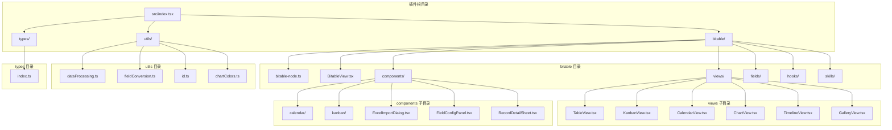

**图表来源**
- [packages/plugin-bitable/src/index.tsx:1-699](file://packages/plugin-bitable/src/index.tsx#L1-L699)
- [packages/plugin-bitable/src/bitable/index.tsx:1-32](file://packages/plugin-bitable/src/bitable/index.tsx#L1-L32)

**章节来源**
- [packages/plugin-bitable/src/index.tsx:1-699](file://packages/plugin-bitable/src/index.tsx#L1-L699)
- [packages/plugin-bitable/package.json:1-39](file://packages/plugin-bitable/package.json#L1-L39)

## 核心组件

### 插件入口点

插件的主要入口点位于 `src/index.tsx`，它定义了完整的插件配置和国际化支持：

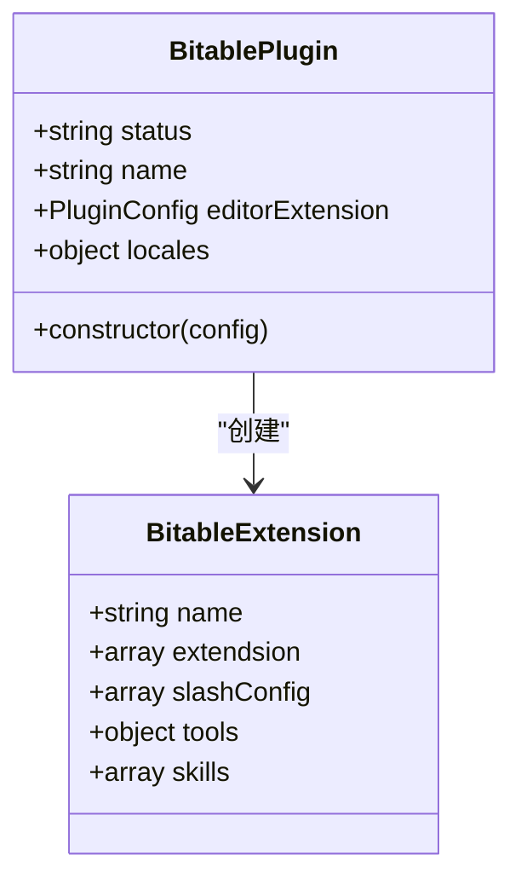

**图表来源**
- [packages/plugin-bitable/src/index.tsx:4-8](file://packages/plugin-bitable/src/index.tsx#L4-L8)
- [packages/plugin-bitable/src/bitable/index.tsx:8-31](file://packages/plugin-bitable/src/bitable/index.tsx#L8-L31)

### 数据模型

插件使用强类型的数据模型来确保数据的一致性和完整性：

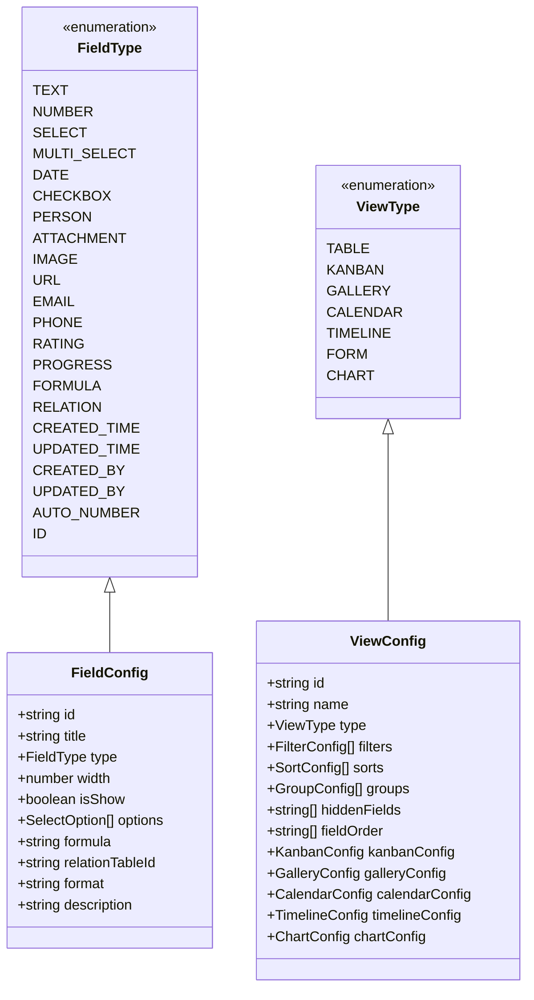

**图表来源**
- [packages/plugin-bitable/src/types/index.ts:4-27](file://packages/plugin-bitable/src/types/index.ts#L4-L27)
- [packages/plugin-bitable/src/types/index.ts:29-38](file://packages/plugin-bitable/src/types/index.ts#L29-L38)
- [packages/plugin-bitable/src/types/index.ts:54-66](file://packages/plugin-bitable/src/types/index.ts#L54-L66)
- [packages/plugin-bitable/src/types/index.ts:93-168](file://packages/plugin-bitable/src/types/index.ts#L93-L168)

**章节来源**
- [packages/plugin-bitable/src/types/index.ts:1-233](file://packages/plugin-bitable/src/types/index.ts#L1-L233)

## 架构概览

Bitable 采用模块化的架构设计，将不同的功能组件分离到独立的文件中，便于维护和扩展：

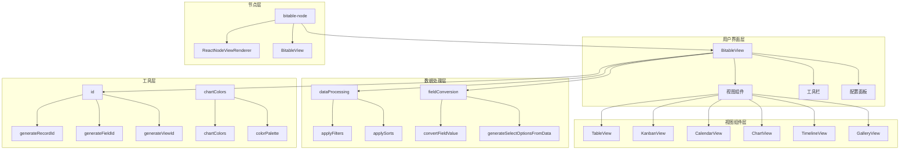

**图表来源**
- [packages/plugin-bitable/src/bitable/BitableView.tsx:1-845](file://packages/plugin-bitable/src/bitable/BitableView.tsx#L1-L845)
- [packages/plugin-bitable/src/bitable/bitable-node.ts:1-232](file://packages/plugin-bitable/src/bitable/bitable-node.ts#L1-L232)
- [packages/plugin-bitable/src/utils/dataProcessing.ts:1-101](file://packages/plugin-bitable/src/utils/dataProcessing.ts#L1-L101)

## 详细组件分析

### 表格视图组件

TableView 组件是 Bitable 的核心组件之一，提供了类似电子表格的功能：

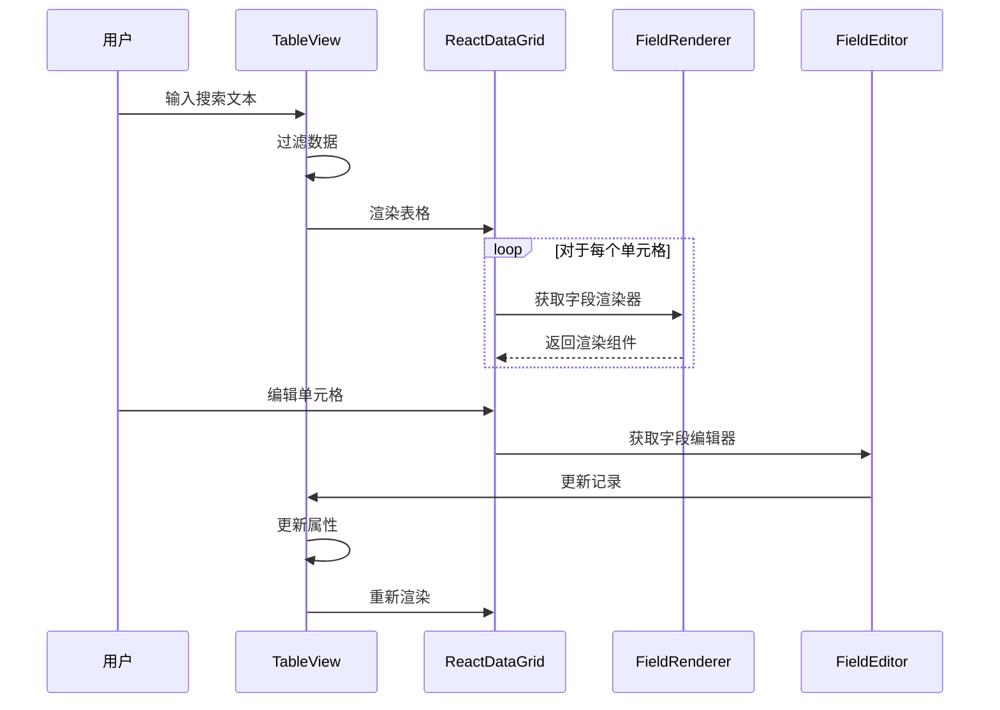

**图表来源**
- [packages/plugin-bitable/src/bitable/views/TableView.tsx:91-388](file://packages/plugin-bitable/src/bitable/views/TableView.tsx#L91-L388)

TableView 的关键特性包括：
- 支持 500+ 行数据的虚拟滚动
- 实时搜索和过滤功能
- 多种字段类型的渲染和编辑
- 响应式设计和深色模式支持

**章节来源**
- [packages/plugin-bitable/src/bitable/views/TableView.tsx:1-388](file://packages/plugin-bitable/src/bitable/views/TableView.tsx#L1-L388)

### 看板视图组件

KanbanView 组件实现了拖拽式看板功能：

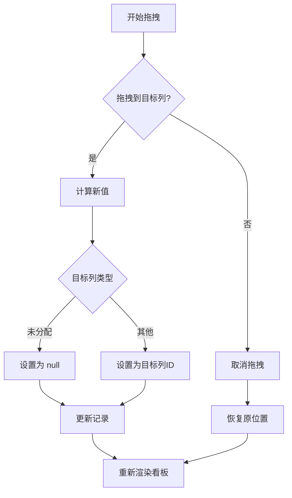

**图表来源**
- [packages/plugin-bitable/src/bitable/views/KanbanView.tsx:26-172](file://packages/plugin-bitable/src/bitable/views/KanbanView.tsx#L26-L172)

**章节来源**
- [packages/plugin-bitable/src/bitable/views/KanbanView.tsx:1-172](file://packages/plugin-bitable/src/bitable/views/KanbanView.tsx#L1-L172)

### 日历视图组件

CalendarView 组件提供了完整的日历功能：

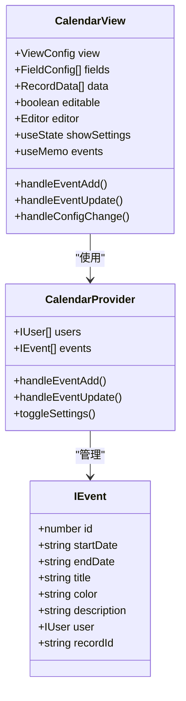

**图表来源**
- [packages/plugin-bitable/src/bitable/views/CalendarView.tsx:36-372](file://packages/plugin-bitable/src/bitable/views/CalendarView.tsx#L36-L372)

**章节来源**
- [packages/plugin-bitable/src/bitable/views/CalendarView.tsx:1-372](file://packages/plugin-bitable/src/bitable/views/CalendarView.tsx#L1-L372)

### 图表视图组件

ChartView 组件支持多种图表类型的可视化：

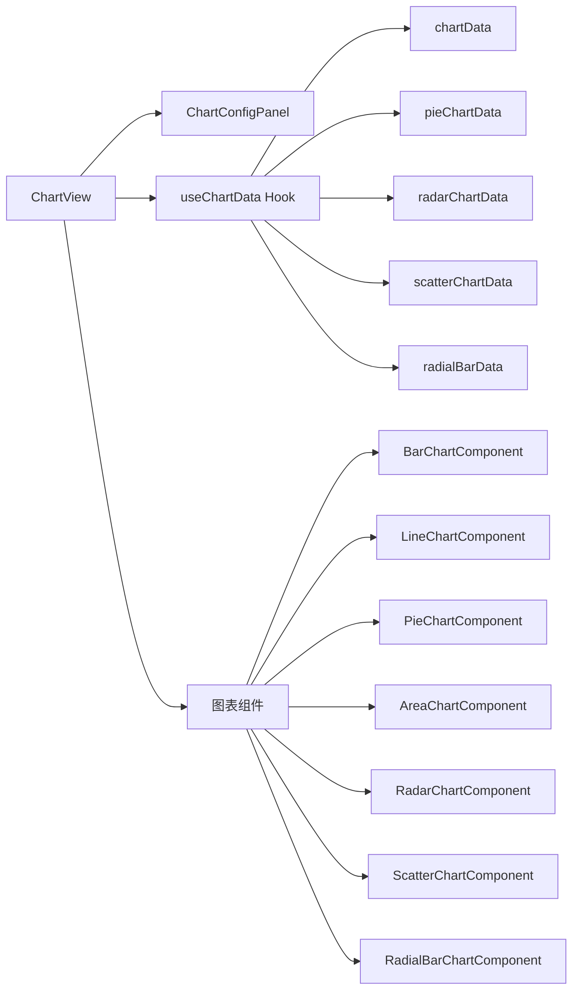

**图表来源**
- [packages/plugin-bitable/src/bitable/views/ChartView.tsx:40-358](file://packages/plugin-bitable/src/bitable/views/ChartView.tsx#L40-L358)

**章节来源**
- [packages/plugin-bitable/src/bitable/views/ChartView.tsx:1-358](file://packages/plugin-bitable/src/bitable/views/ChartView.tsx#L1-L358)

### 主视图组件

BitableView 是整个插件的核心容器组件，协调各个子组件的工作：

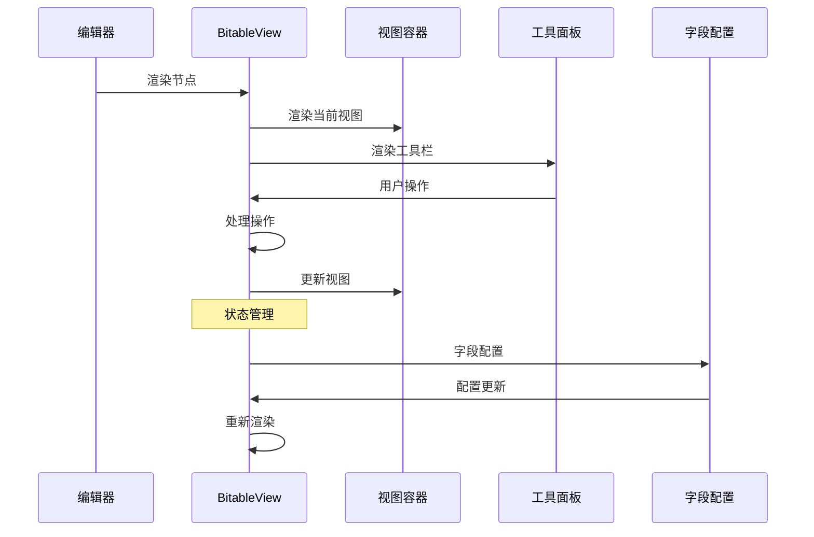

**图表来源**
- [packages/plugin-bitable/src/bitable/BitableView.tsx:61-845](file://packages/plugin-bitable/src/bitable/BitableView.tsx#L61-L845)

**章节来源**
- [packages/plugin-bitable/src/bitable/BitableView.tsx:1-845](file://packages/plugin-bitable/src/bitable/BitableView.tsx#L1-L845)

## 依赖关系分析

### 外部依赖

Bitable 插件依赖以下主要外部库：

```mermaid
graph TB
subgraph "UI 组件库"
A[@kn/ui] --> B[Button]
A --> C[Input]
A --> D[Card]
A --> E[Badge]
end
subgraph "编辑器框架"
F[@kn/editor] --> G[NodeViewProps]
F --> H[ReactNodeViewRenderer]
end
subgraph "图标库"
I[@kn/icon] --> J[Table2]
I --> K[Calendar]
I --> L[Settings]
end
subgraph "数据处理"
M[react-data-grid] --> N[DataGrid]
M --> O[SelectColumn]
P[lodash] --> Q[通用工具函数]
R[date-fns] --> S[日期处理]
end
subgraph "拖拽功能"
T[react-beautiful-dnd] --> U[Draggable]
T --> V[Droppable]
W[react-dnd] --> X[HTML5Backend]
end
subgraph "图表库"
Y[recharts] --> Z[BarChart]
Y --> AA[LineChart]
Y --> AB[PieChart]
end
subgraph "文件处理"
AC[xlsx] --> AD[Excel解析]
end
```

**图表来源**
- [packages/plugin-bitable/package.json:15-29](file://packages/plugin-bitable/package.json#L15-L29)

### 内部模块依赖

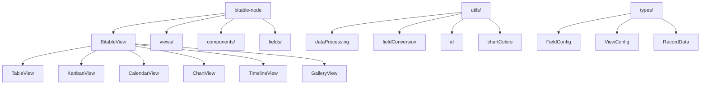

**图表来源**
- [packages/plugin-bitable/src/bitable/bitable-node.ts:1-232](file://packages/plugin-bitable/src/bitable/bitable-node.ts#L1-L232)
- [packages/plugin-bitable/src/bitable/BitableView.tsx:46-51](file://packages/plugin-bitable/src/bitable/BitableView.tsx#L46-L51)

**章节来源**
- [packages/plugin-bitable/package.json:1-39](file://packages/plugin-bitable/package.json#L1-L39)

## 性能考虑

### 虚拟滚动优化

TableView 实现了虚拟滚动来处理大量数据：

- **阈值设置**：当数据量超过 500 行时启用虚拟滚动
- **高度计算**：动态计算表格高度，避免不必要的重排
- **内存管理**：只渲染可见区域内的行，减少 DOM 节点数量

### 数据处理优化

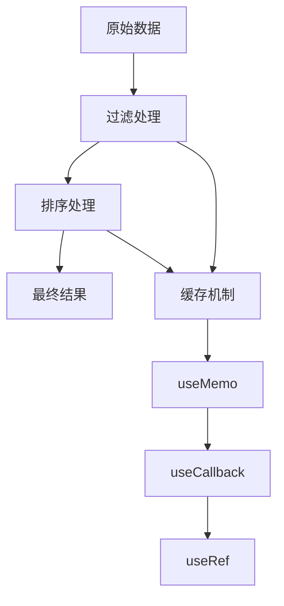

### 组件渲染优化

- **状态分离**：将频繁变化的状态与静态状态分离
- **条件渲染**：根据编辑器状态决定是否渲染某些功能
- **懒加载**：按需加载视图组件和配置面板

## 故障排除指南

### 常见问题及解决方案

1. **视图切换问题**
   - 检查 `currentView` 属性是否正确更新
   - 确认视图 ID 生成逻辑正常工作

2. **数据同步问题**
   - 验证 `updateAttributes` 函数调用时机
   - 检查数据更新的防抖处理

3. **字段类型转换错误**
   - 确认 `convertFieldValue` 函数的实现
   - 验证字段选项的生成逻辑

4. **Excel 导入失败**
   - 检查文件格式验证
   - 确认字段映射逻辑

**章节来源**
- [packages/plugin-bitable/src/bitable/BitableView.tsx:137-297](file://packages/plugin-bitable/src/bitable/BitableView.tsx#L137-L297)
- [packages/plugin-bitable/src/utils/dataProcessing.ts:1-101](file://packages/plugin-bitable/src/utils/dataProcessing.ts#L1-L101)

## 结论

Bitable 插件是一个功能完整、架构清晰的多维表格解决方案。它成功地将复杂的数据管理功能封装在易于使用的界面中，同时保持了良好的性能和可扩展性。

主要优势包括：
- **模块化设计**：清晰的组件分离便于维护和扩展
- **丰富的功能**：支持多种视图模式和数据处理功能
- **良好的用户体验**：响应式设计和直观的操作界面
- **强大的数据处理**：高效的过滤、排序和分组功能
- **完善的类型系统**：基于 TypeScript 的强类型支持

未来可以考虑的改进方向：
- 增加更多图表类型和可视化选项
- 优化大数据量场景下的性能表现
- 扩展 AI 功能集成
- 增强移动端适配能力