# 插件 Bitable

<cite>
**本文档引用的文件**
- [packages/plugin-bitable/src/index.tsx](file://packages/plugin-bitable/src/index.tsx)
- [packages/plugin-bitable/src/bitable/index.tsx](file://packages/plugin-bitable/src/bitable/index.tsx)
- [packages/plugin-bitable/src/bitable/bitable-node.ts](file://packages/plugin-bitable/src/bitable/bitable-node.ts)
- [packages/plugin-bitable/src/bitable/BitableView.tsx](file://packages/plugin-bitable/src/bitable/BitableView.tsx)
- [packages/plugin-bitable/src/bitable/views/TableView.tsx](file://packages/plugin-bitable/src/bitable/views/TableView.tsx)
- [packages/plugin-bitable/src/bitable/views/KanbanView.tsx](file://packages/plugin-bitable/src/bitable/views/KanbanView.tsx)
- [packages/plugin-bitable/src/bitable/views/GalleryView.tsx](file://packages/plugin-bitable/src/bitable/views/GalleryView.tsx)
- [packages/plugin-bitable/src/bitable/views/TimelineView.tsx](file://packages/plugin-bitable/src/bitable/views/TimelineView.tsx)
- [packages/plugin-bitable/src/bitable/views/CalendarView.tsx](file://packages/plugin-bitable/src/bitable/views/CalendarView.tsx)
- [packages/plugin-bitable/src/bitable/views/ChartView.tsx](file://packages/plugin-bitable/src/bitable/views/ChartView.tsx)
- [packages/plugin-bitable/src/bitable/fields/FieldRenderers.tsx](file://packages/plugin-bitable/src/bitable/fields/FieldRenderers.tsx)
- [packages/plugin-bitable/src/bitable/bitable-tools.ts](file://packages/plugin-bitable/src/bitable/bitable-tools.ts)
- [packages/plugin-bitable/src/types/index.ts](file://packages/plugin-bitable/src/types/index.ts)
- [packages/plugin-bitable/src/utils/id.ts](file://packages/plugin-bitable/src/utils/id.ts)
- [packages/plugin-bitable/package.json](file://packages/plugin-bitable/package.json)
- [packages/plugin-bitable/README.md](file://packages/plugin-bitable/README.md)
</cite>

## 更新摘要
**所做更改**
- 新增多维表格视图类型：甘特图视图、日历视图、图表视图
- 更新默认视图配置，包含表格、看板、画廊、甘特图、图表五种视图
- 新增甘特图视图组件，支持任务拖拽、时间轴缩放、里程碑标记
- 新增日历视图组件，支持多视图模式和事件管理
- 新增图表视图组件，支持多种图表类型和配置面板
- 更新视图类型枚举，新增 TIMELINE、CALENDAR、FORM、CHART 类型
- 完善视图配置类型定义，支持各视图特有的配置参数

## 目录
1. [简介](#简介)
2. [项目结构](#项目结构)
3. [核心组件](#核心组件)
4. [架构总览](#架构总览)
5. [详细组件分析](#详细组件分析)
6. [依赖关系分析](#依赖关系分析)
7. [性能考量](#性能考量)
8. [故障排查指南](#故障排查指南)
9. [结论](#结论)
10. [附录](#附录)

## 简介
Plugin Bitable 是一个强大多维表格插件，参考飞书多维表格设计，提供多种视图类型与丰富的字段类型，支持在富文本编辑器中插入、编辑与展示结构化数据。插件内置表格视图、看板视图、画廊视图、甘特图视图、日历视图、图表视图，并提供字段配置、筛选、排序、搜索、Excel 导入等能力，同时为 AI Agent 提供工具接口，便于自动化数据管理。

## 项目结构
插件位于 packages/plugin-bitable 目录，采用模块化组织：
- bitable/：核心节点与视图实现
  - bitable-node.ts：定义 Bitable 节点、默认字段与视图配置
  - BitableView.tsx：主视图容器与工具栏、视图切换、数据处理
  - views/：各视图实现（TableView、KanbanView、GalleryView、TimelineView、CalendarView、ChartView 等）
  - fields/：字段渲染器与编辑器
  - charts/：图表组件（BarChartComponent、LineChartComponent 等）
  - components/：通用组件（FieldConfigPanel、ExcelImportDialog 等）
  - bitable-tools.ts：面向 AI Agent 的工具集合
- types/：类型定义（字段、视图、过滤、排序等）
- utils/：工具函数（ID 生成、数据处理、字段转换等）
- index.tsx：插件入口与国际化配置

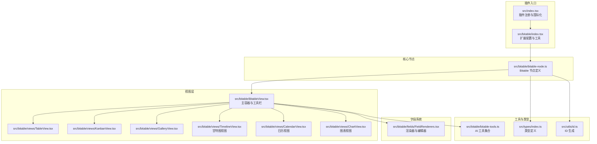

**图表来源**
- [packages/plugin-bitable/src/index.tsx:1-699](file://packages/plugin-bitable/src/index.tsx#L1-L699)
- [packages/plugin-bitable/src/bitable/index.tsx:1-30](file://packages/plugin-bitable/src/bitable/index.tsx#L1-L30)
- [packages/plugin-bitable/src/bitable/bitable-node.ts:1-232](file://packages/plugin-bitable/src/bitable/bitable-node.ts#L1-L232)
- [packages/plugin-bitable/src/bitable/BitableView.tsx:1-845](file://packages/plugin-bitable/src/bitable/BitableView.tsx#L1-L845)
- [packages/plugin-bitable/src/bitable/views/TableView.tsx:1-385](file://packages/plugin-bitable/src/bitable/views/TableView.tsx#L1-L385)
- [packages/plugin-bitable/src/bitable/views/KanbanView.tsx:1-172](file://packages/plugin-bitable/src/bitable/views/KanbanView.tsx#L1-L172)
- [packages/plugin-bitable/src/bitable/views/GalleryView.tsx:1-261](file://packages/plugin-bitable/src/bitable/views/GalleryView.tsx#L1-L261)
- [packages/plugin-bitable/src/bitable/views/TimelineView.tsx:1-1039](file://packages/plugin-bitable/src/bitable/views/TimelineView.tsx#L1-L1039)
- [packages/plugin-bitable/src/bitable/views/CalendarView.tsx:1-372](file://packages/plugin-bitable/src/bitable/views/CalendarView.tsx#L1-L372)
- [packages/plugin-bitable/src/bitable/views/ChartView.tsx:1-358](file://packages/plugin-bitable/src/bitable/views/ChartView.tsx#L1-L358)
- [packages/plugin-bitable/src/bitable/fields/FieldRenderers.tsx:1-818](file://packages/plugin-bitable/src/bitable/fields/FieldRenderers.tsx#L1-L818)
- [packages/plugin-bitable/src/bitable/bitable-tools.ts:1-1202](file://packages/plugin-bitable/src/bitable/bitable-tools.ts#L1-L1202)
- [packages/plugin-bitable/src/types/index.ts:1-233](file://packages/plugin-bitable/src/types/index.ts#L1-L233)
- [packages/plugin-bitable/src/utils/id.ts:1-46](file://packages/plugin-bitable/src/utils/id.ts#L1-L46)

**章节来源**
- [packages/plugin-bitable/README.md:1-194](file://packages/plugin-bitable/README.md#L1-L194)
- [packages/plugin-bitable/package.json:1-39](file://packages/plugin-bitable/package.json#L1-L39)

## 核心组件
- Bitable 节点：定义字段、视图、当前视图与数据的默认值，提供插入命令与 React 节点视图渲染。
- BitableView 主容器：负责视图标签页、工具栏、搜索、字段配置面板、Excel 导入对话框、记录增删改、视图增删改与重命名。
- 视图组件：TableView（表格）、KanbanView（看板）、GalleryView（画廊）、TimelineView（甘特图）、CalendarView（日历）、ChartView（图表）等，按当前视图类型渲染。
- 字段系统：统一的渲染器与编辑器工厂，支持文本、数字、日期、单选/多选、进度、评分、URL、邮箱、电话、图片、ID 等字段类型。
- AI 工具：提供查询、插入、记录增删改、字段管理等工具，支持按标题或 ID 操作。

**章节来源**
- [packages/plugin-bitable/src/bitable/bitable-node.ts:174-232](file://packages/plugin-bitable/src/bitable/bitable-node.ts#L174-L232)
- [packages/plugin-bitable/src/bitable/BitableView.tsx:61-845](file://packages/plugin-bitable/src/bitable/BitableView.tsx#L61-L845)
- [packages/plugin-bitable/src/bitable/views/TableView.tsx:91-385](file://packages/plugin-bitable/src/bitable/views/TableView.tsx#L91-L385)
- [packages/plugin-bitable/src/bitable/views/KanbanView.tsx:26-172](file://packages/plugin-bitable/src/bitable/views/KanbanView.tsx#L26-L172)
- [packages/plugin-bitable/src/bitable/views/GalleryView.tsx:186-261](file://packages/plugin-bitable/src/bitable/views/GalleryView.tsx#L186-L261)
- [packages/plugin-bitable/src/bitable/views/TimelineView.tsx:40-1039](file://packages/plugin-bitable/src/bitable/views/TimelineView.tsx#L40-L1039)
- [packages/plugin-bitable/src/bitable/views/CalendarView.tsx:36-372](file://packages/plugin-bitable/src/bitable/views/CalendarView.tsx#L36-L372)
- [packages/plugin-bitable/src/bitable/views/ChartView.tsx:40-358](file://packages/plugin-bitable/src/bitable/views/ChartView.tsx#L40-L358)
- [packages/plugin-bitable/src/bitable/fields/FieldRenderers.tsx:744-818](file://packages/plugin-bitable/src/bitable/fields/FieldRenderers.tsx#L744-L818)
- [packages/plugin-bitable/src/bitable/bitable-tools.ts:107-1202](file://packages/plugin-bitable/src/bitable/bitable-tools.ts#L107-L1202)

## 架构总览
插件采用"节点 + 视图 + 组件 + 工具"的分层架构：
- 节点层：定义 Bitable 节点及其属性，提供插入命令与 React 渲染。
- 视图层：BitableView 作为容器，协调工具栏、视图切换、数据处理与子视图渲染。
- 组件层：各视图组件与字段渲染器/编辑器，负责具体 UI 与交互。
- 工具层：面向 AI Agent 的工具集合，提供查询与变更能力。

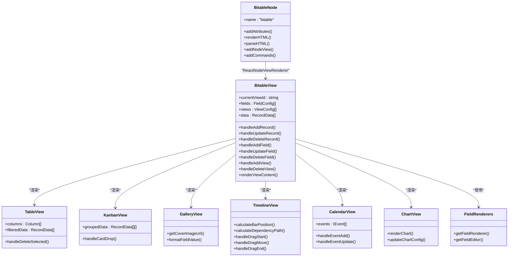

**图表来源**
- [packages/plugin-bitable/src/bitable/bitable-node.ts:174-232](file://packages/plugin-bitable/src/bitable/bitable-node.ts#L174-L232)
- [packages/plugin-bitable/src/bitable/BitableView.tsx:426-460](file://packages/plugin-bitable/src/bitable/BitableView.tsx#L426-L460)
- [packages/plugin-bitable/src/bitable/views/TableView.tsx:128-193](file://packages/plugin-bitable/src/bitable/views/TableView.tsx#L128-L193)
- [packages/plugin-bitable/src/bitable/views/KanbanView.tsx:43-70](file://packages/plugin-bitable/src/bitable/views/KanbanView.tsx#L43-L70)
- [packages/plugin-bitable/src/bitable/views/GalleryView.tsx:17-48](file://packages/plugin-bitable/src/bitable/views/GalleryView.tsx#L17-L48)
- [packages/plugin-bitable/src/bitable/views/TimelineView.tsx:186-486](file://packages/plugin-bitable/src/bitable/views/TimelineView.tsx#L186-L486)
- [packages/plugin-bitable/src/bitable/views/CalendarView.tsx:106-233](file://packages/plugin-bitable/src/bitable/views/CalendarView.tsx#L106-L233)
- [packages/plugin-bitable/src/bitable/views/ChartView.tsx:143-284](file://packages/plugin-bitable/src/bitable/views/ChartView.tsx#L143-L284)
- [packages/plugin-bitable/src/bitable/fields/FieldRenderers.tsx:744-818](file://packages/plugin-bitable/src/bitable/fields/FieldRenderers.tsx#L744-L818)

## 详细组件分析

### Bitable 节点与默认配置
- 默认字段：包含 ID、名称、状态（单选）、优先级（单选）、负责人、截止日期、进度等，支持自定义字段追加。
- 默认视图：表格视图、看板视图、画廊视图、甘特图视图、图表视图，均提供合理的默认配置。
- 插入命令：支持传入自定义字段与初始数据，生成唯一 ID 并插入节点。

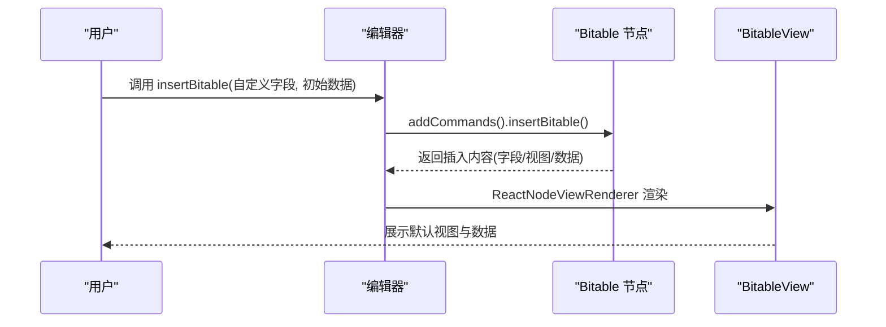

**图表来源**
- [packages/plugin-bitable/src/bitable/bitable-node.ts:215-230](file://packages/plugin-bitable/src/bitable/bitable-node.ts#L215-L230)
- [packages/plugin-bitable/src/bitable/BitableView.tsx:137-172](file://packages/plugin-bitable/src/bitable/BitableView.tsx#L137-L172)

**章节来源**
- [packages/plugin-bitable/src/bitable/bitable-node.ts:14-172](file://packages/plugin-bitable/src/bitable/bitable-node.ts#L14-L172)
- [packages/plugin-bitable/src/bitable/bitable-node.ts:174-232](file://packages/plugin-bitable/src/bitable/bitable-node.ts#L174-L232)

### BitableView 主容器与工具栏
- 视图标签页：支持左右滚动、重命名、删除视图；双击可编辑视图名称。
- 工具栏：字段配置、排序、筛选、搜索、设置、导入 Excel、新增记录、删除节点。
- 数据处理：根据当前视图的筛选与排序规则对数据进行预处理。
- 记录详情：点击记录触发详情抽屉。

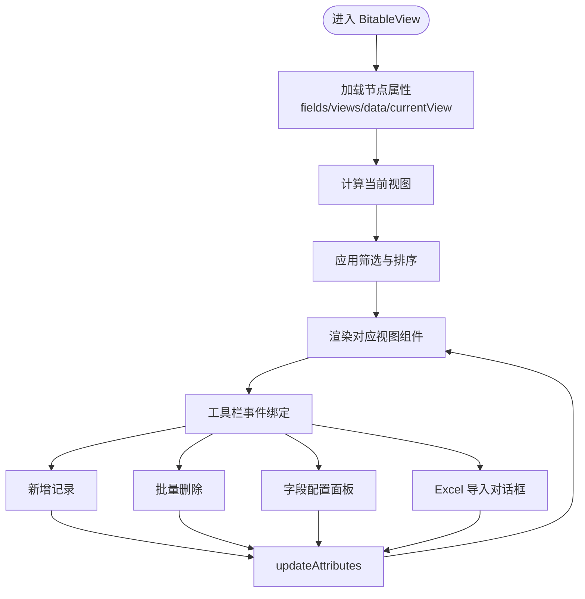

**图表来源**
- [packages/plugin-bitable/src/bitable/BitableView.tsx:61-845](file://packages/plugin-bitable/src/bitable/BitableView.tsx#L61-L845)
- [packages/plugin-bitable/src/bitable/BitableView.tsx:414-424](file://packages/plugin-bitable/src/bitable/BitableView.tsx#L414-L424)

**章节来源**
- [packages/plugin-bitable/src/bitable/BitableView.tsx:61-845](file://packages/plugin-bitable/src/bitable/BitableView.tsx#L61-L845)

### 表格视图（TableView）
- 列渲染：基于字段配置动态生成列，支持字段图标、宽度、可排序与可编辑。
- 编辑行为：使用 react-data-grid，支持单元格编辑、批量选择与删除。
- 搜索：支持全局搜索，按任一字段值模糊匹配。
- 详情：ID 字段右侧提供查看详情按钮。

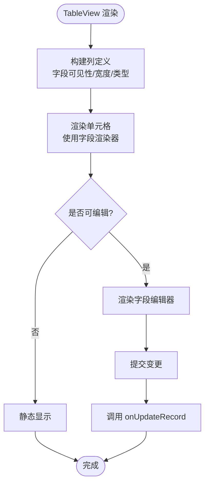

**图表来源**
- [packages/plugin-bitable/src/bitable/views/TableView.tsx:128-193](file://packages/plugin-bitable/src/bitable/views/TableView.tsx#L128-L193)
- [packages/plugin-bitable/src/bitable/views/TableView.tsx:228-239](file://packages/plugin-bitable/src/bitable/views/TableView.tsx#L228-L239)

**章节来源**
- [packages/plugin-bitable/src/bitable/views/TableView.tsx:91-385](file://packages/plugin-bitable/src/bitable/views/TableView.tsx#L91-L385)

### 看板视图（KanbanView）
- 分组依据：基于单选字段的选项进行分组，支持"未分组"。
- 拖拽：通过 DnD Provider 实现卡片拖拽，改变分组字段值。
- 渲染：每列显示卡片数量与卡片列表，点击卡片触发详情。

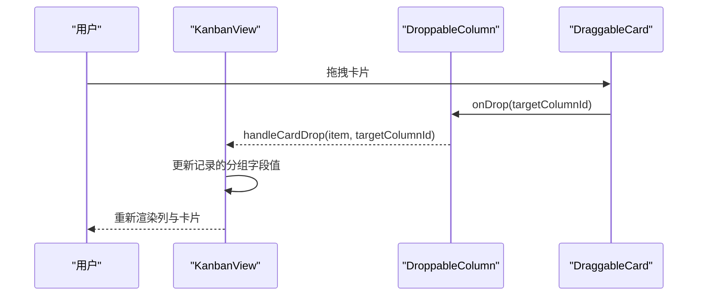

**图表来源**
- [packages/plugin-bitable/src/bitable/views/KanbanView.tsx:32-41](file://packages/plugin-bitable/src/bitable/views/KanbanView.tsx#L32-L41)
- [packages/plugin-bitable/src/bitable/views/KanbanView.tsx:120-170](file://packages/plugin-bitable/src/bitable/views/KanbanView.tsx#L120-L170)

**章节来源**
- [packages/plugin-bitable/src/bitable/views/KanbanView.tsx:26-172](file://packages/plugin-bitable/src/bitable/views/KanbanView.tsx#L26-L172)

### 画廊视图（GalleryView）
- 封面图：优先选择图片字段，其次 URL 字段，再次文本字段中的图片链接。
- 标题与字段：标题字段优先选择文本字段，其余字段最多展示 3 个。
- 卡片尺寸：支持 small/medium/large 三档，响应式网格布局。

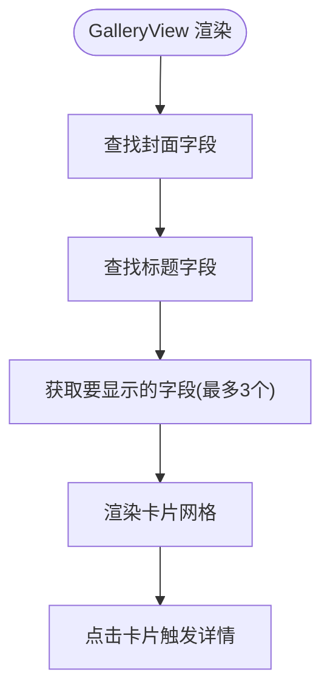

**图表来源**
- [packages/plugin-bitable/src/bitable/views/GalleryView.tsx:17-48](file://packages/plugin-bitable/src/bitable/views/GalleryView.tsx#L17-L48)
- [packages/plugin-bitable/src/bitable/views/GalleryView.tsx:186-261](file://packages/plugin-bitable/src/bitable/views/GalleryView.tsx#L186-L261)

**章节来源**
- [packages/plugin-bitable/src/bitable/views/GalleryView.tsx:186-261](file://packages/plugin-bitable/src/bitable/views/GalleryView.tsx#L186-L261)

### 甘特图视图（TimelineView）
- 时间轴：支持日、周、月三种缩放级别，可拖拽调整任务时间和持续时间。
- 任务管理：支持任务拖拽移动、边缘调整开始/结束日期、进度条显示。
- 依赖关系：支持任务间依赖关系连线，可配置关键路径高亮。
- 里程碑：支持里程碑标记，特殊样式显示。
- 分组显示：支持按单选字段分组显示不同颜色的任务条。

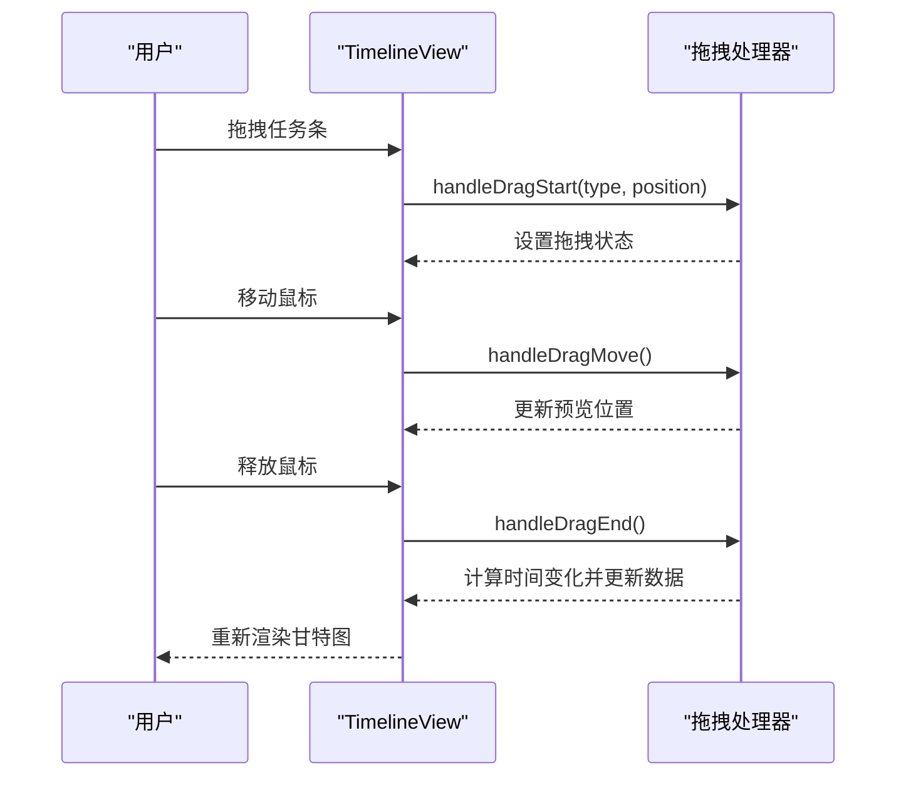

**图表来源**
- [packages/plugin-bitable/src/bitable/views/TimelineView.tsx:387-486](file://packages/plugin-bitable/src/bitable/views/TimelineView.tsx#L387-L486)
- [packages/plugin-bitable/src/bitable/views/TimelineView.tsx:846-864](file://packages/plugin-bitable/src/bitable/views/TimelineView.tsx#L846-L864)

**章节来源**
- [packages/plugin-bitable/src/bitable/views/TimelineView.tsx:40-1039](file://packages/plugin-bitable/src/bitable/views/TimelineView.tsx#L40-L1039)

### 日历视图（CalendarView）
- 多视图模式：支持月视图、周视图、日视图、年视图和议程视图。
- 事件管理：支持拖拽调整事件时间、双击创建事件、右键菜单操作。
- 颜色编码：为不同事件分配颜色，支持自定义颜色方案。
- 配置面板：支持选择日期字段、标题字段、结束日期字段等配置。

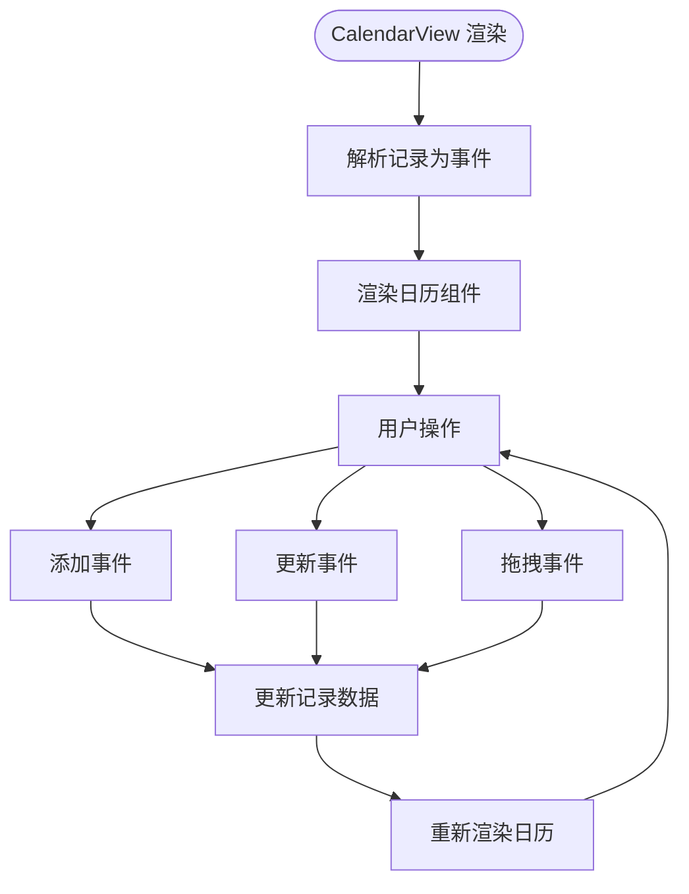

**图表来源**
- [packages/plugin-bitable/src/bitable/views/CalendarView.tsx:106-172](file://packages/plugin-bitable/src/bitable/views/CalendarView.tsx#L106-L172)
- [packages/plugin-bitable/src/bitable/views/CalendarView.tsx:175-233](file://packages/plugin-bitable/src/bitable/views/CalendarView.tsx#L175-L233)

**章节来源**
- [packages/plugin-bitable/src/bitable/views/CalendarView.tsx:36-372](file://packages/plugin-bitable/src/bitable/views/CalendarView.tsx#L36-L372)

### 图表视图（ChartView）
- 图表类型：支持柱状图、折线图、饼图、面积图、雷达图、散点图、环形图等。
- 配置面板：支持图表标题、描述、图例、网格线、动画效果等配置。
- 数据处理：使用自定义 hook 处理数据聚合、格式化和统计信息。
- 全屏模式：支持图表全屏查看，ESC 键退出。

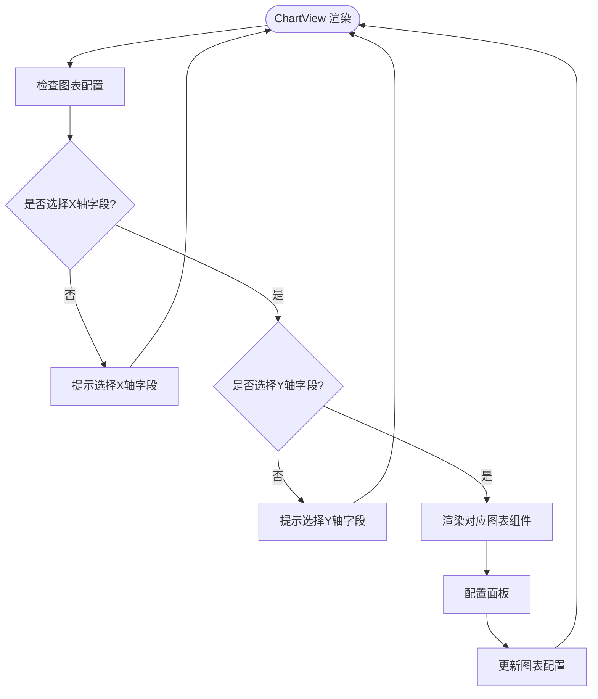

**图表来源**
- [packages/plugin-bitable/src/bitable/views/ChartView.tsx:144-165](file://packages/plugin-bitable/src/bitable/views/ChartView.tsx#L144-L165)
- [packages/plugin-bitable/src/bitable/views/ChartView.tsx:345-354](file://packages/plugin-bitable/src/bitable/views/ChartView.tsx#L345-L354)

**章节来源**
- [packages/plugin-bitable/src/bitable/views/ChartView.tsx:40-358](file://packages/plugin-bitable/src/bitable/views/ChartView.tsx#L40-L358)

### 字段渲染器与编辑器
- 渲染器：根据字段类型返回对应的 UI 组件，如文本、数字、日期、单选/多选标签、进度条、评分、图片、链接等。
- 编辑器：提供可编辑的输入控件，支持键盘快捷键、回车提交、ESC 取消等。
- 日期本地化：根据 i18n 语言选择 date-fns 本地化。

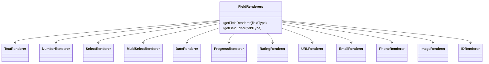

**图表来源**
- [packages/plugin-bitable/src/bitable/fields/FieldRenderers.tsx:744-818](file://packages/plugin-bitable/src/bitable/fields/FieldRenderers.tsx#L744-L818)

**章节来源**
- [packages/plugin-bitable/src/bitable/fields/FieldRenderers.tsx:1-818](file://packages/plugin-bitable/src/bitable/fields/FieldRenderers.tsx#L1-L818)

### AI 工具集合（bitable-tools）
- 查询工具：获取多维表格列表、获取完整数据、按条件查询记录。
- 插入工具：在文档中插入新的多维表格，支持指定字段与初始数据。
- 记录管理：新增、更新、删除记录，支持按标题或 ID 操作。
- 字段管理：新增字段、转换字段类型（含选项自动生成）。

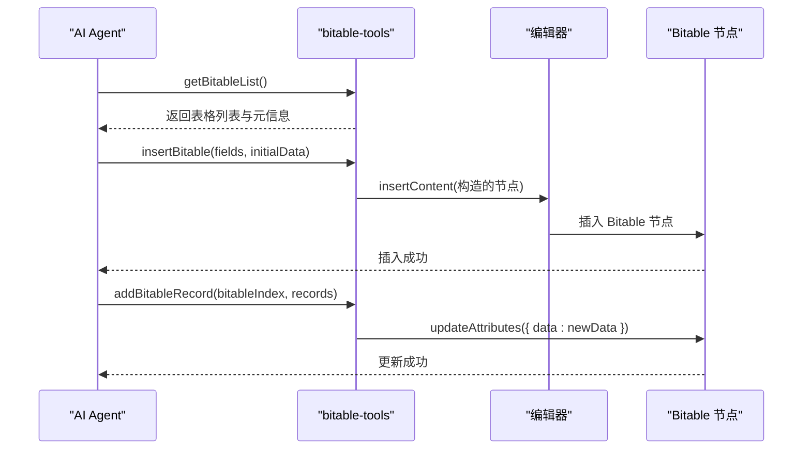

**图表来源**
- [packages/plugin-bitable/src/bitable/bitable-tools.ts:111-150](file://packages/plugin-bitable/src/bitable/bitable-tools.ts#L111-L150)
- [packages/plugin-bitable/src/bitable/bitable-tools.ts:285-430](file://packages/plugin-bitable/src/bitable/bitable-tools.ts#L285-L430)
- [packages/plugin-bitable/src/bitable/bitable-tools.ts:591-757](file://packages/plugin-bitable/src/bitable/bitable-tools.ts#L591-L757)

**章节来源**
- [packages/plugin-bitable/src/bitable/bitable-tools.ts:107-1202](file://packages/plugin-bitable/src/bitable/bitable-tools.ts#L107-L1202)

## 依赖关系分析
- 内部依赖：@kn/common、@kn/editor、@kn/ui、@kn/icon、@kn/core。
- 外部依赖：react-data-grid、react-beautiful-dnd、lodash、ahooks、date-fns、react-dnd、xlsx、recharts 等。
- 类型与工具：统一的类型定义与 ID 生成策略，确保字段、视图、记录等实体的稳定标识。

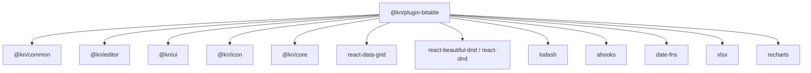

**图表来源**
- [packages/plugin-bitable/package.json:15-28](file://packages/plugin-bitable/package.json#L15-L28)

**章节来源**
- [packages/plugin-bitable/package.json:1-39](file://packages/plugin-bitable/package.json#L1-L39)

## 性能考量
- 数据处理：筛选与排序在 BitableView 中一次性应用，避免重复计算；TableView 使用 useMemo 优化列与过滤结果。
- 渲染优化：字段渲染器按类型选择，减少不必要的组件实例化；表格使用 react-data-grid，具备虚拟滚动与列宽缓存能力。
- 事件闭包：使用 ref 存储最新回调，避免闭包陷阱导致的重复渲染或数据不同步。
- 图表与视图：图表组件按需渲染，配置项集中管理，避免频繁重建。

## 故障排查指南
- 插入失败：确认编辑器处于可编辑状态，且命令调用正确；检查字段类型与选项是否匹配。
- 视图异常：检查当前视图配置（如看板分组字段必须为单选类型），若配置错误，视图会提示配置建议。
- 搜索无结果：确认搜索关键词与字段类型匹配，注意大小写与空值处理。
- Excel 导入报错：检查文件格式（.xlsx/.xls/.csv），确保首行包含标题或勾选"首行包含标题"。
- 甘特图拖拽无效：确认已配置开始日期字段，检查任务时间是否在可视范围内。
- 日历视图无事件：确认已配置日期字段，检查记录中的日期值格式是否正确。
- 图表配置错误：确认已选择合适的字段类型，检查数据格式是否符合图表要求。

**章节来源**
- [packages/plugin-bitable/src/bitable/views/KanbanView.tsx:84-98](file://packages/plugin-bitable/src/bitable/views/KanbanView.tsx#L84-L98)
- [packages/plugin-bitable/src/bitable/views/TableView.tsx:115-126](file://packages/plugin-bitable/src/bitable/views/TableView.tsx#L115-L126)
- [packages/plugin-bitable/src/bitable/views/TimelineView.tsx:489-496](file://packages/plugin-bitable/src/bitable/views/TimelineView.tsx#L489-L496)
- [packages/plugin-bitable/src/bitable/views/CalendarView.tsx:277-284](file://packages/plugin-bitable/src/bitable/views/CalendarView.tsx#L277-L284)
- [packages/plugin-bitable/src/bitable/views/ChartView.tsx:144-165](file://packages/plugin-bitable/src/bitable/views/ChartView.tsx#L144-L165)
- [packages/plugin-bitable/README.md:171-185](file://packages/plugin-bitable/README.md#L171-L185)

## 结论
Plugin Bitable 提供了完整的多维表格解决方案，覆盖数据建模、视图展示、交互编辑与 AI 自动化。其模块化设计与清晰的职责划分，使得扩展新视图、字段类型与工具成为可能。新增的甘特图、日历、图表等视图类型大大增强了项目管理和数据分析能力。建议后续完善更多图表类型、高级筛选功能、数据导出、权限控制等特性，进一步提升协作与可视化体验。

## 附录
- 插件入口与国际化：在插件入口中注册 BitableExtension，并提供中英文翻译资源。
- 扩展配置：通过 ExtensionWrapper 暴露斜杠命令与工具栏按钮，便于快速插入与操作。
- 视图类型枚举：包含 TABLE、KANBAN、GALLERY、TIMELINE、CALENDAR、FORM、CHART 等视图类型。
- 视图配置：每种视图都有对应的配置对象，支持自定义字段、样式和交互行为。

**章节来源**
- [packages/plugin-bitable/src/index.tsx:10-699](file://packages/plugin-bitable/src/index.tsx#L10-L699)
- [packages/plugin-bitable/src/bitable/index.tsx:7-29](file://packages/plugin-bitable/src/bitable/index.tsx#L7-L29)
- [packages/plugin-bitable/src/types/index.ts:29-38](file://packages/plugin-bitable/src/types/index.ts#L29-L38)
- [packages/plugin-bitable/src/types/index.ts:94-168](file://packages/plugin-bitable/src/types/index.ts#L94-L168)