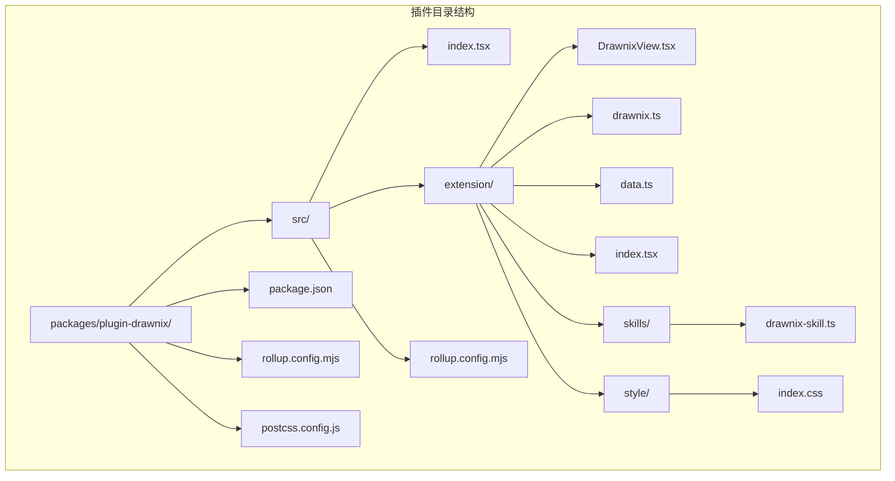
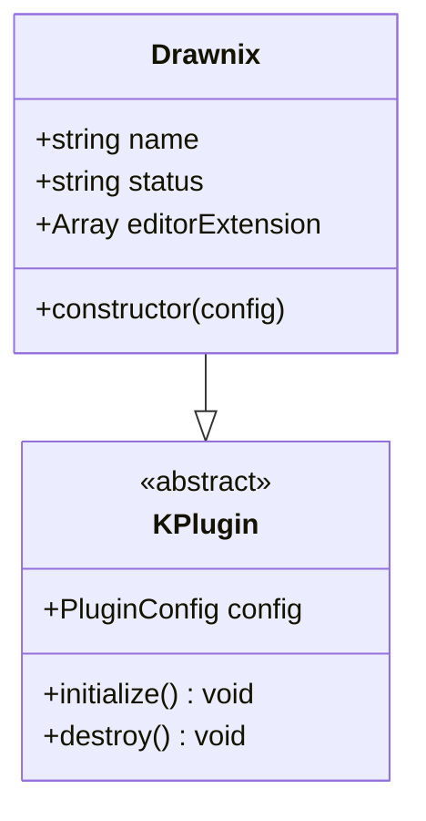
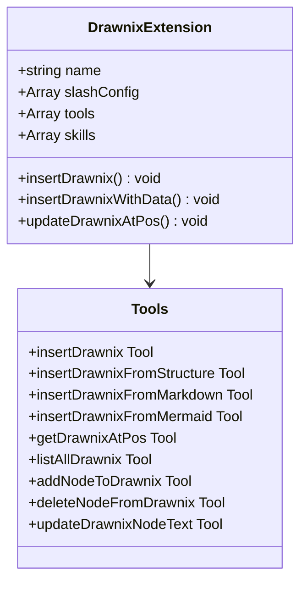
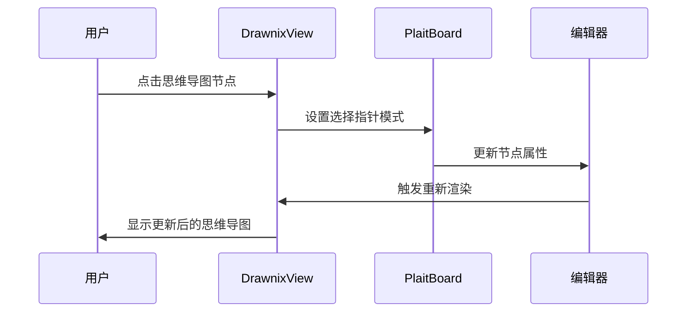
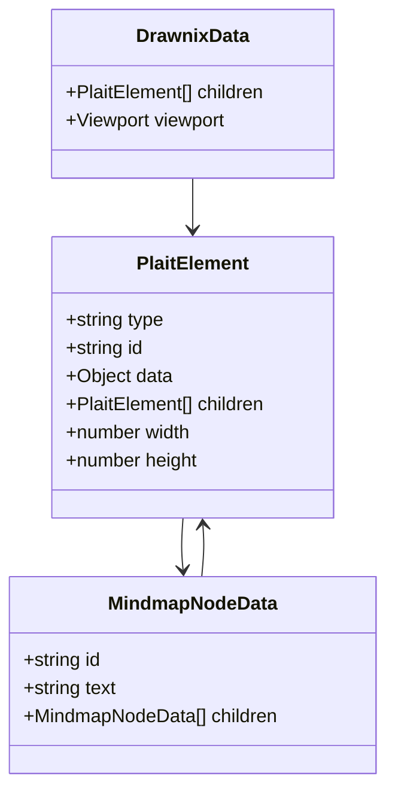
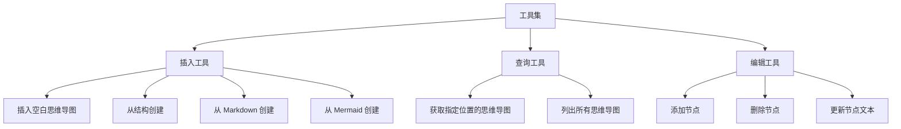
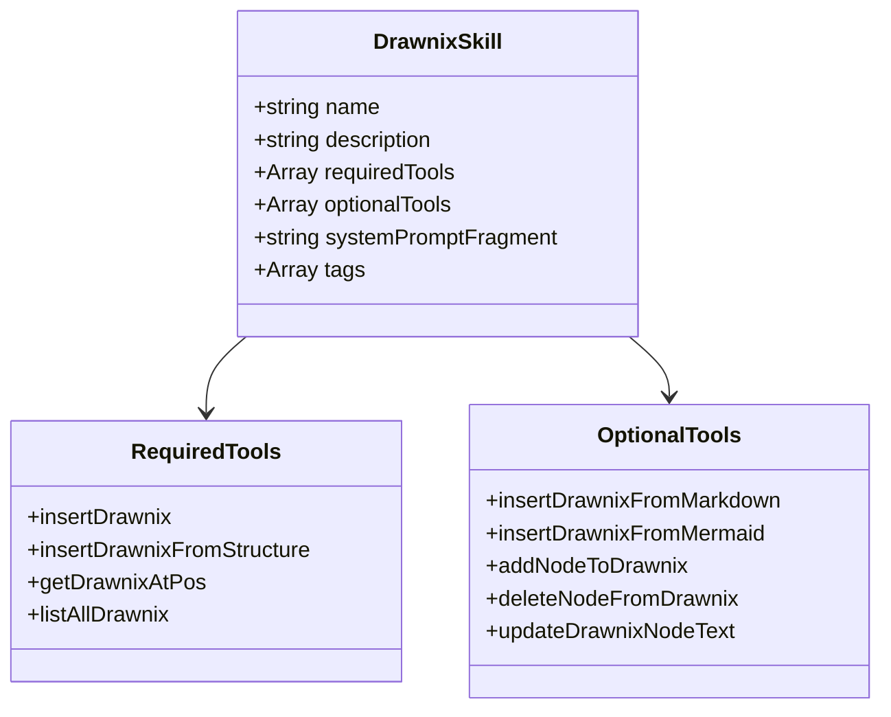
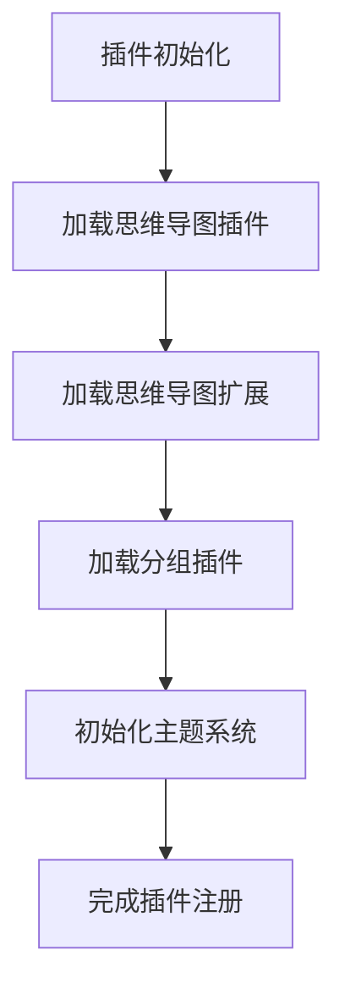

# 插件 Drawnix 文档

<cite>
**本文档引用的文件**
- [packages/plugin-drawnix/package.json](file://packages/plugin-drawnix/package.json)
- [packages/plugin-drawnix/src/index.tsx](file://packages/plugin-drawnix/src/index.tsx)
- [packages/plugin-drawnix/src/extension/index.tsx](file://packages/plugin-drawnix/src/extension/index.tsx)
- [packages/plugin-drawnix/src/extension/drawnix.ts](file://packages/plugin-drawnix/src/extension/drawnix.ts)
- [packages/plugin-drawnix/src/extension/DrawnixView.tsx](file://packages/plugin-drawnix/src/extension/DrawnixView.tsx)
- [packages/plugin-drawnix/src/extension/data.ts](file://packages/plugin-drawnix/src/extension/data.ts)
- [packages/plugin-drawnix/src/extension/skills/drawnix-skill.ts](file://packages/plugin-drawnix/src/extension/skills/drawnix-skill.ts)
- [packages/plugin-drawnix/src/extension/style/index.css](file://packages/plugin-drawnix/src/extension/style/index.css)
</cite>

## 更新摘要
**所做更改**
- 更新了插件架构以反映仅保留思维导图功能的现状
- 移除了擦除器、自由手绘等插件功能的相关描述
- 更新了核心组件分析以体现简化的插件系统
- 移除了插件目录结构和相关插件文件的引用
- 更新了依赖关系分析以反映精简后的架构

## 目录
1. [简介](#简介)
2. [项目结构](#项目结构)
3. [核心组件](#核心组件)
4. [架构概览](#架构概览)
5. [详细组件分析](#详细组件分析)
6. [插件系统](#插件系统)
7. [依赖关系分析](#依赖关系分析)
8. [性能考虑](#性能考虑)
9. [故障排除指南](#故障排除指南)
10. [结论](#结论)

## 简介

Drawnix 是一个基于 @plait-board 的纯思维导图插件，专注于提供高质量的思维导图创建和编辑体验。该插件已从之前的多功能白板插件简化为专门的思维导图解决方案，集成了完整的思维导图功能，包括从多种格式创建思维导图、节点操作、主题切换等特性。插件使用现代前端技术栈构建，支持深色模式，并提供了完整的 TypeScript 类型定义。

**重大架构调整**：从多功能白板插件简化为纯思维导图专用插件，移除了擦除器、自由手绘等非核心功能，专注于思维导图的专业化体验。

## 项目结构



**图表来源**
- [packages/plugin-drawnix/package.json:1-44](file://packages/plugin-drawnix/package.json#L1-L44)
- [packages/plugin-drawnix/src/index.tsx:1-14](file://packages/plugin-drawnix/src/index.tsx#L1-L14)

**章节来源**
- [packages/plugin-drawnix/package.json:1-44](file://packages/plugin-drawnix/package.json#L1-L44)
- [packages/plugin-drawnix/src/index.tsx:1-14](file://packages/plugin-drawnix/src/index.tsx#L1-L14)

## 核心组件

### 插件主入口

插件的核心是一个继承自 `KPlugin` 的类，提供基础的插件配置和扩展能力：



**图表来源**
- [packages/plugin-drawnix/src/index.tsx:5-14](file://packages/plugin-drawnix/src/index.tsx#L5-L14)

### 编辑器扩展

扩展模块提供了完整的思维导图功能，包括工具栏、节点操作和格式转换：



**图表来源**
- [packages/plugin-drawnix/src/extension/index.tsx:38-530](file://packages/plugin-drawnix/src/extension/index.tsx#L38-L530)

**章节来源**
- [packages/plugin-drawnix/src/index.tsx:1-14](file://packages/plugin-drawnix/src/index.tsx#L1-L14)
- [packages/plugin-drawnix/src/extension/index.tsx:1-530](file://packages/plugin-drawnix/src/extension/index.tsx#L1-L530)

## 架构概览

```mermaid
graph TB
subgraph "用户界面层"
A[DrawnixView 组件]
B[工具栏]
C[上下文菜单]
end
subgraph "编辑器层"
D[思维导图节点]
E[命令系统]
F[属性管理]
end
subgraph "插件系统层"
G[思维导图插件]
H[主题同步插件]
end
subgraph "数据层"
I[PlaitElement 结构]
J[思维导图数据]
K[视口状态]
end
subgraph "外部依赖"
L[@plait-board/react-board]
M[@plait/core]
N[@plait/mind]
O[@plait/common]
P[@plait/layouts]
Q[@plait/text-plugins]
end
A --> D
B --> E
C --> F
D --> G
E --> H
F --> I
G --> J
H --> K
I --> L
J --> M
K --> N
L --> O
M --> P
N --> Q
```

**图表来源**
- [packages/plugin-drawnix/src/extension/DrawnixView.tsx:28-134](file://packages/plugin-drawnix/src/extension/DrawnixView.tsx#L28-L134)
- [packages/plugin-drawnix/src/extension/drawnix.ts:183-233](file://packages/plugin-drawnix/src/extension/drawnix.ts#L183-L233)

## 详细组件分析

### Drawnix 视图组件

DrawnixView 是插件的核心渲染组件，专为思维导图设计：



**图表来源**
- [packages/plugin-drawnix/src/extension/DrawnixView.tsx:74-82](file://packages/plugin-drawnix/src/extension/DrawnixView.tsx#L74-L82)

组件特性包括：
- **思维导图专用**：专注于思维导图的交互和展示
- **主题切换**：支持浅色和深色模式
- **交互式画布**：响应式布局和缩放
- **上下文菜单**：提供思维导图特有的操作功能
- **简化插件系统**：仅加载思维导图相关插件

**章节来源**
- [packages/plugin-drawnix/src/extension/DrawnixView.tsx:1-134](file://packages/plugin-drawnix/src/extension/DrawnixView.tsx#L1-L134)

### 数据结构和转换

插件使用 @plait-board 的元素系统来表示思维导图：



**图表来源**
- [packages/plugin-drawnix/src/extension/drawnix.ts:6-16](file://packages/plugin-drawnix/src/extension/drawnix.ts#L6-L16)

数据转换功能：
- **结构转换**：JSON 结构与 Plait 元素的双向转换
- **节点操作**：添加、删除、更新节点
- **树遍历**：查找特定节点

**章节来源**
- [packages/plugin-drawnix/src/extension/drawnix.ts:1-233](file://packages/plugin-drawnix/src/extension/drawnix.ts#L1-L233)

### 工具集和功能

插件提供了九种不同的工具来操作思维导图：



**图表来源**
- [packages/plugin-drawnix/src/extension/index.tsx:51-527](file://packages/plugin-drawnix/src/extension/index.tsx#L51-L527)

每种工具都包含输入验证、错误处理和返回值结构化：

**章节来源**
- [packages/plugin-drawnix/src/extension/index.tsx:1-530](file://packages/plugin-drawnix/src/extension/index.tsx#L1-L530)

### 技能集成

插件定义了一个专门的 AI 技能，用于智能助手：



**图表来源**
- [packages/plugin-drawnix/src/extension/skills/drawnix-skill.ts:1-36](file://packages/plugin-drawnix/src/extension/skills/drawnix-skill.ts#L1-L36)

**章节来源**
- [packages/plugin-drawnix/src/extension/skills/drawnix-skill.ts:1-36](file://packages/plugin-drawnix/src/extension/skills/drawnix-skill.ts#L1-L36)

## 插件系统

**已更新** 插件系统已简化为仅包含思维导图相关功能，移除了原有的擦除器、自由手绘等插件。

### 简化后的插件配置



**图表来源**
- [packages/plugin-drawnix/src/extension/DrawnixView.tsx:40-42](file://packages/plugin-drawnix/src/extension/DrawnixView.tsx#L40-L42)

当前插件系统包含：
- **思维导图插件**：@plait/mind - 核心思维导图功能
- **思维导图扩展**：@plait/mind 的扩展功能
- **绘制插件**：@plait/draw - 基础绘制功能
- **分组插件**：@plait/common - 元素分组和选择功能

**章节来源**
- [packages/plugin-drawnix/src/extension/DrawnixView.tsx:39-42](file://packages/plugin-drawnix/src/extension/DrawnixView.tsx#L39-L42)

## 依赖关系分析

```mermaid
graph TB
subgraph "核心依赖"
A[@kn/common] --> D[插件框架]
B[@kn/editor] --> E[编辑器集成]
C[@kn/ui] --> F[UI 组件]
end
subgraph "绘图引擎 (@plait-board)"
G[@plait-board/react-board] --> I[React 集成]
H[@plait/core] --> J[核心功能]
K[@plait/mind] --> K[思维导图]
L[@plait/common] --> L[通用功能]
M[@plait/layouts] --> M[布局系统]
N[@plait/text-plugins] --> N[文本插件]
O[@plait-board/markdown-to-drawnix] --> O[Markdown 转换]
P[@plait-board/mermaid-to-drawnix] --> P[Mermaid 转换]
end
subgraph "工具库"
Q[nanoid] --> R[唯一 ID 生成]
S[slate] --> S[富文本编辑]
T[slate-dom] --> T[DOM 操作]
U[slate-history] --> U[历史记录]
V[slate-react] --> V[React 集成]
end
A --> G
B --> H
C --> I
D --> J
E --> K
F --> L
G --> O
H --> P
I --> Q
J --> S
K --> T
L --> U
M --> V
N --> O
O --> P
P --> Q
Q --> R
R --> S
S --> T
T --> U
U --> V
V --> W[最终应用]
```

**图表来源**
- [packages/plugin-drawnix/package.json:15-39](file://packages/plugin-drawnix/package.json#L15-L39)

**章节来源**
- [packages/plugin-drawnix/package.json:1-44](file://packages/plugin-drawnix/package.json#L1-L44)

## 性能考虑

### 渲染优化

- **虚拟滚动**：对于大型思维导图，考虑实现虚拟滚动以提高渲染性能
- **增量更新**：只更新发生变化的节点，避免全量重绘
- **懒加载**：延迟加载非可见区域的节点
- **插件优化**：仅加载必要的思维导图插件，减少初始加载时间

### 内存管理

- **对象池**：复用频繁创建的对象实例
- **垃圾回收**：及时清理不再使用的事件监听器和定时器
- **内存泄漏防护**：确保组件卸载时清理所有资源
- **插件生命周期管理**：合理管理插件的创建和销毁

### 网络优化

- **缓存策略**：缓存常用的转换结果
- **批量操作**：合并多个小操作为批量更新
- **异步加载**：插件和资源的异步加载

### 思维导图优化

- **插件注册**：动态注册必要的思维导图插件
- **事件委托**：使用事件委托减少事件监听器数量
- **主题同步**：优化主题变化时的重渲染

## 故障排除指南

### 常见问题

1. **思维导图无法渲染**
   - 检查 @plait-board 依赖是否正确安装
   - 验证数据结构的完整性
   - 确认主题设置是否正确
   - 检查思维导图插件是否正确初始化

2. **工具按钮无响应**
   - 检查编辑器是否处于可编辑状态
   - 验证工具注册是否正确
   - 确认权限设置
   - 检查思维导图插件系统是否正常工作

3. **节点操作失败**
   - 验证节点 ID 是否存在
   - 检查位置参数的有效性
   - 确认操作权限
   - 检查思维导图插件冲突

4. **思维导图功能异常**
   - 检查思维导图插件状态
   - 验证元素路径获取
   - 确认节点数据结构

### 调试技巧

- 使用浏览器开发者工具检查组件状态
- 在控制台输出关键变量值
- 逐步执行复杂操作以定位问题
- 检查思维导图插件系统的日志输出
- 验证事件处理链的完整性

**章节来源**
- [packages/plugin-drawnix/src/extension/DrawnixView.tsx:68-80](file://packages/plugin-drawnix/src/extension/DrawnixView.tsx#L68-L80)
- [packages/plugin-drawnix/src/extension/drawnix.ts:204-233](file://packages/plugin-drawnix/src/extension/drawnix.ts#L204-L233)

## 结论

Drawnix 插件经过重大架构调整后，成功转型为专业的思维导图插件。从之前的多功能白板插件简化为专注于思维导图的专用解决方案，移除了擦除器、自由手绘等非核心功能，显著提升了用户体验和开发效率。

**主要优势包括**：
- **专业化设计**：专注于思维导图的核心功能
- **简化架构**：移除不必要的插件，提升性能
- **插件系统**：精简但高效的思维导图插件集合
- **模块化设计**：清晰的组件分离和职责划分
- **类型安全**：完整的 TypeScript 支持
- **扩展性强**：易于添加新的思维导图功能
- **用户体验**：专注的界面和流畅的交互

**未来发展方向**：
- 更多的导出格式支持
- 实时协作功能
- 高级动画效果
- 更丰富的主题定制选项
- 思维导图生态系统的建设
- 性能优化和内存管理改进

这次架构调整不仅提升了现有功能的质量，还为未来的功能扩展奠定了更加坚实和专业化的基础。