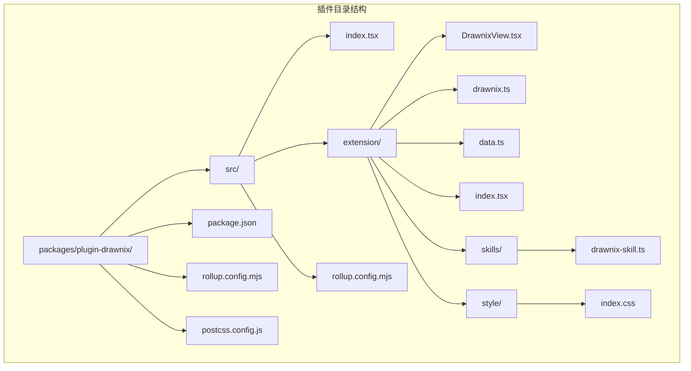
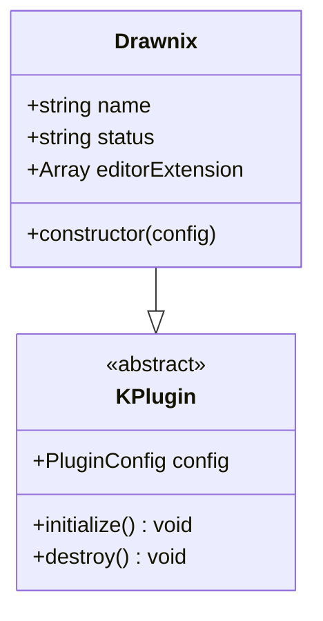
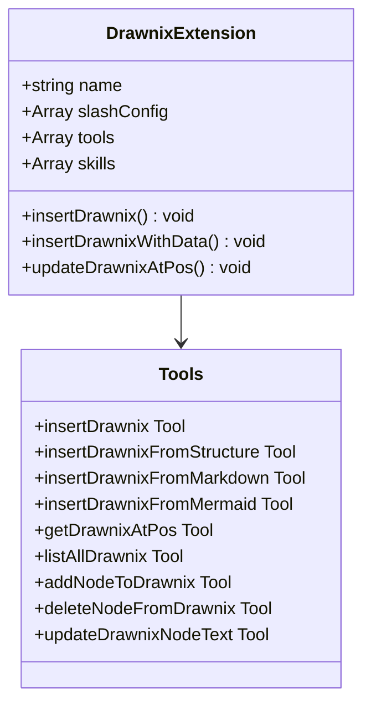
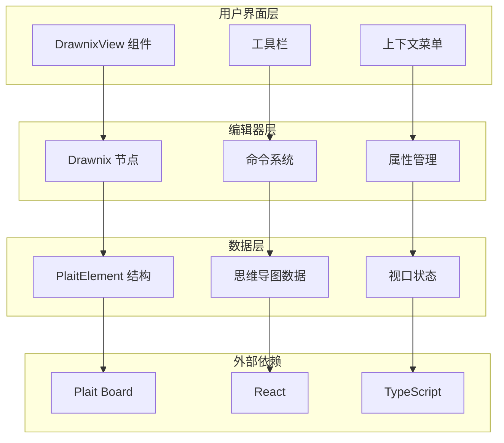
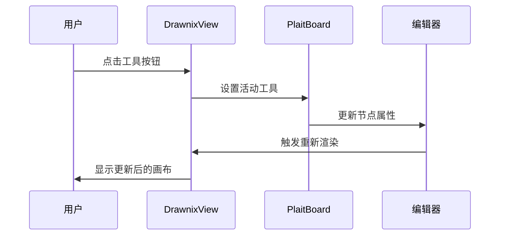
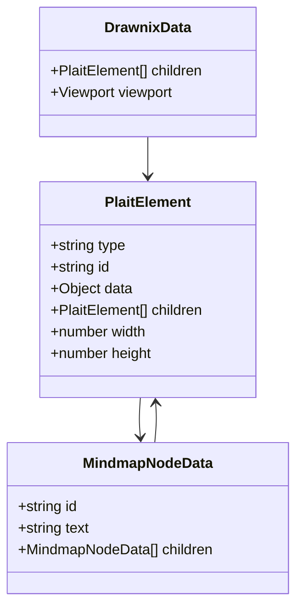
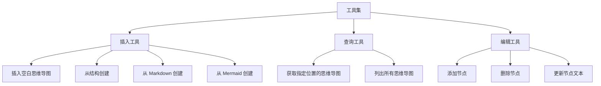
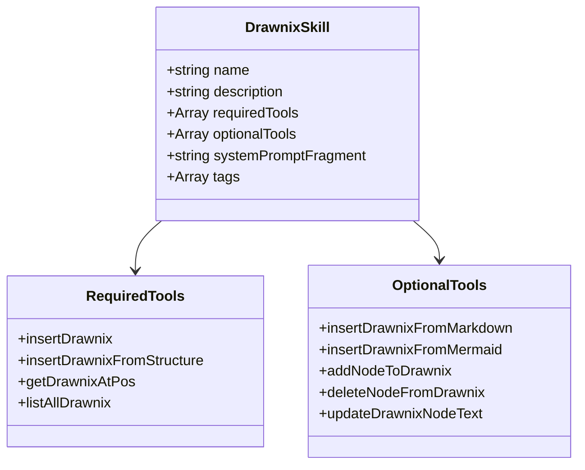

# 插件 Drawnix 文档

<cite>
**本文档引用的文件**
- [packages/plugin-drawnix/package.json](file://packages/plugin-drawnix/package.json)
- [packages/plugin-drawnix/src/index.tsx](file://packages/plugin-drawnix/src/index.tsx)
- [packages/plugin-drawnix/src/extension/index.tsx](file://packages/plugin-drawnix/src/extension/index.tsx)
- [packages/plugin-drawnix/src/extension/drawnix.ts](file://packages/plugin-drawnix/src/extension/drawnix.ts)
- [packages/plugin-drawnix/src/extension/DrawnixView.tsx](file://packages/plugin-drawnix/src/extension/DrawnixView.tsx)
- [packages/plugin-drawnix/src/extension/data.ts](file://packages/plugin-drawnix/src/extension/data.ts)
- [packages/plugin-drawnix/src/extension/skills/drawnix-skill.ts](file://packages/plugin-drawnix/src/extension/skills/drawnix-skill.ts)
- [packages/plugin-drawnix/src/extension/style/index.css](file://packages/plugin-drawnix/src/extension/style/index.css)
- [packages/plugin-drawnix/src/extension/only-mind.tsx](file://packages/plugin-drawnix/src/extension/only-mind.tsx)
- [packages/plugin-drawnix/rollup.config.mjs](file://packages/plugin-drawnix/rollup.config.mjs)
- [packages/plugin-drawnix/postcss.config.js](file://packages/plugin-drawnix/postcss.config.js)
</cite>

## 目录
1. [简介](#简介)
2. [项目结构](#项目结构)
3. [核心组件](#核心组件)
4. [架构概览](#架构概览)
5. [详细组件分析](#详细组件分析)
6. [依赖关系分析](#依赖关系分析)
7. [性能考虑](#性能考虑)
8. [故障排除指南](#故障排除指南)
9. [结论](#结论)

## 简介

Drawnix 是一个基于 Plait Board 的思维导图和白板插件，集成在知识库系统中。该插件提供了丰富的思维导图功能，包括从多种格式创建思维导图、节点操作、主题切换等特性。插件使用现代前端技术栈构建，支持深色模式，并提供了完整的 TypeScript 类型定义。

## 项目结构



**图表来源**
- [packages/plugin-drawnix/package.json:1-46](file://packages/plugin-drawnix/package.json#L1-L46)
- [packages/plugin-drawnix/src/index.tsx:1-14](file://packages/plugin-drawnix/src/index.tsx#L1-L14)

**章节来源**
- [packages/plugin-drawnix/package.json:1-46](file://packages/plugin-drawnix/package.json#L1-L46)
- [packages/plugin-drawnix/src/index.tsx:1-14](file://packages/plugin-drawnix/src/index.tsx#L1-L14)

## 核心组件

### 插件主入口

插件的核心是一个继承自 `KPlugin` 的类，提供基本的插件配置和扩展能力：



**图表来源**
- [packages/plugin-drawnix/src/index.tsx:5-14](file://packages/plugin-drawnix/src/index.tsx#L5-L14)

### 编辑器扩展

扩展模块提供了完整的思维导图功能，包括工具栏、节点操作和格式转换：



**图表来源**
- [packages/plugin-drawnix/src/extension/index.tsx:38-445](file://packages/plugin-drawnix/src/extension/index.tsx#L38-L445)

**章节来源**
- [packages/plugin-drawnix/src/index.tsx:1-14](file://packages/plugin-drawnix/src/index.tsx#L1-L14)
- [packages/plugin-drawnix/src/extension/index.tsx:1-445](file://packages/plugin-drawnix/src/extension/index.tsx#L1-L445)

## 架构概览



**图表来源**
- [packages/plugin-drawnix/src/extension/DrawnixView.tsx:17-315](file://packages/plugin-drawnix/src/extension/DrawnixView.tsx#L17-L315)
- [packages/plugin-drawnix/src/extension/drawnix.ts:183-236](file://packages/plugin-drawnix/src/extension/drawnix.ts#L183-L236)

## 详细组件分析

### Drawnix 视图组件

DrawnixView 是插件的核心渲染组件，负责显示和交互：



**图表来源**
- [packages/plugin-drawnix/src/extension/DrawnixView.tsx:95-106](file://packages/plugin-drawnix/src/extension/DrawnixView.tsx#L95-L106)

组件特性包括：
- **多工具支持**：选择、矩形、椭圆、菱形、画笔、文本工具
- **主题切换**：支持浅色和深色模式
- **交互式画布**：响应式布局和缩放
- **上下文菜单**：提供清除画布、主题切换等功能

**章节来源**
- [packages/plugin-drawnix/src/extension/DrawnixView.tsx:1-315](file://packages/plugin-drawnix/src/extension/DrawnixView.tsx#L1-L315)

### 数据结构和转换

插件使用 Plait Board 的元素系统来表示思维导图：



**图表来源**
- [packages/plugin-drawnix/src/extension/drawnix.ts:6-16](file://packages/plugin-drawnix/src/extension/drawnix.ts#L6-L16)

数据转换功能：
- **结构转换**：JSON 结构与 Plait 元素的双向转换
- **节点操作**：添加、删除、更新节点
- **树遍历**：查找特定节点

**章节来源**
- [packages/plugin-drawnix/src/extension/drawnix.ts:1-236](file://packages/plugin-drawnix/src/extension/drawnix.ts#L1-L236)

### 工具集和功能

插件提供了九种不同的工具来操作思维导图：



**图表来源**
- [packages/plugin-drawnix/src/extension/index.tsx:51-443](file://packages/plugin-drawnix/src/extension/index.tsx#L51-L443)

每种工具都包含输入验证、错误处理和返回值结构化：

**章节来源**
- [packages/plugin-drawnix/src/extension/index.tsx:1-445](file://packages/plugin-drawnix/src/extension/index.tsx#L1-L445)

### 技能集成

插件定义了一个专门的 AI 技能，用于智能助手：



**图表来源**
- [packages/plugin-drawnix/src/extension/skills/drawnix-skill.ts:1-36](file://packages/plugin-drawnix/src/extension/skills/drawnix-skill.ts#L1-L36)

**章节来源**
- [packages/plugin-drawnix/src/extension/skills/drawnix-skill.ts:1-36](file://packages/plugin-drawnix/src/extension/skills/drawnix-skill.ts#L1-L36)

## 依赖关系分析

```mermaid
graph TB
subgraph "核心依赖"
A[@kn/common] --> D[插件框架]
B[@kn/editor] --> E[编辑器集成]
C[@kn/ui] --> F[UI 组件]
end
subgraph "绘图引擎"
G[@plait/core] --> I[核心功能]
H[@plait/mind] --> J[思维导图]
K[@plait/draw] --> K[绘制工具]
L[@plait/common] --> L[通用功能]
end
subgraph "格式转换"
M[@plait-board/markdown-to-drawnix] --> O[Markdown 转换]
N[@plait-board/mermaid-to-drawnix] --> P[Mermaid 转换]
end
subgraph "工具库"
Q[nanoid] --> R[唯一 ID 生成]
S[slate] --> S[富文本编辑]
end
A --> G
B --> H
C --> I
D --> J
E --> K
F --> L
G --> M
H --> N
I --> Q
J --> S
```

**图表来源**
- [packages/plugin-drawnix/package.json:15-39](file://packages/plugin-drawnix/package.json#L15-L39)

**章节来源**
- [packages/plugin-drawnix/package.json:1-46](file://packages/plugin-drawnix/package.json#L1-L46)

## 性能考虑

### 渲染优化

- **虚拟滚动**：对于大型思维导图，考虑实现虚拟滚动以提高渲染性能
- **增量更新**：只更新发生变化的节点，避免全量重绘
- **懒加载**：延迟加载非可见区域的节点

### 内存管理

- **对象池**：复用频繁创建的对象实例
- **垃圾回收**：及时清理不再使用的事件监听器和定时器
- **内存泄漏防护**：确保组件卸载时清理所有资源

### 网络优化

- **缓存策略**：缓存常用的转换结果
- **批量操作**：合并多个小操作为批量更新

## 故障排除指南

### 常见问题

1. **思维导图无法渲染**
   - 检查 Plait Board 依赖是否正确安装
   - 验证数据结构的完整性
   - 确认主题设置是否正确

2. **工具按钮无响应**
   - 检查编辑器是否处于可编辑状态
   - 验证工具注册是否正确
   - 确认权限设置

3. **节点操作失败**
   - 验证节点 ID 是否存在
   - 检查位置参数的有效性
   - 确认操作权限

### 调试技巧

- 使用浏览器开发者工具检查组件状态
- 在控制台输出关键变量值
- 逐步执行复杂操作以定位问题

**章节来源**
- [packages/plugin-drawnix/src/extension/DrawnixView.tsx:68-80](file://packages/plugin-drawnix/src/extension/DrawnixView.tsx#L68-L80)
- [packages/plugin-drawnix/src/extension/drawnix.ts:204-236](file://packages/plugin-drawnix/src/extension/drawnix.ts#L204-L236)

## 结论

Drawnix 插件是一个功能完整、架构清晰的思维导图解决方案。它成功地将 Plait Board 的强大绘图能力与知识库系统的编辑器集成在一起，提供了丰富的用户体验和强大的功能集。

主要优势包括：
- **模块化设计**：清晰的组件分离和职责划分
- **类型安全**：完整的 TypeScript 支持
- **扩展性强**：易于添加新功能和工具
- **用户体验**：直观的界面和流畅的交互

未来可以考虑的功能增强：
- 更多的导出格式支持
- 实时协作功能
- 高级动画效果
- 更丰富的主题定制选项