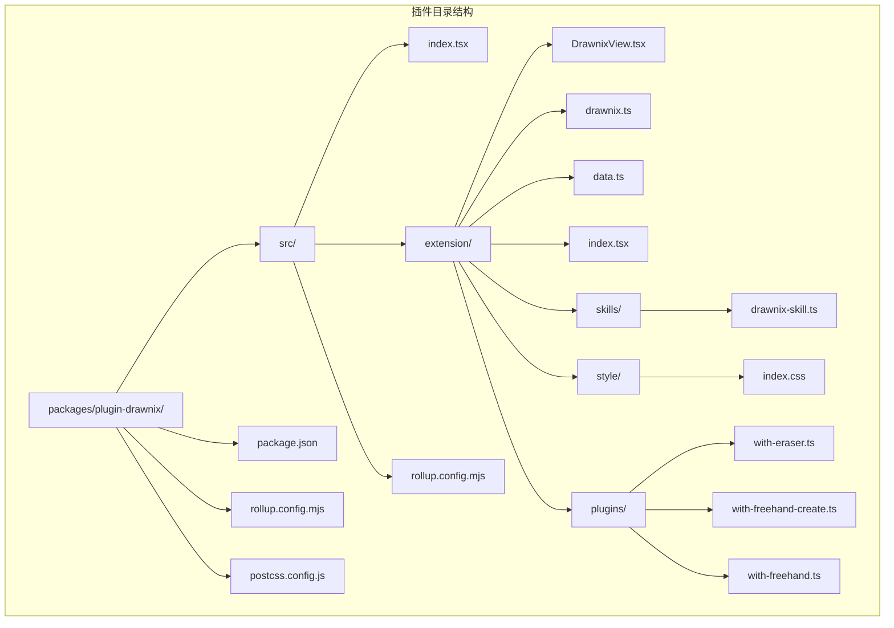
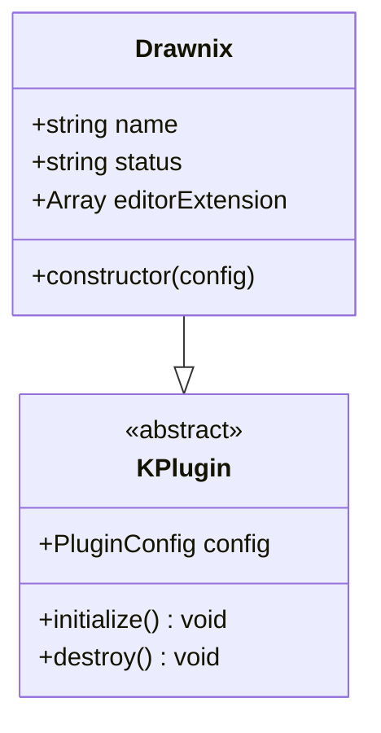
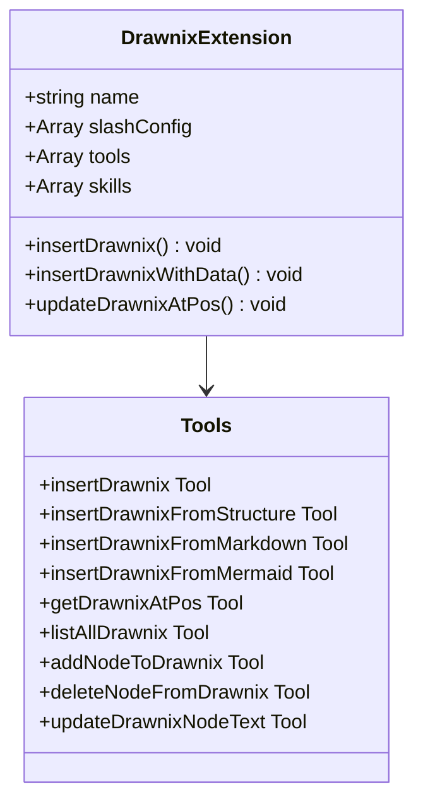
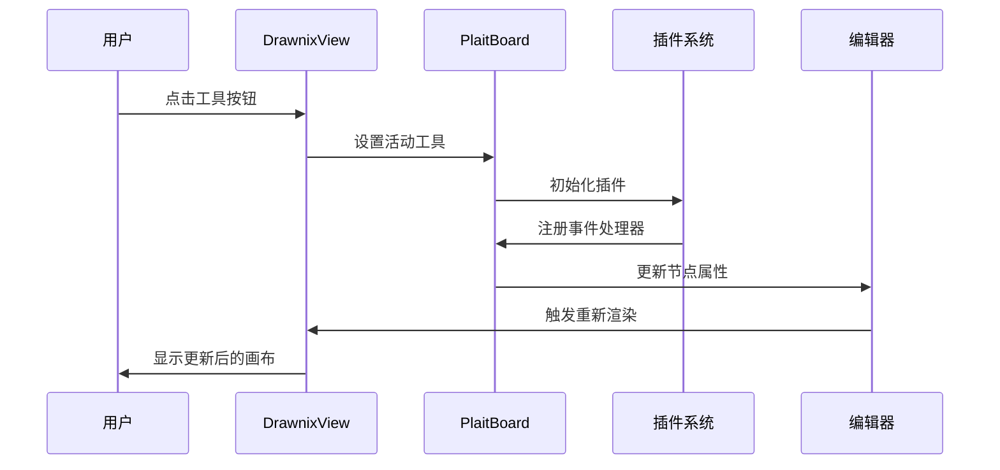
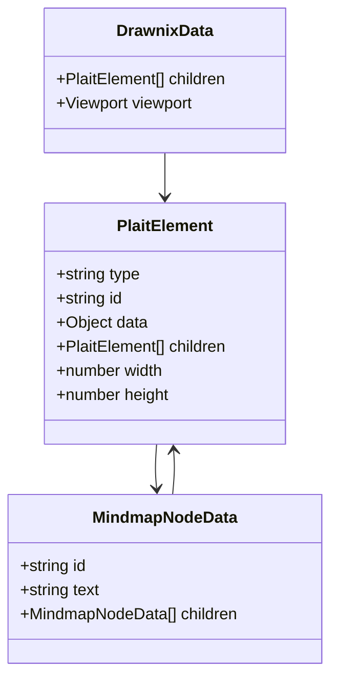
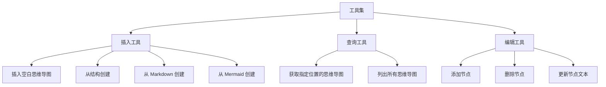
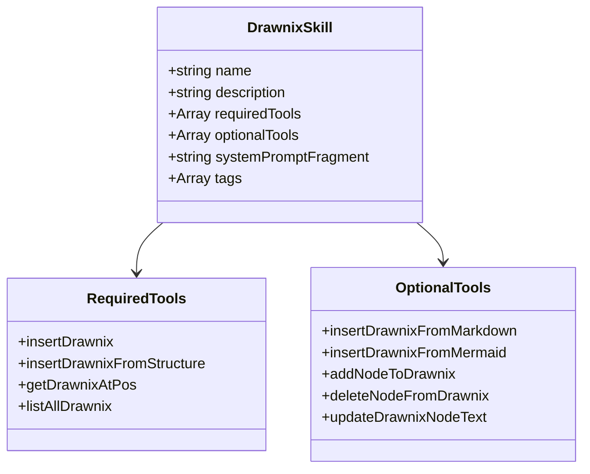
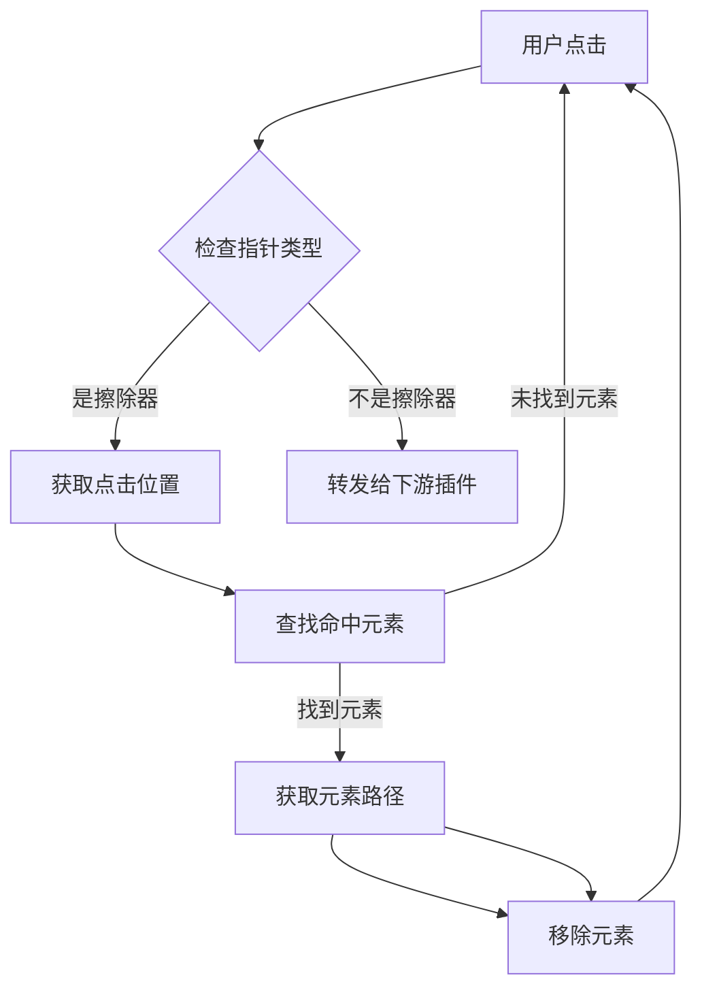
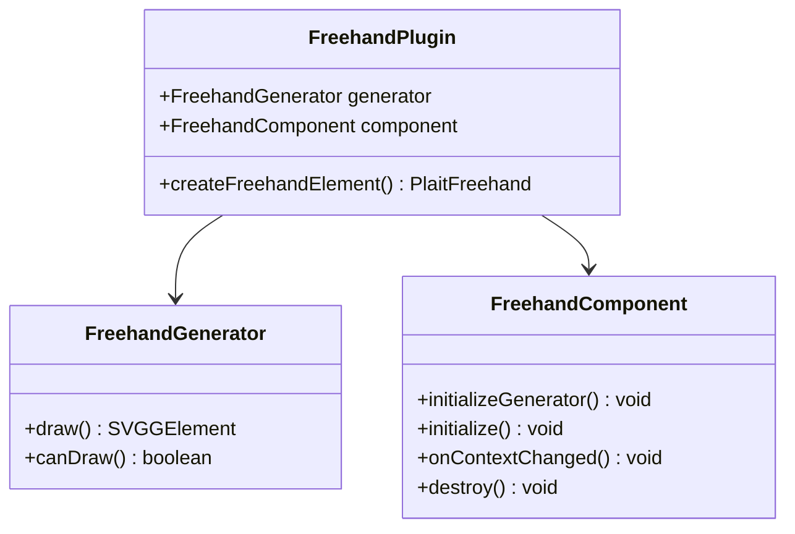
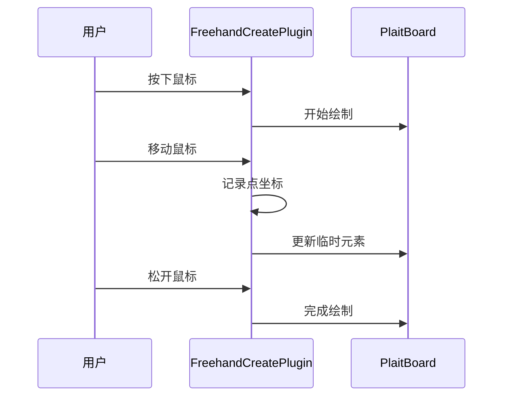

# 插件 Drawnix 文档

<cite>
**本文档引用的文件**
- [packages/plugin-drawnix/package.json](file://packages/plugin-drawnix/package.json)
- [packages/plugin-drawnix/src/index.tsx](file://packages/plugin-drawnix/src/index.tsx)
- [packages/plugin-drawnix/src/extension/index.tsx](file://packages/plugin-drawnix/src/extension/index.tsx)
- [packages/plugin-drawnix/src/extension/drawnix.ts](file://packages/plugin-drawnix/src/extension/drawnix.ts)
- [packages/plugin-drawnix/src/extension/DrawnixView.tsx](file://packages/plugin-drawnix/src/extension/DrawnixView.tsx)
- [packages/plugin-drawnix/src/extension/data.ts](file://packages/plugin-drawnix/src/extension/data.ts)
- [packages/plugin-drawnix/src/extension/skills/drawnix-skill.ts](file://packages/plugin-drawnix/src/extension/skills/drawnix-skill.ts)
- [packages/plugin-drawnix/src/extension/style/index.css](file://packages/plugin-drawnix/src/extension/style/index.css)
- [packages/plugin-drawnix/src/extension/only-mind.tsx](file://packages/plugin-drawnix/src/extension/only-mind.tsx)
- [packages/plugin-drawnix/src/extension/plugins/with-eraser.ts](file://packages/plugin-drawnix/src/extension/plugins/with-eraser.ts)
- [packages/plugin-drawnix/src/extension/plugins/with-freehand-create.ts](file://packages/plugin-drawnix/src/extension/plugins/with-freehand-create.ts)
- [packages/plugin-drawnix/src/extension/plugins/with-freehand.ts](file://packages/plugin-drawnix/src/extension/plugins/with-freehand.ts)
- [packages/plugin-drawnix/rollup.config.mjs](file://packages/plugin-drawnix/rollup.config.mjs)
- [packages/plugin-drawnix/postcss.config.js](file://packages/plugin-drawnix/postcss.config.js)
</cite>

## 更新摘要
**所做更改**
- 更新了架构概览以反映从 @plait-board 到 @plait-board 的迁移
- 新增了擦除器和自由手绘功能的详细说明
- 更新了核心组件分析以包含新的插件系统
- 增强了事件处理和主题同步机制的描述
- 更新了依赖关系分析以反映新的插件架构
- 新增了思维导图模式和白板模式的区分

## 目录
1. [简介](#简介)
2. [项目结构](#项目结构)
3. [核心组件](#核心组件)
4. [架构概览](#架构概览)
5. [详细组件分析](#详细组件分析)
6. [插件系统](#插件系统)
7. [依赖关系分析](#依赖关系分析)
8. [性能考虑](#性能考虑)
9. [故障排除指南](#故障排除指南)
10. [结论](#结论)

## 简介

Drawnix 是一个基于 @plait-board 的思维导图和白板插件，集成在知识库系统中。该插件提供了丰富的思维导图功能，包括从多种格式创建思维导图、节点操作、主题切换等特性。插件使用现代前端技术栈构建，支持深色模式，并提供了完整的 TypeScript 类型定义。

**重大架构升级**：从 @plait-board 迁移到 @plait-board，新增擦除器和自由手绘功能，改进事件处理和主题同步机制。

## 项目结构



**图表来源**
- [packages/plugin-drawnix/package.json:1-44](file://packages/plugin-drawnix/package.json#L1-L44)
- [packages/plugin-drawnix/src/index.tsx:1-14](file://packages/plugin-drawnix/src/index.tsx#L1-L14)

**章节来源**
- [packages/plugin-drawnix/package.json:1-44](file://packages/plugin-drawnix/package.json#L1-L44)
- [packages/plugin-drawnix/src/index.tsx:1-14](file://packages/plugin-drawnix/src/index.tsx#L1-L14)

## 核心组件

### 插件主入口

插件的核心是一个继承自 `KPlugin` 的类，提供基本的插件配置和扩展能力：



**图表来源**
- [packages/plugin-drawnix/src/index.tsx:5-14](file://packages/plugin-drawnix/src/index.tsx#L5-L14)

### 编辑器扩展

扩展模块提供了完整的思维导图功能，包括工具栏、节点操作和格式转换：



**图表来源**
- [packages/plugin-drawnix/src/extension/index.tsx:38-445](file://packages/plugin-drawnix/src/extension/index.tsx#L38-L445)

**章节来源**
- [packages/plugin-drawnix/src/index.tsx:1-14](file://packages/plugin-drawnix/src/index.tsx#L1-L14)
- [packages/plugin-drawnix/src/extension/index.tsx:1-445](file://packages/plugin-drawnix/src/extension/index.tsx#L1-L445)

## 架构概览

```mermaid
graph TB
subgraph "用户界面层"
A[DrawnixView 组件]
B[工具栏]
C[上下文菜单]
end
subgraph "编辑器层"
D[Drawnix 节点]
E[命令系统]
F[属性管理]
end
subgraph "插件系统层"
G[擦除器插件]
H[自由手绘插件]
I[自由手绘创建插件]
J[主题同步插件]
end
subgraph "数据层"
K[PlaitElement 结构]
L[思维导图数据]
M[视口状态]
end
subgraph "外部依赖"
N[@plait-board/react-board]
O[@plait/core]
P[@plait/draw]
Q[@plait/mind]
R[@plait/common]
end
A --> D
B --> E
C --> F
D --> G
E --> H
F --> I
G --> J
H --> K
I --> L
J --> M
K --> N
L --> O
M --> P
N --> Q
O --> R
```

**图表来源**
- [packages/plugin-drawnix/src/extension/DrawnixView.tsx:17-312](file://packages/plugin-drawnix/src/extension/DrawnixView.tsx#L17-L312)
- [packages/plugin-drawnix/src/extension/drawnix.ts:183-237](file://packages/plugin-drawnix/src/extension/drawnix.ts#L183-L237)

## 详细组件分析

### Drawnix 视图组件

DrawnixView 是插件的核心渲染组件，负责显示和交互：



**图表来源**
- [packages/plugin-drawnix/src/extension/DrawnixView.tsx:95-106](file://packages/plugin-drawnix/src/extension/DrawnixView.tsx#L95-L106)

组件特性包括：
- **多工具支持**：选择、矩形、椭圆、菱形、画笔、文本工具、擦除器、思维导图工具
- **主题切换**：支持浅色和深色模式
- **交互式画布**：响应式布局和缩放
- **上下文菜单**：提供清除画布、主题切换等功能
- **插件系统**：动态加载和管理插件

**章节来源**
- [packages/plugin-drawnix/src/extension/DrawnixView.tsx:1-312](file://packages/plugin-drawnix/src/extension/DrawnixView.tsx#L1-L312)

### 数据结构和转换

插件使用 @plait-board 的元素系统来表示思维导图：



**图表来源**
- [packages/plugin-drawnix/src/extension/drawnix.ts:6-16](file://packages/plugin-drawnix/src/extension/drawnix.ts#L6-L16)

数据转换功能：
- **结构转换**：JSON 结构与 Plait 元素的双向转换
- **节点操作**：添加、删除、更新节点
- **树遍历**：查找特定节点

**章节来源**
- [packages/plugin-drawnix/src/extension/drawnix.ts:1-237](file://packages/plugin-drawnix/src/extension/drawnix.ts#L1-L237)

### 工具集和功能

插件提供了九种不同的工具来操作思维导图：



**图表来源**
- [packages/plugin-drawnix/src/extension/index.tsx:51-443](file://packages/plugin-drawnix/src/extension/index.tsx#L51-L443)

每种工具都包含输入验证、错误处理和返回值结构化：

**章节来源**
- [packages/plugin-drawnix/src/extension/index.tsx:1-445](file://packages/plugin-drawnix/src/extension/index.tsx#L1-L445)

### 技能集成

插件定义了一个专门的 AI 技能，用于智能助手：



**图表来源**
- [packages/plugin-drawnix/src/extension/skills/drawnix-skill.ts:1-36](file://packages/plugin-drawnix/src/extension/skills/drawnix-skill.ts#L1-L36)

**章节来源**
- [packages/plugin-drawnix/src/extension/skills/drawnix-skill.ts:1-36](file://packages/plugin-drawnix/src/extension/skills/drawnix-skill.ts#L1-L36)

## 插件系统

### 擦除器插件

擦除器插件允许用户通过点击来删除画布上的元素：



**图表来源**
- [packages/plugin-drawnix/src/extension/plugins/with-eraser.ts:17-41](file://packages/plugin-drawnix/src/extension/plugins/with-eraser.ts#L17-L41)

### 自由手绘插件

自由手绘插件提供了平滑的手绘功能：



**图表来源**
- [packages/plugin-drawnix/src/extension/plugins/with-freehand.ts:37-159](file://packages/plugin-drawnix/src/extension/plugins/with-freehand.ts#L37-L159)

### 自由手绘创建插件

自由手绘创建插件处理交互式的手绘创建过程：



**图表来源**
- [packages/plugin-drawnix/src/extension/plugins/with-freehand-create.ts:65-144](file://packages/plugin-drawnix/src/extension/plugins/with-freehand-create.ts#L65-L144)

**章节来源**
- [packages/plugin-drawnix/src/extension/plugins/with-eraser.ts:1-43](file://packages/plugin-drawnix/src/extension/plugins/with-eraser.ts#L1-L43)
- [packages/plugin-drawnix/src/extension/plugins/with-freehand.ts:1-160](file://packages/plugin-drawnix/src/extension/plugins/with-freehand.ts#L1-L160)
- [packages/plugin-drawnix/src/extension/plugins/with-freehand-create.ts:1-148](file://packages/plugin-drawnix/src/extension/plugins/with-freehand-create.ts#L1-L148)

## 依赖关系分析

```mermaid
graph TB
subgraph "核心依赖"
A[@kn/common] --> D[插件框架]
B[@kn/editor] --> E[编辑器集成]
C[@kn/ui] --> F[UI 组件]
end
subgraph "绘图引擎 (@plait-board)"
G[@plait-board/react-board] --> I[React 集成]
H[@plait/core] --> J[核心功能]
K[@plait/draw] --> K[绘制工具]
L[@plait/mind] --> L[思维导图]
M[@plait/common] --> M[通用功能]
N[@plait/layouts] --> N[布局系统]
O[@plait/text-plugins] --> O[文本插件]
end
subgraph "格式转换"
P[@plait-board/markdown-to-drawnix] --> R[Markdown 转换]
Q[@plait-board/mermaid-to-drawnix] --> S[Mermaid 转换]
end
subgraph "工具库"
T[nanoid] --> U[唯一 ID 生成]
V[slate] --> V[富文本编辑]
W[slate-dom] --> W[DOM 操作]
X[slate-history] --> X[历史记录]
Y[slate-react] --> Y[React 集成]
end
A --> G
B --> H
C --> I
D --> J
E --> K
F --> L
G --> P
H --> Q
I --> T
J --> V
K --> W
L --> X
M --> Y
N --> O
O --> P
P --> Q
Q --> R
R --> S
S --> T
T --> U
U --> V
V --> W
W --> X
X --> Y
Y --> Z[最终应用]
```

**图表来源**
- [packages/plugin-drawnix/package.json:15-39](file://packages/plugin-drawnix/package.json#L15-L39)

**章节来源**
- [packages/plugin-drawnix/package.json:1-44](file://packages/plugin-drawnix/package.json#L1-L44)

## 性能考虑

### 渲染优化

- **虚拟滚动**：对于大型思维导图，考虑实现虚拟滚动以提高渲染性能
- **增量更新**：只更新发生变化的节点，避免全量重绘
- **懒加载**：延迟加载非可见区域的节点
- **插件优化**：按需加载插件，减少初始加载时间

### 内存管理

- **对象池**：复用频繁创建的对象实例
- **垃圾回收**：及时清理不再使用的事件监听器和定时器
- **内存泄漏防护**：确保组件卸载时清理所有资源
- **插件生命周期管理**：合理管理插件的创建和销毁

### 网络优化

- **缓存策略**：缓存常用的转换结果
- **批量操作**：合并多个小操作为批量更新
- **异步加载**：插件和资源的异步加载

### 插件系统优化

- **插件注册**：动态注册插件，避免不必要的初始化
- **事件委托**：使用事件委托减少事件监听器数量
- **主题同步**：优化主题变化时的重渲染

## 故障排除指南

### 常见问题

1. **思维导图无法渲染**
   - 检查 @plait-board 依赖是否正确安装
   - 验证数据结构的完整性
   - 确认主题设置是否正确
   - 检查插件是否正确初始化

2. **工具按钮无响应**
   - 检查编辑器是否处于可编辑状态
   - 验证工具注册是否正确
   - 确认权限设置
   - 检查插件系统是否正常工作

3. **节点操作失败**
   - 验证节点 ID 是否存在
   - 检查位置参数的有效性
   - 确认操作权限
   - 检查插件冲突

4. **擦除器功能异常**
   - 检查指针类型设置
   - 验证命中检测逻辑
   - 确认元素路径获取

5. **自由手绘功能异常**
   - 检查绘制模式状态
   - 验证点坐标计算
   - 确认生成器状态

### 调试技巧

- 使用浏览器开发者工具检查组件状态
- 在控制台输出关键变量值
- 逐步执行复杂操作以定位问题
- 检查插件系统的日志输出
- 验证事件处理链的完整性

**章节来源**
- [packages/plugin-drawnix/src/extension/DrawnixView.tsx:68-80](file://packages/plugin-drawnix/src/extension/DrawnixView.tsx#L68-L80)
- [packages/plugin-drawnix/src/extension/drawnix.ts:204-237](file://packages/plugin-drawnix/src/extension/drawnix.ts#L204-L237)

## 结论

Drawnix 插件经过重大架构升级后，成为了一个功能更加完善、架构更加清晰的思维导图和白板解决方案。从 @plait-board 迁移到 @plait-board，新增的擦除器和自由手绘功能，以及改进的插件系统，都显著提升了用户体验和开发效率。

**主要优势包括**：
- **现代化架构**：基于 @plait-board 的全新架构
- **插件系统**：灵活的插件加载和管理系统
- **增强功能**：擦除器和自由手绘功能
- **模块化设计**：清晰的组件分离和职责划分
- **类型安全**：完整的 TypeScript 支持
- **扩展性强**：易于添加新功能和工具
- **用户体验**：直观的界面和流畅的交互

**未来发展方向**：
- 更多的导出格式支持
- 实时协作功能
- 高级动画效果
- 更丰富的主题定制选项
- 插件生态系统的建设
- 性能优化和内存管理改进

这次架构升级不仅提升了现有功能的质量，还为未来的功能扩展奠定了坚实的基础。