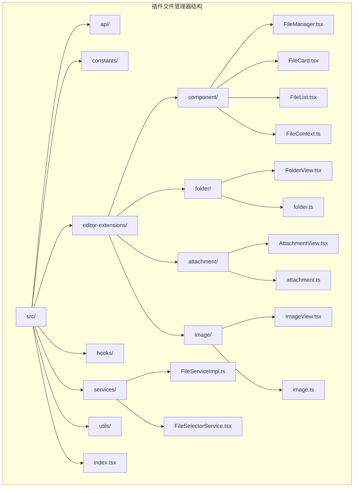
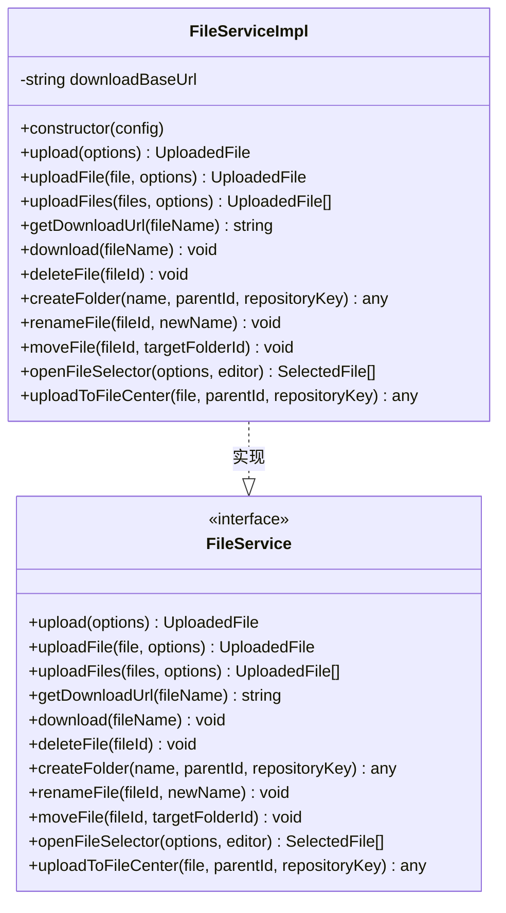
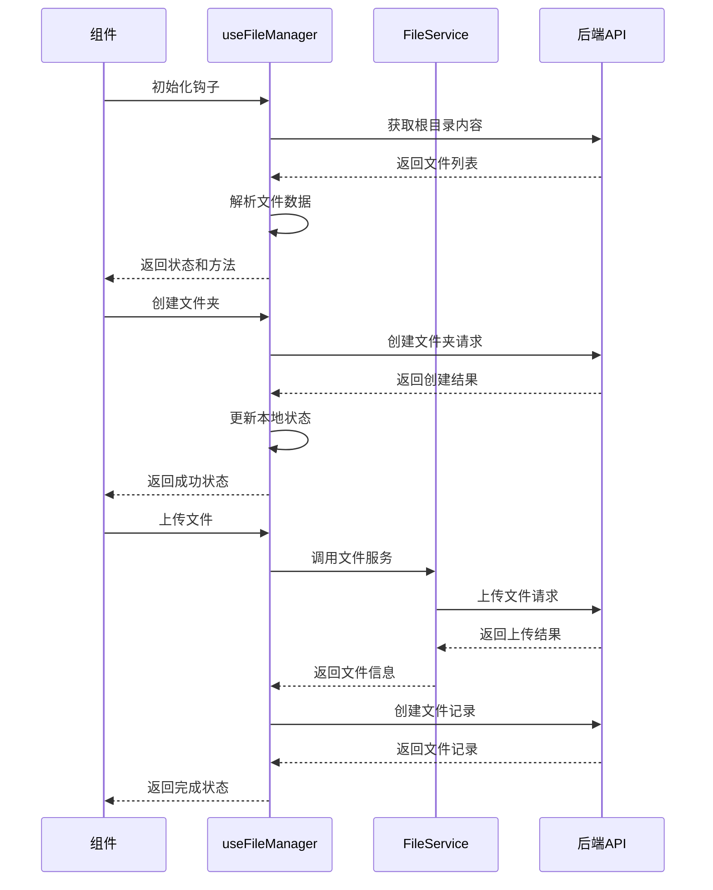
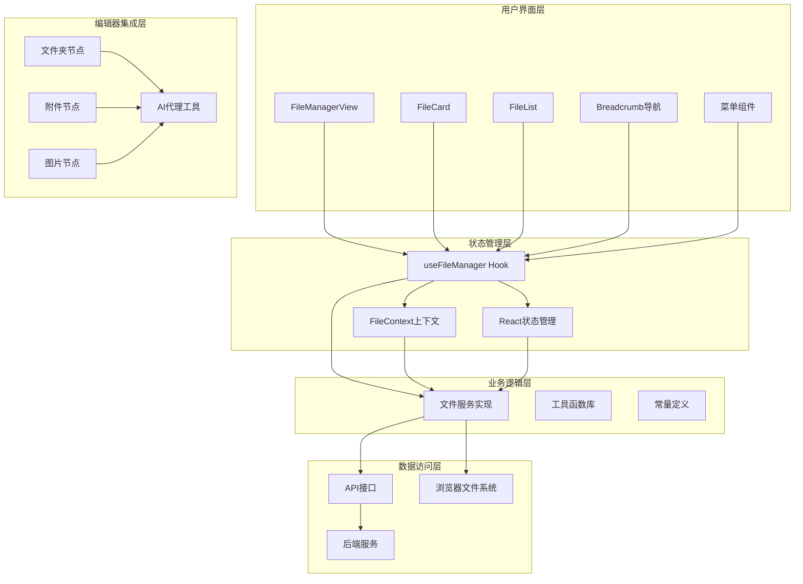
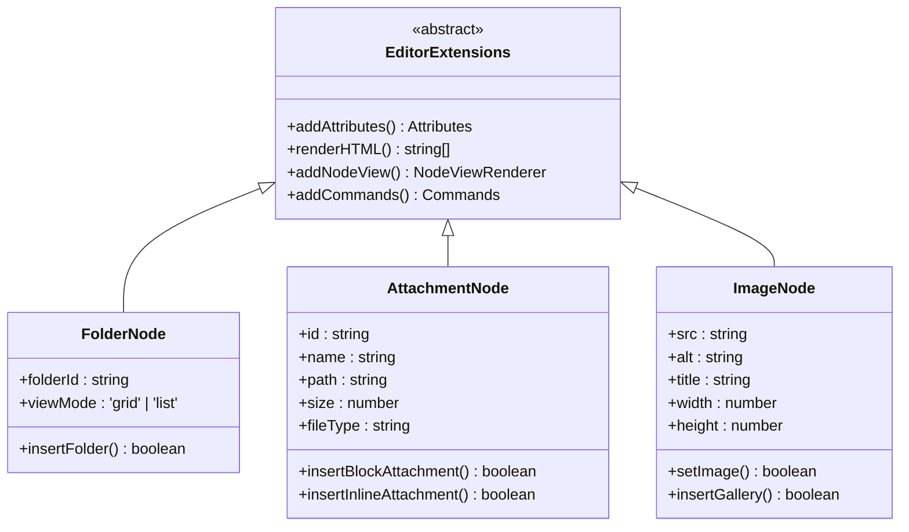
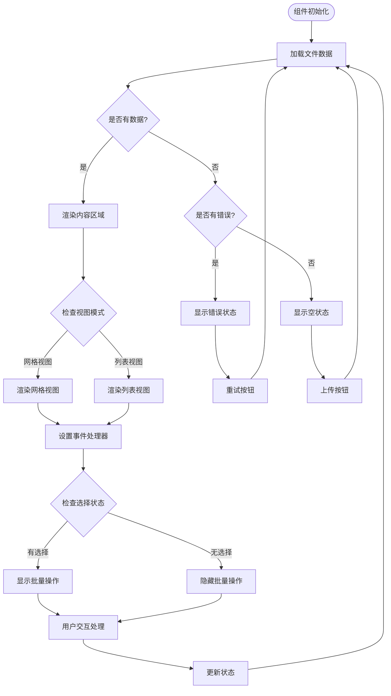
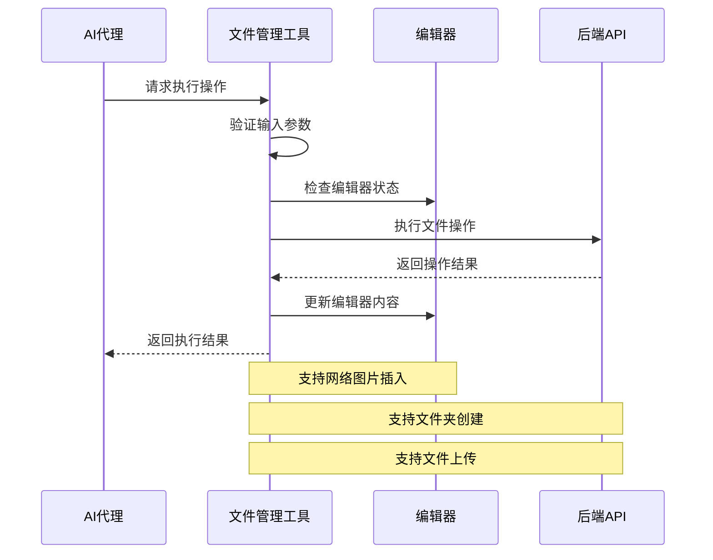
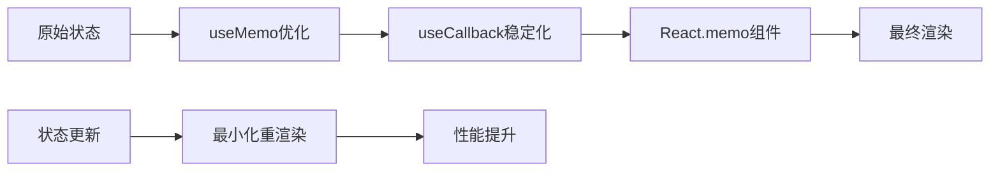

# 插件文件管理器

<cite>
**本文档引用的文件**
- [package.json](file://packages/plugin-file-manager/package.json)
- [index.tsx](file://packages/plugin-file-manager/src/index.tsx)
- [exports.ts](file://packages/plugin-file-manager/src/exports.ts)
- [FileServiceImpl.ts](file://packages/plugin-file-manager/src/services/FileServiceImpl.ts)
- [useFileManager.ts](file://packages/plugin-file-manager/src/hooks/useFileManager.ts)
- [FileManager.tsx](file://packages/plugin-file-manager/src/editor-extensions/component/FileManager.tsx)
- [FileContext.ts](file://packages/plugin-file-manager/src/editor-extensions/component/FileContext.ts)
- [folder.ts](file://packages/plugin-file-manager/src/editor-extensions/folder/folder.ts)
- [attachment.ts](file://packages/plugin-file-manager/src/editor-extensions/attachment/attachment.ts)
- [image.ts](file://packages/plugin-file-manager/src/editor-extensions/image/image.ts)
- [api/index.ts](file://packages/plugin-file-manager/src/api/index.ts)
- [fileUtils.ts](file://packages/plugin-file-manager/src/utils/fileUtils.ts)
- [tools.ts](file://packages/plugin-file-manager/src/editor-extensions/folder/tools.ts)
- [OPTIMIZATION.md](file://packages/plugin-file-manager/OPTIMIZATION.md)
</cite>

## 目录
1. [简介](#简介)
2. [项目结构](#项目结构)
3. [核心组件](#核心组件)
4. [架构概览](#架构概览)
5. [详细组件分析](#详细组件分析)
6. [依赖关系分析](#依赖关系分析)
7. [性能考虑](#性能考虑)
8. [故障排除指南](#故障排除指南)
9. [结论](#结论)

## 简介

插件文件管理器是知识库系统中的一个核心组件，为用户提供了一个功能完整的文件管理系统。该插件集成了文件上传、下载、删除、重命名、移动等操作，并提供了网格和列表两种视图模式。它基于现代前端技术栈构建，包括React、TypeScript和Tailwind CSS，为用户提供了直观易用的文件管理界面。

该插件的主要特点包括：
- 支持多种文件类型的操作和管理
- 提供网格和列表两种视图模式
- 集成AI代理工具支持
- 完整的错误处理和用户反馈机制
- 响应式设计，支持移动端访问
- 与编辑器深度集成，支持附件和文件夹节点

## 项目结构

插件文件管理器采用模块化的设计，按照功能和层次进行组织：



**图表来源**
- [index.tsx:1-51](file://packages/plugin-file-manager/src/index.tsx#L1-L51)
- [FileManager.tsx:1-668](file://packages/plugin-file-manager/src/editor-extensions/component/FileManager.tsx#L1-L668)

**章节来源**
- [package.json:1-29](file://packages/plugin-file-manager/package.json#L1-L29)
- [index.tsx:1-51](file://packages/plugin-file-manager/src/index.tsx#L1-L51)

## 核心组件

### 文件服务实现

文件服务是插件的核心组件，负责处理所有文件相关的操作。它实现了统一的文件服务接口，提供了完整的文件管理功能。



**图表来源**
- [FileServiceImpl.ts:11-175](file://packages/plugin-file-manager/src/services/FileServiceImpl.ts#L11-L175)

### 文件管理钩子

自定义Hook `useFileManager` 封装了复杂的文件管理逻辑，提供了简洁的API供组件使用。



**图表来源**
- [useFileManager.ts:11-258](file://packages/plugin-file-manager/src/hooks/useFileManager.ts#L11-L258)
- [FileServiceImpl.ts:22-53](file://packages/plugin-file-manager/src/services/FileServiceImpl.ts#L22-L53)

**章节来源**
- [FileServiceImpl.ts:1-175](file://packages/plugin-file-manager/src/services/FileServiceImpl.ts#L1-L175)
- [useFileManager.ts:1-258](file://packages/plugin-file-manager/src/hooks/useFileManager.ts#L1-L258)

## 架构概览

插件文件管理器采用了分层架构设计，确保了良好的可维护性和扩展性：



**图表来源**
- [FileManager.tsx:31-668](file://packages/plugin-file-manager/src/editor-extensions/component/FileManager.tsx#L31-L668)
- [useFileManager.ts:11-258](file://packages/plugin-file-manager/src/hooks/useFileManager.ts#L11-L258)
- [FileServiceImpl.ts:11-175](file://packages/plugin-file-manager/src/services/FileServiceImpl.ts#L11-L175)

### 编辑器扩展架构

插件与编辑器的集成通过节点扩展实现，支持在富文本编辑器中直接插入和管理文件：



**图表来源**
- [folder.ts:4-37](file://packages/plugin-file-manager/src/editor-extensions/folder/folder.ts#L4-L37)
- [attachment.ts:25-99](file://packages/plugin-file-manager/src/editor-extensions/attachment/attachment.ts#L25-L99)
- [image.ts:21-111](file://packages/plugin-file-manager/src/editor-extensions/image/image.ts#L21-L111)

**章节来源**
- [folder.ts:1-37](file://packages/plugin-file-manager/src/editor-extensions/folder/folder.ts#L1-L37)
- [attachment.ts:1-175](file://packages/plugin-file-manager/src/editor-extensions/attachment/attachment.ts#L1-L175)
- [image.ts:1-111](file://packages/plugin-file-manager/src/editor-extensions/image/image.ts#L1-L111)

## 详细组件分析

### 文件管理视图组件

FileManagerView 是整个插件的核心UI组件，提供了完整的文件管理界面：



**图表来源**
- [FileManager.tsx:256-283](file://packages/plugin-file-manager/src/editor-extensions/component/FileManager.tsx#L256-L283)

#### 文件上下文系统

文件上下文系统提供了全局的状态管理和共享功能：

| 属性名 | 类型 | 描述 | 必需 |
|--------|------|------|------|
| selectable | boolean | 是否启用选择模式 | 否 |
| currentFolderItems | FileItem[] | 当前文件夹内容 | 是 |
| selectedFiles | FileItem[] | 已选择的文件 | 是 |
| setSelectFiles | Function | 设置选择状态 | 是 |
| currentFolderId | string | 当前文件夹ID | 是 |
| setCurrentFolderId | Function | 设置当前文件夹 | 是 |
| currentItem | FileItem | 当前选中项 | 否 |
| setCurrentItem | Function | 设置当前项 | 是 |
| repoKey | string | 仓库标识符 | 是 |
| handleUpload | Function | 处理上传操作 | 是 |
| handleDelete | Function | 处理删除操作 | 是 |
| loading | boolean | 加载状态 | 否 |
| error | string | 错误信息 | 否 |

**章节来源**
- [FileManager.tsx:17-27](file://packages/plugin-file-manager/src/editor-extensions/component/FileManager.tsx#L17-L27)
- [FileContext.ts:27-58](file://packages/plugin-file-manager/src/editor-extensions/component/FileContext.ts#L27-L58)

### AI代理工具集成

插件提供了专门的AI代理工具，用于增强文件管理能力：



**图表来源**
- [tools.ts:48-105](file://packages/plugin-file-manager/src/editor-extensions/folder/tools.ts#L48-L105)

**章节来源**
- [tools.ts:1-115](file://packages/plugin-file-manager/src/editor-extensions/folder/tools.ts#L1-L115)

### 文件工具函数库

文件工具函数库提供了丰富的文件操作辅助功能：

| 函数名 | 参数 | 返回值 | 描述 |
|--------|------|--------|------|
| formatFileSize | bytes: number | string | 格式化文件大小 |
| getFileExtension | filename: string | string | 获取文件扩展名 |
| isImageFile | filename: string | boolean | 判断是否为图片文件 |
| isVideoFile | filename: string | boolean | 判断是否为视频文件 |
| isDocumentFile | filename: string | boolean | 判断是否为文档文件 |
| truncateFilename | filename: string, maxLength: number | string | 截断长文件名 |
| sortFiles | files: T[], sortBy: string, order: string | T[] | 排序文件列表 |
| filterFiles | files: T[], query: string | T[] | 过滤文件列表 |
| generateUniqueFilename | filename: string, existingNames: string[] | string | 生成唯一文件名 |
| validateFilename | filename: string | string \| null | 验证文件名 |

**章节来源**
- [fileUtils.ts:1-182](file://packages/plugin-file-manager/src/utils/fileUtils.ts#L1-L182)

## 依赖关系分析

插件文件管理器的依赖关系体现了清晰的模块化设计：

```mermaid
graph TB
subgraph "外部依赖"
A[@kn/common]
B[@kn/core]
C[@kn/editor]
D[@kn/ui]
E[@kn/icon]
F[browser-fs-access]
end
subgraph "内部包"
G[common]
H[core]
I[editor]
J[ui]
K[icon]
end
subgraph "插件文件管理器"
L[plugin-file-manager]
end
A --> L
B --> L
C --> L
D --> L
E --> L
F --> L
G --> A
H --> B
I --> C
J --> D
K --> E
```

**图表来源**
- [package.json:15-22](file://packages/plugin-file-manager/package.json#L15-L22)

### 核心依赖说明

| 依赖包 | 版本 | 用途 | 关键功能 |
|--------|------|------|----------|
| @kn/common | workspace:* | 公共类型定义 | 插件配置、文件服务接口 |
| @kn/core | workspace:* | 核心服务和API | API调用、状态管理 |
| @kn/editor | workspace:* | 编辑器集成 | 节点扩展、命令系统 |
| @kn/ui | workspace:* | UI组件库 | 基础UI组件、样式 |
| @kn/icon | workspace:* | 图标库 | 图标组件 |
| browser-fs-access | ^0.35.0 | 浏览器文件系统 | 本地文件选择 |

**章节来源**
- [package.json:15-22](file://packages/plugin-file-manager/package.json#L15-L22)

## 性能考虑

插件文件管理器在设计时充分考虑了性能优化：

### React性能优化策略

1. **组件记忆化**: 使用 `React.memo()` 包装昂贵的组件
2. **回调稳定化**: 使用 `useCallback()` 确保回调函数稳定性
3. **状态分离**: 将频繁变化的状态与稳定状态分离
4. **条件渲染**: 使用 `useMemo` 优化复杂计算结果

### 状态管理优化



### 内存管理

- 及时清理事件监听器
- 合理使用 `useEffect` 的清理函数
- 避免内存泄漏的闭包引用

## 故障排除指南

### 常见问题及解决方案

| 问题类型 | 症状 | 可能原因 | 解决方案 |
|----------|------|----------|----------|
| 文件上传失败 | 上传按钮禁用或报错 | 网络连接问题 | 检查网络连接，重试上传 |
| 文件无法打开 | 下载链接无效 | 文件路径错误 | 验证文件路径，重新上传 |
| 文件夹加载缓慢 | 页面卡顿 | 文件数量过多 | 分页加载，优化查询 |
| 编辑器集成问题 | 节点无法插入 | 编辑器版本不兼容 | 更新编辑器版本 |
| 移动端显示异常 | 布局错乱 | 响应式适配问题 | 检查CSS媒体查询 |

### 调试技巧

1. **开发者工具**: 使用浏览器开发者工具监控网络请求
2. **日志输出**: 在关键位置添加日志语句
3. **状态检查**: 使用React DevTools检查组件状态
4. **API测试**: 直接测试API端点验证后端服务

**章节来源**
- [OPTIMIZATION.md:97-113](file://packages/plugin-file-manager/OPTIMIZATION.md#L97-L113)

## 结论

插件文件管理器是一个功能完整、架构清晰的文件管理系统。它通过模块化的组件设计、完善的错误处理机制和优秀的用户体验，为知识库系统提供了强大的文件管理能力。

### 主要优势

1. **功能完整性**: 支持文件管理的所有核心功能
2. **用户体验优秀**: 直观的界面设计和流畅的交互体验
3. **性能优化良好**: 采用多种优化策略确保高效运行
4. **扩展性强**: 清晰的架构便于功能扩展和定制
5. **开发友好**: 完善的类型定义和API设计

### 技术亮点

- 基于React Hooks的状态管理模式
- 完整的TypeScript类型支持
- 响应式设计适配多端设备
- 与编辑器深度集成的扩展架构
- AI代理工具的智能化增强

该插件为知识库系统的文件管理提供了坚实的技术基础，能够满足各种复杂的文件管理需求。