# AI技能市场系统

<cite>
**本文档引用的文件**
- [README.md](file://README.md)
- [package.json](file://package.json)
- [pnpm-workspace.yaml](file://pnpm-workspace.yaml)
- [packages/core/src/index.ts](file://packages/core/src/index.ts)
- [packages/core/src/App.tsx](file://packages/core/src/App.tsx)
- [packages/core/src/ai/types.ts](file://packages/core/src/ai/types.ts)
- [packages/core/src/ai/skills/types.ts](file://packages/core/src/ai/skills/types.ts)
- [packages/core/src/ai/tools/structure-tools.ts](file://packages/core/src/ai/tools/structure-tools.ts)
- [packages/core/src/ai/tools/format-tools.ts](file://packages/core/src/ai/tools/format-tools.ts)
- [packages/common/src/ai/discovery/tool-metadata.ts](file://packages/common/src/ai/discovery/tool-metadata.ts)
- [packages/common/src/ai/discovery/tool-discovery-tools.ts](file://packages/common/src/ai/discovery/tool-discovery-tools.ts)
- [packages/common/src/ai/providers/ToolProvider.ts](file://packages/common/src/ai/providers/ToolProvider.ts)
- [packages/common/src/ai/tools/backend-tools.ts](file://packages/common/src/ai/tools/backend-tools.ts)
- [packages/core/src/ai/TOOL_ADAPTATION_GUIDE.md](file://packages/core/src/ai/TOOL_ADAPTATION_GUIDE.md)
- [packages/core/src/ai/README_TOOL_DISCOVERY.md](file://packages/core/src/ai/README_TOOL_DISCOVERY.md)
- [packages/plugin-main/src/index.tsx](file://packages/plugin-main/src/index.tsx)
- [apps/vite/src/main.tsx](file://apps/vite/src/main.tsx)
- [docs/api/skills-api.md](file://docs/api/skills-api.md)
- [packages/core/src/ai/ARCHITECTURE.md](file://packages/core/src/ai/ARCHITECTURE.md)
- [packages/core/src/ai/INTEGRATION_GUIDE.md](file://packages/core/src/ai/INTEGRATION_GUIDE.md)
- [packages/core/src/ai/skills/skill-registry.ts](file://packages/core/src/ai/skills/skill-registry.ts)
- [packages/core/src/ai/providers/ToolProvider.ts](file://packages/core/src/ai/providers/ToolProvider.ts)
</cite>

## 更新摘要
**所做更改**
- 更新了essential tools配置，从20+工具精简至13个核心工具
- 移除了getNodeAtPosition、getDocumentSize等工具的essential标记
- 优化了工具分类体系，移除了web分类的描述
- 更新了技能API文档中optionalTools数组的描述
- 增强了渐进式工具发现系统的架构说明

## 目录
1. [简介](#简介)
2. [项目结构](#项目结构)
3. [核心组件](#核心组件)
4. [架构概览](#架构概览)
5. [详细组件分析](#详细组件分析)
6. [AI工具系统增强](#ai工具系统增强)
7. [依赖关系分析](#依赖关系分析)
8. [性能考虑](#性能考虑)
9. [故障排除指南](#故障排除指南)
10. [结论](#结论)

## 简介

AI技能市场系统是一个基于现代Web技术构建的协作知识管理平台，集成了丰富的富文本编辑、实时协作、AI智能功能和广泛的插件生态系统。该系统采用TurboMonorepo架构，支持桌面应用、网页应用和移动端的多平台部署。

### 核心特性

- **富文本编辑器**：基于Tiptap的协作编辑支持
- **实时协作**：多用户编辑与Hocuspocus后端集成
- **插件架构**：可扩展的插件系统支持自定义功能
- **AI集成**：AI驱动的文本生成、图像创建和内容转换
- **渐进式工具发现**：智能工具加载和管理机制
- **多维表格**：支持多种视图类型的电子表格
- **可视化绘图**：支持Excalidraw、DrawIO、Mermaid等绘图工具
- **文件管理**：内置文档组织系统
- **国际化**：完整的多语言支持

## 项目结构

该项目采用TurboMonorepo架构，主要包含以下核心部分：

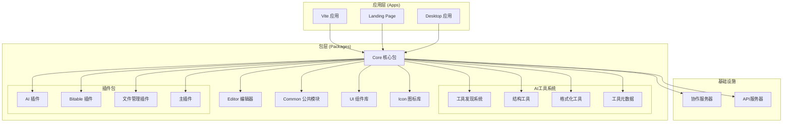

**图表来源**
- [pnpm-workspace.yaml:1-4](file://pnpm-workspace.yaml#L1-L4)
- [package.json:1-120](file://package.json#L1-L120)

**章节来源**
- [README.md:66-97](file://README.md#L66-L97)
- [pnpm-workspace.yaml:1-4](file://pnpm-workspace.yaml#L1-L4)

## 核心组件

### 应用入口 (App)

应用入口位于核心包中，负责整个应用的初始化和路由管理：

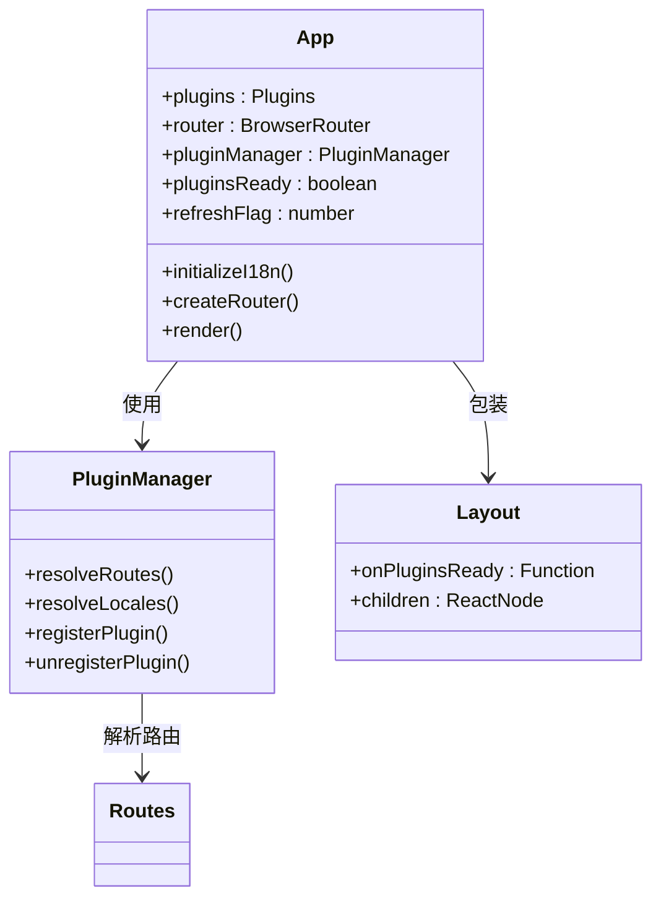

**图表来源**
- [packages/core/src/App.tsx:56-162](file://packages/core/src/App.tsx#L56-L162)
- [packages/core/src/index.ts:1-23](file://packages/core/src/index.ts#L1-L23)

### AI技能系统

AI技能系统是整个平台的核心智能组件，提供了强大的工具执行和技能管理能力：

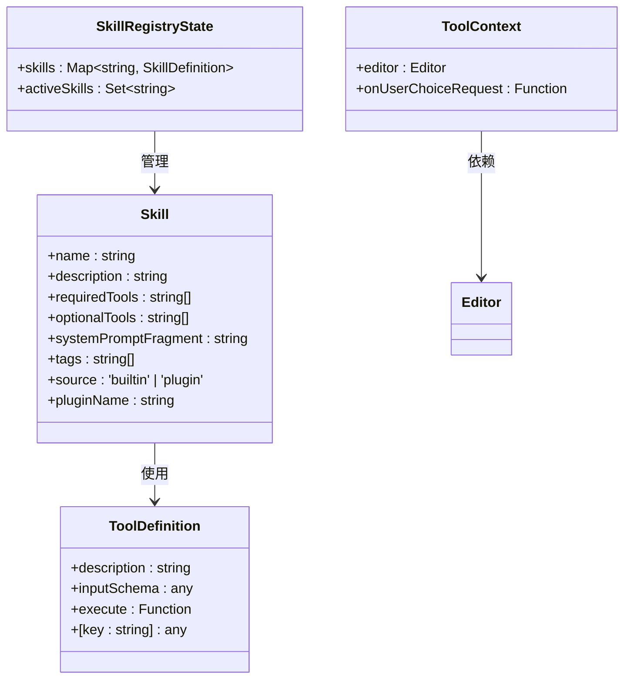

**图表来源**
- [packages/core/src/ai/types.ts:138-165](file://packages/core/src/ai/types.ts#L138-L165)
- [packages/core/src/ai/skills/types.ts:10-37](file://packages/core/src/ai/skills/types.ts#L10-L37)

**章节来源**
- [packages/core/src/App.tsx:1-162](file://packages/core/src/App.tsx#L1-L162)
- [packages/core/src/ai/types.ts:1-165](file://packages/core/src/ai/types.ts#L1-L165)
- [packages/core/src/ai/skills/types.ts:1-37](file://packages/core/src/ai/skills/types.ts#L1-L37)

## 架构概览

系统采用分层架构设计，确保了良好的可维护性和扩展性：

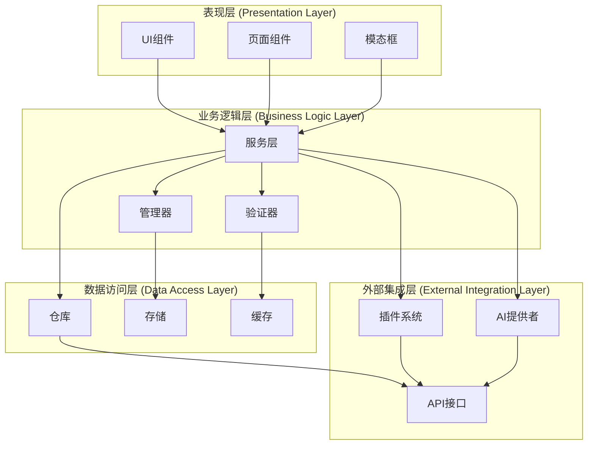

**图表来源**
- [packages/core/src/App.tsx:1-162](file://packages/core/src/App.tsx#L1-L162)
- [packages/plugin-main/src/index.tsx:1-354](file://packages/plugin-main/src/index.tsx#L1-L354)

## 详细组件分析

### 插件系统架构

插件系统是整个平台的扩展核心，支持动态加载和管理各种功能模块：

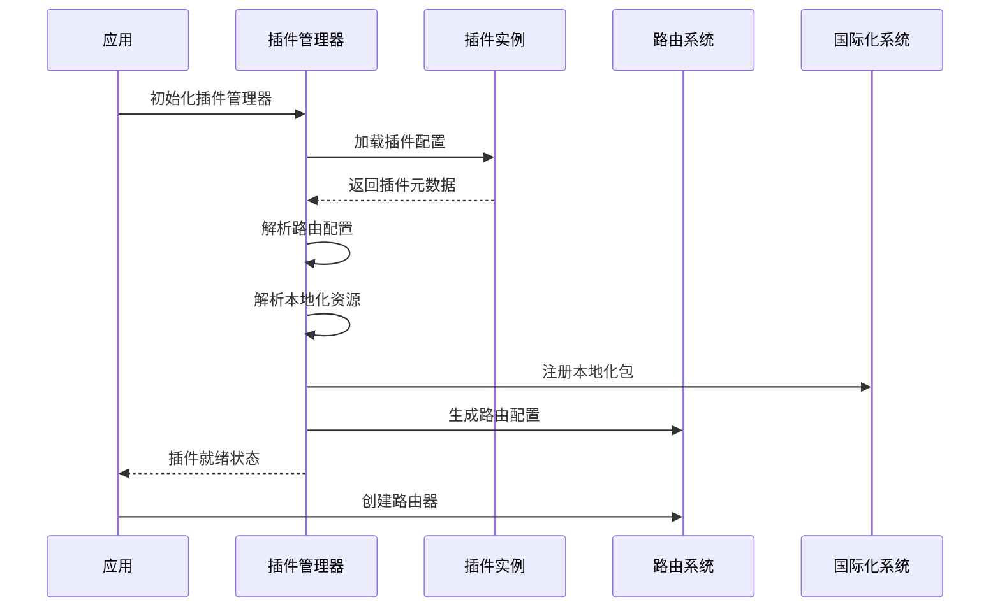

**图表来源**
- [packages/core/src/App.tsx:102-148](file://packages/core/src/App.tsx#L102-L148)
- [packages/plugin-main/src/index.tsx:29-74](file://packages/plugin-main/src/index.tsx#L29-L74)

### AI技能执行流程

AI技能系统提供了完整的工具发现、加载和执行机制：

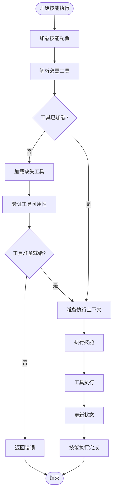

**图表来源**
- [packages/core/src/ai/types.ts:138-165](file://packages/core/src/ai/types.ts#L138-L165)
- [packages/core/src/ai/skills/types.ts:19-37](file://packages/core/src/ai/skills/types.ts#L19-L37)

### 主插件功能

主插件提供了核心的页面管理和空间功能：

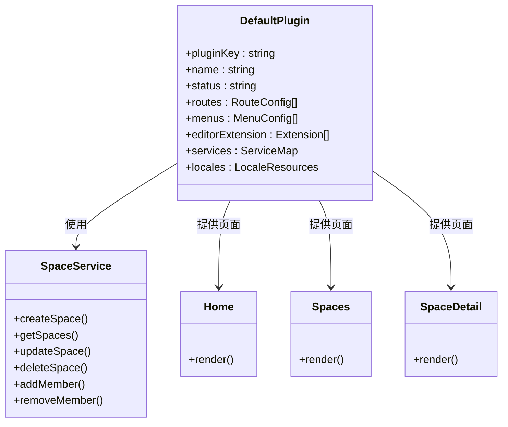

**图表来源**
- [packages/plugin-main/src/index.tsx:25-74](file://packages/plugin-main/src/index.tsx#L25-L74)

**章节来源**
- [packages/plugin-main/src/index.tsx:1-354](file://packages/plugin-main/src/index.tsx#L1-L354)

## AI工具系统增强

### 渐进式工具发现系统

系统引入了全新的渐进式工具发现机制，通过智能元数据管理和按需加载策略，显著提升了AI工具的使用效率：

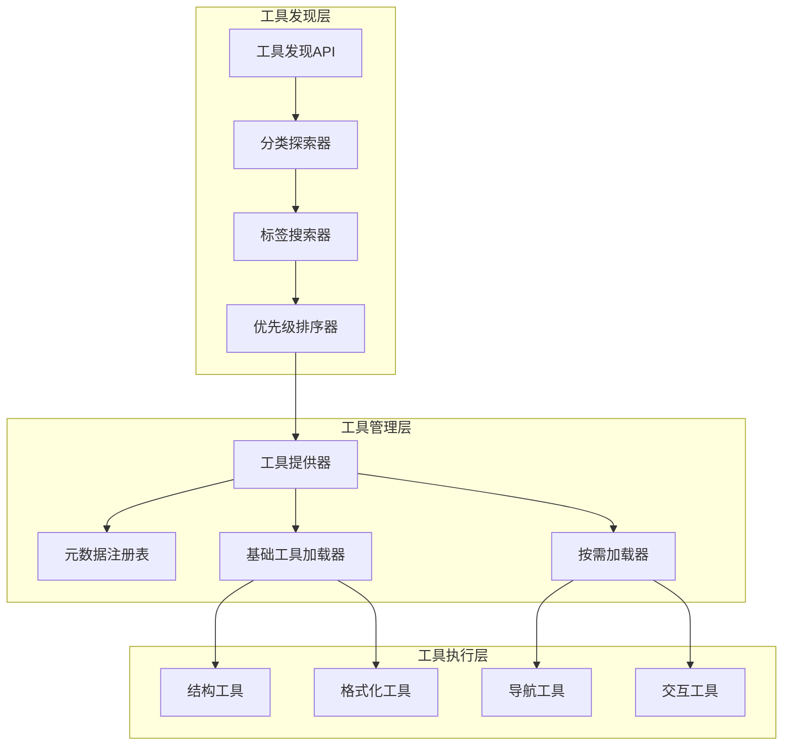

**图表来源**
- [packages/common/src/ai/discovery/tool-discovery-tools.ts:21-156](file://packages/common/src/ai/discovery/tool-discovery-tools.ts#L21-L156)
- [packages/common/src/ai/discovery/tool-metadata.ts:42-390](file://packages/common/src/ai/discovery/tool-metadata.ts#L42-L390)

### 工具元数据系统更新

**更新** essential tools从20+工具精简至13个核心工具，移除了getNodeAtPosition、getDocumentSize等工具

系统实现了完整的工具元数据管理系统，为工具发现和智能推荐提供支持：

#### essential tools配置更新

**更新** essential tools配置已精简，从原来的20+工具减少至13个核心工具：

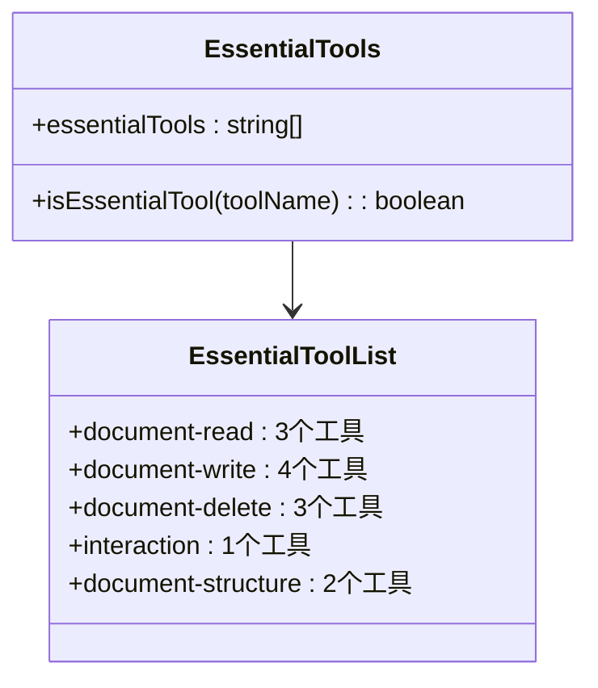

**图表来源**
- [packages/common/src/ai/discovery/tool-metadata.ts:11-30](file://packages/common/src/ai/discovery/tool-metadata.ts#L11-L30)

#### 分类描述系统更新

**更新** 移除了web分类的描述，反映了Web搜索功能不再作为标准可选工具

系统为每个工具分类提供了详细的描述信息，帮助AI代理更好地理解工具的功能和用途：

| 分类 | 工具数量 | 描述 |
|------|----------|------|
| document-read | 3 | 文档读取工具 - 用于获取文档结构、内容和搜索 |
| document-write | 4 | 文档写入工具 - 用于插入、更新和替换内容 |
| document-delete | 3 | 文档删除工具 - 用于删除内容和块 |
| document-structure | 2 | 结构工具 - 用于转换块类型、移动块、格式化文本、表格操作 |
| layout | 7 | 布局工具 - 用于管理多列布局 |
| interaction | 1 | 交互工具 - 用于与用户交互 |
| plugin | N | 插件工具 - 来自已安装插件的工具 |
| discovery | 4 | 发现工具 - 用于发现和加载其他工具 |

**章节来源**
- [packages/common/src/ai/discovery/tool-metadata.ts:29-40](file://packages/common/src/ai/discovery/tool-metadata.ts#L29-L40)
- [packages/core/src/ai/TOOL_ADAPTATION_GUIDE.md:28-367](file://packages/core/src/ai/TOOL_ADAPTATION_GUIDE.md#L28-L367)

### 技能API文档更新

**更新** 更新了optionalTools数组的描述，反映了Web搜索功能不再作为标准可选工具

技能API文档反映了最新的工具配置要求：

#### 技能定义更新

技能定义中的optionalTools数组现在反映了移除Web搜索功能后的实际配置：

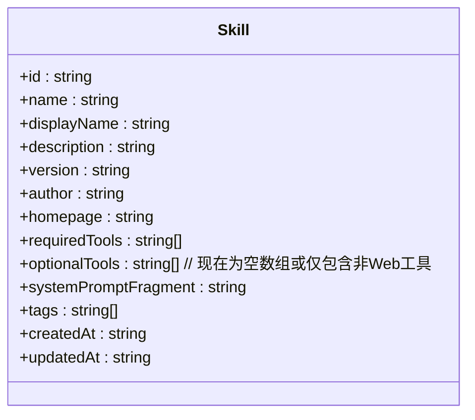

**图表来源**
- [docs/api/skills-api.md:17-33](file://docs/api/skills-api.md#L17-L33)

#### 市场技能示例更新

市场技能示例现在展示了更新后的工具配置：

| 字段 | 当前值 | 说明 |
|------|--------|------|
| requiredTools | ["getDocumentStructure", "readChunk", "searchInDocument", "replaceContent", "askUserChoice"] | 必需工具列表 |
| optionalTools | [] | 可选工具列表（已移除Web搜索功能） |
| systemPromptFragment | "## Translation Assistant Skill Active..." | 专用系统提示片段 |

**章节来源**
- [docs/api/skills-api.md:381-415](file://docs/api/skills-api.md#L381-L415)

### 工具提供器架构更新

**更新** 优化了工具加载机制，essential tools现在包含更精确的核心工具集合

工具提供器实现了更高效的工具管理机制：

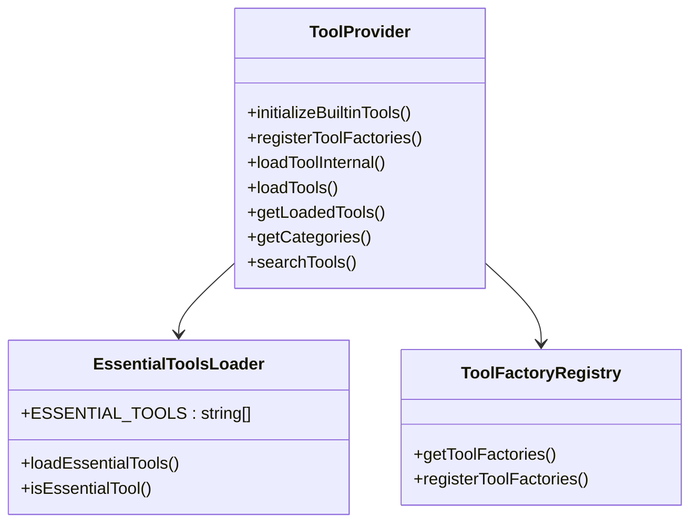

**图表来源**
- [packages/common/src/ai/providers/ToolProvider.ts:34-312](file://packages/common/src/ai/providers/ToolProvider.ts#L34-L312)

**章节来源**
- [packages/common/src/ai/providers/ToolProvider.ts:69-72](file://packages/common/src/ai/providers/ToolProvider.ts#L69-L72)

## 依赖关系分析

系统采用模块化的依赖管理策略，确保各组件间的松耦合：

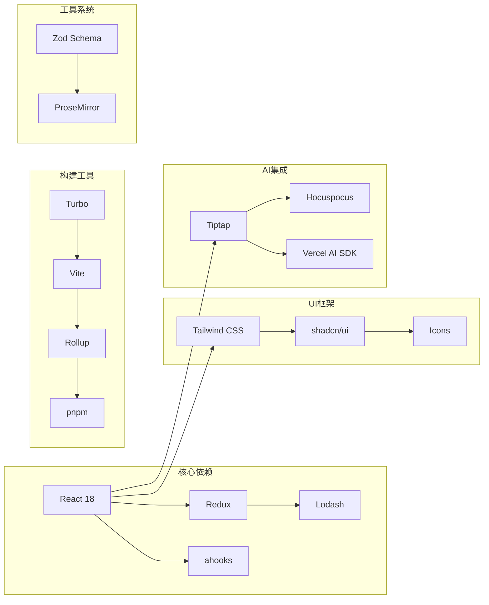

**图表来源**
- [package.json:51-107](file://package.json#L51-L107)
- [README.md:43-65](file://README.md#L43-L65)

**章节来源**
- [package.json:1-120](file://package.json#L1-L120)

## 性能考虑

系统在多个层面进行了性能优化：

### 构建性能
- 使用Turbo构建系统实现增量构建
- 模块化打包减少初始加载时间
- 代码分割和懒加载策略

### 运行时性能
- 插件按需加载机制
- 工具缓存和复用
- 内存管理和垃圾回收优化

### AI性能优化
- 工具执行结果缓存
- 批量处理和队列管理
- 异步执行和并发控制
- 渐进式工具发现减少AI上下文大小

### 工具发现性能优化
- 基础工具预加载策略
- 智能元数据缓存
- 按需加载机制
- 工具分类索引优化

## 故障排除指南

### 常见问题及解决方案

**插件加载失败**
- 检查插件依赖完整性
- 验证插件配置正确性
- 查看浏览器控制台错误信息

**AI工具执行异常**
- 确认AI API密钥配置
- 检查网络连接状态
- 验证工具参数格式

**工具发现系统问题**
- 确认工具元数据定义完整
- 检查工具分类注册
- 验证工具优先级设置
- 查看工具加载状态

**路由跳转问题**
- 确认插件路由配置
- 检查路径参数匹配
- 验证权限配置

**技能配置问题**
- 检查optionalTools数组是否为空
- 确认requiredTools配置正确
- 验证技能定义格式

**章节来源**
- [packages/core/src/App.tsx:65-76](file://packages/core/src/App.tsx#L65-L76)

## 结论

AI技能市场系统是一个功能完整、架构清晰的现代化知识管理平台。通过采用插件化架构、AI集成技术和渐进式工具发现系统，系统为用户提供了强大的协作能力和智能化功能。

### 系统优势

- **智能工具管理**：通过元数据系统和分类机制，实现工具的智能发现和推荐
- **性能优化**：渐进式工具发现显著减少了AI上下文大小和初始化时间
- **扩展性强**：模块化的工具系统支持轻松添加新工具和功能
- **用户体验**：直观的工具分类和搜索功能提升了AI代理的使用效率

### 未来发展方向

- **完善Gantt图表、日历视图等功能**
- **增强移动端响应式设计**
- **开发插件市场和模板市场**
- **实现离线模式支持**
- **扩展AI工具生态系统的规模**
- **优化工具发现算法的智能化程度**

通过持续的技术创新和功能扩展，AI技能市场系统将继续为用户提供更加智能、高效的知识管理体验。