# AI技能市场系统

<cite>
**本文档引用的文件**
- [README.md](file://README.md)
- [package.json](file://package.json)
- [pnpm-workspace.yaml](file://pnpm-workspace.yaml)
- [packages/core/src/index.ts](file://packages/core/src/index.ts)
- [packages/core/src/App.tsx](file://packages/core/src/App.tsx)
- [packages/core/src/ai/types.ts](file://packages/core/src/ai/types.ts)
- [packages/core/src/ai/skills/types.ts](file://packages/core/src/ai/skills/types.ts)
- [packages/common/src/ai/types.ts](file://packages/common/src/ai/types.ts)
- [packages/common/src/ai/skills/skill-registry.ts](file://packages/common/src/ai/skills/skill-registry.ts)
- [packages/common/src/ai/skills/skillsmp/use-skillsmp.ts](file://packages/common/src/ai/skills/skillsmp/use-skillsmp.ts)
- [packages/common/src/ai/skills/types.ts](file://packages/common/src/ai/skills/types.ts)
- [packages/core/src/ai/ARCHITECTURE.md](file://packages/core/src/ai/ARCHITECTURE.md)
- [packages/core/src/ai/INTEGRATION_GUIDE.md](file://packages/core/src/ai/INTEGRATION_GUIDE.md)
- [docs/api/skills-api.md](file://docs/api/skills-api.md)
- [packages/core/src/components/Skills/SkillManager.tsx](file://packages/core/src/components/Skills/SkillManager.tsx)
- [packages/core/src/components/Skills/SkillsMPMarketplace.tsx](file://packages/core/src/components/Skills/SkillsMPMarketplace.tsx)
</cite>

## 更新摘要
**所做更改**
- 移除了渐进式工具发现系统相关文档，包括工具发现API、分类探索器、标签搜索器等组件
- 移除了技能发现工具、技能管理工具、工具发现工具等核心功能的文档
- 更新了技能API文档，反映optionalTools数组的简化
- 移除了工具元数据系统中web分类的描述
- 更新了技能市场系统的架构说明，反映SkillsMP集成的现状

## 目录
1. [简介](#简介)
2. [项目结构](#项目结构)
3. [核心组件](#核心组件)
4. [架构概览](#架构概览)
5. [详细组件分析](#详细组件分析)
6. [AI技能系统现状](#ai技能系统现状)
7. [依赖关系分析](#依赖关系分析)
8. [性能考虑](#性能考虑)
9. [故障排除指南](#故障排除指南)
10. [结论](#结论)

## 简介

AI技能市场系统是一个基于现代Web技术构建的协作知识管理平台，集成了丰富的富文本编辑、实时协作、AI智能功能和广泛的插件生态系统。该系统采用TurboMonorepo架构，支持桌面应用、网页应用和移动端的多平台部署。

### 核心特性

- **富文本编辑器**：基于Tiptap的协作编辑支持
- **实时协作**：多用户编辑与Hocuspocus后端集成
- **插件架构**：可扩展的插件系统支持自定义功能
- **AI集成**：AI驱动的文本生成、图像创建和内容转换
- **技能市场**：集成SkillsMP技能市场，支持技能安装和管理
- **多维表格**：支持多种视图类型的电子表格
- **可视化绘图**：支持Excalidraw、DrawIO、Mermaid等绘图工具
- **文件管理**：内置文档组织系统
- **国际化**：完整的多语言支持

## 项目结构

该项目采用TurboMonorepo架构，主要包含以下核心部分：

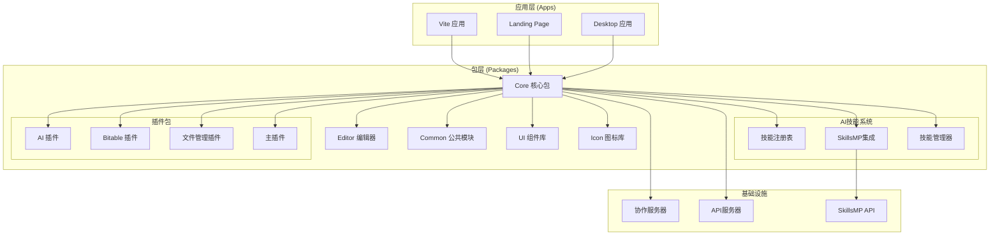

**图表来源**
- [pnpm-workspace.yaml:1-4](file://pnpm-workspace.yaml#L1-L4)
- [package.json:1-120](file://package.json#L1-L120)

**章节来源**
- [README.md:66-97](file://README.md#L66-L97)
- [pnpm-workspace.yaml:1-4](file://pnpm-workspace.yaml#L1-L4)

## 核心组件

### 应用入口 (App)

应用入口位于核心包中，负责整个应用的初始化和路由管理：

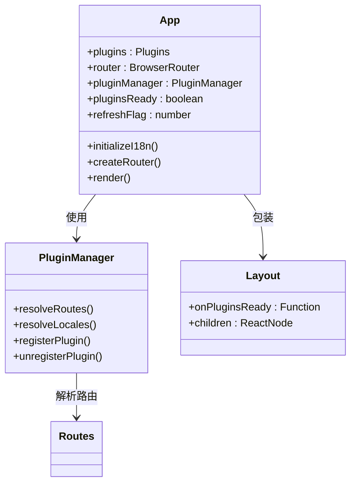

**图表来源**
- [packages/core/src/App.tsx:56-162](file://packages/core/src/App.tsx#L56-L162)
- [packages/core/src/index.ts:1-23](file://packages/core/src/index.ts#L1-L23)

### AI技能系统

AI技能系统是整个平台的核心智能组件，提供了技能注册、管理和SkillsMP集成能力：

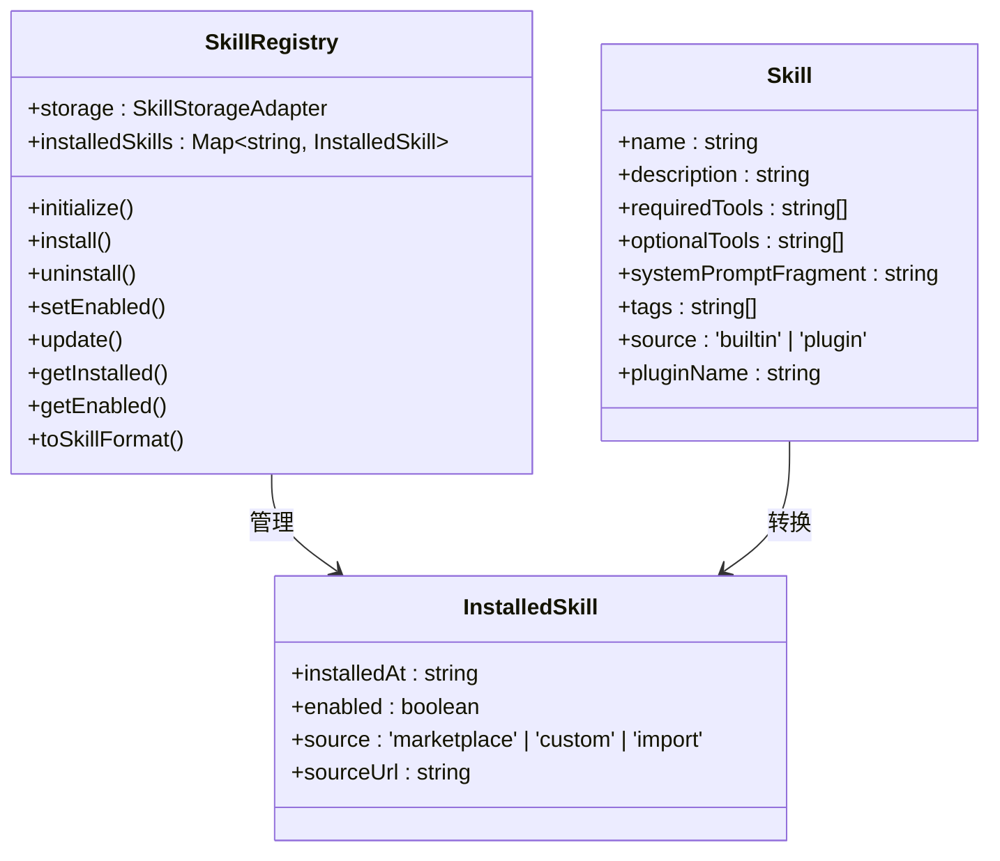

**图表来源**
- [packages/common/src/ai/skills/skill-registry.ts:161-420](file://packages/common/src/ai/skills/skill-registry.ts#L161-L420)
- [packages/common/src/ai/skills/types.ts:11-17](file://packages/common/src/ai/skills/types.ts#L11-L17)

**章节来源**
- [packages/core/src/App.tsx:1-162](file://packages/core/src/App.tsx#L1-L162)
- [packages/common/src/ai/skills/skill-registry.ts:1-420](file://packages/common/src/ai/skills/skill-registry.ts#L1-420)
- [packages/common/src/ai/skills/types.ts:1-17](file://packages/common/src/ai/skills/types.ts#L1-L17)

## 架构概览

系统采用分层架构设计，确保了良好的可维护性和扩展性：

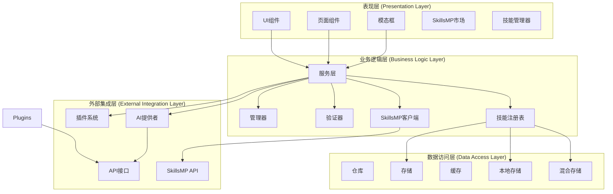

**图表来源**
- [packages/core/src/App.tsx:1-162](file://packages/core/src/App.tsx#L1-L162)
- [packages/core/src/components/Skills/SkillManager.tsx:268-336](file://packages/core/src/components/Skills/SkillManager.tsx#L268-L336)

## 详细组件分析

### 插件系统架构

插件系统是整个平台的扩展核心，支持动态加载和管理各种功能模块：

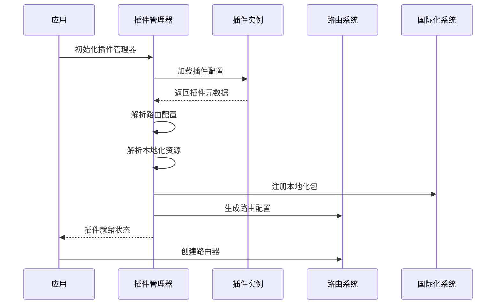

**图表来源**
- [packages/core/src/App.tsx:102-148](file://packages/core/src/App.tsx#L102-L148)
- [packages/plugin-main/src/index.tsx:29-74](file://packages/plugin-main/src/index.tsx#L29-L74)

### SkillsMP技能市场集成

系统集成了SkillsMP技能市场，提供技能搜索、安装和管理功能：

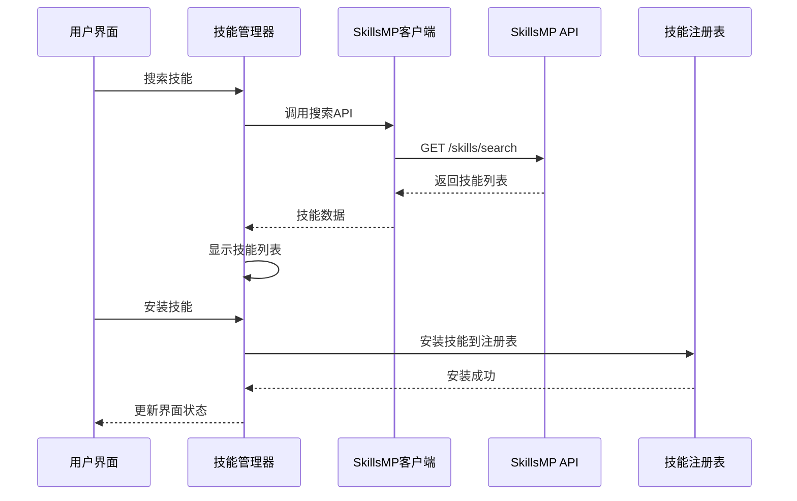

**图表来源**
- [packages/common/src/ai/skills/skillsmp/use-skillsmp.ts:68-111](file://packages/common/src/ai/skills/skillsmp/use-skillsmp.ts#L68-L111)
- [packages/core/src/components/Skills/SkillManager.tsx:282-292](file://packages/core/src/components/Skills/SkillManager.tsx#L282-L292)

### 技能管理器功能

技能管理器提供了完整的技能生命周期管理：

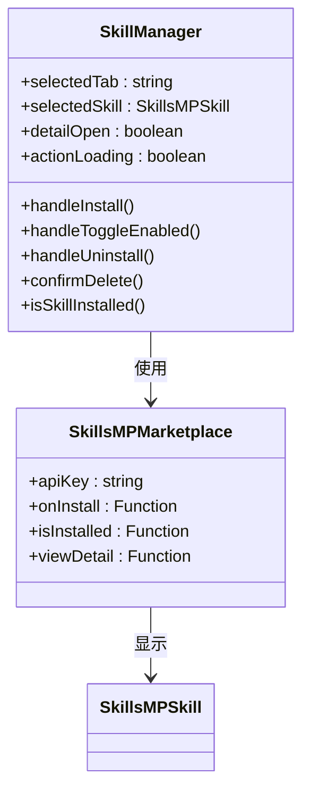

**图表来源**
- [packages/core/src/components/Skills/SkillManager.tsx:268-336](file://packages/core/src/components/Skills/SkillManager.tsx#L268-L336)

**章节来源**
- [packages/core/src/components/Skills/SkillManager.tsx:1-336](file://packages/core/src/components/Skills/SkillManager.tsx#L1-L336)
- [packages/core/src/components/Skills/SkillsMPMarketplace.tsx:285-314](file://packages/core/src/components/Skills/SkillsMPMarketplace.tsx#L285-L314)

## AI技能系统现状

### SkillsMP集成架构

系统当前采用SkillsMP作为技能市场解决方案，提供技能搜索、安装和管理功能：

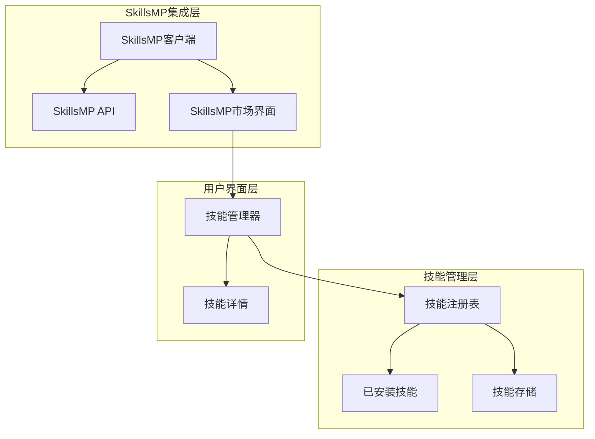

**图表来源**
- [packages/common/src/ai/skills/skillsmp/use-skillsmp.ts:41-190](file://packages/common/src/ai/skills/skillsmp/use-skillsmp.ts#L41-L190)
- [packages/common/src/ai/skills/skill-registry.ts:161-420](file://packages/common/src/ai/skills/skill-registry.ts#L161-L420)

### 技能API文档更新

技能API文档反映了当前的SkillsMP集成状态：

#### 技能定义更新

技能定义中的optionalTools数组现在为空，反映了SkillsMP集成的简化配置：

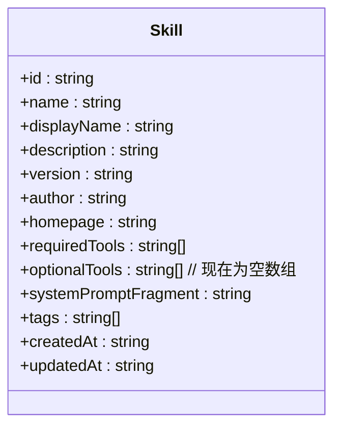

**图表来源**
- [docs/api/skills-api.md:17-33](file://docs/api/skills-api.md#L17-L33)

#### SkillsMP市场技能示例

SkillsMP市场技能示例展示了当前的技能配置：

| 字段 | 当前值 | 说明 |
|------|--------|------|
| requiredTools | ["getDocumentStructure", "readChunk", "replaceContent"] | 必需工具列表 |
| optionalTools | [] | 可选工具列表（已简化） |
| systemPromptFragment | "## Translation Assistant Skill Active..." | 专用系统提示片段 |
| downloads | 1500 | 下载次数 |
| rating | 4.8 | 评分 |
| verified | true | 认证状态 |
| featured | true | 推荐状态 |

**章节来源**
- [docs/api/skills-api.md:340-415](file://docs/api/skills-api.md#L340-L415)

### 技能存储系统

技能存储系统提供了灵活的存储适配器：

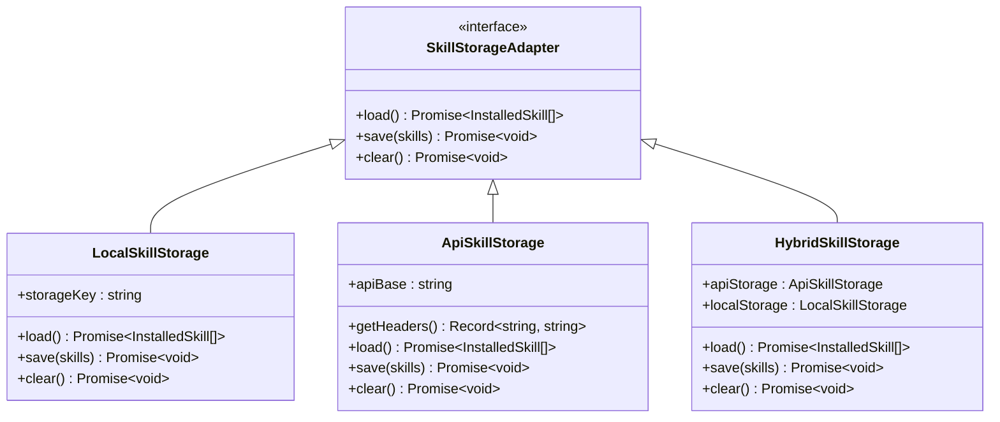

**图表来源**
- [packages/common/src/ai/skills/skill-registry.ts:34-158](file://packages/common/src/ai/skills/skill-registry.ts#L34-L158)

**章节来源**
- [packages/common/src/ai/skills/skill-registry.ts:1-420](file://packages/common/src/ai/skills/skill-registry.ts#L1-L420)

## 依赖关系分析

系统采用模块化的依赖管理策略，确保各组件间的松耦合：

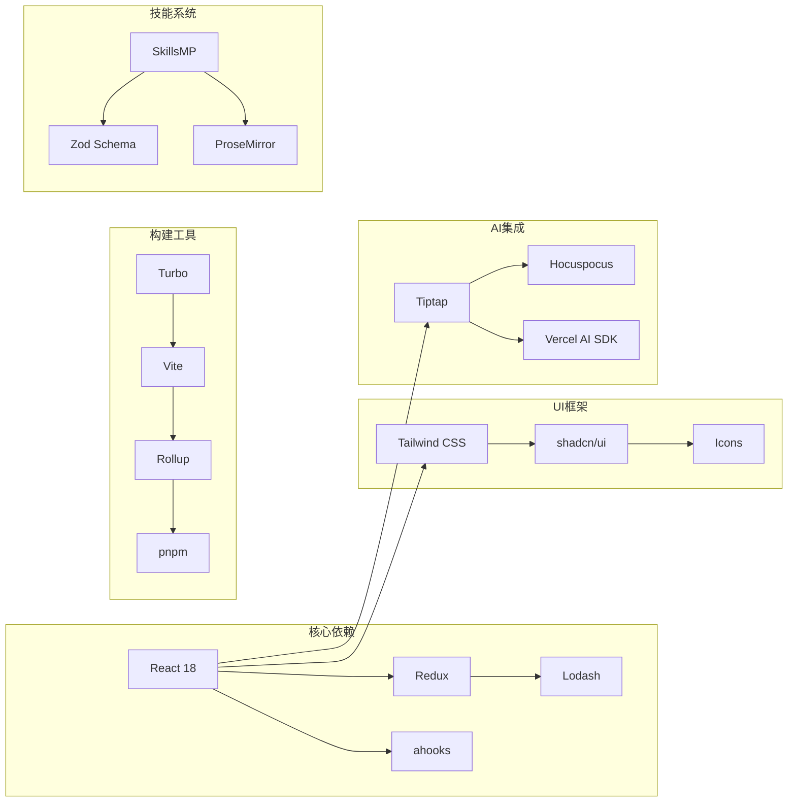

**图表来源**
- [package.json:51-107](file://package.json#L51-L107)
- [README.md:43-65](file://README.md#L43-L65)

**章节来源**
- [package.json:1-120](file://package.json#L1-L120)

## 性能考虑

系统在多个层面进行了性能优化：

### 构建性能
- 使用Turbo构建系统实现增量构建
- 模块化打包减少初始加载时间
- 代码分割和懒加载策略

### 运行时性能
- 插件按需加载机制
- 技能缓存和复用
- 内存管理和垃圾回收优化

### SkillsMP集成性能优化
- 技能搜索结果缓存
- 分页加载机制
- 异步安装和更新
- 技能状态管理优化

### AI性能优化
- 工具执行结果缓存
- 批量处理和队列管理
- 异步执行和并发控制

## 故障排除指南

### 常见问题及解决方案

**插件加载失败**
- 检查插件依赖完整性
- 验证插件配置正确性
- 查看浏览器控制台错误信息

**SkillsMP技能市场问题**
- 确认SkillsMP API密钥配置
- 检查网络连接状态
- 验证技能搜索参数
- 查看SkillsMP API响应状态

**技能安装失败**
- 确认技能兼容性
- 检查技能依赖工具
- 验证技能定义格式
- 查看技能存储状态

**技能管理问题**
- 确认技能注册表状态
- 检查技能启用状态
- 验证技能存储权限
- 查看技能更新日志

**路由跳转问题**
- 确认插件路由配置
- 检查路径参数匹配
- 验证权限配置

**章节来源**
- [packages/core/src/App.tsx:65-76](file://packages/core/src/App.tsx#L65-L76)

## 结论

AI技能市场系统经过重构后，采用了SkillsMP作为技能市场解决方案，提供了更加简洁和高效的技能管理能力。系统通过模块化的架构设计，实现了技能市场的无缝集成，同时保持了良好的性能和可维护性。

### 系统优势

- **SkillsMP集成**：通过SkillsMP提供标准化的技能市场体验
- **性能优化**：SkillsMP集成减少了AI上下文大小和初始化时间
- **扩展性强**：模块化的技能系统支持轻松添加新技能
- **用户体验**：直观的技能市场界面提升了技能管理效率

### 未来发展方向

- **SkillsMP功能增强**：进一步优化技能搜索和推荐算法
- **技能质量评估**：实现技能评分和质量控制系统
- **技能生态建设**：建立技能开发者社区和审核机制
- **离线技能支持**：开发离线技能安装和管理功能
- **技能版本管理**：实现技能版本控制和回滚机制
- **技能性能监控**：建立技能使用统计和性能分析系统

通过持续的技术创新和功能扩展，AI技能市场系统将继续为用户提供更加智能、高效的知识管理体验。