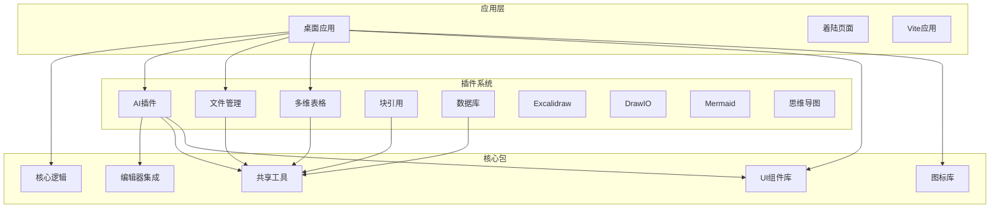
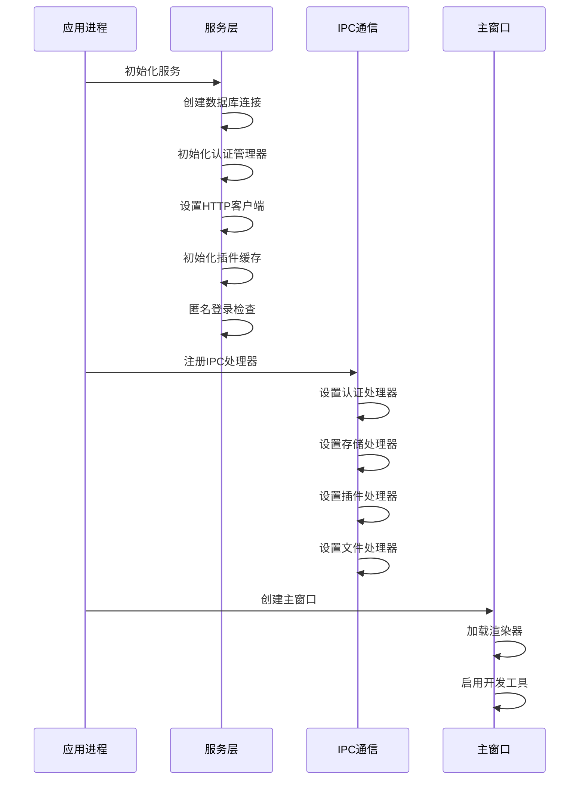
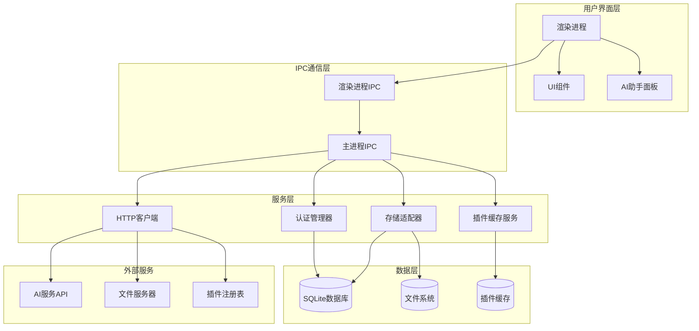
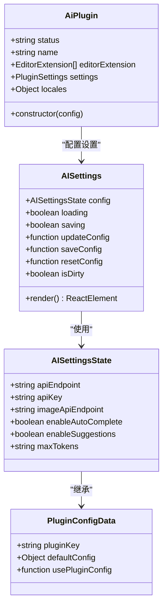
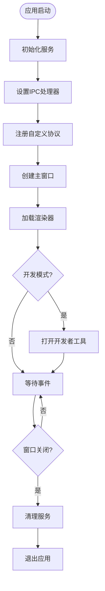
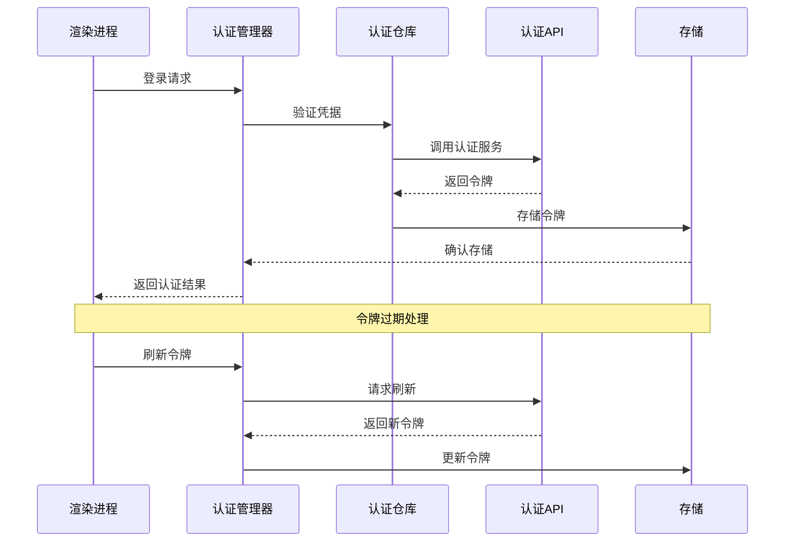
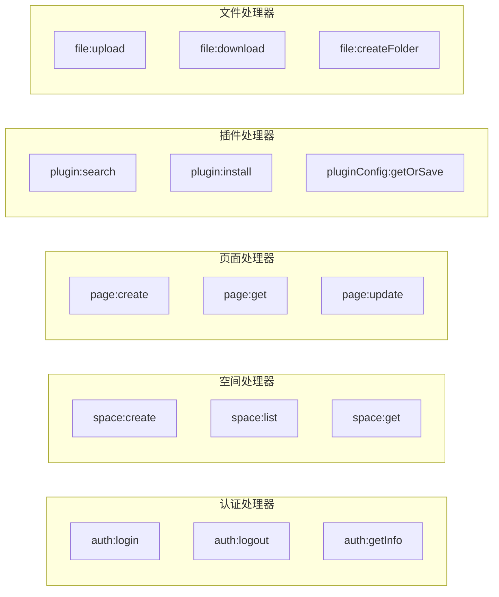
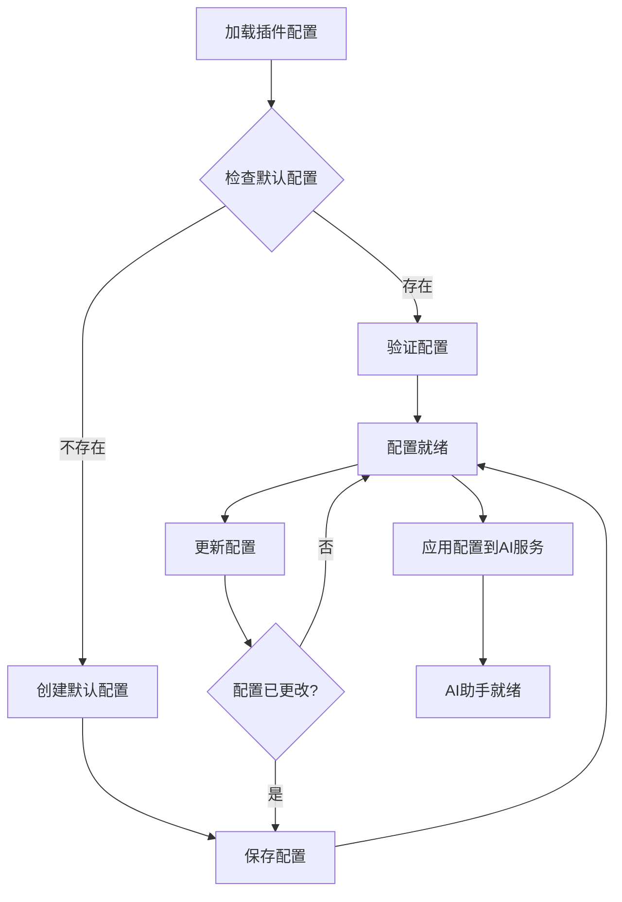
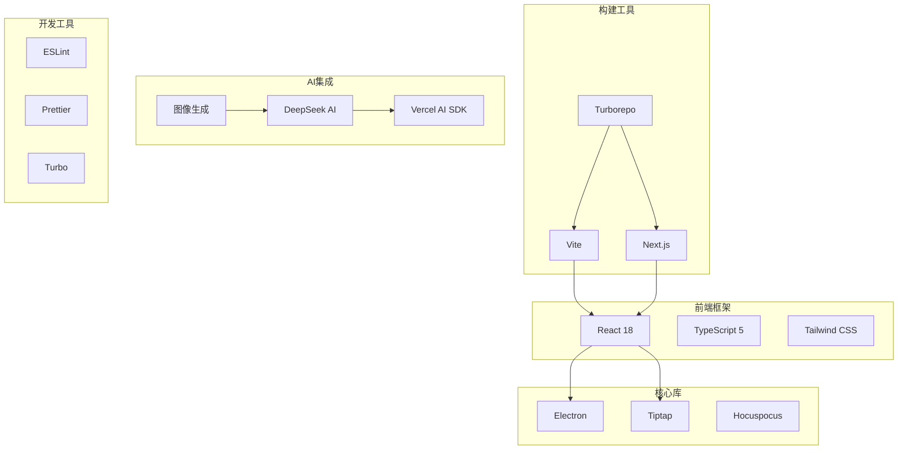

# AI助手面板系统

<cite>
**本文档引用的文件**
- [README.md](file://README.md)
- [package.json](file://package.json)
- [apps/desktop/src/main/index.ts](file://apps/desktop/src/main/index.ts)
- [apps/desktop/src/preload/index.ts](file://apps/desktop/src/preload/index.ts)
- [apps/desktop/src/main/services.ts](file://apps/desktop/src/main/services.ts)
- [apps/desktop/src/main/ipc.ts](file://apps/desktop/src/main/ipc.ts)
- [apps/desktop/package.json](file://apps/desktop/package.json)
- [packages/plugin-ai/package.json](file://packages/plugin-ai/package.json)
- [packages/plugin-ai/src/index.tsx](file://packages/plugin-ai/src/index.tsx)
- [packages/plugin-ai/src/ai/AISettings.tsx](file://packages/plugin-ai/src/ai/AISettings.tsx)
</cite>

## 目录
1. [项目简介](#项目简介)
2. [项目结构](#项目结构)
3. [核心组件](#核心组件)
4. [架构概览](#架构概览)
5. [详细组件分析](#详细组件分析)
6. [依赖关系分析](#依赖关系分析)
7. [性能考虑](#性能考虑)
8. [故障排除指南](#故障排除指南)
9. [结论](#结论)

## 项目简介

AI助手面板系统是一个基于现代Web技术构建的协作知识管理平台，集成了丰富的富文本编辑、实时协作、AI智能功能和可扩展的插件生态系统。该系统采用Electron桌面应用框架，为用户提供本地化的知识管理体验。

### 主要特性

- **富文本编辑器**：基于Tiptap的协作式编辑支持
- **实时协作**：多用户同时编辑功能
- **AI集成**：文本生成、图像创建和内容转换
- **插件架构**：可扩展的功能模块化设计
- **多维度表格**：支持多种视图模式（表格、看板、画廊）
- **可视化绘图**：支持多种图表工具
- **文件管理**：内置文档组织系统
- **国际化**：完整的多语言支持

## 项目结构

该项目采用Monorepo架构，使用Turborepo进行包管理和构建优化。整体结构清晰，模块化程度高。

**图表来源**
- [README.md](file://README.md#L66-L97)
- [package.json](file://package.json#L9-L54)

**章节来源**
- [README.md](file://README.md#L66-L97)
- [package.json](file://package.json#L1-L124)

## 核心组件

### 桌面应用核心

桌面应用是整个系统的核心入口，基于Electron框架构建，提供了完整的本地化体验。

#### 应用初始化流程

**图表来源**
- [apps/desktop/src/main/index.ts](file://apps/desktop/src/main/index.ts#L67-L107)
- [apps/desktop/src/main/services.ts](file://apps/desktop/src/main/services.ts#L44-L133)
- [apps/desktop/src/main/ipc.ts](file://apps/desktop/src/main/ipc.ts#L18-L69)

#### 服务架构

桌面应用实现了完整的服务层架构，包括：

- **数据库管理**：SQLite数据库操作
- **认证管理**：用户身份验证和会话管理
- **存储适配器**：本地数据持久化
- **插件缓存**：插件下载和缓存管理
- **HTTP客户端**：API请求处理

**章节来源**
- [apps/desktop/src/main/index.ts](file://apps/desktop/src/main/index.ts#L1-L115)
- [apps/desktop/src/preload/index.ts](file://apps/desktop/src/preload/index.ts#L1-L29)
- [apps/desktop/src/main/services.ts](file://apps/desktop/src/main/services.ts#L1-L197)

## 架构概览

### 整体系统架构

**图表来源**
- [apps/desktop/src/main/index.ts](file://apps/desktop/src/main/index.ts#L1-L115)
- [apps/desktop/src/main/ipc.ts](file://apps/desktop/src/main/ipc.ts#L1-L829)
- [apps/desktop/src/main/services.ts](file://apps/desktop/src/main/services.ts#L1-L197)

### AI助手面板架构

AI助手面板作为插件系统的重要组成部分，具有独立的配置管理和功能实现。

**图表来源**
- [packages/plugin-ai/src/index.tsx](file://packages/plugin-ai/src/index.tsx#L23-L81)
- [packages/plugin-ai/src/ai/AISettings.tsx](file://packages/plugin-ai/src/ai/AISettings.tsx#L7-L37)

**章节来源**
- [packages/plugin-ai/src/index.tsx](file://packages/plugin-ai/src/index.tsx#L1-L81)
- [packages/plugin-ai/src/ai/AISettings.tsx](file://packages/plugin-ai/src/ai/AISettings.tsx#L1-L203)

## 详细组件分析

### 桌面应用主进程

主进程负责应用程序的生命周期管理和核心服务协调。

#### 窗口管理

主进程创建和管理应用程序窗口，支持自定义协议处理和窗口行为控制。

**图表来源**
- [apps/desktop/src/main/index.ts](file://apps/desktop/src/main/index.ts#L21-L107)

#### 协议处理机制

应用实现了自定义的`app://`协议处理，支持单页应用的路由需求。

**章节来源**
- [apps/desktop/src/main/index.ts](file://apps/desktop/src/main/index.ts#L1-L115)

### 服务层架构

服务层提供了统一的应用程序服务接口，确保各组件间的松耦合。

#### 认证管理系统

**图表来源**
- [apps/desktop/src/main/services.ts](file://apps/desktop/src/main/services.ts#L72-L93)

#### 存储适配器

存储适配器实现了本地数据持久化和同步机制，支持空间、页面和块的管理。

**章节来源**
- [apps/desktop/src/main/services.ts](file://apps/desktop/src/main/services.ts#L1-L197)

### IPC通信机制

IPC（进程间通信）是桌面应用的核心通信机制，实现了渲染进程与主进程的双向通信。

#### IPC处理器分类

系统实现了多个类别的IPC处理器：

**图表来源**
- [apps/desktop/src/main/ipc.ts](file://apps/desktop/src/main/ipc.ts#L18-L528)

**章节来源**
- [apps/desktop/src/main/ipc.ts](file://apps/desktop/src/main/ipc.ts#L1-L829)

### AI插件系统

AI插件提供了完整的AI助手功能，包括文本生成、图像创建和智能建议。

#### 插件配置管理

AI插件实现了灵活的配置管理系统，支持用户自定义AI服务参数。

**图表来源**
- [packages/plugin-ai/src/ai/AISettings.tsx](file://packages/plugin-ai/src/ai/AISettings.tsx#L25-L41)

#### 多语言支持

AI插件实现了完整的国际化支持，包含中英文双语界面。

**章节来源**
- [packages/plugin-ai/src/index.tsx](file://packages/plugin-ai/src/index.tsx#L1-L81)
- [packages/plugin-ai/src/ai/AISettings.tsx](file://packages/plugin-ai/src/ai/AISettings.tsx#L1-L203)

## 依赖关系分析

### 技术栈依赖

系统采用了现代化的技术栈，确保高性能和良好的开发体验。

**图表来源**
- [README.md](file://README.md#L43-L65)
- [apps/desktop/package.json](file://apps/desktop/package.json#L18-L40)

### 包管理策略

项目使用pnpm进行包管理，通过workspace实现monorepo的包共享。

**章节来源**
- [README.md](file://README.md#L106-L132)
- [apps/desktop/package.json](file://apps/desktop/package.json#L1-L100)

## 性能考虑

### 内存管理

桌面应用配置了较大的内存限制，确保在处理大量文档时的稳定性。

### 数据库优化

系统使用SQLite作为本地数据库，通过合理的索引和查询优化提升性能。

### 插件加载策略

插件采用按需加载和缓存机制，减少启动时间和内存占用。

## 故障排除指南

### 常见问题诊断

#### 应用启动问题

如果应用无法正常启动，检查以下要点：
1. 确认Node.js版本符合要求
2. 检查依赖安装是否完整
3. 验证Electron配置正确性

#### IPC通信问题

如果IPC通信失败：
1. 检查主进程和渲染进程的通信通道
2. 验证IPC处理器的注册状态
3. 查看控制台错误日志

#### 数据库连接问题

数据库相关问题的排查步骤：
1. 确认数据库文件路径正确
2. 检查数据库权限设置
3. 验证数据库连接池配置

**章节来源**
- [apps/desktop/src/main/index.ts](file://apps/desktop/src/main/index.ts#L46-L48)
- [apps/desktop/src/main/services.ts](file://apps/desktop/src/main/services.ts#L138-L146)

## 结论

AI助手面板系统展现了现代桌面应用开发的最佳实践，通过模块化设计、完善的架构和丰富的功能集，为用户提供了强大的知识管理解决方案。

### 系统优势

- **架构清晰**：采用分层架构，职责分离明确
- **扩展性强**：插件系统支持功能扩展
- **用户体验好**：本地化应用提供流畅体验
- **技术先进**：使用最新的Web技术和工具链

### 发展方向

系统目前处于快速发展阶段，未来计划包括：
- 移动端应用支持
- 离线模式增强
- 更多AI功能集成
- 性能优化改进

该系统为知识管理领域提供了一个优秀的开源解决方案，具有很高的参考价值和实用价值。