# AI助手面板系统

<cite>
**本文档引用的文件**
- [README.md](file://README.md)
- [package.json](file://package.json)
- [apps/desktop/src/main/index.ts](file://apps/desktop/src/main/index.ts)
- [apps/desktop/src/preload/index.ts](file://apps/desktop/src/preload/index.ts)
- [apps/desktop/src/main/services.ts](file://apps/desktop/src/main/services.ts)
- [apps/desktop/src/main/ipc.ts](file://apps/desktop/src/main/ipc.ts)
- [apps/desktop/package.json](file://apps/desktop/package.json)
- [packages/plugin-ai/package.json](file://packages/plugin-ai/package.json)
- [packages/plugin-ai/src/index.tsx](file://packages/plugin-ai/src/index.tsx)
- [packages/plugin-ai/src/ai/AISettings.tsx](file://packages/plugin-ai/src/ai/AISettings.tsx)
- [packages/plugin-ai/src/ai/AiView.tsx](file://packages/plugin-ai/src/ai/AiView.tsx)
- [packages/plugin-ai/src/ai/menu/Chat.tsx](file://packages/plugin-ai/src/ai/menu/Chat.tsx)
- [packages/plugin-ai/src/ai/menu/MessageBubble.tsx](file://packages/plugin-ai/src/ai/menu/MessageBubble.tsx)
- [packages/plugin-ai/src/ai/menu/QuickPrompts.tsx](file://packages/plugin-ai/src/ai/menu/QuickPrompts.tsx)
- [packages/plugin-ai/src/ai/menu/ExecutionStepsDisplay.tsx](file://packages/plugin-ai/src/ai/menu/ExecutionStepsDisplay.tsx)
- [packages/plugin-ai/src/ai/menu/TeamStatusPanel.tsx](file://packages/plugin-ai/src/ai/menu/TeamStatusPanel.tsx)
- [packages/plugin-ai/src/ai/utils.ts](file://packages/plugin-ai/src/ai/utils.ts)
- [packages/core/src/ai/system-agent/AIAssistantPanel.tsx](file://packages/core/src/ai/system-agent/AIAssistantPanel.tsx)
- [packages/core/src/ai/tools/format-tools.ts](file://packages/core/src/ai/tools/format-tools.ts)
</cite>

## 更新摘要
**所做更改**
- 新增格式化工具集成章节，详细介绍表格格式化和文本格式化功能
- 更新AI助手面板架构图，反映新的UI组件增强
- 新增团队状态面板和执行步骤显示组件说明
- 更新AI聊天界面的交互流程和功能特性
- 新增快捷提示系统和消息气泡组件分析

## 目录
1. [项目简介](#项目简介)
2. [项目结构](#项目结构)
3. [核心组件](#核心组件)
4. [架构概览](#架构概览)
5. [详细组件分析](#详细组件分析)
6. [格式化工具集成](#格式化工具集成)
7. [UI组件增强](#ui组件增强)
8. [依赖关系分析](#依赖关系分析)
9. [性能考虑](#性能考虑)
10. [故障排除指南](#故障排除指南)
11. [结论](#结论)

## 项目简介

AI助手面板系统是一个基于现代Web技术构建的协作知识管理平台，集成了丰富的富文本编辑、实时协作、AI智能功能和可扩展的插件生态系统。该系统采用Electron桌面应用框架，为用户提供本地化的知识管理体验。

### 主要特性

- **富文本编辑器**：基于Tiptap的协作式编辑支持
- **实时协作**：多用户同时编辑功能
- **AI集成**：文本生成、图像创建和内容转换
- **插件架构**：可扩展的功能模块化设计
- **多维度表格**：支持多种视图模式（表格、看板、画廊）
- **可视化绘图**：支持多种图表工具
- **文件管理**：内置文档组织系统
- **国际化**：完整的多语言支持
- **格式化工具**：集成表格和文本格式化功能
- **团队协作**：支持多AI代理协同工作

## 项目结构

该项目采用Monorepo架构，使用Turborepo进行包管理和构建优化。整体结构清晰，模块化程度高。

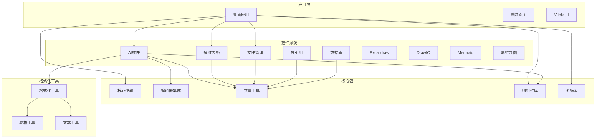

**图表来源**
- [README.md:66-97](file://README.md#L66-L97)
- [package.json:9-54](file://package.json#L9-L54)

**章节来源**
- [README.md:66-97](file://README.md#L66-L97)
- [package.json:1-124](file://package.json#L1-L124)

## 核心组件

### 桌面应用核心

桌面应用是整个系统的核心入口，基于Electron框架构建，提供了完整的本地化体验。

#### 应用初始化流程

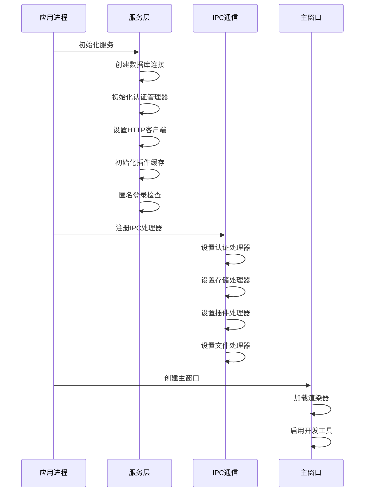

**图表来源**
- [apps/desktop/src/main/index.ts:67-107](file://apps/desktop/src/main/index.ts#L67-L107)
- [apps/desktop/src/main/services.ts:44-133](file://apps/desktop/src/main/services.ts#L44-L133)
- [apps/desktop/src/main/ipc.ts:18-69](file://apps/desktop/src/main/ipc.ts#L18-L69)

#### 服务架构

桌面应用实现了完整的服务层架构，包括：

- **数据库管理**：SQLite数据库操作
- **认证管理**：用户身份验证和会话管理
- **存储适配器**：本地数据持久化
- **插件缓存**：插件下载和缓存管理
- **HTTP客户端**：API请求处理

**章节来源**
- [apps/desktop/src/main/index.ts:1-115](file://apps/desktop/src/main/index.ts#L1-L115)
- [apps/desktop/src/preload/index.ts:1-29](file://apps/desktop/src/preload/index.ts#L1-L29)
- [apps/desktop/src/main/services.ts:1-197](file://apps/desktop/src/main/services.ts#L1-L197)

## 架构概览

### 整体系统架构

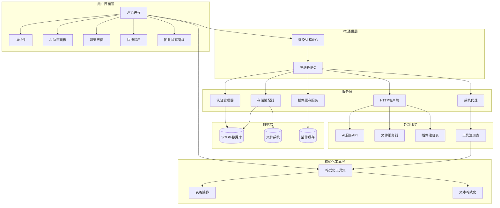

**图表来源**
- [apps/desktop/src/main/index.ts:1-115](file://apps/desktop/src/main/index.ts#L1-L115)
- [apps/desktop/src/main/ipc.ts:1-829](file://apps/desktop/src/main/ipc.ts#L1-L829)
- [apps/desktop/src/main/services.ts:1-197](file://apps/desktop/src/main/services.ts#L1-L197)
- [packages/core/src/ai/system-agent/AIAssistantPanel.tsx:1-538](file://packages/core/src/ai/system-agent/AIAssistantPanel.tsx#L1-L538)

### AI助手面板架构

AI助手面板作为插件系统的重要组成部分，具有独立的配置管理和功能实现。

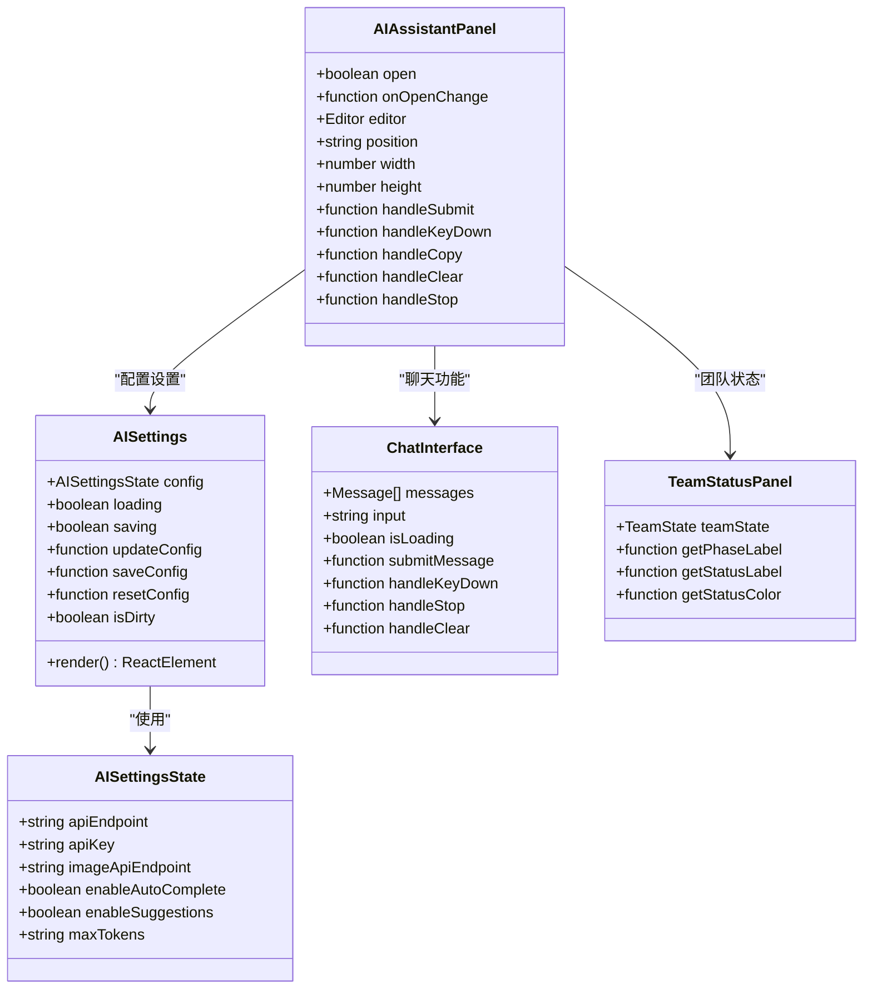

**图表来源**
- [packages/core/src/ai/system-agent/AIAssistantPanel.tsx:36-51](file://packages/core/src/ai/system-agent/AIAssistantPanel.tsx#L36-L51)
- [packages/plugin-ai/src/ai/AISettings.tsx:7-14](file://packages/plugin-ai/src/ai/AISettings.tsx#L7-L14)
- [packages/plugin-ai/src/ai/menu/Chat.tsx:141-156](file://packages/plugin-ai/src/ai/menu/Chat.tsx#L141-L156)
- [packages/plugin-ai/src/ai/menu/TeamStatusPanel.tsx:60-62](file://packages/plugin-ai/src/ai/menu/TeamStatusPanel.tsx#L60-L62)

**章节来源**
- [packages/core/src/ai/system-agent/AIAssistantPanel.tsx:1-538](file://packages/core/src/ai/system-agent/AIAssistantPanel.tsx#L1-L538)
- [packages/plugin-ai/src/ai/AISettings.tsx:1-203](file://packages/plugin-ai/src/ai/AISettings.tsx#L1-L203)

## 详细组件分析

### 桌面应用主进程

主进程负责应用程序的生命周期管理和核心服务协调。

#### 窗口管理

主进程创建和管理应用程序窗口，支持自定义协议处理和窗口行为控制。


**图表来源**
- [apps/desktop/src/main/index.ts:21-107](file://apps/desktop/src/main/index.ts#L21-L107)

#### 协议处理机制

应用实现了自定义的`app://`协议处理，支持单页应用的路由需求。

**章节来源**
- [apps/desktop/src/main/index.ts:1-115](file://apps/desktop/src/main/index.ts#L1-L115)

### 服务层架构

服务层提供了统一的应用程序服务接口，确保各组件间的松耦合。

#### 认证管理系统

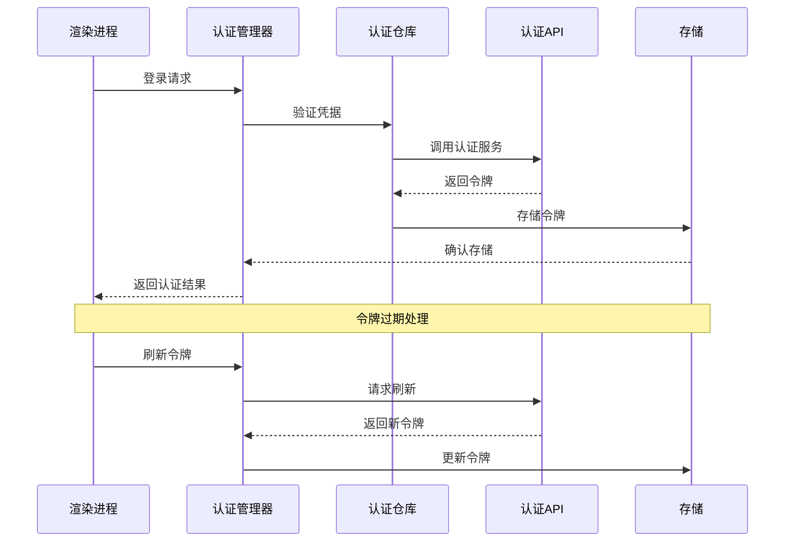

**图表来源**
- [apps/desktop/src/main/services.ts:72-93](file://apps/desktop/src/main/services.ts#L72-L93)

#### 存储适配器

存储适配器实现了本地数据持久化和同步机制，支持空间、页面和块的管理。

**章节来源**
- [apps/desktop/src/main/services.ts:1-197](file://apps/desktop/src/main/services.ts#L1-L197)

### IPC通信机制

IPC（进程间通信）是桌面应用的核心通信机制，实现了渲染进程与主进程的双向通信。

#### IPC处理器分类

系统实现了多个类别的IPC处理器：

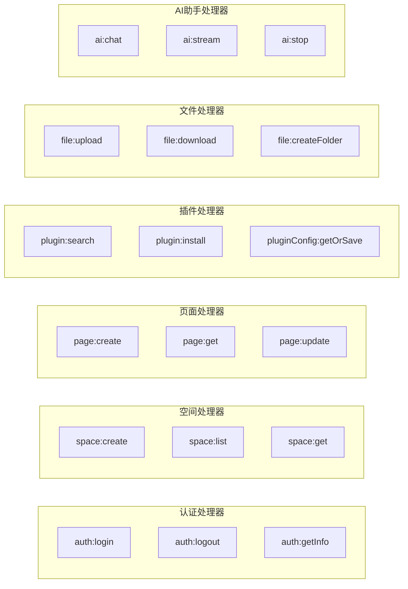

**图表来源**
- [apps/desktop/src/main/ipc.ts:18-528](file://apps/desktop/src/main/ipc.ts#L18-L528)

**章节来源**
- [apps/desktop/src/main/ipc.ts:1-829](file://apps/desktop/src/main/ipc.ts#L1-L829)

### AI插件系统

AI插件提供了完整的AI助手功能，包括文本生成、图像创建和智能建议。

#### 插件配置管理

AI插件实现了灵活的配置管理系统，支持用户自定义AI服务参数。

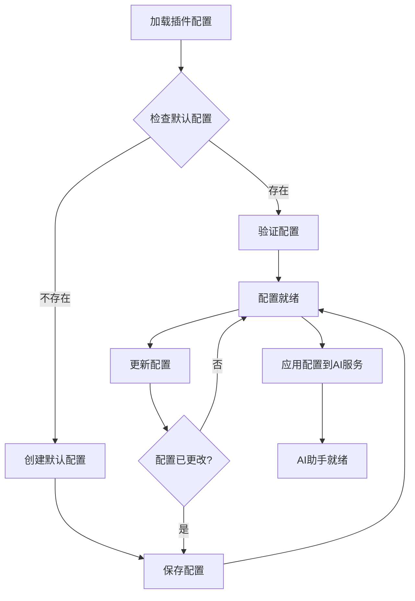

**图表来源**
- [packages/plugin-ai/src/ai/AISettings.tsx:25-41](file://packages/plugin-ai/src/ai/AISettings.tsx#L25-L41)

#### 多语言支持

AI插件实现了完整的国际化支持，包含中英文双语界面。

**章节来源**
- [packages/plugin-ai/src/index.tsx:1-81](file://packages/plugin-ai/src/index.tsx#L1-L81)
- [packages/plugin-ai/src/ai/AISettings.tsx:1-203](file://packages/plugin-ai/src/ai/AISettings.tsx#L1-L203)

### AI聊天界面

AI聊天界面提供了丰富的对话交互功能，支持流式响应和工具调用。

#### 聊天界面组件

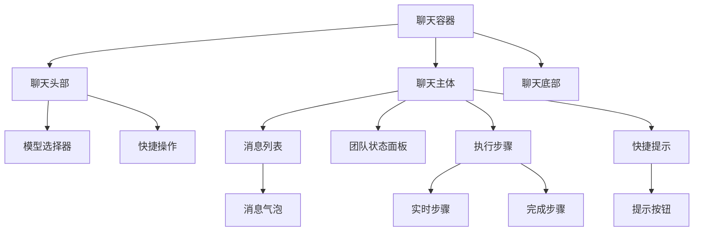

**图表来源**
- [packages/plugin-ai/src/ai/menu/Chat.tsx:450-762](file://packages/plugin-ai/src/ai/menu/Chat.tsx#L450-L762)
- [packages/plugin-ai/src/ai/menu/MessageBubble.tsx:15-111](file://packages/plugin-ai/src/ai/menu/MessageBubble.tsx#L15-L111)

**章节来源**
- [packages/plugin-ai/src/ai/menu/Chat.tsx:1-763](file://packages/plugin-ai/src/ai/menu/Chat.tsx#L1-L763)
- [packages/plugin-ai/src/ai/menu/MessageBubble.tsx:1-111](file://packages/plugin-ai/src/ai/menu/MessageBubble.tsx#L1-L111)

## 格式化工具集成

### 格式化工具概述

系统集成了完整的格式化工具套件，支持表格和文本的自动化格式化操作。

#### 工具分类

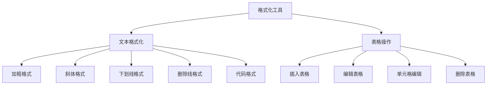

**图表来源**
- [packages/core/src/ai/tools/format-tools.ts:11-505](file://packages/core/src/ai/tools/format-tools.ts#L11-L505)

### 文本格式化工具

文本格式化工具允许AI助手对文档中的特定文本应用各种格式样式。

#### 支持的格式类型

- **加粗** (`bold`)：将文本标记为粗体
- **斜体** (`italic`)：将文本标记为斜体  
- **下划线** (`underline`)：为文本添加下划线
- **删除线** (`strike`)：为文本添加删除线
- **代码** (`code`)：将文本标记为代码格式

#### 使用示例

```typescript
// 格式化搜索到的文本
await formatText({
  searchText: "重要信息",
  format: "bold",
  occurrence: 1
})

// 应用斜体格式
await formatText({
  searchText: "强调内容", 
  format: "italic"
})
```

**章节来源**
- [packages/core/src/ai/tools/format-tools.ts:12-71](file://packages/core/src/ai/tools/format-tools.ts#L12-L71)

### 表格操作工具

表格操作工具提供了完整的表格管理功能，支持表格的创建、编辑和删除。

#### 表格创建

```typescript
// 插入3x3表格，包含表头
await insertTable({
  rows: 3,
  cols: 3,
  withHeaderRow: true
})

// 在指定块索引后插入表格
await insertTable({
  rows: 5,
  cols: 4,
  blockIndex: 2
})
```

#### 表格信息查询

```typescript
// 获取所有表格概览
const tables = await listTable()

// 获取指定表格的详细信息
const tableInfo = await getTableInfo({ tableIndex: 0 })

// 获取表格结构信息
const tableDetails = await getTableInfo()
```

#### 表格编辑操作

```typescript
// 添加行
await editTable({
  action: "addRowAfter",
  tableIndex: 0,
  rowIndex: 1
})

// 合并单元格
await editTable({
  action: "mergeCells",
  tableIndex: 0,
  rowIndex: 0,
  colIndex: 0
})

// 删除列
await editTable({
  action: "deleteColumn",
  tableIndex: 0,
  rowIndex: 0,
  colIndex: 1
})
```

#### 单元格编辑

```typescript
// 替换单元格内容
await editTableCell({
  tableIndex: 0,
  rowIndex: 1,
  colIndex: 1,
  content: "新内容",
  mode: "replace"
})

// 追加内容到单元格
await editTableCell({
  tableIndex: 0,
  rowIndex: 1,
  colIndex: 1,
  content: " 追加内容",
  mode: "append"
})
```

**章节来源**
- [packages/core/src/ai/tools/format-tools.ts:73-505](file://packages/core/src/ai/tools/format-tools.ts#L73-L505)

## UI组件增强

### 团队状态面板

团队状态面板提供了多AI代理协作的可视化监控功能。

#### 状态显示

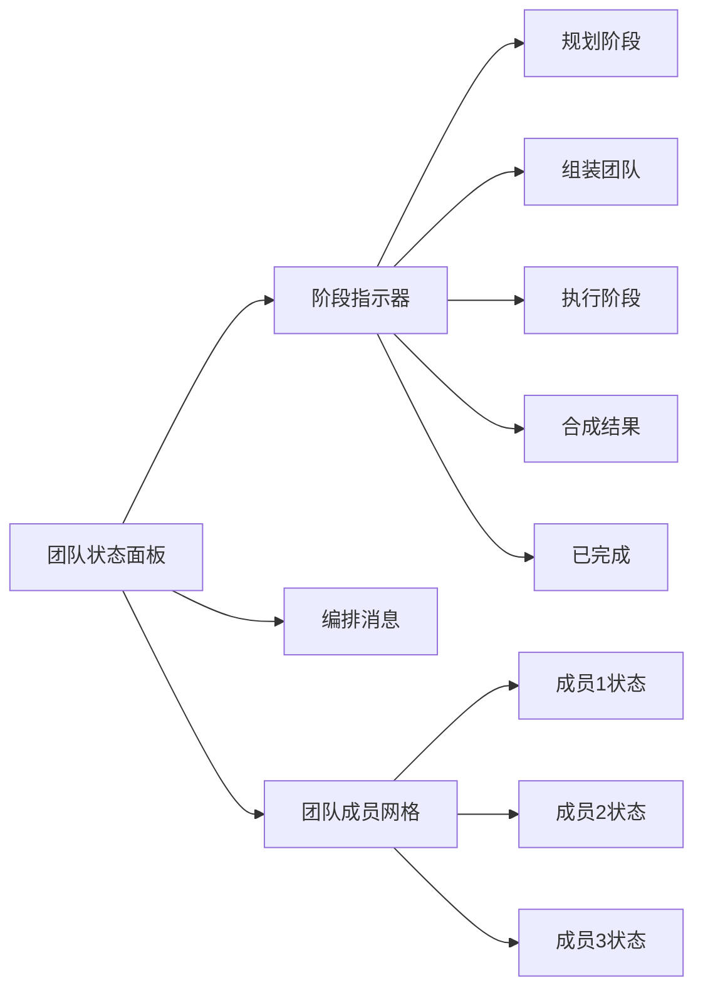

**图表来源**
- [packages/plugin-ai/src/ai/menu/TeamStatusPanel.tsx:60-122](file://packages/plugin-ai/src/ai/menu/TeamStatusPanel.tsx#L60-L122)

#### 成员状态管理

- **待定** (`pending`)：等待执行
- **工作中** (`working`)：正在执行任务
- **已完成** (`completed`)：任务完成
- **错误** (`error`)：执行过程中发生错误

**章节来源**
- [packages/plugin-ai/src/ai/menu/TeamStatusPanel.tsx:1-125](file://packages/plugin-ai/src/ai/menu/TeamStatusPanel.tsx#L1-L125)

### 执行步骤显示

执行步骤显示组件提供了AI工具调用过程的实时监控。

#### 步骤状态

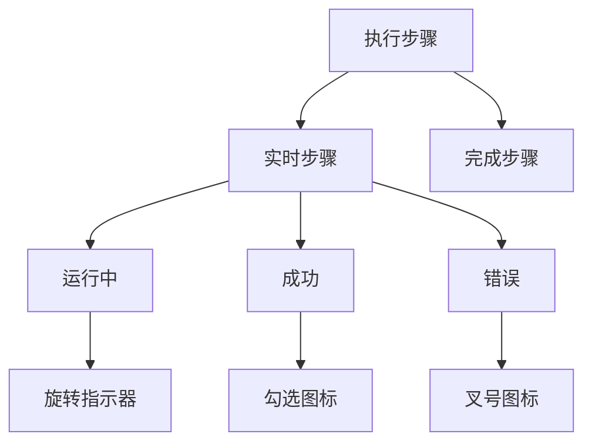

**图表来源**
- [packages/plugin-ai/src/ai/menu/ExecutionStepsDisplay.tsx:33-92](file://packages/plugin-ai/src/ai/menu/ExecutionStepsDisplay.tsx#L33-L92)

#### 错误处理

执行步骤显示组件能够捕获和展示工具执行过程中的错误信息，包括：

- **工具名称**：执行失败的工具标识
- **参数详情**：失败时使用的参数
- **错误消息**：具体的错误描述
- **持续时间**：工具执行耗时

**章节来源**
- [packages/plugin-ai/src/ai/menu/ExecutionStepsDisplay.tsx:1-135](file://packages/plugin-ai/src/ai/menu/ExecutionStepsDisplay.tsx#L1-L135)

### 快捷提示系统

快捷提示系统为用户提供了一键式AI助手操作选项。

#### 预定义提示

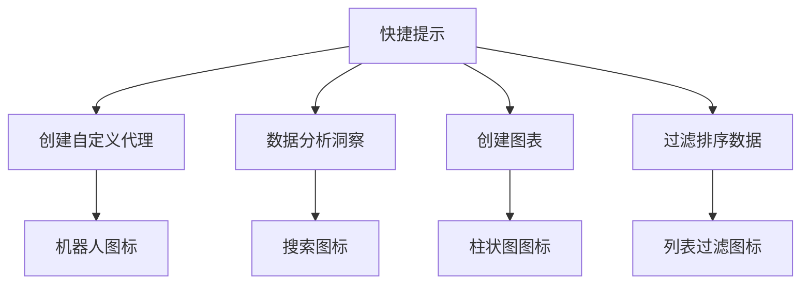

**图表来源**
- [packages/plugin-ai/src/ai/menu/QuickPrompts.tsx:5-27](file://packages/plugin-ai/src/ai/menu/QuickPrompts.tsx#L5-L27)

#### 提示交互

用户可以通过点击快捷提示按钮快速发起AI助手操作，每个提示都针对特定的文档处理场景进行了优化。

**章节来源**
- [packages/plugin-ai/src/ai/menu/QuickPrompts.tsx:1-51](file://packages/plugin-ai/src/ai/menu/QuickPrompts.tsx#L1-L51)

### 消息气泡组件

消息气泡组件提供了聊天消息的美观展示和交互功能。

#### 消息状态

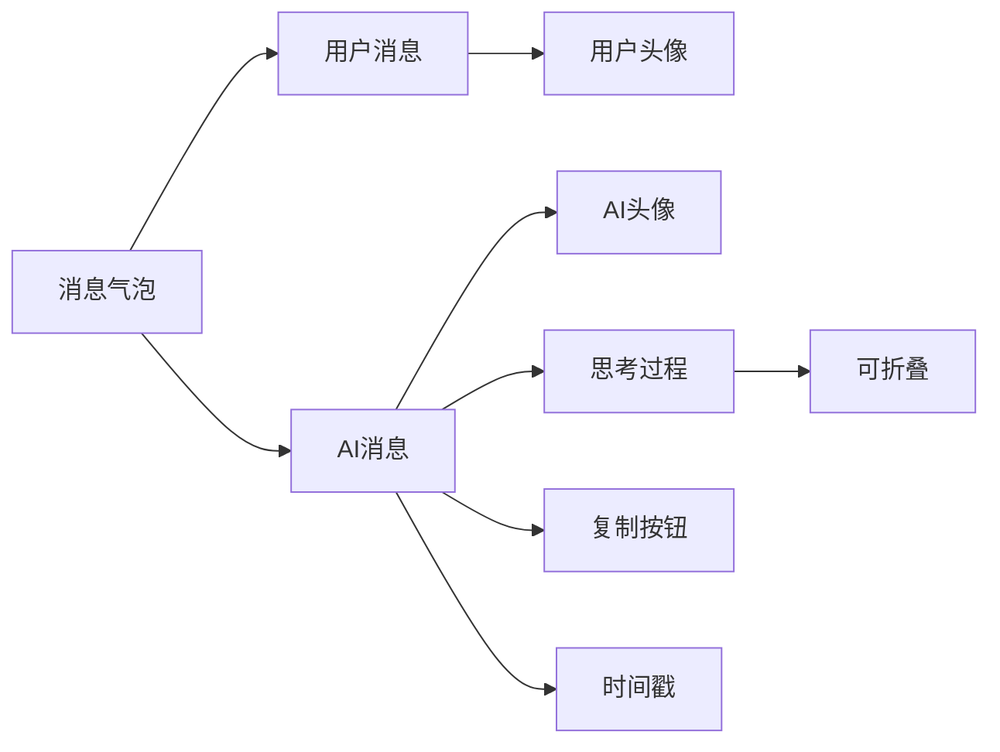

**图表来源**
- [packages/plugin-ai/src/ai/menu/MessageBubble.tsx:15-111](file://packages/plugin-ai/src/ai/menu/MessageBubble.tsx#L15-L111)

#### 交互功能

- **复制功能**：支持一键复制AI回复内容
- **时间戳显示**：显示消息发送的相对时间
- **思考过程**：展示AI的推理和思考过程
- **错误状态**：高亮显示错误消息

**章节来源**
- [packages/plugin-ai/src/ai/menu/MessageBubble.tsx:1-111](file://packages/plugin-ai/src/ai/menu/MessageBubble.tsx#L1-L111)

## 依赖关系分析

### 技术栈依赖

系统采用了现代化的技术栈，确保高性能和良好的开发体验。

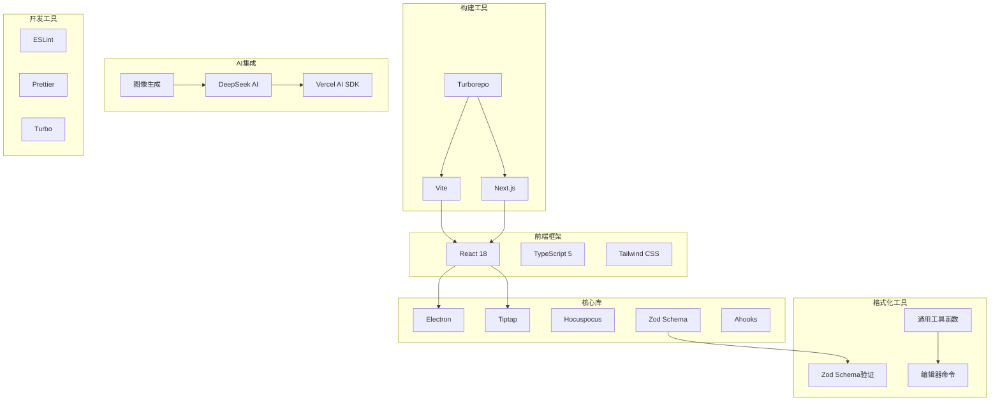

**图表来源**
- [README.md:43-65](file://README.md#L43-L65)
- [apps/desktop/package.json:18-40](file://apps/desktop/package.json#L18-L40)
- [packages/core/src/ai/tools/format-tools.ts:1-9](file://packages/core/src/ai/tools/format-tools.ts#L1-L9)

### 包管理策略

项目使用pnpm进行包管理，通过workspace实现monorepo的包共享。

**章节来源**
- [README.md:106-132](file://README.md#L106-L132)
- [apps/desktop/package.json:1-100](file://apps/desktop/package.json#L1-L100)

## 性能考虑

### 内存管理

桌面应用配置了较大的内存限制，确保在处理大量文档时的稳定性。

### 数据库优化

系统使用SQLite作为本地数据库，通过合理的索引和查询优化提升性能。

### 插件加载策略

插件采用按需加载和缓存机制，减少启动时间和内存占用。

### 流式处理优化

AI助手面板实现了高效的流式处理机制，包括：

- **动画帧批量处理**：使用requestAnimationFrame优化渲染
- **缓冲区管理**：合理管理流式数据的缓冲
- **内存释放**：及时清理不再使用的数据结构

**章节来源**
- [packages/plugin-ai/src/ai/menu/Chat.tsx:312-330](file://packages/plugin-ai/src/ai/menu/Chat.tsx#L312-L330)

## 故障排除指南

### 常见问题诊断

#### 应用启动问题

如果应用无法正常启动，检查以下要点：
1. 确认Node.js版本符合要求
2. 检查依赖安装是否完整
3. 验证Electron配置正确性

#### IPC通信问题

如果IPC通信失败：
1. 检查主进程和渲染进程的通信通道
2. 验证IPC处理器的注册状态
3. 查看控制台错误日志

#### 数据库连接问题

数据库相关问题的排查步骤：
1. 确认数据库文件路径正确
2. 检查数据库权限设置
3. 验证数据库连接池配置

#### AI助手功能问题

AI助手相关问题的排查：
1. 检查API密钥配置
2. 验证网络连接状态
3. 查看AI服务响应日志
4. 确认格式化工具可用性

**章节来源**
- [apps/desktop/src/main/index.ts:46-48](file://apps/desktop/src/main/index.ts#L46-L48)
- [apps/desktop/src/main/services.ts:138-146](file://apps/desktop/src/main/services.ts#L138-L146)
- [packages/plugin-ai/src/ai/AISettings.tsx:39-49](file://packages/plugin-ai/src/ai/AISettings.tsx#L39-L49)

## 结论

AI助手面板系统展现了现代桌面应用开发的最佳实践，通过模块化设计、完善的架构和丰富的功能集，为用户提供了强大的知识管理解决方案。

### 系统优势

- **架构清晰**：采用分层架构，职责分离明确
- **扩展性强**：插件系统支持功能扩展
- **用户体验好**：本地化应用提供流畅体验
- **技术先进**：使用最新的Web技术和工具链
- **格式化能力**：集成完整的表格和文本格式化工具
- **团队协作**：支持多AI代理协同工作
- **UI增强**：提供丰富的交互组件和可视化面板

### 发展方向

系统目前处于快速发展阶段，未来计划包括：
- 移动端应用支持
- 离线模式增强
- 更多AI功能集成
- 性能优化改进
- 更丰富的格式化工具
- 增强的团队协作功能

该系统为知识管理领域提供了一个优秀的开源解决方案，具有很高的参考价值和实用价值。