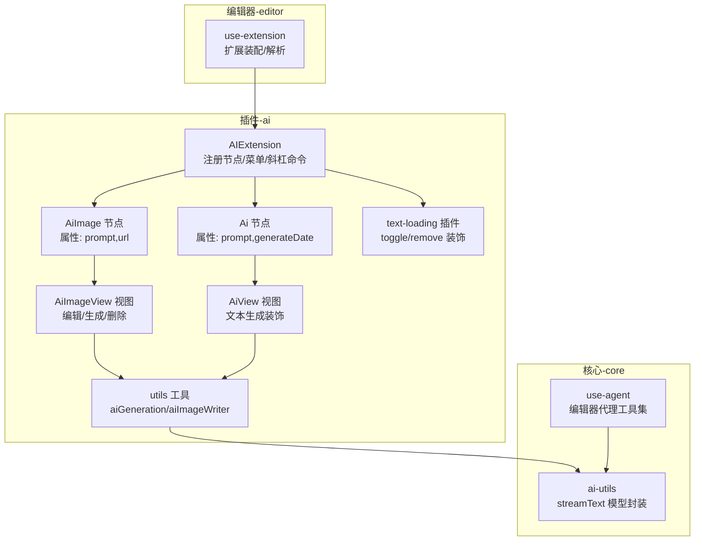
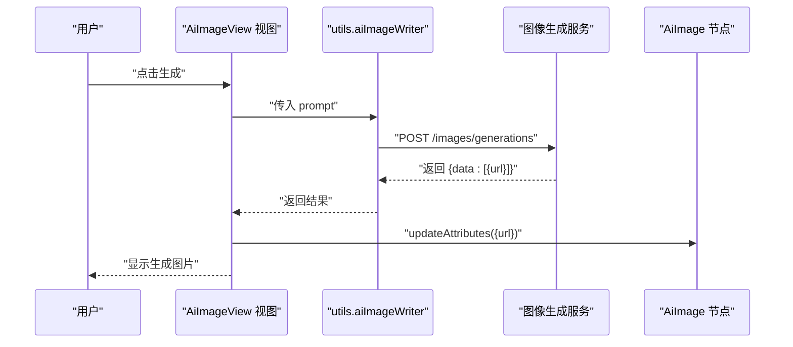
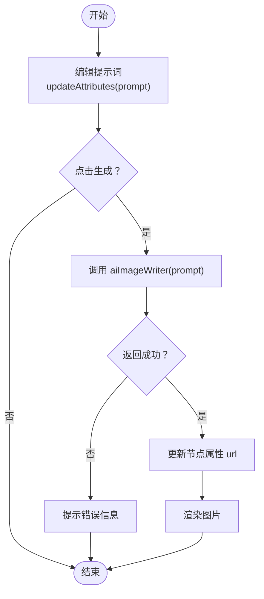
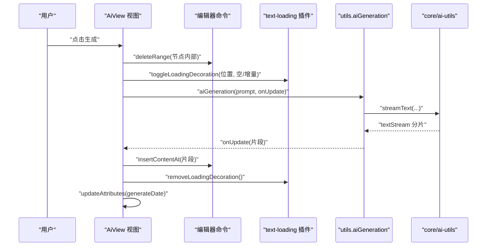
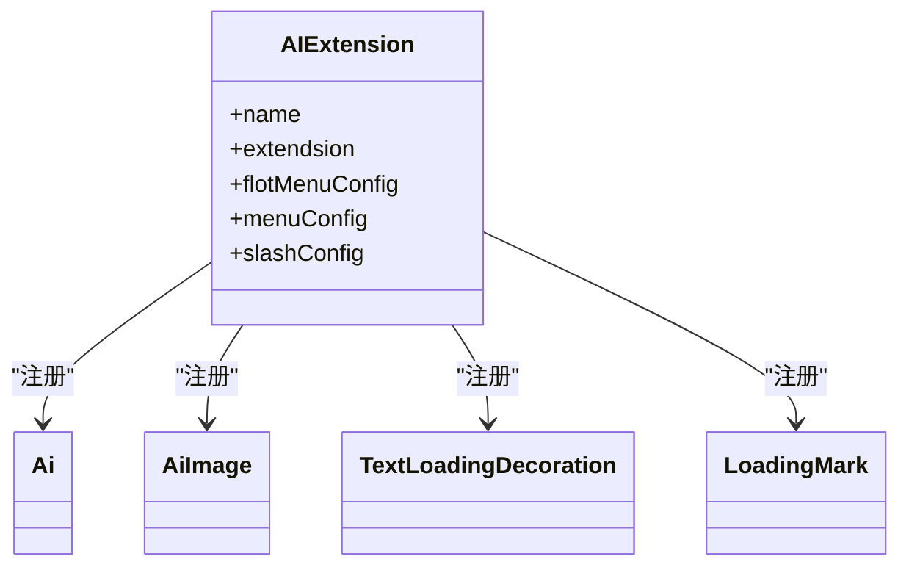
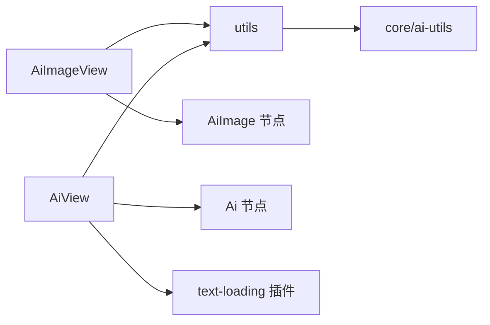

# AI图像生成

<cite>
**本文引用的文件**
- [packages/plugin-ai/src/ai/AiImageView.tsx](file://packages/plugin-ai/src/ai/AiImageView.tsx)
- [packages/plugin-ai/src/ai/ai-image.ts](file://packages/plugin-ai/src/ai/ai-image.ts)
- [packages/plugin-ai/src/ai/AiView.tsx](file://packages/plugin-ai/src/ai/AiView.tsx)
- [packages/plugin-ai/src/ai/ai.ts](file://packages/plugin-ai/src/ai/ai.ts)
- [packages/plugin-ai/src/ai/utils.ts](file://packages/plugin-ai/src/ai/utils.ts)
- [packages/plugin-ai/src/ai/text-loading.tsx](file://packages/plugin-ai/src/ai/text-loading.tsx)
- [packages/plugin-ai/src/ai/index.tsx](file://packages/plugin-ai/src/ai/index.tsx)
- [packages/plugin-ai/src/index.tsx](file://packages/plugin-ai/src/index.tsx)
- [packages/core/src/ai/ai-utils.ts](file://packages/core/src/ai/ai-utils.ts)
- [packages/core/src/ai/use-agent.tsx](file://packages/core/src/ai/use-agent.tsx)
- [packages/editor/src/editor/use-extension.ts](file://packages/editor/src/editor/use-extension.ts)
</cite>

## 目录
1. [简介](#简介)
2. [项目结构](#项目结构)
3. [核心组件](#核心组件)
4. [架构总览](#架构总览)
5. [详细组件分析](#详细组件分析)
6. [依赖关系分析](#依赖关系分析)
7. [性能考虑](#性能考虑)
8. [故障排查指南](#故障排查指南)
9. [结论](#结论)
10. [附录](#附录)

## 简介
本文件系统性阐述仓库中的AI图像生成功能，覆盖从“AI图像视图组件”、“图像生成算法与结果渲染流程”到“参数配置、提示词处理与输出格式控制”的完整实现机制。文档还提供可操作的使用示例（如何触发图像生成、处理生成的图像数据、在编辑器中集成），以及质量控制、性能优化与错误处理策略，帮助开发者快速理解与扩展该能力。

## 项目结构
AI图像生成功能主要位于插件包“plugin-ai”中，并通过编辑器扩展机制接入到主编辑器内核。关键文件组织如下：
- 插件入口与扩展装配：AIExtension 负责注册节点、浮动菜单、斜杠命令等
- 图像节点与视图：ai-image 节点定义属性与渲染；AiImageView 提供交互式编辑体验
- 文本生成装饰与工具：text-loading 插件提供流式生成时的加载装饰；utils 提供文本与图像生成工具
- 核心AI能力：core 包提供流式文本生成与代理工具，被插件侧统一复用

图表来源
- [packages/plugin-ai/src/ai/index.tsx](file://packages/plugin-ai/src/ai/index.tsx#L1-L42)
- [packages/plugin-ai/src/ai/ai-image.ts](file://packages/plugin-ai/src/ai/ai-image.ts#L1-L37)
- [packages/plugin-ai/src/ai/AiImageView.tsx](file://packages/plugin-ai/src/ai/AiImageView.tsx#L1-L69)
- [packages/plugin-ai/src/ai/ai.ts](file://packages/plugin-ai/src/ai/ai.ts#L1-L55)
- [packages/plugin-ai/src/ai/AiView.tsx](file://packages/plugin-ai/src/ai/AiView.tsx#L1-L76)
- [packages/plugin-ai/src/ai/utils.ts](file://packages/plugin-ai/src/ai/utils.ts#L1-L58)
- [packages/plugin-ai/src/ai/text-loading.tsx](file://packages/plugin-ai/src/ai/text-loading.tsx#L1-L146)
- [packages/core/src/ai/ai-utils.ts](file://packages/core/src/ai/ai-utils.ts#L1-L20)
- [packages/core/src/ai/use-agent.tsx](file://packages/core/src/ai/use-agent.tsx#L1-L195)
- [packages/editor/src/editor/use-extension.ts](file://packages/editor/src/editor/use-extension.ts#L47-L63)

章节来源
- [packages/plugin-ai/src/ai/index.tsx](file://packages/plugin-ai/src/ai/index.tsx#L1-L42)
- [packages/editor/src/editor/use-extension.ts](file://packages/editor/src/editor/use-extension.ts#L47-L63)

## 核心组件
- AiImage 节点与 AiImageView 视图
  - 节点属性：prompt（提示词）、url（生成图片地址）
  - 视图提供提示词编辑、一键生成、删除节点等交互
- Ai 节点与 AiView 视图
  - 节点属性：prompt（提示词）、generateDate（生成时间）
  - 视图提供提示词编辑、生成按钮、删除按钮，支持流式渲染与加载装饰
- 文本生成装饰插件 text-loading
  - 提供 toggleLoadingDecoration/removeLoadingDecoration 命令，用于在指定位置插入/移除加载装饰
- 生成工具 utils
  - aiGeneration：基于流式接口逐步更新内容
  - aiImageWriter：向第三方图像生成服务发起请求并返回结果
- 核心AI能力 core/ai-utils
  - 封装 streamText 与模型客户端，作为统一的文本生成通道
- 扩展装配 use-extension
  - 将插件扩展合并到编辑器运行时，支持插件管理与解析

章节来源
- [packages/plugin-ai/src/ai/ai-image.ts](file://packages/plugin-ai/src/ai/ai-image.ts#L1-L37)
- [packages/plugin-ai/src/ai/AiImageView.tsx](file://packages/plugin-ai/src/ai/AiImageView.tsx#L1-L69)
- [packages/plugin-ai/src/ai/ai.ts](file://packages/plugin-ai/src/ai/ai.ts#L1-L55)
- [packages/plugin-ai/src/ai/AiView.tsx](file://packages/plugin-ai/src/ai/AiView.tsx#L1-L76)
- [packages/plugin-ai/src/ai/text-loading.tsx](file://packages/plugin-ai/src/ai/text-loading.tsx#L1-L146)
- [packages/plugin-ai/src/ai/utils.ts](file://packages/plugin-ai/src/ai/utils.ts#L1-L58)
- [packages/core/src/ai/ai-utils.ts](file://packages/core/src/ai/ai-utils.ts#L1-L20)
- [packages/editor/src/editor/use-extension.ts](file://packages/editor/src/editor/use-extension.ts#L47-L63)

## 架构总览
AI图像生成功能采用“节点-视图-工具-核心”的分层设计：
- 节点层：定义结构化数据与命令（如插入节点、更新属性）
- 视图层：提供交互界面与事件绑定（如点击生成、删除）
- 工具层：封装生成逻辑与网络请求（如流式文本生成、图像生成）
- 核心层：提供统一的模型与流式接口，保证跨功能一致性

图表来源
- [packages/plugin-ai/src/ai/AiImageView.tsx](file://packages/plugin-ai/src/ai/AiImageView.tsx#L1-L69)
- [packages/plugin-ai/src/ai/ai-image.ts](file://packages/plugin-ai/src/ai/ai-image.ts#L1-L37)
- [packages/plugin-ai/src/ai/utils.ts](file://packages/plugin-ai/src/ai/utils.ts#L43-L57)

## 详细组件分析

### 组件一：AiImage 节点与 AiImageView 视图
- 数据结构
  - 属性：prompt（字符串）、url（字符串）
  - 渲染：HTML 包装器，支持只读预览与编辑态交互
- 交互流程
  - 编辑提示词并保存到节点属性
  - 点击“生成”后进入加载状态，调用图像生成工具，成功后回填图片 URL 并更新节点属性
  - 支持删除节点
- 参数与输出
  - 输入：prompt（必填）
  - 输出：节点属性 url（图片地址）

图表来源
- [packages/plugin-ai/src/ai/AiImageView.tsx](file://packages/plugin-ai/src/ai/AiImageView.tsx#L1-L69)
- [packages/plugin-ai/src/ai/ai-image.ts](file://packages/plugin-ai/src/ai/ai-image.ts#L1-L37)
- [packages/plugin-ai/src/ai/utils.ts](file://packages/plugin-ai/src/ai/utils.ts#L43-L57)

章节来源
- [packages/plugin-ai/src/ai/ai-image.ts](file://packages/plugin-ai/src/ai/ai-image.ts#L1-L37)
- [packages/plugin-ai/src/ai/AiImageView.tsx](file://packages/plugin-ai/src/ai/AiImageView.tsx#L1-L69)
- [packages/plugin-ai/src/ai/utils.ts](file://packages/plugin-ai/src/ai/utils.ts#L43-L57)

### 组件二：Ai 节点与 AiView 视图（文本生成装饰）
- 数据结构
  - 属性：prompt（字符串）、generateDate（字符串）
  - 内容：块级内容容器，支持子节点
- 交互流程
  - 编辑提示词
  - 点击“生成”后，先清空节点内部内容，再以流式方式逐步插入生成内容
  - 期间通过 text-loading 插件在指定位置显示加载装饰
  - 完成后更新 generateDate
- 参数与输出
  - 输入：prompt（必填）
  - 输出：节点内容区逐步填充生成文本，节点属性 generateDate 记录生成时间

图表来源
- [packages/plugin-ai/src/ai/AiView.tsx](file://packages/plugin-ai/src/ai/AiView.tsx#L1-L76)
- [packages/plugin-ai/src/ai/text-loading.tsx](file://packages/plugin-ai/src/ai/text-loading.tsx#L1-L146)
- [packages/plugin-ai/src/ai/utils.ts](file://packages/plugin-ai/src/ai/utils.ts#L32-L41)
- [packages/core/src/ai/ai-utils.ts](file://packages/core/src/ai/ai-utils.ts#L1-L20)

章节来源
- [packages/plugin-ai/src/ai/ai.ts](file://packages/plugin-ai/src/ai/ai.ts#L1-L55)
- [packages/plugin-ai/src/ai/AiView.tsx](file://packages/plugin-ai/src/ai/AiView.tsx#L1-L76)
- [packages/plugin-ai/src/ai/text-loading.tsx](file://packages/plugin-ai/src/ai/text-loading.tsx#L1-L146)
- [packages/plugin-ai/src/ai/utils.ts](file://packages/plugin-ai/src/ai/utils.ts#L32-L41)
- [packages/core/src/ai/ai-utils.ts](file://packages/core/src/ai/ai-utils.ts#L1-L20)

### 组件三：扩展装配与菜单/斜杠命令
- AIExtension
  - 注册 Ai 与 AiImage 节点
  - 注册文本加载装饰与加载标记
  - 配置浮动菜单与斜杠命令（如“内容生成”“文生成图”）
- 插件装配
  - use-extension 将插件扩展与内置扩展合并，形成最终编辑器扩展集合

图表来源
- [packages/plugin-ai/src/ai/index.tsx](file://packages/plugin-ai/src/ai/index.tsx#L1-L42)
- [packages/editor/src/editor/use-extension.ts](file://packages/editor/src/editor/use-extension.ts#L47-L63)

章节来源
- [packages/plugin-ai/src/ai/index.tsx](file://packages/plugin-ai/src/ai/index.tsx#L1-L42)
- [packages/editor/src/editor/use-extension.ts](file://packages/editor/src/editor/use-extension.ts#L47-L63)

## 依赖关系分析
- 组件耦合
  - AiImageView 依赖 utils.aiImageWriter 与节点属性更新
  - AiView 依赖 utils.aiGeneration、text-loading 插件与编辑器命令
  - utils 依赖 core/ai-utils 的流式文本生成能力
- 外部依赖
  - 第三方图像生成服务（通过 utils.aiImageWriter 发起请求）
  - 流式文本生成（通过 core/ai-utils.streamText）
- 可能的循环依赖
  - 当前结构清晰，未见直接循环导入；注意避免在 utils 中引入编辑器命令的循环引用

图表来源
- [packages/plugin-ai/src/ai/AiImageView.tsx](file://packages/plugin-ai/src/ai/AiImageView.tsx#L1-L69)
- [packages/plugin-ai/src/ai/AiView.tsx](file://packages/plugin-ai/src/ai/AiView.tsx#L1-L76)
- [packages/plugin-ai/src/ai/utils.ts](file://packages/plugin-ai/src/ai/utils.ts#L1-L58)
- [packages/core/src/ai/ai-utils.ts](file://packages/core/src/ai/ai-utils.ts#L1-L20)
- [packages/plugin-ai/src/ai/text-loading.tsx](file://packages/plugin-ai/src/ai/text-loading.tsx#L1-L146)

章节来源
- [packages/plugin-ai/src/ai/utils.ts](file://packages/plugin-ai/src/ai/utils.ts#L1-L58)
- [packages/core/src/ai/ai-utils.ts](file://packages/core/src/ai/ai-utils.ts#L1-L20)

## 性能考虑
- 流式渲染
  - 文本生成采用流式接口，边生成边插入，降低首帧等待时间
- 加载装饰
  - 使用 text-loading 插件在指定位置显示轻量级加载指示，避免全屏遮罩带来的卡顿
- 请求与缓存
  - 图像生成建议在 UI 层增加本地缓存策略（按 prompt 哈希）以减少重复请求
- 并发与节流
  - 对生成按钮添加防抖/互斥开关，避免重复触发导致的资源浪费
- 渲染优化
  - 图片渲染使用懒加载与尺寸控制，避免大图阻塞页面

## 故障排查指南
- 图像生成失败
  - 现象：弹出警告提示或无图片更新
  - 排查要点：检查 utils.aiImageWriter 返回的错误字段、网络连通性、鉴权头是否正确
  - 处理建议：重试请求、检查服务端响应体、确认 prompt 合法性
- 文本生成卡顿
  - 现象：生成过程卡住或延迟明显
  - 排查要点：检查流式接口是否正常推进、编辑器命令执行是否阻塞
  - 处理建议：减少一次性插入的数据量、确保 removeLoadingDecoration 在完成后调用
- 装饰未移除
  - 现象：加载指示常驻不消失
  - 排查要点：确认 removeLoadingDecoration 是否在 finally 或异常分支被调用
- 扩展未生效
  - 现象：斜杠命令/浮动菜单不可用
  - 排查要点：确认 use-extension 是否正确合并插件扩展，AIExtension 是否被注入

章节来源
- [packages/plugin-ai/src/ai/AiImageView.tsx](file://packages/plugin-ai/src/ai/AiImageView.tsx#L1-L69)
- [packages/plugin-ai/src/ai/AiView.tsx](file://packages/plugin-ai/src/ai/AiView.tsx#L1-L76)
- [packages/plugin-ai/src/ai/text-loading.tsx](file://packages/plugin-ai/src/ai/text-loading.tsx#L1-L146)
- [packages/editor/src/editor/use-extension.ts](file://packages/editor/src/editor/use-extension.ts#L47-L63)

## 结论
本功能以“节点-视图-工具-核心”分层实现，既满足图像生成的交互需求，又通过流式文本生成与加载装饰提升用户体验。通过统一的工具与核心能力，未来可平滑扩展更多生成类型（如多模态、多模型）与更丰富的编辑器集成场景。

## 附录

### 使用示例（步骤说明）
- 触发图像生成
  - 在编辑器中插入“文生成图”节点（可通过斜杠命令或浮动菜单）
  - 在节点内编辑提示词
  - 点击“生成”，等待加载装饰消失后查看图片
- 处理生成的图像数据
  - 生成成功后，节点属性 url 自动更新为图片地址
  - 可随时修改提示词并重新生成
- 集成到编辑器
  - 确保 AIExtension 已被 use-extension 正确装配
  - 斜杠命令“内容生成/文生成图”可用，浮动菜单可配置

章节来源
- [packages/plugin-ai/src/ai/index.tsx](file://packages/plugin-ai/src/ai/index.tsx#L1-L42)
- [packages/plugin-ai/src/ai/AiImageView.tsx](file://packages/plugin-ai/src/ai/AiImageView.tsx#L1-L69)
- [packages/editor/src/editor/use-extension.ts](file://packages/editor/src/editor/use-extension.ts#L47-L63)

### 参数配置与提示词处理
- 参数
  - AiImage：prompt（提示词）、url（图片地址）
  - Ai：prompt（提示词）、generateDate（生成时间）
- 提示词处理
  - 文本生成：将提示词与上下文拼接后通过流式接口生成
  - 图像生成：将提示词直接提交至图像生成服务
- 输出格式控制
  - 文本：流式插入，支持保留/禁用输入规则与粘贴规则
  - 图像：返回 JSON，取首个元素的 url 字段

章节来源
- [packages/plugin-ai/src/ai/ai-image.ts](file://packages/plugin-ai/src/ai/ai-image.ts#L1-L37)
- [packages/plugin-ai/src/ai/ai.ts](file://packages/plugin-ai/src/ai/ai.ts#L1-L55)
- [packages/plugin-ai/src/ai/utils.ts](file://packages/plugin-ai/src/ai/utils.ts#L32-L57)
- [packages/plugin-ai/src/ai/AiView.tsx](file://packages/plugin-ai/src/ai/AiView.tsx#L1-L76)