# AI基础架构系统

<cite>
**本文档引用的文件**
- [README.md](file://README.md)
- [package.json](file://package.json)
- [pnpm-workspace.yaml](file://pnpm-workspace.yaml)
- [turbo.json](file://turbo.json)
- [apps/desktop/package.json](file://apps/desktop/package.json)
- [apps/landing-page/package.json](file://apps/landing-page/package.json)
- [apps/landing-page-vite/package.json](file://apps/landing-page-vite/package.json)
- [apps/vite/package.json](file://apps/vite/package.json)
- [packages/plugin-ai/package.json](file://packages/plugin-ai/package.json)
- [packages/plugin-ai/src/index.tsx](file://packages/plugin-ai/src/index.tsx)
- [packages/plugin-ai/src/ai/ai.ts](file://packages/plugin-ai/src/ai/ai.ts)
- [packages/ui/src/index.ts](file://packages/ui/src/index.ts)
- [packages/common/src/index.ts](file://packages/common/src/index.ts)
- [packages/room-server/package.json](file://packages/room-server/package.json)
- [packages/electron-adapter/package.json](file://packages/electron-adapter/package.json)
- [packages/core/src/ai/model-provider/knowledge-provider.ts](file://packages/core/src/ai/model-provider/knowledge-provider.ts)
- [packages/core/src/ai/ai-utils.ts](file://packages/core/src/ai/ai-utils.ts)
- [packages/core/src/ai/foundation/ai-foundation.ts](file://packages/core/src/ai/foundation/ai-foundation.ts)
- [packages/core/src/ai/foundation/types.ts](file://packages/core/src/ai/foundation/types.ts)
- [packages/core/src/ai/types.ts](file://packages/core/src/ai/types.ts)
</cite>

## 更新摘要
**所做更改**
- 新增AI知识提供者系统章节，详细介绍全新的Knowledge Provider实现
- 更新AI插件系统架构，反映从DeepSeek集成到AI SDK V2接口的迁移
- 新增指数退避重试逻辑和流式协议支持的技术细节
- 更新AI基础架构的组件关系图，体现新的知识提供者架构
- 新增AI工具转换和OpenAI兼容性的技术说明

## 目录
1. [项目简介](#项目简介)
2. [项目结构](#项目结构)
3. [核心组件](#核心组件)
4. [架构概览](#架构概览)
5. [详细组件分析](#详细组件分析)
6. [AI知识提供者系统](#ai知识提供者系统)
7. [依赖关系分析](#依赖关系分析)
8. [性能考虑](#性能考虑)
9. [故障排除指南](#故障排除指南)
10. [结论](#结论)

## 项目简介

AI基础架构系统是一个强大的协作知识管理平台，集成了丰富的富文本编辑、实时协作、AI增强功能和广泛的插件生态系统。该系统采用现代Web技术构建，具备实时协作能力和多维度表格、可视化绘图、文件管理等核心功能。

### 主要特性

- **富文本编辑器**：基于Tiptap的协作编辑支持
- **实时协作**：多用户编辑的Hocuspocus后端
- **插件架构**：可扩展的插件系统
- **AI集成**：AI驱动的文本生成、图像创建和内容转换
- **多维表格**：类似电子表格的表格，支持多种视图类型
- **可视化绘图**：支持Excalidraw、DrawIO、Mermaid和思维导图
- **文件管理**：内置文档组织系统
- **块引用**：跨文档块链接和嵌入
- **国际化**：完整的多语言支持

### 技术栈

- **前端**：React 18、TypeScript 5、Vite、Next.js、Tailwind CSS、shadcn/ui
- **构建与基础设施**：Turborepo、pnpm、Rollup、Docker
- **AI集成**：AI SDK V2、指数退避重试、OpenAI兼容工具转换、流式协议支持

## 项目结构

该项目采用monorepo架构，使用Turborepo进行构建管理，通过pnpm工作区实现包管理。整体结构清晰地分离了应用层和核心包层。

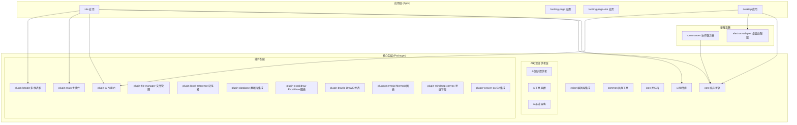

**图表来源**
- [pnpm-workspace.yaml:1-4](file://pnpm-workspace.yaml#L1-L4)
- [apps/vite/package.json:14-36](file://apps/vite/package.json#L14-L36)
- [apps/desktop/package.json:18-37](file://apps/desktop/package.json#L18-L37)

**章节来源**
- [README.md:66-97](file://README.md#L66-L97)
- [pnpm-workspace.yaml:1-4](file://pnpm-workspace.yaml#L1-L4)
- [turbo.json:1-27](file://turbo.json#L1-L27)

## 核心组件

### 插件架构系统

系统的核心是基于插件的架构设计，每个插件都是独立的功能模块，可以动态加载和卸载。

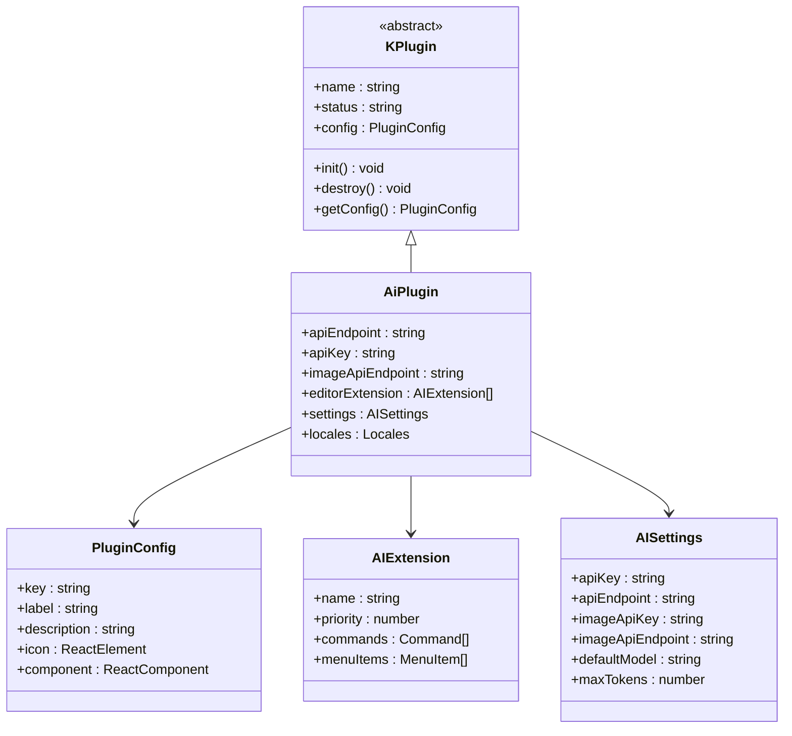

**图表来源**
- [packages/plugin-ai/src/index.tsx:8-24](file://packages/plugin-ai/src/index.tsx#L8-L24)
- [packages/plugin-ai/src/index.tsx:23-36](file://packages/plugin-ai/src/index.tsx#L23-L36)

### 实时协作系统

系统集成了Hocuspocus作为实时协作后端，支持多用户同时编辑文档。

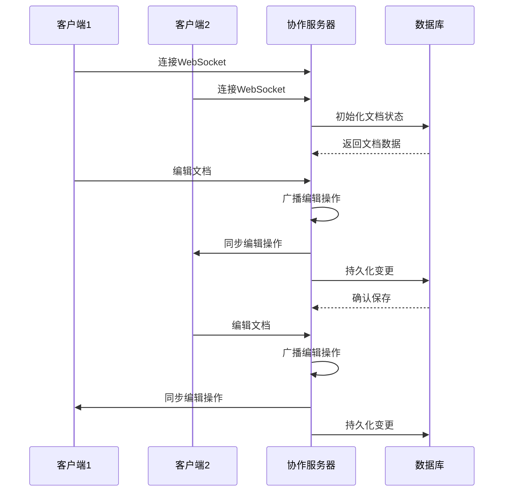

**图表来源**
- [packages/room-server/package.json:16-22](file://packages/room-server/package.json#L16-L22)

**章节来源**
- [packages/plugin-ai/src/index.tsx:1-81](file://packages/plugin-ai/src/index.tsx#L1-L81)
- [packages/common/src/index.ts:1-18](file://packages/common/src/index.ts#L1-L18)

## 架构概览

系统采用分层架构设计，从底层基础设施到上层应用功能，每一层都有明确的职责分工。

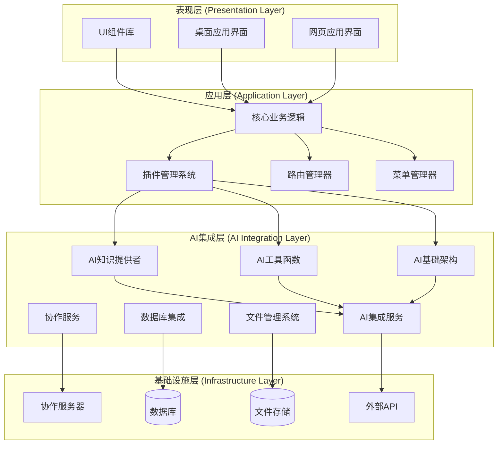

**图表来源**
- [apps/desktop/package.json:18-37](file://apps/desktop/package.json#L18-L37)
- [apps/vite/package.json:14-36](file://apps/vite/package.json#L14-L36)
- [packages/room-server/package.json:16-22](file://packages/room-server/package.json#L16-L22)

## 详细组件分析

### AI插件系统

AI插件是系统的核心增强功能，提供了文本生成、图像创建和内容转换等AI能力。

#### AI插件配置结构

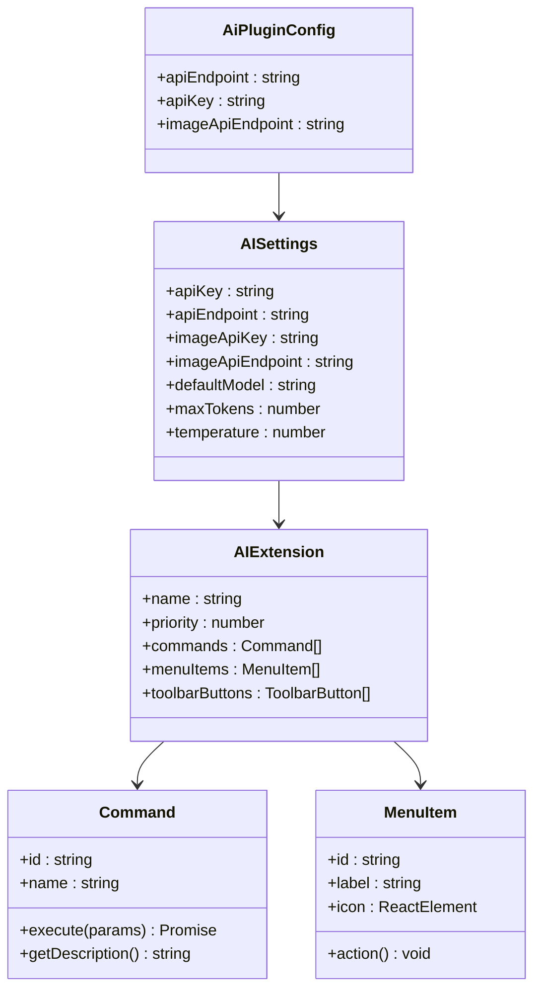

**图表来源**
- [packages/plugin-ai/src/index.tsx:8-21](file://packages/plugin-ai/src/index.tsx#L8-L21)
- [packages/plugin-ai/src/index.tsx:30-36](file://packages/plugin-ai/src/index.tsx#L30-L36)

#### AI工具功能流程


**图表来源**
- [packages/plugin-ai/src/index.tsx:26-81](file://packages/plugin-ai/src/index.tsx#L26-L81)

**章节来源**
- [packages/plugin-ai/src/index.tsx:1-81](file://packages/plugin-ai/src/index.tsx#L1-L81)
- [packages/plugin-ai/package.json:1-31](file://packages/plugin-ai/package.json#L1-L31)

### 插件管理系统

系统实现了灵活的插件管理机制，支持插件的动态加载、配置和生命周期管理。

#### 插件注册流程

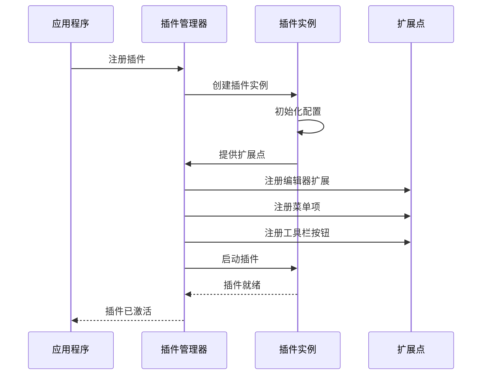

**图表来源**
- [packages/common/src/index.ts:3-12](file://packages/common/src/index.ts#L3-L12)

### 用户界面组件库

UI组件库基于shadcn/ui构建，提供了高质量的React组件和一致的设计系统。

#### 组件导出结构

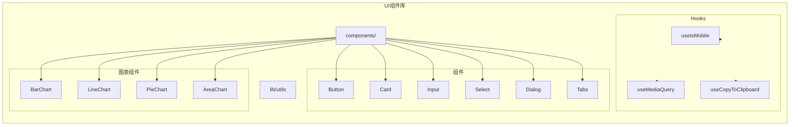

**图表来源**
- [packages/ui/src/index.ts:1-26](file://packages/ui/src/index.ts#L1-L26)

**章节来源**
- [packages/ui/src/index.ts:1-26](file://packages/ui/src/index.ts#L1-L26)

## AI知识提供者系统

### 系统概述

AI知识提供者系统是全新的AI模型集成架构，完全替代了之前的DeepSeek集成，提供了更强大的AI模型集成能力。该系统基于AI SDK V2接口标准，支持指数退避重试逻辑、OpenAI兼容工具转换和流式协议支持。

### 核心架构设计

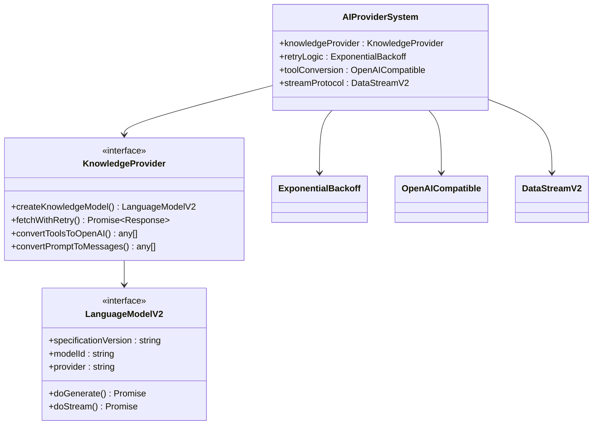

**图表来源**
- [packages/core/src/ai/model-provider/knowledge-provider.ts:168-354](file://packages/core/src/ai/model-provider/knowledge-provider.ts#L168-L354)

### 指数退避重试逻辑

系统实现了智能的指数退避重试机制，能够自动处理网络错误和服务器限流：

```mermaid
flowchart TD
Start([发起API请求]) --> Attempt{尝试次数}
Attempt --> |第1次| CheckStatus{检查HTTP状态}
CheckStatus --> |200 OK| Success[请求成功]
CheckStatus --> |429/502/503| Wait[等待退避时间]
Wait --> CalcDelay{计算延迟时间}
CalcDelay --> DelayTime[延迟: min(1000*2^attempt, 10000)]
DelayTime --> Retry[重试请求]
Retry --> Attempt
Attempt --> |超过最大重试次数| Fail[请求失败]
Success --> End([完成])
Fail --> End
```

**图表来源**
- [packages/core/src/ai/model-provider/knowledge-provider.ts:17-53](file://packages/core/src/ai/model-provider/knowledge-provider.ts#L17-L53)

### OpenAI兼容工具转换

系统提供了完整的OpenAI兼容工具转换功能，确保与AI SDK V2标准的兼容性：

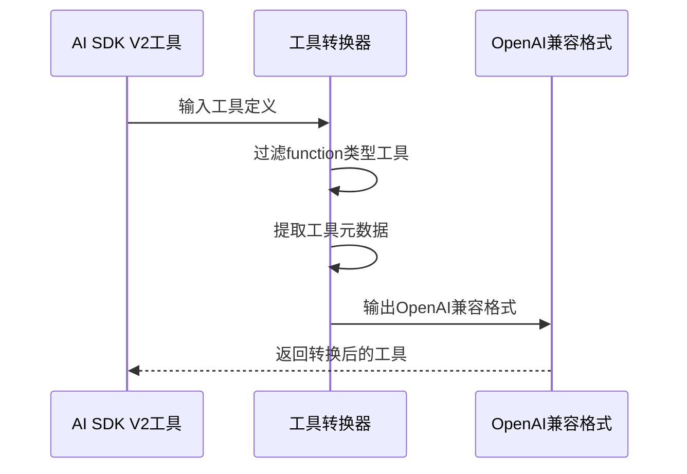

**图表来源**
- [packages/core/src/ai/model-provider/knowledge-provider.ts:58-70](file://packages/core/src/ai/model-provider/knowledge-provider.ts#L58-L70)

### 流式协议支持

系统支持AI SDK V2的流式协议，提供实时的AI响应流：

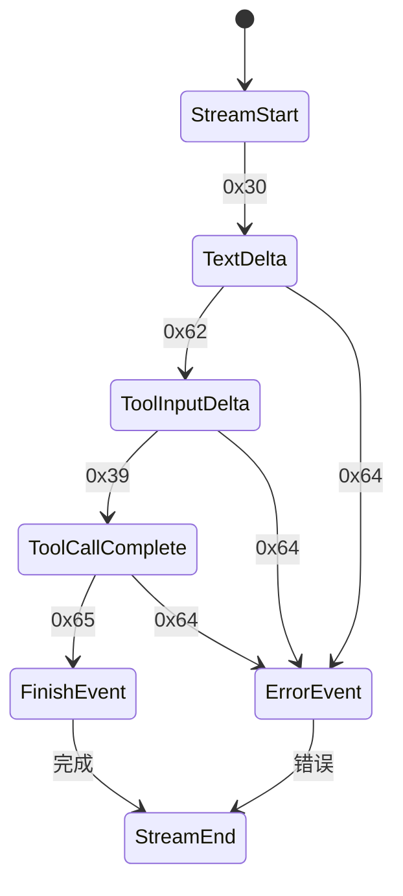

**图表来源**
- [packages/core/src/ai/model-provider/knowledge-provider.ts:283-338](file://packages/core/src/ai/model-provider/knowledge-provider.ts#L283-L338)

### AI基础架构集成

AI知识提供者系统与现有的AI基础架构无缝集成：

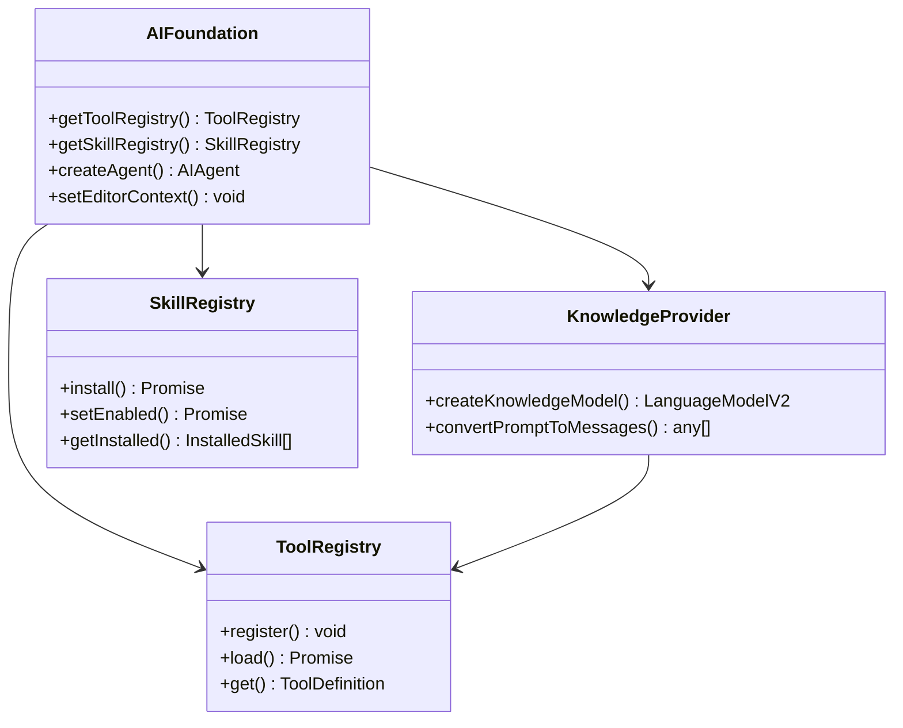

**图表来源**
- [packages/core/src/ai/foundation/ai-foundation.ts:29-48](file://packages/core/src/ai/foundation/ai-foundation.ts#L29-L48)
- [packages/core/src/ai/foundation/types.ts:239-309](file://packages/core/src/ai/foundation/types.ts#L239-L309)

**章节来源**
- [packages/core/src/ai/model-provider/knowledge-provider.ts:1-359](file://packages/core/src/ai/model-provider/knowledge-provider.ts#L1-L359)
- [packages/core/src/ai/ai-utils.ts:1-63](file://packages/core/src/ai/ai-utils.ts#L1-L63)
- [packages/core/src/ai/foundation/ai-foundation.ts:1-281](file://packages/core/src/ai/foundation/ai-foundation.ts#L1-L281)
- [packages/core/src/ai/foundation/types.ts:1-320](file://packages/core/src/ai/foundation/types.ts#L1-L320)
- [packages/core/src/ai/types.ts:1-156](file://packages/core/src/ai/types.ts#L1-L156)

## 依赖关系分析

系统采用工作区管理模式，通过pnpm实现高效的依赖管理。

```mermaid
graph TB
subgraph "根级依赖"
Pnpm[pnpm 9.1.4]
Turbo[turbo 2.5.4]
Node[Node >=18]
end
subgraph "应用依赖"
React[react 18.3.1]
Next[next]
Vite[vite 7.3.1]
Electron[electron 33.2.1]
end
subgraph "核心依赖"
Redux[redux 4.2.1]
Axios[axios 1.6.7]
Lodash[lodash 4.17.21]
UUID[uuid 10.0.0]
end
subgraph "AI相关依赖"
AISDK[@ai-sdk/*]
DeepSeek[@ai-sdk/deepseek]
OpenAI[openai]
end
subgraph "开发依赖"
TypeScript[typescript 5.8.3]
TailwindCSS[tailwindcss 3.4.17]
ESLint[eslint 8.57.0]
Rollup[rollup 4.45.1]
end
Pnpm --> React
Pnpm --> Redux
Pnpm --> Axios
Pnpm --> Lodash
Pnpm --> UUID
Pnpm --> AISDK
Pnpm --> DeepSeek
Pnpm --> OpenAI
React --> TypeScript
Redux --> TailwindCSS
Axios --> ESLint
Lodash --> Rollup
UUID --> TypeScript
```

**图表来源**
- [package.json:55-111](file://package.json#L55-L111)
- [apps/desktop/package.json:18-60](file://apps/desktop/package.json#L18-L60)

### 包依赖关系

```mermaid
graph TB
subgraph "应用包"
ViteApp[vite 应用]
DesktopApp[desktop 应用]
LandingPage[landing-page 应用]
LandingPageVite[landing-page-vite 应用]
end
subgraph "核心包"
Core[core]
Common[common]
UI[ui]
Icon[icon]
Editor[editor]
end
subgraph "AI相关包"
KnowledgeProvider[AI知识提供者]
AIUtils[AI工具函数]
AIFoundation[AI基础架构]
PluginAI[plugin-ai]
end
subgraph "插件包"
PluginMain[plugin-main]
PluginBitable[plugin-bitable]
PluginFileManager[plugin-file-manager]
PluginBlockReference[plugin-block-reference]
PluginDatabase[plugin-database]
PluginExcalidraw[plugin-excalidraw]
PluginDrawIO[plugin-drawio]
PluginMermaid[plugin-mermaid]
PluginMindMap[plugin-mindmap-canvas]
PluginWeaverOA[plugin-weaver-oa]
end
subgraph "基础设施"
RoomServer[room-server]
ElectronAdapter[electron-adapter]
end
ViteApp --> Core
ViteApp --> UI
ViteApp --> PluginAI
ViteApp --> PluginMain
ViteApp --> PluginBitable
DesktopApp --> Core
DesktopApp --> ElectronAdapter
DesktopApp --> PluginAI
PluginAI --> Core
PluginAI --> UI
PluginAI --> Common
PluginAI --> Editor
PluginAI --> Icon
PluginAI --> KnowledgeProvider
PluginAI --> AIUtils
PluginAI --> AIFoundation
PluginMain --> Core
PluginMain --> UI
PluginMain --> Common
PluginBitable --> Core
PluginBitable --> UI
PluginBitable --> Common
RoomServer --> Core
ElectronAdapter --> Core
```

**图表来源**
- [apps/vite/package.json:14-36](file://apps/vite/package.json#L14-L36)
- [apps/desktop/package.json:18-37](file://apps/desktop/package.json#L18-L37)
- [packages/plugin-ai/package.json:15-23](file://packages/plugin-ai/package.json#L15-L23)

**章节来源**
- [package.json:1-124](file://package.json#L1-L124)
- [pnpm-workspace.yaml:1-4](file://pnpm-workspace.yaml#L1-L4)

## 性能考虑

系统在多个层面进行了性能优化，包括构建优化、运行时优化和缓存策略。

### 构建性能优化

- **Turborepo缓存**：利用任务缓存减少重复构建时间
- **并行构建**：支持多包并行构建
- **增量构建**：只构建发生变化的包
- **依赖共享**：通过pnpm工作区实现依赖共享

### 运行时性能优化

- **懒加载插件**：插件按需加载，减少初始包大小
- **虚拟滚动**：大数据量列表使用虚拟滚动
- **防抖节流**：高频事件使用防抖节流优化
- **内存管理**：及时清理事件监听器和定时器
- **流式处理**：AI响应采用流式处理，提升用户体验

### 缓存策略

- **浏览器缓存**：静态资源长期缓存
- **API缓存**：常用API响应缓存
- **协作状态缓存**：Yjs协作状态本地缓存
- **图像缓存**：生成的图像缓存到本地存储
- **模型响应缓存**：AI模型输出结果缓存

### AI性能优化

- **指数退避重试**：智能处理网络错误和服务器限流
- **流式协议**：支持实时响应流，减少等待时间
- **工具调用优化**：高效的工具执行和结果处理
- **上下文管理**：智能的文档上下文提取和管理

## 故障排除指南

### 常见问题诊断

#### 插件加载失败

**症状**：插件无法正常加载或显示异常

**排查步骤**：
1. 检查插件配置是否正确
2. 验证插件依赖是否完整
3. 查看控制台错误信息
4. 确认插件版本兼容性

#### AI功能异常

**症状**：AI文本生成或图像生成功能失败

**排查步骤**：
1. 验证AI API密钥配置
2. 检查网络连接状态
3. 确认API端点可达性
4. 查看AI服务响应状态
5. 检查指数退避重试日志

#### 实时协作问题

**症状**：多人协作时同步异常或延迟

**排查步骤**：
1. 检查协作服务器状态
2. 验证WebSocket连接
3. 确认数据库连接正常
4. 查看网络延迟情况

#### AI知识提供者问题

**症状**：AI知识提供者无法正常工作

**排查步骤**：
1. 验证Knowledge Provider配置
2. 检查AI SDK V2接口兼容性
3. 确认流式协议支持
4. 查看工具转换日志
5. 检查指数退避重试机制

**章节来源**
- [packages/plugin-ai/src/index.tsx:26-81](file://packages/plugin-ai/src/index.tsx#L26-L81)
- [packages/room-server/package.json:10-15](file://packages/room-server/package.json#L10-L15)
- [packages/core/src/ai/model-provider/knowledge-provider.ts:17-53](file://packages/core/src/ai/model-provider/knowledge-provider.ts#L17-L53)

## 结论

AI基础架构系统是一个设计精良的现代化知识管理平台，具有以下特点：

### 技术优势

- **模块化架构**：清晰的分层设计和插件系统
- **高性能构建**：基于Turborepo的高效构建体系
- **实时协作**：基于Hocuspocus的专业协作解决方案
- **AI集成**：深度集成的AI功能和扩展接口
- **AI知识提供者系统**：全新的AI模型集成架构，支持AI SDK V2接口、指数退避重试逻辑、OpenAI兼容工具转换和流式协议支持

### 架构特色

- **可扩展性**：插件架构支持功能扩展
- **可维护性**：清晰的代码结构和文档
- **可移植性**：支持Web和桌面应用部署
- **可国际化**：完整的多语言支持
- **AI架构现代化**：采用最新的AI SDK V2标准

### 发展方向

系统目前处于快速发展阶段，未来计划包括：
- 增强AI功能和模型支持
- 优化移动端体验
- 扩展插件生态
- 改进离线支持
- 加强安全性和权限管理
- 深化AI知识提供者系统的功能

该系统为知识管理和协作提供了一个强大而灵活的基础平台，适合各种规模的团队和应用场景使用。