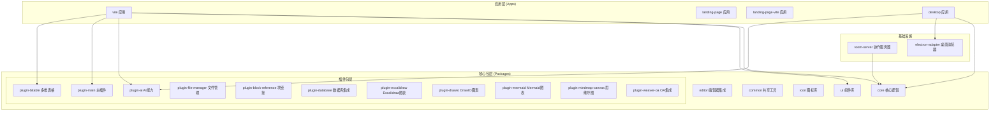
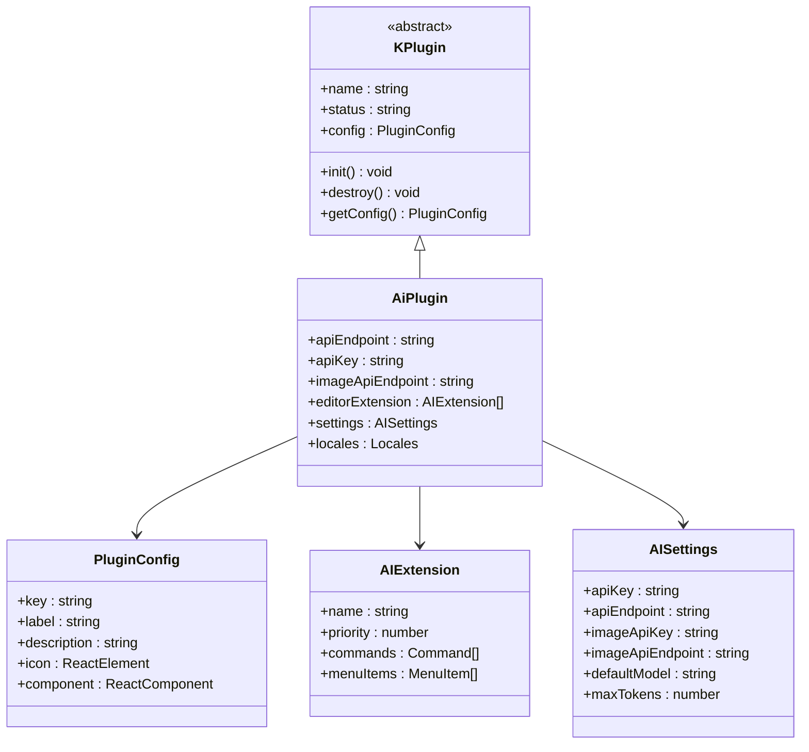
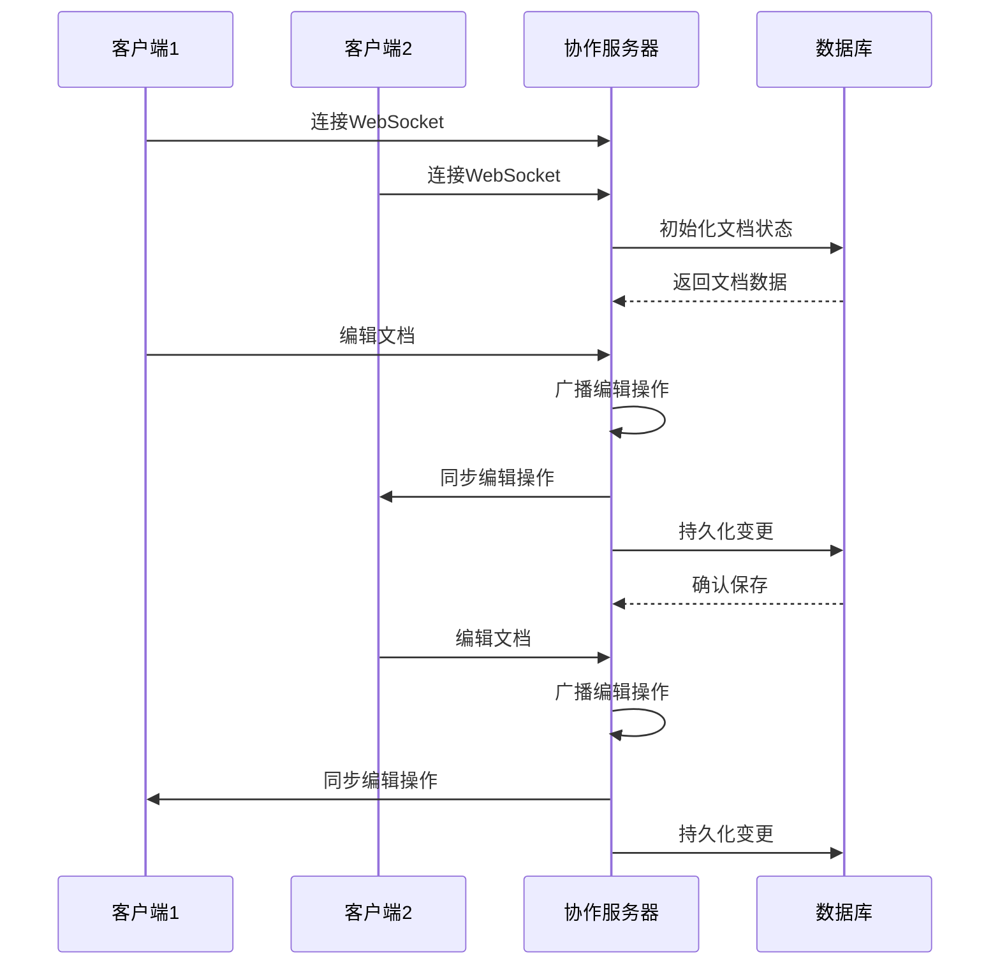
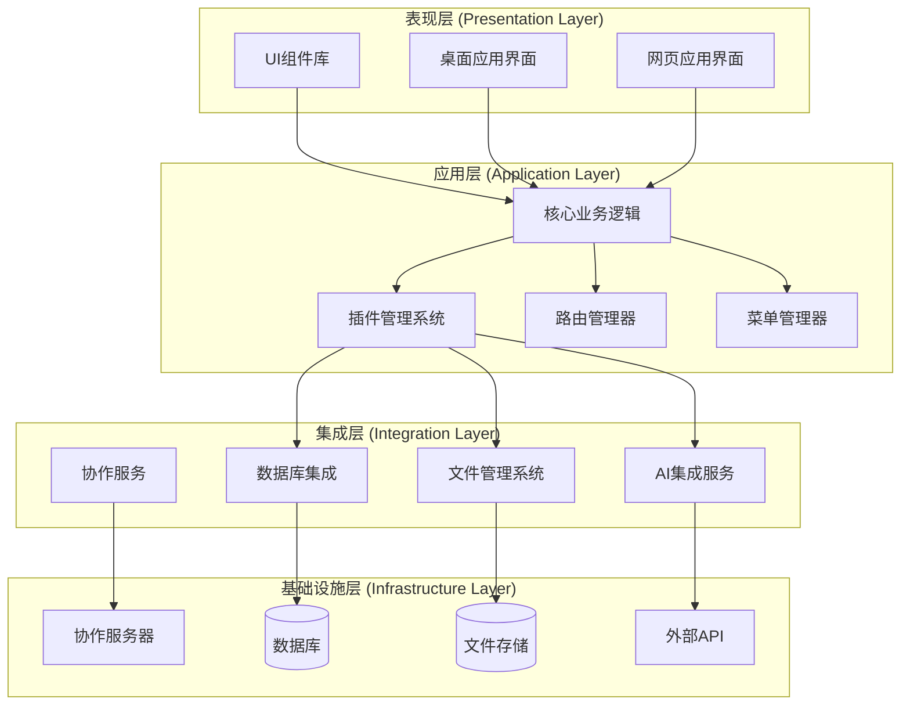
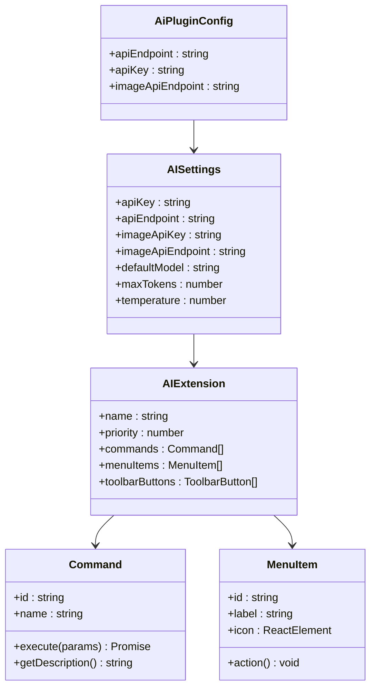
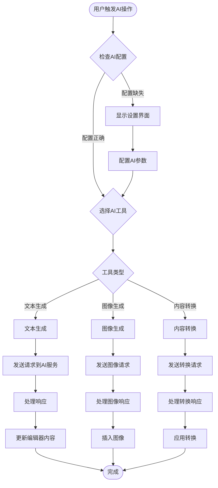
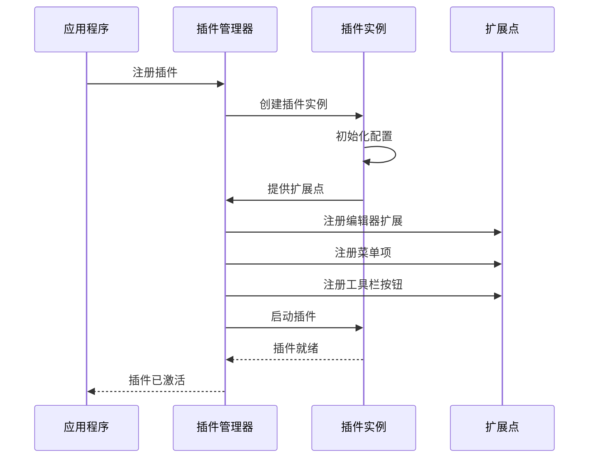
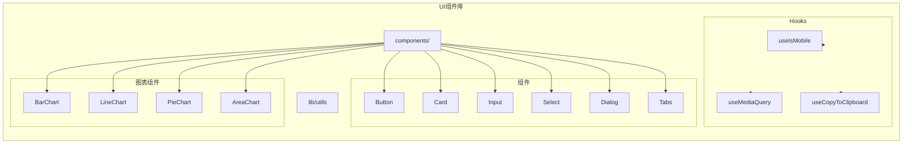
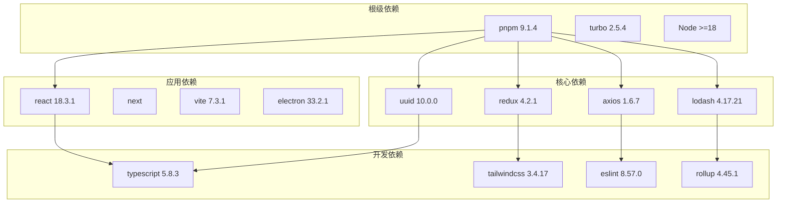
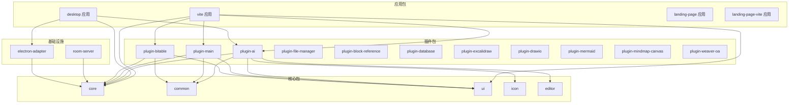

# AI基础架构系统

<cite>
**本文档引用的文件**
- [README.md](file://README.md)
- [package.json](file://package.json)
- [pnpm-workspace.yaml](file://pnpm-workspace.yaml)
- [turbo.json](file://turbo.json)
- [apps/desktop/package.json](file://apps/desktop/package.json)
- [apps/landing-page/package.json](file://apps/landing-page/package.json)
- [apps/landing-page-vite/package.json](file://apps/landing-page-vite/package.json)
- [apps/vite/package.json](file://apps/vite/package.json)
- [packages/plugin-ai/package.json](file://packages/plugin-ai/package.json)
- [packages/plugin-ai/src/index.tsx](file://packages/plugin-ai/src/index.tsx)
- [packages/ui/src/index.ts](file://packages/ui/src/index.ts)
- [packages/common/src/index.ts](file://packages/common/src/index.ts)
- [packages/room-server/package.json](file://packages/room-server/package.json)
- [packages/electron-adapter/package.json](file://packages/electron-adapter/package.json)
</cite>

## 目录
1. [项目简介](#项目简介)
2. [项目结构](#项目结构)
3. [核心组件](#核心组件)
4. [架构概览](#架构概览)
5. [详细组件分析](#详细组件分析)
6. [依赖关系分析](#依赖关系分析)
7. [性能考虑](#性能考虑)
8. [故障排除指南](#故障排除指南)
9. [结论](#结论)

## 项目简介

AI基础架构系统是一个强大的协作知识管理平台，集成了丰富的富文本编辑、实时协作、AI增强功能和广泛的插件生态系统。该系统采用现代Web技术构建，具备实时协作能力和多维度表格、可视化绘图、文件管理等核心功能。

### 主要特性

- **富文本编辑器**：基于Tiptap的协作编辑支持
- **实时协作**：多用户编辑的Hocuspocus后端
- **插件架构**：可扩展的插件系统
- **AI集成**：AI驱动的文本生成、图像创建和内容转换
- **多维表格**：类似电子表格的表格，支持多种视图类型
- **可视化绘图**：支持Excalidraw、DrawIO、Mermaid和思维导图
- **文件管理**：内置文档组织系统
- **块引用**：跨文档块链接和嵌入
- **国际化**：完整的多语言支持

### 技术栈

- **前端**：React 18、TypeScript 5、Vite、Next.js、Tailwind CSS、shadcn/ui
- **构建与基础设施**：Turborepo、pnpm、Rollup、Docker
- **AI集成**：DeepSeek AI、Vercel AI SDK、图像生成

## 项目结构

该项目采用monorepo架构，使用Turborepo进行构建管理，通过pnpm工作区实现包管理。整体结构清晰地分离了应用层和核心包层。

**图表来源**
- [pnpm-workspace.yaml](file://pnpm-workspace.yaml#L1-L4)
- [apps/vite/package.json](file://apps/vite/package.json#L14-L36)
- [apps/desktop/package.json](file://apps/desktop/package.json#L18-L37)

**章节来源**
- [README.md](file://README.md#L66-L97)
- [pnpm-workspace.yaml](file://pnpm-workspace.yaml#L1-L4)
- [turbo.json](file://turbo.json#L1-L27)

## 核心组件

### 插件架构系统

系统的核心是基于插件的架构设计，每个插件都是独立的功能模块，可以动态加载和卸载。

**图表来源**
- [packages/plugin-ai/src/index.tsx](file://packages/plugin-ai/src/index.tsx#L8-L24)
- [packages/plugin-ai/src/index.tsx](file://packages/plugin-ai/src/index.tsx#L23-L36)

### 实时协作系统

系统集成了Hocuspocus作为实时协作后端，支持多用户同时编辑文档。

**图表来源**
- [packages/room-server/package.json](file://packages/room-server/package.json#L16-L22)

**章节来源**
- [packages/plugin-ai/src/index.tsx](file://packages/plugin-ai/src/index.tsx#L1-L81)
- [packages/common/src/index.ts](file://packages/common/src/index.ts#L1-L18)

## 架构概览

系统采用分层架构设计，从底层基础设施到上层应用功能，每一层都有明确的职责分工。

**图表来源**
- [apps/desktop/package.json](file://apps/desktop/package.json#L18-L37)
- [apps/vite/package.json](file://apps/vite/package.json#L14-L36)
- [packages/room-server/package.json](file://packages/room-server/package.json#L16-L22)

## 详细组件分析

### AI插件系统

AI插件是系统的核心增强功能，提供了文本生成、图像创建和内容转换等AI能力。

#### AI插件配置结构

**图表来源**
- [packages/plugin-ai/src/index.tsx](file://packages/plugin-ai/src/index.tsx#L8-L21)
- [packages/plugin-ai/src/index.tsx](file://packages/plugin-ai/src/index.tsx#L30-L36)

#### AI工具功能流程

**图表来源**
- [packages/plugin-ai/src/index.tsx](file://packages/plugin-ai/src/index.tsx#L26-L81)

**章节来源**
- [packages/plugin-ai/src/index.tsx](file://packages/plugin-ai/src/index.tsx#L1-L81)
- [packages/plugin-ai/package.json](file://packages/plugin-ai/package.json#L1-L31)

### 插件管理系统

系统实现了灵活的插件管理机制，支持插件的动态加载、配置和生命周期管理。

#### 插件注册流程

**图表来源**
- [packages/common/src/index.ts](file://packages/common/src/index.ts#L3-L12)

### 用户界面组件库

UI组件库基于shadcn/ui构建，提供了高质量的React组件和一致的设计系统。

#### 组件导出结构

**图表来源**
- [packages/ui/src/index.ts](file://packages/ui/src/index.ts#L1-L26)

**章节来源**
- [packages/ui/src/index.ts](file://packages/ui/src/index.ts#L1-L26)

## 依赖关系分析

系统采用工作区管理模式，通过pnpm实现高效的依赖管理。

**图表来源**
- [package.json](file://package.json#L55-L111)
- [apps/desktop/package.json](file://apps/desktop/package.json#L18-L60)

### 包依赖关系

**图表来源**
- [apps/vite/package.json](file://apps/vite/package.json#L14-L36)
- [apps/desktop/package.json](file://apps/desktop/package.json#L18-L37)
- [packages/plugin-ai/package.json](file://packages/plugin-ai/package.json#L15-L23)

**章节来源**
- [package.json](file://package.json#L1-L124)
- [pnpm-workspace.yaml](file://pnpm-workspace.yaml#L1-L4)

## 性能考虑

系统在多个层面进行了性能优化，包括构建优化、运行时优化和缓存策略。

### 构建性能优化

- **Turborepo缓存**：利用任务缓存减少重复构建时间
- **并行构建**：支持多包并行构建
- **增量构建**：只构建发生变化的包
- **依赖共享**：通过pnpm工作区实现依赖共享

### 运行时性能优化

- **懒加载插件**：插件按需加载，减少初始包大小
- **虚拟滚动**：大数据量列表使用虚拟滚动
- **防抖节流**：高频事件使用防抖节流优化
- **内存管理**：及时清理事件监听器和定时器

### 缓存策略

- **浏览器缓存**：静态资源长期缓存
- **API缓存**：常用API响应缓存
- **协作状态缓存**：Yjs协作状态本地缓存
- **图像缓存**：生成的图像缓存到本地存储

## 故障排除指南

### 常见问题诊断

#### 插件加载失败

**症状**：插件无法正常加载或显示异常

**排查步骤**：
1. 检查插件配置是否正确
2. 验证插件依赖是否完整
3. 查看控制台错误信息
4. 确认插件版本兼容性

#### AI功能异常

**症状**：AI文本生成或图像生成功能失败

**排查步骤**：
1. 验证AI API密钥配置
2. 检查网络连接状态
3. 确认API端点可达性
4. 查看AI服务响应状态

#### 实时协作问题

**症状**：多人协作时同步异常或延迟

**排查步骤**：
1. 检查协作服务器状态
2. 验证WebSocket连接
3. 确认数据库连接正常
4. 查看网络延迟情况

**章节来源**
- [packages/plugin-ai/src/index.tsx](file://packages/plugin-ai/src/index.tsx#L26-L81)
- [packages/room-server/package.json](file://packages/room-server/package.json#L10-L15)

## 结论

AI基础架构系统是一个设计精良的现代化知识管理平台，具有以下特点：

### 技术优势

- **模块化架构**：清晰的分层设计和插件系统
- **高性能构建**：基于Turborepo的高效构建体系
- **实时协作**：基于Hocuspocus的专业协作解决方案
- **AI集成**：深度集成的AI功能和扩展接口

### 架构特色

- **可扩展性**：插件架构支持功能扩展
- **可维护性**：清晰的代码结构和文档
- **可移植性**：支持Web和桌面应用部署
- **可国际化**：完整的多语言支持

### 发展方向

系统目前处于快速发展阶段，未来计划包括：
- 增强AI功能和模型支持
- 优化移动端体验
- 扩展插件生态
- 改进离线支持
- 加强安全性和权限管理

该系统为知识管理和协作提供了一个强大而灵活的基础平台，适合各种规模的团队和应用场景使用。