# AI聊天客户端系统

<cite>
**本文档引用的文件**
- [README.md](file://README.md)
- [package.json](file://package.json)
- [apps/desktop/package.json](file://apps/desktop/package.json)
- [apps/landing-page/package.json](file://apps/landing-page/package.json)
- [apps/vite/package.json](file://apps/vite/package.json)
- [apps/desktop/src/main/index.ts](file://apps/desktop/src/main/index.ts)
- [apps/desktop/src/main/ipc.ts](file://apps/desktop/src/main/ipc.ts)
- [apps/desktop/src/main/services.ts](file://apps/desktop/src/main/services.ts)
- [apps/desktop/src/renderer/src/main.tsx](file://apps/desktop/src/renderer/src/main.tsx)
- [apps/desktop/src/shared/types.ts](file://apps/desktop/src/shared/types.ts)
- [apps/desktop/electron.vite.config.ts](file://apps/desktop/electron.vite.config.ts)
- [packages/plugin-ai/package.json](file://packages/plugin-ai/package.json)
- [packages/core/package.json](file://packages/core/package.json)
- [packages/electron-adapter/package.json](file://packages/electron-adapter/package.json)
- [packages/common/src/ai/chat-client/sse-parser.ts](file://packages/common/src/ai/chat-client/sse-parser.ts)
- [packages/common/src/ai/chat-client/types.ts](file://packages/common/src/ai/chat-client/types.ts)
- [packages/common/src/ai/chat-client/index.ts](file://packages/common/src/ai/chat-client/index.ts)
- [packages/common/src/ai/use-agent-optimized.tsx](file://packages/common/src/ai/use-agent-optimized.tsx)
- [packages/common/src/ai/foundation/hooks/use-streaming.ts](file://packages/common/src/ai/foundation/hooks/use-streaming.ts)
- [packages/common/src/ai/utils/use-stream-buffer.ts](file://packages/common/src/ai/utils/use-stream-buffer.ts)
- [packages/common/src/ai/capabilities/CapabilityCatalog.ts](file://packages/common/src/ai/capabilities/CapabilityCatalog.ts)
- [packages/common/src/ai/capabilities/index.ts](file://packages/common/src/ai/capabilities/index.ts)
- [packages/common/src/ai/providers/SkillProvider.ts](file://packages/common/src/ai/providers/SkillProvider.ts)
- [packages/common/src/ai/providers/ToolProvider.ts](file://packages/common/src/ai/providers/ToolProvider.ts)
- [packages/common/src/ai/model-provider/knowledge-provider.ts](file://packages/common/src/ai/model-provider/knowledge-provider.ts)
- [packages/common/src/ai/ai-utils.ts](file://packages/common/src/ai/ai-utils.ts)
</cite>

## 更新摘要
**所做更改**
- 新增能力目录集成系统，支持技能和工具的完整目录收集
- 增强推理内容流式传输支持，包含reasoning-delta事件类型
- 新增模型发现功能，支持动态获取可用模型列表
- 重构工具调用匹配机制，完全符合OpenAI流式规范
- 更新SSE解析器以支持多事件流式处理和工具调用索引匹配
- 增强注解事件处理，支持Data Stream v2协议

## 目录
1. [简介](#简介)
2. [项目结构](#项目结构)
3. [核心组件](#核心组件)
4. [架构概览](#架构概览)
5. [详细组件分析](#详细组件分析)
6. [依赖关系分析](#依赖关系分析)
7. [性能考虑](#性能考虑)
8. [故障排除指南](#故障排除指南)
9. [结论](#结论)

## 简介

AI聊天客户端系统是一个基于现代Web技术构建的协作知识管理平台，集成了丰富的文本编辑、实时协作、AI智能功能和可扩展的插件生态系统。该系统采用Electron框架开发桌面应用程序，支持多平台部署（Windows、macOS、Linux），为用户提供强大的AI聊天交互体验。

**新增功能**：
- **能力目录集成**：完整的技能和工具目录收集系统，支持inline发送到后端
- **推理内容流式传输**：支持reasoning-delta事件，实现思维过程的实时展示
- **模型发现功能**：动态获取可用模型列表，支持模型切换和配置
- **增强的SSE流式处理**：支持多事件流式解析和工具调用索引匹配
- **注解事件处理**：支持Data Stream v2协议的注解事件传输

系统的核心特性包括：
- **富文本编辑器**：基于Tiptap的协作编辑功能
- **实时协作**：通过Hocuspocus实现多用户同步编辑
- **AI集成**：深度集成DeepSeek AI进行文本生成和聊天对话
- **插件架构**：可扩展的插件系统支持自定义功能
- **多维度表格**：支持多种视图模式的数据管理
- **可视化绘图**：集成多种图表工具如Excalidraw、DrawIO、Mermaid等

## 项目结构

该项目采用Monorepo架构，使用Turborepo作为构建系统，组织结构清晰且模块化：

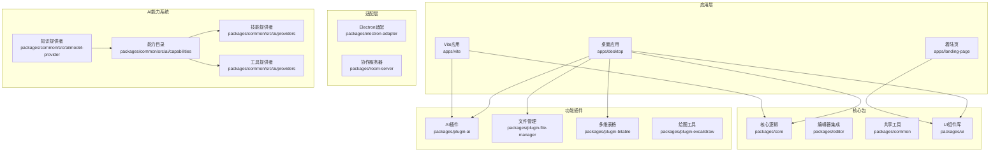

**图表来源**
- [README.md:66-97](file://README.md#L66-L97)
- [package.json:1-124](file://package.json#L1-L124)

**章节来源**
- [README.md:66-97](file://README.md#L66-L97)
- [package.json:1-124](file://package.json#L1-L124)

## 核心组件

### 桌面应用程序核心

桌面应用程序是整个系统的核心执行环境，基于Electron框架构建，提供本地化的AI聊天体验：

- **主进程管理**：负责应用程序生命周期管理和系统级操作
- **渲染进程**：运行React应用，提供用户界面
- **预加载脚本**：在安全上下文中与主进程通信
- **IPC通信**：实现主进程与渲染进程之间的消息传递

### AI插件系统

AI插件是系统的核心功能模块，提供智能聊天和内容生成功能：

- **DeepSeek集成**：支持多种AI模型的文本生成
- **流式响应**：基于Vercel AI SDK实现实时流式输出
- **图像生成**：集成AI图像创建功能
- **多模态处理**：支持文本、图像等多种内容类型
- **增强的SSE解析**：支持多事件流式处理和工具调用匹配
- **能力目录集成**：完整的技能和工具目录收集系统
- **推理内容传输**：支持思维过程的实时展示

### 能力目录系统

能力目录系统是AI功能的核心基础设施，提供完整的技能和工具目录管理：

- **技能目录收集**：收集内置、插件和用户安装的技能
- **工具目录管理**：管理完整的工具元数据和执行器
- **目录版本控制**：基于哈希的目录版本管理，支持缓存优化
- **前端执行支持**：支持工具在前端的即时执行
- **后端激活机制**：通过技能负载向后端传递工具定义

### 知识提供者

知识提供者是AI模型的核心适配层，实现与后端服务的通信：

- **模型发现**：支持动态获取可用模型列表
- **流式传输**：支持Data Stream v2协议的流式响应
- **注解处理**：处理代理状态、委托任务等注解事件
- **双向工具调用**：支持前后端的工具调用协作
- **重试机制**：实现指数退避的请求重试逻辑

### SSE流式处理系统

SSE流式处理系统是AI聊天的核心基础设施，支持高效的实时数据传输：

- **多事件解析器**：从单个SSE事件中提取多个事件类型
- **工具调用匹配**：基于索引的工具调用解析机制
- **流式缓冲**：优化UI更新频率的RAF缓冲机制
- **错误处理**：完善的流式传输错误恢复机制
- **推理内容支持**：支持思维过程的增量传输

**章节来源**
- [apps/desktop/src/main/index.ts:1-115](file://apps/desktop/src/main/index.ts#L1-L115)
- [apps/desktop/src/main/services.ts:1-197](file://apps/desktop/src/main/services.ts#L1-L197)
- [packages/plugin-ai/package.json:1-30](file://packages/plugin-ai/package.json#L1-L30)
- [packages/common/src/ai/chat-client/sse-parser.ts:1-242](file://packages/common/src/ai/chat-client/sse-parser.ts#L1-L242)
- [packages/common/src/ai/capabilities/CapabilityCatalog.ts:1-127](file://packages/common/src/ai/capabilities/CapabilityCatalog.ts#L1-L127)
- [packages/common/src/ai/model-provider/knowledge-provider.ts:1-422](file://packages/common/src/ai/model-provider/knowledge-provider.ts#L1-L422)

## 架构概览

系统采用分层架构设计，确保各组件间的松耦合和高内聚：

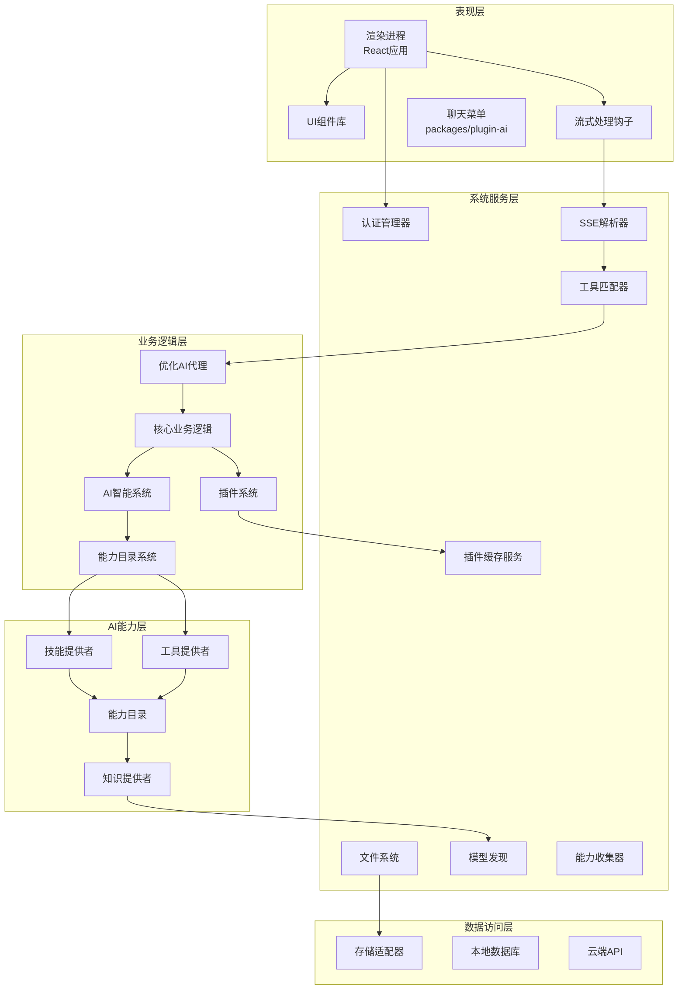

**图表来源**
- [apps/desktop/src/main/services.ts:44-133](file://apps/desktop/src/main/services.ts#L44-L133)
- [apps/desktop/src/main/ipc.ts:18-829](file://apps/desktop/src/main/ipc.ts#L18-L829)
- [packages/common/src/ai/chat-client/sse-parser.ts:35-70](file://packages/common/src/ai/chat-client/sse-parser.ts#L35-L70)
- [packages/common/src/ai/use-agent-optimized.tsx:355-389](file://packages/common/src/ai/use-agent-optimized.tsx#L355-L389)
- [packages/common/src/ai/capabilities/CapabilityCatalog.ts:22-112](file://packages/common/src/ai/capabilities/CapabilityCatalog.ts#L22-L112)
- [packages/common/src/ai/model-provider/knowledge-provider.ts:360-421](file://packages/common/src/ai/model-provider/knowledge-provider.ts#L360-L421)

## 详细组件分析

### 主进程架构

主进程负责应用程序的核心管理和系统级操作：

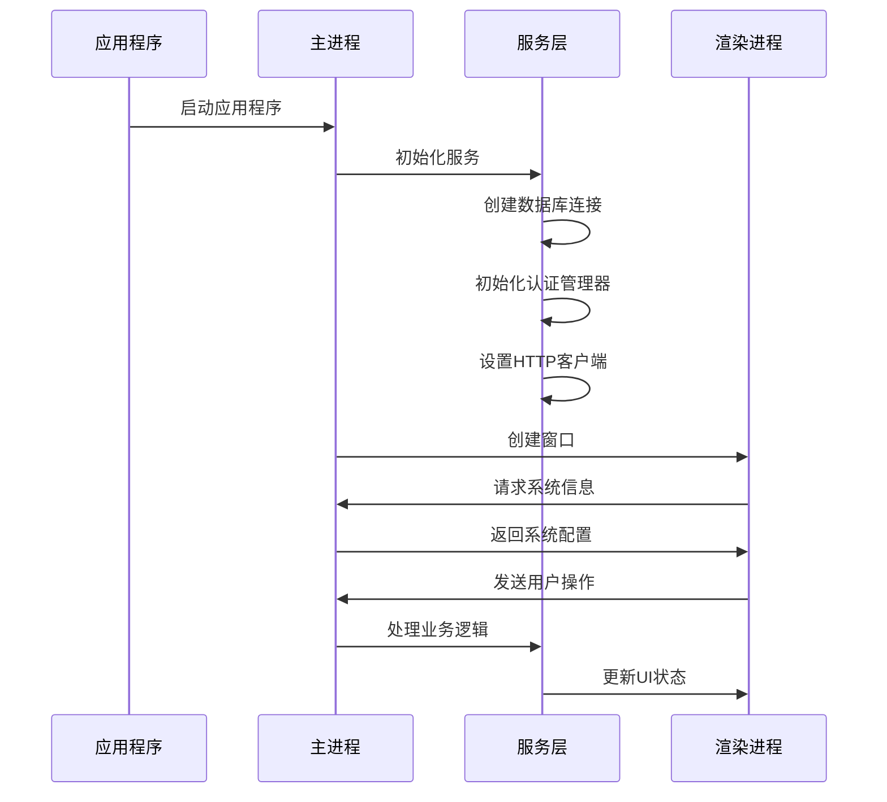

**图表来源**
- [apps/desktop/src/main/index.ts:67-107](file://apps/desktop/src/main/index.ts#L67-L107)
- [apps/desktop/src/main/services.ts:44-133](file://apps/desktop/src/main/services.ts#L44-L133)

### IPC通信机制

进程间通信(IPC)是桌面应用的关键组件，实现主进程与渲染进程的安全通信：

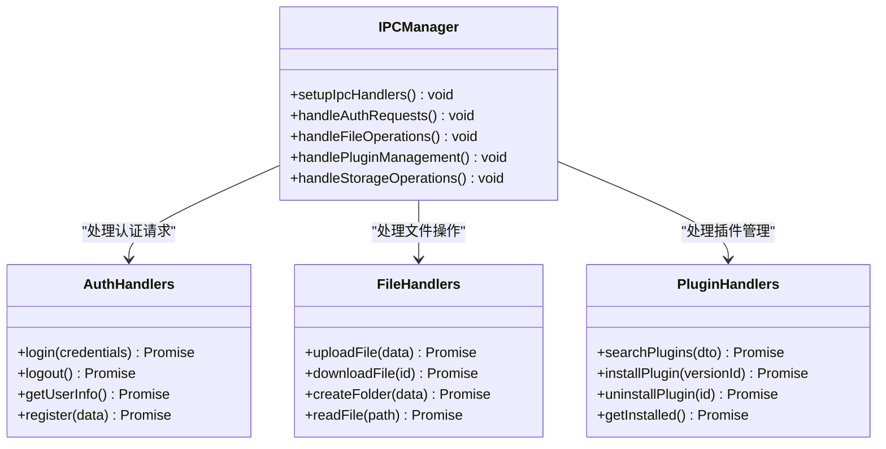

**图表来源**
- [apps/desktop/src/main/ipc.ts:18-829](file://apps/desktop/src/main/ipc.ts#L18-L829)

### AI聊天系统

AI聊天系统是整个应用的核心智能功能，提供自然语言处理和内容生成能力：

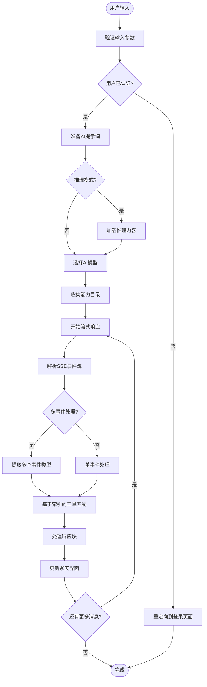

**图表来源**
- [packages/plugin-ai/package.json:15-22](file://packages/plugin-ai/package.json#L15-L22)
- [packages/core/package.json:18-34](file://packages/core/package.json#L18-L34)
- [packages/common/src/ai/chat-client/sse-parser.ts:120-218](file://packages/common/src/ai/chat-client/sse-parser.ts#L120-L218)
- [packages/common/src/ai/use-agent-optimized.tsx:355-389](file://packages/common/src/ai/use-agent-optimized.tsx#L355-L389)

**章节来源**
- [apps/desktop/src/main/ipc.ts:21-69](file://apps/desktop/src/main/ipc.ts#L21-L69)
- [apps/desktop/src/main/ipc.ts:531-550](file://apps/desktop/src/main/ipc.ts#L531-L550)

### 能力目录系统

能力目录系统是AI功能的核心基础设施，提供完整的技能和工具目录管理：

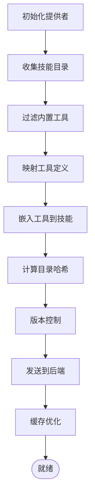

**图表来源**
- [packages/common/src/ai/capabilities/CapabilityCatalog.ts:37-112](file://packages/common/src/ai/capabilities/CapabilityCatalog.ts#L37-L112)
- [packages/common/src/ai/providers/SkillProvider.ts:16-109](file://packages/common/src/ai/providers/SkillProvider.ts#L16-L109)
- [packages/common/src/ai/providers/ToolProvider.ts:31-177](file://packages/common/src/ai/providers/ToolProvider.ts#L31-L177)

### 模型发现功能

模型发现功能允许动态获取可用的AI模型列表：

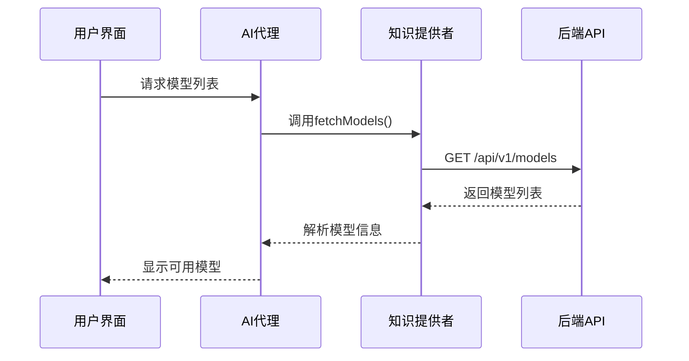

**图表来源**
- [packages/common/src/ai/chat-client/index.ts:370-395](file://packages/common/src/ai/chat-client/index.ts#L370-L395)
- [packages/common/src/ai/model-provider/knowledge-provider.ts:200-210](file://packages/common/src/ai/model-provider/knowledge-provider.ts#L200-L210)

### 推理内容流式传输

推理内容流式传输支持思维过程的实时展示：

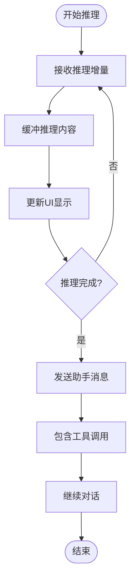

**图表来源**
- [packages/common/src/ai/chat-client/types.ts:196-240](file://packages/common/src/ai/chat-client/types.ts#L196-L240)
- [packages/common/src/ai/use-agent-optimized.tsx:336-341](file://packages/common/src/ai/use-agent-optimized.tsx#L336-L341)

### SSE解析器重构

SSE解析器已从单事件处理机制重构为多事件处理机制，支持从单个SSE事件中提取多个事件类型：

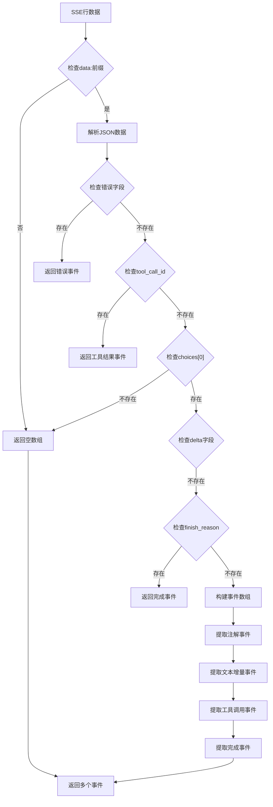

**图表来源**
- [packages/common/src/ai/chat-client/sse-parser.ts:75-94](file://packages/common/src/ai/chat-client/sse-parser.ts#L75-L94)
- [packages/common/src/ai/chat-client/sse-parser.ts:120-218](file://packages/common/src/ai/chat-client/sse-parser.ts#L120-L218)

### 工具调用匹配机制

工具调用匹配已从ID-based改为index-based，完全符合OpenAI流式规范：

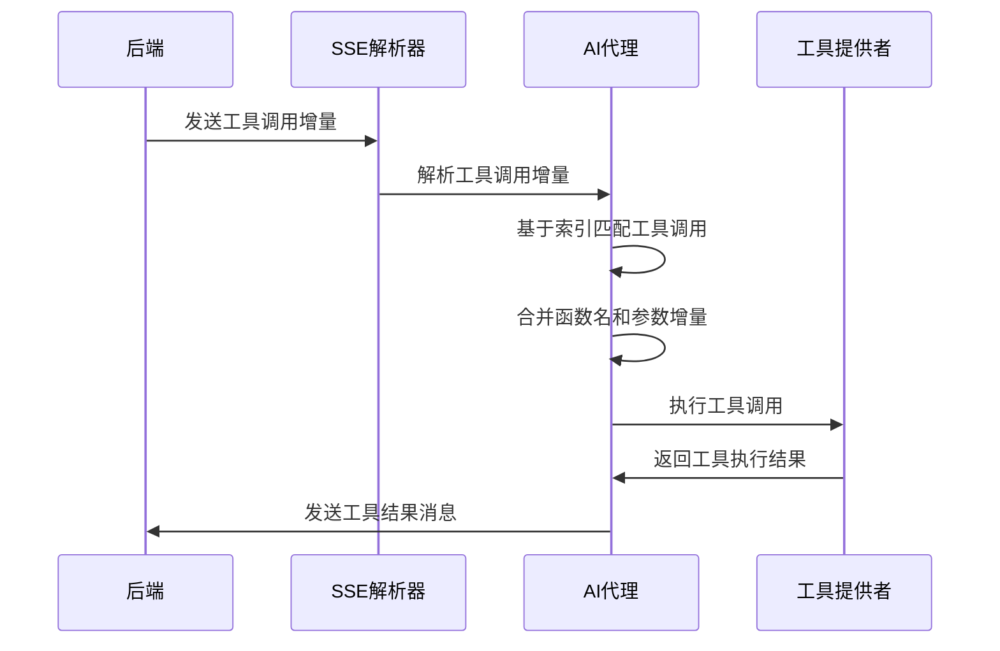

**图表来源**
- [packages/common/src/ai/use-agent-optimized.tsx:355-389](file://packages/common/src/ai/use-agent-optimized.tsx#L355-L389)
- [packages/common/src/ai/chat-client/index.ts:98-116](file://packages/common/src/ai/chat-client/index.ts#L98-L116)

### 存储管理系统

存储管理系统提供统一的数据持久化解决方案，支持本地和云端存储：

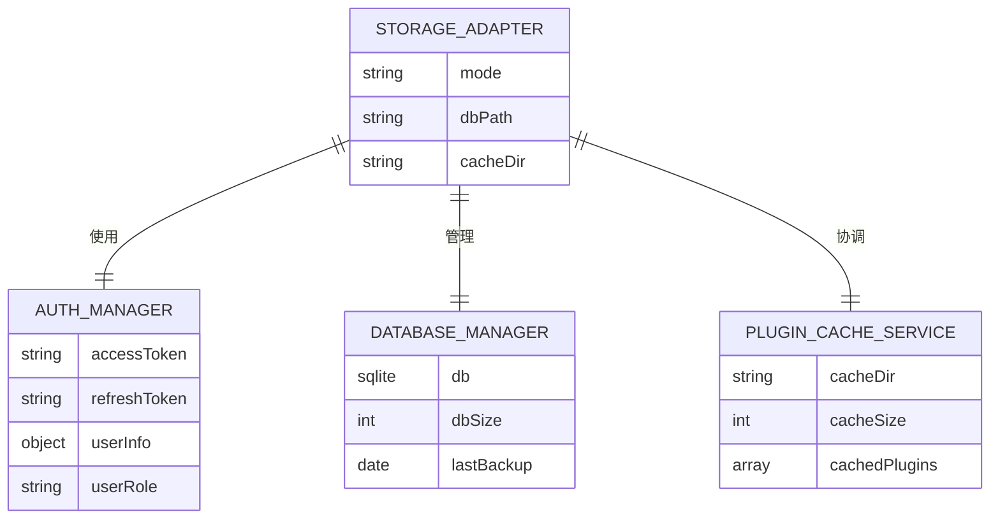

**图表来源**
- [apps/desktop/src/main/services.ts:95-115](file://apps/desktop/src/main/services.ts#L95-L115)

**章节来源**
- [apps/desktop/src/main/services.ts:149-197](file://apps/desktop/src/main/services.ts#L149-L197)

## 依赖关系分析

系统采用模块化依赖管理，确保各组件间的清晰边界和可维护性：

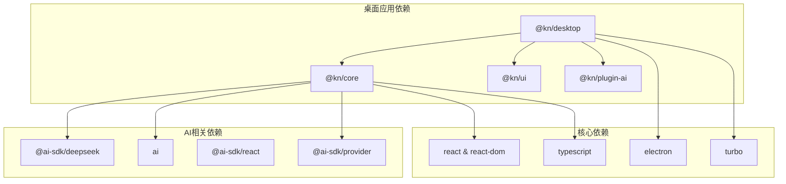

**图表来源**
- [apps/desktop/package.json:18-40](file://apps/desktop/package.json#L18-L40)
- [packages/core/package.json:17-34](file://packages/core/package.json#L17-L34)

**章节来源**
- [apps/desktop/package.json:18-40](file://apps/desktop/package.json#L18-L40)
- [packages/core/package.json:17-34](file://packages/core/package.json#L17-L34)

## 性能考虑

系统在多个层面进行了性能优化：

### 内存管理
- **垃圾回收优化**：设置最大堆内存限制避免内存溢出
- **资源清理**：应用程序退出时自动清理数据库连接和文件句柄
- **缓存策略**：智能缓存AI模型和插件资源

### 网络性能
- **代理配置**：开发环境下配置API代理减少跨域问题
- **连接池**：HTTP客户端使用连接池提高请求效率
- **流式处理**：AI响应采用流式传输减少等待时间
- **SSE优化**：多事件解析器减少事件处理开销
- **模型发现缓存**：模型列表的智能缓存机制

### 前端性能
- **代码分割**：使用Vite的动态导入实现按需加载
- **组件优化**：React.memo和useMemo减少不必要的重渲染
- **懒加载**：插件和大型组件采用懒加载策略
- **RAF缓冲**：requestAnimationFrame优化UI更新频率
- **能力目录缓存**：基于版本号的能力目录缓存

### SSE流式处理优化
- **多事件处理**：单次解析提取多个事件类型，减少解析次数
- **索引匹配**：基于索引的工具调用匹配比ID匹配更高效
- **流式缓冲**：RAF缓冲机制优化UI渲染性能
- **超时处理**：60秒超时机制防止流式传输挂起
- **推理内容优化**：推理增量的实时缓冲和展示

### 能力目录优化
- **哈希缓存**：基于FNV-1a算法的目录哈希，支持后端缓存
- **增量更新**：仅在目录变化时更新版本号
- **工具分类**：内置工具和插件工具的分类管理
- **技能嵌入**：工具定义嵌入到技能负载中，减少往返通信

## 故障排除指南

### 常见问题诊断

**应用程序启动失败**
1. 检查Node.js版本是否满足要求（>=18）
2. 验证pnpm安装和版本兼容性
3. 确认所有依赖包正确安装

**AI功能异常**
1. 检查AI API密钥配置
2. 验证网络连接和代理设置
3. 查看AI服务日志获取错误详情
4. 检查SSE解析器错误日志
5. 验证能力目录收集是否正常

**插件加载问题**
1. 检查插件缓存目录权限
2. 验证插件版本兼容性
3. 清理插件缓存后重新安装

**SSE流式处理问题**
1. 检查网络连接稳定性
2. 验证SSE事件格式是否符合规范
3. 查看工具调用匹配日志
4. 检查RAF缓冲机制是否正常工作
5. 验证推理内容传输是否正常

**模型发现失败**
1. 检查后端模型API是否可达
2. 验证模型列表格式是否正确
3. 查看模型发现错误日志
4. 确认网络代理配置

**能力目录问题**
1. 检查技能提供者是否正确注册
2. 验证工具提供者的元数据完整性
3. 查看目录哈希计算是否正常
4. 确认后端缓存机制是否工作

### 调试工具

**开发工具**
- Electron DevTools用于调试主进程和渲染进程
- React Developer Tools检查组件状态
- 浏览器开发者工具分析网络请求
- SSE调试工具监控事件流
- 能力目录调试工具检查目录内容

**日志监控**
- 应用程序日志记录关键操作和错误
- 服务层日志跟踪数据库操作
- 插件系统日志监控插件生命周期
- SSE解析器日志记录事件处理过程
- 工具调用匹配日志记录索引解析过程
- 能力目录日志记录目录收集和版本管理
- 模型发现日志记录模型列表获取过程

**章节来源**
- [apps/desktop/src/main/index.ts:42-48](file://apps/desktop/src/main/index.ts#L42-L48)
- [apps/desktop/src/main/services.ts:138-146](file://apps/desktop/src/main/services.ts#L138-L146)
- [packages/common/src/ai/chat-client/sse-parser.ts:89-93](file://packages/common/src/ai/chat-client/sse-parser.ts#L89-L93)
- [packages/common/src/ai/use-agent-optimized.tsx:378-387](file://packages/common/src/ai/use-agent-optimized.tsx#L378-L387)

## 结论

AI聊天客户端系统是一个功能完整、架构清晰的现代化桌面应用程序。通过采用Electron框架和React技术栈，系统实现了跨平台部署和优秀的用户体验。核心优势包括：

1. **模块化设计**：清晰的组件分离和依赖管理
2. **AI集成深度**：完整的AI聊天和内容生成功能
3. **扩展性强**：灵活的插件系统支持自定义功能
4. **性能优化**：多层面的性能优化确保流畅体验
5. **开发友好**：完善的开发工具链和文档支持
6. **SSE优化**：重构的SSE解析器支持多事件处理和索引匹配
7. **兼容性**：完全符合OpenAI流式规范的工具调用机制
8. **能力目录**：完整的技能和工具目录管理系统
9. **推理支持**：支持思维过程的实时展示和传输
10. **模型发现**：动态获取可用模型列表的功能

**新增功能总结**：
- **能力目录集成**：从渐进式发现转向完整目录发送，提升后端处理效率
- **推理内容流式传输**：支持reasoning-delta事件，实现思维过程的实时展示
- **模型发现功能**：动态获取可用模型列表，支持模型切换和配置
- **增强的SSE处理**：支持多事件流式处理和工具调用索引匹配
- **注解事件处理**：支持Data Stream v2协议的完整注解事件传输

该系统为知识管理场景提供了强大的AI辅助工具，通过智能聊天交互提升用户的工作效率和创造力。重构后的SSE解析器、工具调用匹配机制和新增的能力目录系统显著提升了系统的稳定性和性能，为未来的功能扩展奠定了坚实的基础。新增的推理内容传输和模型发现功能进一步增强了系统的智能化水平，为用户提供更加丰富和自然的AI交互体验。