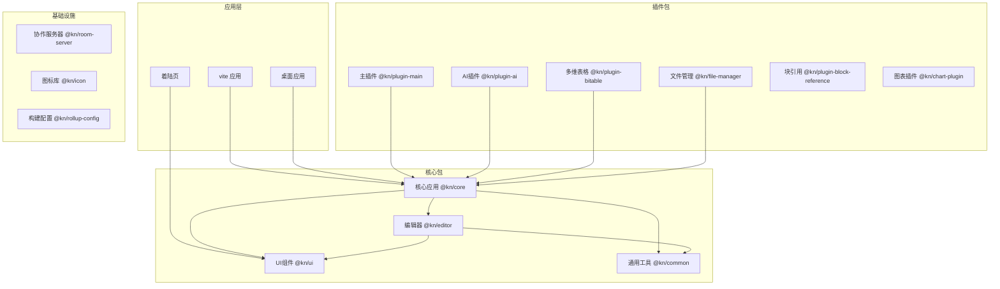
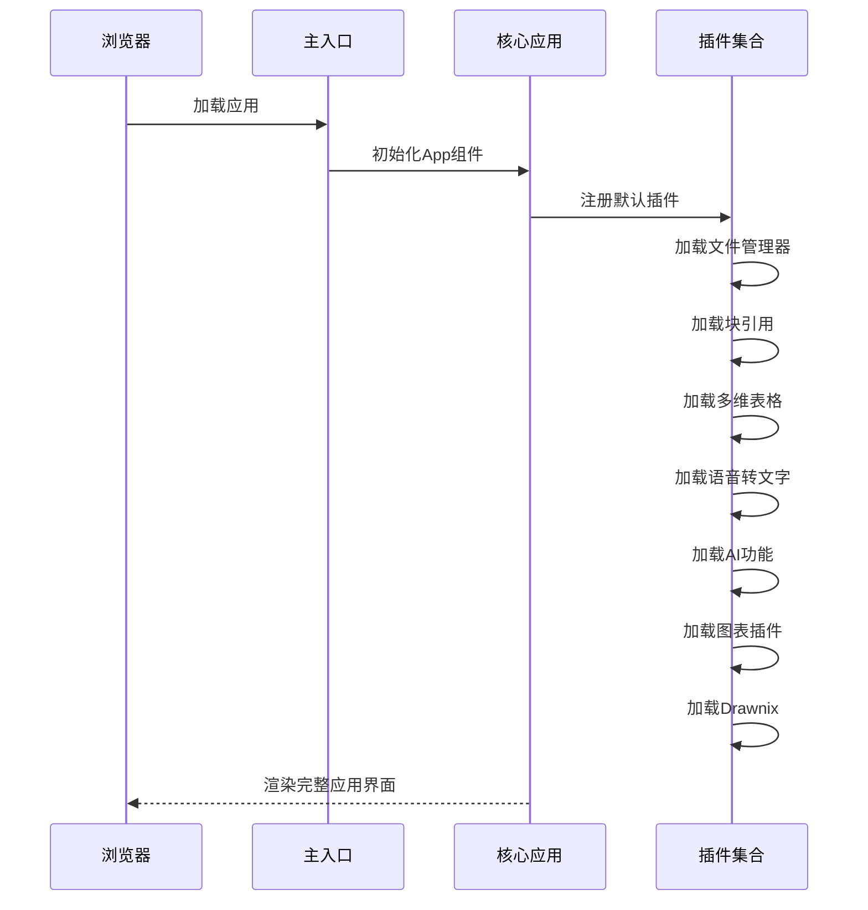
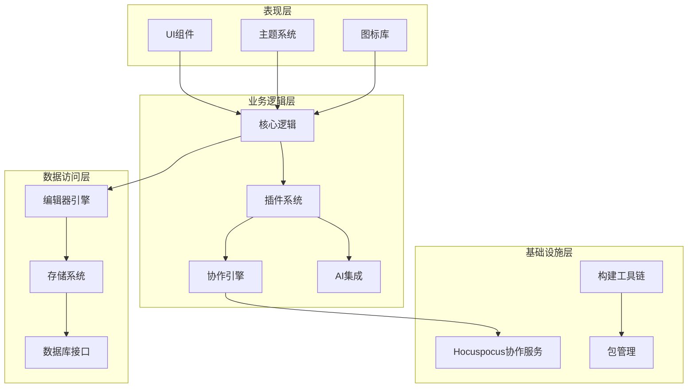
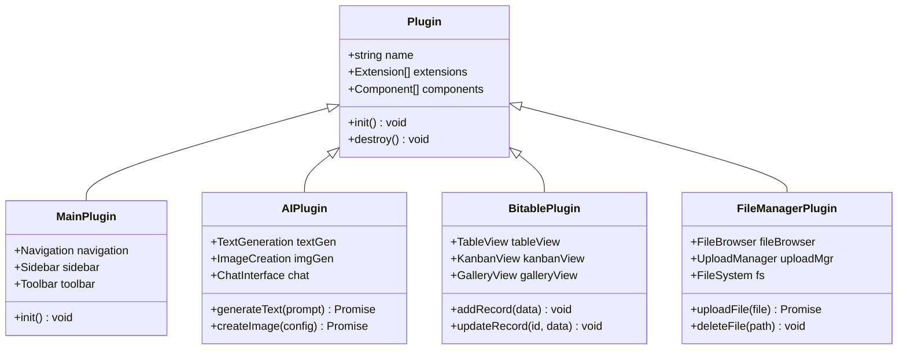
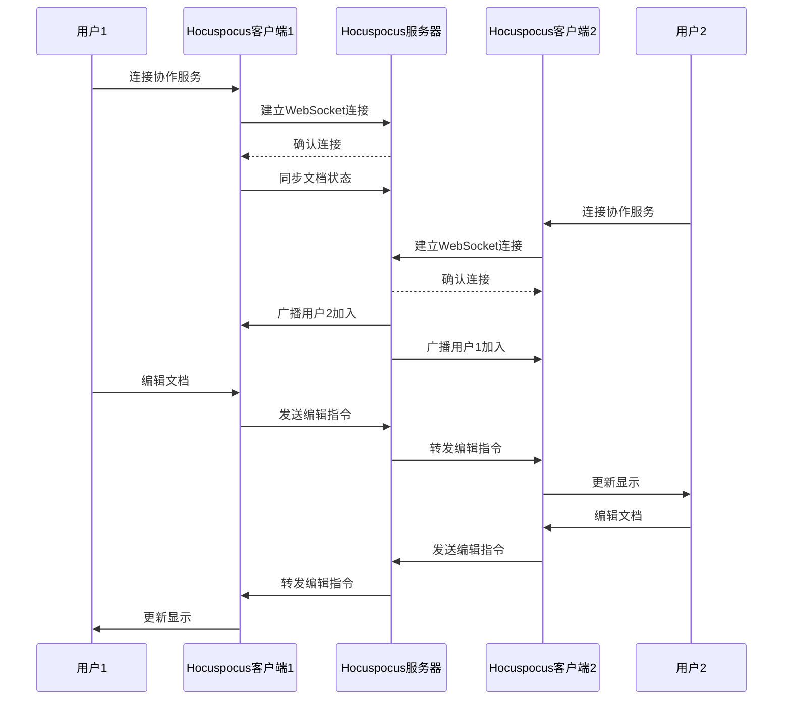
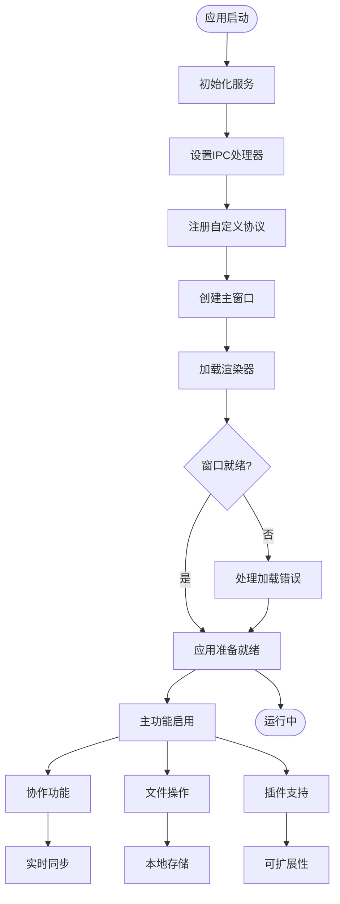

# 能力目录系统

<cite>
**本文档引用的文件**
- [README.md](file://README.md)
- [package.json](file://package.json)
- [turbo.json](file://turbo.json)
- [pnpm-workspace.yaml](file://pnpm-workspace.yaml)
- [packages/core/package.json](file://packages/core/package.json)
- [packages/editor/package.json](file://packages/editor/package.json)
- [packages/ui/package.json](file://packages/ui/package.json)
- [packages/common/package.json](file://packages/common/package.json)
- [apps/vite/src/main.tsx](file://apps/vite/src/main.tsx)
- [apps/vite/package.json](file://apps/vite/package.json)
- [apps/desktop/src/main/index.ts](file://apps/desktop/src/main/index.ts)
- [apps/landing-page/package.json](file://apps/landing-page/package.json)
- [packages/plugin-main/package.json](file://packages/plugin-main/package.json)
- [packages/plugin-ai/package.json](file://packages/plugin-ai/package.json)
- [packages/plugin-bitable/package.json](file://packages/plugin-bitable/package.json)
- [packages/plugin-file-manager/package.json](file://packages/plugin-file-manager/package.json)
</cite>

## 目录
1. [简介](#简介)
2. [项目结构](#项目结构)
3. [核心组件](#核心组件)
4. [架构概览](#架构概览)
5. [详细组件分析](#详细组件分析)
6. [依赖关系分析](#依赖关系分析)
7. [性能考虑](#性能考虑)
8. [故障排除指南](#故障排除指南)
9. [结论](#结论)

## 简介

能力目录系统是一个强大的协作知识管理平台，集成了丰富的富文本编辑、实时协作、AI增强功能和广泛的插件生态系统。该系统采用现代化的Web技术栈构建，支持多用户协同编辑、可扩展的插件架构以及多种可视化图表工具。

### 核心特性

- **富文本编辑器**：基于Tiptap的协作编辑支持
- **实时协作**：多用户编辑的Hocuspocus后端支持
- **插件架构**：可扩展的插件系统用于自定义功能
- **AI集成**：AI驱动的文本生成、图像创建和内容转换
- **多维表格**：类似飞书多维表格的功能（表格、看板、画廊视图）
- **可视化绘图**：支持Excalidraw、DrawIO、Mermaid和思维导图
- **文件管理**：内置的文档组织系统
- **块引用**：跨文档的块链接和嵌入
- **国际化**：完整的多语言支持

## 项目结构

该项目采用TurboRepo monorepo架构，将核心应用逻辑、编辑器、UI组件和各种插件模块化组织：



**图表来源**
- [pnpm-workspace.yaml:1-4](file://pnpm-workspace.yaml#L1-L4)
- [package.json:1-125](file://package.json#L1-L125)

**章节来源**
- [README.md:66-97](file://README.md#L66-L97)
- [pnpm-workspace.yaml:1-4](file://pnpm-workspace.yaml#L1-L4)

## 核心组件

### 应用入口点

主要的应用入口位于Vite应用中，通过组合多个插件实例来构建完整的知识管理系统：



**图表来源**
- [apps/vite/src/main.tsx:16-18](file://apps/vite/src/main.tsx#L16-L18)

### 核心应用架构

应用的核心架构围绕`@kn/core`包构建，该包作为所有功能的基础：

| 组件 | 版本 | 依赖关系 | 功能描述 |
|------|------|----------|----------|
| @kn/core | 0.0.16 | @kn/common, @kn/editor, @kn/ui, @kn/icon | 核心应用逻辑 |
| @kn/editor | 0.0.16 | @tiptap/*, @hocuspocus/*, react | 富文本编辑器集成 |
| @kn/ui | 0.0.16 | radix-ui, lucide-react, styled-components | UI组件库 |
| @kn/common | 0.0.16 | axios, redux, i18next | 通用工具和类型 |

**章节来源**
- [packages/core/package.json:1-43](file://packages/core/package.json#L1-L43)
- [packages/editor/package.json:1-106](file://packages/editor/package.json#L1-L106)
- [packages/ui/package.json:1-91](file://packages/ui/package.json#L1-L91)
- [packages/common/package.json:1-56](file://packages/common/package.json#L1-L56)

## 架构概览

系统采用分层架构设计，从底层基础设施到上层应用功能清晰分离：



**图表来源**
- [README.md:43-65](file://README.md#L43-L65)
- [package.json:55-81](file://package.json#L55-L81)

## 详细组件分析

### 插件系统架构

插件系统是整个能力目录的核心扩展机制，每个插件都是独立的包，具有明确的职责边界：



**图表来源**
- [packages/plugin-main/package.json:1-28](file://packages/plugin-main/package.json#L1-L28)
- [packages/plugin-ai/package.json:1-30](file://packages/plugin-ai/package.json#L1-L30)
- [packages/plugin-bitable/package.json:1-38](file://packages/plugin-bitable/package.json#L1-L38)
- [packages/plugin-file-manager/package.json:1-28](file://packages/plugin-file-manager/package.json#L1-L28)

### 实时协作机制

系统使用Hocuspocus提供实时协作功能，支持多用户同时编辑：



**图表来源**
- [packages/editor/package.json:21-27](file://packages/editor/package.json#L21-L27)

### 桌面应用集成

桌面应用通过Electron实现本地化部署，提供更丰富的原生功能：



**图表来源**
- [apps/desktop/src/main/index.ts:67-107](file://apps/desktop/src/main/index.ts#L67-L107)

**章节来源**
- [apps/desktop/src/main/index.ts:1-115](file://apps/desktop/src/main/index.ts#L1-L115)

## 依赖关系分析

系统采用monorepo管理模式，各包之间的依赖关系清晰明确：

```mermaid
graph LR
subgraph "应用层"
ViteApp[vite 应用]
DesktopApp[桌面应用]
LandingPage[着陆页]
end
subgraph "核心依赖"
Core[@kn/core]
Editor[@kn/editor]
UI[@kn/ui]
Common[@kn/common]
end
subgraph "插件依赖"
MainPlugin[@kn/plugin-main]
AIPlugin[@kn/plugin-ai]
Bitable[@kn/plugin-bitable]
FileManager[@kn/file-manager]
BlockRef[@kn/plugin-block-reference]
ChartPlugin[@kn/chart-plugin]
end
subgraph "外部依赖"
Tiptap["@tiptap/*"]
Hocuspocus["@hocuspocus/*"]
Radix["@radix-ui/*"]
Lucide["lucide-react"]
end
ViteApp --> Core
DesktopApp --> Core
LandingPage --> UI
Core --> Editor
Core --> UI
Core --> Common
MainPlugin --> Core
AIPlugin --> Core
Bitable --> Core
FileManager --> Core
BlockRef --> Core
ChartPlugin --> Core
Editor --> Tiptap
Editor --> Hocuspocus
UI --> Radix
UI --> Lucide
Common --> Tiptap
```

**图表来源**
- [package.json:14-53](file://package.json#L14-L53)
- [packages/editor/package.json:33-92](file://packages/editor/package.json#L33-L92)

### 构建和开发流程

系统使用TurboRepo进行统一的构建管理和缓存优化：

| 任务类型 | 命令 | 说明 |
|----------|------|------|
| 构建所有包 | `pnpm build` | 使用TurboRepo并行构建 |
| 开发模式 | `pnpm dev` | 启动所有应用的开发服务器 |
| 单独构建 | `pnpm build:core` | 构建核心包 |
| 插件构建 | `pnpm build:ai` | 构建AI插件 |
| 清理构建 | `pnpm clean:packages` | 清理所有dist目录 |

**章节来源**
- [package.json:9-53](file://package.json#L9-L53)
- [turbo.json:6-25](file://turbo.json#L6-L25)

## 性能考虑

### 构建优化

系统采用多种策略来优化构建性能：

1. **并行构建**：TurboRepo自动并行构建相关包
2. **增量构建**：仅重新构建变更的包及其依赖
3. **缓存机制**：智能缓存构建结果减少重复工作
4. **摇树优化**：Tree-shaking移除未使用的代码

### 运行时优化

1. **懒加载插件**：插件按需加载减少初始包大小
2. **虚拟滚动**：大数据集使用虚拟滚动提升性能
3. **内存管理**：合理管理编辑器状态和协作数据
4. **网络优化**：AI请求和文件上传的优化策略

## 故障排除指南

### 常见问题

1. **插件加载失败**
   - 检查插件包的版本兼容性
   - 确认插件依赖已正确安装
   - 验证插件的入口文件路径

2. **实时协作连接问题**
   - 检查Hocuspocus服务器状态
   - 验证网络连接和防火墙设置
   - 确认WebSocket支持

3. **构建错误**
   - 清理node_modules和dist目录
   - 检查TypeScript配置
   - 验证包管理器版本

### 调试技巧

1. **启用开发工具**
   - 使用浏览器开发者工具监控网络请求
   - 检查控制台错误信息
   - 监控内存使用情况

2. **日志记录**
   - 启用详细的日志输出
   - 记录插件初始化过程
   - 监控协作事件

**章节来源**
- [README.md:286-304](file://README.md#L286-L304)

## 结论

能力目录系统是一个设计精良的现代化知识管理平台，具有以下优势：

1. **模块化架构**：清晰的分层设计和插件系统
2. **技术先进**：采用最新的Web技术和最佳实践
3. **可扩展性**：灵活的插件架构支持功能扩展
4. **用户体验**：丰富的功能和直观的操作界面
5. **开发友好**：完善的开发工具链和文档

该系统为团队协作和知识管理提供了全面的解决方案，适合各种规模的企业和组织使用。