# AI技能增强

<cite>
**本文档引用的文件**
- [README.md](file://README.md)
- [package.json](file://package.json)
- [pnpm-workspace.yaml](file://pnpm-workspace.yaml)
- [turbo.json](file://turbo.json)
- [packages/plugin-ai/package.json](file://packages/plugin-ai/package.json)
- [packages/core/src/ai/foundation/types.ts](file://packages/core/src/ai/foundation/types.ts)
- [packages/core/src/ai/skills/types.ts](file://packages/core/src/ai/skills/types.ts)
- [packages/core/src/ai/skills/skillsmp/types.ts](file://packages/core/src/ai/skills/skillsmp/types.ts)
- [packages/core/src/ai/providers/SkillProvider.ts](file://packages/core/src/ai/providers/SkillProvider.ts)
- [packages/core/src/ai/use-agent-optimized.tsx](file://packages/core/src/ai/use-agent-optimized.tsx)
- [packages/core/src/ai/skills/skill-registry.ts](file://packages/core/src/ai/skills/skill-registry.ts)
- [packages/core/src/ai/discovery/skill-discovery-tools.ts](file://packages/core/src/ai/discovery/skill-discovery-tools.ts)
- [packages/common/src/core/PluginManager.ts](file://packages/common/src/core/PluginManager.ts)
- [packages/common/src/core/editor.ts](file://packages/common/src/core/editor.ts)
- [packages/plugin-ai/src/ai/menu/Chat.tsx](file://packages/plugin-ai/src/ai/menu/Chat.tsx)
- [packages/core/src/ai/model-provider/knowledge-provider.ts](file://packages/core/src/ai/model-provider/knowledge-provider.ts)
- [packages/core/src/ai/ai-utils.ts](file://packages/core/src/ai/ai-utils.ts)
- [packages/core/src/ai/constants.ts](file://packages/core/src/ai/constants.ts)
- [packages/core/src/ai/types.ts](file://packages/core/src/ai/types.ts)
- [packages/core/src/ai/foundation/hooks/use-streaming.ts](file://packages/core/src/ai/foundation/hooks/use-streaming.ts)
</cite>

## 更新摘要
**变更内容**
- 在use-agent-optimized.tsx中将DeepSeek集成替换为新的Knowledge Provider
- 新增基于引用的状态跟踪机制，改进流式状态和工具配置管理
- 保持向后兼容性，继续支持原有的AI提供商
- 增强资源管理和清理机制，确保适当的内存和连接管理

## 目录
1. [简介](#简介)
2. [项目结构](#项目结构)
3. [核心组件](#核心组件)
4. [架构概览](#架构概览)
5. [详细组件分析](#详细组件分析)
6. [插件管理系统](#插件管理系统)
7. [AI模型提供者优化](#ai模型提供者优化)
8. [流式状态管理改进](#流式状态管理改进)
9. [依赖关系分析](#依赖关系分析)
10. [性能考虑](#性能考虑)
11. [故障排除指南](#故障排除指南)
12. [结论](#结论)

## 简介

知识仓库（Knowledge Repo）是一个强大的协作式知识管理平台，集成了丰富的文本编辑、AI驱动功能和广泛的插件生态系统。该项目采用现代Web技术构建，具备实时协作能力和多维度表格、可视化绘图、文件管理等核心功能。

本项目特别专注于AI技能增强系统，通过模块化的AI基础架构为各种AI能力提供统一的接口和管理机制。该系统支持多种AI模型提供商（包括新的Knowledge Provider），具备工具注册表、技能管理系统、代理模式等功能。

**更新** 新增了基于引用的状态跟踪机制，改进了流式状态和工具配置管理，同时在use-agent-optimized.tsx中替换了DeepSeek集成为新的Knowledge Provider，保持向后兼容性。

## 项目结构

知识仓库采用TurboMonorepo架构，将应用程序和包组织在清晰的目录结构中：

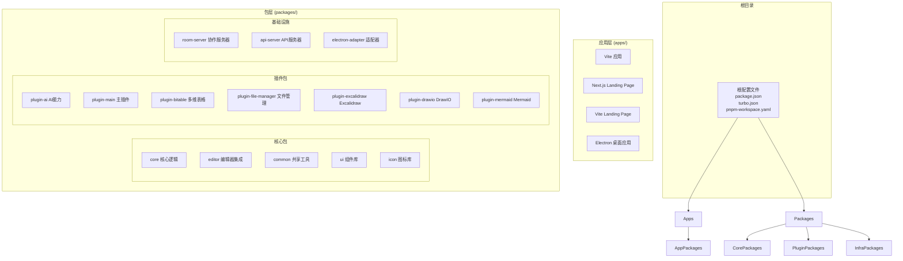

**图表来源**
- [README.md:66-97](file://README.md#L66-L97)
- [pnpm-workspace.yaml:1-4](file://pnpm-workspace.yaml#L1-L4)

**章节来源**
- [README.md:66-97](file://README.md#L66-L97)
- [pnpm-workspace.yaml:1-4](file://pnpm-workspace.yaml#L1-L4)

## 核心组件

### AI技能系统架构

AI技能增强系统是整个知识仓库的核心AI基础设施，提供了统一的AI能力管理和工具调度机制：

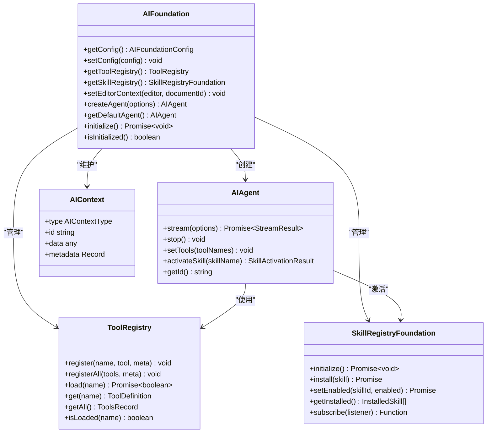

**图表来源**
- [packages/core/src/ai/foundation/types.ts:239-320](file://packages/core/src/ai/foundation/types.ts#L239-L320)

### 技能管理系统

技能系统是AI能力的高级抽象，将多个工具组合成复杂任务执行单元：

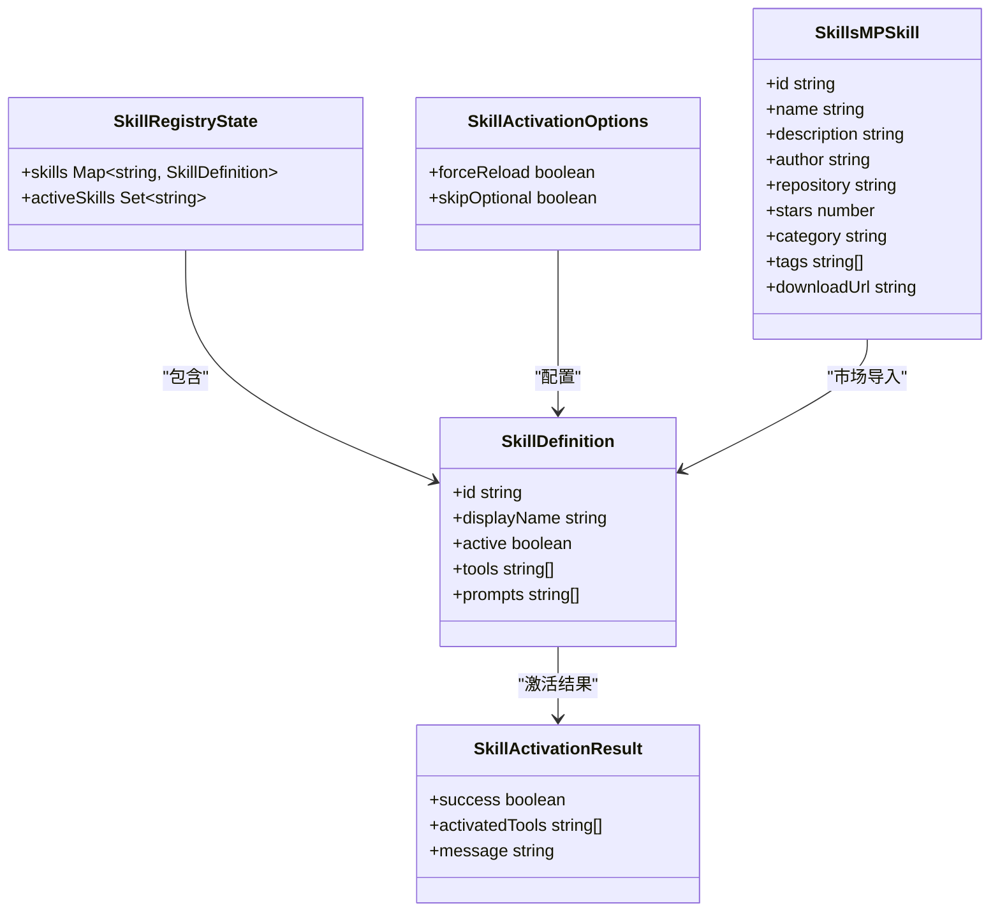

**图表来源**
- [packages/core/src/ai/skills/types.ts:10-37](file://packages/core/src/ai/skills/types.ts#L10-L37)
- [packages/core/src/ai/skills/skillsmp/types.ts:11-24](file://packages/core/src/ai/skills/skillsmp/types.ts#L11-L24)

**章节来源**
- [packages/core/src/ai/foundation/types.ts:1-320](file://packages/core/src/ai/foundation/types.ts#L1-L320)
- [packages/core/src/ai/skills/types.ts:1-37](file://packages/core/src/ai/skills/types.ts#L1-L37)
- [packages/core/src/ai/skills/skillsmp/types.ts:1-78](file://packages/core/src/ai/skills/skillsmp/types.ts#L1-L78)

## 架构概览

### 整体AI架构设计

知识仓库的AI架构采用了分层设计，从底层的工具注册表到上层的技能管理系统，形成了完整的AI能力管理体系：

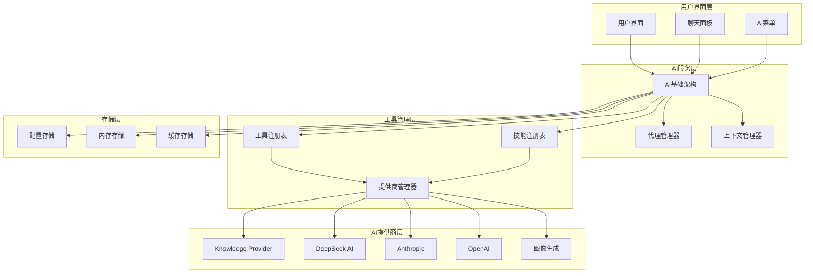

**图表来源**
- [packages/core/src/ai/foundation/types.ts:13-35](file://packages/core/src/ai/foundation/types.ts#L13-L35)
- [packages/core/src/ai/foundation/types.ts:239-320](file://packages/core/src/ai/foundation/types.ts#L239-L320)

### 插件集成架构

AI插件作为独立模块集成到核心系统中，提供了灵活的扩展机制：

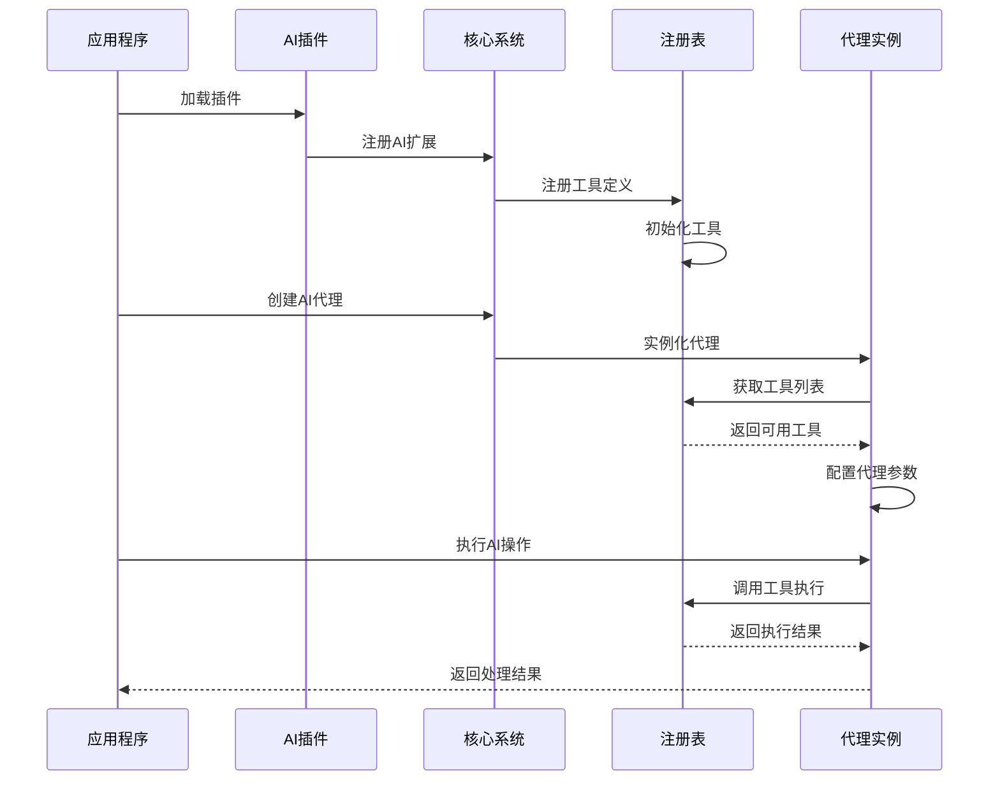

**图表来源**
- [packages/plugin-ai/package.json:15-23](file://packages/plugin-ai/package.json#L15-L23)

**章节来源**
- [packages/plugin-ai/package.json:1-31](file://packages/plugin-ai/package.json#L1-L31)

## 详细组件分析

### AI基础架构组件

#### 工具注册表系统

工具注册表是AI系统的核心基础设施，负责管理所有可用的AI工具：

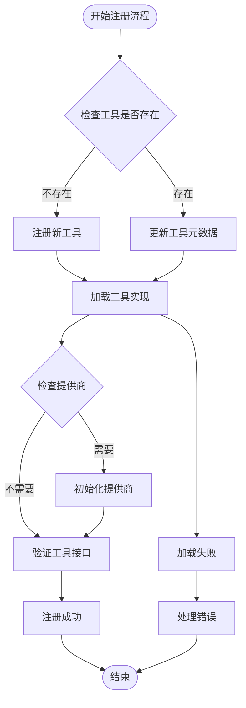

**图表来源**
- [packages/core/src/ai/foundation/types.ts:71-119](file://packages/core/src/ai/foundation/types.ts#L71-L119)

#### 技能激活流程

技能激活是将多个工具组合成复杂任务执行的关键过程：

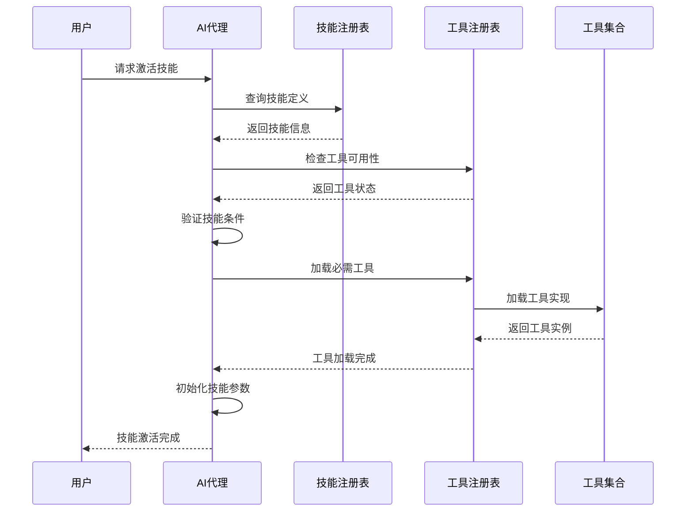

**图表来源**
- [packages/core/src/ai/skills/types.ts:24-36](file://packages/core/src/ai/skills/types.ts#L24-L36)

**章节来源**
- [packages/core/src/ai/foundation/types.ts:64-147](file://packages/core/src/ai/foundation/types.ts#L64-L147)
- [packages/core/src/ai/skills/types.ts:19-36](file://packages/core/src/ai/skills/types.ts#L19-L36)

### 插件AI组件

#### AI聊天面板

AI聊天面板提供了用户与AI代理交互的界面：

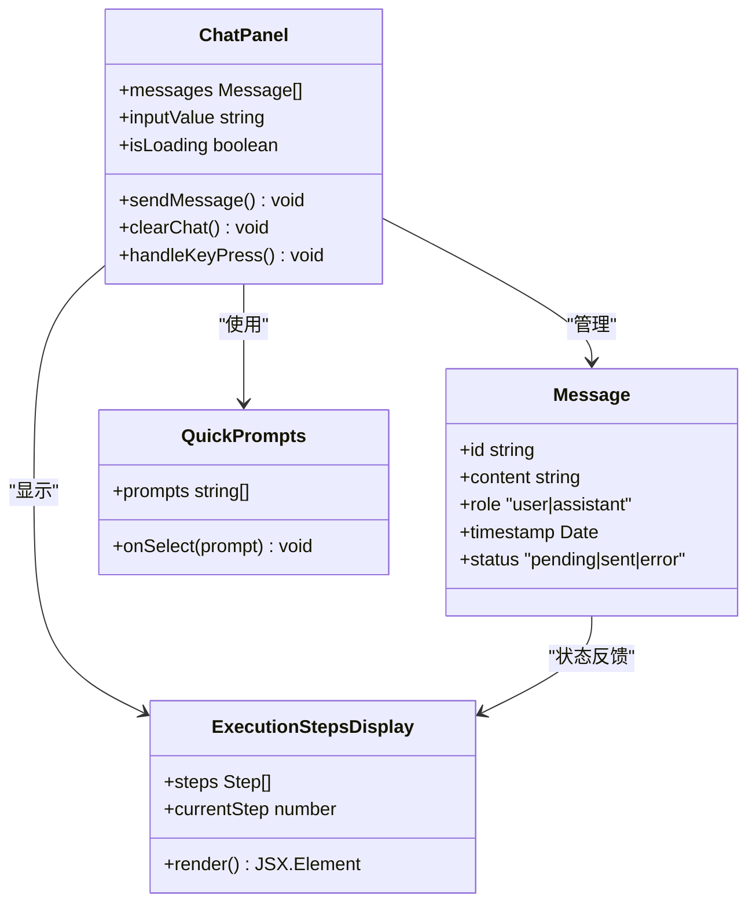

**图表来源**
- [packages/plugin-ai/src/ai/menu/Chat.tsx](file://packages/plugin-ai/src/ai/menu/Chat.tsx)
- [packages/plugin-ai/src/ai/menu/QuickPrompts.tsx](file://packages/plugin-ai/src/ai/menu/QuickPrompts.tsx)

#### AI图像生成

AI图像生成功能提供了基于文本描述生成图像的能力：

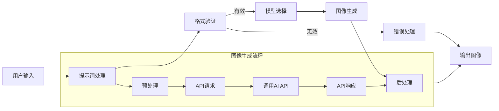

**图表来源**
- [packages/plugin-ai/src/ai/AiImageView.tsx](file://packages/plugin-ai/src/ai/AiImageView.tsx)
- [packages/plugin-ai/src/ai/ai-image.ts](file://packages/plugin-ai/src/ai/ai-image.ts)

**章节来源**
- [packages/plugin-ai/package.json:15-23](file://packages/plugin-ai/package.json#L15-L23)

## 插件管理系统

### 插件管理器架构

新增的PluginManager类提供了完整的插件管理能力，支持插件技能和工具的动态解析：

```mermaid
classDiagram
class PluginManager {
+plugins KPlugin[]
+_cacheExtensions ExtensionWrapper[]
+_cacheTools ToolsRecord
+_cacheRoutes RouteConfig[]
+_cacheMenus SiderMenuItemProps[]
+_cacheLocales any
+init() Promise~void~
+loadPlugin(plugin) Promise~void~
+resloveTools(editor) ToolsRecord
+resloveEditorExtension() ExtensionWrapper[]
+resolveSkills() Skill[]
+resolveMenus() SiderMenuItemProps[]
+resolveRoutes() RouteConfig[]
+resolveLocales() any
+loadExternalPluginExtensions(plugins) Promise~ExtensionWrapper[]
}
class ExtensionWrapper {
+extendsion AnyExtension | AnyExtension[] | any
+name string
+bubbleMenu ElementType | ElementType[]
+menuConfig {
+group Group
+menu ElementType
+}
+slashConfig SlashAction[]
+flotMenuConfig ElementType[]
+floatingUI ElementType
+tools ToolDefinition[]
+skills SkillDefinition[]
}
class ToolDefinition {
+name string
+description string
+inputSchema any
+execute (editor) => (params) => any
}
class SkillDefinition {
+name string
+description string
+requiredTools string[]
+optionalTools string[]
+systemPromptFragment string
+tags string[]
}
PluginManager --> ExtensionWrapper : "管理"
PluginManager --> ToolDefinition : "解析"
PluginManager --> SkillDefinition : "解析"
ExtensionWrapper --> ToolDefinition : "包含"
ExtensionWrapper --> SkillDefinition : "包含"
```

**图表来源**
- [packages/common/src/core/PluginManager.ts:337-483](file://packages/common/src/core/PluginManager.ts#L337-L483)
- [packages/common/src/core/editor.ts:6-40](file://packages/common/src/core/editor.ts#L6-L40)

### 插件技能激活流程

增强的SkillProvider现在支持插件技能的动态加载和管理：

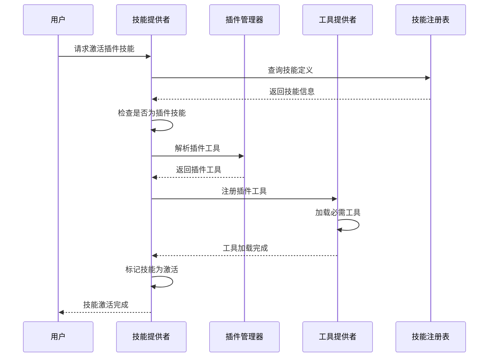

**图表来源**
- [packages/core/src/ai/providers/SkillProvider.ts:58-101](file://packages/core/src/ai/providers/SkillProvider.ts#L58-L101)
- [packages/core/src/ai/use-agent-optimized.tsx:119-126](file://packages/core/src/ai/use-agent-optimized.tsx#L119-L126)

**章节来源**
- [packages/common/src/core/PluginManager.ts:337-483](file://packages/common/src/core/PluginManager.ts#L337-L483)
- [packages/core/src/ai/providers/SkillProvider.ts:58-101](file://packages/core/src/ai/providers/SkillProvider.ts#L58-L101)
- [packages/core/src/ai/use-agent-optimized.tsx:119-126](file://packages/core/src/ai/use-agent-optimized.tsx#L119-L126)

## AI模型提供者优化

### Knowledge Provider集成

**更新** 新增了Knowledge Provider作为主要的AI模型提供者，替代了原有的DeepSeek集成：

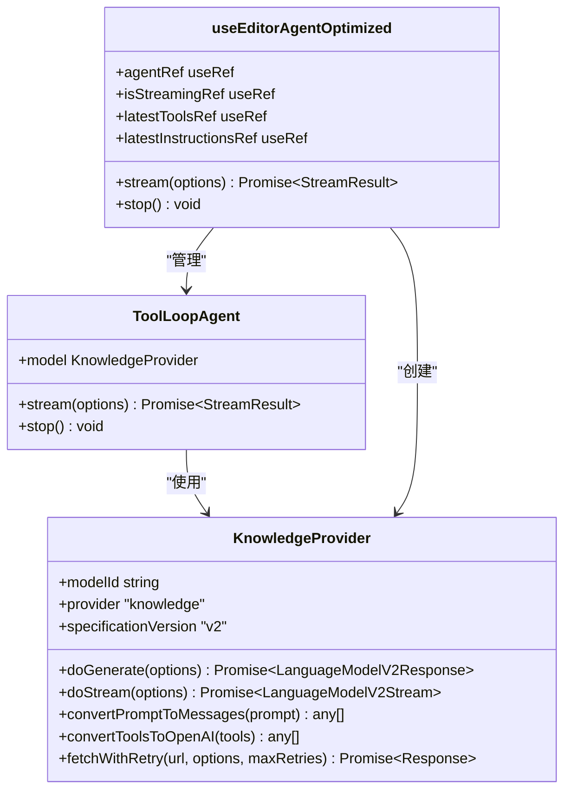

**图表来源**
- [packages/core/src/ai/model-provider/knowledge-provider.ts:168-354](file://packages/core/src/ai/model-provider/knowledge-provider.ts#L168-L354)
- [packages/core/src/ai/use-agent-optimized.tsx:33-33](file://packages/core/src/ai/use-agent-optimized.tsx#L33-L33)

### DeepSeek兼容性层

系统保持了对DeepSeek的向后兼容性，通过兼容性层支持原有API：

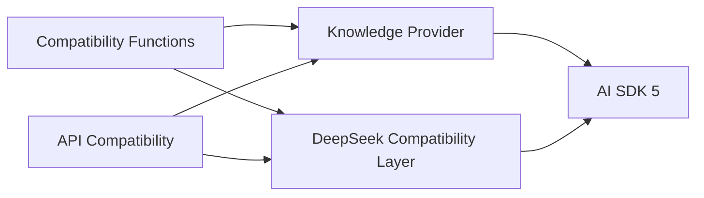

**图表来源**
- [packages/core/src/ai/ai-utils.ts:1-63](file://packages/core/src/ai/ai-utils.ts#L1-L63)
- [packages/core/src/ai/constants.ts:16-20](file://packages/core/src/ai/constants.ts#L16-L20)

**章节来源**
- [packages/core/src/ai/model-provider/knowledge-provider.ts:1-359](file://packages/core/src/ai/model-provider/knowledge-provider.ts#L1-L359)
- [packages/core/src/ai/ai-utils.ts:1-63](file://packages/core/src/ai/ai-utils.ts#L1-L63)
- [packages/core/src/ai/constants.ts:16-20](file://packages/core/src/ai/constants.ts#L16-L20)

## 流式状态管理改进

### 基于引用的状态跟踪

**更新** 新增了基于引用的方法来跟踪流式状态和工具配置，确保适当的清理和资源管理：

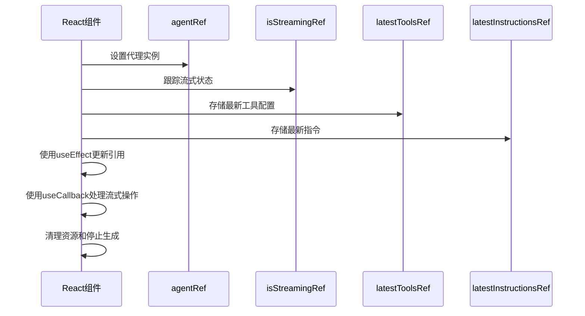

**图表来源**
- [packages/core/src/ai/use-agent-optimized.tsx:45-59](file://packages/core/src/ai/use-agent-optimized.tsx#L45-L59)

### 资源管理优化

改进的资源管理确保适当的清理和内存管理：

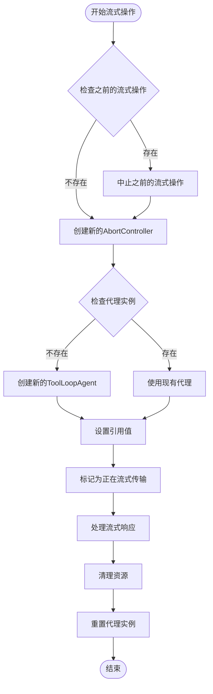

**图表来源**
- [packages/core/src/ai/use-agent-optimized.tsx:190-240](file://packages/core/src/ai/use-agent-optimized.tsx#L190-L240)

**章节来源**
- [packages/core/src/ai/use-agent-optimized.tsx:45-240](file://packages/core/src/ai/use-agent-optimized.tsx#L45-L240)

## 依赖关系分析

### 包依赖关系

知识仓库采用monorepo架构，各包之间存在明确的依赖关系：

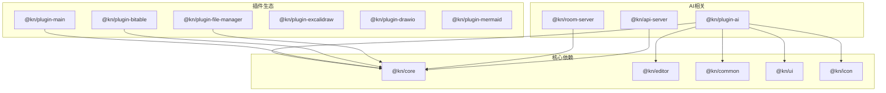

**图表来源**
- [packages/plugin-ai/package.json:15-23](file://packages/plugin-ai/package.json#L15-L23)
- [package.json:15-26](file://package.json#L15-L26)

### 开发工具链

项目使用现代化的开发工具链确保代码质量和开发效率：

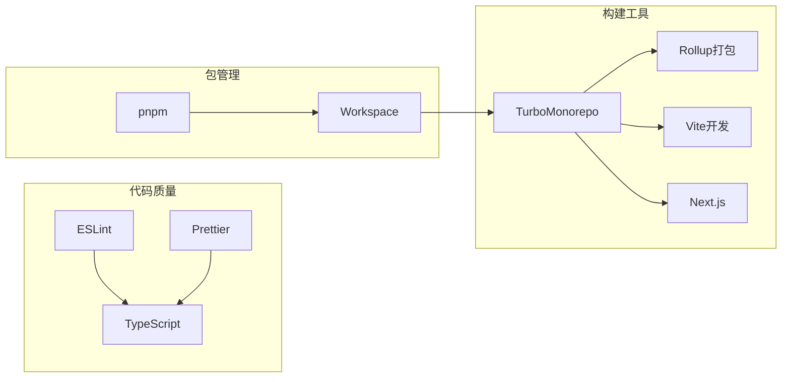

**图表来源**
- [turbo.json:1-27](file://turbo.json#L1-L27)
- [package.json:82-111](file://package.json#L82-L111)

**章节来源**
- [package.json:1-124](file://package.json#L1-L124)
- [turbo.json:1-27](file://turbo.json#L1-L27)
- [pnpm-workspace.yaml:1-4](file://pnpm-workspace.yaml#L1-L4)

## 性能考虑

### AI响应优化策略

为了确保AI功能的高性能表现，系统采用了多种优化策略：

1. **流式响应处理**：使用Vercel AI SDK实现流式AI响应，提升用户体验
2. **工具缓存机制**：智能缓存已加载的工具，避免重复初始化
3. **并发控制**：限制同时进行的AI操作数量，防止资源耗尽
4. **内存管理**：定期清理未使用的AI代理和工具实例
5. **基于引用的状态跟踪**：使用ref对象跟踪状态，避免不必要的重渲染

### 插件系统性能优化

新增的插件系统采用了以下性能优化策略：

1. **延迟加载**：插件技能和工具仅在激活时加载，减少初始启动时间
2. **缓存机制**：插件解析结果缓存，避免重复解析
3. **增量更新**：插件变更时仅重新解析受影响的部分
4. **异步加载**：外部插件通过异步方式加载，不影响主应用性能

### 性能监控指标

系统监控以下关键性能指标：
- AI响应时间（从请求到完整响应）
- 工具加载延迟
- 插件加载时间
- 内存使用情况
- 并发请求数量
- 错误率统计
- 流式操作的资源使用情况

## 故障排除指南

### 常见问题诊断

#### AI连接问题

当遇到AI连接问题时，可以按以下步骤排查：

1. **检查环境变量配置**
   - 验证AI API密钥是否正确设置
   - 确认API基础URL配置正确
   - 检查网络连接状态

2. **查看日志信息**
   - 启用调试模式获取详细日志
   - 检查AI事件订阅器的错误信息
   - 监控工具加载状态

3. **测试基本功能**
   - 验证AI代理创建是否成功
   - 测试简单文本生成请求
   - 检查工具注册表状态

#### 技能激活失败

当技能激活失败时：

1. **检查技能依赖**
   - 确认所需工具都已正确加载
   - 验证工具接口兼容性
   - 检查工具版本匹配

2. **查看激活日志**
   - 分析技能激活过程中的错误信息
   - 检查工具加载顺序
   - 验证技能配置参数

#### 插件加载问题

当插件加载出现问题时：

1. **检查插件配置**
   - 验证插件路径和资源URL
   - 确认插件元数据格式正确
   - 检查插件依赖关系

2. **查看插件日志**
   - 分析插件解析过程中的错误
   - 检查工具和技能注册状态
   - 验证插件扩展结构

#### 流式状态管理问题

当遇到流式状态管理问题时：

1. **检查引用状态**
   - 验证isStreamingRef的状态
   - 检查agentRef的实例状态
   - 确认AbortController的正确使用

2. **查看清理机制**
   - 分析流式操作结束后的清理过程
   - 检查代理实例的重置逻辑
   - 验证资源释放是否正常

**章节来源**
- [packages/core/src/ai/foundation/types.ts:214-236](file://packages/core/src/ai/foundation/types.ts#L214-L236)
- [packages/core/src/ai/providers/SkillProvider.ts:58-101](file://packages/core/src/ai/providers/SkillProvider.ts#L58-L101)
- [packages/core/src/ai/use-agent-optimized.tsx:190-240](file://packages/core/src/ai/use-agent-optimized.tsx#L190-L240)

## 结论

知识仓库的AI技能增强系统通过模块化的架构设计，为复杂的AI能力提供了统一的管理接口。该系统的主要优势包括：

1. **高度模块化**：通过工具注册表和技能管理系统实现松耦合设计
2. **可扩展性强**：支持多种AI提供商和自定义工具扩展
3. **插件生态系统**：新增的PluginManager提供了完整的插件管理能力
4. **动态加载机制**：支持插件技能和工具的按需加载
5. **性能优化**：采用流式处理、缓存机制等优化策略
6. **资源管理改进**：基于引用的状态跟踪确保适当的清理和资源管理
7. **向后兼容性**：保持对原有AI提供商的支持
8. **易于集成**：标准化的插件接口便于第三方开发者集成

**更新** 新增的Knowledge Provider作为主要AI模型提供者，替代了原有的DeepSeek集成，同时保持了向后兼容性。基于引用的状态跟踪机制改进了流式状态和工具配置管理，确保适当的清理和资源管理。这些优化显著提升了系统的稳定性和性能。

未来的发展方向包括：
- 增强离线模式支持
- 优化移动端性能
- 扩展更多AI提供商
- 完善技能市场功能
- 增强插件安全机制
- 优化插件加载性能
- 进一步改进流式状态管理

该系统为知识管理平台提供了强大的AI能力，能够显著提升用户的知识创作和协作效率。