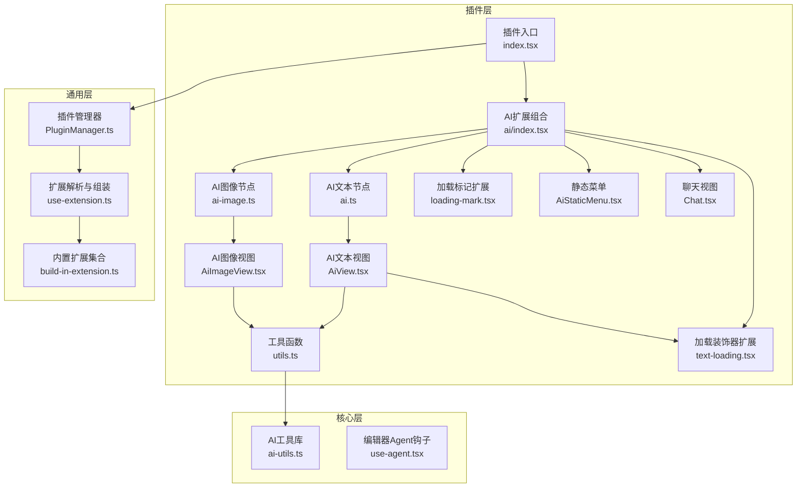
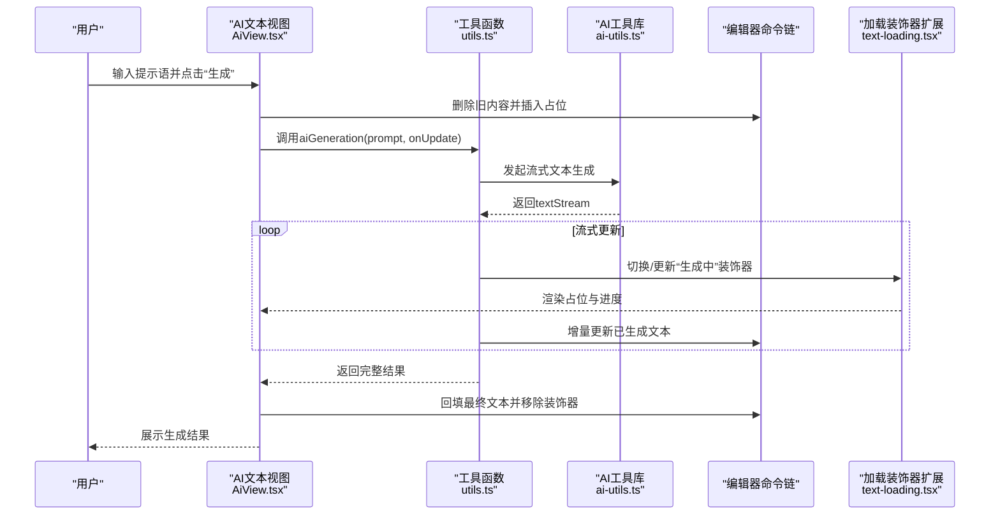
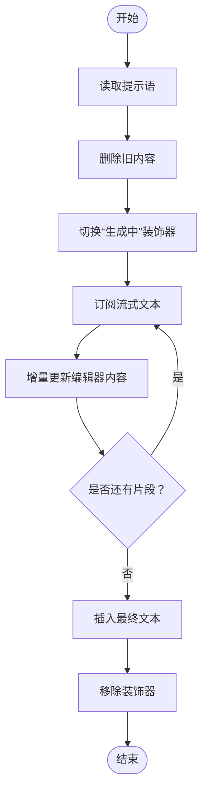
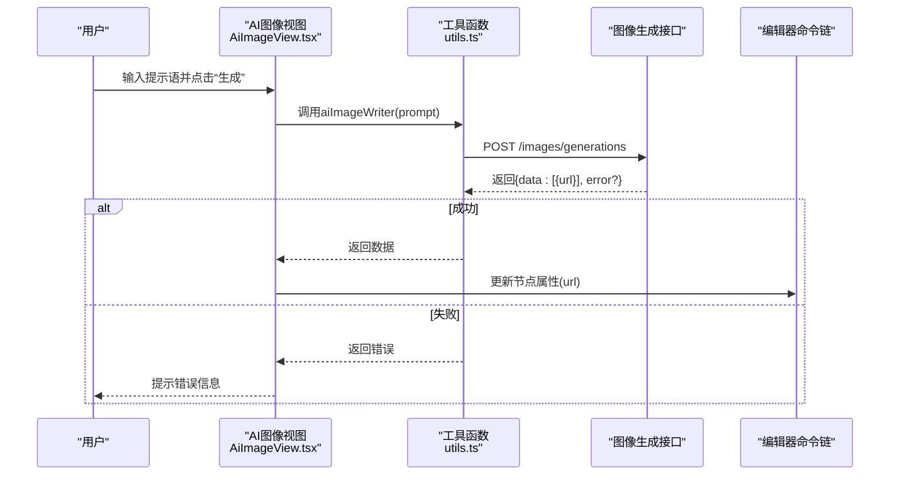
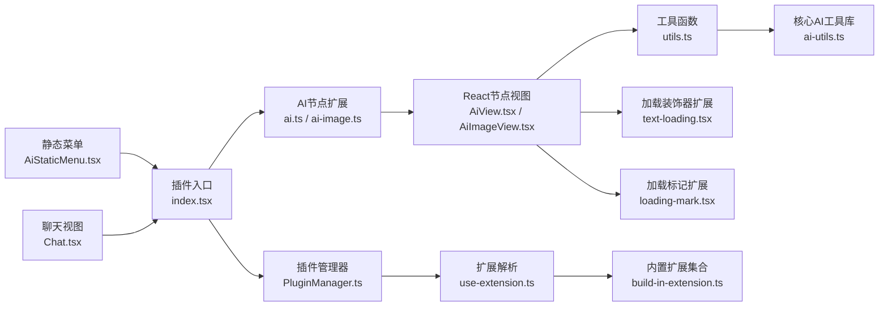

# AI插件

<cite>
**本文引用的文件**
- [packages/plugin-ai/src/index.tsx](file://packages/plugin-ai/src/index.tsx)
- [packages/plugin-ai/src/ai/index.tsx](file://packages/plugin-ai/src/ai/index.tsx)
- [packages/plugin-ai/src/ai/ai.ts](file://packages/plugin-ai/src/ai/ai.ts)
- [packages/plugin-ai/src/ai/ai-image.ts](file://packages/plugin-ai/src/ai/ai-image.ts)
- [packages/plugin-ai/src/ai/AiView.tsx](file://packages/plugin-ai/src/ai/AiView.tsx)
- [packages/plugin-ai/src/ai/AiImageView.tsx](file://packages/plugin-ai/src/ai/AiImageView.tsx)
- [packages/plugin-ai/src/ai/utils.ts](file://packages/plugin-ai/src/ai/utils.ts)
- [packages/plugin-ai/src/ai/text-loading.tsx](file://packages/plugin-ai/src/ai/text-loading.tsx)
- [packages/plugin-ai/src/ai/marks/loading-mark.tsx](file://packages/plugin-ai/src/ai/marks/loading-mark.tsx)
- [packages/plugin-ai/src/ai/menu/AiStaticMenu.tsx](file://packages/plugin-ai/src/ai/menu/AiStaticMenu.tsx)
- [packages/plugin-ai/src/ai/menu/Chat.tsx](file://packages/plugin-ai/src/ai/menu/Chat.tsx)
- [packages/core/src/ai/ai-utils.ts](file://packages/core/src/ai/ai-utils.ts)
- [packages/core/src/ai/use-agent.tsx](file://packages/core/src/ai/use-agent.tsx)
- [packages/common/src/core/PluginManager.ts](file://packages/common/src/core/PluginManager.ts)
- [packages/editor/src/editor/build-in-extension.ts](file://packages/editor/src/editor/build-in-extension.ts)
- [packages/editor/src/editor/use-extension.ts](file://packages/editor/src/editor/use-extension.ts)
</cite>

## 目录
1. [简介](#简介)
2. [项目结构](#项目结构)
3. [核心组件](#核心组件)
4. [架构总览](#架构总览)
5. [组件详解](#组件详解)
6. [依赖关系分析](#依赖关系分析)
7. [性能与可用性建议](#性能与可用性建议)
8. [故障排查指南](#故障排查指南)
9. [结论](#结论)
10. [附录：使用示例与最佳实践](#附录使用示例与最佳实践)

## 简介
本文件面向希望在编辑器中集成AI能力（文本生成、图像生成与智能编辑）的开发者与产品团队。文档围绕“AI插件”展开，系统阐述以下内容：
- 文本生成与流式渲染：支持在选区或节点内进行AI驱动的文本生成，并以加载装饰器实时展示生成进度。
- 图像生成与节点化管理：通过提示词生成图片，以可编辑节点承载图片URL，支持预览、更新与删除。
- AI视图与静态菜单：提供AI文本块与AI图像块的可视化界面，包含提示语输入、生成按钮与删除操作。
- 智能编辑工具与聊天视图：提供静态菜单与浮动聊天窗口，支持一键改写、语气调整、翻译等常用智能编辑操作。
- 插件集成与参数配置：通过插件配置注入编辑器扩展、浮动菜单、静态菜单与斜杠命令，统一多语言文案与本地化资源。
- 结果处理与错误处理：对流式文本与图像生成进行状态切换、结果回填与错误提示。
- 性能优化与最佳实践：针对长文本流式渲染、并发生成与网络请求进行优化建议。

## 项目结构
AI插件位于 packages/plugin-ai，核心由以下模块组成：
- 插件入口与注册：定义插件类实例，注入编辑器扩展、浮动菜单、静态菜单与斜杠命令。
- 编辑器节点扩展：定义AI文本块与AI图像块两种节点类型，绑定React节点视图。
- 视图组件：分别为AI文本块与AI图像块提供交互界面。
- 工具函数：封装文本生成、图像生成与加载装饰器命令。
- 加载装饰器扩展：为编辑器提供“生成中”装饰器，用于流式渲染占位。
- 标记扩展：提供“加载中”标记，便于在特定范围内标注加载状态。
- 菜单与聊天：提供静态菜单（一键改写、语气、翻译等）与浮动聊天视图。

图表来源
- [packages/plugin-ai/src/index.tsx](file://packages/plugin-ai/src/index.tsx#L1-L35)
- [packages/plugin-ai/src/ai/index.tsx](file://packages/plugin-ai/src/ai/index.tsx#L1-L42)
- [packages/plugin-ai/src/ai/ai.ts](file://packages/plugin-ai/src/ai/ai.ts#L1-L55)
- [packages/plugin-ai/src/ai/ai-image.ts](file://packages/plugin-ai/src/ai/ai-image.ts#L1-L37)
- [packages/plugin-ai/src/ai/AiView.tsx](file://packages/plugin-ai/src/ai/AiView.tsx#L1-L76)
- [packages/plugin-ai/src/ai/AiImageView.tsx](file://packages/plugin-ai/src/ai/AiImageView.tsx#L1-L69)
- [packages/plugin-ai/src/ai/utils.ts](file://packages/plugin-ai/src/ai/utils.ts#L1-L58)
- [packages/plugin-ai/src/ai/text-loading.tsx](file://packages/plugin-ai/src/ai/text-loading.tsx#L1-L146)
- [packages/plugin-ai/src/ai/marks/loading-mark.tsx](file://packages/plugin-ai/src/ai/marks/loading-mark.tsx#L1-L36)
- [packages/plugin-ai/src/ai/menu/AiStaticMenu.tsx](file://packages/plugin-ai/src/ai/menu/AiStaticMenu.tsx#L1-L48)
- [packages/plugin-ai/src/ai/menu/Chat.tsx](file://packages/plugin-ai/src/ai/menu/Chat.tsx#L1-L198)
- [packages/core/src/ai/ai-utils.ts](file://packages/core/src/ai/ai-utils.ts#L1-L20)
- [packages/core/src/ai/use-agent.tsx](file://packages/core/src/ai/use-agent.tsx#L1-L200)
- [packages/common/src/core/PluginManager.ts](file://packages/common/src/core/PluginManager.ts#L1-L177)
- [packages/editor/src/editor/build-in-extension.ts](file://packages/editor/src/editor/build-in-extension.ts#L1-L56)
- [packages/editor/src/editor/use-extension.ts](file://packages/editor/src/editor/use-extension.ts#L47-L63)

章节来源
- [packages/plugin-ai/src/index.tsx](file://packages/plugin-ai/src/index.tsx#L1-L35)
- [packages/plugin-ai/src/ai/index.tsx](file://packages/plugin-ai/src/ai/index.tsx#L1-L42)
- [packages/plugin-ai/src/ai/ai.ts](file://packages/plugin-ai/src/ai/ai.ts#L1-L55)
- [packages/plugin-ai/src/ai/ai-image.ts](file://packages/plugin-ai/src/ai/ai-image.ts#L1-L37)
- [packages/plugin-ai/src/ai/AiView.tsx](file://packages/plugin-ai/src/ai/AiView.tsx#L1-L76)
- [packages/plugin-ai/src/ai/AiImageView.tsx](file://packages/plugin-ai/src/ai/AiImageView.tsx#L1-L69)
- [packages/plugin-ai/src/ai/utils.ts](file://packages/plugin-ai/src/ai/utils.ts#L1-L58)
- [packages/plugin-ai/src/ai/text-loading.tsx](file://packages/plugin-ai/src/ai/text-loading.tsx#L1-L146)
- [packages/plugin-ai/src/ai/marks/loading-mark.tsx](file://packages/plugin-ai/src/ai/marks/loading-mark.tsx#L1-L36)
- [packages/plugin-ai/src/ai/menu/AiStaticMenu.tsx](file://packages/plugin-ai/src/ai/menu/AiStaticMenu.tsx#L1-L48)
- [packages/plugin-ai/src/ai/menu/Chat.tsx](file://packages/plugin-ai/src/ai/menu/Chat.tsx#L1-L198)
- [packages/core/src/ai/ai-utils.ts](file://packages/core/src/ai/ai-utils.ts#L1-L20)
- [packages/core/src/ai/use-agent.tsx](file://packages/core/src/ai/use-agent.tsx#L1-L200)
- [packages/common/src/core/PluginManager.ts](file://packages/common/src/core/PluginManager.ts#L1-L177)
- [packages/editor/src/editor/build-in-extension.ts](file://packages/editor/src/editor/build-in-extension.ts#L1-L56)
- [packages/editor/src/editor/use-extension.ts](file://packages/editor/src/editor/use-extension.ts#L47-L63)

## 核心组件
- 插件入口与注册
  - 定义插件实例，声明编辑器扩展数组、浮动菜单、静态菜单与斜杠命令，供插件管理器在运行时合并与注入。
  - 关键路径参考：[packages/plugin-ai/src/index.tsx](file://packages/plugin-ai/src/index.tsx#L1-L35), [packages/plugin-ai/src/ai/index.tsx](file://packages/plugin-ai/src/ai/index.tsx#L1-L42)

- AI文本节点与命令
  - 定义节点属性（提示语、生成时间）、HTML渲染、节点视图绑定与插入命令。
  - 关键路径参考：[packages/plugin-ai/src/ai/ai.ts](file://packages/plugin-ai/src/ai/ai.ts#L1-L55)

- AI图像节点与命令
  - 定义节点属性（提示语、图片URL）、节点视图绑定与插入命令。
  - 关键路径参考：[packages/plugin-ai/src/ai/ai-image.ts](file://packages/plugin-ai/src/ai/ai-image.ts#L1-L37)

- 文本生成视图
  - 负责渲染节点内容、显示生成信息、接收提示语、触发生成与删除。
  - 关键路径参考：[packages/plugin-ai/src/ai/AiView.tsx](file://packages/plugin-ai/src/ai/AiView.tsx#L1-L76)

- 图像生成视图
  - 负责渲染图片预览、接收提示语、触发生成与删除；对错误进行提示。
  - 关键路径参考：[packages/plugin-ai/src/ai/AiImageView.tsx](file://packages/plugin-ai/src/ai/AiImageView.tsx#L1-L69)

- 工具函数
  - 文本生成：基于核心AI工具库发起流式文本生成，支持在指定位置插入与更新。
  - 图像生成：调用外部图像生成接口，返回结果后更新节点属性。
  - 关键路径参考：[packages/plugin-ai/src/ai/utils.ts](file://packages/plugin-ai/src/ai/utils.ts#L1-L58)

- 加载装饰器扩展
  - 在编辑器中注入“生成中”装饰器，支持切换与移除，用于流式渲染占位。
  - 关键路径参考：[packages/plugin-ai/src/ai/text-loading.tsx](file://packages/plugin-ai/src/ai/text-loading.tsx#L1-L146)

- 加载标记扩展
  - 提供“加载中”标记，支持设置与取消标记，便于在特定范围内标注加载状态。
  - 关键路径参考：[packages/plugin-ai/src/ai/marks/loading-mark.tsx](file://packages/plugin-ai/src/ai/marks/loading-mark.tsx#L1-L36)

- 静态菜单与聊天视图
  - 静态菜单：提供一键改写、简化、插入表情、改变语气、翻译等常用智能编辑操作。
  - 聊天视图：提供浮动聊天窗口，支持与Agent对话并流式展示回答。
  - 关键路径参考：[packages/plugin-ai/src/ai/menu/AiStaticMenu.tsx](file://packages/plugin-ai/src/ai/menu/AiStaticMenu.tsx#L1-L48), [packages/plugin-ai/src/ai/menu/Chat.tsx](file://packages/plugin-ai/src/ai/menu/Chat.tsx#L1-L198)

- 核心AI工具库
  - 提供模型创建与流式文本生成封装，作为工具函数的上游依赖。
  - 关键路径参考：[packages/core/src/ai/ai-utils.ts](file://packages/core/src/ai/ai-utils.ts#L1-L20)

- 插件管理与扩展装配
  - 插件管理器负责收集各插件的编辑器扩展与本地化资源；编辑器在运行时解析并组装扩展。
  - 关键路径参考：[packages/common/src/core/PluginManager.ts](file://packages/common/src/core/PluginManager.ts#L1-L177), [packages/editor/src/editor/use-extension.ts](file://packages/editor/src/editor/use-extension.ts#L47-L63), [packages/editor/src/editor/build-in-extension.ts](file://packages/editor/src/editor/build-in-extension.ts#L1-L56)

章节来源
- [packages/plugin-ai/src/index.tsx](file://packages/plugin-ai/src/index.tsx#L1-L35)
- [packages/plugin-ai/src/ai/index.tsx](file://packages/plugin-ai/src/ai/index.tsx#L1-L42)
- [packages/plugin-ai/src/ai/ai.ts](file://packages/plugin-ai/src/ai/ai.ts#L1-L55)
- [packages/plugin-ai/src/ai/ai-image.ts](file://packages/plugin-ai/src/ai/ai-image.ts#L1-L37)
- [packages/plugin-ai/src/ai/AiView.tsx](file://packages/plugin-ai/src/ai/AiView.tsx#L1-L76)
- [packages/plugin-ai/src/ai/AiImageView.tsx](file://packages/plugin-ai/src/ai/AiImageView.tsx#L1-L69)
- [packages/plugin-ai/src/ai/utils.ts](file://packages/plugin-ai/src/ai/utils.ts#L1-L58)
- [packages/plugin-ai/src/ai/text-loading.tsx](file://packages/plugin-ai/src/ai/text-loading.tsx#L1-L146)
- [packages/plugin-ai/src/ai/marks/loading-mark.tsx](file://packages/plugin-ai/src/ai/marks/loading-mark.tsx#L1-L36)
- [packages/plugin-ai/src/ai/menu/AiStaticMenu.tsx](file://packages/plugin-ai/src/ai/menu/AiStaticMenu.tsx#L1-L48)
- [packages/plugin-ai/src/ai/menu/Chat.tsx](file://packages/plugin-ai/src/ai/menu/Chat.tsx#L1-L198)
- [packages/core/src/ai/ai-utils.ts](file://packages/core/src/ai/ai-utils.ts#L1-L20)
- [packages/common/src/core/PluginManager.ts](file://packages/common/src/core/PluginManager.ts#L1-L177)
- [packages/editor/src/editor/use-extension.ts](file://packages/editor/src/editor/use-extension.ts#L47-L63)
- [packages/editor/src/editor/build-in-extension.ts](file://packages/editor/src/editor/build-in-extension.ts#L1-L56)

## 架构总览
AI插件采用“插件-扩展-视图-工具”的分层架构：
- 插件层：通过插件入口注册编辑器扩展、浮动菜单、静态菜单与斜杠命令。
- 扩展层：节点扩展定义节点行为与视图；加载装饰器扩展提供流式渲染占位；标记扩展提供范围标记能力。
- 视图层：React节点视图为用户提供交互界面；静态菜单与聊天视图为用户提供快捷操作与对话体验。
- 工具层：封装文本/图像生成逻辑，复用核心AI工具库。
- 运行时装配：插件管理器聚合各插件扩展，编辑器解析并组装扩展列表。

图表来源
- [packages/plugin-ai/src/ai/AiView.tsx](file://packages/plugin-ai/src/ai/AiView.tsx#L1-L76)
- [packages/plugin-ai/src/ai/utils.ts](file://packages/plugin-ai/src/ai/utils.ts#L1-L58)
- [packages/plugin-ai/src/ai/text-loading.tsx](file://packages/plugin-ai/src/ai/text-loading.tsx#L1-L146)
- [packages/core/src/ai/ai-utils.ts](file://packages/core/src/ai/ai-utils.ts#L1-L20)

## 组件详解

### 文本生成流程（AI文本块）
- 节点定义与命令
  - 节点属性包含提示语与生成时间；提供插入AI文本块的命令。
  - 参考路径：[packages/plugin-ai/src/ai/ai.ts](file://packages/plugin-ai/src/ai/ai.ts#L1-L55)

- 视图交互
  - 显示“此文本由AI生成”与生成日期；在可编辑状态下允许修改提示语并触发生成。
  - 参考路径：[packages/plugin-ai/src/ai/AiView.tsx](file://packages/plugin-ai/src/ai/AiView.tsx#L1-L76)

- 流式渲染与装饰器
  - 使用“生成中”装饰器在指定位置渲染占位；通过命令切换与移除装饰器。
  - 参考路径：[packages/plugin-ai/src/ai/text-loading.tsx](file://packages/plugin-ai/src/ai/text-loading.tsx#L1-L146)

- 工具函数
  - aiGeneration：发起流式文本生成，回调增量结果；aiText：在当前选区执行AI改写。
  - 参考路径：[packages/plugin-ai/src/ai/utils.ts](file://packages/plugin-ai/src/ai/utils.ts#L1-L58), [packages/core/src/ai/ai-utils.ts](file://packages/core/src/ai/ai-utils.ts#L1-L20)

图表来源
- [packages/plugin-ai/src/ai/AiView.tsx](file://packages/plugin-ai/src/ai/AiView.tsx#L1-L76)
- [packages/plugin-ai/src/ai/utils.ts](file://packages/plugin-ai/src/ai/utils.ts#L1-L58)
- [packages/plugin-ai/src/ai/text-loading.tsx](file://packages/plugin-ai/src/ai/text-loading.tsx#L1-L146)

章节来源
- [packages/plugin-ai/src/ai/ai.ts](file://packages/plugin-ai/src/ai/ai.ts#L1-L55)
- [packages/plugin-ai/src/ai/AiView.tsx](file://packages/plugin-ai/src/ai/AiView.tsx#L1-L76)
- [packages/plugin-ai/src/ai/utils.ts](file://packages/plugin-ai/src/ai/utils.ts#L1-L58)
- [packages/plugin-ai/src/ai/text-loading.tsx](file://packages/plugin-ai/src/ai/text-loading.tsx#L1-L146)
- [packages/core/src/ai/ai-utils.ts](file://packages/core/src/ai/ai-utils.ts#L1-L20)

### 图像生成流程（AI图像块）
- 节点定义与命令
  - 节点属性包含提示语与图片URL；提供插入AI图像块的命令。
  - 参考路径：[packages/plugin-ai/src/ai/ai-image.ts](file://packages/plugin-ai/src/ai/ai-image.ts#L1-L37)

- 视图交互
  - 预览图片；在可编辑状态下允许修改提示语并触发生成；失败时弹出提示。
  - 参考路径：[packages/plugin-ai/src/ai/AiImageView.tsx](file://packages/plugin-ai/src/ai/AiImageView.tsx#L1-L69)

- 工具函数
  - aiImageWriter：调用外部图像生成接口，返回结果后更新节点URL。
  - 参考路径：[packages/plugin-ai/src/ai/utils.ts](file://packages/plugin-ai/src/ai/utils.ts#L1-L58)

图表来源
- [packages/plugin-ai/src/ai/AiImageView.tsx](file://packages/plugin-ai/src/ai/AiImageView.tsx#L1-L69)
- [packages/plugin-ai/src/ai/utils.ts](file://packages/plugin-ai/src/ai/utils.ts#L1-L58)

章节来源
- [packages/plugin-ai/src/ai/ai-image.ts](file://packages/plugin-ai/src/ai/ai-image.ts#L1-L37)
- [packages/plugin-ai/src/ai/AiImageView.tsx](file://packages/plugin-ai/src/ai/AiImageView.tsx#L1-L69)
- [packages/plugin-ai/src/ai/utils.ts](file://packages/plugin-ai/src/ai/utils.ts#L1-L58)

### 智能编辑工具与聊天视图
- 静态菜单
  - 提供一键改写、简化、插入表情、改变语气、翻译等常用智能编辑操作。
  - 参考路径：[packages/plugin-ai/src/ai/menu/AiStaticMenu.tsx](file://packages/plugin-ai/src/ai/menu/AiStaticMenu.tsx#L1-L48)

- 聊天视图
  - 提供浮动聊天窗口，支持与Agent对话并流式展示回答。
  - 参考路径：[packages/plugin-ai/src/ai/menu/Chat.tsx](file://packages/plugin-ai/src/ai/menu/Chat.tsx#L1-L198)

- Agent能力
  - 基于插件管理器解析的工具集，提供读取范围、读取全文、写入、替换、删除与高亮等能力。
  - 参考路径：[packages/core/src/ai/use-agent.tsx](file://packages/core/src/ai/use-agent.tsx#L1-L200)

- 模型与工具库
  - 使用DeepSeek模型与工具库封装流式文本生成。
  - 参考路径：[packages/core/src/ai/ai-utils.ts](file://packages/core/src/ai/ai-utils.ts#L1-L20)

章节来源
- [packages/plugin-ai/src/ai/menu/AiStaticMenu.tsx](file://packages/plugin-ai/src/ai/menu/AiStaticMenu.tsx#L1-L48)
- [packages/plugin-ai/src/ai/menu/Chat.tsx](file://packages/plugin-ai/src/ai/menu/Chat.tsx#L1-L198)
- [packages/core/src/ai/use-agent.tsx](file://packages/core/src/ai/use-agent.tsx#L1-L200)
- [packages/core/src/ai/ai-utils.ts](file://packages/core/src/ai/ai-utils.ts#L1-L20)

### 插件集成与参数配置
- 插件注册
  - 在插件入口中声明编辑器扩展数组、浮动菜单、静态菜单与斜杠命令，供插件管理器在运行时合并。
  - 参考路径：[packages/plugin-ai/src/index.tsx](file://packages/plugin-ai/src/index.tsx#L1-L35), [packages/plugin-ai/src/ai/index.tsx](file://packages/plugin-ai/src/ai/index.tsx#L1-L42)

- 扩展解析与装配
  - 编辑器运行时将内置扩展与插件扩展合并，解析并组装扩展列表。
  - 参考路径：[packages/editor/src/editor/use-extension.ts](file://packages/editor/src/editor/use-extension.ts#L47-L63), [packages/editor/src/editor/build-in-extension.ts](file://packages/editor/src/editor/build-in-extension.ts#L1-L56)

- 插件管理器
  - 支持动态安装/卸载插件，聚合各插件的服务与扩展。
  - 参考路径：[packages/common/src/core/PluginManager.ts](file://packages/common/src/core/PluginManager.ts#L1-L177)

章节来源
- [packages/plugin-ai/src/index.tsx](file://packages/plugin-ai/src/index.tsx#L1-L35)
- [packages/plugin-ai/src/ai/index.tsx](file://packages/plugin-ai/src/ai/index.tsx#L1-L42)
- [packages/editor/src/editor/use-extension.ts](file://packages/editor/src/editor/use-extension.ts#L47-L63)
- [packages/editor/src/editor/build-in-extension.ts](file://packages/editor/src/editor/build-in-extension.ts#L1-L56)
- [packages/common/src/core/PluginManager.ts](file://packages/common/src/core/PluginManager.ts#L1-L177)

## 依赖关系分析
- 内部依赖
  - 插件入口依赖编辑器扩展与本地化资源。
  - 节点扩展依赖React节点视图与工具函数。
  - 工具函数依赖核心AI工具库与编辑器命令链。
  - 加载装饰器扩展依赖编辑器插件系统与React渲染器。
  - 标记扩展依赖编辑器Mark系统。

- 外部依赖
  - 插件包依赖 common、core、editor、ui、icon 等工作区包。
  - 核心AI工具库依赖 @ai-sdk/deepseek 与 ai 流式生成库。

图表来源
- [packages/plugin-ai/src/index.tsx](file://packages/plugin-ai/src/index.tsx#L1-L35)
- [packages/plugin-ai/src/ai/ai.ts](file://packages/plugin-ai/src/ai/ai.ts#L1-L55)
- [packages/plugin-ai/src/ai/ai-image.ts](file://packages/plugin-ai/src/ai/ai-image.ts#L1-L37)
- [packages/plugin-ai/src/ai/AiView.tsx](file://packages/plugin-ai/src/ai/AiView.tsx#L1-L76)
- [packages/plugin-ai/src/ai/AiImageView.tsx](file://packages/plugin-ai/src/ai/AiImageView.tsx#L1-L69)
- [packages/plugin-ai/src/ai/utils.ts](file://packages/plugin-ai/src/ai/utils.ts#L1-L58)
- [packages/plugin-ai/src/ai/text-loading.tsx](file://packages/plugin-ai/src/ai/text-loading.tsx#L1-L146)
- [packages/plugin-ai/src/ai/marks/loading-mark.tsx](file://packages/plugin-ai/src/ai/marks/loading-mark.tsx#L1-L36)
- [packages/plugin-ai/src/ai/menu/AiStaticMenu.tsx](file://packages/plugin-ai/src/ai/menu/AiStaticMenu.tsx#L1-L48)
- [packages/plugin-ai/src/ai/menu/Chat.tsx](file://packages/plugin-ai/src/ai/menu/Chat.tsx#L1-L198)
- [packages/common/src/core/PluginManager.ts](file://packages/common/src/core/PluginManager.ts#L1-L177)
- [packages/editor/src/editor/use-extension.ts](file://packages/editor/src/editor/use-extension.ts#L47-L63)
- [packages/editor/src/editor/build-in-extension.ts](file://packages/editor/src/editor/build-in-extension.ts#L1-L56)

章节来源
- [packages/plugin-ai/package.json](file://packages/plugin-ai/package.json#L1-L31)
- [packages/plugin-ai/src/index.tsx](file://packages/plugin-ai/src/index.tsx#L1-L35)
- [packages/plugin-ai/src/ai/utils.ts](file://packages/plugin-ai/src/ai/utils.ts#L1-L58)
- [packages/core/src/ai/ai-utils.ts](file://packages/core/src/ai/ai-utils.ts#L1-L20)

## 性能与可用性建议
- 流式渲染优化
  - 对长文本生成采用增量更新策略，避免一次性插入导致的重排压力。
  - 合理控制装饰器的DOM数量，避免过多widget节点影响滚动性能。
  - 参考路径：[packages/plugin-ai/src/ai/text-loading.tsx](file://packages/plugin-ai/src/ai/text-loading.tsx#L1-L146), [packages/plugin-ai/src/ai/AiView.tsx](file://packages/plugin-ai/src/ai/AiView.tsx#L1-L76)

- 并发与节流
  - 在同一编辑器中限制同时进行的生成任务数量，防止UI卡顿与网络拥塞。
  - 对图像生成接口调用进行去抖/节流，避免频繁请求。
  - 参考路径：[packages/plugin-ai/src/ai/utils.ts](file://packages/plugin-ai/src/ai/utils.ts#L1-L58)

- 错误恢复
  - 对图像生成失败场景提供明确提示与重试入口；对流式文本生成异常中断时保留已生成片段。
  - 参考路径：[packages/plugin-ai/src/ai/AiImageView.tsx](file://packages/plugin-ai/src/ai/AiImageView.tsx#L1-L69)

- 本地化与可访问性
  - 保持多语言文案一致；为生成按钮与装饰器提供可读性标签。
  - 参考路径：[packages/plugin-ai/src/index.tsx](file://packages/plugin-ai/src/index.tsx#L1-L35)

## 故障排查指南
- 文本生成无响应
  - 检查是否正确切换“生成中”装饰器；确认流式生成回调是否被调用。
  - 参考路径：[packages/plugin-ai/src/ai/text-loading.tsx](file://packages/plugin-ai/src/ai/text-loading.tsx#L1-L146), [packages/plugin-ai/src/ai/AiView.tsx](file://packages/plugin-ai/src/ai/AiView.tsx#L1-L76)

- 图像生成失败
  - 检查网络请求头与鉴权信息；确认返回体结构与错误字段。
  - 参考路径：[packages/plugin-ai/src/ai/utils.ts](file://packages/plugin-ai/src/ai/utils.ts#L1-L58), [packages/plugin-ai/src/ai/AiImageView.tsx](file://packages/plugin-ai/src/ai/AiImageView.tsx#L1-L69)

- 插件未生效
  - 确认插件已注册到编辑器扩展列表；检查插件管理器是否正确合并扩展。
  - 参考路径：[packages/plugin-ai/src/index.tsx](file://packages/plugin-ai/src/index.tsx#L1-L35), [packages/common/src/core/PluginManager.ts](file://packages/common/src/core/PluginManager.ts#L1-L177), [packages/editor/src/editor/use-extension.ts](file://packages/editor/src/editor/use-extension.ts#L47-L63)

章节来源
- [packages/plugin-ai/src/ai/text-loading.tsx](file://packages/plugin-ai/src/ai/text-loading.tsx#L1-L146)
- [packages/plugin-ai/src/ai/AiView.tsx](file://packages/plugin-ai/src/ai/AiView.tsx#L1-L76)
- [packages/plugin-ai/src/ai/utils.ts](file://packages/plugin-ai/src/ai/utils.ts#L1-L58)
- [packages/plugin-ai/src/ai/AiImageView.tsx](file://packages/plugin-ai/src/ai/AiImageView.tsx#L1-L69)
- [packages/plugin-ai/src/index.tsx](file://packages/plugin-ai/src/index.tsx#L1-L35)
- [packages/common/src/core/PluginManager.ts](file://packages/common/src/core/PluginManager.ts#L1-L177)
- [packages/editor/src/editor/use-extension.ts](file://packages/editor/src/editor/use-extension.ts#L47-L63)

## 结论
AI插件通过清晰的分层设计与可扩展的编辑器节点体系，实现了文本与图像的AI生成能力，并提供了流畅的交互体验。结合插件管理器与扩展装配机制，可在不侵入主应用的情况下灵活集成与扩展。建议在生产环境中关注流式渲染性能、并发控制与错误恢复，以获得更稳定的用户体验。

## 附录：使用示例与最佳实践
- 在编辑器中插入AI文本块
  - 使用节点命令插入空的AI文本块，随后在视图中输入提示语并点击生成。
  - 参考路径：[packages/plugin-ai/src/ai/ai.ts](file://packages/plugin-ai/src/ai/ai.ts#L1-L55), [packages/plugin-ai/src/ai/AiView.tsx](file://packages/plugin-ai/src/ai/AiView.tsx#L1-L76)

- 在编辑器中插入AI图像块
  - 使用节点命令插入AI图像块，输入提示语后触发生成，预览并更新图片URL。
  - 参考路径：[packages/plugin-ai/src/ai/ai-image.ts](file://packages/plugin-ai/src/ai/ai-image.ts#L1-L37), [packages/plugin-ai/src/ai/AiImageView.tsx](file://packages/plugin-ai/src/ai/AiImageView.tsx#L1-L69)

- 集成插件至编辑器
  - 将插件的编辑器扩展注入到插件管理器中，确保扩展在运行时被解析与装配。
  - 参考路径：[packages/plugin-ai/src/index.tsx](file://packages/plugin-ai/src/index.tsx#L1-L35), [packages/common/src/core/PluginManager.ts](file://packages/common/src/core/PluginManager.ts#L1-L177), [packages/editor/src/editor/use-extension.ts](file://packages/editor/src/editor/use-extension.ts#L47-L63)

- 参数配置与本地化
  - 在插件配置中提供多语言文案与编辑器扩展数组，确保国际化与功能可用。
  - 参考路径：[packages/plugin-ai/src/index.tsx](file://packages/plugin-ai/src/index.tsx#L1-L35)

- 错误处理与性能优化
  - 对图像生成失败进行提示；对长文本流式渲染采用增量更新与装饰器控制。
  - 参考路径：[packages/plugin-ai/src/ai/AiImageView.tsx](file://packages/plugin-ai/src/ai/AiImageView.tsx#L1-L69), [packages/plugin-ai/src/ai/text-loading.tsx](file://packages/plugin-ai/src/ai/text-loading.tsx#L1-L146)