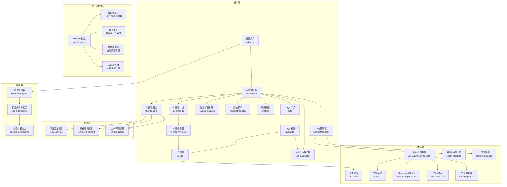
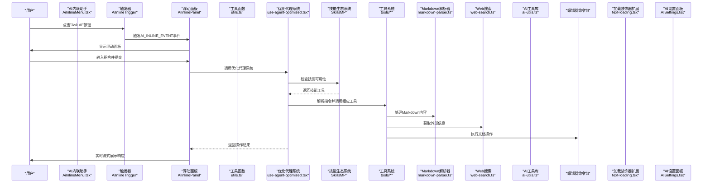
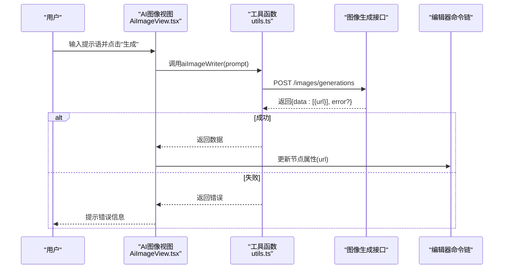
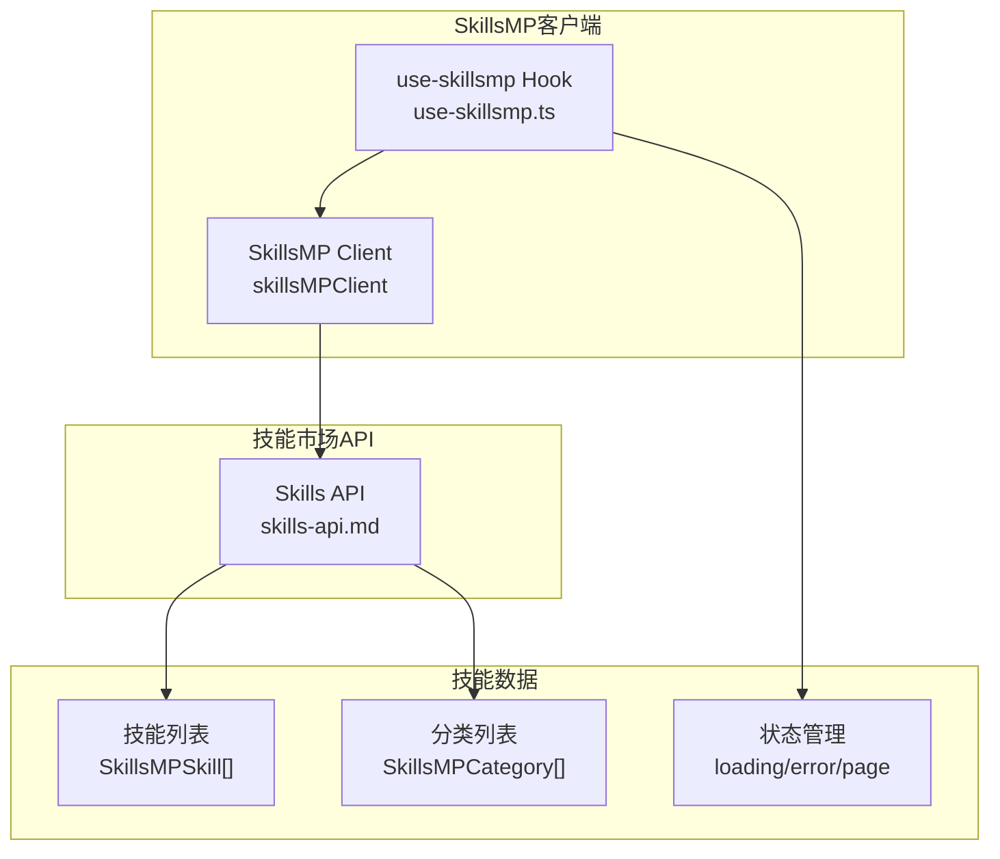
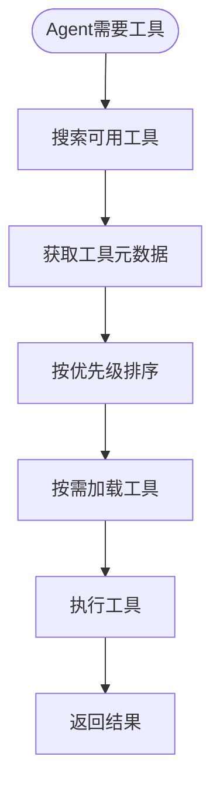
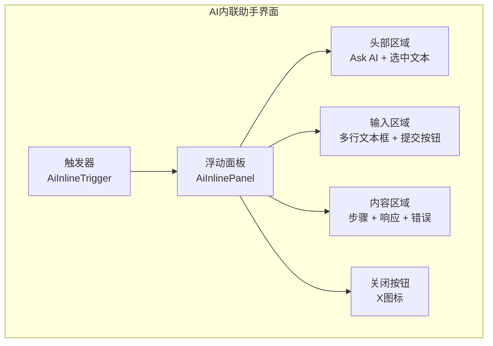
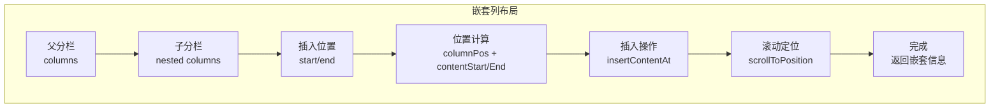
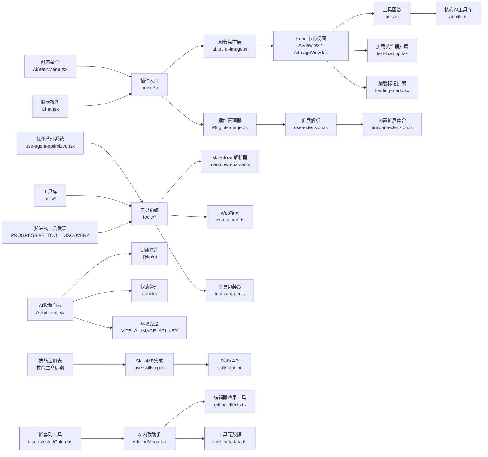

# AI插件

<cite>
**本文引用的文件**
- [packages/plugin-ai/src/index.tsx](file://packages/plugin-ai/src/index.tsx)
- [packages/plugin-ai/src/ai/index.tsx](file://packages/plugin-ai/src/ai/index.tsx)
- [packages/plugin-ai/src/ai/ai.ts](file://packages/plugin-ai/src/ai/ai.ts)
- [packages/plugin-ai/src/ai/ai-image.ts](file://packages/plugin-ai/src/ai/ai-image.ts)
- [packages/plugin-ai/src/ai/AiView.tsx](file://packages/plugin-ai/src/ai/AiView.tsx)
- [packages/plugin-ai/src/ai/AiImageView.tsx](file://packages/plugin-ai/src/ai/AiImageView.tsx)
- [packages/plugin-ai/src/ai/utils.ts](file://packages/plugin-ai/src/ai/utils.ts)
- [packages/plugin-ai/src/ai/text-loading.tsx](file://packages/plugin-ai/src/ai/text-loading.tsx)
- [packages/plugin-ai/src/ai/marks/loading-mark.tsx](file://packages/plugin-ai/src/ai/marks/loading-mark.tsx)
- [packages/plugin-ai/src/ai/menu/AiStaticMenu.tsx](file://packages/plugin-ai/src/ai/menu/AiStaticMenu.tsx)
- [packages/plugin-ai/src/ai/menu/Chat.tsx](file://packages/plugin-ai/src/ai/menu/Chat.tsx)
- [packages/plugin-ai/src/ai/AISettings.tsx](file://packages/plugin-ai/src/ai/AISettings.tsx)
- [packages/core/src/ai/AiInlineMenu.tsx](file://packages/core/src/ai/AiInlineMenu.tsx)
- [packages/core/src/ai/utils/editor-effects.ts](file://packages/core/src/ai/utils/editor-effects.ts)
- [packages/core/src/ai/ai-utils.ts](file://packages/core/src/ai/ai-utils.ts)
- [packages/core/src/ai/use-agent-optimized.tsx](file://packages/core/src/ai/use-agent-optimized.tsx)
- [packages/core/src/ai/tools/columns-tools.ts](file://packages/core/src/ai/tools/columns-tools.ts)
- [packages/core/src/ai/tools/delete-tools.ts](file://packages/core/src/ai/tools/delete-tools.ts)
- [packages/core/src/ai/tools/insert-tools.ts](file://packages/core/src/ai/tools/insert-tools.ts)
- [packages/core/src/ai/tools/misc-tools.ts](file://packages/core/src/ai/tools/misc-tools.ts)
- [packages/core/src/ai/tools/read-tools.ts](file://packages/core/src/ai/tools/read-tools.ts)
- [packages/core/src/ai/utils/markdown-parser.ts](file://packages/core/src/ai/utils/markdown-parser.ts)
- [packages/core/src/ai/utils/web-search.ts](file://packages/core/src/ai/utils/web-search.ts)
- [packages/core/src/ai/utils/tool-wrapper.ts](file://packages/core/src/ai/utils/tool-wrapper.ts)
- [packages/core/src/ai/utils/editor-effects.ts](file://packages/core/src/ai/utils/editor-effects.ts)
- [packages/core/src/ai/utils/document-utils.ts](file://packages/core/src/ai/utils/document-utils.ts)
- [packages/core/src/ai/types.ts](file://packages/core/src/ai/types.ts)
- [packages/core/src/ai/discovery/tool-metadata.ts](file://packages/core/src/ai/discovery/tool-metadata.ts)
- [packages/common/src/core/PluginManager.ts](file://packages/common/src/core/PluginManager.ts)
- [packages/editor/src/editor/build-in-extension.ts](file://packages/editor/src/editor/build-in-extension.ts)
- [packages/editor/src/editor/use-extension.ts](file://packages/editor/src/editor/use-extension.ts)
- [.env.example](file://.env.example)
- [apps/vite/.env.development](file://apps/vite/.env.development)
- [apps/vite/.env.production](file://apps/vite/.env.production)
- [packages/core/src/ai/PROGRESSIVE_TOOL_DISCOVERY.md](file://packages/core/src/ai/PROGRESSIVE_TOOL_DISCOVERY.md)
- [packages/core/src/ai/TOOL_ADAPTATION_GUIDE.md](file://packages/core/src/ai/TOOL_ADAPTATION_GUIDE.md)
- [packages/core/src/ai/README_TOOL_DISCOVERY.md](file://packages/core/src/ai/README_TOOL_DISCOVERY.md)
- [packages/core/src/ai/ARCHITECTURE.md](file://packages/core/src/ai/ARCHITECTURE.md)
- [packages/core/src/ai/skills/skillsmp/use-skillsmp.ts](file://packages/core/src/ai/skills/skillsmp/use-skillsmp.ts)
- [docs/api/skills-api.md](file://docs/api/skills-api.md)
</cite>

## 更新摘要
**变更内容**
- 新增AI内联助手系统（AiInlineMenu.tsx）：提供浮动面板界面、实时流式响应、执行步骤跟踪、用户选择提示等功能
- 增强列管理工具：支持嵌套列布局、改进编辑器效果工具、增强列管理功能
- 改进工具系统：新增insertNestedColumns工具、增强工具元数据系统、改进工具执行跟踪
- 更新插件集成：在AIExtension中集成AiInlineTrigger和AiInlinePanel组件

## 目录
1. [简介](#简介)
2. [项目结构](#项目结构)
3. [核心组件](#核心组件)
4. [架构总览](#架构总览)
5. [组件详解](#组件详解)
6. [AI技能生态系统](#ai技能生态系统)
7. [AI内联助手系统](#ai内联助手系统)
8. [增强的列管理工具](#增强的列管理工具)
9. [依赖关系分析](#依赖关系分析)
10. [性能与可用性建议](#性能与可用性建议)
11. [故障排查指南](#故障排查指南)
12. [结论](#结论)
13. [附录：使用示例与最佳实践](#附录使用示例与最佳实践)

## 简介
本文件面向希望在编辑器中集成AI能力（文本生成、图像生成与智能编辑）的开发者与产品团队。文档围绕"AI技能生态系统"和"AI内联助手系统"展开，系统阐述以下内容：
- **全新的AI内联助手系统**：提供浮动面板界面、实时流式响应、执行步骤跟踪、用户选择提示等功能
- **增强的列管理工具**：支持嵌套列布局、改进编辑器效果工具、增强列管理功能
- **改进的工具系统**：新增insertNestedColumns工具、增强工具元数据系统、改进工具执行跟踪
- **全新的AI技能市场系统**：集成SkillsMP平台，支持技能搜索、安装、管理和评价
- **渐进式工具发现系统**：基于智能元数据的工具搜索和按需加载机制
- **技能注册表管理**：提供技能生命周期管理、版本控制和依赖解析
- **智能工具提供商**：支持插件动态注册工具，实现按需加载机制
- **增强的AI代理系统**：基于优化的use-agent-optimized.tsx，提供强大的工具调用能力和智能编辑功能
- **完整的工具系统**：包含读取、插入、删除、列布局和杂项五大类工具，支持复杂的文档操作
- **增强的Markdown处理**：提供完整的Markdown解析器，支持表格、列表、代码块等复杂格式
- **Web搜索集成**：内置Web搜索功能，支持外部信息获取和网页内容提取
- **安全的API密钥管理**：移除了硬编码的DeepSeek API密钥，通过环境变量和设置面板进行安全配置
- **插件集成与参数配置**：通过插件配置注入编辑器扩展、浮动菜单、静态菜单与斜杠命令，统一多语言文案与本地化资源
- **结果处理与错误处理**：对流式文本与图像生成进行状态切换、结果回填与错误提示
- **性能优化与最佳实践**：针对长文本流式渲染、并发生成与网络请求进行优化建议

## 项目结构
AI插件位于 packages/plugin-ai，核心由以下模块组成：
- **插件入口与注册**：定义插件类实例，注入编辑器扩展、浮动菜单、静态菜单与斜杠命令
- **编辑器节点扩展**：定义AI文本块与AI图像块两种节点类型，绑定React节点视图
- **视图组件**：分别为AI文本块与AI图像块提供交互界面
- **工具函数**：封装文本生成、图像生成与加载装饰器命令
- **加载装饰器扩展**：为编辑器提供"生成中"装饰器，用于流式渲染占位
- **标记扩展**：提供"加载中"标记，便于在特定范围内标注加载状态
- **菜单与聊天**：提供静态菜单（一键改写、语气、翻译等）与浮动聊天视图
- **AI设置面板**：提供API端点和密钥配置界面，支持安全的密钥管理
- **AI内联助手系统**：提供浮动面板界面、实时流式响应、执行步骤跟踪、用户选择提示
- **技能市场集成**：集成SkillsMP平台，支持技能搜索、安装和管理
- **技能注册表**：提供技能生命周期管理、版本控制和依赖解析
- **发现工具**：基于渐进式工具发现系统，支持智能工具搜索和加载
- **技能提供商**：提供技能商店、分类管理和评价系统
- **工具提供商**：支持插件动态注册工具，实现按需加载机制
- **优化的AI代理系统**：全新的use-agent-optimized.tsx，提供强大的工具调用能力
- **完整的工具系统**：五大类工具模块，支持复杂的文档操作
- **增强的工具库**：Markdown解析器、Web搜索、工具包装器等辅助功能

```mermaid
graph TB
subgraph "插件层"
P["插件入口<br/>index.tsx"]
AIEXT["AI扩展组合<br/>ai/index.tsx"]
E1["AI文本节点<br/>ai.ts"]
E2["AI图像节点<br/>ai-image.ts"]
V1["AI文本视图<br/>AiView.tsx"]
V2["AI图像视图<br/>AiImageView.tsx"]
U["工具函数<br/>utils.ts"]
TL["加载装饰器扩展<br/>text-loading.tsx"]
LM["加载标记扩展<br/>loading-mark.tsx"]
SM["静态菜单<br/>AiStaticMenu.tsx"]
CH["聊天视图<br/>Chat.tsx"]
AS["AI设置面板<br/>AISettings.tsx"]
IL["AI内联助手<br/>AiInlineMenu.tsx"]
end
subgraph "技能生态系统层"
SK["SkillsMP集成<br/>use-skillsmp.ts"]
SR["技能注册表<br/>技能生命周期管理"]
DT["发现工具<br/>渐进式工具发现"]
SP["技能提供商<br/>技能商店管理"]
TP["工具提供商<br/>插件工具注册"]
end
subgraph "核心层"
C1["AI工具库<br/>ai-utils.ts"]
C2["优化代理系统<br/>use-agent-optimized.tsx"]
TOOLS["工具系统<br/>tools/*"]
MD["Markdown解析器<br/>markdown-parser.ts"]
WS["Web搜索<br/>web-search.ts"]
TW["工具包装器<br/>tool-wrapper.ts"]
EE["编辑器效果工具<br/>editor-effects.ts"]
TM["工具元数据<br/>tool-metadata.ts"]
end
subgraph "配置层"
ENV["环境变量配置<br/>.env.example"]
DEV["开发环境配置<br/>.env.development"]
PROD["生产环境配置<br/>.env.production"]
end
subgraph "通用层"
PM["插件管理器<br/>PluginManager.ts"]
BE["内置扩展集合<br/>build-in-extension.ts"]
UE["扩展解析与组装<br/>use-extension.ts"]
end
P --> AIEXT
AIEXT --> E1
AIEXT --> E2
AIEXT --> TL
AIEXT --> LM
AIEXT --> SM
AIEXT --> CH
AIEXT --> AS
AIEXT --> IL
E1 --> V1
E2 --> V2
V1 --> U
V2 --> U
U --> C1
V1 --> TL
P --> PM
PM --> UE
UE --> BE
C2 --> TOOLS
C2 --> MD
C2 --> WS
C2 --> TW
AS --> ENV
AS --> DEV
AS --> PROD
IL --> EE
IL --> TM
SK --> SR
SK --> DT
SK --> SP
SK --> TP
```

**图表来源**
- [packages/plugin-ai/src/index.tsx](file://packages/plugin-ai/src/index.tsx#L1-L35)
- [packages/plugin-ai/src/ai/index.tsx](file://packages/plugin-ai/src/ai/index.tsx#L1-L66)
- [packages/plugin-ai/src/ai/AISettings.tsx](file://packages/plugin-ai/src/ai/AISettings.tsx#L1-L182)
- [packages/core/src/ai/AiInlineMenu.tsx](file://packages/core/src/ai/AiInlineMenu.tsx#L1-L435)
- [packages/core/src/ai/utils/editor-effects.ts](file://packages/core/src/ai/utils/editor-effects.ts#L1-L12)
- [packages/core/src/ai/use-agent-optimized.tsx](file://packages/core/src/ai/use-agent-optimized.tsx#L1-L223)
- [packages/core/src/ai/utils/markdown-parser.ts](file://packages/core/src/ai/utils/markdown-parser.ts#L1-L458)
- [packages/core/src/ai/utils/web-search.ts](file://packages/core/src/ai/utils/web-search.ts#L1-L172)
- [packages/core/src/ai/skills/skillsmp/use-skillsmp.ts](file://packages/core/src/ai/skills/skillsmp/use-skillsmp.ts#L1-L190)
- [packages/core/src/ai/discovery/tool-metadata.ts](file://packages/core/src/ai/discovery/tool-metadata.ts#L268-L419)
- [.env.example](file://.env.example#L1-L24)
- [apps/vite/.env.development](file://apps/vite/.env.development#L1-L23)
- [apps/vite/.env.production](file://apps/vite/.env.production#L1-L23)

## 核心组件
- **插件入口与注册**
  - 定义插件实例，声明编辑器扩展数组、浮动菜单、静态菜单与斜杠命令，供插件管理器在运行时合并与注入
  - **新增AI内联助手系统集成**：在AIExtension中集成AiInlineTrigger和AiInlinePanel组件
  - 关键路径参考：[packages/plugin-ai/src/index.tsx](file://packages/plugin-ai/src/index.tsx#L1-L35), [packages/plugin-ai/src/ai/index.tsx](file://packages/plugin-ai/src/ai/index.tsx#L1-L66)

- **AI文本节点与命令**
  - 定义节点属性（提示语、生成时间）、HTML渲染、节点视图绑定与插入命令
  - 关键路径参考：[packages/plugin-ai/src/ai/ai.ts](file://packages/plugin-ai/src/ai/ai.ts#L1-L55)

- **AI图像节点与命令**
  - 定义节点属性（提示语、图片URL）、节点视图绑定与插入命令
  - 关键路径参考：[packages/plugin-ai/src/ai/ai-image.ts](file://packages/plugin-ai/src/ai/ai-image.ts#L1-L37)

- **文本生成视图**
  - 负责渲染节点内容、显示生成信息、接收提示语、触发生成与删除
  - 关键路径参考：[packages/plugin-ai/src/ai/AiView.tsx](file://packages/plugin-ai/src/ai/AiView.tsx#L1-L76)

- **图像生成视图**
  - 负责渲染图片预览、接收提示语、触发生成与删除；对错误进行提示
  - 关键路径参考：[packages/plugin-ai/src/ai/AiImageView.tsx](file://packages/plugin-ai/src/ai/AiImageView.tsx#L1-L69)

- **工具函数**
  - 文本生成：基于核心AI工具库发起流式文本生成，支持在指定位置插入与更新
  - 图像生成：调用外部图像生成接口，返回结果后更新节点属性
  - **安全的API密钥管理**：通过环境变量VITE_AI_IMAGE_API_KEY获取图像生成密钥
  - 关键路径参考：[packages/plugin-ai/src/ai/utils.ts](file://packages/plugin-ai/src/ai/utils.ts#L1-L126)

- **加载装饰器扩展**
  - 在编辑器中注入"生成中"装饰器，支持切换与移除，用于流式渲染占位
  - 关键路径参考：[packages/plugin-ai/src/ai/text-loading.tsx](file://packages/plugin-ai/src/ai/text-loading.tsx#L1-L146)

- **加载标记扩展**
  - 提供"加载中"标记，支持设置与取消标记，便于在特定范围内标注加载状态
  - 关键路径参考：[packages/plugin-ai/src/ai/marks/loading-mark.tsx](file://packages/plugin-ai/src/ai/marks/loading-mark.tsx#L1-L36)

- **静态菜单与聊天视图**
  - 静态菜单：提供一键改写、简化、插入表情、改变语气、翻译等常用智能编辑操作
  - 聊天视图：提供浮动聊天窗口，支持与Agent对话并流式展示回答
  - 关键路径参考：[packages/plugin-ai/src/ai/menu/AiStaticMenu.tsx](file://packages/plugin-ai/src/ai/menu/AiStaticMenu.tsx#L1-L48), [packages/plugin-ai/src/ai/menu/Chat.tsx](file://packages/plugin-ai/src/ai/menu/Chat.tsx#L1-L198)

- **AI设置面板**
  - 提供API端点和密钥配置界面，支持文本生成和图像生成的API配置
  - 支持密码输入框安全存储API密钥，提供设置保存功能
  - 关键路径参考：[packages/plugin-ai/src/ai/AISettings.tsx](file://packages/plugin-ai/src/ai/AISettings.tsx#L1-L182)

- **AI内联助手系统**
  - **浮动面板界面**：提供Ask AI浮动面板，支持实时流式响应和执行步骤跟踪
  - **触发器组件**：在气泡菜单中提供Ask AI按钮，捕获用户选中文本并触发面板
  - **虚拟选中高亮**：通过装饰插件为选中区域提供视觉高亮
  - **流式缓冲**：使用requestAnimationFrame优化流式文本渲染性能
  - **执行步骤跟踪**：实时显示工具执行状态、结果和耗时
  - 关键路径参考：[packages/core/src/ai/AiInlineMenu.tsx](file://packages/core/src/ai/AiInlineMenu.tsx#L1-L435)

- **技能市场集成（SkillsMP）**
  - 基于use-skillsmp.ts的React Hook，提供技能搜索、分类加载和分页功能
  - 支持关键词搜索和AI语义搜索，提供完整的技能市场交互体验
  - 关键路径参考：[packages/core/src/ai/skills/skillsmp/use-skillsmp.ts](file://packages/core/src/ai/skills/skillsmp/use-skillsmp.ts#L1-L190)

- **技能注册表系统**
  - 提供技能生命周期管理，包括安装、卸载、启用/禁用和版本控制
  - 支持技能依赖解析和工具注册，实现完整的技能生态系统
  - 关键路径参考：[docs/api/skills-api.md](file://docs/api/skills-api.md#L1-L777)

- **渐进式工具发现系统**
  - 基于PROGRESSIVE_TOOL_DISCOVERY.md的智能工具发现机制
  - 支持按需加载、智能搜索和性能优化的工具管理系统
  - 关键路径参考：[packages/core/src/ai/PROGRESSIVE_TOOL_DISCOVERY.md](file://packages/core/src/ai/PROGRESSIVE_TOOL_DISCOVERY.md#L1-L389)

- **技能提供商**
  - 提供技能商店功能，支持技能分类、评价和推荐系统
  - 支持技能分享、导入和导出，实现技能生态系统的开放性
  - 关键路径参考：[docs/api/skills-api.md](file://docs/api/skills-api.md#L311-L465)

- **工具提供商**
  - 支持插件动态注册工具，实现按需加载机制
  - 提供工具元数据管理、优先级设置和标签系统
  - 关键路径参考：[packages/core/src/ai/TOOL_ADAPTATION_GUIDE.md](file://packages/core/src/ai/TOOL_ADAPTATION_GUIDE.md#L147-L169)

- **优化的AI代理系统**
  - 基于use-agent-optimized.tsx的全新代理系统，支持工具循环和智能决策
  - 提供停止生成、状态检查等功能，增强用户体验
  - 关键路径参考：[packages/core/src/ai/use-agent-optimized.tsx](file://packages/core/src/ai/use-agent-optimized.tsx#L1-L223)

- **完整的工具系统**
  - 五大类工具模块：读取工具、插入工具、删除工具、列布局工具、杂项工具
  - 支持复杂的文档操作和智能编辑功能
  - **新增嵌套列布局工具**：insertNestedColumns支持在现有分栏列内插入嵌套分栏布局
  - 关键路径参考：[packages/core/src/ai/tools/read-tools.ts](file://packages/core/src/ai/tools/read-tools.ts#L1-L208), [packages/core/src/ai/tools/insert-tools.ts](file://packages/core/src/ai/tools/insert-tools.ts#L1-L611), [packages/core/src/ai/tools/delete-tools.ts](file://packages/core/src/ai/tools/delete-tools.ts#L1-L253), [packages/core/src/ai/tools/columns-tools.ts](file://packages/core/src/ai/tools/columns-tools.ts#L1-L616), [packages/core/src/ai/tools/misc-tools.ts](file://packages/core/src/ai/tools/misc-tools.ts#L1-L210)

- **增强的工具库**
  - Markdown解析器：支持完整的Markdown语法解析和转换
  - Web搜索：集成多种搜索源，提供高质量的外部信息获取
  - 工具包装器：提供统一的工具执行跟踪和回调机制
  - **编辑器效果工具**：提供滚动到指定位置等编辑器操作工具
  - 关键路径参考：[packages/core/src/ai/utils/markdown-parser.ts](file://packages/core/src/ai/utils/markdown-parser.ts#L1-L458), [packages/core/src/ai/utils/web-search.ts](file://packages/core/src/ai/utils/web-search.ts#L1-L172), [packages/core/src/ai/utils/tool-wrapper.ts](file://packages/core/src/ai/utils/tool-wrapper.ts#L1-L68), [packages/core/src/ai/utils/editor-effects.ts](file://packages/core/src/ai/utils/editor-effects.ts#L1-L12)

- **核心AI工具库**
  - 提供模型创建与流式文本生成封装，作为工具函数的上游依赖
  - **移除了硬编码的DeepSeek API密钥，通过空字符串初始化**
  - 关键路径参考：[packages/core/src/ai/ai-utils.ts](file://packages/core/src/ai/ai-utils.ts#L1-L20)

- **插件管理与扩展装配**
  - 插件管理器负责收集各插件的编辑器扩展与本地化资源；编辑器在运行时解析并组装扩展
  - 关键路径参考：[packages/common/src/core/PluginManager.ts](file://packages/common/src/core/PluginManager.ts#L1-L177), [packages/editor/src/editor/use-extension.ts](file://packages/editor/src/editor/use-extension.ts#L47-L63), [packages/editor/src/editor/build-in-extension.ts](file://packages/editor/src/editor/build-in-extension.ts#L1-L56)

**章节来源**
- [packages/plugin-ai/src/index.tsx](file://packages/plugin-ai/src/index.tsx#L1-L35)
- [packages/plugin-ai/src/ai/index.tsx](file://packages/plugin-ai/src/ai/index.tsx#L1-L66)
- [packages/plugin-ai/src/ai/ai.ts](file://packages/plugin-ai/src/ai/ai.ts#L1-L55)
- [packages/plugin-ai/src/ai/ai-image.ts](file://packages/plugin-ai/src/ai/ai-image.ts#L1-L37)
- [packages/plugin-ai/src/ai/AiView.tsx](file://packages/plugin-ai/src/ai/AiView.tsx#L1-L76)
- [packages/plugin-ai/src/ai/AiImageView.tsx](file://packages/plugin-ai/src/ai/AiImageView.tsx#L1-L69)
- [packages/plugin-ai/src/ai/utils.ts](file://packages/plugin-ai/src/ai/utils.ts#L1-L126)
- [packages/plugin-ai/src/ai/text-loading.tsx](file://packages/plugin-ai/src/ai/text-loading.tsx#L1-L146)
- [packages/plugin-ai/src/ai/marks/loading-mark.tsx](file://packages/plugin-ai/src/ai/marks/loading-mark.tsx#L1-L36)
- [packages/plugin-ai/src/ai/menu/AiStaticMenu.tsx](file://packages/plugin-ai/src/ai/menu/AiStaticMenu.tsx#L1-L48)
- [packages/plugin-ai/src/ai/menu/Chat.tsx](file://packages/plugin-ai/src/ai/menu/Chat.tsx#L1-L198)
- [packages/plugin-ai/src/ai/AISettings.tsx](file://packages/plugin-ai/src/ai/AISettings.tsx#L1-L182)
- [packages/core/src/ai/AiInlineMenu.tsx](file://packages/core/src/ai/AiInlineMenu.tsx#L1-L435)
- [packages/core/src/ai/skills/skillsmp/use-skillsmp.ts](file://packages/core/src/ai/skills/skillsmp/use-skillsmp.ts#L1-L190)
- [docs/api/skills-api.md](file://docs/api/skills-api.md#L1-L777)
- [packages/core/src/ai/PROGRESSIVE_TOOL_DISCOVERY.md](file://packages/core/src/ai/PROGRESSIVE_TOOL_DISCOVERY.md#L1-L389)
- [packages/core/src/ai/TOOL_ADAPTATION_GUIDE.md](file://packages/core/src/ai/TOOL_ADAPTATION_GUIDE.md#L147-L169)
- [packages/core/src/ai/use-agent-optimized.tsx](file://packages/core/src/ai/use-agent-optimized.tsx#L1-L223)
- [packages/core/src/ai/tools/read-tools.ts](file://packages/core/src/ai/tools/read-tools.ts#L1-L208)
- [packages/core/src/ai/tools/insert-tools.ts](file://packages/core/src/ai/tools/insert-tools.ts#L1-L611)
- [packages/core/src/ai/tools/delete-tools.ts](file://packages/core/src/ai/tools/delete-tools.ts#L1-L253)
- [packages/core/src/ai/tools/columns-tools.ts](file://packages/core/src/ai/tools/columns-tools.ts#L1-L616)
- [packages/core/src/ai/tools/misc-tools.ts](file://packages/core/src/ai/tools/misc-tools.ts#L1-L210)
- [packages/core/src/ai/utils/markdown-parser.ts](file://packages/core/src/ai/utils/markdown-parser.ts#L1-L458)
- [packages/core/src/ai/utils/web-search.ts](file://packages/core/src/ai/utils/web-search.ts#L1-L172)
- [packages/core/src/ai/utils/tool-wrapper.ts](file://packages/core/src/ai/utils/tool-wrapper.ts#L1-L68)
- [packages/core/src/ai/utils/editor-effects.ts](file://packages/core/src/ai/utils/editor-effects.ts#L1-L12)
- [packages/core/src/ai/ai-utils.ts](file://packages/core/src/ai/ai-utils.ts#L1-L20)
- [packages/common/src/core/PluginManager.ts](file://packages/common/src/core/PluginManager.ts#L1-L177)
- [packages/editor/src/editor/use-extension.ts](file://packages/editor/src/editor/use-extension.ts#L47-L63)
- [packages/editor/src/editor/build-in-extension.ts](file://packages/editor/src/editor/build-in-extension.ts#L1-L56)

## 架构总览
AI插件采用"插件-扩展-视图-技能生态系统"的分层架构：
- **插件层**：通过插件入口注册编辑器扩展、浮动菜单、静态菜单与斜杠命令
- **扩展层**：节点扩展定义节点行为与视图；加载装饰器扩展提供流式渲染占位；标记扩展提供范围标记能力
- **视图层**：React节点视图为用户提供交互界面；静态菜单与聊天视图为用户提供快捷操作与对话体验；**AI设置面板为用户提供安全的配置界面**；**AI内联助手系统提供浮动面板界面和实时交互**
- **技能生态系统层**：**SkillsMP集成提供技能市场接入**；**技能注册表管理技能生命周期**；**渐进式工具发现系统提供智能工具管理**；**技能提供商和工具提供商实现生态系统的开放性**
- **工具层**：全新的工具系统提供完整的文档操作能力，包括读取、插入、删除、列布局和杂项功能，**新增嵌套列布局支持**
- **代理层**：优化的AI代理系统提供智能决策和工具调用能力
- **配置层**：环境变量和设置面板提供安全的API密钥管理
- **运行时装配**：插件管理器聚合各插件扩展，编辑器解析并组装扩展

```mermaid
sequenceDiagram
participant User as "用户"
participant Inline as "AI内联助手<br/>AiInlineMenu.tsx"
participant Trigger as "触发器<br/>AiInlineTrigger"
participant Panel as "浮动面板<br/>AiInlinePanel"
participant Utils as "工具函数<br/>utils.ts"
participant Agent as "优化代理系统<br/>use-agent-optimized.tsx"
participant Skills as "技能生态系统<br/>SkillsMP"
participant Tools as "工具系统<br/>tools/*"
participant Parser as "Markdown解析器<br/>markdown-parser.ts"
participant Search as "Web搜索<br/>web-search.ts"
participant Core as "AI工具库<br/>ai-utils.ts"
participant Editor as "编辑器命令链"
participant Decor as "加载装饰器扩展<br/>text-loading.tsx"
participant Settings as "AI设置面板<br/>AISettings.tsx"
User->>Trigger : 点击"Ask AI"按钮
Trigger->>Panel : 触发AI_INLINE_EVENT事件
Panel->>User : 显示浮动面板
User->>Panel : 输入指令并提交
Panel->>Agent : 调用优化代理系统
Agent->>Skills : 检查技能可用性
Skills-->>Agent : 返回技能工具
Agent->>Tools : 解析指令并调用相应工具
Tools->>Parser : 处理Markdown内容
Tools->>Search : 获取外部信息
Tools->>Editor : 执行文档操作
Agent-->>Panel : 返回操作结果
Panel->>User : 实时流式展示响应
```

**图表来源**
- [packages/core/src/ai/AiInlineMenu.tsx](file://packages/core/src/ai/AiInlineMenu.tsx#L77-L115)
- [packages/core/src/ai/AiInlineMenu.tsx](file://packages/core/src/ai/AiInlineMenu.tsx#L119-L435)
- [packages/plugin-ai/src/ai/AiView.tsx](file://packages/plugin-ai/src/ai/AiView.tsx#L1-L76)
- [packages/plugin-ai/src/ai/utils.ts](file://packages/plugin-ai/src/ai/utils.ts#L1-L126)
- [packages/plugin-ai/src/ai/AISettings.tsx](file://packages/plugin-ai/src/ai/AISettings.tsx#L1-L182)
- [packages/core/src/ai/use-agent-optimized.tsx](file://packages/core/src/ai/use-agent-optimized.tsx#L1-L223)
- [packages/core/src/ai/skills/skillsmp/use-skillsmp.ts](file://packages/core/src/ai/skills/skillsmp/use-skillsmp.ts#L1-L190)
- [packages/core/src/ai/tools/insert-tools.ts](file://packages/core/src/ai/tools/insert-tools.ts#L1-L611)
- [packages/core/src/ai/utils/markdown-parser.ts](file://packages/core/src/ai/utils/markdown-parser.ts#L1-L458)
- [packages/core/src/ai/utils/web-search.ts](file://packages/core/src/ai/utils/web-search.ts#L1-L172)

## 组件详解

### 文本生成流程（AI文本块）
- **节点定义与命令**
  - 节点属性包含提示语与生成时间；提供插入AI文本块的命令
  - 参考路径：[packages/plugin-ai/src/ai/ai.ts](file://packages/plugin-ai/src/ai/ai.ts#L1-L55)

- **视图交互**
  - 显示"此文本由AI生成"与生成日期；在可编辑状态下允许修改提示语并触发生成
  - 参考路径：[packages/plugin-ai/src/ai/AiView.tsx](file://packages/plugin-ai/src/ai/AiView.tsx#L1-L76)

- **流式渲染与装饰器**
  - 使用"生成中"装饰器在指定位置渲染占位；通过命令切换与移除装饰器
  - 参考路径：[packages/plugin-ai/src/ai/text-loading.tsx](file://packages/plugin-ai/src/ai/text-loading.tsx#L1-L146)

- **工具函数**
  - aiGeneration：发起流式文本生成，回调增量结果；aiText：在当前选区执行AI改写
  - **安全的API密钥管理**：通过环境变量VITE_AI_IMAGE_API_KEY获取图像生成密钥
  - 参考路径：[packages/plugin-ai/src/ai/utils.ts](file://packages/plugin-ai/src/ai/utils.ts#L1-L126), [packages/core/src/ai/ai-utils.ts](file://packages/core/src/ai/ai-utils.ts#L1-L20)

```mermaid
flowchart TD
Start(["开始"]) --> GetPrompt["读取提示语"]
GetPrompt --> DeleteOld["删除旧内容"]
DeleteOld --> ToggleDeco["切换"生成中"装饰器"]
ToggleDeco --> Stream["订阅流式文本"]
Stream --> Update["增量更新编辑器内容"]
Update --> HasMore{"是否还有片段？"}
HasMore --> |是| Stream
HasMore --> |否| InsertFinal["插入最终文本"]
InsertFinal --> RemoveDeco["移除装饰器"]
RemoveDeco --> End(["结束"])
```

**图表来源**
- [packages/plugin-ai/src/ai/AiView.tsx](file://packages/plugin-ai/src/ai/AiView.tsx#L1-L76)
- [packages/plugin-ai/src/ai/utils.ts](file://packages/plugin-ai/src/ai/utils.ts#L1-L126)
- [packages/plugin-ai/src/ai/text-loading.tsx](file://packages/plugin-ai/src/ai/text-loading.tsx#L1-L146)

**章节来源**
- [packages/plugin-ai/src/ai/ai.ts](file://packages/plugin-ai/src/ai/ai.ts#L1-L55)
- [packages/plugin-ai/src/ai/AiView.tsx](file://packages/plugin-ai/src/ai/AiView.tsx#L1-L76)
- [packages/plugin-ai/src/ai/utils.ts](file://packages/plugin-ai/src/ai/utils.ts#L1-L126)
- [packages/plugin-ai/src/ai/text-loading.tsx](file://packages/plugin-ai/src/ai/text-loading.tsx#L1-L146)
- [packages/core/src/ai/ai-utils.ts](file://packages/core/src/ai/ai-utils.ts#L1-L20)

### 图像生成流程（AI图像块）
- **节点定义与命令**
  - 节点属性包含提示语与图片URL；提供插入AI图像块的命令
  - 参考路径：[packages/plugin-ai/src/ai/ai-image.ts](file://packages/plugin-ai/src/ai/ai-image.ts#L1-L37)

- **视图交互**
  - 预览图片；在可编辑状态下允许修改提示语并触发生成；失败时弹出提示
  - 参考路径：[packages/plugin-ai/src/ai/AiImageView.tsx](file://packages/plugin-ai/src/ai/AiImageView.tsx#L1-L69)

- **工具函数**
  - aiImageWriter：调用外部图像生成接口，返回结果后更新节点URL
  - **安全的API密钥管理**：通过环境变量VITE_AI_IMAGE_API_KEY获取图像生成密钥，支持配置覆盖
  - 参考路径：[packages/plugin-ai/src/ai/utils.ts](file://packages/plugin-ai/src/ai/utils.ts#L1-L126)

```mermaid
sequenceDiagram
participant User as "用户"
participant ImageView as "AI图像视图<br/>AiImageView.tsx"
participant Utils as "工具函数<br/>utils.ts"
participant API as "图像生成接口"
participant Editor as "编辑器命令链"
User->>ImageView : 输入提示语并点击"生成"
ImageView->>Utils : 调用aiImageWriter(prompt)
Utils->>API : POST /images/generations
API-->>Utils : 返回{data : [{url}], error?}
alt 成功
Utils-->>ImageView : 返回数据
ImageView->>Editor : 更新节点属性(url)
else 失败
Utils-->>ImageView : 返回错误
ImageView-->>User : 提示错误信息
end
```

**图表来源**
- [packages/plugin-ai/src/ai/AiImageView.tsx](file://packages/plugin-ai/src/ai/AiImageView.tsx#L1-L69)
- [packages/plugin-ai/src/ai/utils.ts](file://packages/plugin-ai/src/ai/utils.ts#L1-L126)

**章节来源**
- [packages/plugin-ai/src/ai/ai-image.ts](file://packages/plugin-ai/src/ai/ai-image.ts#L1-L37)
- [packages/plugin-ai/src/ai/AiImageView.tsx](file://packages/plugin-ai/src/ai/AiImageView.tsx#L1-L69)
- [packages/plugin-ai/src/ai/utils.ts](file://packages/plugin-ai/src/ai/utils.ts#L1-L126)

### 智能编辑工具与聊天视图
- **静态菜单**
  - 提供一键改写、简化、插入表情、改变语气、翻译等常用智能编辑操作
  - 参考路径：[packages/plugin-ai/src/ai/menu/AiStaticMenu.tsx](file://packages/plugin-ai/src/ai/menu/AiStaticMenu.tsx#L1-L48)

- **聊天视图**
  - 提供浮动聊天窗口，支持与Agent对话并流式展示回答
  - 参考路径：[packages/plugin-ai/src/ai/menu/Chat.tsx](file://packages/plugin-ai/src/ai/menu/Chat.tsx#L1-L198)

- **优化的AI代理系统**
  - 基于use-agent-optimized.tsx的全新代理系统，支持工具循环和智能决策
  - 提供停止生成、状态检查等功能，增强用户体验
  - **移除了硬编码的DeepSeek API密钥，通过空字符串初始化**
  - 参考路径：[packages/core/src/ai/use-agent-optimized.tsx](file://packages/core/src/ai/use-agent-optimized.tsx#L1-L223)

- **Agent能力**
  - 基于插件管理器解析的工具集，提供读取范围、读取全文、写入、替换、删除与高亮等能力
  - 支持列布局操作、Web搜索、用户选择确认等高级功能
  - **集成技能生态系统，支持技能驱动的工具调用**
  - 参考路径：[packages/core/src/ai/use-agent-optimized.tsx](file://packages/core/src/ai/use-agent-optimized.tsx#L1-L223)

- **模型与工具库**
  - 使用DeepSeek模型与工具库封装流式文本生成
  - **移除了硬编码的DeepSeek API密钥，通过空字符串初始化**
  - 参考路径：[packages/core/src/ai/ai-utils.ts](file://packages/core/src/ai/ai-utils.ts#L1-L20)

**章节来源**
- [packages/plugin-ai/src/ai/menu/AiStaticMenu.tsx](file://packages/plugin-ai/src/ai/menu/AiStaticMenu.tsx#L1-L48)
- [packages/plugin-ai/src/ai/menu/Chat.tsx](file://packages/plugin-ai/src/ai/menu/Chat.tsx#L1-L198)
- [packages/core/src/ai/use-agent-optimized.tsx](file://packages/core/src/ai/use-agent-optimized.tsx#L1-L223)
- [packages/core/src/ai/ai-utils.ts](file://packages/core/src/ai/ai-utils.ts#L1-L20)

### AI设置面板与API配置
- **安全的API配置界面**
  - 提供文本生成API端点、图像生成API端点和API密钥的配置界面
  - 支持密码输入框安全存储API密钥，提供设置保存功能
  - 参考路径：[packages/plugin-ai/src/ai/AISettings.tsx](file://packages/plugin-ai/src/ai/AISettings.tsx#L1-L182)

- **环境变量支持**
  - 通过VITE_AI_IMAGE_API_KEY环境变量获取图像生成API密钥
  - 支持开发环境和生产环境的不同配置
  - 参考路径：[packages/plugin-ai/src/ai/utils.ts](file://packages/plugin-ai/src/ai/utils.ts#L6-L10), [.env.example](file://.env.example#L1-L24), [apps/vite/.env.development](file://apps/vite/.env.development#L1-L23), [apps/vite/.env.production](file://apps/vite/.env.production#L1-L23)

- **安全的API密钥管理**
  - 移除了硬编码的DeepSeek API密钥，提升了安全性
  - 通过环境变量和设置面板进行API密钥的配置和管理
  - 参考路径：[packages/core/src/ai/ai-utils.ts](file://packages/core/src/ai/ai-utils.ts#L5-L7)

**章节来源**
- [packages/plugin-ai/src/ai/AISettings.tsx](file://packages/plugin-ai/src/ai/AISettings.tsx#L1-L182)
- [packages/plugin-ai/src/ai/utils.ts](file://packages/plugin-ai/src/ai/utils.ts#L6-L10)
- [packages/core/src/ai/ai-utils.ts](file://packages/core/src/ai/ai-utils.ts#L5-L7)
- [.env.example](file://.env.example#L1-L24)
- [apps/vite/.env.development](file://apps/vite/.env.development#L1-L23)
- [apps/vite/.env.production](file://apps/vite/.env.production#L1-L23)

### 插件集成与参数配置
- **插件注册**
  - 在插件入口中声明编辑器扩展数组、浮动菜单、静态菜单与斜杠命令，供插件管理器在运行时合并
  - **新增AI内联助手系统集成**：在AIExtension中集成AiInlineTrigger和AiInlinePanel组件
  - 参考路径：[packages/plugin-ai/src/index.tsx](file://packages/plugin-ai/src/index.tsx#L1-L35), [packages/plugin-ai/src/ai/index.tsx](file://packages/plugin-ai/src/ai/index.tsx#L1-L66)

- **扩展解析与装配**
  - 编辑器运行时将内置扩展与插件扩展合并，解析并组装扩展列表
  - 参考路径：[packages/editor/src/editor/use-extension.ts](file://packages/editor/src/editor/use-extension.ts#L47-L63), [packages/editor/src/editor/build-in-extension.ts](file://packages/editor/src/editor/build-in-extension.ts#L1-L56)

- **插件管理器**
  - 支持动态安装/卸载插件，聚合各插件的服务与扩展
  - **集成技能生态系统，支持插件驱动的技能管理**
  - 参考路径：[packages/common/src/core/PluginManager.ts](file://packages/common/src/core/PluginManager.ts#L1-L177)

**章节来源**
- [packages/plugin-ai/src/index.tsx](file://packages/plugin-ai/src/index.tsx#L1-L35)
- [packages/plugin-ai/src/ai/index.tsx](file://packages/plugin-ai/src/ai/index.tsx#L1-L66)
- [packages/editor/src/editor/use-extension.ts](file://packages/editor/src/editor/use-extension.ts#L47-L63)
- [packages/editor/src/editor/build-in-extension.ts](file://packages/editor/src/editor/build-in-extension.ts#L1-L56)
- [packages/common/src/core/PluginManager.ts](file://packages/common/src/core/PluginManager.ts#L1-L177)

## AI技能生态系统

### 技能市场集成（SkillsMP）
**全新的技能市场平台集成**，提供完整的技能生态系统：
- **SkillsMP客户端**：基于use-skillsmp.ts的React Hook，提供技能搜索、分类加载和分页功能
- **关键词搜索**：支持传统的关键词匹配搜索
- **AI语义搜索**：基于语义理解的智能搜索，提升搜索准确性
- **分类管理**：支持技能分类浏览和筛选
- **分页加载**：支持大数据量的分页加载和无限滚动
- **错误处理**：完善的错误处理和状态管理

```mermaid
graph TB
subgraph "SkillsMP客户端"
US["use-skillsmp Hook<br/>use-skillsmp.ts"]
SC["SkillsMP Client<br/>skillsMPClient"]
end
subgraph "技能市场API"
API["Skills API<br/>skills-api.md"]
end
subgraph "技能数据"
SK["技能列表<br/>SkillsMPSkill[]"]
CAT["分类列表<br/>SkillsMPCategory[]"]
STAT["状态管理<br/>loading/error/page"]
end
US --> SC
SC --> API
API --> SK
API --> CAT
US --> STAT
```

**图表来源**
- [packages/core/src/ai/skills/skillsmp/use-skillsmp.ts](file://packages/core/src/ai/skills/skillsmp/use-skillsmp.ts#L1-L190)
- [docs/api/skills-api.md](file://docs/api/skills-api.md#L311-L465)

**章节来源**
- [packages/core/src/ai/skills/skillsmp/use-skillsmp.ts](file://packages/core/src/ai/skills/skillsmp/use-skillsmp.ts#L1-L190)
- [docs/api/skills-api.md](file://docs/api/skills-api.md#L1-L777)

### 技能注册表系统
**完整的技能生命周期管理**，支持技能的安装、卸载、启用/禁用和版本控制：
- **技能定义**：完整的技能元数据，包括名称、描述、版本、作者等
- **安装管理**：支持从市场安装和自定义技能安装
- **状态控制**：启用/禁用技能，控制技能的活跃状态
- **来源追踪**：区分市场技能、自定义技能和导入技能
- **依赖解析**：自动解析和加载技能所需的工具依赖
- **版本管理**：支持技能版本升级和兼容性检查

**章节来源**
- [docs/api/skills-api.md](file://docs/api/skills-api.md#L13-L58)

### 渐进式工具发现系统
**智能的工具管理系统**，基于元数据的工具搜索和按需加载：
- **工具元数据**：为每个工具定义优先级、标签和描述
- **智能搜索**：基于标签和描述的语义搜索
- **优先级排序**：根据重要性和使用频率排序工具
- **按需加载**：只在需要时加载工具，提升性能
- **分类管理**：按功能分类组织工具，便于管理
- **扩展支持**：支持插件动态注册新工具

```mermaid
flowchart TD
Start(["Agent需要工具"]) --> Search["搜索可用工具"]
Search --> Meta["获取工具元数据"]
Meta --> Priority["按优先级排序"]
Priority --> Load["按需加载工具"]
Load --> Execute["执行工具"]
Execute --> Result["返回结果"]
```

**图表来源**
- [packages/core/src/ai/PROGRESSIVE_TOOL_DISCOVERY.md](file://packages/core/src/ai/PROGRESSIVE_TOOL_DISCOVERY.md#L171-L189)

**章节来源**
- [packages/core/src/ai/PROGRESSIVE_TOOL_DISCOVERY.md](file://packages/core/src/ai/PROGRESSIVE_TOOL_DISCOVERY.md#L1-L389)
- [packages/core/src/ai/TOOL_ADAPTATION_GUIDE.md](file://packages/core/src/ai/TOOL_ADAPTATION_GUIDE.md#L1-L367)

### 技能提供商
**开放的技能商店系统**，支持技能的发布、评价和推荐：
- **技能商店**：提供技能浏览、搜索和详情展示
- **分类管理**：按功能分类组织技能，便于用户查找
- **评价系统**：支持用户对技能进行评分和评论
- **推荐机制**：基于下载量和评分的智能推荐
- **认证系统**：支持官方认证技能的标识
- **预览功能**：提供技能预览图和演示效果

**章节来源**
- [docs/api/skills-api.md](file://docs/api/skills-api.md#L311-L465)

### 工具提供商
**插件驱动的工具注册系统**，实现动态工具管理和性能优化：
- **动态注册**：支持插件在运行时注册新工具
- **工厂模式**：使用工厂函数创建工具实例
- **元数据管理**：自动为工具添加优先级和标签
- **分类注册**：按功能分类注册工具
- **描述增强**：为工具提供详细的描述信息
- **兼容性保证**：完全向后兼容现有工具

**章节来源**
- [packages/core/src/ai/TOOL_ADAPTATION_GUIDE.md](file://packages/core/src/ai/TOOL_ADAPTATION_GUIDE.md#L147-L169)

### 工具系统架构
AI工具系统采用模块化设计，包含五大类工具模块，每类工具都有明确的职责分工：

- **读取工具（Read Tools）**：获取文档结构、分块读取内容、搜索文档、获取节点信息等
- **插入工具（Insert Tools）**：插入内容、更新标题、批量插入、替换内容等
- **删除工具（Delete Tools）**：按范围删除、按文本删除、按块删除等
- **列布局工具（Columns Tools）**：创建分栏、更新列内容、设置布局、添加/删除列、**嵌套列布局**
- **杂项工具（Misc Tools）**：用户选择确认、高亮标记、Web搜索、网页抓取等

### 读取工具（Read Tools）
提供文档内容的读取和查询功能：

- getDocumentStructure：获取文档结构概览，包括大小、标题、块等信息
- readChunk：分块读取文档内容，支持上下文包含
- searchInDocument：在文档中搜索指定文本，返回精确位置信息
- getNodeAtPosition：获取指定位置的节点信息
- getDocumentSize：获取文档大小信息

**章节来源**
- [packages/core/src/ai/tools/read-tools.ts](file://packages/core/src/ai/tools/read-tools.ts#L1-L208)

### 插入工具（Insert Tools）
提供文档内容的插入和修改功能：

- updateTitle：更新文档标题（第一个块）
- write：插入文本到指定块的开头或末尾
- insertAtEnd：在文档末尾插入内容
- insertAtPosition：在指定位置插入内容
- insertAfterBlock：在指定块后插入新段落
- insertNear：在包含指定文本的块附近插入内容
- batchInsert：批量插入多个内容块
- replaceContent：搜索并替换内容
- insertSegmentedMarkdown：分段插入Markdown内容

**章节来源**
- [packages/core/src/ai/tools/insert-tools.ts](file://packages/core/src/ai/tools/insert-tools.ts#L1-L611)

### 删除工具（Delete Tools）
提供文档内容的删除功能：

- deleteRange：删除指定范围的内容
- deleteBySearch：通过搜索文本定位并删除内容
- deleteBlock：通过块索引删除整个块

**章节来源**
- [packages/core/src/ai/tools/delete-tools.ts](file://packages/core/src/ai/tools/delete-tools.ts#L1-L253)

### 列布局工具（Columns Tools）
提供分栏布局的创建和管理功能：

- insertColumns：插入分栏布局
- getColumnsInfo：获取分栏信息
- updateColumnContent：更新指定列的内容
- setColumnsLayout：设置分栏布局类型
- addColumnToLayout：向现有布局添加新列
- deleteColumn：删除指定列
- deleteColumnsLayout：删除整个分栏布局
- **insertNestedColumns：在已有分栏的指定列内插入嵌套分栏布局**

**章节来源**
- [packages/core/src/ai/tools/columns-tools.ts](file://packages/core/src/ai/tools/columns-tools.ts#L1-L616)

### 杂项工具（Misc Tools）
提供辅助功能和用户交互：

- askUserChoice：向用户询问选择（必须优先使用）
- highlight：高亮标记指定范围的文本
- webSearch：搜索互联网获取最新信息
- fetchWebPage：获取网页内容

**章节来源**
- [packages/core/src/ai/tools/misc-tools.ts](file://packages/core/src/ai/tools/misc-tools.ts#L1-L210)

### 工具包装器与类型系统
- **工具包装器**：wrapToolsWithCallback提供统一的工具执行跟踪和回调机制
- **类型系统**：完整的TypeScript类型定义，包括工具执行事件、用户选择请求、Web搜索结果等
- **工具上下文**：提供编辑器实例和用户选择回调的上下文环境

**章节来源**
- [packages/core/src/ai/utils/tool-wrapper.ts](file://packages/core/src/ai/utils/tool-wrapper.ts#L1-L68)
- [packages/core/src/ai/types.ts](file://packages/core/src/ai/types.ts#L1-L166)

### Markdown解析器
提供完整的Markdown语法解析和转换功能：

- parseMarkdownToNodes：将Markdown转换为ProseMirror兼容的JSON节点
- parseInlineMarkdown：解析内联Markdown格式（粗体、斜体、代码、链接等）
- contentItemsToNodes：将内容项转换为ProseMirror节点
- 表格支持：完整的表格解析和创建功能

**章节来源**
- [packages/core/src/ai/utils/markdown-parser.ts](file://packages/core/src/ai/utils/markdown-parser.ts#L1-L458)

### Web搜索功能
集成多种搜索源，提供高质量的外部信息获取：

- performWebSearch：支持Bocha API、后端API、DuckDuckGo等多种搜索源
- fetchWebPage：获取网页内容，支持纯文本提取
- 多级降级：主搜索失败时自动尝试其他搜索源

**章节来源**
- [packages/core/src/ai/utils/web-search.ts](file://packages/core/src/ai/utils/web-search.ts#L1-L172)

## AI内联助手系统

### 浮动面板界面
**全新的AI内联助手系统**提供直观的浮动面板界面：
- **Ask AI按钮**：在气泡菜单中提供Ask AI按钮，捕获用户选中文本并触发面板
- **浮动面板设计**：固定尺寸320px，支持动画入场效果，提供沉浸式交互体验
- **头部信息**：显示Ask AI标识和选中文本的简要预览
- **输入区域**：支持多行文本输入，支持Enter快捷键提交
- **提交按钮**：根据输入状态动态启用/禁用
- **内容区域**：支持步骤跟踪、流式响应和错误提示的显示

```mermaid
graph TB
subgraph "AI内联助手界面"
TR["触发器<br/>AiInlineTrigger"]
PL["浮动面板<br/>AiInlinePanel"]
HD["头部区域<br/>Ask AI + 选中文本"]
IN["输入区域<br/>多行文本框 + 提交按钮"]
CT["内容区域<br/>步骤 + 响应 + 错误"]
CL["关闭按钮<br/>X图标"]
end
TR --> PL
PL --> HD
PL --> IN
PL --> CT
PL --> CL
```

**图表来源**
- [packages/core/src/ai/AiInlineMenu.tsx](file://packages/core/src/ai/AiInlineMenu.tsx#L77-L115)
- [packages/core/src/ai/AiInlineMenu.tsx](file://packages/core/src/ai/AiInlineMenu.tsx#L119-L435)

**章节来源**
- [packages/core/src/ai/AiInlineMenu.tsx](file://packages/core/src/ai/AiInlineMenu.tsx#L77-L115)
- [packages/core/src/ai/AiInlineMenu.tsx](file://packages/core/src/ai/AiInlineMenu.tsx#L119-L435)

### 实时流式响应
**优化的流式文本渲染**确保流畅的用户体验：
- **流式缓冲机制**：使用requestAnimationFrame优化渲染性能，约16fps刷新率
- **增量更新**：逐块接收流式文本，实时更新显示内容
- **动画效果**：Streamdown组件提供文本动画效果，增强视觉体验
- **中断处理**：支持AbortError处理，优雅中断流式响应
- **性能优化**：通过缓冲区和RAF机制避免频繁DOM更新

**章节来源**
- [packages/core/src/ai/AiInlineMenu.tsx](file://packages/core/src/ai/AiInlineMenu.tsx#L147-L171)
- [packages/core/src/ai/AiInlineMenu.tsx](file://packages/core/src/ai/AiInlineMenu.tsx#L294-L313)

### 执行步骤跟踪
**完整的工具执行可视化**帮助用户理解AI操作过程：
- **步骤记录**：实时记录工具执行状态（运行中/成功/失败）
- **参数显示**：显示工具名称和执行参数
- **耗时统计**：记录每个工具的执行耗时
- **状态指示**：使用不同图标表示执行状态
- **历史记录**：维护完整的执行历史，支持查看和调试

**章节来源**
- [packages/core/src/ai/AiInlineMenu.tsx](file://packages/core/src/ai/AiInlineMenu.tsx#L11-L19)
- [packages/core/src/ai/AiInlineMenu.tsx](file://packages/core/src/ai/AiInlineMenu.tsx#L174-L200)

### 用户选择提示
**智能的用户交互处理**确保AI操作的准确性和可控性：
- **选择请求处理**：通过handleUserChoiceRequest处理用户选择请求
- **默认选项**：在有可用选项时自动选择第一个选项
- **交互支持**：支持用户自定义输入和选项选择
- **错误处理**：处理用户选择失败的情况

**章节来源**
- [packages/core/src/ai/AiInlineMenu.tsx](file://packages/core/src/ai/AiInlineMenu.tsx#L202-L206)

### 虚拟选中高亮
**增强的选中文本可视化**提供更好的上下文感知：
- **装饰插件**：使用aiSelectionKey创建虚拟选中高亮装饰
- **状态管理**：通过setVirtualSelection控制高亮状态
- **样式定制**：提供半透明背景色和圆角边框
- **生命周期管理**：在组件卸载时自动清理装饰

**章节来源**
- [packages/core/src/ai/AiInlineMenu.tsx](file://packages/core/src/ai/AiInlineMenu.tsx#L35-L73)

### 事件驱动架构
**基于事件的触发机制**实现松耦合的组件通信：
- **自定义事件**：使用AI_INLINE_EVENT实现触发器与面板的通信
- **位置计算**：根据选中文本位置动态计算面板显示位置
- **边界检测**：自动调整面板位置避免超出屏幕边界
- **焦点管理**：保持编辑器焦点，确保选中状态持续有效

**章节来源**
- [packages/core/src/ai/AiInlineMenu.tsx](file://packages/core/src/ai/AiInlineMenu.tsx#L28-L28)
- [packages/core/src/ai/AiInlineMenu.tsx](file://packages/core/src/ai/AiInlineMenu.tsx#L211-L243)

## 增强的列管理工具

### 嵌套列布局支持
**全新的嵌套列布局功能**实现复杂的文档结构：
- **insertNestedColumns工具**：在现有分栏的指定列内插入嵌套分栏布局
- **深度追踪**：支持多层级嵌套，通过depth和parentPath追踪嵌套关系
- **位置计算**：精确定位目标列的位置，支持开头和末尾插入
- **滚动定位**：插入后自动滚动到新位置，提供视觉反馈
- **索引更新**：重新发现文档结构，获取更新后的嵌套列索引

```mermaid
graph TB
subgraph "嵌套列布局"
COL["父分栏<br/>columns"]
SUB["子分栏<br/>nested columns"]
POS["插入位置<br/>start/end"]
CALC["位置计算<br/>columnPos + contentStart/End"]
INS["插入操作<br/>insertContentAt"]
SCROLL["滚动定位<br/>scrollToPosition"]
END["完成<br/>返回嵌套信息"]
end
COL --> SUB
SUB --> POS
POS --> CALC
CALC --> INS
INS --> SCROLL
SCROLL --> END
```

**图表来源**
- [packages/core/src/ai/tools/columns-tools.ts](file://packages/core/src/ai/tools/columns-tools.ts#L520-L616)

**章节来源**
- [packages/core/src/ai/tools/columns-tools.ts](file://packages/core/src/ai/tools/columns-tools.ts#L520-L616)

### 增强的列信息追踪
**改进的列结构分析**提供更详细的列布局信息：
- **嵌套深度**：通过depth属性追踪嵌套层级（0=顶层，1=一级嵌套...）
- **父路径追踪**：使用parentPath记录父分栏路径，支持多级嵌套导航
- **全局索引**：保持向后兼容的全局扁平索引
- **布局信息**：包含列数、布局类型和位置信息
- **实时更新**：插入嵌套列后重新发现文档结构

**章节来源**
- [packages/core/src/ai/tools/columns-tools.ts](file://packages/core/src/ai/tools/columns-tools.ts#L11-L19)
- [packages/core/src/ai/tools/columns-tools.ts](file://packages/core/src/ai/tools/columns-tools.ts#L591-L598)

### 编辑器效果工具
**新增的编辑器操作工具**提升用户体验：
- **scrollToPosition工具**：滚动编辑器视口到指定位置
- **视觉反馈**：设置文本选择以提供视觉提示
- **边界保护**：确保位置在文档范围内
- **平滑滚动**：自动滚动到目标位置

**章节来源**
- [packages/core/src/ai/utils/editor-effects.ts](file://packages/core/src/ai/utils/editor-effects.ts#L1-L12)

### 工具元数据增强
**改进的工具元数据系统**支持嵌套列功能：
- **新增工具元数据**：insertNestedColumns工具的元数据定义
- **分类标识**：归类为layout分类，支持嵌套布局操作
- **优先级设置**：设置为5的优先级，平衡重要性和使用频率
- **标签系统**：包含columns、nested、layout、insert标签
- **来源追踪**：标记为builtin来源，支持内置工具识别

**章节来源**
- [packages/core/src/ai/discovery/tool-metadata.ts](file://packages/core/src/ai/discovery/tool-metadata.ts#L268-L275)

## 依赖关系分析
- **内部依赖**
  - 插件入口依赖编辑器扩展与本地化资源
  - 节点扩展依赖React节点视图与工具函数
  - 工具函数依赖核心AI工具库与编辑器命令链
  - 加载装饰器扩展依赖编辑器插件系统与React渲染器
  - 标记扩展依赖编辑器Mark系统
  - **优化代理系统依赖完整的工具系统和工具包装器**
  - **AI设置面板依赖UI组件库和状态管理**
  - **AI内联助手系统依赖编辑器效果工具和工具元数据**
  - **技能生态系统依赖SkillsMP客户端和API服务**
  - **技能注册表依赖技能API和存储系统**

- **外部依赖**
  - 插件包依赖 common、core、editor、ui、icon 等工作区包
  - 核心AI工具库依赖 @ai-sdk/deepseek 与 ai 流式生成库
  - **工具系统依赖zod进行输入验证，ProseMirror进行文档操作**
  - **环境变量依赖VITE_AI_IMAGE_API_KEY进行API密钥配置**
  - **技能生态系统依赖Skills API和SkillsMP平台**

```mermaid
graph LR
A["插件入口<br/>index.tsx"] --> B["AI节点扩展<br/>ai.ts / ai-image.ts"]
B --> C["React节点视图<br/>AiView.tsx / AiImageView.tsx"]
C --> D["工具函数<br/>utils.ts"]
D --> E["核心AI工具库<br/>ai-utils.ts"]
C --> F["加载装饰器扩展<br/>text-loading.tsx"]
C --> G["加载标记扩展<br/>loading-mark.tsx"]
A --> H["插件管理器<br/>PluginManager.ts"]
H --> I["扩展解析<br/>use-extension.ts"]
I --> J["内置扩展集合<br/>build-in-extension.ts"]
K["静态菜单<br/>AiStaticMenu.tsx"] --> A
L["聊天视图<br/>Chat.tsx"] --> A
M["优化代理系统<br/>use-agent-optimized.tsx"] --> N["工具系统<br/>tools/*"]
N --> O["Markdown解析器<br/>markdown-parser.ts"]
N --> P["Web搜索<br/>web-search.ts"]
N --> Q["工具包装器<br/>tool-wrapper.ts"]
R["工具库<br/>utils/*"] --> N
S["AI设置面板<br/>AISettings.tsx"] --> T["UI组件库<br/>@kn/ui"]
S --> U["状态管理<br/>ahooks"]
S --> V["环境变量<br/>VITE_AI_IMAGE_API_KEY"]
W["SkillsMP集成<br/>use-skillsmp.ts"] --> X["Skills API<br/>skills-api.md"]
Y["技能注册表<br/>技能生命周期"] --> W
Z["渐进式工具发现<br/>PROGRESSIVE_TOOL_DISCOVERY"] --> N
AA["AI内联助手<br/>AiInlineMenu.tsx"] --> BB["编辑器效果工具<br/>editor-effects.ts"]
AA --> CC["工具元数据<br/>tool-metadata.ts"]
DD["嵌套列工具<br/>insertNestedColumns"] --> AA
```

**图表来源**
- [packages/plugin-ai/src/index.tsx](file://packages/plugin-ai/src/index.tsx#L1-L35)
- [packages/plugin-ai/src/ai/ai.ts](file://packages/plugin-ai/src/ai/ai.ts#L1-L55)
- [packages/plugin-ai/src/ai/ai-image.ts](file://packages/plugin-ai/src/ai/ai-image.ts#L1-L37)
- [packages/plugin-ai/src/ai/AiView.tsx](file://packages/plugin-ai/src/ai/AiView.tsx#L1-L76)
- [packages/plugin-ai/src/ai/AiImageView.tsx](file://packages/plugin-ai/src/ai/AiImageView.tsx#L1-L69)
- [packages/plugin-ai/src/ai/utils.ts](file://packages/plugin-ai/src/ai/utils.ts#L1-L126)
- [packages/plugin-ai/src/ai/text-loading.tsx](file://packages/plugin-ai/src/ai/text-loading.tsx#L1-L146)
- [packages/plugin-ai/src/ai/marks/loading-mark.tsx](file://packages/plugin-ai/src/ai/marks/loading-mark.tsx#L1-L36)
- [packages/plugin-ai/src/ai/menu/AiStaticMenu.tsx](file://packages/plugin-ai/src/ai/menu/AiStaticMenu.tsx#L1-L48)
- [packages/plugin-ai/src/ai/menu/Chat.tsx](file://packages/plugin-ai/src/ai/menu/Chat.tsx#L1-L198)
- [packages/plugin-ai/src/ai/AISettings.tsx](file://packages/plugin-ai/src/ai/AISettings.tsx#L1-L182)
- [packages/common/src/core/PluginManager.ts](file://packages/common/src/core/PluginManager.ts#L1-L177)
- [packages/editor/src/editor/use-extension.ts](file://packages/editor/src/editor/use-extension.ts#L47-L63)
- [packages/editor/src/editor/build-in-extension.ts](file://packages/editor/src/editor/build-in-extension.ts#L1-L56)
- [packages/core/src/ai/use-agent-optimized.tsx](file://packages/core/src/ai/use-agent-optimized.tsx#L1-L223)
- [packages/core/src/ai/tools/read-tools.ts](file://packages/core/src/ai/tools/read-tools.ts#L1-L208)
- [packages/core/src/ai/utils/markdown-parser.ts](file://packages/core/src/ai/utils/markdown-parser.ts#L1-L458)
- [packages/core/src/ai/utils/web-search.ts](file://packages/core/src/ai/utils/web-search.ts#L1-L172)
- [packages/core/src/ai/utils/tool-wrapper.ts](file://packages/core/src/ai/utils/tool-wrapper.ts#L1-L68)
- [packages/core/src/ai/skills/skillsmp/use-skillsmp.ts](file://packages/core/src/ai/skills/skillsmp/use-skillsmp.ts#L1-L190)
- [docs/api/skills-api.md](file://docs/api/skills-api.md#L1-L777)
- [packages/core/src/ai/AiInlineMenu.tsx](file://packages/core/src/ai/AiInlineMenu.tsx#L1-L435)
- [packages/core/src/ai/utils/editor-effects.ts](file://packages/core/src/ai/utils/editor-effects.ts#L1-L12)
- [packages/core/src/ai/discovery/tool-metadata.ts](file://packages/core/src/ai/discovery/tool-metadata.ts#L268-L275)

**章节来源**
- [packages/plugin-ai/package.json](file://packages/plugin-ai/package.json#L1-L31)
- [packages/plugin-ai/src/index.tsx](file://packages/plugin-ai/src/index.tsx#L1-L35)
- [packages/plugin-ai/src/ai/utils.ts](file://packages/plugin-ai/src/ai/utils.ts#L1-L126)
- [packages/core/src/ai/ai-utils.ts](file://packages/core/src/ai/ai-utils.ts#L1-L20)
- [packages/core/src/ai/use-agent-optimized.tsx](file://packages/core/src/ai/use-agent-optimized.tsx#L1-L223)

## 性能与可用性建议
- **流式渲染优化**
  - 对长文本生成采用增量更新策略，避免一次性插入导致的重排压力
  - 合理控制装饰器的DOM数量，避免过多widget节点影响滚动性能
  - **AI内联助手使用requestAnimationFrame优化流式渲染性能**
  - **集成渐进式工具发现，减少工具加载数量**
  - 参考路径：[packages/plugin-ai/src/ai/text-loading.tsx](file://packages/plugin-ai/src/ai/text-loading.tsx#L1-L146), [packages/plugin-ai/src/ai/AiView.tsx](file://packages/plugin-ai/src/ai/AiView.tsx#L1-L76), [packages/core/src/ai/AiInlineMenu.tsx](file://packages/core/src/ai/AiInlineMenu.tsx#L147-L171)

- **并发与节流**
  - 在同一编辑器中限制同时进行的生成任务数量，防止UI卡顿与网络拥塞
  - 对图像生成接口调用进行去抖/节流，避免频繁请求
  - **对工具调用进行并发控制，避免多个工具同时操作文档导致冲突**
  - **使用技能注册表管理技能数量，避免技能过多影响性能**
  - **AI内联助手支持流式响应中断，避免长时间占用资源**
  - 参考路径：[packages/plugin-ai/src/ai/utils.ts](file://packages/plugin-ai/src/ai/utils.ts#L1-L126), [packages/core/src/ai/AiInlineMenu.tsx](file://packages/core/src/ai/AiInlineMenu.tsx#L301-L313)

- **工具系统优化**
  - 使用分块读取功能处理大文档，避免一次性读取造成内存压力
  - 合理使用Markdown解析器的分段插入功能，避免大量内容一次性处理
  - Web搜索结果数量限制，避免过多结果影响性能
  - **利用渐进式工具发现的按需加载机制，减少工具初始化开销**
  - **通过技能提供商的分类管理，减少技能搜索时间**
  - **嵌套列布局使用深度追踪和父路径机制，避免索引混乱**
  - 参考路径：[packages/core/src/ai/tools/read-tools.ts](file://packages/core/src/ai/tools/read-tools.ts#L1-L208), [packages/core/src/ai/tools/insert-tools.ts](file://packages/core/src/ai/tools/insert-tools.ts#L1-L611), [packages/core/src/ai/utils/web-search.ts](file://packages/core/src/ai/utils/web-search.ts#L1-L172), [packages/core/src/ai/tools/columns-tools.ts](file://packages/core/src/ai/tools/columns-tools.ts#L11-L19)

- **技能生态系统优化**
  - 使用技能注册表的缓存机制，避免重复加载相同技能
  - 通过SkillsMP的分类和标签系统，精准定位所需技能
  - 利用工具提供商的工厂模式，延迟创建工具实例
  - **AI内联助手的工具执行步骤跟踪，便于性能监控和调试**
  - 参考路径：[docs/api/skills-api.md](file://docs/api/skills-api.md#L653-L731), [packages/core/src/ai/skills/skillsmp/use-skillsmp.ts](file://packages/core/src/ai/skills/skillsmp/use-skillsmp.ts#L1-L190), [packages/core/src/ai/AiInlineMenu.tsx](file://packages/core/src/ai/AiInlineMenu.tsx#L174-L200)

- **错误恢复**
  - 对图像生成失败场景提供明确提示与重试入口；对流式文本生成异常中断时保留已生成片段
  - **AI内联助手支持AbortError处理，优雅中断流式响应**
  - **工具执行失败时提供详细的错误信息和回滚机制**
  - **技能加载失败时提供降级方案和错误提示**
  - 参考路径：[packages/plugin-ai/src/ai/AiImageView.tsx](file://packages/plugin-ai/src/ai/AiImageView.tsx#L1-L69), [packages/core/src/ai/AiInlineMenu.tsx](file://packages/core/src/ai/AiInlineMenu.tsx#L301-L313)

- **本地化与可访问性**
  - 保持多语言文案一致；为生成按钮与装饰器提供可读性标签
  - **工具系统提供完整的错误提示和用户反馈机制**
  - **技能生态系统提供多语言支持和本地化资源**
  - **AI内联助手提供键盘快捷键支持（Esc关闭）**
  - 参考路径：[packages/plugin-ai/src/index.tsx](file://packages/plugin-ai/src/index.tsx#L1-L35), [packages/core/src/ai/AiInlineMenu.tsx](file://packages/core/src/ai/AiInlineMenu.tsx#L256-L261)

- **安全配置建议**
  - **移除了硬编码的DeepSeek API密钥，建议通过环境变量进行配置**
  - 使用AI设置面板进行API密钥的安全存储和管理
  - 定期轮换API密钥，避免长期使用同一密钥
  - **通过技能注册表管理技能密钥，避免技能泄露**
  - **AI内联助手支持用户选择处理，避免自动决策风险**
  - 参考路径：[packages/plugin-ai/src/ai/AISettings.tsx](file://packages/plugin-ai/src/ai/AISettings.tsx#L1-L182), [packages/plugin-ai/src/ai/utils.ts](file://packages/plugin-ai/src/ai/utils.ts#L6-L10), [packages/core/src/ai/ai-utils.ts](file://packages/core/src/ai/ai-utils.ts#L5-L7), [packages/core/src/ai/AiInlineMenu.tsx](file://packages/core/src/ai/AiInlineMenu.tsx#L202-L206)

## 故障排查指南
- **文本生成无响应**
  - 检查是否正确切换"生成中"装饰器；确认流式生成回调是否被调用
  - 参考路径：[packages/plugin-ai/src/ai/text-loading.tsx](file://packages/plugin-ai/src/ai/text-loading.tsx#L1-L146), [packages/plugin-ai/src/ai/AiView.tsx](file://packages/plugin-ai/src/ai/AiView.tsx#L1-L76)

- **图像生成失败**
  - 检查网络请求头与鉴权信息；确认返回体结构与错误字段
  - **检查VITE_AI_IMAGE_API_KEY环境变量配置是否正确**
  - 参考路径：[packages/plugin-ai/src/ai/utils.ts](file://packages/plugin-ai/src/ai/utils.ts#L1-L126), [packages/plugin-ai/src/ai/AiImageView.tsx](file://packages/plugin-ai/src/ai/AiImageView.tsx#L1-L69)

- **工具执行失败**
  - 检查工具输入参数的有效性；确认工具执行回调是否正常触发
  - 查看工具包装器提供的详细错误信息和执行时间
  - **检查技能依赖是否正确加载，工具是否在技能中定义**
  - **AI内联助手的执行步骤跟踪，查看具体失败的工具和参数**
  - 参考路径：[packages/core/src/ai/utils/tool-wrapper.ts](file://packages/core/src/ai/utils/tool-wrapper.ts#L1-L68), [packages/core/src/ai/tools/read-tools.ts](file://packages/core/src/ai/tools/read-tools.ts#L1-L208), [packages/core/src/ai/AiInlineMenu.tsx](file://packages/core/src/ai/AiInlineMenu.tsx#L174-L200)

- **Markdown解析问题**
  - 检查Markdown格式的正确性；确认解析器的分段处理逻辑
  - 参考路径：[packages/core/src/ai/utils/markdown-parser.ts](file://packages/core/src/ai/utils/markdown-parser.ts#L1-L458)

- **Web搜索失败**
  - 检查网络连接和API密钥配置；确认备用搜索源是否正常工作
  - 参考路径：[packages/core/src/ai/utils/web-search.ts](file://packages/core/src/ai/utils/web-search.ts#L1-L172)

- **API密钥相关问题**
  - **检查VITE_AI_IMAGE_API_KEY环境变量是否正确配置**
  - **确认AI设置面板中的API密钥是否已保存并生效**
  - **验证DeepSeek API密钥的安全配置**
  - 参考路径：[packages/plugin-ai/src/ai/utils.ts](file://packages/plugin-ai/src/ai/utils.ts#L6-L10), [packages/plugin-ai/src/ai/AISettings.tsx](file://packages/plugin-ai/src/ai/AISettings.tsx#L1-L182), [packages/core/src/ai/ai-utils.ts](file://packages/core/src/ai/ai-utils.ts#L5-L7)

- **插件未生效**
  - 确认插件已注册到编辑器扩展列表；检查插件管理器是否正确合并扩展
  - **确认AI内联助手组件是否正确集成到AIExtension中**
  - 参考路径：[packages/plugin-ai/src/index.tsx](file://packages/plugin-ai/src/index.tsx#L1-L35), [packages/common/src/core/PluginManager.ts](file://packages/common/src/core/PluginManager.ts#L1-L177), [packages/editor/src/editor/use-extension.ts](file://packages/editor/src/editor/use-extension.ts#L47-L63), [packages/plugin-ai/src/ai/index.tsx](file://packages/plugin-ai/src/ai/index.tsx#L29-L30)

- **技能市场访问失败**
  - 检查SkillsMP客户端配置；确认API密钥是否正确设置
  - 验证网络连接和Skills API的可用性
  - 参考路径：[packages/core/src/ai/skills/skillsmp/use-skillsmp.ts](file://packages/core/src/ai/skills/skillsmp/use-skillsmp.ts#L42-L50), [docs/api/skills-api.md](file://docs/api/skills-api.md#L7-L9)

- **技能加载失败**
  - 检查技能定义的完整性；确认必需工具是否正确注册
  - 验证技能版本兼容性和依赖关系
  - 参考路径：[docs/api/skills-api.md](file://docs/api/skills-api.md#L13-L58)

- **AI内联助手问题**
  - **检查Ask AI按钮是否正确触发；确认自定义事件AI_INLINE_EVENT是否正常发送**
  - **验证浮动面板是否正确挂载到document.body；检查CSS样式和z-index**
  - **确认流式缓冲机制是否正常工作；检查requestAnimationFrame调用**
  - **嵌套列布局插入失败时，检查父分栏索引和列索引的有效性**
  - 参考路径：[packages/core/src/ai/AiInlineMenu.tsx](file://packages/core/src/ai/AiInlineMenu.tsx#L77-L115), [packages/core/src/ai/AiInlineMenu.tsx](file://packages/core/src/ai/AiInlineMenu.tsx#L211-L243), [packages/core/src/ai/AiInlineMenu.tsx](file://packages/core/src/ai/AiInlineMenu.tsx#L147-L171), [packages/core/src/ai/tools/columns-tools.ts](file://packages/core/src/ai/tools/columns-tools.ts#L548-L556)

- **嵌套列布局问题**
  - **检查嵌套深度是否超过支持范围；验证父路径计算的正确性**
  - **确认插入位置计算是否准确；检查scrollToPosition的调用**
  - **验证嵌套列索引更新机制；检查重新发现文档结构的逻辑**
  - 参考路径：[packages/core/src/ai/tools/columns-tools.ts](file://packages/core/src/ai/tools/columns-tools.ts#L591-L616), [packages/core/src/ai/utils/editor-effects.ts](file://packages/core/src/ai/utils/editor-effects.ts#L1-L12)

**章节来源**
- [packages/plugin-ai/src/ai/text-loading.tsx](file://packages/plugin-ai/src/ai/text-loading.tsx#L1-L146)
- [packages/plugin-ai/src/ai/AiView.tsx](file://packages/plugin-ai/src/ai/AiView.tsx#L1-L76)
- [packages/plugin-ai/src/ai/utils.ts](file://packages/plugin-ai/src/ai/utils.ts#L1-L126)
- [packages/plugin-ai/src/ai/AiImageView.tsx](file://packages/plugin-ai/src/ai/AiImageView.tsx#L1-L69)
- [packages/plugin-ai/src/index.tsx](file://packages/plugin-ai/src/index.tsx#L1-L35)
- [packages/common/src/core/PluginManager.ts](file://packages/common/src/core/PluginManager.ts#L1-L177)
- [packages/editor/src/editor/use-extension.ts](file://packages/editor/src/editor/use-extension.ts#L47-L63)
- [packages/core/src/ai/utils/tool-wrapper.ts](file://packages/core/src/ai/utils/tool-wrapper.ts#L1-L68)
- [packages/core/src/ai/utils/markdown-parser.ts](file://packages/core/src/ai/utils/markdown-parser.ts#L1-L458)
- [packages/core/src/ai/utils/web-search.ts](file://packages/core/src/ai/utils/web-search.ts#L1-L172)
- [packages/plugin-ai/src/ai/AISettings.tsx](file://packages/plugin-ai/src/ai/AISettings.tsx#L1-L182)
- [packages/core/src/ai/ai-utils.ts](file://packages/core/src/ai/ai-utils.ts#L5-L7)
- [packages/core/src/ai/skills/skillsmp/use-skillsmp.ts](file://packages/core/src/ai/skills/skillsmp/use-skillsmp.ts#L42-L50)
- [docs/api/skills-api.md](file://docs/api/skills-api.md#L1-L777)
- [packages/core/src/ai/AiInlineMenu.tsx](file://packages/core/src/ai/AiInlineMenu.tsx#L77-L115)
- [packages/core/src/ai/AiInlineMenu.tsx](file://packages/core/src/ai/AiInlineMenu.tsx#L211-L243)
- [packages/core/src/ai/AiInlineMenu.tsx](file://packages/core/src/ai/AiInlineMenu.tsx#L147-L171)
- [packages/core/src/ai/tools/columns-tools.ts](file://packages/core/src/ai/tools/columns-tools.ts#L520-L616)
- [packages/core/src/ai/utils/editor-effects.ts](file://packages/core/src/ai/utils/editor-effects.ts#L1-L12)

## 结论
AI插件通过清晰的分层设计与可扩展的编辑器节点体系，实现了文本与图像的AI生成能力，并提供了流畅的交互体验。**全新的AI内联助手系统显著增强了AI插件的交互性和可视化程度**。**AI内联助手提供浮动面板界面、实时流式响应、执行步骤跟踪、用户选择提示等功能，为用户提供沉浸式的AI交互体验**。**增强的列管理工具支持嵌套列布局，通过insertNestedColumns工具实现复杂的文档结构**。**全新的技能生态系统显著增强了AI插件的功能性和智能化水平**。**SkillsMP集成提供了完整的技能市场解决方案，技能注册表实现了技能生命周期管理，渐进式工具发现系统提升了工具使用的智能化程度**。**最重要的是，通过移除硬编码的DeepSeek API密钥，采用环境变量和设置面板进行安全配置，大幅提升了系统的安全性**。结合插件管理器与扩展装配机制，可在不侵入主应用的情况下灵活集成与扩展。建议在生产环境中关注流式渲染性能、并发控制、工具执行监控与错误恢复，以及API密钥和技能安全的管理，以获得更稳定的用户体验。

## 附录：使用示例与最佳实践

### 在编辑器中插入AI文本块
- 使用节点命令插入空的AI文本块，随后在视图中输入提示语并点击生成
- 参考路径：[packages/plugin-ai/src/ai/ai.ts](file://packages/plugin-ai/src/ai/ai.ts#L1-L55), [packages/plugin-ai/src/ai/AiView.tsx](file://packages/plugin-ai/src/ai/AiView.tsx#L1-L76)

### 在编辑器中插入AI图像块
- 使用节点命令插入AI图像块，输入提示语后触发生成，预览并更新图片URL
- 参考路径：[packages/plugin-ai/src/ai/ai-image.ts](file://packages/plugin-ai/src/ai/ai-image.ts#L1-L37), [packages/plugin-ai/src/ai/AiImageView.tsx](file://packages/plugin-ai/src/ai/AiImageView.tsx#L1-L69)

### **使用AI内联助手系统**
- **在气泡菜单中点击"Ask AI"按钮，触发浮动面板**
- **在浮动面板中输入指令，支持实时流式响应和步骤跟踪**
- **使用Esc键快速关闭面板，支持点击空白处关闭**
- **嵌套列布局：在现有分栏列内插入嵌套分栏布局**
- 参考路径：[packages/core/src/ai/AiInlineMenu.tsx](file://packages/core/src/ai/AiInlineMenu.tsx#L77-L115), [packages/core/src/ai/AiInlineMenu.tsx](file://packages/core/src/ai/AiInlineMenu.tsx#L119-L435), [packages/core/src/ai/tools/columns-tools.ts](file://packages/core/src/ai/tools/columns-tools.ts#L520-L616)

### **使用优化的AI代理系统**
- 通过use-editor-agent-optimized钩子获取代理实例，支持停止生成和状态检查
- **集成技能生态系统，支持技能驱动的工具调用**
- 参考路径：[packages/core/src/ai/use-agent-optimized.tsx](file://packages/core/src/ai/use-agent-optimized.tsx#L1-L223)

### **利用渐进式工具发现系统**
- 使用discoverTools、exploreCategory、searchAvailableTools等API发现和加载工具
- **通过技能注册表管理技能依赖，实现智能工具选择**
- **AI内联助手的工具执行步骤跟踪，便于调试和监控**
- 参考路径：[packages/core/src/ai/PROGRESSIVE_TOOL_DISCOVERY.md](file://packages/core/src/ai/PROGRESSIVE_TOOL_DISCOVERY.md#L39-L57), [packages/core/src/ai/AiInlineMenu.tsx](file://packages/core/src/ai/AiInlineMenu.tsx#L174-L200)

### **集成SkillsMP技能市场**
- 使用use-skillsmp Hook进行技能搜索和管理
- **通过技能提供商的分类和评价系统，选择合适的技能**
- 参考路径：[packages/core/src/ai/skills/skillsmp/use-skillsmp.ts](file://packages/core/src/ai/skills/skillsmp/use-skillsmp.ts#L41-L190)

### **利用完整的工具系统**
- 使用读取工具获取文档结构，插入工具执行内容操作，删除工具清理内容
- **通过工具提供商的动态注册机制，扩展新的工具能力**
- **嵌套列布局：使用insertNestedColumns在现有分栏内插入嵌套布局**
- 参考路径：[packages/core/src/ai/tools/read-tools.ts](file://packages/core/src/ai/tools/read-tools.ts#L1-L208), [packages/core/src/ai/tools/insert-tools.ts](file://packages/core/src/ai/tools/insert-tools.ts#L1-L611), [packages/core/src/ai/tools/delete-tools.ts](file://packages/core/src/ai/tools/delete-tools.ts#L1-L253), [packages/core/src/ai/tools/columns-tools.ts](file://packages/core/src/ai/tools/columns-tools.ts#L520-L616)

### **集成插件至编辑器**
- 将插件的编辑器扩展注入到插件管理器中，确保扩展在运行时被解析与装配
- **通过技能注册表管理插件技能，实现插件驱动的扩展**
- **确认AI内联助手组件正确集成到AIExtension中**
- 参考路径：[packages/plugin-ai/src/index.tsx](file://packages/plugin-ai/src/index.tsx#L1-L35), [packages/common/src/core/PluginManager.ts](file://packages/common/src/core/PluginManager.ts#L1-L177), [packages/editor/src/editor/use-extension.ts](file://packages/editor/src/editor/use-extension.ts#L47-L63), [packages/plugin-ai/src/ai/index.tsx](file://packages/plugin-ai/src/ai/index.tsx#L29-L30)

### **参数配置与本地化**
- 在插件配置中提供多语言文案与编辑器扩展数组，确保国际化与功能可用
- **通过技能生态系统实现插件的本地化和多语言支持**
- **AI内联助手支持键盘快捷键和无障碍访问**
- 参考路径：[packages/plugin-ai/src/index.tsx](file://packages/plugin-ai/src/index.tsx#L1-L35)

### **错误处理与性能优化**
- 对图像生成失败进行提示；对长文本流式渲染采用增量更新与装饰器控制
- **使用工具包装器进行统一的错误处理和性能监控**
- **通过技能注册表的缓存机制，提升技能加载性能**
- **AI内联助手的流式缓冲机制，优化渲染性能**
- **嵌套列布局的深度追踪和父路径机制，避免索引混乱**
- 参考路径：[packages/plugin-ai/src/ai/AiImageView.tsx](file://packages/plugin-ai/src/ai/AiImageView.tsx#L1-L69), [packages/plugin-ai/src/ai/text-loading.tsx](file://packages/plugin-ai/src/ai/text-loading.tsx#L1-L146), [packages/core/src/ai/utils/tool-wrapper.ts](file://packages/core/src/ai/utils/tool-wrapper.ts#L1-L68), [packages/core/src/ai/AiInlineMenu.tsx](file://packages/core/src/ai/AiInlineMenu.tsx#L147-L171), [packages/core/src/ai/tools/columns-tools.ts](file://packages/core/src/ai/tools/columns-tools.ts#L11-L19)

### **Markdown内容处理最佳实践**
- 使用insertSegmentedMarkdown进行大文档的分段插入，避免性能问题
- **通过技能注册表管理Markdown处理技能，提升处理效率**
- 参考路径：[packages/core/src/ai/tools/insert-tools.ts](file://packages/core/src/ai/tools/insert-tools.ts#L521-L609), [packages/core/src/ai/utils/markdown-parser.ts](file://packages/core/src/ai/utils/markdown-parser.ts#L1-L458)

### **Web搜索集成示例**
- 使用webSearch工具获取最新信息，结合fetchWebPage获取网页内容
- **通过技能生态系统集成专业的搜索技能，提升搜索质量**
- 参考路径：[packages/core/src/ai/tools/misc-tools.ts](file://packages/core/src/ai/tools/misc-tools.ts#L122-L196), [packages/core/src/ai/utils/web-search.ts](file://packages/core/src/ai/utils/web-search.ts#L1-L172)

### **API密钥安全配置最佳实践**
- **移除了硬编码的DeepSeek API密钥，建议通过环境变量进行配置**
- 使用AI设置面板进行API密钥的安全存储和管理
- 在开发环境使用不同的API密钥，在生产环境使用独立的密钥
- 定期轮换API密钥，避免长期使用同一密钥
- **通过技能注册表管理技能密钥，实现细粒度的权限控制**
- **AI内联助手支持用户选择处理，避免自动决策风险**
- 参考路径：[packages/plugin-ai/src/ai/AISettings.tsx](file://packages/plugin-ai/src/ai/AISettings.tsx#L1-L182), [packages/plugin-ai/src/ai/utils.ts](file://packages/plugin-ai/src/ai/utils.ts#L6-L10), [packages/core/src/ai/ai-utils.ts](file://packages/core/src/ai/ai-utils.ts#L5-L7), [packages/core/src/ai/AiInlineMenu.tsx](file://packages/core/src/ai/AiInlineMenu.tsx#L202-L206)

### **技能生态系统集成最佳实践**
- **通过SkillsMP集成技能市场，实现技能的发现和安装**
- **使用技能注册表管理技能生命周期，确保技能的正确加载和卸载**
- **利用渐进式工具发现系统，智能选择和加载所需的工具**
- **通过工具提供商的动态注册机制，扩展编辑器的功能**
- **AI内联助手的工具执行步骤跟踪，便于性能监控和调试**
- 参考路径：[docs/api/skills-api.md](file://docs/api/skills-api.md#L1-L777), [packages/core/src/ai/PROGRESSIVE_TOOL_DISCOVERY.md](file://packages/core/src/ai/PROGRESSIVE_TOOL_DISCOVERY.md#L1-L389), [packages/core/src/ai/skills/skillsmp/use-skillsmp.ts](file://packages/core/src/ai/skills/skillsmp/use-skillsmp.ts#L1-L190), [packages/core/src/ai/AiInlineMenu.tsx](file://packages/core/src/ai/AiInlineMenu.tsx#L174-L200)