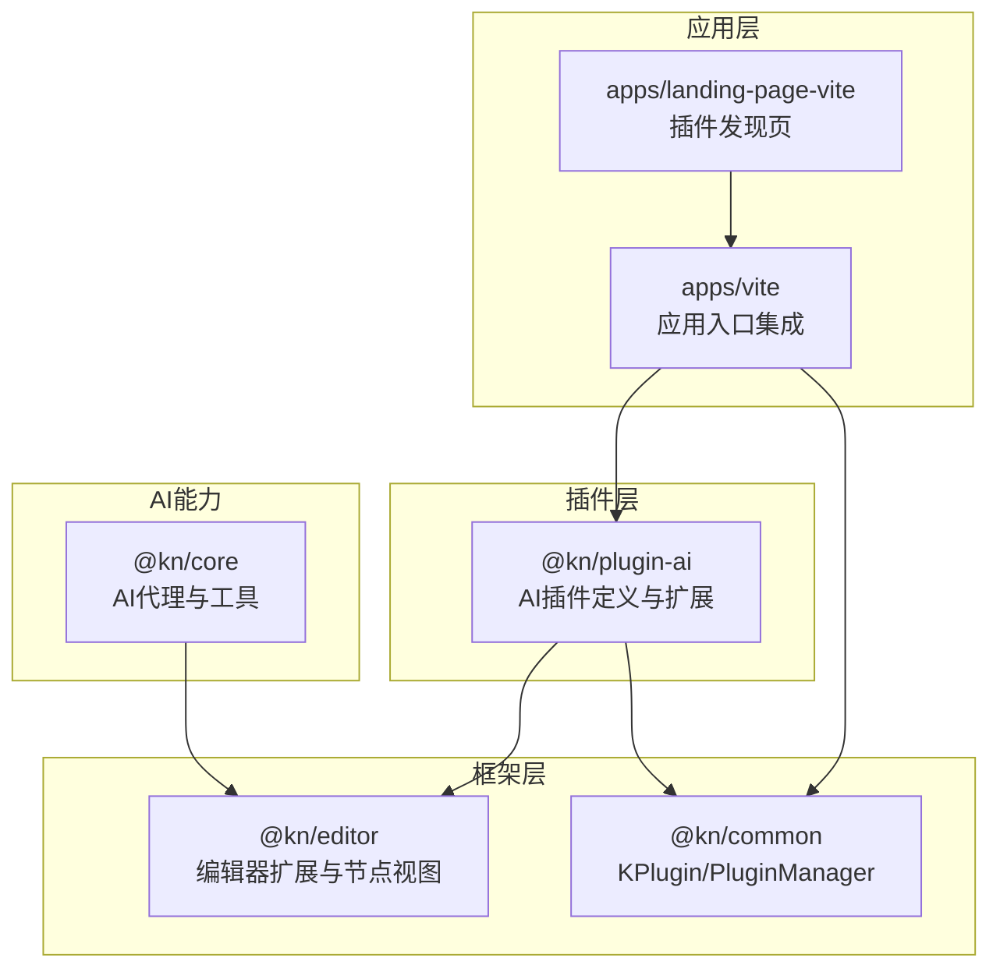
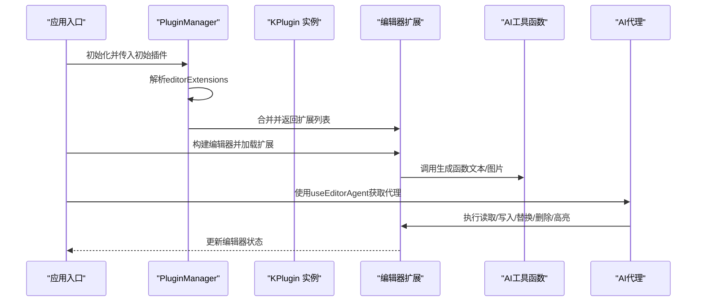
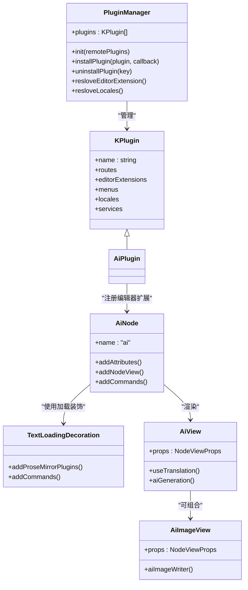
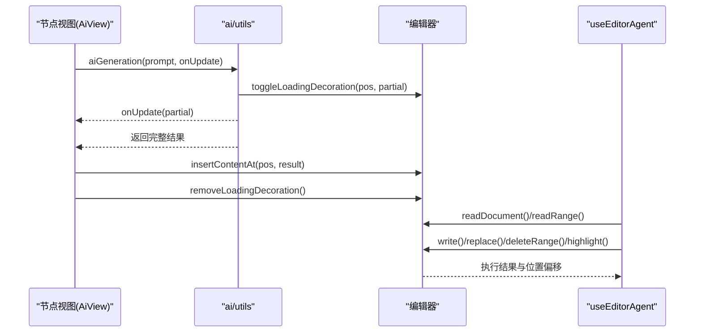
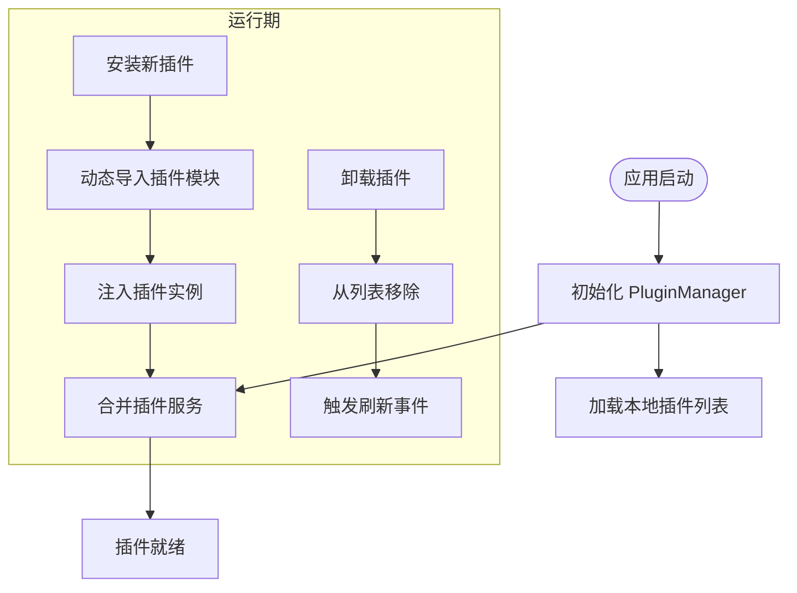
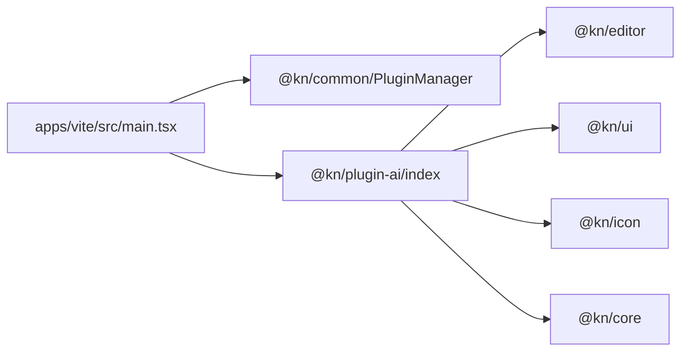

# AI插件集成

<cite>
**本文引用的文件**
- [packages/plugin-ai/src/index.tsx](file://packages/plugin-ai/src/index.tsx)
- [packages/plugin-ai/src/ai/ai.ts](file://packages/plugin-ai/src/ai/ai.ts)
- [packages/plugin-ai/src/ai/AiView.tsx](file://packages/plugin-ai/src/ai/AiView.tsx)
- [packages/plugin-ai/src/ai/AiImageView.tsx](file://packages/plugin-ai/src/ai/AiImageView.tsx)
- [packages/plugin-ai/src/ai/utils.ts](file://packages/plugin-ai/src/ai/utils.ts)
- [packages/plugin-ai/src/ai/text-loading.tsx](file://packages/plugin-ai/src/ai/text-loading.tsx)
- [packages/plugin-ai/package.json](file://packages/plugin-ai/package.json)
- [packages/common/src/core/PluginManager.ts](file://packages/common/src/core/PluginManager.ts)
- [packages/common/src/core/types.ts](file://packages/common/src/core/types.ts)
- [packages/common/src/locales/supported-language.ts](file://packages/common/src/locales/supported-language.ts)
- [packages/core/src/ai/use-agent.tsx](file://packages/core/src/ai/use-agent.tsx)
- [packages/core/src/ai/ai-utils.ts](file://packages/core/src/ai/ai-utils.ts)
- [packages/editor/src/index.ts](file://packages/editor/src/index.ts)
- [apps/vite/src/main.tsx](file://apps/vite/src/main.tsx)
- [apps/landing-page-vite/src/pages/Plugins/index.tsx](file://apps/landing-page-vite/src/pages/Plugins/index.tsx)
- [packages/core/src/components/PluginHub/index.tsx](file://packages/core/src/components/PluginHub/index.tsx)
</cite>

## 目录
1. [简介](#简介)
2. [项目结构](#项目结构)
3. [核心组件](#核心组件)
4. [架构总览](#架构总览)
5. [详细组件分析](#详细组件分析)
6. [依赖关系分析](#依赖关系分析)
7. [性能考量](#性能考量)
8. [故障排除指南](#故障排除指南)
9. [结论](#结论)
10. [附录](#附录)

## 简介
本文件面向希望在现有项目中集成AI插件的开发者，系统性阐述AI插件的集成方式与最佳实践，涵盖以下主题：
- 插件配置与注册（编辑器扩展、菜单、路由、国际化）
- AI代理的使用方法与工具函数应用
- 插件生命周期管理（安装、卸载、动态加载）
- 具体集成示例（如何在现有项目中添加AI插件、配置参数、处理事件）
- 性能优化建议与常见问题排查

## 项目结构
AI插件位于独立包中，通过统一的插件框架进行注册与管理。核心目录与职责如下：
- 插件定义与注册：packages/plugin-ai
- 插件框架与生命周期：packages/common
- 编辑器扩展与节点视图：packages/editor
- 应用侧集成入口：apps/vite
- 国际化与语言支持：packages/common/locales
- AI代理与工具函数：packages/core

图表来源
- [packages/plugin-ai/src/index.tsx](file://packages/plugin-ai/src/index.tsx#L1-L35)
- [packages/common/src/core/PluginManager.ts](file://packages/common/src/core/PluginManager.ts#L1-L170)
- [packages/editor/src/index.ts](file://packages/editor/src/index.ts#L1-L23)
- [apps/vite/src/main.tsx](file://apps/vite/src/main.tsx#L1-L21)
- [packages/core/src/ai/use-agent.tsx](file://packages/core/src/ai/use-agent.tsx#L1-L192)

章节来源
- [packages/plugin-ai/src/index.tsx](file://packages/plugin-ai/src/index.tsx#L1-L35)
- [packages/common/src/core/PluginManager.ts](file://packages/common/src/core/PluginManager.ts#L1-L170)
- [packages/editor/src/index.ts](file://packages/editor/src/index.ts#L1-L23)
- [apps/vite/src/main.tsx](file://apps/vite/src/main.tsx#L1-L21)

## 核心组件
- 插件基类与配置
  - KPlugin<T extends PluginConfig>：封装插件名称、编辑器扩展、菜单、路由、服务与国际化等配置项。
  - PluginConfig：标准化插件配置接口，包含 name、status、editorExtension、locales 等字段。
- 插件管理器
  - PluginManager：负责插件初始化、远程插件动态加载、合并服务、解析路由/菜单/编辑器扩展、卸载与安装。
- AI插件
  - ai 插件实例：声明编辑器扩展与多语言资源，作为统一入口被应用集成。

章节来源
- [packages/common/src/core/PluginManager.ts](file://packages/common/src/core/PluginManager.ts#L1-L170)
- [packages/common/src/core/types.ts](file://packages/common/src/core/types.ts#L1-L4)
- [packages/plugin-ai/src/index.tsx](file://packages/plugin-ai/src/index.tsx#L1-L35)

## 架构总览
AI插件通过“插件定义—插件管理—编辑器扩展—AI代理/工具”的分层架构工作：
- 插件定义层：在插件包内定义编辑器扩展（如AI节点、加载装饰）与国际化资源。
- 插件管理层：应用启动时将插件实例注入PluginManager，解析其编辑器扩展并合并到全局扩展集合。
- 编辑器扩展层：编辑器在渲染节点视图时，调用AI工具函数进行内容生成或图片生成。
- AI代理层：提供基于工具循环的智能代理，封装读取/写入/替换/删除/高亮等操作，便于上层业务调用。

图表来源
- [packages/common/src/core/PluginManager.ts](file://packages/common/src/core/PluginManager.ts#L77-L170)
- [packages/plugin-ai/src/index.tsx](file://packages/plugin-ai/src/index.tsx#L1-L35)
- [packages/plugin-ai/src/ai/utils.ts](file://packages/plugin-ai/src/ai/utils.ts#L1-L58)
- [packages/core/src/ai/use-agent.tsx](file://packages/core/src/ai/use-agent.tsx#L1-L192)

## 详细组件分析

### AI插件定义与国际化
- 插件实例
  - 名称与状态：通过构造函数传入 name/status。
  - 编辑器扩展：editorExtension 指向 AIExtension（由插件内部导出），用于在编辑器中注册AI节点与装饰。
  - 国际化资源：locales 中包含英文与中文翻译键值，供翻译钩子使用。
- 国际化支持
  - supportedLngs 定义了可用语言列表（en/zh）。
  - 插件内的翻译键名遵循约定，例如“ai.title”“ai.generate”。

章节来源
- [packages/plugin-ai/src/index.tsx](file://packages/plugin-ai/src/index.tsx#L1-L35)
- [packages/common/src/locales/supported-language.ts](file://packages/common/src/locales/supported-language.ts#L1-L2)

### 编辑器扩展与节点视图
- AI节点（ai.ts）
  - 节点类型：块级节点，支持属性 prompt/generateDate。
  - 存储：underEditorSelection 用于记录当前选择上下文。
  - 视图：通过 ReactNodeViewRenderer 渲染 AiView。
  - 命令：提供 insertAIBlock 以插入空AI块。
- 文本加载装饰（text-loading.tsx）
  - 自定义扩展：通过 ProseMirror 插件在指定位置插入加载小部件。
  - 命令：toggleLoadingDecoration/removeLoadingDecoration 控制加载状态。
- 节点视图组件
  - AiView：可编辑模式下显示提示语输入框与生成按钮；调用 aiGeneration 流式更新编辑器内容；完成后更新生成时间戳。
  - AiImageView：可编辑模式下显示图片预览与生成按钮；调用 aiImageWriter 获取图片URL并更新节点属性。

图表来源
- [packages/common/src/core/PluginManager.ts](file://packages/common/src/core/PluginManager.ts#L1-L170)
- [packages/plugin-ai/src/index.tsx](file://packages/plugin-ai/src/index.tsx#L1-L35)
- [packages/plugin-ai/src/ai/ai.ts](file://packages/plugin-ai/src/ai/ai.ts#L1-L55)
- [packages/plugin-ai/src/ai/text-loading.tsx](file://packages/plugin-ai/src/ai/text-loading.tsx#L1-L146)
- [packages/plugin-ai/src/ai/AiView.tsx](file://packages/plugin-ai/src/ai/AiView.tsx#L1-L76)
- [packages/plugin-ai/src/ai/AiImageView.tsx](file://packages/plugin-ai/src/ai/AiImageView.tsx#L1-L69)

章节来源
- [packages/plugin-ai/src/ai/ai.ts](file://packages/plugin-ai/src/ai/ai.ts#L1-L55)
- [packages/plugin-ai/src/ai/text-loading.tsx](file://packages/plugin-ai/src/ai/text-loading.tsx#L1-L146)
- [packages/plugin-ai/src/ai/AiView.tsx](file://packages/plugin-ai/src/ai/AiView.tsx#L1-L76)
- [packages/plugin-ai/src/ai/AiImageView.tsx](file://packages/plugin-ai/src/ai/AiImageView.tsx#L1-L69)

### AI工具函数与代理
- 工具函数（ai/utils.ts）
  - aiText：基于当前选区调用流式生成，删除选区并在原位置逐步插入生成内容，最后移除加载装饰。
  - aiGeneration：返回可迭代的文本流，逐段回调 onUpdate，最终返回完整结果。
  - aiImageWriter：调用外部图像生成接口，返回JSON数据（含错误与URL）。
- AI代理（use-agent.tsx）
  - 基于 ToolLoopAgent 封装工具集：readRange/readDocument/write/replace/deleteRange/highlight。
  - 通过 AppContext 获取 PluginManager 与编辑器实例，提供安全的位置/范围校验与偏移计算。
  - 在 onFinish 阶段重置偏移缓存，避免后续操作累积误差。

图表来源
- [packages/plugin-ai/src/ai/AiView.tsx](file://packages/plugin-ai/src/ai/AiView.tsx#L1-L76)
- [packages/plugin-ai/src/ai/utils.ts](file://packages/plugin-ai/src/ai/utils.ts#L1-L58)
- [packages/core/src/ai/use-agent.tsx](file://packages/core/src/ai/use-agent.tsx#L1-L192)

章节来源
- [packages/plugin-ai/src/ai/utils.ts](file://packages/plugin-ai/src/ai/utils.ts#L1-L58)
- [packages/core/src/ai/use-agent.tsx](file://packages/core/src/ai/use-agent.tsx#L1-L192)

### 插件生命周期管理
- 初始化
  - 应用启动时将默认插件与各功能插件（含 @kn/plugin-ai）作为数组传入 App 组件。
  - PluginManager.init 支持远程插件动态加载，合并本地与远程插件的服务与扩展。
- 安装/卸载
  - installPlugin：按资源路径动态导入插件模块，注入到已加载插件列表并合并服务。
  - uninstallPlugin：移除指定插件并触发刷新事件。
- 解析与合并
  - resloveEditorExtension/resloveLocales/resloveRoutes/resloveMenus：分别从所有插件中聚合编辑器扩展、语言包、路由与菜单。

图表来源
- [apps/vite/src/main.tsx](file://apps/vite/src/main.tsx#L1-L21)
- [packages/common/src/core/PluginManager.ts](file://packages/common/src/core/PluginManager.ts#L77-L170)

章节来源
- [apps/vite/src/main.tsx](file://apps/vite/src/main.tsx#L1-L21)
- [packages/common/src/core/PluginManager.ts](file://packages/common/src/core/PluginManager.ts#L1-L170)

## 依赖关系分析
- 包依赖
  - @kn/plugin-ai 依赖 @kn/common/@kn/editor/@kn/ui/@kn/icon/@kn/core 等工作区包。
- 运行时依赖
  - 插件通过 KPlugin 注入 editorExtension，由 PluginManager 合并后交由编辑器加载。
  - 应用入口在 main.tsx 中集中引入并传递插件数组，确保编辑器扩展生效。

图表来源
- [apps/vite/src/main.tsx](file://apps/vite/src/main.tsx#L1-L21)
- [packages/plugin-ai/package.json](file://packages/plugin-ai/package.json#L1-L31)

章节来源
- [packages/plugin-ai/package.json](file://packages/plugin-ai/package.json#L1-L31)
- [apps/vite/src/main.tsx](file://apps/vite/src/main.tsx#L1-L21)

## 性能考量
- 流式渲染与增量更新
  - 文本生成采用流式迭代，边生成边更新编辑器内容，减少一次性大块渲染开销。
- 加载装饰与节流
  - 使用自定义装饰在光标位置插入轻量级加载指示器，避免全屏遮罩带来的重绘压力。
- 位置偏移与批量操作
  - 代理在多次写入/替换后会累积偏移，需在 onFinish 阶段重置，防止后续操作位置错乱。
- 图片生成异步与错误处理
  - 图片生成接口调用应设置超时与重试策略，UI层对错误进行提示并回退到占位图。

## 故障排除指南
- 插件未生效
  - 检查应用入口是否将 @kn/plugin-ai 注入插件数组。
  - 确认 PluginManager.init 是否正确合并 editorExtensions。
- 编辑器扩展不加载
  - 核对 AIExtension 是否正确导出并与 KPlugin.editorExtension 对齐。
  - 确保 resolveExtesions/use-editor-extension 的解析链路正常。
- 文本生成无响应
  - 检查 ai/utils 中的流式生成接口是否可达，确认网络与鉴权头配置。
  - 确认 toggleLoadingDecoration/removeLoadingDecoration 命令是否被正确派发。
- 图片生成失败
  - 检查 aiImageWriter 的请求地址与鉴权头，确认返回JSON结构与错误字段。
  - UI层对错误进行 toast 提示并保留上次成功URL。
- 国际化未显示
  - 确认 locales 键名与 supportedLngs 列表一致，翻译钩子是否正确使用 t 函数。

章节来源
- [apps/vite/src/main.tsx](file://apps/vite/src/main.tsx#L1-L21)
- [packages/plugin-ai/src/ai/utils.ts](file://packages/plugin-ai/src/ai/utils.ts#L1-L58)
- [packages/plugin-ai/src/ai/AiImageView.tsx](file://packages/plugin-ai/src/ai/AiImageView.tsx#L1-L69)
- [packages/common/src/locales/supported-language.ts](file://packages/common/src/locales/supported-language.ts#L1-L2)

## 结论
通过统一的插件框架与清晰的分层设计，AI插件能够以最小侵入的方式集成到编辑器中。开发者只需在插件包中定义编辑器扩展与国际化资源，并在应用入口注入插件实例，即可获得完整的AI文本/图片生成功能。配合AI代理与工具函数，可进一步实现复杂编辑场景下的自动化操作。

## 附录

### 集成步骤示例（在现有项目中添加AI插件）
- 安装依赖
  - 在项目中安装 @kn/plugin-ai 与相关工作区包。
- 引入插件
  - 在应用入口文件中引入 ai 插件实例，并将其加入插件数组。
- 启动应用
  - 启动后，PluginManager 将自动解析并加载 AI 插件的编辑器扩展。
- 使用AI功能
  - 在编辑器中插入AI节点，输入提示语并点击生成，即可看到流式渲染效果。
  - 可通过代理工具集对文档进行读取、写入、替换与高亮等操作。

章节来源
- [packages/plugin-ai/src/index.tsx](file://packages/plugin-ai/src/index.tsx#L1-L35)
- [apps/vite/src/main.tsx](file://apps/vite/src/main.tsx#L1-L21)

### 插件开发最佳实践
- 插件配置
  - 明确 name/status，合理拆分 editorExtension/menus/routes/locales/services。
- 国际化
  - 使用统一的翻译键命名规范，确保 en/zh 两套资源齐全。
- 编辑器扩展
  - 节点属性尽量轻量化，避免在 attributes 中存储大对象。
  - 使用 ReactNodeViewRenderer 渲染视图，保持与编辑器状态同步。
- 工具函数
  - 对外暴露稳定API，内部做好错误捕获与回退逻辑。
- 代理工具
  - 对位置/范围进行严格校验，避免越界写入导致文档损坏。
  - 在批量操作后及时重置偏移缓存，保证后续操作准确。

### 插件市场与发现页
- 插件发现页提供插件列表、评分、下载量与分类筛选，支持跳转至安装流程。
- 插件Hub组件预留扩展空间，未来可接入插件商店与安装中心。

章节来源
- [apps/landing-page-vite/src/pages/Plugins/index.tsx](file://apps/landing-page-vite/src/pages/Plugins/index.tsx#L1-L225)
- [packages/core/src/components/PluginHub/index.tsx](file://packages/core/src/components/PluginHub/index.tsx#L1-L6)