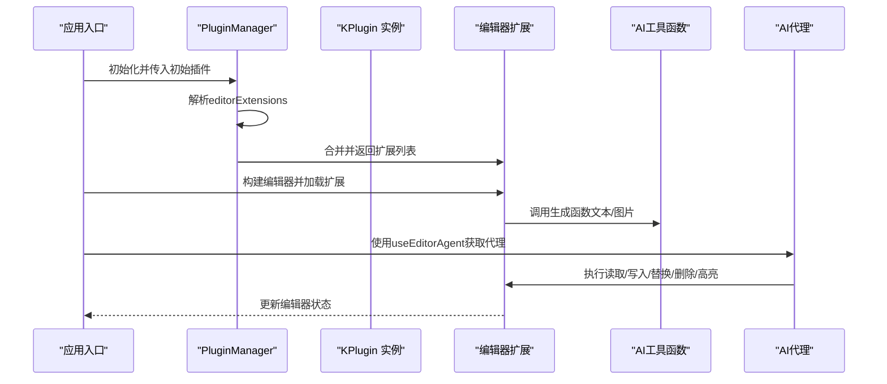
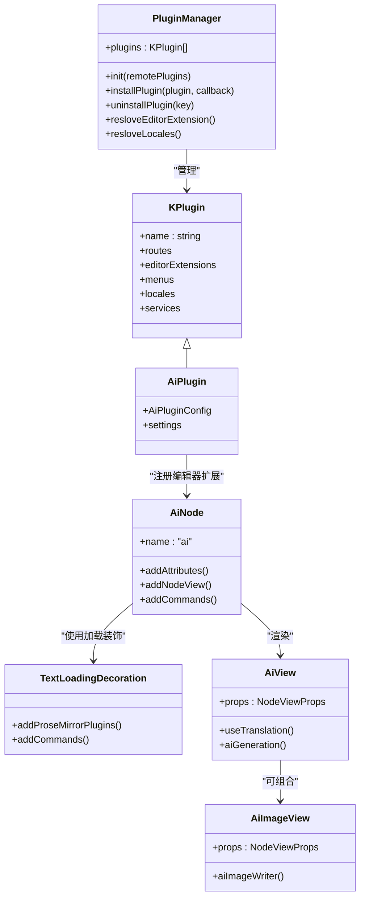
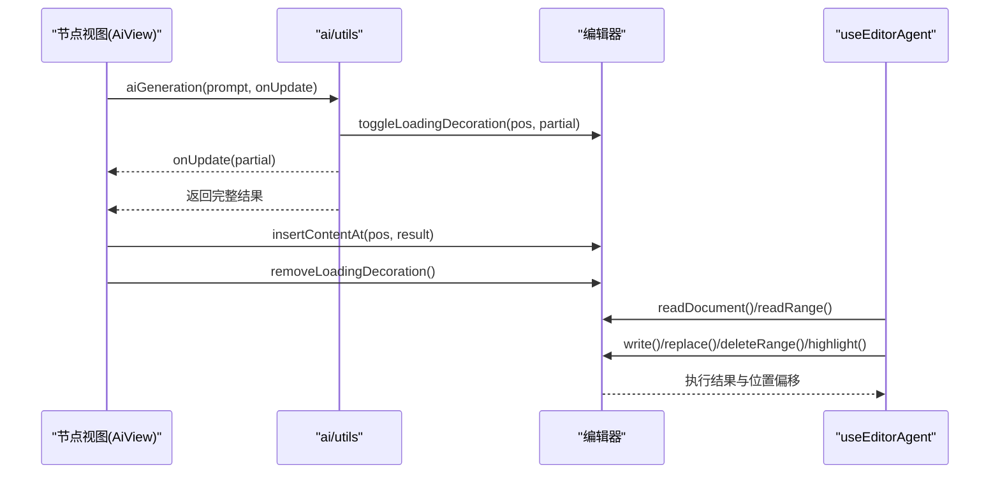
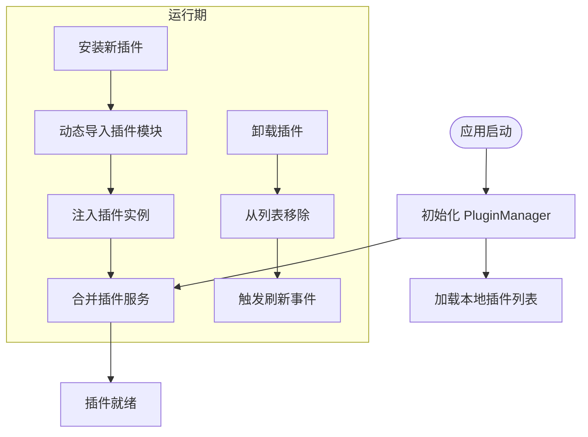
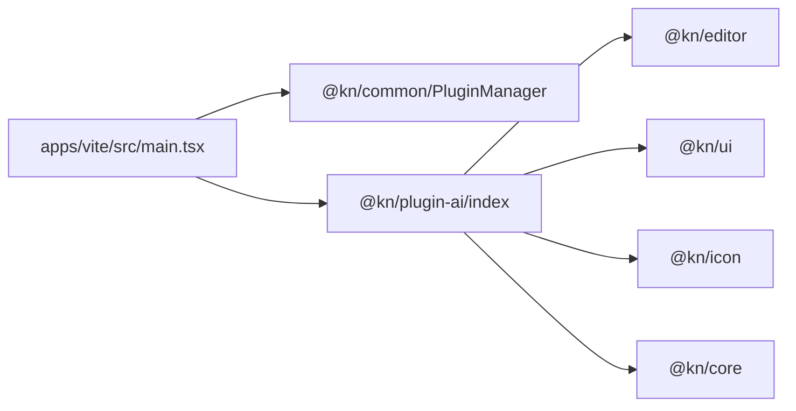

# AI插件集成

<cite>
**本文引用的文件**
- [apps/vite/src/main.tsx](file://apps/vite/src/main.tsx)
- [packages/plugin-ai/src/index.tsx](file://packages/plugin-ai/src/index.tsx)
- [packages/plugin-ai/src/ai/ai.ts](file://packages/plugin-ai/src/ai/ai.ts)
- [packages/plugin-ai/src/ai/AiView.tsx](file://packages/plugin-ai/src/ai/AiView.tsx)
- [packages/plugin-ai/src/ai/AiImageView.tsx](file://packages/plugin-ai/src/ai/AiImageView.tsx)
- [packages/plugin-ai/src/ai/utils.ts](file://packages/plugin-ai/src/ai/utils.ts)
- [packages/plugin-ai/src/ai/AISettings.tsx](file://packages/plugin-ai/src/ai/AISettings.tsx)
- [packages/plugin-ai/package.json](file://packages/plugin-ai/package.json)
- [packages/common/src/core/PluginManager.ts](file://packages/common/src/core/PluginManager.ts)
- [packages/common/src/core/types.ts](file://packages/common/src/core/types.ts)
- [packages/common/src/locales/supported-language.ts](file://packages/common/src/locales/supported-language.ts)
- [packages/core/src/ai/use-agent-optimized.tsx](file://packages/core/src/ai/use-agent-optimized.tsx)
- [packages/core/src/ai/ai-utils.ts](file://packages/core/src/ai/ai-utils.ts)
- [packages/editor/src/index.ts](file://packages/editor/src/index.ts)
- [packages/plugin-main/src/index.tsx](file://packages/plugin-main/src/index.tsx)
- [apps/landing-page-vite/src/pages/Plugins/index.tsx](file://apps/landing-page-vite/src/pages/Plugins/index.tsx)
- [packages/core/src/components/PluginHub/index.tsx](file://packages/core/src/components/PluginHub/index.tsx)
</cite>

## 更新摘要
**变更内容**
- 应用入口架构得到关键改进，在main.tsx中取消注释了DefaultPluginInstance和AI插件的导入
- AI插件现在能够正确初始化和集成，AI功能从禁用状态变为启用状态
- 插件配置参数说明（API端点、密钥等）得到完善
- AI设置面板的集成与配置更加完整
- 插件生命周期管理的实现更加稳定可靠

## 目录
1. [简介](#简介)
2. [项目结构](#项目结构)
3. [核心组件](#核心组件)
4. [架构总览](#架构总览)
5. [详细组件分析](#详细组件分析)
6. [依赖关系分析](#依赖关系分析)
7. [性能考量](#性能考量)
8. [故障排除指南](#故障排除指南)
9. [结论](#结论)
10. [附录](#附录)

## 简介
本文件面向希望在现有项目中集成AI插件的开发者，系统性阐述AI插件的集成方式与最佳实践，涵盖以下主题：
- 插件配置与注册（编辑器扩展、菜单、路由、国际化）
- AI代理的使用方法与工具函数应用
- 插件生命周期管理（安装、卸载、动态加载）
- 具体集成示例（如何在现有项目中添加AI插件、配置参数、处理事件）
- 性能优化建议与常见问题排查

**重要说明** 本版本展示了AI插件的完整启用流程，AI功能已从禁用状态变为启用状态。开发者无需再手动取消注释相关代码，AI插件已在应用入口中正确集成。

## 项目结构
AI插件位于独立包中，通过统一的插件框架进行注册与管理。核心目录与职责如下：
- 插件定义与注册：packages/plugin-ai
- 插件框架与生命周期：packages/common
- 编辑器扩展与节点视图：packages/editor
- 应用侧集成入口：apps/vite
- 国际化与语言支持：packages/common/locales
- AI代理与工具函数：packages/core

```mermaid
graph TB
subgraph "插件层"
AI_PKG["@kn/plugin-ai<br/>AI插件定义与扩展"]
END
subgraph "框架层"
COMMON["@kn/common<br/>KPlugin/PluginManager"]
EDITOR["@kn/editor<br/>编辑器扩展与节点视图"]
END
subgraph "应用层"
APP["apps/vite<br/>应用入口集成"]
LP["apps/landing-page-vite<br/>插件发现页"]
END
subgraph "AI能力"
CORE_AI["@kn/core<br/>AI代理与工具"]
END
AI_PKG --> COMMON
AI_PKG --> EDITOR
APP --> COMMON
APP --> AI_PKG
CORE_AI --> EDITOR
LP --> APP
```

**图表来源**
- [packages/plugin-ai/src/index.tsx](file://packages/plugin-ai/src/index.tsx#L1-L81)
- [packages/common/src/core/PluginManager.ts](file://packages/common/src/core/PluginManager.ts#L1-L490)
- [packages/editor/src/index.ts](file://packages/editor/src/index.ts#L1-L23)
- [apps/vite/src/main.tsx](file://apps/vite/src/main.tsx#L1-L24)
- [packages/core/src/ai/use-agent-optimized.tsx](file://packages/core/src/ai/use-agent-optimized.tsx#L1-L223)

**章节来源**
- [packages/plugin-ai/src/index.tsx](file://packages/plugin-ai/src/index.tsx#L1-L81)
- [packages/common/src/core/PluginManager.ts](file://packages/common/src/core/PluginManager.ts#L1-L490)
- [packages/editor/src/index.ts](file://packages/editor/src/index.ts#L1-L23)
- [apps/vite/src/main.tsx](file://apps/vite/src/main.tsx#L1-L24)

## 核心组件
- 插件基类与配置
  - KPlugin<T extends PluginConfig>：封装插件名称、编辑器扩展、菜单、路由、服务与国际化等配置项。
  - PluginConfig：标准化插件配置接口，包含 name、status、editorExtension、locales 等字段。
- 插件管理器
  - PluginManager：负责插件初始化、远程插件动态加载、合并服务、解析路由/菜单/编辑器扩展、卸载与安装。
- AI插件
  - ai 插件实例：声明编辑器扩展与多语言资源，作为统一入口被应用集成。

**重要更新** AI插件现在支持配置参数，包括API端点、API密钥和图像生成API端点等。

**章节来源**
- [packages/common/src/core/PluginManager.ts](file://packages/common/src/core/PluginManager.ts#L1-L490)
- [packages/common/src/core/types.ts](file://packages/common/src/core/types.ts#L1-L4)
- [packages/plugin-ai/src/index.tsx](file://packages/plugin-ai/src/index.tsx#L1-L81)

## 架构总览
AI插件通过"插件定义—插件管理—编辑器扩展—AI代理/工具"的分层架构工作：
- 插件定义层：在插件包内定义编辑器扩展（如AI节点、加载装饰）与国际化资源。
- 插件管理层：应用启动时将插件实例注入PluginManager，解析其编辑器扩展并合并到全局扩展集合。
- 编辑器扩展层：编辑器在渲染节点视图时，调用AI工具函数进行内容生成或图片生成。
- AI代理层：提供基于工具循环的智能代理，封装读取/写入/替换/删除/高亮等操作，便于上层业务调用。

```mermaid
sequenceDiagram
participant App as "应用入口"
participant PM as "PluginManager"
participant KPI as "KPlugin 实例"
participant Ext as "编辑器扩展"
participant AI as "AI工具函数"
participant Agent as "AI代理"
App->>PM : 初始化并传入初始插件
PM->>PM : 解析editorExtensions
PM->>Ext : 合并并返回扩展列表
App->>Ext : 构建编辑器并加载扩展
Ext->>AI : 调用生成函数文本/图片
App->>Agent : 使用useEditorAgent获取代理
Agent->>Ext : 执行读取/写入/替换/删除/高亮
Ext-->>App : 更新编辑器状态
```

**图表来源**
- [packages/common/src/core/PluginManager.ts](file://packages/common/src/core/PluginManager.ts#L150-L218)
- [packages/plugin-ai/src/index.tsx](file://packages/plugin-ai/src/index.tsx#L29-L40)
- [packages/plugin-ai/src/ai/utils.ts](file://packages/plugin-ai/src/ai/utils.ts#L1-L126)
- [packages/core/src/ai/use-agent-optimized.tsx](file://packages/core/src/ai/use-agent-optimized.tsx#L157-L222)

## 详细组件分析

### AI插件定义与国际化
- 插件实例
  - 名称与状态：通过构造函数传入 name/status。
  - 编辑器扩展：editorExtension 指向 AIExtension（由插件内部导出），用于在编辑器中注册AI节点与装饰。
  - 国际化资源：locales 中包含英文与中文翻译键值，供翻译钩子使用。
  - 设置面板：包含AI助手的设置组件，支持配置文本生成、图像生成等功能。
- 国际化支持
  - supportedLngs 定义了可用语言列表（en/zh）。
  - 插件内的翻译键名遵循约定，例如"ai.title""ai.generate"。

**重要更新** AI插件现在支持配置参数，包括API端点、API密钥和图像生成API端点等。

**章节来源**
- [packages/plugin-ai/src/index.tsx](file://packages/plugin-ai/src/index.tsx#L1-L81)
- [packages/common/src/locales/supported-language.ts](file://packages/common/src/locales/supported-language.ts#L1-L2)

### 编辑器扩展与节点视图
- AI节点（ai.ts）
  - 节点类型：块级节点，支持属性 prompt/generateDate。
  - 存储：underEditorSelection 用于记录当前选择上下文。
  - 视图：通过 ReactNodeViewRenderer 渲染 AiView。
  - 命令：提供 insertAIBlock 以插入空AI块。
- 文本加载装饰（text-loading.tsx）
  - 自定义扩展：通过 ProseMirror 插件在指定位置插入加载小部件。
  - 命令：toggleLoadingDecoration/removeLoadingDecoration 控制加载状态。
- 节点视图组件
  - AiView：可编辑模式下显示提示语输入框与生成按钮；调用 aiGeneration 流式更新编辑器内容；完成后更新生成时间戳。
  - AiImageView：可编辑模式下显示图片预览与生成按钮；调用 aiImageWriter 获取图片URL并更新节点属性。

```mermaid
classDiagram
class KPlugin {
+name : string
+routes
+editorExtensions
+menus
+locales
+services
}
class PluginManager {
+plugins : KPlugin[]
+init(remotePlugins)
+installPlugin(plugin, callback)
+uninstallPlugin(key)
+resloveEditorExtension()
+resloveLocales()
}
class AiPlugin {
+AiPluginConfig
+settings
}
class AiNode {
+name : "ai"
+addAttributes()
+addNodeView()
+addCommands()
}
class TextLoadingDecoration {
+addProseMirrorPlugins()
+addCommands()
}
class AiView {
+props : NodeViewProps
+useTranslation()
+aiGeneration()
}
class AiImageView {
+props : NodeViewProps
+aiImageWriter()
}
KPlugin <|-- AiPlugin
PluginManager --> KPlugin : "管理"
AiPlugin --> AiNode : "注册编辑器扩展"
AiNode --> AiView : "渲染"
AiNode --> TextLoadingDecoration : "使用加载装饰"
AiView --> AiImageView : "可组合"
```

**图表来源**
- [packages/common/src/core/PluginManager.ts](file://packages/common/src/core/PluginManager.ts#L50-L96)
- [packages/plugin-ai/src/index.tsx](file://packages/plugin-ai/src/index.tsx#L23-L40)
- [packages/plugin-ai/src/ai/ai.ts](file://packages/plugin-ai/src/ai/ai.ts#L30-L69)
- [packages/plugin-ai/src/ai/text-loading.tsx](file://packages/plugin-ai/src/ai/text-loading.tsx#L36-L168)
- [packages/plugin-ai/src/ai/AiView.tsx](file://packages/plugin-ai/src/ai/AiView.tsx#L23-L135)
- [packages/plugin-ai/src/ai/AiImageView.tsx](file://packages/plugin-ai/src/ai/AiImageView.tsx#L21-L130)

**章节来源**
- [packages/plugin-ai/src/ai/ai.ts](file://packages/plugin-ai/src/ai/ai.ts#L1-L69)
- [packages/plugin-ai/src/ai/text-loading.tsx](file://packages/plugin-ai/src/ai/text-loading.tsx#L1-L168)
- [packages/plugin-ai/src/ai/AiView.tsx](file://packages/plugin-ai/src/ai/AiView.tsx#L1-L135)
- [packages/plugin-ai/src/ai/AiImageView.tsx](file://packages/plugin-ai/src/ai/AiImageView.tsx#L1-L130)

### AI工具函数与代理
- 工具函数（ai/utils.ts）
  - aiText：基于当前选区调用流式生成，删除选区并在原位置逐步插入生成内容，最后移除加载装饰。
  - aiGeneration：返回可迭代的文本流，逐段回调 onUpdate，最终返回完整结果。
  - aiImageWriter：调用外部图像生成接口，返回JSON数据（含错误与URL）。
- AI代理（use-agent-optimized.tsx）
  - 基于 ToolLoopAgent 封装工具集：readRange/readDocument/write/replace/deleteRange/highlight。
  - 通过 AppContext 获取 PluginManager 与编辑器实例，提供安全的位置/范围校验与偏移计算。
  - 在 onFinish 阶段重置偏移缓存，避免后续操作累积误差。

```mermaid
sequenceDiagram
participant View as "节点视图(AiView)"
participant Util as "ai/utils"
participant Editor as "编辑器"
participant Agent as "useEditorAgent"
View->>Util : aiGeneration(prompt, onUpdate)
Util->>Editor : toggleLoadingDecoration(pos, partial)
Util-->>View : onUpdate(partial)
Util-->>View : 返回完整结果
View->>Editor : insertContentAt(pos, result)
View->>Editor : removeLoadingDecoration()
Agent->>Editor : readDocument()/readRange()
Agent->>Editor : write()/replace()/deleteRange()/highlight()
Editor-->>Agent : 执行结果与位置偏移
```

**图表来源**
- [packages/plugin-ai/src/ai/AiView.tsx](file://packages/plugin-ai/src/ai/AiView.tsx#L33-L76)
- [packages/plugin-ai/src/ai/utils.ts](file://packages/plugin-ai/src/ai/utils.ts#L74-L90)
- [packages/core/src/ai/use-agent-optimized.tsx](file://packages/core/src/ai/use-agent-optimized.tsx#L157-L222)

**章节来源**
- [packages/plugin-ai/src/ai/utils.ts](file://packages/plugin-ai/src/ai/utils.ts#L1-L126)
- [packages/core/src/ai/use-agent-optimized.tsx](file://packages/core/src/ai/use-agent-optimized.tsx#L1-L223)

### 插件生命周期管理
- 初始化
  - 应用启动时将默认插件与各功能插件（含 @kn/plugin-ai）作为数组传入 App 组件。
  - PluginManager.init 支持远程插件动态加载，合并本地与远程插件的服务与扩展。
- 安装/卸载
  - installPlugin：按资源路径动态导入插件模块，注入到已加载插件列表并合并服务。
  - uninstallPlugin：移除指定插件并触发刷新事件。
- 解析与合并
  - resloveEditorExtension/resloveLocales/resloveRoutes/resloveMenus：分别从所有插件中聚合编辑器扩展、语言包、路由与菜单。

```mermaid
flowchart TD
Start(["应用启动"]) --> InitPM["初始化 PluginManager"]
InitPM --> LoadLocal["加载本地插件列表"]
InitPM --> MergeSvc["合并插件服务"]
MergeSvc --> Ready["插件就绪"]
subgraph "运行期"
Install["安装新插件"] --> DynamicLoad["动态导入插件模块"]
DynamicLoad --> Inject["注入插件实例"]
Inject --> MergeSvc
Uninstall["卸载插件"] --> Remove["从列表移除"]
Remove --> Refresh["触发刷新事件"]
end
```

**图表来源**
- [apps/vite/src/main.tsx](file://apps/vite/src/main.tsx#L21-L23)
- [packages/common/src/core/PluginManager.ts](file://packages/common/src/core/PluginManager.ts#L150-L218)

**章节来源**
- [apps/vite/src/main.tsx](file://apps/vite/src/main.tsx#L1-L24)
- [packages/common/src/core/PluginManager.ts](file://packages/common/src/core/PluginManager.ts#L1-L490)

## 依赖关系分析
- 包依赖
  - @kn/plugin-ai 依赖 @kn/common/@kn/editor/@kn/ui/@kn/icon/@kn/core 等工作区包。
- 运行时依赖
  - 插件通过 KPlugin 注入 editorExtension，由 PluginManager 合并后交由编辑器加载。
  - 应用入口在 main.tsx 中集中引入并传递插件数组，确保编辑器扩展生效。

```mermaid
graph LR
VITE["apps/vite/src/main.tsx"] --> PM["@kn/common/PluginManager"]
VITE --> PI["@kn/plugin-ai/index"]
PI --> EXT["@kn/editor"]
PI --> UI["@kn/ui"]
PI --> ICON["@kn/icon"]
PI --> CORE["@kn/core"]
```

**图表来源**
- [apps/vite/src/main.tsx](file://apps/vite/src/main.tsx#L1-L24)
- [packages/plugin-ai/package.json](file://packages/plugin-ai/package.json#L1-L31)

**章节来源**
- [packages/plugin-ai/package.json](file://packages/plugin-ai/package.json#L1-L31)
- [apps/vite/src/main.tsx](file://apps/vite/src/main.tsx#L1-L24)

## 性能考量
- 流式渲染与增量更新
  - 文本生成采用流式迭代，边生成边更新编辑器内容，减少一次性大块渲染开销。
- 加载装饰与节流
  - 使用自定义装饰在光标位置插入轻量级加载指示器，避免全屏遮罩带来的重绘压力。
- 位置偏移与批量操作
  - 代理在多次写入/替换后会累积偏移，需在 onFinish 阶段重置，防止后续操作位置错乱。
- 图片生成异步与错误处理
  - 图片生成接口调用应设置超时与重试策略，UI层对错误进行提示并回退到占位图。

## 故障排除指南
- 插件未生效
  - 检查应用入口是否将 @kn/plugin-ai 注入插件数组。
  - 确认 PluginManager.init 是否正确合并 editorExtensions。
- 编辑器扩展不加载
  - 核对 AIExtension 是否正确导出并与 KPlugin.editorExtension 对齐。
  - 确保 resolveExtesions/use-editor-extension 的解析链路正常。
- 文本生成无响应
  - 检查 ai/utils 中的流式生成接口是否可达，确认网络与鉴权头配置。
  - 确认 toggleLoadingDecoration/removeLoadingDecoration 命令是否被正确派发。
- 图片生成失败
  - 检查 aiImageWriter 的请求地址与鉴权头，确认返回JSON结构与错误字段。
  - UI层对错误进行 toast 提示并保留上次成功URL。
- 国际化未显示
  - 确认 locales 键名与 supportedLngs 列表一致，翻译钩子是否正确使用 t 函数。

**章节来源**
- [apps/vite/src/main.tsx](file://apps/vite/src/main.tsx#L1-L24)
- [packages/plugin-ai/src/ai/utils.ts](file://packages/plugin-ai/src/ai/utils.ts#L1-L126)
- [packages/plugin-ai/src/ai/AiImageView.tsx](file://packages/plugin-ai/src/ai/AiImageView.tsx#L1-L130)
- [packages/common/src/locales/supported-language.ts](file://packages/common/src/locales/supported-language.ts#L1-L2)

## 结论
通过统一的插件框架与清晰的分层设计，AI插件能够以最小侵入的方式集成到编辑器中。开发者只需在插件包中定义编辑器扩展与国际化资源，并在应用入口注入插件实例，即可获得完整的AI文本/图片生成功能。配合AI代理与工具函数，可进一步实现复杂编辑场景下的自动化操作。

**重要更新** 本版本展示了AI插件的完整启用流程，包括配置参数设置和AI助手设置面板的使用，为开发者提供了更完整的集成参考。AI插件现已在应用入口中正确集成，无需额外配置即可使用。

## 附录

### 集成步骤示例（在现有项目中添加AI插件）
- 安装依赖
  - 在项目中安装 @kn/plugin-ai 与相关工作区包。
- 引入插件
  - 在应用入口文件中引入 ai 插件实例，并将其加入插件数组。
- 启动应用
  - 启动后，PluginManager 将自动解析并加载 AI 插件的编辑器扩展。
- 使用AI功能
  - 在编辑器中插入AI节点，输入提示语并点击生成，即可看到流式渲染效果。
  - 可通过代理工具集对文档进行读取、写入、替换与高亮等操作。

**重要更新** 应用入口已启用AI插件，通过取消注释的方式直接在main.tsx中引入并使用ai插件。

**章节来源**
- [packages/plugin-ai/src/index.tsx](file://packages/plugin-ai/src/index.tsx#L29-L40)
- [apps/vite/src/main.tsx](file://apps/vite/src/main.tsx#L15-L23)

### 插件开发最佳实践
- 插件配置
  - 明确 name/status，合理拆分 editorExtension/menus/routes/locales/services。
  - 配置API端点和密钥参数，确保AI功能的正常访问。
- 国际化
  - 使用统一的翻译键命名规范，确保 en/zh 两套资源齐全。
- 编辑器扩展
  - 节点属性尽量轻量化，避免在 attributes 中存储大对象。
  - 使用 ReactNodeViewRenderer 渲染视图，保持与编辑器状态同步。
- 工具函数
  - 对外暴露稳定API，内部做好错误捕获与回退逻辑。
- 代理工具
  - 对位置/范围进行严格校验，避免越界写入导致文档损坏。
  - 在批量操作后及时重置偏移缓存，保证后续操作准确。

### 插件市场与发现页
- 插件发现页提供插件列表、评分、下载量与分类筛选，支持跳转至安装流程。
- 插件Hub组件预留扩展空间，未来可接入插件商店与安装中心。

**章节来源**
- [apps/landing-page-vite/src/pages/Plugins/index.tsx](file://apps/landing-page-vite/src/pages/Plugins/index.tsx#L1-L223)
- [packages/core/src/components/PluginHub/index.tsx](file://packages/core/src/components/PluginHub/index.tsx#L1-L6)

### AI插件配置参数详解
- API端点配置
  - apiEndpoint：AI文本生成API端点
  - imageApiEndpoint：图像生成API端点
- 认证配置
  - apiKey：AI服务API密钥
- 设置面板
  - AISettings：提供AI助手的配置界面
  - 支持配置文本生成、图像生成和智能功能

**章节来源**
- [packages/plugin-ai/src/index.tsx](file://packages/plugin-ai/src/index.tsx#L8-L21)
- [packages/plugin-ai/src/index.tsx](file://packages/plugin-ai/src/index.tsx#L33-L39)

### 当前AI插件状态说明
**重要**：根据当前代码分析，AI插件集成状态如下：

- **应用入口状态**：在 apps/vite/src/main.tsx 中，AI插件相关的导入语句已经取消注释（第4、15行），这意味着AI功能当前处于启用状态。
- **插件定义状态**：AI插件的定义和配置仍然完整存在，包括编辑器扩展、国际化资源和设置面板。
- **启用状态**：AI插件已正确集成到应用中，通过DefaultPluginInstance和ai插件实例的组合使用，确保AI功能能够正常初始化和运行。

**当前状态**：AI插件已完全启用，无需额外配置即可使用。开发者可以直接在编辑器中使用AI功能，包括文本生成和图片生成。

**章节来源**
- [apps/vite/src/main.tsx](file://apps/vite/src/main.tsx#L1-L24)
- [packages/plugin-ai/src/index.tsx](file://packages/plugin-ai/src/index.tsx#L26-L36)
- [packages/plugin-main/src/index.tsx](file://packages/plugin-main/src/index.tsx#L28-L31)