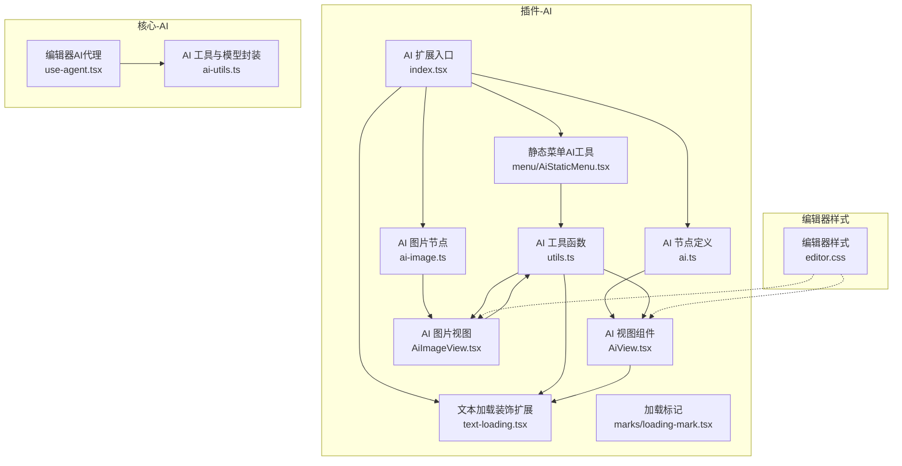
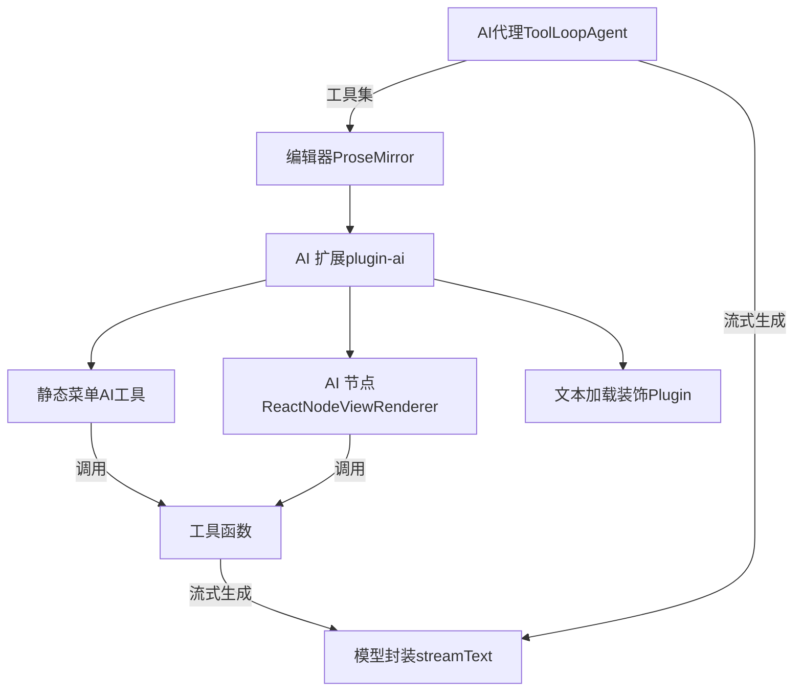
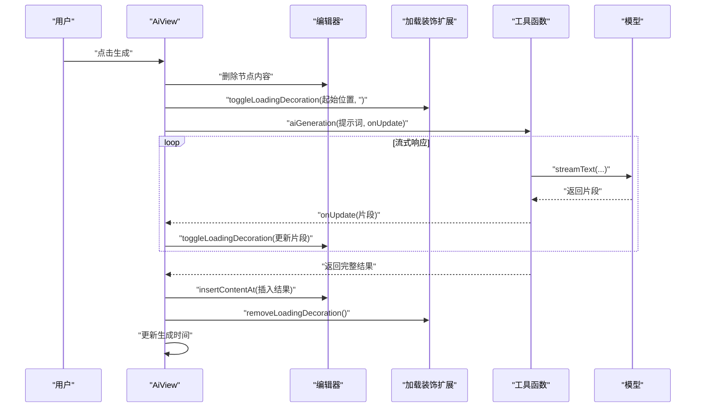
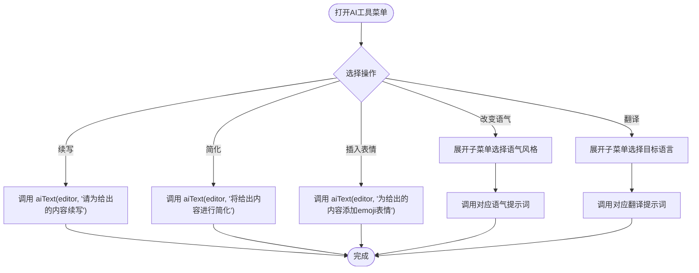
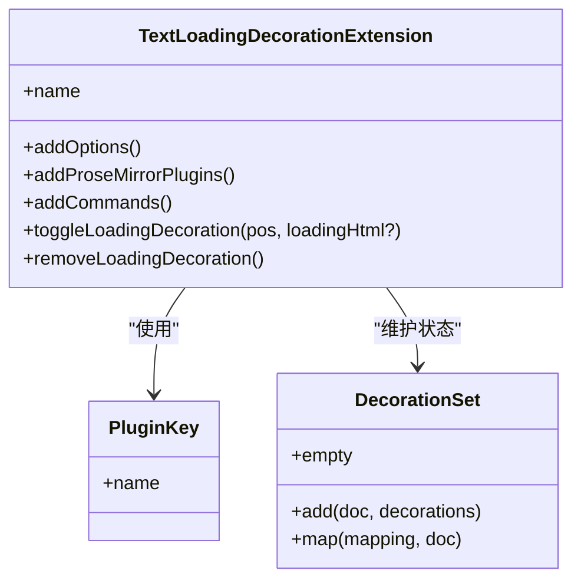
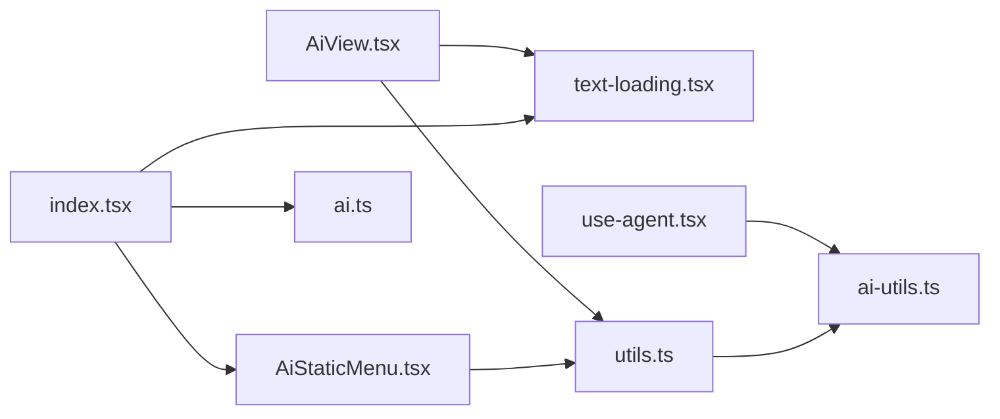

# AI文本生成

<cite>
**本文引用的文件**
- [packages/plugin-ai/src/ai/AiView.tsx](file://packages/plugin-ai/src/ai/AiView.tsx)
- [packages/plugin-ai/src/ai/ai.ts](file://packages/plugin-ai/src/ai/ai.ts)
- [packages/plugin-ai/src/ai/utils.ts](file://packages/plugin-ai/src/ai/utils.ts)
- [packages/plugin-ai/src/ai/text-loading.tsx](file://packages/plugin-ai/src/ai/text-loading.tsx)
- [packages/plugin-ai/src/ai/menu/AiStaticMenu.tsx](file://packages/plugin-ai/src/ai/menu/AiStaticMenu.tsx)
- [packages/plugin-ai/src/ai/ai-image.ts](file://packages/plugin-ai/src/ai/ai-image.ts)
- [packages/plugin-ai/src/ai/AiImageView.tsx](file://packages/plugin-ai/src/ai/AiImageView.tsx)
- [packages/plugin-ai/src/ai/index.tsx](file://packages/plugin-ai/src/ai/index.tsx)
- [packages/plugin-ai/src/ai/marks/loading-mark.tsx](file://packages/plugin-ai/src/ai/marks/loading-mark.tsx)
- [packages/core/src/ai/use-agent.tsx](file://packages/core/src/ai/use-agent.tsx)
- [packages/core/src/ai/ai-utils.ts](file://packages/core/src/ai/ai-utils.ts)
- [packages/editor/src/styles/editor.css](file://packages/editor/src/styles/editor.css)
</cite>

## 目录
1. [引言](#引言)
2. [项目结构](#项目结构)
3. [核心组件](#核心组件)
4. [架构总览](#架构总览)
5. [详细组件分析](#详细组件分析)
6. [依赖关系分析](#依赖关系分析)
7. [性能考虑](#性能考虑)
8. [故障排查指南](#故障排查指南)
9. [结论](#结论)
10. [附录](#附录)

## 引言
本文件围绕“AI文本生成”能力进行系统化技术文档整理，覆盖从编辑器内AI视图组件设计、文本生成流程与结果处理机制，到AI工具集成、参数配置与生成策略。文档同时提供可操作的使用示例、性能优化建议与最佳实践，帮助开发者快速理解并扩展该功能。

## 项目结构
AI文本生成功能主要分布在插件包与核心包中：
- 插件包（plugin-ai）：提供AI块节点、静态菜单、文本流式渲染装饰、图片生成等能力，并通过扩展注册接入编辑器。
- 核心包（core）：提供AI代理（ToolLoopAgent）、工具集与流式文本生成封装，作为底层AI能力支撑。

图表来源
- [packages/plugin-ai/src/ai/index.tsx](file://packages/plugin-ai/src/ai/index.tsx#L1-L42)
- [packages/plugin-ai/src/ai/ai.ts](file://packages/plugin-ai/src/ai/ai.ts#L1-L55)
- [packages/plugin-ai/src/ai/AiView.tsx](file://packages/plugin-ai/src/ai/AiView.tsx#L1-L76)
- [packages/plugin-ai/src/ai/text-loading.tsx](file://packages/plugin-ai/src/ai/text-loading.tsx#L1-L146)
- [packages/plugin-ai/src/ai/menu/AiStaticMenu.tsx](file://packages/plugin-ai/src/ai/menu/AiStaticMenu.tsx#L1-L48)
- [packages/plugin-ai/src/ai/ai-image.ts](file://packages/plugin-ai/src/ai/ai-image.ts#L1-L37)
- [packages/plugin-ai/src/ai/AiImageView.tsx](file://packages/plugin-ai/src/ai/AiImageView.tsx#L1-L69)
- [packages/plugin-ai/src/ai/utils.ts](file://packages/plugin-ai/src/ai/utils.ts#L1-L58)
- [packages/plugin-ai/src/ai/marks/loading-mark.tsx](file://packages/plugin-ai/src/ai/marks/loading-mark.tsx#L1-L36)
- [packages/core/src/ai/use-agent.tsx](file://packages/core/src/ai/use-agent.tsx#L1-L194)
- [packages/core/src/ai/ai-utils.ts](file://packages/core/src/ai/ai-utils.ts#L1-L20)
- [packages/editor/src/styles/editor.css](file://packages/editor/src/styles/editor.css#L1-L39)

章节来源
- [packages/plugin-ai/src/ai/index.tsx](file://packages/plugin-ai/src/ai/index.tsx#L1-L42)
- [packages/plugin-ai/src/ai/ai.ts](file://packages/plugin-ai/src/ai/ai.ts#L1-L55)
- [packages/plugin-ai/src/ai/AiView.tsx](file://packages/plugin-ai/src/ai/AiView.tsx#L1-L76)
- [packages/plugin-ai/src/ai/text-loading.tsx](file://packages/plugin-ai/src/ai/text-loading.tsx#L1-L146)
- [packages/plugin-ai/src/ai/menu/AiStaticMenu.tsx](file://packages/plugin-ai/src/ai/menu/AiStaticMenu.tsx#L1-L48)
- [packages/plugin-ai/src/ai/ai-image.ts](file://packages/plugin-ai/src/ai/ai-image.ts#L1-L37)
- [packages/plugin-ai/src/ai/AiImageView.tsx](file://packages/plugin-ai/src/ai/AiImageView.tsx#L1-L69)
- [packages/plugin-ai/src/ai/utils.ts](file://packages/plugin-ai/src/ai/utils.ts#L1-L58)
- [packages/plugin-ai/src/ai/marks/loading-mark.tsx](file://packages/plugin-ai/src/ai/marks/loading-mark.tsx#L1-L36)
- [packages/core/src/ai/use-agent.tsx](file://packages/core/src/ai/use-agent.tsx#L1-L194)
- [packages/core/src/ai/ai-utils.ts](file://packages/core/src/ai/ai-utils.ts#L1-L20)
- [packages/editor/src/styles/editor.css](file://packages/editor/src/styles/editor.css#L1-L39)

## 核心组件
- AI 节点与视图
  - AI 节点定义了属性（提示词、生成时间）与插入命令；节点视图负责渲染编辑区内的交互控件与生成按钮。
  - 参考路径：[AI 节点定义](file://packages/plugin-ai/src/ai/ai.ts#L1-L55)，[AI 视图组件](file://packages/plugin-ai/src/ai/AiView.tsx#L1-L76)。
- 文本流式渲染装饰
  - 通过 ProseMirror 插件在指定位置插入“生成中”小部件，结合链式命令逐步更新内容，实现边生成边显示。
  - 参考路径：[文本加载装饰扩展](file://packages/plugin-ai/src/ai/text-loading.tsx#L1-L146)。
- AI 工具函数
  - 封装流式文本生成接口，支持在选区或节点内进行增量渲染与最终插入。
  - 参考路径：[AI 工具函数](file://packages/plugin-ai/src/ai/utils.ts#L1-L58)。
- 静态菜单（AI工具）
  - 提供“续写”“简化”“插入表情”“改变语气”“翻译”等常用策略，统一调用工具函数。
  - 参考路径：[静态菜单](file://packages/plugin-ai/src/ai/menu/AiStaticMenu.tsx#L1-L48)。
- AI 扩展入口
  - 注册节点、浮动菜单、斜杠菜单项与加载装饰扩展，形成完整的AI能力接入。
  - 参考路径：[AI 扩展入口](file://packages/plugin-ai/src/ai/index.tsx#L1-L42)。
- 加载标记
  - 定义加载标记的视图与命令，用于在文本范围内设置/取消高亮装饰。
  - 参考路径：[加载标记](file://packages/plugin-ai/src/ai/marks/loading-mark.tsx#L1-L36)。
- 编辑器AI代理与模型封装
  - 提供 ToolLoopAgent 与工具集（读取范围/全文、写入、替换、删除、高亮），并封装流式文本生成。
  - 参考路径：[编辑器AI代理](file://packages/core/src/ai/use-agent.tsx#L1-L194)，[AI 工具与模型封装](file://packages/core/src/ai/ai-utils.ts#L1-L20)。

章节来源
- [packages/plugin-ai/src/ai/ai.ts](file://packages/plugin-ai/src/ai/ai.ts#L1-L55)
- [packages/plugin-ai/src/ai/AiView.tsx](file://packages/plugin-ai/src/ai/AiView.tsx#L1-L76)
- [packages/plugin-ai/src/ai/text-loading.tsx](file://packages/plugin-ai/src/ai/text-loading.tsx#L1-L146)
- [packages/plugin-ai/src/ai/utils.ts](file://packages/plugin-ai/src/ai/utils.ts#L1-L58)
- [packages/plugin-ai/src/ai/menu/AiStaticMenu.tsx](file://packages/plugin-ai/src/ai/menu/AiStaticMenu.tsx#L1-L48)
- [packages/plugin-ai/src/ai/index.tsx](file://packages/plugin-ai/src/ai/index.tsx#L1-L42)
- [packages/plugin-ai/src/ai/marks/loading-mark.tsx](file://packages/plugin-ai/src/ai/marks/loading-mark.tsx#L1-L36)
- [packages/core/src/ai/use-agent.tsx](file://packages/core/src/ai/use-agent.tsx#L1-L194)
- [packages/core/src/ai/ai-utils.ts](file://packages/core/src/ai/ai-utils.ts#L1-L20)

## 架构总览
AI文本生成的整体架构由“编辑器扩展层（plugin-ai）+ 核心AI能力层（core）”构成。编辑器侧负责UI交互、节点管理与装饰渲染；核心侧负责与大模型通信、工具编排与流式输出。

图表来源
- [packages/plugin-ai/src/ai/index.tsx](file://packages/plugin-ai/src/ai/index.tsx#L1-L42)
- [packages/plugin-ai/src/ai/menu/AiStaticMenu.tsx](file://packages/plugin-ai/src/ai/menu/AiStaticMenu.tsx#L1-L48)
- [packages/plugin-ai/src/ai/AiView.tsx](file://packages/plugin-ai/src/ai/AiView.tsx#L1-L76)
- [packages/plugin-ai/src/ai/text-loading.tsx](file://packages/plugin-ai/src/ai/text-loading.tsx#L1-L146)
- [packages/plugin-ai/src/ai/utils.ts](file://packages/plugin-ai/src/ai/utils.ts#L1-L58)
- [packages/core/src/ai/use-agent.tsx](file://packages/core/src/ai/use-agent.tsx#L1-L194)
- [packages/core/src/ai/ai-utils.ts](file://packages/core/src/ai/ai-utils.ts#L1-L20)

## 详细组件分析

### 组件A：AI视图组件（AiView）
- 设计要点
  - 使用节点包装器与内容容器，支持只读与可编辑两种状态下的差异化渲染。
  - 属性持久化：保存提示词与生成时间；生成完成后自动更新。
  - 交互逻辑：点击“生成”按钮后，先清空节点内容，再以流式方式增量插入，最后移除加载装饰。
- 关键流程（序列图）

图表来源
- [packages/plugin-ai/src/ai/AiView.tsx](file://packages/plugin-ai/src/ai/AiView.tsx#L1-L76)
- [packages/plugin-ai/src/ai/text-loading.tsx](file://packages/plugin-ai/src/ai/text-loading.tsx#L1-L146)
- [packages/plugin-ai/src/ai/utils.ts](file://packages/plugin-ai/src/ai/utils.ts#L1-L58)

章节来源
- [packages/plugin-ai/src/ai/AiView.tsx](file://packages/plugin-ai/src/ai/AiView.tsx#L1-L76)
- [packages/plugin-ai/src/ai/text-loading.tsx](file://packages/plugin-ai/src/ai/text-loading.tsx#L1-L146)
- [packages/plugin-ai/src/ai/utils.ts](file://packages/plugin-ai/src/ai/utils.ts#L1-L58)

### 组件B：静态菜单（AiStaticMenu）
- 功能概述
  - 提供一组常用“AI工具”快捷操作，如续写、简化、插入表情、改变语气、翻译等。
  - 每个菜单项均调用统一的工具函数，传入不同的提示词，实现策略化生成。
- 处理流程（流程图）

图表来源
- [packages/plugin-ai/src/ai/menu/AiStaticMenu.tsx](file://packages/plugin-ai/src/ai/menu/AiStaticMenu.tsx#L1-L48)
- [packages/plugin-ai/src/ai/utils.ts](file://packages/plugin-ai/src/ai/utils.ts#L1-L58)

章节来源
- [packages/plugin-ai/src/ai/menu/AiStaticMenu.tsx](file://packages/plugin-ai/src/ai/menu/AiStaticMenu.tsx#L1-L48)
- [packages/plugin-ai/src/ai/utils.ts](file://packages/plugin-ai/src/ai/utils.ts#L1-L58)

### 组件C：文本加载装饰扩展（TextLoadingDecorationExtension）
- 设计要点
  - 通过 ProseMirror 插件在指定位置插入“生成中”小部件，支持自定义HTML片段。
  - 提供命令：切换显示与移除装饰；状态通过 meta 传递，避免不必要的重绘。
- 类图

图表来源
- [packages/plugin-ai/src/ai/text-loading.tsx](file://packages/plugin-ai/src/ai/text-loading.tsx#L1-L146)

章节来源
- [packages/plugin-ai/src/ai/text-loading.tsx](file://packages/plugin-ai/src/ai/text-loading.tsx#L1-L146)

### 组件D：AI工具函数（aiText / aiGeneration）
- aiText
  - 在当前选区内删除原文，插入流式片段，完成后一次性插入完整结果并移除装饰。
- aiGeneration
  - 返回可迭代的文本流，逐段回调更新UI，适合实时渲染场景。
- 关键点
  - 通过“toggleLoadingDecoration”与“removeLoadingDecoration”控制加载状态。
  - 插入时关闭输入规则与粘贴规则，避免格式污染。

章节来源
- [packages/plugin-ai/src/ai/utils.ts](file://packages/plugin-ai/src/ai/utils.ts#L1-L58)
- [packages/plugin-ai/src/ai/text-loading.tsx](file://packages/plugin-ai/src/ai/text-loading.tsx#L1-L146)

### 组件E：AI扩展入口（AIExtension）
- 能力清单
  - 注册AI节点、AI图片节点、文本加载装饰扩展与加载标记。
  - 提供浮动菜单（静态菜单）与斜杠菜单项（/ai、/aiImage）。
- 作用
  - 将AI能力以统一入口接入编辑器，便于后续扩展与维护。

章节来源
- [packages/plugin-ai/src/ai/index.tsx](file://packages/plugin-ai/src/ai/index.tsx#L1-L42)

### 组件F：编辑器AI代理与模型封装（use-agent / ai-utils）
- useEditorAgent
  - 基于 ToolLoopAgent 构建工具集：读取范围/全文、写入、替换、删除、高亮。
  - 内部维护位置偏移量，保证多步操作后的插入/替换位置准确。
- ai-utils
  - 封装 DeepSeek 模型与 streamText，提供统一的流式文本生成接口。

章节来源
- [packages/core/src/ai/use-agent.tsx](file://packages/core/src/ai/use-agent.tsx#L1-L194)
- [packages/core/src/ai/ai-utils.ts](file://packages/core/src/ai/ai-utils.ts#L1-L20)

## 依赖关系分析
- 组件耦合
  - AiView 依赖 TextLoadingDecorationExtension 与工具函数；静态菜单依赖工具函数。
  - AIExtension 作为聚合入口，串联节点、装饰、菜单与斜杠命令。
  - use-agent 与 ai-utils 为底层能力，被静态菜单与视图间接使用。
- 外部依赖
  - 编辑器框架（ProseMirror）与UI库（@kn/ui、@kn/icon）。
  - AI SDK（ai、@ai-sdk/deepseek）与流式文本生成接口。

图表来源
- [packages/plugin-ai/src/ai/AiView.tsx](file://packages/plugin-ai/src/ai/AiView.tsx#L1-L76)
- [packages/plugin-ai/src/ai/text-loading.tsx](file://packages/plugin-ai/src/ai/text-loading.tsx#L1-L146)
- [packages/plugin-ai/src/ai/utils.ts](file://packages/plugin-ai/src/ai/utils.ts#L1-L58)
- [packages/plugin-ai/src/ai/menu/AiStaticMenu.tsx](file://packages/plugin-ai/src/ai/menu/AiStaticMenu.tsx#L1-L48)
- [packages/plugin-ai/src/ai/index.tsx](file://packages/plugin-ai/src/ai/index.tsx#L1-L42)
- [packages/core/src/ai/use-agent.tsx](file://packages/core/src/ai/use-agent.tsx#L1-L194)
- [packages/core/src/ai/ai-utils.ts](file://packages/core/src/ai/ai-utils.ts#L1-L20)

## 性能考虑
- 流式渲染
  - 使用“边生成边显示”的方式降低首帧等待感；注意在UI层合并多次更新，避免频繁重绘。
- 选区与插入
  - 插入时关闭输入/粘贴规则，减少格式解析开销；批量插入优于多次小插入。
- 装饰管理
  - 仅在必要时显示“生成中”装饰，避免在长文档中过多DOM节点。
- 工具集与偏移
  - 多步写入/替换后及时清理偏移缓存，防止位置计算偏差导致的性能问题。
- 模型调用
  - 合理设置提示词长度与上下文范围，避免过长上下文导致延迟增加。

## 故障排查指南
- 生成无响应
  - 检查是否正确调用“toggleLoadingDecoration”，确认装饰已插入且未被提前移除。
  - 确认工具函数返回的流式数据是否正常推进。
  - 参考路径：[文本加载装饰扩展](file://packages/plugin-ai/src/ai/text-loading.tsx#L1-L146)，[AI工具函数](file://packages/plugin-ai/src/ai/utils.ts#L1-L58)。
- 结果未插入或格式异常
  - 确认插入时关闭输入/粘贴规则；检查插入位置是否正确。
  - 参考路径：[AI视图组件](file://packages/plugin-ai/src/ai/AiView.tsx#L1-L76)。
- 斜杠菜单无效
  - 检查扩展入口是否注册斜杠菜单项与动作。
  - 参考路径：[AI扩展入口](file://packages/plugin-ai/src/ai/index.tsx#L1-L42)。
- 图片生成失败
  - 检查鉴权头与请求体字段；关注返回的错误信息并提示用户。
  - 参考路径：[AI图片视图](file://packages/plugin-ai/src/ai/AiImageView.tsx#L1-L69)。

章节来源
- [packages/plugin-ai/src/ai/text-loading.tsx](file://packages/plugin-ai/src/ai/text-loading.tsx#L1-L146)
- [packages/plugin-ai/src/ai/utils.ts](file://packages/plugin-ai/src/ai/utils.ts#L1-L58)
- [packages/plugin-ai/src/ai/AiView.tsx](file://packages/plugin-ai/src/ai/AiView.tsx#L1-L76)
- [packages/plugin-ai/src/ai/index.tsx](file://packages/plugin-ai/src/ai/index.tsx#L1-L42)
- [packages/plugin-ai/src/ai/AiImageView.tsx](file://packages/plugin-ai/src/ai/AiImageView.tsx#L1-L69)

## 结论
AI文本生成功能通过“编辑器扩展 + 核心AI能力”的分层设计，实现了从UI交互到流式渲染再到工具编排的完整闭环。静态菜单与AI视图提供了易用的触发入口，底层代理与模型封装保障了可扩展性与稳定性。建议在实际项目中结合业务需求定制提示词策略、优化装饰与插入性能，并建立完善的错误提示与回滚机制。

## 附录
- 使用示例（基于现有实现）
  - 在编辑器中插入AI块：通过斜杠菜单输入“/ai”，或调用扩展提供的插入命令。
    - 参考路径：[AI扩展入口](file://packages/plugin-ai/src/ai/index.tsx#L1-L42)，[AI 节点定义](file://packages/plugin-ai/src/ai/ai.ts#L1-L55)。
  - 在AI块内填写提示词并点击“生成”，观察“生成中”装饰与实时更新效果。
    - 参考路径：[AI视图组件](file://packages/plugin-ai/src/ai/AiView.tsx#L1-L76)，[文本加载装饰扩展](file://packages/plugin-ai/src/ai/text-loading.tsx#L1-L146)。
  - 使用静态菜单中的“续写/简化/翻译/语气转换”等策略，快速生成不同风格内容。
    - 参考路径：[静态菜单](file://packages/plugin-ai/src/ai/menu/AiStaticMenu.tsx#L1-L48)，[AI工具函数](file://packages/plugin-ai/src/ai/utils.ts#L1-L58)。
- 配置参数与策略
  - 提示词策略：在静态菜单中直接选择预设策略，或在AI块内手动输入自定义提示词。
  - 生成参数：工具函数内部封装了模型与流式接口，具体参数可在模型封装处调整。
    - 参考路径：[AI工具与模型封装](file://packages/core/src/ai/ai-utils.ts#L1-L20)。
- 最佳实践
  - 明确提示词边界，避免过长上下文导致延迟。
  - 在批量写入/替换后及时清理偏移缓存，确保后续操作位置准确。
  - 对外暴露统一的错误提示与重试机制，提升用户体验。
  - 编辑器样式方面，保持编辑器占位符与焦点状态的一致性。
    - 参考路径：[编辑器样式](file://packages/editor/src/styles/editor.css#L1-L39)。