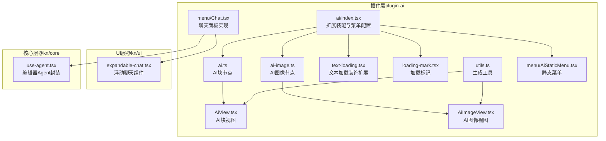
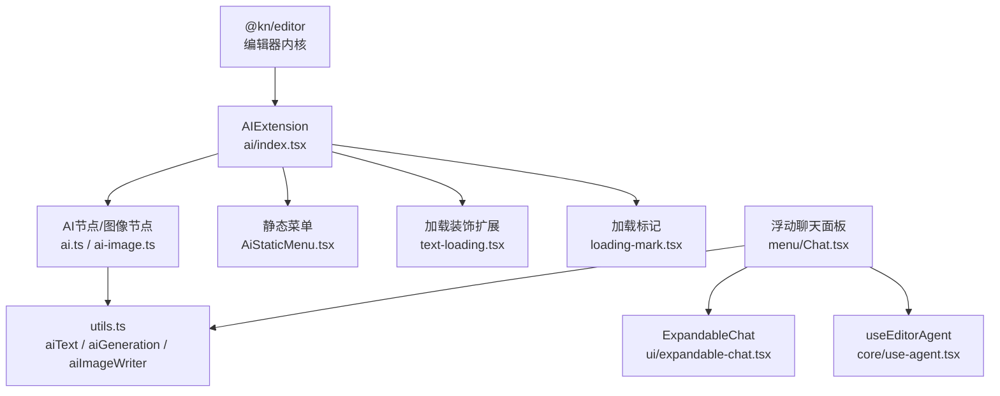
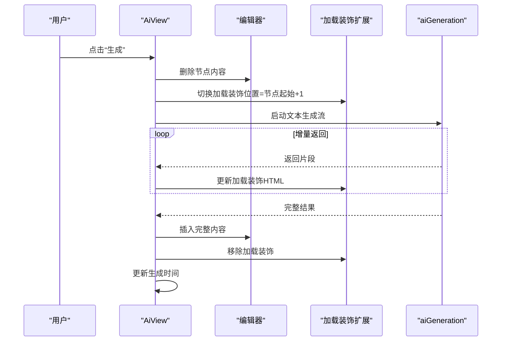
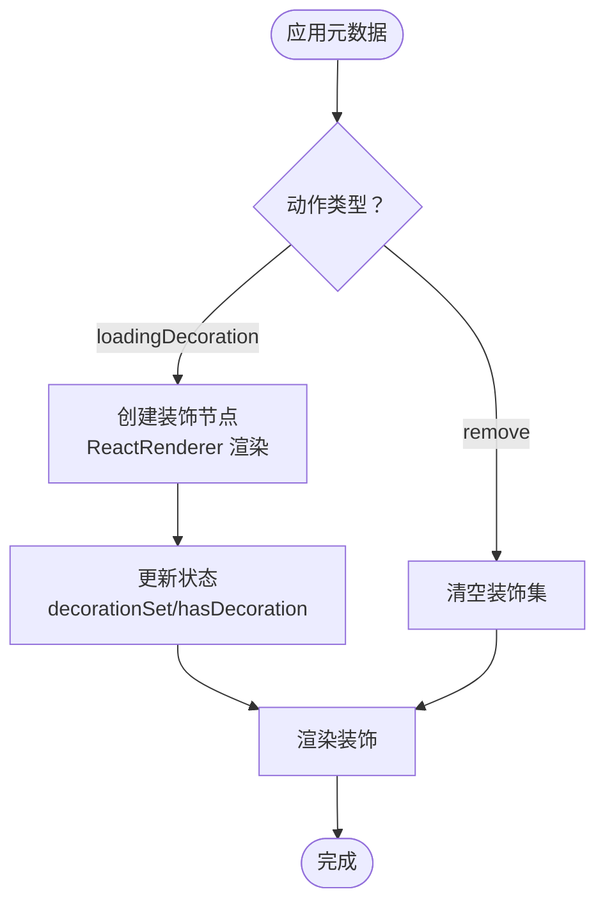
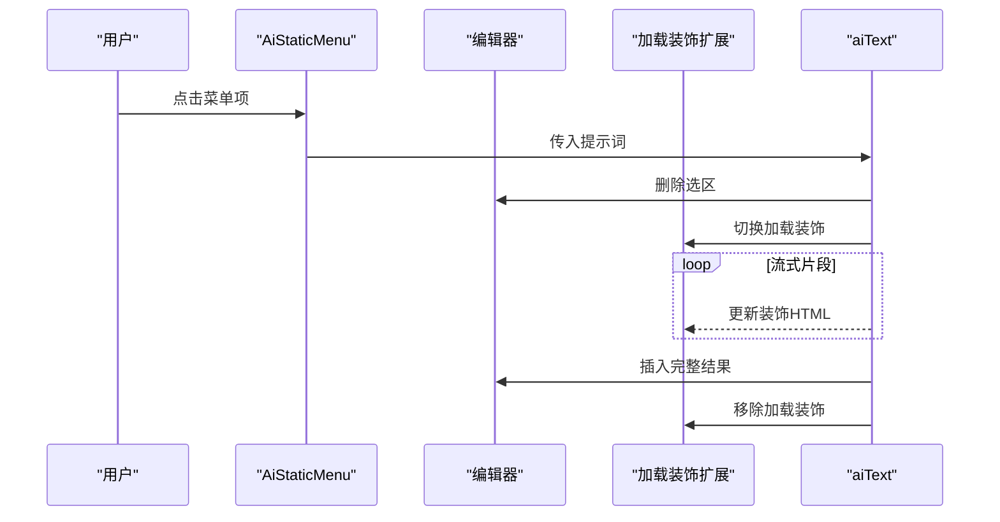
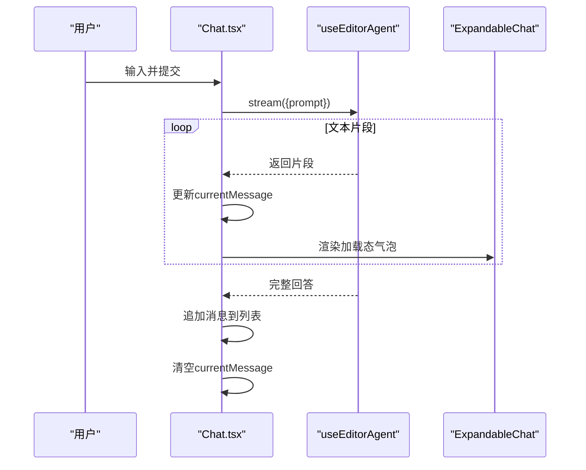
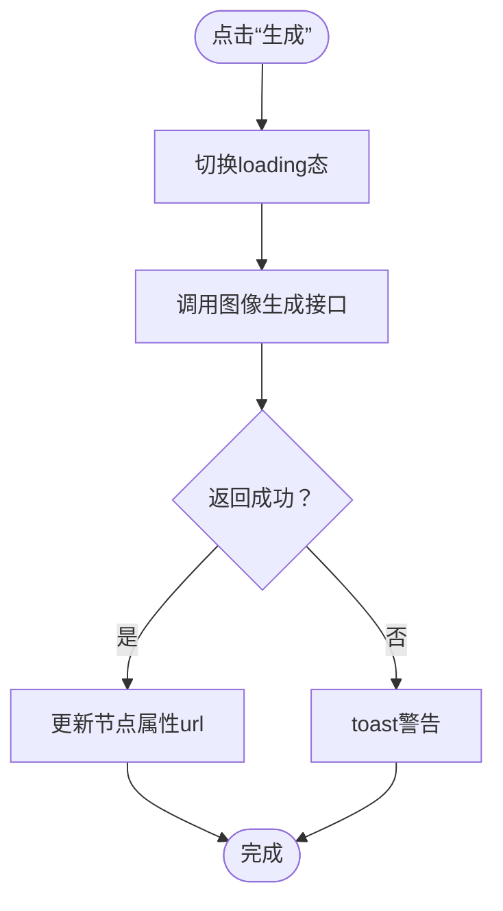
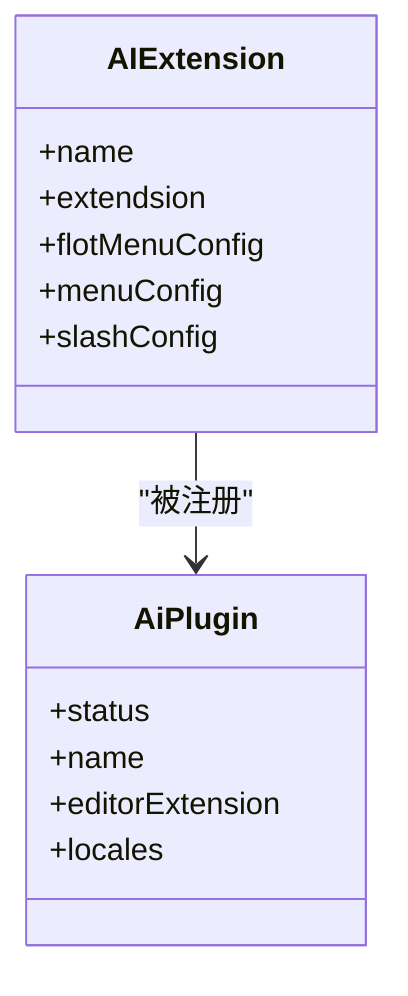
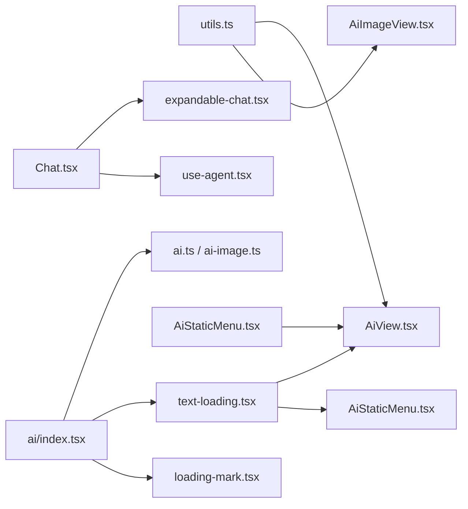

# AI聊天界面

<cite>
**本文引用的文件**
- [packages/plugin-ai/src/ai/index.tsx](file://packages/plugin-ai/src/ai/index.tsx)
- [packages/plugin-ai/src/ai/ai.ts](file://packages/plugin-ai/src/ai/ai.ts)
- [packages/plugin-ai/src/ai/AiView.tsx](file://packages/plugin-ai/src/ai/AiView.tsx)
- [packages/plugin-ai/src/ai/text-loading.tsx](file://packages/plugin-ai/src/ai/text-loading.tsx)
- [packages/plugin-ai/src/ai/utils.ts](file://packages/plugin-ai/src/ai/utils.ts)
- [packages/plugin-ai/src/ai/menu/AiStaticMenu.tsx](file://packages/plugin-ai/src/ai/menu/AiStaticMenu.tsx)
- [packages/plugin-ai/src/ai/ai-image.ts](file://packages/plugin-ai/src/ai/ai-image.ts)
- [packages/plugin-ai/src/ai/AiImageView.tsx](file://packages/plugin-ai/src/ai/AiImageView.tsx)
- [packages/plugin-ai/src/ai/marks/loading-mark.tsx](file://packages/plugin-ai/src/ai/marks/loading-mark.tsx)
- [packages/plugin-ai/src/index.tsx](file://packages/plugin-ai/src/index.tsx)
- [packages/ui/src/components/ui/expandable-chat.tsx](file://packages/ui/src/components/ui/expandable-chat.tsx)
- [packages/plugin-ai/src/ai/menu/Chat.tsx](file://packages/plugin-ai/src/ai/menu/Chat.tsx)
- [packages/core/src/ai/use-agent.tsx](file://packages/core/src/ai/use-agent.tsx)
</cite>

## 目录
1. [简介](#简介)
2. [项目结构](#项目结构)
3. [核心组件](#核心组件)
4. [架构总览](#架构总览)
5. [组件详解](#组件详解)
6. [依赖关系分析](#依赖关系分析)
7. [性能与体验建议](#性能与体验建议)
8. [故障排查指南](#故障排查指南)
9. [结论](#结论)
10. [附录](#附录)

## 简介
本文件面向“AI聊天界面”功能，系统性梳理其组件设计、交互流程、消息处理与用户输入处理机制，并提供在编辑器中的集成方式、样式定制与用户体验优化建议。该功能由插件层（plugin-ai）与UI层（@kn/ui）共同构成，支持：
- 编辑器内嵌的可编辑AI块节点（文本生成）
- 图像生成节点
- 全局浮动聊天面板（ExpandableChat），用于与AI Agent进行对话
- 文本流式渲染与加载态装饰（Loading Decoration）

## 项目结构
围绕AI聊天界面的关键文件组织如下：
- 插件入口与扩展装配：packages/plugin-ai/src/ai/index.tsx
- 节点定义与视图：ai.ts、AiView.tsx、ai-image.ts、AiImageView.tsx
- 文本流式加载装饰：text-loading.tsx、loading-mark.tsx
- 工具函数：utils.ts
- 静态菜单：menu/AiStaticMenu.tsx
- 插件注册与本地化：src/index.tsx
- UI组件：packages/ui/src/components/ui/expandable-chat.tsx
- 聊天面板实现：packages/plugin-ai/src/ai/menu/Chat.tsx
- 编辑器Agent能力封装：packages/core/src/ai/use-agent.tsx

图表来源
- [packages/plugin-ai/src/ai/index.tsx](file://packages/plugin-ai/src/ai/index.tsx#L1-L42)
- [packages/plugin-ai/src/ai/ai.ts](file://packages/plugin-ai/src/ai/ai.ts#L1-L55)
- [packages/plugin-ai/src/ai/AiView.tsx](file://packages/plugin-ai/src/ai/AiView.tsx#L1-L76)
- [packages/plugin-ai/src/ai/ai-image.ts](file://packages/plugin-ai/src/ai/ai-image.ts#L1-L37)
- [packages/plugin-ai/src/ai/AiImageView.tsx](file://packages/plugin-ai/src/ai/AiImageView.tsx#L1-L69)
- [packages/plugin-ai/src/ai/text-loading.tsx](file://packages/plugin-ai/src/ai/text-loading.tsx#L1-L146)
- [packages/plugin-ai/src/ai/marks/loading-mark.tsx](file://packages/plugin-ai/src/ai/marks/loading-mark.tsx#L1-L36)
- [packages/plugin-ai/src/ai/utils.ts](file://packages/plugin-ai/src/ai/utils.ts#L1-L58)
- [packages/plugin-ai/src/ai/menu/AiStaticMenu.tsx](file://packages/plugin-ai/src/ai/menu/AiStaticMenu.tsx#L1-L48)
- [packages/plugin-ai/src/ai/menu/Chat.tsx](file://packages/plugin-ai/src/ai/menu/Chat.tsx#L47-L154)
- [packages/ui/src/components/ui/expandable-chat.tsx](file://packages/ui/src/components/ui/expandable-chat.tsx#L1-L181)
- [packages/core/src/ai/use-agent.tsx](file://packages/core/src/ai/use-agent.tsx#L1-L192)

章节来源
- [packages/plugin-ai/src/ai/index.tsx](file://packages/plugin-ai/src/ai/index.tsx#L1-L42)
- [packages/plugin-ai/src/index.tsx](file://packages/plugin-ai/src/index.tsx#L1-L35)

## 核心组件
- AI块节点与视图
  - 节点定义：提供属性（提示词、生成时间）、命令（插入AI块）、视图渲染
  - 视图组件：展示内容区、提示语输入、生成按钮、删除按钮；支持流式更新与加载态装饰
- 文本加载装饰扩展
  - ProseMirror插件：在指定位置插入“生成中...”装饰，支持移除
  - 命令：toggleLoadingDecoration、removeLoadingDecoration
- 工具函数
  - aiText：基于当前选区进行文本生成，流式插入并移除装饰
  - aiGeneration：纯文本生成，返回流并回调增量结果
  - aiImageWriter：调用外部接口生成图片并回填URL
- 静态菜单
  - 下拉菜单：续写、简化、插入表情、语气改写、多语言翻译等
- 浮动聊天面板
  - ExpandableChat：底部悬浮聊天窗，支持头部、主体、底部、气泡消息、加载态
  - Chat.tsx：与Agent交互，收集用户输入、流式接收AI回复、维护消息列表
- 编辑器Agent封装
  - useEditorAgent：封装读取文档、插入/替换/删除、高亮等操作，供聊天面板或静态菜单调用

章节来源
- [packages/plugin-ai/src/ai/ai.ts](file://packages/plugin-ai/src/ai/ai.ts#L1-L55)
- [packages/plugin-ai/src/ai/AiView.tsx](file://packages/plugin-ai/src/ai/AiView.tsx#L1-L76)
- [packages/plugin-ai/src/ai/text-loading.tsx](file://packages/plugin-ai/src/ai/text-loading.tsx#L1-L146)
- [packages/plugin-ai/src/ai/utils.ts](file://packages/plugin-ai/src/ai/utils.ts#L1-L58)
- [packages/plugin-ai/src/ai/menu/AiStaticMenu.tsx](file://packages/plugin-ai/src/ai/menu/AiStaticMenu.tsx#L1-L48)
- [packages/ui/src/components/ui/expandable-chat.tsx](file://packages/ui/src/components/ui/expandable-chat.tsx#L1-L181)
- [packages/plugin-ai/src/ai/menu/Chat.tsx](file://packages/plugin-ai/src/ai/menu/Chat.tsx#L47-L154)
- [packages/core/src/ai/use-agent.tsx](file://packages/core/src/ai/use-agent.tsx#L1-L192)

## 架构总览
AI聊天界面由“编辑器内节点 + 全局聊天面板 + 加载态装饰 + Agent能力”四部分组成，通过插件装配统一接入编辑器。

图表来源
- [packages/plugin-ai/src/ai/index.tsx](file://packages/plugin-ai/src/ai/index.tsx#L1-L42)
- [packages/plugin-ai/src/ai/ai.ts](file://packages/plugin-ai/src/ai/ai.ts#L1-L55)
- [packages/plugin-ai/src/ai/ai-image.ts](file://packages/plugin-ai/src/ai/ai-image.ts#L1-L37)
- [packages/plugin-ai/src/ai/menu/AiStaticMenu.tsx](file://packages/plugin-ai/src/ai/menu/AiStaticMenu.tsx#L1-L48)
- [packages/plugin-ai/src/ai/text-loading.tsx](file://packages/plugin-ai/src/ai/text-loading.tsx#L1-L146)
- [packages/plugin-ai/src/ai/marks/loading-mark.tsx](file://packages/plugin-ai/src/ai/marks/loading-mark.tsx#L1-L36)
- [packages/plugin-ai/src/ai/utils.ts](file://packages/plugin-ai/src/ai/utils.ts#L1-L58)
- [packages/plugin-ai/src/ai/menu/Chat.tsx](file://packages/plugin-ai/src/ai/menu/Chat.tsx#L47-L154)
- [packages/ui/src/components/ui/expandable-chat.tsx](file://packages/ui/src/components/ui/expandable-chat.tsx#L1-L181)
- [packages/core/src/ai/use-agent.tsx](file://packages/core/src/ai/use-agent.tsx#L1-L192)

## 组件详解

### 组件A：AI块节点与视图（AiView）
- 功能要点
  - 展示AI生成内容区域与“由AI生成”的标识
  - 可编辑状态下提供提示语输入框、生成按钮、删除按钮
  - 生成时通过命令切换加载态装饰，逐步追加内容，完成后移除装饰并更新生成时间
- 关键交互
  - 用户点击“生成”后，清空节点内容，插入加载态装饰，流式接收增量，最后一次性插入完整结果
- 复杂度与性能
  - 流式渲染避免长阻塞，装饰插入为O(1)，整体受网络与模型响应影响

图表来源
- [packages/plugin-ai/src/ai/AiView.tsx](file://packages/plugin-ai/src/ai/AiView.tsx#L1-L76)
- [packages/plugin-ai/src/ai/text-loading.tsx](file://packages/plugin-ai/src/ai/text-loading.tsx#L1-L146)
- [packages/plugin-ai/src/ai/utils.ts](file://packages/plugin-ai/src/ai/utils.ts#L1-L58)

章节来源
- [packages/plugin-ai/src/ai/AiView.tsx](file://packages/plugin-ai/src/ai/AiView.tsx#L1-L76)
- [packages/plugin-ai/src/ai/text-loading.tsx](file://packages/plugin-ai/src/ai/text-loading.tsx#L1-L146)
- [packages/plugin-ai/src/ai/utils.ts](file://packages/plugin-ai/src/ai/utils.ts#L1-L58)

### 组件B：文本加载装饰扩展（TextLoadingDecorationExtension）
- 功能要点
  - 以ProseMirror插件形式在指定位置插入React渲染的“生成中”装饰
  - 提供命令：toggleLoadingDecoration、removeLoadingDecoration
- 数据结构
  - DecorationSet：存储装饰集合
  - PluginKey：状态键值
- 性能与复杂度
  - 装饰插入/更新为常数级；状态映射与重绘受文档变更影响

图表来源
- [packages/plugin-ai/src/ai/text-loading.tsx](file://packages/plugin-ai/src/ai/text-loading.tsx#L1-L146)

章节来源
- [packages/plugin-ai/src/ai/text-loading.tsx](file://packages/plugin-ai/src/ai/text-loading.tsx#L1-L146)

### 组件C：静态菜单（AiStaticMenu）
- 功能要点
  - 提供“续写、简化、插入表情、语气改写、翻译”等常用AI操作
  - 每个菜单项调用aiText，基于当前选区与提示词进行生成
- 交互逻辑
  - 点击菜单项 -> 调用aiText -> 删除选区 -> 插入加载装饰 -> 流式插入 -> 移除装饰

图表来源
- [packages/plugin-ai/src/ai/menu/AiStaticMenu.tsx](file://packages/plugin-ai/src/ai/menu/AiStaticMenu.tsx#L1-L48)
- [packages/plugin-ai/src/ai/utils.ts](file://packages/plugin-ai/src/ai/utils.ts#L1-L31)
- [packages/plugin-ai/src/ai/text-loading.tsx](file://packages/plugin-ai/src/ai/text-loading.tsx#L1-L146)

章节来源
- [packages/plugin-ai/src/ai/menu/AiStaticMenu.tsx](file://packages/plugin-ai/src/ai/menu/AiStaticMenu.tsx#L1-L48)
- [packages/plugin-ai/src/ai/utils.ts](file://packages/plugin-ai/src/ai/utils.ts#L1-L31)

### 组件D：浮动聊天面板（ExpandableChat + Chat.tsx）
- 功能要点
  - ExpandableChat：悬浮展开/收起、尺寸控制、定位控制
  - Chat.tsx：消息列表、输入框、发送、流式接收、加载态气泡
  - 使用useEditorAgent与编辑器交互（读取/插入/替换/删除/高亮）
- 交互流程
  - 用户输入 -> 发送 -> Agent流式返回 -> 实时更新当前消息 -> 追加到消息列表 -> 结束后清除当前消息

图表来源
- [packages/plugin-ai/src/ai/menu/Chat.tsx](file://packages/plugin-ai/src/ai/menu/Chat.tsx#L47-L154)
- [packages/ui/src/components/ui/expandable-chat.tsx](file://packages/ui/src/components/ui/expandable-chat.tsx#L1-L181)
- [packages/core/src/ai/use-agent.tsx](file://packages/core/src/ai/use-agent.tsx#L1-L192)

章节来源
- [packages/plugin-ai/src/ai/menu/Chat.tsx](file://packages/plugin-ai/src/ai/menu/Chat.tsx#L47-L154)
- [packages/ui/src/components/ui/expandable-chat.tsx](file://packages/ui/src/components/ui/expandable-chat.tsx#L1-L181)
- [packages/core/src/ai/use-agent.tsx](file://packages/core/src/ai/use-agent.tsx#L1-L192)

### 组件E：图像生成节点（AiImageView）
- 功能要点
  - 展示已生成图片预览
  - 提供提示语输入、生成按钮、删除按钮
  - 生成成功后回填URL至节点属性
- 错误处理
  - 对外部接口错误进行toast提示

图表来源
- [packages/plugin-ai/src/ai/AiImageView.tsx](file://packages/plugin-ai/src/ai/AiImageView.tsx#L1-L69)
- [packages/plugin-ai/src/ai/utils.ts](file://packages/plugin-ai/src/ai/utils.ts#L43-L58)

章节来源
- [packages/plugin-ai/src/ai/AiImageView.tsx](file://packages/plugin-ai/src/ai/AiImageView.tsx#L1-L69)
- [packages/plugin-ai/src/ai/utils.ts](file://packages/plugin-ai/src/ai/utils.ts#L43-L58)

### 组件F：插件装配与本地化（AIExtension、插件注册）
- AIExtension：装配AI节点、图像节点、加载装饰扩展、加载标记、静态菜单、Slash菜单
- 插件注册：提供本地化翻译、名称与状态

图表来源
- [packages/plugin-ai/src/ai/index.tsx](file://packages/plugin-ai/src/ai/index.tsx#L1-L42)
- [packages/plugin-ai/src/index.tsx](file://packages/plugin-ai/src/index.tsx#L1-L35)

章节来源
- [packages/plugin-ai/src/ai/index.tsx](file://packages/plugin-ai/src/ai/index.tsx#L1-L42)
- [packages/plugin-ai/src/index.tsx](file://packages/plugin-ai/src/index.tsx#L1-L35)

## 依赖关系分析
- 组件耦合
  - AiView/AiImageView 依赖 utils.ts 的生成函数与编辑器命令
  - 加载装饰扩展与AiView共享toggleLoadingDecoration/removeLoadingDecoration
  - Chat.tsx 依赖 ExpandableChat UI组件与useEditorAgent
  - 静态菜单依赖aiText工具函数
- 外部依赖
  - @kn/editor：节点、命令、插件、装饰
  - @kn/ui：组件库（Button、Textarea、toast等）
  - @kn/icon：图标
  - @kn/common：国际化、插件框架
  - @kn/core：Agent能力封装

图表来源
- [packages/plugin-ai/src/ai/utils.ts](file://packages/plugin-ai/src/ai/utils.ts#L1-L58)
- [packages/plugin-ai/src/ai/AiView.tsx](file://packages/plugin-ai/src/ai/AiView.tsx#L1-L76)
- [packages/plugin-ai/src/ai/AiImageView.tsx](file://packages/plugin-ai/src/ai/AiImageView.tsx#L1-L69)
- [packages/plugin-ai/src/ai/text-loading.tsx](file://packages/plugin-ai/src/ai/text-loading.tsx#L1-L146)
- [packages/plugin-ai/src/ai/menu/AiStaticMenu.tsx](file://packages/plugin-ai/src/ai/menu/AiStaticMenu.tsx#L1-L48)
- [packages/plugin-ai/src/ai/index.tsx](file://packages/plugin-ai/src/ai/index.tsx#L1-L42)
- [packages/plugin-ai/src/ai/marks/loading-mark.tsx](file://packages/plugin-ai/src/ai/marks/loading-mark.tsx#L1-L36)
- [packages/plugin-ai/src/ai/menu/Chat.tsx](file://packages/plugin-ai/src/ai/menu/Chat.tsx#L47-L154)
- [packages/ui/src/components/ui/expandable-chat.tsx](file://packages/ui/src/components/ui/expandable-chat.tsx#L1-L181)
- [packages/core/src/ai/use-agent.tsx](file://packages/core/src/ai/use-agent.tsx#L1-L192)

## 性能与体验建议
- 性能
  - 流式渲染：保持UI无阻塞，建议在前端对片段进行节流/防抖合并
  - 装饰更新：尽量减少DOM重建，优先更新innerHTML而非重新挂载
  - 文档大时：静态菜单与Agent读取范围应限制，避免全量扫描
- 交互优化
  - 自动滚动：在消息列表与加载态气泡出现时自动滚动到底部
  - 快捷键：支持Enter发送、Esc关闭面板
  - 占位符与提示：输入框提供上下文相关的提示词建议
- 用户体验
  - 加载态：提供明确的“生成中”指示与进度反馈
  - 错误提示：对外部接口失败进行友好toast提示
  - 本地化：确保中英文文案一致且准确

## 故障排查指南
- 生成无响应
  - 检查aiGeneration是否正确触发与流式返回
  - 确认toggleLoadingDecoration是否在开始与结束阶段均被调用
- 装饰不消失
  - 确认removeLoadingDecoration是否在最终插入后调用
  - 检查ProseMirror插件状态是否被正确重置
- 图像生成失败
  - 检查aiImageWriter返回的错误信息并通过toast提示
  - 核对鉴权头与请求体格式
- 聊天面板无法展开
  - 检查ExpandableChat的position与size配置
  - 确认useEditorAgent的stream调用链路正常

章节来源
- [packages/plugin-ai/src/ai/utils.ts](file://packages/plugin-ai/src/ai/utils.ts#L1-L58)
- [packages/plugin-ai/src/ai/text-loading.tsx](file://packages/plugin-ai/src/ai/text-loading.tsx#L1-L146)
- [packages/plugin-ai/src/ai/AiImageView.tsx](file://packages/plugin-ai/src/ai/AiImageView.tsx#L1-L69)
- [packages/ui/src/components/ui/expandable-chat.tsx](file://packages/ui/src/components/ui/expandable-chat.tsx#L1-L181)
- [packages/core/src/ai/use-agent.tsx](file://packages/core/src/ai/use-agent.tsx#L1-L192)

## 结论
AI聊天界面通过“编辑器内节点 + 全局聊天面板 + 加载态装饰 + Agent能力”形成闭环：既能对文档内容进行智能增强，也能提供全局对话式交互。其模块化设计便于扩展与定制，结合流式渲染与本地化支持，能够满足多样化的编辑场景需求。

## 附录

### 使用示例：集成到编辑器
- 在插件中注册AIExtension，即可获得：
  - 静态菜单：在工具栏显示AI工具组
  - Slash菜单：/ai、/aiImage
  - AI块与图像块：插入后可直接编辑提示词并生成
  - 浮动聊天面板：随时与Agent对话并操作编辑器

章节来源
- [packages/plugin-ai/src/ai/index.tsx](file://packages/plugin-ai/src/ai/index.tsx#L1-L42)
- [packages/plugin-ai/src/index.tsx](file://packages/plugin-ai/src/index.tsx#L1-L35)

### 处理用户消息与显示AI响应
- 浮动聊天面板
  - 用户输入 -> Chat.tsx提交 -> useEditorAgent.stream接收 -> 实时更新currentMessage -> 追加到消息列表
- 编辑器内生成
  - AiView/AiStaticMenu -> utils.aiText -> 流式插入 -> 装饰更新 -> 最终插入完整结果

章节来源
- [packages/plugin-ai/src/ai/menu/Chat.tsx](file://packages/plugin-ai/src/ai/menu/Chat.tsx#L47-L154)
- [packages/plugin-ai/src/ai/utils.ts](file://packages/plugin-ai/src/ai/utils.ts#L1-L31)
- [packages/plugin-ai/src/ai/AiView.tsx](file://packages/plugin-ai/src/ai/AiView.tsx#L1-L76)

### 样式定制与主题适配
- ExpandableChat尺寸与位置：通过size与position参数控制
- 消息气泡：sent/received变体，支持isLoading加载态
- 装饰样式：可通过CSS类名覆盖loading-decoration容器样式
- 本地化：插件提供中英文翻译键值，可在运行时切换语言

章节来源
- [packages/ui/src/components/ui/expandable-chat.tsx](file://packages/ui/src/components/ui/expandable-chat.tsx#L1-L181)
- [packages/plugin-ai/src/index.tsx](file://packages/plugin-ai/src/index.tsx#L1-L35)