# AI聊天界面

<cite>
**本文引用的文件**
- [packages/plugin-ai/src/ai/index.tsx](file://packages/plugin-ai/src/ai/index.tsx)
- [packages/plugin-ai/src/ai/ai.ts](file://packages/plugin-ai/src/ai/ai.ts)
- [packages/plugin-ai/src/ai/AiView.tsx](file://packages/plugin-ai/src/ai/AiView.tsx)
- [packages/plugin-ai/src/ai/text-loading.tsx](file://packages/plugin-ai/src/ai/text-loading.tsx)
- [packages/plugin-ai/src/ai/utils.ts](file://packages/plugin-ai/src/ai/utils.ts)
- [packages/plugin-ai/src/ai/menu/AiStaticMenu.tsx](file://packages/plugin-ai/src/ai/menu/AiStaticMenu.tsx)
- [packages/plugin-ai/src/ai/ai-image.ts](file://packages/plugin-ai/src/ai/ai-image.ts)
- [packages/plugin-ai/src/ai/AiImageView.tsx](file://packages/plugin-ai/src/ai/AiImageView.tsx)
- [packages/plugin-ai/src/ai/marks/loading-mark.tsx](file://packages/plugin-ai/src/ai/marks/loading-mark.tsx)
- [packages/plugin-ai/src/index.tsx](file://packages/plugin-ai/src/index.tsx)
- [packages/ui/src/components/ui/expandable-chat.tsx](file://packages/ui/src/components/ui/expandable-chat.tsx)
- [packages/plugin-ai/src/ai/menu/Chat.tsx](file://packages/plugin-ai/src/ai/menu/Chat.tsx)
- [packages/core/src/ai/use-agent-optimized.tsx](file://packages/core/src/ai/use-agent-optimized.tsx)
- [packages/ui/src/components/ui/message-loading.tsx](file://packages/ui/src/components/ui/message-loading.tsx)
- [packages/ui/package.json](file://packages/ui/package.json)
- [packages/ui/tailwind.config.js](file://packages/ui/tailwind.config.js)
- [packages/core/src/ai/AiInlineMenu.tsx](file://packages/core/src/ai/AiInlineMenu.tsx)
- [packages/core/src/ai/types.ts](file://packages/core/src/ai/types.ts)
- [packages/plugin-ai/src/ai/menu/chat-types.ts](file://packages/plugin-ai/src/ai/menu/chat-types.ts)
- [packages/plugin-ai/src/ai/menu/use-streaming-buffer.ts](file://packages/plugin-ai/src/ai/menu/use-streaming-buffer.ts)
- [packages/plugin-ai/src/ai/menu/MessageBubble.tsx](file://packages/plugin-ai/src/ai/menu/MessageBubble.tsx)
- [packages/core/src/pages/AIAssistantPage.tsx](file://packages/core/src/pages/AIAssistantPage.tsx)
- [packages/core/src/ai/system-agent/index.ts](file://packages/core/src/ai/system-agent/index.ts)
- [packages/core/src/ai/system-agent/context.tsx](file://packages/core/src/ai/system-agent/context.tsx)
- [packages/core/src/ai/system-agent/hooks.ts](file://packages/core/src/ai/system-agent/hooks.ts)
- [packages/core/src/ai/system-agent/AIAssistantPanel.tsx](file://packages/core/src/ai/system-agent/AIAssistantPanel.tsx)
- [packages/core/src/ai/constants.ts](file://packages/core/src/ai/constants.ts)
- [packages/plugin-ai/src/ai/menu/chat-persistence.ts](file://packages/plugin-ai/src/ai/menu/chat-persistence.ts)
</cite>

## 更新摘要
**变更内容**
- 新增独立AI助手页面AIAssistantPage.tsx，提供完整的聊天界面
- 集成SystemAgentProvider和SystemAgentContext，统一AI代理管理
- 新增消息历史管理和持久化功能
- 增强工具执行步骤显示和错误处理机制
- 优化流式消息渲染和性能表现

## 目录
1. [简介](#简介)
2. [项目结构](#项目结构)
3. [核心组件](#核心组件)
4. [架构总览](#架构总览)
5. [组件详解](#组件详解)
6. [依赖关系分析](#依赖关系分析)
7. [性能与体验建议](#性能与体验建议)
8. [故障排查指南](#故障排查指南)
9. [结论](#结论)
10. [附录](#附录)

## 简介
本文件面向"AI聊天界面"功能，系统性梳理其组件设计、交互流程、消息处理与用户输入处理机制，并提供在编辑器中的集成方式、样式定制与用户体验优化建议。该功能由插件层（plugin-ai）与UI层（@kn/ui）共同构成，支持：
- 编辑器内嵌的可编辑AI块节点（文本生成）
- 图像生成节点
- 全局浮动聊天面板（ExpandableChat），用于与AI Agent进行对话
- 文本流式渲染与加载态装饰（Loading Decoration）
- **新增** 独立AI助手页面（AIAssistantPage），提供完整的聊天界面
- **新增** SystemAgentProvider集成，统一AI代理管理
- **新增** 消息历史管理与持久化功能
- **新增** 工具执行步骤显示和错误处理机制

## 项目结构
围绕AI聊天界面的关键文件组织如下：
- 插件入口与扩展装配：packages/plugin-ai/src/ai/index.tsx
- 节点定义与视图：ai.ts、AiView.tsx、ai-image.ts、AiImageView.tsx
- 文本流式加载装饰：text-loading.tsx、loading-mark.tsx
- 工具函数：utils.ts
- 静态菜单：menu/AiStaticMenu.tsx
- 插件注册与本地化：src/index.tsx
- UI组件：packages/ui/src/components/ui/expandable-chat.tsx
- 聊天面板实现：packages/plugin-ai/src/ai/menu/Chat.tsx
- 编辑器Agent能力封装：packages/core/src/ai/use-agent-optimized.tsx
- **新增** 独立AI助手页面：packages/core/src/pages/AIAssistantPage.tsx
- **新增** 系统代理提供者：packages/core/src/ai/system-agent/context.tsx
- **新增** 系统代理钩子：packages/core/src/ai/system-agent/hooks.ts
- **新增** AI助手面板：packages/core/src/ai/system-agent/AIAssistantPanel.tsx
- **新增** 消息历史管理：packages/plugin-ai/src/ai/menu/chat-persistence.ts

```mermaid
graph TB
subgraph "插件层plugin-ai"
IDX["ai/index.tsx<br/>扩展装配与菜单配置"]
AI_NODE["ai.ts<br/>AI块节点"]
AI_VIEW["AiView.tsx<br/>AI块视图"]
IMG_NODE["ai-image.ts<br/>AI图像节点"]
IMG_VIEW["AiImageView.tsx<br/>AI图像视图"]
LOADING_EXT["text-loading.tsx<br/>文本加载装饰扩展"]
LOADING_MARK["loading-mark.tsx<br/>加载标记"]
UTILS["utils.ts<br/>生成工具"]
MENU["menu/AiStaticMenu.tsx<br/>静态菜单"]
CHAT_UI["menu/Chat.tsx<br/>聊天面板实现"]
STREAM_BUFFER["use-streaming-buffer.ts<br/>流式缓冲区"]
MESSAGE_BUBBLE["MessageBubble.tsx<br/>消息气泡组件"]
CHAT_PERSIST["chat-persistence.ts<br/>消息历史管理"]
end
subgraph "核心层@kn/core"
AGENT["use-agent-optimized.tsx<br/>编辑器Agent封装"]
INLINE_MENU["AiInlineMenu.tsx<br/>AI内联助手系统"]
TYPES["types.ts<br/>类型定义"]
SYSTEM_PAGE["pages/AIAssistantPage.tsx<br/>独立AI助手页面"]
SYSTEM_CONTEXT["system-agent/context.tsx<br/>系统代理提供者"]
SYSTEM_HOOKS["system-agent/hooks.ts<br/>系统代理钩子"]
SYSTEM_PANEL["system-agent/AIAssistantPanel.tsx<br/>AI助手面板"]
CONSTANTS["ai/constants.ts<br/>系统提示词常量"]
end
subgraph "UI层@kn/ui"
EC["expandable-chat.tsx<br/>浮动聊天组件"]
MSG_LOADING["message-loading.tsx<br/>消息加载动画"]
end
IDX --> AI_NODE --> AI_VIEW
IDX --> IMG_NODE --> IMG_VIEW
IDX --> LOADING_EXT
IDX --> LOADING_MARK
IDX --> MENU
CHAT_UI --> EC
CHAT_UI --> AGENT
CHAT_UI --> STREAM_BUFFER
CHAT_UI --> MESSAGE_BUBBLE
CHAT_UI --> CHAT_PERSIST
SYSTEM_PAGE --> SYSTEM_CONTEXT
SYSTEM_PAGE --> SYSTEM_HOOKS
SYSTEM_CONTEXT --> SYSTEM_PANEL
SYSTEM_CONTEXT --> CONSTANTS
INLINE_MENU --> AGENT
INLINE_MENU --> TYPES
UTILS --> AI_VIEW
UTILS --> IMG_VIEW
```

**图表来源**
- [packages/plugin-ai/src/ai/index.tsx](file://packages/plugin-ai/src/ai/index.tsx#L1-L42)
- [packages/plugin-ai/src/ai/ai.ts](file://packages/plugin-ai/src/ai/ai.ts#L1-L55)
- [packages/plugin-ai/src/ai/AiView.tsx](file://packages/plugin-ai/src/ai/AiView.tsx#L1-L76)
- [packages/plugin-ai/src/ai/ai-image.ts](file://packages/plugin-ai/src/ai/ai-image.ts#L1-L37)
- [packages/plugin-ai/src/ai/AiImageView.tsx](file://packages/plugin-ai/src/ai/AiImageView.tsx#L1-L69)
- [packages/plugin-ai/src/ai/text-loading.tsx](file://packages/plugin-ai/src/ai/text-loading.tsx#L1-L146)
- [packages/plugin-ai/src/ai/marks/loading-mark.tsx](file://packages/plugin-ai/src/ai/marks/loading-mark.tsx#L1-L36)
- [packages/plugin-ai/src/ai/utils.ts](file://packages/plugin-ai/src/ai/utils.ts#L1-L58)
- [packages/plugin-ai/src/ai/menu/AiStaticMenu.tsx](file://packages/plugin-ai/src/ai/menu/AiStaticMenu.tsx#L1-L48)
- [packages/plugin-ai/src/ai/menu/Chat.tsx](file://packages/plugin-ai/src/ai/menu/Chat.tsx#L47-L154)
- [packages/plugin-ai/src/ai/menu/use-streaming-buffer.ts](file://packages/plugin-ai/src/ai/menu/use-streaming-buffer.ts#L1-L46)
- [packages/plugin-ai/src/ai/menu/MessageBubble.tsx](file://packages/plugin-ai/src/ai/menu/MessageBubble.tsx#L1-L99)
- [packages/plugin-ai/src/ai/menu/chat-persistence.ts](file://packages/plugin-ai/src/ai/menu/chat-persistence.ts#L1-L68)
- [packages/core/src/ai/use-agent-optimized.tsx](file://packages/core/src/ai/use-agent-optimized.tsx#L1-L344)
- [packages/core/src/ai/AiInlineMenu.tsx](file://packages/core/src/ai/AiInlineMenu.tsx#L1-L435)
- [packages/core/src/ai/types.ts](file://packages/core/src/ai/types.ts#L1-L166)
- [packages/ui/src/components/ui/expandable-chat.tsx](file://packages/ui/src/components/ui/expandable-chat.tsx#L1-L417)
- [packages/core/src/pages/AIAssistantPage.tsx](file://packages/core/src/pages/AIAssistantPage.tsx#L1-L470)
- [packages/core/src/ai/system-agent/context.tsx](file://packages/core/src/ai/system-agent/context.tsx#L1-L352)
- [packages/core/src/ai/system-agent/hooks.ts](file://packages/core/src/ai/system-agent/hooks.ts#L1-L256)
- [packages/core/src/ai/system-agent/AIAssistantPanel.tsx](file://packages/core/src/ai/system-agent/AIAssistantPanel.tsx#L1-L520)
- [packages/core/src/ai/constants.ts](file://packages/core/src/ai/constants.ts#L1-L228)

**章节来源**
- [packages/plugin-ai/src/ai/index.tsx](file://packages/plugin-ai/src/ai/index.tsx#L1-L42)
- [packages/plugin-ai/src/index.tsx](file://packages/plugin-ai/src/index.tsx#L1-L35)

## 核心组件
- AI块节点与视图
  - 节点定义：提供属性（提示词、生成时间）、命令（插入AI块）、视图渲染
  - 视图组件：展示内容区、提示语输入、生成按钮、删除按钮；支持流式更新与加载态装饰
- 文本加载装饰扩展
  - ProseMirror插件：在指定位置插入"生成中..."装饰，支持移除
  - 命令：toggleLoadingDecoration、removeLoadingDecoration
- 工具函数
  - aiText：基于当前选区进行文本生成，流式插入并移除装饰
  - aiGeneration：纯文本生成，返回流并回调增量结果
  - aiImageWriter：调用外部接口生成图片并回填URL
- 静态菜单
  - 下拉菜单：续写、简化、插入表情、语气改写、多语言翻译等
- 浮动聊天面板
  - ExpandableChat：底部悬浮聊天窗，支持头部、主体、底部、气泡消息、加载态
  - Chat.tsx：与Agent交互，收集用户输入、流式接收AI回复、维护消息列表
- **新增** 独立AI助手页面
  - AIAssistantPage：完整的聊天界面，支持消息历史、工具执行步骤显示
  - AIChatInterface：聊天界面核心组件，处理用户输入和AI响应
  - 消息历史管理：支持消息持久化和历史记录
- **新增** 系统代理提供者
  - SystemAgentProvider：全局AI代理提供者，管理代理状态和生命周期
  - SystemAgentContext：系统代理上下文，提供流式生成、工具执行等功能
  - useSystemAgent：系统代理钩子，简化代理使用
- **新增** AI助手面板
  - AIAssistantPanel：浮动面板，支持键盘快捷键、编辑器绑定
  - AIAssistantTrigger：触发按钮，支持标签显示和键盘快捷键
  - useAIAssistantShortcut：键盘快捷键钩子
- 编辑器Agent封装
  - useEditorAgentOptimized：封装读取文档、插入/替换/删除、高亮等操作，供聊天面板或静态菜单调用

**章节来源**
- [packages/plugin-ai/src/ai/ai.ts](file://packages/plugin-ai/src/ai/ai.ts#L1-L55)
- [packages/plugin-ai/src/ai/AiView.tsx](file://packages/plugin-ai/src/ai/AiView.tsx#L1-L76)
- [packages/plugin-ai/src/ai/text-loading.tsx](file://packages/plugin-ai/src/ai/text-loading.tsx#L1-L146)
- [packages/plugin-ai/src/ai/utils.ts](file://packages/plugin-ai/src/ai/utils.ts#L1-L58)
- [packages/plugin-ai/src/ai/menu/AiStaticMenu.tsx](file://packages/plugin-ai/src/ai/menu/AiStaticMenu.tsx#L1-L48)
- [packages/ui/src/components/ui/expandable-chat.tsx](file://packages/ui/src/components/ui/expandable-chat.tsx#L1-L417)
- [packages/plugin-ai/src/ai/menu/Chat.tsx](file://packages/plugin-ai/src/ai/menu/Chat.tsx#L47-L154)
- [packages/core/src/ai/use-agent-optimized.tsx](file://packages/core/src/ai/use-agent-optimized.tsx#L1-L344)
- [packages/core/src/ai/AiInlineMenu.tsx](file://packages/core/src/ai/AiInlineMenu.tsx#L75-L243)
- [packages/core/src/pages/AIAssistantPage.tsx](file://packages/core/src/pages/AIAssistantPage.tsx#L1-L470)
- [packages/core/src/ai/system-agent/context.tsx](file://packages/core/src/ai/system-agent/context.tsx#L1-L352)
- [packages/core/src/ai/system-agent/hooks.ts](file://packages/core/src/ai/system-agent/hooks.ts#L1-L256)
- [packages/core/src/ai/system-agent/AIAssistantPanel.tsx](file://packages/core/src/ai/system-agent/AIAssistantPanel.tsx#L1-L520)

## 架构总览
AI聊天界面由"编辑器内节点 + 全局聊天面板 + 加载态装饰 + Agent能力 + 独立AI助手页面 + 系统代理提供者"七部分组成，通过插件装配统一接入编辑器。

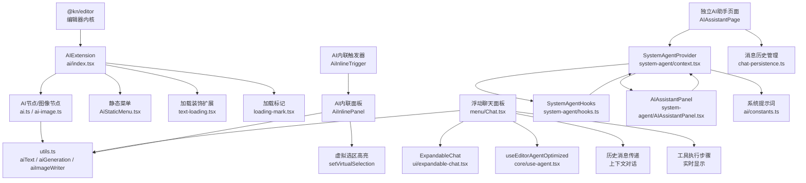
```mermaid
graph TB
Editor["@kn/editor<br/>编辑器内核"] --> Ext["AIExtension<br/>ai/index.tsx"]
Ext --> Nodes["AI节点/图像节点<br/>ai.ts / ai-image.ts"]
Ext --> Menu["静态菜单<br/>AiStaticMenu.tsx"]
Ext --> Decor["加载装饰扩展<br/>text-loading.tsx"]
Ext --> Marks["加载标记<br/>loading-mark.tsx"]
InlineTrigger["AI内联触发器<br/>AiInlineTrigger"] --> InlinePanel["AI内联面板<br/>AiInlinePanel"]
InlinePanel --> VirtualSelection["虚拟选区高亮<br/>setVirtualSelection"]
ChatPanel["浮动聊天面板<br/>menu/Chat.tsx"] --> UIComp["ExpandableChat<br/>ui/expandable-chat.tsx"]
ChatPanel --> Agent["useEditorAgentOptimized<br/>core/use-agent.tsx"]
ChatPanel --> History["历史消息传递<br/>上下文对话"]
ChatPanel --> Steps["工具执行步骤<br/>实时显示"]
Nodes --> Utils["utils.ts<br/>aiText / aiGeneration / aiImageWriter"]
ChatPanel --> Utils
InlinePanel --> Utils
SystemPage["独立AI助手页面<br/>AIAssistantPage"] --> SystemContext["SystemAgentProvider<br/>system-agent/context.tsx"]
SystemContext --> SystemHooks["SystemAgentHooks<br/>system-agent/hooks.ts"]
SystemContext --> SystemPanel["AIAssistantPanel<br/>system-agent/AIAssistantPanel.tsx"]
SystemContext --> SystemConstants["系统提示词<br/>ai/constants.ts"]
SystemPage --> ChatPersistence["消息历史管理<br/>chat-persistence.ts"]
SystemHooks --> SystemContext
SystemPanel --> SystemContext
```

**图表来源**
- [packages/plugin-ai/src/ai/index.tsx](file://packages/plugin-ai/src/ai/index.tsx#L1-L42)
- [packages/plugin-ai/src/ai/ai.ts](file://packages/plugin-ai/src/ai/ai.ts#L1-L55)
- [packages/plugin-ai/src/ai/ai-image.ts](file://packages/plugin-ai/src/ai/ai-image.ts#L1-L37)
- [packages/plugin-ai/src/ai/menu/AiStaticMenu.tsx](file://packages/plugin-ai/src/ai/menu/AiStaticMenu.tsx#L1-L48)
- [packages/plugin-ai/src/ai/text-loading.tsx](file://packages/plugin-ai/src/ai/text-loading.tsx#L1-L146)
- [packages/plugin-ai/src/ai/marks/loading-mark.tsx](file://packages/plugin-ai/src/ai/marks/loading-mark.tsx#L1-L36)
- [packages/plugin-ai/src/ai/utils.ts](file://packages/plugin-ai/src/ai/utils.ts#L1-L58)
- [packages/plugin-ai/src/ai/menu/Chat.tsx](file://packages/plugin-ai/src/ai/menu/Chat.tsx#L47-L154)
- [packages/core/src/ai/AiInlineMenu.tsx](file://packages/core/src/ai/AiInlineMenu.tsx#L75-L243)
- [packages/core/src/ai/use-agent-optimized.tsx](file://packages/core/src/ai/use-agent-optimized.tsx#L1-L344)
- [packages/ui/src/components/ui/expandable-chat.tsx](file://packages/ui/src/components/ui/expandable-chat.tsx#L1-L417)
- [packages/core/src/pages/AIAssistantPage.tsx](file://packages/core/src/pages/AIAssistantPage.tsx#L1-L470)
- [packages/core/src/ai/system-agent/context.tsx](file://packages/core/src/ai/system-agent/context.tsx#L1-L352)
- [packages/core/src/ai/system-agent/hooks.ts](file://packages/core/src/ai/system-agent/hooks.ts#L1-L256)
- [packages/core/src/ai/system-agent/AIAssistantPanel.tsx](file://packages/core/src/ai/system-agent/AIAssistantPanel.tsx#L1-L520)
- [packages/core/src/ai/constants.ts](file://packages/core/src/ai/constants.ts#L1-L228)
- [packages/plugin-ai/src/ai/menu/chat-persistence.ts](file://packages/plugin-ai/src/ai/menu/chat-persistence.ts#L1-L68)

## 组件详解

### 组件A：AI块节点与视图（AiView）
- 功能要点
  - 展示AI生成内容区域与"由AI生成"的标识
  - 可编辑状态下提供提示语输入框、生成按钮、删除按钮
  - 生成时通过命令切换加载态装饰，逐步追加内容，完成后移除装饰并更新生成时间
- 关键交互
  - 用户点击"生成"后，清空节点内容，插入加载态装饰，流式接收增量，最后一次性插入完整结果
- 复杂度与性能
  - 流式渲染避免长阻塞，装饰插入为O(1)，整体受网络与模型响应影响

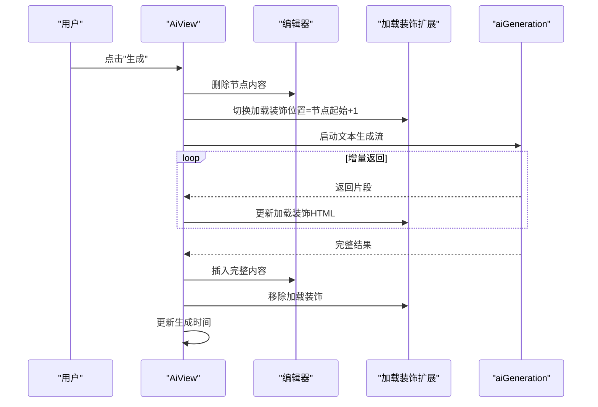
```mermaid
sequenceDiagram
participant U as "用户"
participant V as "AiView"
participant E as "编辑器"
participant D as "加载装饰扩展"
participant G as "aiGeneration"
U->>V : 点击"生成"
V->>E : 删除节点内容
V->>D : 切换加载装饰位置=节点起始+1
V->>G : 启动文本生成流
loop 增量返回
G-->>V : 返回片段
V->>D : 更新加载装饰HTML
end
G-->>V : 完整结果
V->>E : 插入完整内容
V->>D : 移除加载装饰
V->>V : 更新生成时间
```

**图表来源**
- [packages/plugin-ai/src/ai/AiView.tsx](file://packages/plugin-ai/src/ai/AiView.tsx#L1-L76)
- [packages/plugin-ai/src/ai/text-loading.tsx](file://packages/plugin-ai/src/ai/text-loading.tsx#L1-L146)
- [packages/plugin-ai/src/ai/utils.ts](file://packages/plugin-ai/src/ai/utils.ts#L1-L58)

**章节来源**
- [packages/plugin-ai/src/ai/AiView.tsx](file://packages/plugin-ai/src/ai/AiView.tsx#L1-L76)
- [packages/plugin-ai/src/ai/text-loading.tsx](file://packages/plugin-ai/src/ai/text-loading.tsx#L1-L146)
- [packages/plugin-ai/src/ai/utils.ts](file://packages/plugin-ai/src/ai/utils.ts#L1-L58)

### 组件B：文本加载装饰扩展（TextLoadingDecorationExtension）
- 功能要点
  - 以ProseMirror插件形式在指定位置插入React渲染的"生成中"装饰
  - 提供命令：toggleLoadingDecoration、removeLoadingDecoration
- 数据结构
  - DecorationSet：存储装饰集合
  - PluginKey：状态键值
- 性能与复杂度
  - 装饰插入/更新为常数级；状态映射与重绘受文档变更影响

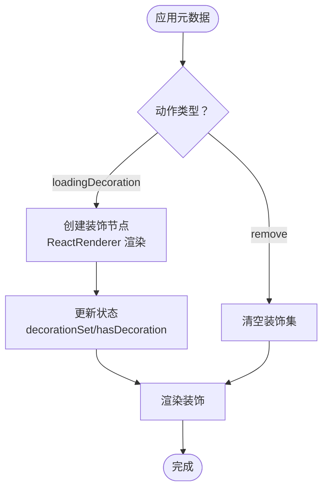
```mermaid
flowchart TD
Start(["应用元数据"]) --> CheckAction{"动作类型？"}
CheckAction --> |loadingDecoration| BuildDeco["创建装饰节点<br/>ReactRenderer 渲染"]
BuildDeco --> ApplyState["更新状态<br/>decorationSet/hasDecoration"]
CheckAction --> |remove| ClearState["清空装饰集"]
ApplyState --> Render["渲染装饰"]
ClearState --> Render
Render --> End(["完成"])
```

**图表来源**
- [packages/plugin-ai/src/ai/text-loading.tsx](file://packages/plugin-ai/src/ai/text-loading.tsx#L1-L146)

**章节来源**
- [packages/plugin-ai/src/ai/text-loading.tsx](file://packages/plugin-ai/src/ai/text-loading.tsx#L1-L146)

### 组件C：静态菜单（AiStaticMenu）
- 功能要点
  - 提供"续写、简化、插入表情、语气改写、翻译"等常用AI操作
  - 每个菜单项调用aiText，基于当前选区与提示词进行生成
- 交互逻辑
  - 点击菜单项 -> 调用aiText -> 删除选区 -> 插入加载装饰 -> 流式插入 -> 移除装饰

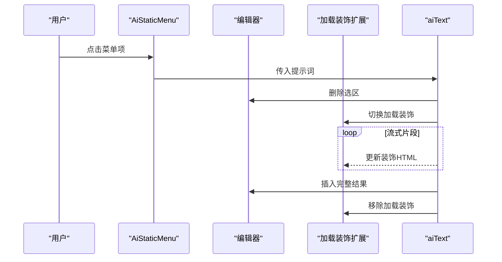
```mermaid
sequenceDiagram
participant U as "用户"
participant M as "AiStaticMenu"
participant E as "编辑器"
participant L as "加载装饰扩展"
participant T as "aiText"
U->>M : 点击菜单项
M->>T : 传入提示词
T->>E : 删除选区
T->>L : 切换加载装饰
loop 流式片段
T-->>L : 更新装饰HTML
end
T->>E : 插入完整结果
T->>L : 移除加载装饰
```

**图表来源**
- [packages/plugin-ai/src/ai/menu/AiStaticMenu.tsx](file://packages/plugin-ai/src/ai/menu/AiStaticMenu.tsx#L1-L48)
- [packages/plugin-ai/src/ai/utils.ts](file://packages/plugin-ai/src/ai/utils.ts#L1-L31)
- [packages/plugin-ai/src/ai/text-loading.tsx](file://packages/plugin-ai/src/ai/text-loading.tsx#L1-L146)

**章节来源**
- [packages/plugin-ai/src/ai/menu/AiStaticMenu.tsx](file://packages/plugin-ai/src/ai/menu/AiStaticMenu.tsx#L1-L48)
- [packages/plugin-ai/src/ai/utils.ts](file://packages/plugin-ai/src/ai/utils.ts#L1-L31)

### 组件D：浮动聊天面板（ExpandableChat + Chat.tsx）
- 功能要点
  - ExpandableChat：悬浮展开/收起、尺寸控制、定位控制
  - Chat.tsx：消息列表、输入框、发送、流式接收、加载态气泡
  - 使用useEditorAgentOptimized与编辑器交互（读取/插入/替换/删除/高亮）
- 交互流程
  - 用户输入 -> 发送 -> Agent流式返回 -> 实时更新当前消息 -> 追加到消息列表 -> 结束后清除当前消息

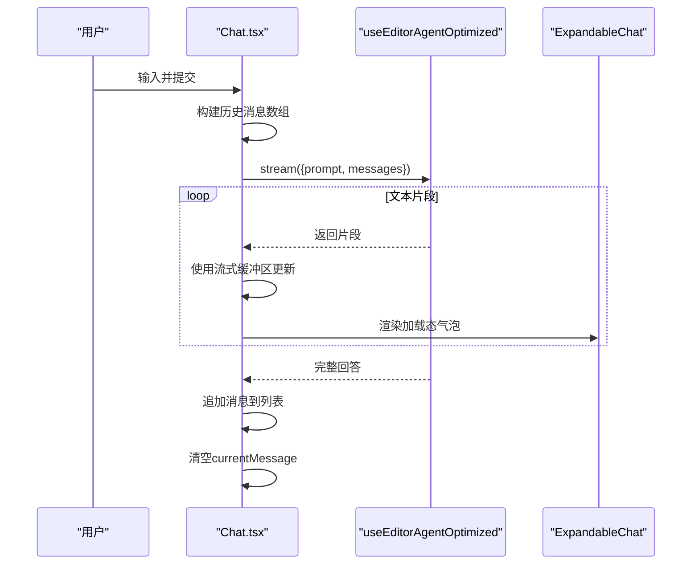
```mermaid
sequenceDiagram
participant U as "用户"
participant C as "Chat.tsx"
participant A as "useEditorAgentOptimized"
participant UI as "ExpandableChat"
U->>C : 输入并提交
C->>C : 构建历史消息数组
C->>A : stream({prompt, messages})
loop 文本片段
A-->>C : 返回片段
C->>C : 使用流式缓冲区更新
C->>UI : 渲染加载态气泡
end
A-->>C : 完整回答
C->>C : 追加消息到列表
C->>C : 清空currentMessage
```

**图表来源**
- [packages/plugin-ai/src/ai/menu/Chat.tsx](file://packages/plugin-ai/src/ai/menu/Chat.tsx#L153-L221)
- [packages/ui/src/components/ui/expandable-chat.tsx](file://packages/ui/src/components/ui/expandable-chat.tsx#L1-L417)
- [packages/core/src/ai/use-agent-optimized.tsx](file://packages/core/src/ai/use-agent-optimized.tsx#L286-L317)

**章节来源**
- [packages/plugin-ai/src/ai/menu/Chat.tsx](file://packages/plugin-ai/src/ai/menu/Chat.tsx#L47-L154)
- [packages/ui/src/components/ui/expandable-chat.tsx](file://packages/ui/src/components/ui/expandable-chat.tsx#L1-L417)
- [packages/core/src/ai/use-agent-optimized.tsx](file://packages/core/src/ai/use-agent-optimized.tsx#L1-L344)

### 组件E：独立AI助手页面（AIAssistantPage）
- 功能要点
  - AIAssistantPage：完整的聊天界面，支持消息历史、工具执行步骤显示
  - AIChatInterface：聊天界面核心组件，处理用户输入和AI响应
  - SystemAgentProvider：全局AI代理提供者，管理代理状态和生命周期
  - 消息历史管理：支持消息持久化和历史记录
- 交互流程
  - 用户输入 -> 创建用户消息 -> 创建AI消息 -> 流式生成 -> 更新消息内容 -> 显示工具执行步骤

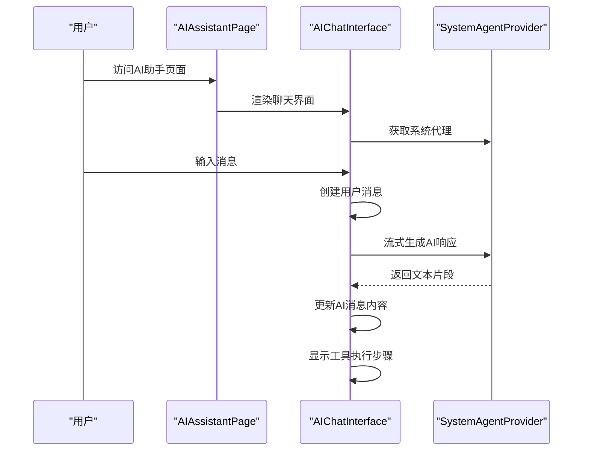
```mermaid
sequenceDiagram
participant U as "用户"
participant P as "AIAssistantPage"
participant I as "AIChatInterface"
participant S as "SystemAgentProvider"
U->>P : 访问AI助手页面
P->>I : 渲染聊天界面
I->>S : 获取系统代理
U->>I : 输入消息
I->>I : 创建用户消息
I->>S : 流式生成AI响应
S-->>I : 返回文本片段
I->>I : 更新AI消息内容
I->>I : 显示工具执行步骤
```

**图表来源**
- [packages/core/src/pages/AIAssistantPage.tsx](file://packages/core/src/pages/AIAssistantPage.tsx#L46-L121)
- [packages/core/src/ai/system-agent/context.tsx](file://packages/core/src/ai/system-agent/context.tsx#L159-L235)

**章节来源**
- [packages/core/src/pages/AIAssistantPage.tsx](file://packages/core/src/pages/AIAssistantPage.tsx#L1-L470)
- [packages/core/src/ai/system-agent/context.tsx](file://packages/core/src/ai/system-agent/context.tsx#L1-L352)

### 组件F：系统代理提供者（SystemAgentProvider）
- 功能要点
  - SystemAgentProvider：全局AI代理提供者，管理代理状态和生命周期
  - SystemAgentContext：系统代理上下文，提供流式生成、工具执行等功能
  - useSystemAgent：系统代理钩子，简化代理使用
  - 流式缓冲区：优化大量文本的渲染性能
- 状态管理
  - isGenerating：是否正在生成
  - streamingContent：当前流式内容
  - error：错误信息
  - executionSteps：工具执行步骤
  - activeSkills：激活的技能

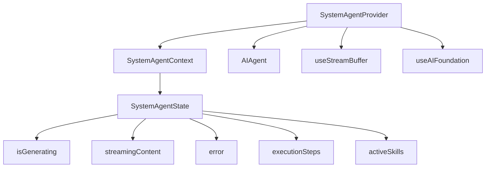
```mermaid
flowchart TD
Provider["SystemAgentProvider"] --> Context["SystemAgentContext"]
Context --> State["SystemAgentState"]
State --> IsGenerating["isGenerating"]
State --> StreamingContent["streamingContent"]
State --> Error["error"]
State --> ExecutionSteps["executionSteps"]
State --> ActiveSkills["activeSkills"]
Provider --> Agent["AIAgent"]
Provider --> StreamBuffer["useStreamBuffer"]
Provider --> Foundation["useAIFoundation"]
```

**图表来源**
- [packages/core/src/ai/system-agent/context.tsx](file://packages/core/src/ai/system-agent/context.tsx#L28-L73)

**章节来源**
- [packages/core/src/ai/system-agent/context.tsx](file://packages/core/src/ai/system-agent/context.tsx#L1-L352)
- [packages/core/src/ai/system-agent/hooks.ts](file://packages/core/src/ai/system-agent/hooks.ts#L1-L256)

### 组件G：AI助手面板（AIAssistantPanel）
- 功能要点
  - AIAssistantPanel：浮动面板，支持键盘快捷键、编辑器绑定
  - AIAssistantTrigger：触发按钮，支持标签显示和键盘快捷键
  - useAIAssistantShortcut：键盘快捷键钩子
  - 消息历史管理：支持消息持久化和历史记录
- 交互流程
  - 用户点击触发按钮 -> 显示浮动面板 -> 用户输入 -> AI响应 -> 显示工具执行步骤

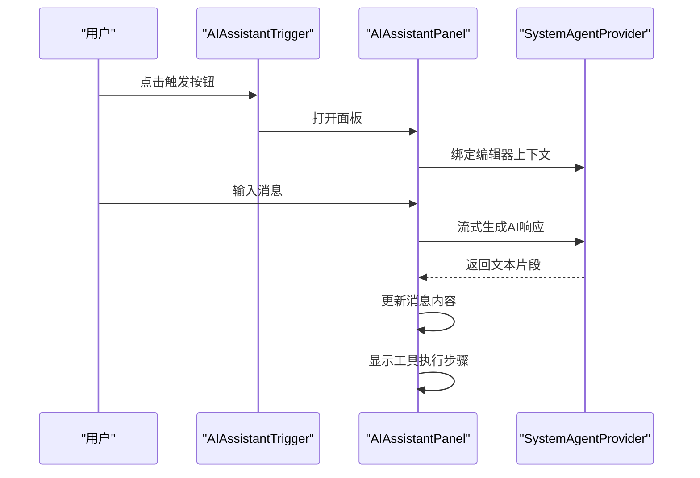
```mermaid
sequenceDiagram
participant U as "用户"
participant T as "AIAssistantTrigger"
participant P as "AIAssistantPanel"
participant S as "SystemAgentProvider"
U->>T : 点击触发按钮
T->>P : 打开面板
P->>S : 绑定编辑器上下文
U->>P : 输入消息
P->>S : 流式生成AI响应
S-->>P : 返回文本片段
P->>P : 更新消息内容
P->>P : 显示工具执行步骤
```

**图表来源**
- [packages/core/src/ai/system-agent/AIAssistantPanel.tsx](file://packages/core/src/ai/system-agent/AIAssistantPanel.tsx#L74-L167)
- [packages/core/src/ai/system-agent/AIAssistantPanel.tsx](file://packages/core/src/ai/system-agent/AIAssistantPanel.tsx#L499-L519)

**章节来源**
- [packages/core/src/ai/system-agent/AIAssistantPanel.tsx](file://packages/core/src/ai/system-agent/AIAssistantPanel.tsx#L1-L520)
- [packages/core/src/ai/system-agent/hooks.ts](file://packages/core/src/ai/system-agent/hooks.ts#L138-L159)

### 组件H：消息历史管理（chat-persistence）
- 功能要点
  - 消息持久化：支持消息保存到localStorage
  - 历史记录：限制最大消息数量和token预算
  - 令牌估算：基于字符长度估算token数量
- 数据结构
  - STORAGE_KEY：localStorage键名
  - MAX_PERSISTED：最大保存消息数
  - MAX_AI_HISTORY：AI上下文最大历史数
  - MAX_AI_TOKENS：AI上下文最大token数

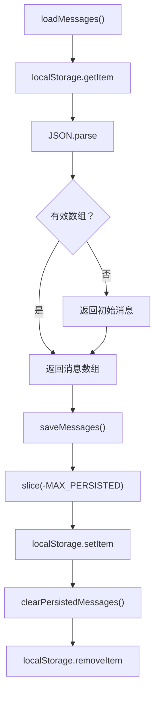
```mermaid
flowchart TD
Load["loadMessages()"] --> LocalStorage["localStorage.getItem"]
LocalStorage --> Parse["JSON.parse"]
Parse --> Valid{"有效数组？"}
Valid --> |是| Return["返回消息数组"]
Valid --> |否| Default["返回初始消息"]
Default --> Return
Return --> Save["saveMessages()"]
Save --> Slice["slice(-MAX_PERSISTED)"]
Slice --> Store["localStorage.setItem"]
Store --> Clear["clearPersistedMessages()"]
Clear --> Remove["localStorage.removeItem"]
```

**图表来源**
- [packages/plugin-ai/src/ai/menu/chat-persistence.ts](file://packages/plugin-ai/src/ai/menu/chat-persistence.ts#L13-L40)

**章节来源**
- [packages/plugin-ai/src/ai/menu/chat-persistence.ts](file://packages/plugin-ai/src/ai/menu/chat-persistence.ts#L1-L68)

### 组件I：图像生成节点（AiImageView）
- 功能要点
  - 展示已生成图片预览
  - 提供提示语输入、生成按钮、删除按钮
  - 生成成功后回填URL至节点属性
- 错误处理
  - 对外部接口错误进行toast提示

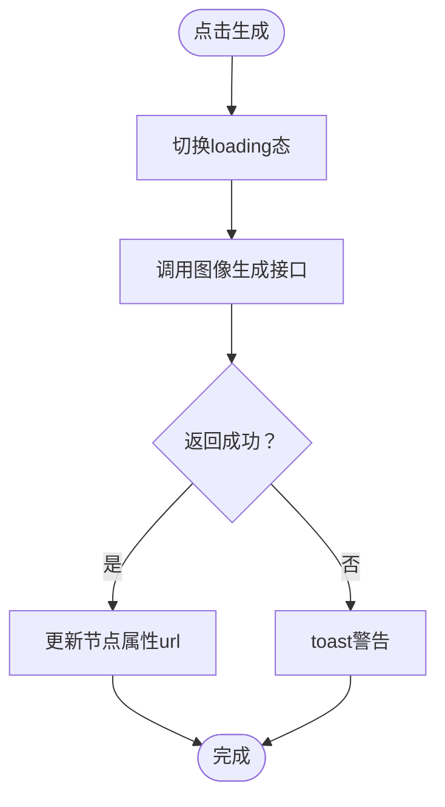
```mermaid
flowchart TD
Start(["点击"生成""]) --> Toggle["切换loading态"]
Toggle --> CallAPI["调用图像生成接口"]
CallAPI --> Resp{"返回成功？"}
Resp --> |是| UpdateAttr["更新节点属性url"]
Resp --> |否| Toast["toast警告"]
UpdateAttr --> End(["完成"])
Toast --> End
```

**图表来源**
- [packages/plugin-ai/src/ai/AiImageView.tsx](file://packages/plugin-ai/src/ai/AiImageView.tsx#L1-L69)
- [packages/plugin-ai/src/ai/utils.ts](file://packages/plugin-ai/src/ai/utils.ts#L43-L58)

**章节来源**
- [packages/plugin-ai/src/ai/AiImageView.tsx](file://packages/plugin-ai/src/ai/AiImageView.tsx#L1-L69)
- [packages/plugin-ai/src/ai/utils.ts](file://packages/plugin-ai/src/ai/utils.ts#L43-L58)

### 组件J：插件装配与本地化（AIExtension、插件注册）
- AIExtension：装配AI节点、图像节点、加载装饰扩展、加载标记、静态菜单、Slash菜单
- 插件注册：提供本地化翻译、名称与状态

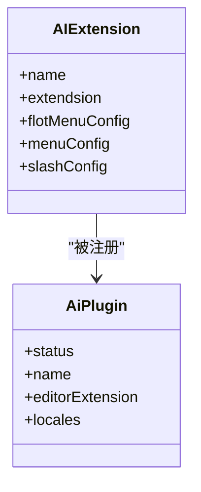
```mermaid
classDiagram
class AIExtension {
+name
+extendsion
+flotMenuConfig
+menuConfig
+slashConfig
}
class AiPlugin {
+status
+name
+editorExtension
+locales
}
AIExtension --> AiPlugin : "被注册"
```

**图表来源**
- [packages/plugin-ai/src/ai/index.tsx](file://packages/plugin-ai/src/ai/index.tsx#L1-L42)
- [packages/plugin-ai/src/index.tsx](file://packages/plugin-ai/src/index.tsx#L1-L35)

**章节来源**
- [packages/plugin-ai/src/ai/index.tsx](file://packages/plugin-ai/src/ai/index.tsx#L1-L42)
- [packages/plugin-ai/src/index.tsx](file://packages/plugin-ai/src/index.tsx#L1-L35)

### 组件K：聊天气泡样式增强（现代渐变背景与视觉层次）
- 功能要点
  - **用户消息**：采用蓝色到青色的渐变背景（from-blue-500 to-cyan-500），圆角设计，右侧圆角较小
  - **AI消息**：采用靛青到紫色的渐变背景（from-indigo-500 to-purple-500），半透明效果，深色模式适配
  - **消息气泡**：AI消息使用柔和的渐变背景（from-indigo-50/50 to-purple-50/50），深色模式下使用深色版本
  - **加载态**：流式消息和加载指示器采用相同的渐变色彩方案，保持视觉一致性
  - **阴影效果**：所有消息气泡添加轻微阴影，提升视觉层次感
- 技术实现
  - 使用Tailwind CSS的渐变类：bg-gradient-to-br
  - 支持深色模式：dark:前缀的类名
  - 边框增强：使用边框透明度类名实现半透明效果
  - 圆角设计：用户消息使用圆角，AI消息使用更圆润的圆角

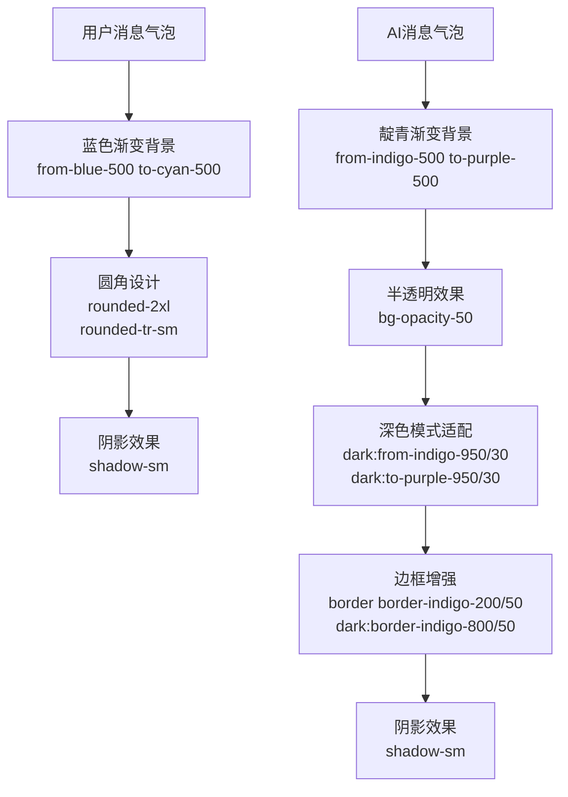
```mermaid
flowchart TD
UserMsg["用户消息气泡"] --> BlueGradient["蓝色渐变背景<br/>from-blue-500 to-cyan-500"]
BlueGradient --> RoundedCorners["圆角设计<br/>rounded-2xl<br/>rounded-tr-sm"]
RoundedCorners --> Shadow["阴影效果<br/>shadow-sm"]
AIMsg["AI消息气泡"] --> IndigoGradient["靛青渐变背景<br/>from-indigo-500 to-purple-500"]
IndigoGradient --> Transparent["半透明效果<br/>bg-opacity-50"]
Transparent --> DarkMode["深色模式适配<br/>dark:from-indigo-950/30<br/>dark:to-purple-950/30"]
DarkMode --> Border["边框增强<br/>border border-indigo-200/50<br/>dark:border-indigo-800/50"]
Border --> Shadow2["阴影效果<br/>shadow-sm"]
```

**图表来源**
- [packages/plugin-ai/src/ai/menu/Chat.tsx](file://packages/plugin-ai/src/ai/menu/Chat.tsx#L395-L415)
- [packages/plugin-ai/src/ai/menu/MessageBubble.tsx](file://packages/plugin-ai/src/ai/menu/MessageBubble.tsx#L55-L58)

**章节来源**
- [packages/plugin-ai/src/ai/menu/Chat.tsx](file://packages/plugin-ai/src/ai/menu/Chat.tsx#L395-L415)
- [packages/plugin-ai/src/ai/menu/MessageBubble.tsx](file://packages/plugin-ai/src/ai/menu/MessageBubble.tsx#L55-L58)

### 组件L：流式缓冲区优化（useStreamingBuffer）
- 功能要点
  - 使用requestAnimationFrame批量更新流式文本，约16fps刷新频率
  - 避免每块文本更新都触发setState（50-100fps），提升渲染性能
  - 支持重置、获取内容、清理等操作
- 性能优化
  - 通过RAF批处理减少重绘次数
  - 及时清理未完成的RAF任务，避免内存泄漏

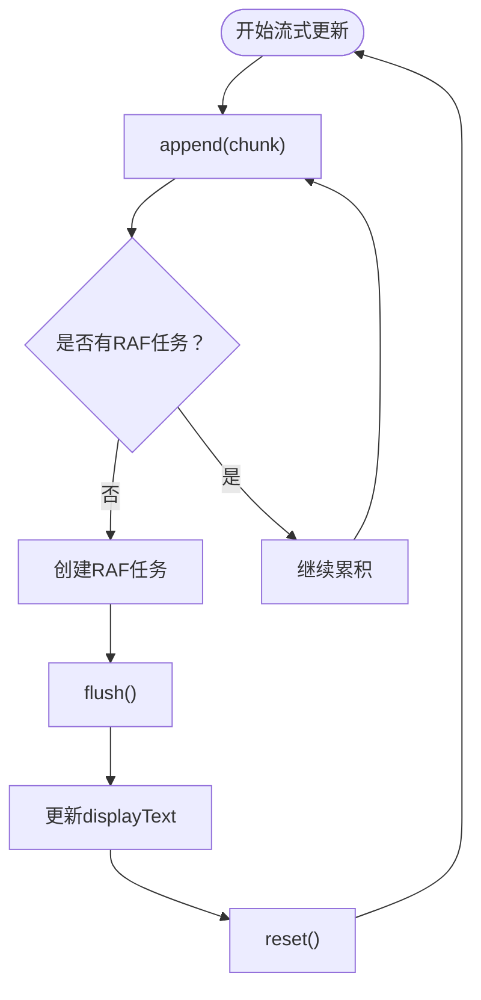
```mermaid
flowchart TD
Start(["开始流式更新"]) --> Append["append(chunk)"]
Append --> RAFCheck{"是否有RAF任务？"}
RAFCheck --> |否| CreateRAF["创建RAF任务"]
CreateRAF --> Flush["flush()"]
RAFCheck --> |是| Continue["继续累积"]
Continue --> Append
Flush --> Update["更新displayText"]
Update --> Reset["reset()"]
Reset --> Start
```

**图表来源**
- [packages/plugin-ai/src/ai/menu/use-streaming-buffer.ts](file://packages/plugin-ai/src/ai/menu/use-streaming-buffer.ts#L17-L22)

**章节来源**
- [packages/plugin-ai/src/ai/menu/use-streaming-buffer.ts](file://packages/plugin-ai/src/ai/menu/use-streaming-buffer.ts#L1-L46)

## 依赖关系分析
- 组件耦合
  - AiView/AiImageView 依赖 utils.ts 的生成函数与编辑器命令
  - 加载装饰扩展与AiView共享toggleLoadingDecoration/removeLoadingDecoration
  - Chat.tsx 依赖 ExpandableChat UI组件与useEditorAgentOptimized
  - **新增** AIAssistantPage 依赖 SystemAgentProvider 和 SystemAgentContext
  - **新增** AIAssistantPanel 依赖 SystemAgentProvider 和 AI助手触发器
  - **新增** 消息历史管理依赖 localStorage 和 chat-types
  - 静态菜单依赖aiText工具函数
  - MessageBubble 依赖 ChatBubble 组件和流式渲染
- 外部依赖
  - @kn/editor：节点、命令、插件、装饰
  - @kn/ui：组件库（Button、Textarea、toast等）
  - @kn/icon：图标
  - @kn/common：国际化、插件框架
  - @kn/core：Agent能力封装
  - streamdown：文本流式渲染库

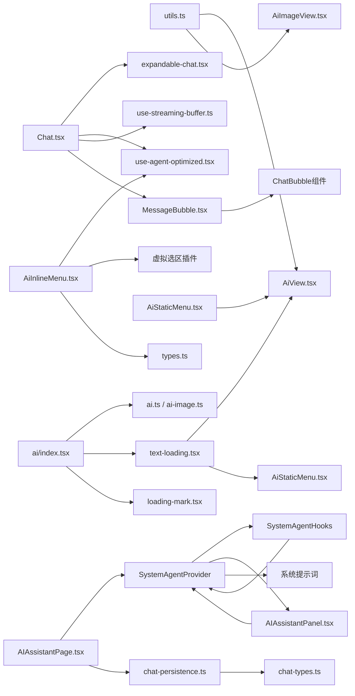
```mermaid
graph LR
Utils["utils.ts"] --> AiView["AiView.tsx"]
Utils --> AiImageView["AiImageView.tsx"]
LoadingExt["text-loading.tsx"] --> AiView
LoadingExt --> AiStaticMenu["AiStaticMenu.tsx"]
Chat["Chat.tsx"] --> Expandable["expandable-chat.tsx"]
Chat --> Agent["use-agent-optimized.tsx"]
InlineMenu["AiInlineMenu.tsx"] --> Agent
InlineMenu --> VirtualSel["虚拟选区插件"]
MessageBubble["MessageBubble.tsx"] --> ChatBubble["ChatBubble组件"]
StaticMenu["AiStaticMenu.tsx"] --> AiView
PluginIdx["ai/index.tsx"] --> Nodes["ai.ts / ai-image.ts"]
PluginIdx --> LoadingExt
PluginIdx --> LoadingMark["loading-mark.tsx"]
Chat --> StreamBuffer["use-streaming-buffer.ts"]
Chat --> MessageBubble
InlineMenu --> Types["types.ts"]
SystemPage["AIAssistantPage.tsx"] --> SystemContext["SystemAgentProvider"]
SystemContext --> SystemHooks["SystemAgentHooks"]
SystemContext --> SystemPanel["AIAssistantPanel.tsx"]
SystemContext --> SystemConstants["系统提示词"]
SystemPage --> ChatPersistence["chat-persistence.ts"]
ChatPersistence --> ChatTypes["chat-types.ts"]
SystemHooks --> SystemContext
SystemPanel --> SystemContext
```

**图表来源**
- [packages/plugin-ai/src/ai/utils.ts](file://packages/plugin-ai/src/ai/utils.ts#L1-L58)
- [packages/plugin-ai/src/ai/AiView.tsx](file://packages/plugin-ai/src/ai/AiView.tsx#L1-L76)
- [packages/plugin-ai/src/ai/AiImageView.tsx](file://packages/plugin-ai/src/ai/AiImageView.tsx#L1-L69)
- [packages/plugin-ai/src/ai/text-loading.tsx](file://packages/plugin-ai/src/ai/text-loading.tsx#L1-L146)
- [packages/plugin-ai/src/ai/menu/AiStaticMenu.tsx](file://packages/plugin-ai/src/ai/menu/AiStaticMenu.tsx#L1-L48)
- [packages/plugin-ai/src/ai/index.tsx](file://packages/plugin-ai/src/ai/index.tsx#L1-L42)
- [packages/plugin-ai/src/ai/marks/loading-mark.tsx](file://packages/plugin-ai/src/ai/marks/loading-mark.tsx#L1-L36)
- [packages/plugin-ai/src/ai/menu/Chat.tsx](file://packages/plugin-ai/src/ai/menu/Chat.tsx#L114-L221)
- [packages/core/src/ai/AiInlineMenu.tsx](file://packages/core/src/ai/AiInlineMenu.tsx#L137-L145)
- [packages/core/src/ai/types.ts](file://packages/core/src/ai/types.ts#L61-L88)
- [packages/plugin-ai/src/ai/menu/MessageBubble.tsx](file://packages/plugin-ai/src/ai/menu/MessageBubble.tsx#L1-L99)
- [packages/ui/src/components/ui/expandable-chat.tsx](file://packages/ui/src/components/ui/expandable-chat.tsx#L1-L417)
- [packages/core/src/ai/use-agent-optimized.tsx](file://packages/core/src/ai/use-agent-optimized.tsx#L1-L344)
- [packages/plugin-ai/src/ai/menu/use-streaming-buffer.ts](file://packages/plugin-ai/src/ai/menu/use-streaming-buffer.ts#L1-L46)
- [packages/core/src/pages/AIAssistantPage.tsx](file://packages/core/src/pages/AIAssistantPage.tsx#L32-L470)
- [packages/core/src/ai/system-agent/context.tsx](file://packages/core/src/ai/system-agent/context.tsx#L1-L352)
- [packages/core/src/ai/system-agent/hooks.ts](file://packages/core/src/ai/system-agent/hooks.ts#L1-L256)
- [packages/core/src/ai/system-agent/AIAssistantPanel.tsx](file://packages/core/src/ai/system-agent/AIAssistantPanel.tsx#L1-L520)
- [packages/plugin-ai/src/ai/menu/chat-persistence.ts](file://packages/plugin-ai/src/ai/menu/chat-persistence.ts#L1-L68)

## 性能与体验建议
- 性能
  - 流式渲染：保持UI无阻塞，建议在前端对片段进行节流/防抖合并
  - 装饰更新：尽量减少DOM重建，优先更新innerHTML而非重新挂载
  - 文档大时：静态菜单与Agent读取范围应限制，避免全量扫描
  - **新增** 流式缓冲区：使用requestAnimationFrame批量更新，约16fps刷新频率
  - **新增** 虚拟选区插件：通过装饰系统实现选区高亮，避免复杂的DOM操作
  - **新增** 系统代理优化：使用useStreamBuffer减少重绘次数，及时清理未完成的RAF任务
  - 渐变渲染：现代浏览器对渐变背景渲染优化良好，无需额外性能考虑
- 交互优化
  - 自动滚动：在消息列表与加载态气泡出现时自动滚动到底部
  - 快捷键：支持Enter发送、Esc关闭面板、Escape关闭内联面板
  - 占位符与提示：输入框提供上下文相关的提示词建议
  - **新增** 键盘导航：内联面板支持Tab键导航、Enter键确认
  - **新增** 点击外部检测：点击面板外自动关闭，提升用户体验
  - **新增** 自动定位：根据选区位置自动计算面板位置，避免超出屏幕边界
  - **新增** 流式生成：支持流式内容更新，实时显示AI响应
  - **新增** 工具执行步骤：实时显示AI执行的工具调用过程，增加透明度
  - **新增** 用户选择对话：支持AI发起的选择对话，提供更好的交互体验
  - 消息气泡：渐变背景提供更好的视觉层次，区分用户和AI消息
- 用户体验
  - 加载态：提供明确的"生成中"指示与进度反馈
  - 错误提示：对外部接口失败进行友好toast提示
  - 本地化：确保中英文文案一致且准确
  - **新增** 消息历史：支持消息持久化，断线重连后可恢复对话
  - **新增** 工具执行步骤：实时显示AI执行的工具调用过程，增加透明度
  - **新增** 用户选择对话：支持AI发起的选择对话，提供更好的交互体验
  - 视觉一致性：渐变色彩方案在整个聊天界面中保持统一

## 故障排查指南
- 生成无响应
  - 检查aiGeneration是否正确触发与流式返回
  - 确认toggleLoadingDecoration是否在开始与结束阶段均被调用
  - **新增** 检查SystemAgentProvider是否正确初始化
  - **新增** 确认useSystemAgentStream钩子是否正确使用
- 装饰不消失
  - 确认removeLoadingDecoration是否在最终插入后调用
  - 检查ProseMirror插件状态是否被正确重置
- 图像生成失败
  - 检查aiImageWriter返回的错误信息并通过toast提示
  - 核对鉴权头与请求体格式
- 聊天面板无法展开
  - 检查ExpandableChat的position与size配置
  - 确认useEditorAgentOptimized的stream调用链路正常
- **新增** 独立AI助手页面问题
  - 检查AIAssistantPage是否正确包裹SystemAgentProvider
  - 确认SystemAgentProvider的defaultOptions配置
  - 验证消息历史持久化是否正常工作
- **新增** 系统代理问题
  - 检查SystemAgentProvider是否正确初始化AIFoundation
  - 确认useStreamBuffer是否正确使用
  - 验证流式内容更新是否正常
- **新增** 内联面板问题
  - 检查AiInlineTrigger是否正确设置虚拟选区高亮
  - 确认AI_INLINE_EVENT事件是否正确触发和监听
  - 验证面板位置计算逻辑，确保不超出屏幕边界
- **新增** 流式缓冲区问题
  - 检查requestAnimationFrame任务是否正确清理
  - 确认流式文本更新频率是否合理
- **新增** 消息历史问题
  - 检查localStorage访问权限
  - 确认消息格式是否符合chat-types定义
  - 验证token估算算法是否正确
- 渐变样式不生效
  - 检查Tailwind CSS配置中的content路径是否包含streamdown库
  - 确认渐变类名拼写正确（bg-gradient-to-br）
  - 验证深色模式类名的正确性（dark:前缀）

**章节来源**
- [packages/plugin-ai/src/ai/utils.ts](file://packages/plugin-ai/src/ai/utils.ts#L1-L58)
- [packages/plugin-ai/src/ai/text-loading.tsx](file://packages/plugin-ai/src/ai/text-loading.tsx#L1-L146)
- [packages/plugin-ai/src/ai/AiImageView.tsx](file://packages/plugin-ai/src/ai/AiImageView.tsx#L1-L69)
- [packages/ui/src/components/ui/expandable-chat.tsx](file://packages/ui/src/components/ui/expandable-chat.tsx#L1-L417)
- [packages/core/src/ai/use-agent-optimized.tsx](file://packages/core/src/ai/use-agent-optimized.tsx#L1-L344)
- [packages/core/src/ai/AiInlineMenu.tsx](file://packages/core/src/ai/AiInlineMenu.tsx#L210-L243)
- [packages/plugin-ai/src/ai/menu/use-streaming-buffer.ts](file://packages/plugin-ai/src/ai/menu/use-streaming-buffer.ts#L36-L42)
- [packages/ui/tailwind.config.js](file://packages/ui/tailwind.config.js#L1-L52)
- [packages/core/src/pages/AIAssistantPage.tsx](file://packages/core/src/pages/AIAssistantPage.tsx#L1-L470)
- [packages/core/src/ai/system-agent/context.tsx](file://packages/core/src/ai/system-agent/context.tsx#L1-L352)
- [packages/plugin-ai/src/ai/menu/chat-persistence.ts](file://packages/plugin-ai/src/ai/menu/chat-persistence.ts#L1-L68)

## 结论
AI聊天界面通过"编辑器内节点 + 全局聊天面板 + 加载态装饰 + Agent能力 + 独立AI助手页面 + 系统代理提供者"形成完整的闭环：既能对文档内容进行智能增强，也能提供全局对话式交互。其模块化设计便于扩展与定制，结合流式渲染与本地化支持，能够满足多样化的编辑场景需求。

**最新更新**包括独立AI助手页面的集成，提供完整的聊天界面和消息历史管理功能。SystemAgentProvider的引入统一了AI代理管理，支持流式生成、工具执行步骤显示和错误处理。AI助手面板增加了键盘快捷键支持和编辑器绑定功能。消息历史管理支持持久化存储和token预算控制，提升了用户体验和系统稳定性。流式缓冲区优化显著提升了大量文本的渲染性能，现代渐变背景和视觉层次改进使消息交流更加直观和美观。

## 附录

### 使用示例：集成到编辑器
- 在插件中注册AIExtension，即可获得：
  - 静态菜单：在工具栏显示AI工具组
  - Slash菜单：/ai、/aiImage
  - AI块与图像块：插入后可直接编辑提示词并生成
  - **新增** 浮动聊天面板：随时与Agent对话并操作编辑器
  - **新增** AI内联助手：编辑器内选区触发，提供智能助手功能
  - **新增** 独立AI助手页面：完整的聊天界面，支持消息历史和工具执行步骤显示

**章节来源**
- [packages/plugin-ai/src/ai/index.tsx](file://packages/plugin-ai/src/ai/index.tsx#L1-L42)
- [packages/plugin-ai/src/index.tsx](file://packages/plugin-ai/src/index.tsx#L1-L35)

### 处理用户消息与显示AI响应
- 浮动聊天面板
  - 用户输入 -> Chat.tsx提交 -> useEditorAgentOptimized.stream接收 -> 实时更新currentMessage -> 追加到消息列表
- **新增** 独立AI助手页面
  - 用户输入 -> AIAssistantPage创建消息 -> SystemAgentProvider流式生成 -> 实时更新消息内容 -> 显示工具执行步骤
- **新增** AI助手面板
  - 用户输入 -> AIAssistantPanel创建消息 -> SystemAgentProvider流式生成 -> 实时更新消息内容 -> 显示工具执行步骤
- 编辑器内生成
  - AiView/AiStaticMenu -> utils.aiText -> 流式插入 -> 装饰更新 -> 最终插入完整结果

**章节来源**
- [packages/plugin-ai/src/ai/menu/Chat.tsx](file://packages/plugin-ai/src/ai/menu/Chat.tsx#L153-L221)
- [packages/core/src/pages/AIAssistantPage.tsx](file://packages/core/src/pages/AIAssistantPage.tsx#L82-L121)
- [packages/core/src/ai/system-agent/AIAssistantPanel.tsx](file://packages/core/src/ai/system-agent/AIAssistantPanel.tsx#L127-L167)
- [packages/plugin-ai/src/ai/utils.ts](file://packages/plugin-ai/src/ai/utils.ts#L1-L31)
- [packages/plugin-ai/src/ai/AiView.tsx](file://packages/plugin-ai/src/ai/AiView.tsx#L1-L76)

### 样式定制与主题适配
- ExpandableChat尺寸与位置：通过size与position参数控制
- 消息气泡：sent/received变体，支持isLoading加载态
- **渐变背景定制**：
  - 用户消息：修改ChatBubbleAvatar的渐变类名（from-blue-500 to-cyan-500）
  - AI消息：修改ChatBubbleMessage的渐变类名（from-indigo-500 to-purple-500）
  - 加载态：使用相同的渐变色彩方案保持视觉一致性
- **新增** 独立AI助手页面样式：
  - 使用渐变背景：from-indigo-500/5 to-purple-500/5
  - 支持深色模式：dark:border-indigo-800/60
  - 圆角设计：rounded-2xl，顶部圆角较小
- **新增** AI助手面板样式：
  - 使用渐变背景：from-indigo-500 to-purple-600
  - 支持深色模式：dark:from-indigo-950/30
  - 圆角设计：rounded-xl，顶部圆角较小
- 装饰样式：可通过CSS类名覆盖loading-decoration容器样式
- 本地化：插件提供中英文翻译键值，可在运行时切换语言
- **深色模式适配**：所有渐变背景都提供了dark:前缀的深色版本

**章节来源**
- [packages/ui/src/components/ui/expandable-chat.tsx](file://packages/ui/src/components/ui/expandable-chat.tsx#L1-L417)
- [packages/plugin-ai/src/index.tsx](file://packages/plugin-ai/src/index.tsx#L1-L35)
- [packages/plugin-ai/src/ai/menu/Chat.tsx](file://packages/plugin-ai/src/ai/menu/Chat.tsx#L395-L415)
- [packages/core/src/pages/AIAssistantPage.tsx](file://packages/core/src/pages/AIAssistantPage.tsx#L164-L431)
- [packages/core/src/ai/system-agent/AIAssistantPanel.tsx](file://packages/core/src/ai/system-agent/AIAssistantPanel.tsx#L210-L454)
- [packages/ui/package.json](file://packages/ui/package.json#L84-L85)
- [packages/ui/tailwind.config.js](file://packages/ui/tailwind.config.js#L1-L52)