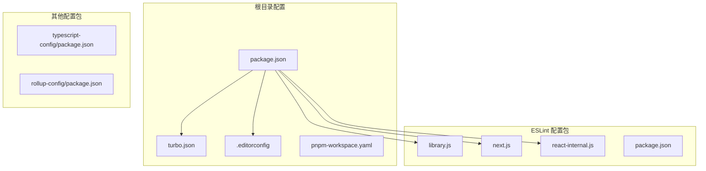
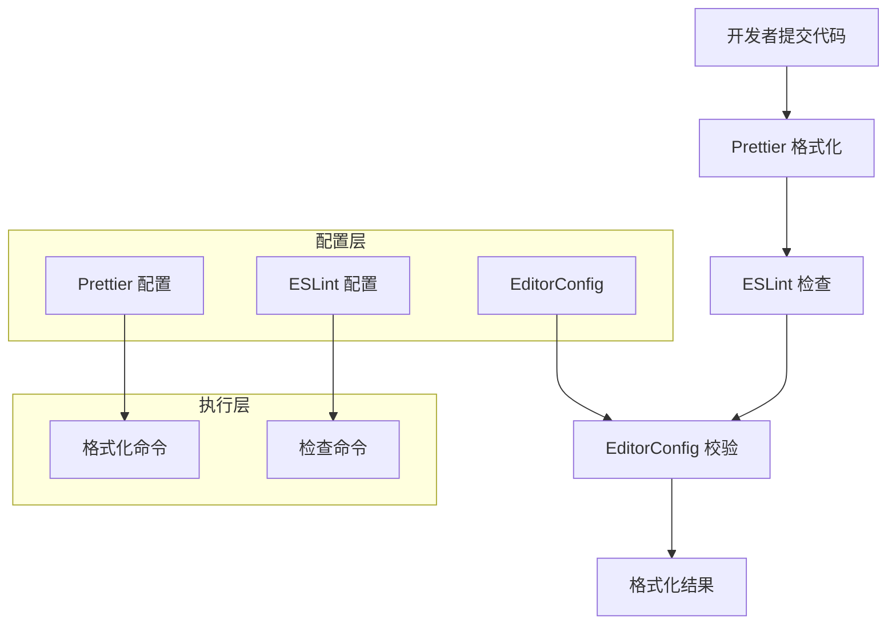

# 格式化工具

<cite>
**本文档引用的文件**
- [README.md](file://README.md)
- [package.json](file://package.json)
- [turbo.json](file://turbo.json)
- [.editorconfig](file://.editorconfig)
- [packages/eslint-config/library.js](file://packages/eslint-config/library.js)
- [packages/eslint-config/next.js](file://packages/eslint-config/next.js)
- [packages/eslint-config/react-internal.js](file://packages/eslint-config/react-internal.js)
- [packages/eslint-config/package.json](file://packages/eslint-config/package.json)
- [packages/typescript-config/package.json](file://packages/typescript-config/package.json)
- [packages/rollup-config/package.json](file://packages/rollup-config/package.json)
- [pnpm-workspace.yaml](file://pnpm-workspace.yaml)
</cite>

## 目录
1. [简介](#简介)
2. [项目结构](#项目结构)
3. [核心组件](#核心组件)
4. [架构概览](#架构概览)
5. [详细组件分析](#详细组件分析)
6. [依赖关系分析](#依赖关系分析)
7. [性能考虑](#性能考虑)
8. [故障排除指南](#故障排除指南)
9. [结论](#结论)

## 简介

本项目采用现代化的代码格式化和质量保证体系，通过多种工具协同工作来确保代码的一致性和可维护性。项目主要使用 Prettier 作为代码格式化工具，结合 ESLint 进行代码质量检查，并通过 Turborepo 实现高效的构建和缓存管理。

该格式化工具系统支持多种文件类型，包括 TypeScript、JavaScript、Markdown 等，并提供了统一的配置标准，确保整个 monorepo 中的代码风格一致性。

## 项目结构

项目采用 Turborepo monorepo 架构，格式化工具分布在多个包中：



**图表来源**
- [package.json:45](file://package.json#L45)
- [packages/eslint-config/library.js:1-35](file://packages/eslint-config/library.js#L1-L35)
- [.editorconfig:1-10](file://.editorconfig#L1-L10)

**章节来源**
- [README.md:66-97](file://README.md#L66-L97)
- [package.json:1-125](file://package.json#L1-L125)
- [pnpm-workspace.yaml:1-4](file://pnpm-workspace.yaml#L1-L4)

## 核心组件

### Prettier 格式化引擎

项目使用 Prettier 3.6.2 作为主要的代码格式化工具，支持多种文件类型的自动格式化：

- **文件类型支持**: TypeScript (.ts, .tsx)、JavaScript (.js, .jsx)、Markdown (.md)
- **命令执行**: `pnpm format`
- **配置范围**: 递归处理所有匹配的文件类型

### ESLint 质量检查

通过 ESLint 提供代码质量检查和错误检测：

- **配置扩展**: 继承 `eslint:recommended`、`prettier`、`turbo` 规则集
- **插件支持**: `@typescript-eslint`、`@vercel/style-guide`、`only-warn`
- **环境配置**: 支持 React 和 TypeScript 环境

### 编辑器配置

.editorconfig 提供基础的编辑器设置：

- **字符编码**: UTF-8
- **换行符**: LF (Linux-style)
- **缩进**: 2个空格
- **尾随空格**: 自动清理
- **文件末尾**: 自动添加换行符

**章节来源**
- [package.json:45](file://package.json#L45)
- [packages/eslint-config/library.js:6-35](file://packages/eslint-config/library.js#L6-L35)
- [.editorconfig:1-10](file://.editorconfig#L1-L10)

## 架构概览

格式化工具系统的整体架构如下：



**图表来源**
- [package.json:45](file://package.json#L45)
- [packages/eslint-config/library.js:6-35](file://packages/eslint-config/library.js#L6-L35)
- [.editorconfig:1-10](file://.editorconfig#L1-L10)

## 详细组件分析

### Prettier 配置分析

Prettier 作为格式化工具的核心配置具有以下特点：

#### 命令定义
- **格式化脚本**: `"format": "prettier --write \"**/*.{ts,tsx,md}\""`
- **文件匹配模式**: 支持 TypeScript、TypeScript React、Markdown 文件
- **批量处理**: 使用通配符递归处理所有匹配文件

#### 配置特性
- **自动修复**: 通过 `--write` 参数直接修改文件
- **递归处理**: 处理所有子目录中的匹配文件
- **多语言支持**: 统一处理前端开发中的主要文件类型

**章节来源**
- [package.json:45](file://package.json#L45)

### ESLint 配置体系

ESLint 提供了三个不同场景的配置文件：

#### library.js 配置
适用于通用库项目的配置：
- **继承规则**: `eslint:recommended` + `prettier` + `turbo`
- **忽略模式**: 忽略 dotfiles、node_modules、dist 目录
- **全局变量**: 支持 React 和 JSX 全局变量

#### next.js 配置
针对 Next.js 应用的专门配置：
- **框架集成**: 集成 `@vercel/style-guide` 的 Next.js 规则
- **浏览器环境**: 同时支持 node 和 browser 环境
- **路径解析**: 配置 TypeScript 路径解析

#### react-internal.js 配置
内部 React 库的定制配置：
- **打包场景**: 针对被其他包引用的库
- **文件类型**: 强制 ESLint 识别 .tsx 文件
- **环境优化**: 优化浏览器环境下的检查

**章节来源**
- [packages/eslint-config/library.js:1-35](file://packages/eslint-config/library.js#L1-L35)
- [packages/eslint-config/next.js:1-36](file://packages/eslint-config/next.js#L1-L36)
- [packages/eslint-config/react-internal.js:1-40](file://packages/eslint-config/react-internal.js#L1-L40)

### EditorConfig 统一标准

EditorConfig 提供基础的编辑器设置，确保团队协作中的一致性：

#### 基础设置
- **字符编码**: UTF-8 支持国际化开发
- **换行符**: LF 统一跨平台兼容性
- **缩进风格**: 空格缩进，避免制表符问题

#### 编辑行为
- **尾随空格**: 自动清理，保持代码整洁
- **文件末尾**: 自动添加换行符，避免 Git 差异
- **统一标准**: 所有开发者使用相同的编辑器设置

**章节来源**
- [.editorconfig:1-10](file://.editorconfig#L1-L10)

## 依赖关系分析

格式化工具之间的依赖关系如下：

```mermaid
graph LR
subgraph "开发依赖"
Prettier[prettier ^3.6.2]
ESLint[eslint ^8.x]
TSParser[@typescript-eslint/parser]
TSPlugin[@typescript-eslint/eslint-plugin]
StyleGuide[@vercel/style-guide]
PrettierPlugin[eslint-config-prettier]
TurboPlugin[eslint-config-turbo]
end
subgraph "运行时依赖"
TSConfig[typescript ^5.x]
NodePath[node:path 解析]
end
subgraph "配置包"
ESLintConfig[eslint-config 包]
TSConfigPkg[typescript-config 包]
RollupConfig[rollup-config 包]
end
Prettier --> ESLintConfig
ESLint --> TSParser
ESLint --> TSPlugin
ESLint --> StyleGuide
ESLint --> PrettierPlugin
ESLint --> TurboPlugin
TSParser --> TSConfig
NodePath --> ESLintConfig
```

**图表来源**
- [package.json:82-112](file://package.json#L82-L112)
- [packages/eslint-config/package.json:1-20](file://packages/eslint-config/package.json#L1-L20)

### 依赖特性分析

#### 主要依赖
- **Prettier**: 核心格式化工具，提供代码美化功能
- **ESLint**: 代码质量检查，发现潜在问题
- **TypeScript**: 类型检查和语言支持

#### 配置依赖
- **@typescript-eslint**: TypeScript 专用 ESLint 插件
- **@vercel/style-guide**: Vercel 推荐的代码风格规范
- **eslint-config-prettier**: 解决 ESLint 和 Prettier 的冲突

**章节来源**
- [package.json:82-112](file://package.json#L82-L112)
- [packages/eslint-config/package.json:1-20](file://packages/eslint-config/package.json#L1-L20)

## 性能考虑

### 缓存策略

Turborepo 提供了高效的缓存机制：

- **任务缓存**: `pnpm dev` 任务设置为持久缓存
- **增量构建**: 只重新构建受影响的包
- **并行执行**: 支持多任务并行处理

### 格式化性能优化

- **文件过滤**: 通过精确的文件匹配减少不必要的处理
- **增量检查**: 只检查修改过的文件
- **内存管理**: 合理的内存使用避免大文件处理问题

## 故障排除指南

### 常见问题及解决方案

#### 格式化不生效
1. **检查 Prettier 版本**: 确保使用兼容的版本
2. **验证文件类型**: 确认文件扩展名在配置中
3. **检查权限**: 确保有文件写入权限

#### ESLint 报错
1. **规则冲突**: 检查是否与 Prettier 规则冲突
2. **配置继承**: 验证配置文件的正确继承关系
3. **路径解析**: 确认 TypeScript 路径配置正确

#### EditorConfig 不兼容
1. **编辑器支持**: 确认使用的编辑器支持 EditorConfig
2. **文件位置**: 确保 .editorconfig 文件位于正确的目录层级
3. **配置覆盖**: 检查是否有更高优先级的配置文件

**章节来源**
- [package.json:45](file://package.json#L45)
- [packages/eslint-config/library.js:23-28](file://packages/eslint-config/library.js#L23-L28)

## 结论

该项目的格式化工具系统通过 Prettier、ESLint 和 EditorConfig 的协同工作，建立了完整的代码质量保证体系。该系统具有以下优势：

1. **统一标准**: 通过共享配置确保整个团队的代码风格一致
2. **自动化程度高**: 支持一键格式化和检查
3. **可扩展性强**: 易于添加新的规则和配置
4. **性能优化**: 利用 Turborepo 实现高效的构建和缓存

建议在团队开发中：
- 定期更新格式化工具版本
- 维护和优化配置规则
- 在 CI/CD 流程中集成格式化检查
- 为新成员提供格式化工具使用指南