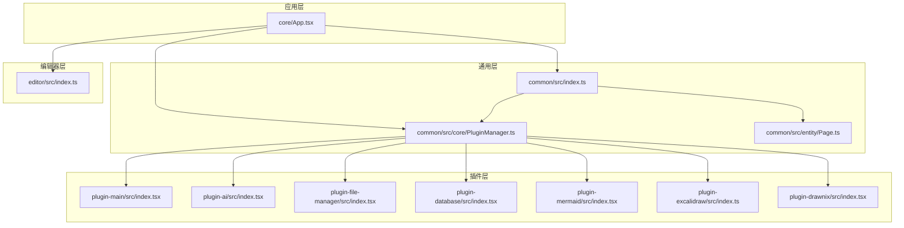
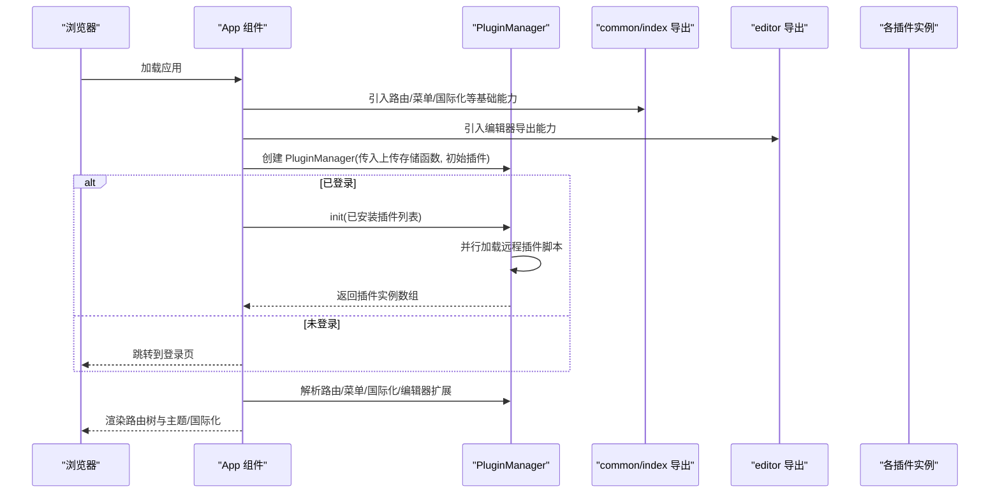
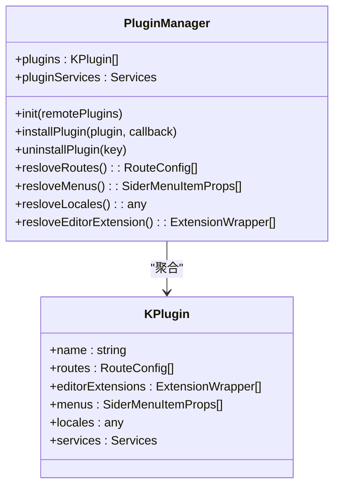
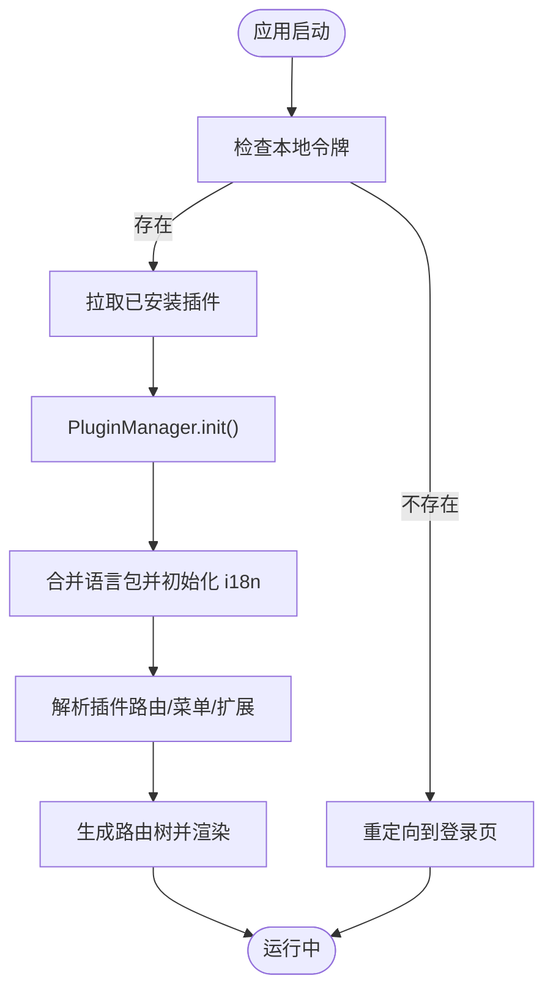
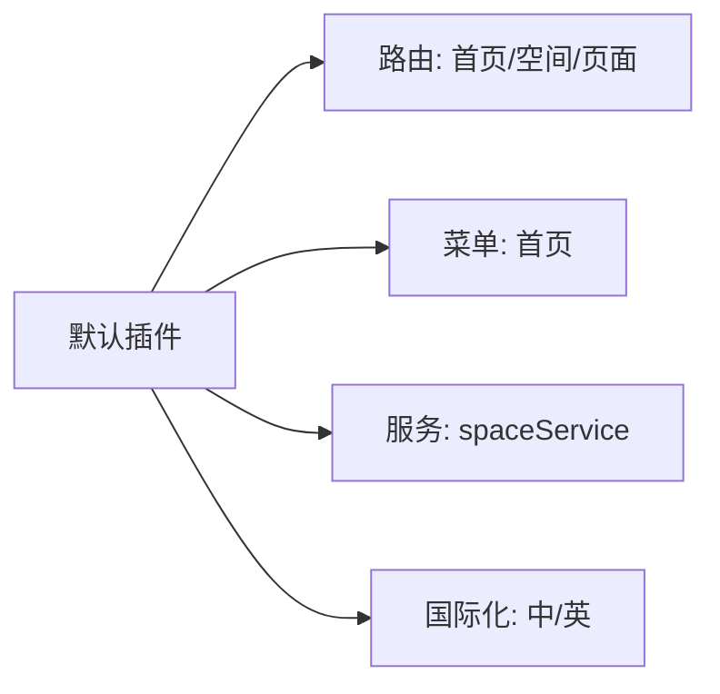
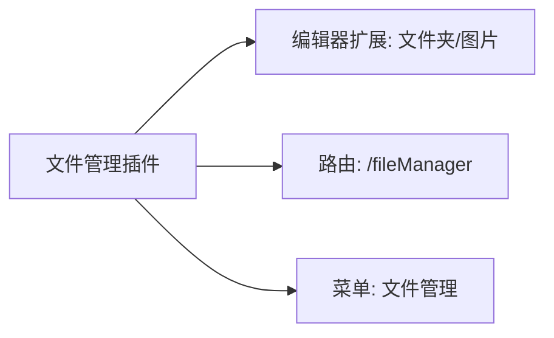
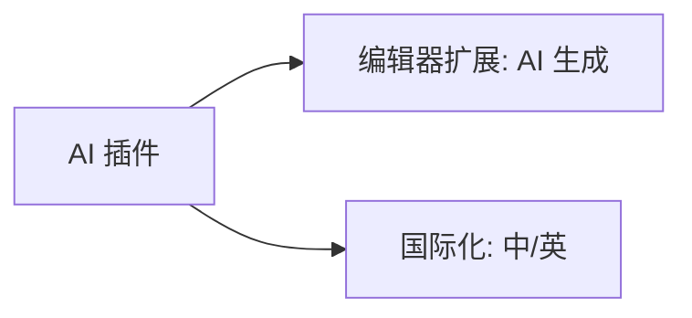
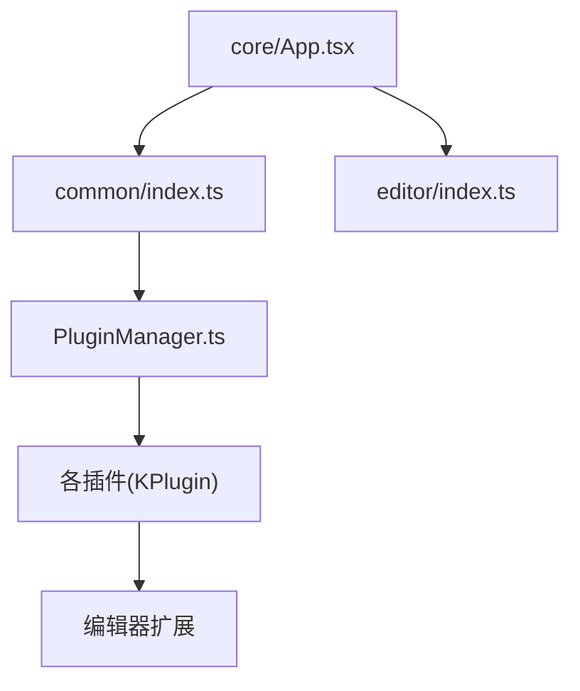

# 功能模块

<cite>
**本文引用的文件**
- [packages/common/src/index.ts](file://packages/common/src/index.ts)
- [packages/common/src/core/PluginManager.ts](file://packages/common/src/core/PluginManager.ts)
- [packages/common/src/entity/Page.ts](file://packages/common/src/entity/Page.ts)
- [packages/core/src/App.tsx](file://packages/core/src/App.tsx)
- [packages/editor/src/index.ts](file://packages/editor/src/index.ts)
- [packages/plugin-main/src/index.tsx](file://packages/plugin-main/src/index.tsx)
- [packages/plugin-ai/src/index.tsx](file://packages/plugin-ai/src/index.tsx)
- [packages/plugin-file-manager/src/index.tsx](file://packages/plugin-file-manager/src/index.tsx)
- [packages/plugin-database/src/index.tsx](file://packages/plugin-database/src/index.tsx)
- [packages/plugin-mermaid/src/index.tsx](file://packages/plugin-mermaid/src/index.tsx)
- [packages/plugin-drawnix/src/index.tsx](file://packages/plugin-drawnix/src/index.tsx)
- [packages/plugin-excalidraw/src/index.ts](file://packages/plugin-excalidraw/src/index.ts)
</cite>

## 目录
1. [简介](#简介)
2. [项目结构](#项目结构)
3. [核心组件](#核心组件)
4. [架构总览](#架构总览)
5. [详细组件分析](#详细组件分析)
6. [依赖关系分析](#依赖关系分析)
7. [性能考虑](#性能考虑)
8. [故障排查指南](#故障排查指南)
9. [结论](#结论)
10. [附录](#附录)

## 简介
本文件面向知识库管理系统的功能模块，系统以“插件化”为核心设计，围绕空间管理、页面编辑与内容组织展开，并提供完善的插件生态：默认插件、文件管理插件、数据库插件、AI 插件、图表（Mermaid）插件、绘图（Excalidraw）插件与思维导图（Drawnix/思维导图画布）插件。本文将从系统架构、组件关系、数据流、处理逻辑、集成点、错误处理与性能特征等维度进行深入解析，并给出插件开发与扩展的最佳实践。

## 项目结构
系统采用多包工作区（monorepo），核心模块与插件按功能域拆分：
- common：通用能力（插件基类、路由、菜单、类型、实体、国际化等）
- core：应用入口与全局上下文（路由、主题、国际化、插件管理器初始化）
- editor：富文本编辑器内核与扩展（Tiptap/ProseMirror 扩展体系、工具栏、节点视图等）
- plugin-*：各类插件（默认空间与页面、文件管理、数据库、AI、Mermaid、Excalidraw、Drawnix）

**图表来源**
- [packages/core/src/App.tsx](file://packages/core/src/App.tsx#L1-L187)
- [packages/common/src/index.ts](file://packages/common/src/index.ts#L1-L16)
- [packages/common/src/core/PluginManager.ts](file://packages/common/src/core/PluginManager.ts#L1-L170)
- [packages/common/src/entity/Page.ts](file://packages/common/src/entity/Page.ts#L1-L8)
- [packages/editor/src/index.ts](file://packages/editor/src/index.ts#L1-L23)
- [packages/plugin-main/src/index.tsx](file://packages/plugin-main/src/index.tsx#L1-L118)
- [packages/plugin-ai/src/index.tsx](file://packages/plugin-ai/src/index.tsx#L1-L35)
- [packages/plugin-file-manager/src/index.tsx](file://packages/plugin-file-manager/src/index.tsx#L1-L38)
- [packages/plugin-database/src/index.tsx](file://packages/plugin-database/src/index.tsx#L1-L17)
- [packages/plugin-mermaid/src/index.tsx](file://packages/plugin-mermaid/src/index.tsx#L1-L17)
- [packages/plugin-excalidraw/src/index.ts](file://packages/plugin-excalidraw/src/index.ts#L1-L19)
- [packages/plugin-drawnix/src/index.tsx](file://packages/plugin-drawnix/src/index.tsx#L1-L14)

**章节来源**
- [packages/core/src/App.tsx](file://packages/core/src/App.tsx#L1-L187)
- [packages/common/src/index.ts](file://packages/common/src/index.ts#L1-L16)
- [packages/common/src/core/PluginManager.ts](file://packages/common/src/core/PluginManager.ts#L1-L170)
- [packages/common/src/entity/Page.ts](file://packages/common/src/entity/Page.ts#L1-L8)
- [packages/editor/src/index.ts](file://packages/editor/src/index.ts#L1-L23)
- [packages/plugin-main/src/index.tsx](file://packages/plugin-main/src/index.tsx#L1-L118)
- [packages/plugin-ai/src/index.tsx](file://packages/plugin-ai/src/index.tsx#L1-L35)
- [packages/plugin-file-manager/src/index.tsx](file://packages/plugin-file-manager/src/index.tsx#L1-L38)
- [packages/plugin-database/src/index.tsx](file://packages/plugin-database/src/index.tsx#L1-L17)
- [packages/plugin-mermaid/src/index.tsx](file://packages/plugin-mermaid/src/index.tsx#L1-L17)
- [packages/plugin-excalidraw/src/index.ts](file://packages/plugin-excalidraw/src/index.ts#L1-L19)
- [packages/plugin-drawnix/src/index.tsx](file://packages/plugin-drawnix/src/index.tsx#L1-L14)

## 核心组件
- 插件基类与管理器
  - KPlugin：统一的插件配置载体，支持 routes、menus、editorExtension、locales、services 等字段
  - PluginManager：负责插件加载、合并服务、解析路由/菜单/编辑器扩展、国际化资源合并、安装/卸载与刷新事件
- 应用入口
  - App：根据登录状态决定是否拉取已安装插件并初始化；完成国际化资源合并后生成路由树并渲染
- 编辑器导出
  - editor 包导出编辑器核心能力与扩展工具，供各插件注入扩展
- 默认插件
  - 提供空间与页面的路由、菜单、服务与本地化资源

**章节来源**
- [packages/common/src/core/PluginManager.ts](file://packages/common/src/core/PluginManager.ts#L1-L170)
- [packages/core/src/App.tsx](file://packages/core/src/App.tsx#L1-L187)
- [packages/editor/src/index.ts](file://packages/editor/src/index.ts#L1-L23)
- [packages/plugin-main/src/index.tsx](file://packages/plugin-main/src/index.tsx#L1-L118)

## 架构总览
系统通过 PluginManager 将多个插件整合为统一的应用运行时，形成“插件即功能”的架构模式。App 在初始化阶段根据用户登录状态与已安装插件动态构建路由与菜单，并在国际化阶段合并各插件的语言资源。

**图表来源**
- [packages/core/src/App.tsx](file://packages/core/src/App.tsx#L1-L187)
- [packages/common/src/core/PluginManager.ts](file://packages/common/src/core/PluginManager.ts#L1-L170)
- [packages/editor/src/index.ts](file://packages/editor/src/index.ts#L1-L23)
- [packages/common/src/index.ts](file://packages/common/src/index.ts#L1-L16)

## 详细组件分析

### 插件管理器与插件基类
- 设计要点
  - KPlugin 作为插件配置容器，暴露 routes/menus/editorExtensions/locales/services 等只读访问器
  - PluginManager 负责：
    - 初始化：合并初始插件与远程插件（通过统一的资源存储函数加载脚本）
    - 运行期：解析路由、菜单、编辑器扩展、国际化资源
    - 生命周期：安装/卸载插件，触发刷新事件
- 关键流程
  - 初始化：并行加载远程插件脚本，合并服务与插件集合
  - 安装/卸载：动态更新插件集合，合并服务，发出刷新事件
  - 解析：将所有插件的 routes/menus/locales/extensions 合并输出

**图表来源**
- [packages/common/src/core/PluginManager.ts](file://packages/common/src/core/PluginManager.ts#L1-L170)

**章节来源**
- [packages/common/src/core/PluginManager.ts](file://packages/common/src/core/PluginManager.ts#L1-L170)

### 应用入口与初始化流程
- 登录态判断：若存在令牌则拉取已安装插件并初始化；否则跳转登录页或渲染登录/注册路由
- 国际化：合并插件语言包，初始化 i18n
- 路由：基于插件解析出的路由配置生成路由树
- 上下文：向全局提供 AppContext（含 PluginManager）与主题、模态框、Redux Store

**图表来源**
- [packages/core/src/App.tsx](file://packages/core/src/App.tsx#L1-L187)
- [packages/common/src/core/PluginManager.ts](file://packages/common/src/core/PluginManager.ts#L1-L170)

**章节来源**
- [packages/core/src/App.tsx](file://packages/core/src/App.tsx#L1-L187)

### 默认插件（空间与页面）
- 功能范围
  - 路由：首页、空间列表、空间详情（含页面查看/编辑/设置）
  - 菜单：首页入口
  - 服务：spaceService（用于空间相关业务）
  - 国际化：中英文文案
- 使用方式
  - 作为初始插件注入 App，即可获得空间与页面的基础导航与页面骨架

**图表来源**
- [packages/plugin-main/src/index.tsx](file://packages/plugin-main/src/index.tsx#L1-L118)

**章节来源**
- [packages/plugin-main/src/index.tsx](file://packages/plugin-main/src/index.tsx#L1-L118)

### 文件管理插件
- 功能特性
  - 编辑器扩展：文件夹与图片扩展，支持在编辑器中插入/管理附件
  - 页面路由：提供文件管理页面
  - 菜单入口：文件管理菜单项
- 使用方法
  - 在编辑器中通过扩展插入文件夹/图片节点；在侧边栏点击菜单进入文件管理页面

**图表来源**
- [packages/plugin-file-manager/src/index.tsx](file://packages/plugin-file-manager/src/index.tsx#L1-L38)

**章节来源**
- [packages/plugin-file-manager/src/index.tsx](file://packages/plugin-file-manager/src/index.tsx#L1-L38)

### 数据库插件
- 功能特性
  - 编辑器扩展：数据库视图扩展，支持在编辑器中插入/编辑表格型数据库视图
- 使用方法
  - 在编辑器中通过扩展插入数据库节点，进行行列增删改查与视图切换

**图表来源**
- [packages/plugin-database/src/index.tsx](file://packages/plugin-database/src/index.tsx#L1-L17)

**章节来源**
- [packages/plugin-database/src/index.tsx](file://packages/plugin-database/src/index.tsx#L1-L17)

### AI 插件
- 功能特性
  - 编辑器扩展：AI 生成相关扩展（如提示、占位、生成视图等）
  - 国际化：中英文文案
- 使用方法
  - 在编辑器中通过扩展触发 AI 生成流程，查看生成结果与操作入口

**图表来源**
- [packages/plugin-ai/src/index.tsx](file://packages/plugin-ai/src/index.tsx#L1-L35)

**章节来源**
- [packages/plugin-ai/src/index.tsx](file://packages/plugin-ai/src/index.tsx#L1-L35)

### 图表（Mermaid）插件
- 功能特性
  - 编辑器扩展：Mermaid 图表扩展，支持在编辑器中插入/编辑 Mermaid 流程图/时序图/类图等
- 使用方法
  - 在编辑器中通过扩展插入 Mermaid 节点，编辑语法并预览渲染效果

**图表来源**
- [packages/plugin-mermaid/src/index.tsx](file://packages/plugin-mermaid/src/index.tsx#L1-L17)

**章节来源**
- [packages/plugin-mermaid/src/index.tsx](file://packages/plugin-mermaid/src/index.tsx#L1-L17)

### 绘图（Excalidraw）插件
- 功能特性
  - 编辑器扩展：Excalidraw 画板扩展，支持在编辑器中嵌入手绘风格的矢量绘图
- 使用方法
  - 在编辑器中通过扩展插入 Excalidraw 节点，打开画板进行绘制

**图表来源**
- [packages/plugin-excalidraw/src/index.ts](file://packages/plugin-excalidraw/src/index.ts#L1-L19)

**章节来源**
- [packages/plugin-excalidraw/src/index.ts](file://packages/plugin-excalidraw/src/index.ts#L1-L19)

### 思维导图（Drawnix/思维导图画布）插件
- 功能特性
  - 编辑器扩展：思维导图扩展，支持在编辑器中插入/编辑思维导图节点
- 使用方法
  - 在编辑器中通过扩展插入思维导图节点，进行层级化结构编辑

**图表来源**
- [packages/plugin-drawnix/src/index.tsx](file://packages/plugin-drawnix/src/index.tsx#L1-L14)

**章节来源**
- [packages/plugin-drawnix/src/index.tsx](file://packages/plugin-drawnix/src/index.tsx#L1-L14)

### 编辑器扩展与工具栏
- 编辑器导出
  - editor 包导出编辑器核心 API（如 useEditor、EditorContent、NodeView 等）以及扩展工具（BubbleMenu、Resizable 等）
- 扩展注入
  - 各插件通过 editorExtension 将扩展注入编辑器，形成统一的编辑体验
- 典型扩展类型
  - 文本样式、列表、标题、链接、图片、表格、数据库、Mermaid、Excalidraw、Drawnix 等

**章节来源**
- [packages/editor/src/index.ts](file://packages/editor/src/index.ts#L1-L23)

## 依赖关系分析
- 模块耦合
  - core 对 common 与 editor 存在直接依赖，用于构建路由、国际化与编辑器能力
  - plugin-* 仅通过 common 的 KPlugin/PluginManager 接口与核心交互，保持低耦合
- 外部依赖
  - 路由与国际化：React Router、i18next
  - 编辑器：Tiptap/ProseMirror 生态
  - 插件加载：动态 importScript（通过统一的资源存储函数拼接 URL）
- 循环依赖
  - 当前结构未见循环依赖迹象；插件通过 PluginManager 聚合，避免直接相互引用

**图表来源**
- [packages/core/src/App.tsx](file://packages/core/src/App.tsx#L1-L187)
- [packages/common/src/index.ts](file://packages/common/src/index.ts#L1-L16)
- [packages/common/src/core/PluginManager.ts](file://packages/common/src/core/PluginManager.ts#L1-L170)
- [packages/editor/src/index.ts](file://packages/editor/src/index.ts#L1-L23)

**章节来源**
- [packages/core/src/App.tsx](file://packages/core/src/App.tsx#L1-L187)
- [packages/common/src/core/PluginManager.ts](file://packages/common/src/core/PluginManager.ts#L1-L170)

## 性能考虑
- 插件加载策略
  - 使用并行加载远程插件脚本，减少初始化时间
  - 通过统一的资源存储函数缓存与去重加载
- 路由与菜单解析
  - 在初始化完成后一次性解析并构建路由树，避免运行期重复计算
- 国际化合并
  - 合并语言包时使用深合并策略，避免覆盖已有词条
- 编辑器扩展
  - 建议按需启用扩展，避免一次性注入过多扩展导致渲染压力

[本节为通用指导，无需具体文件分析]

## 故障排查指南
- 插件安装/卸载无效
  - 确认通过 PluginManager.installPlugin/uninstallPlugin 触发 REFRESH_PLUSINS 事件
  - 检查资源存储函数返回的 URL 是否可访问
- 路由不生效
  - 确认插件 routes 字段正确，路径唯一且无冲突
  - 检查 App 是否在初始化完成后重新构建路由树
- 国际化缺失
  - 确认插件 locales 字段结构正确，键名与命名空间一致
  - 检查 i18n 初始化参数与支持语言列表
- 编辑器扩展未显示
  - 确认 editorExtension 注入成功，扩展名称与菜单/工具栏映射正确
  - 检查编辑器 Kit 是否包含对应扩展

**章节来源**
- [packages/common/src/core/PluginManager.ts](file://packages/common/src/core/PluginManager.ts#L1-L170)
- [packages/core/src/App.tsx](file://packages/core/src/App.tsx#L1-L187)

## 结论
该系统以“插件即功能”的理念，通过 PluginManager 实现插件的统一加载、解析与运行时管理，结合 core 的路由与国际化能力，形成可扩展的知识库管理平台。默认插件提供空间与页面的核心骨架，其他插件（文件管理、数据库、AI、图表、绘图、思维导图）通过编辑器扩展无缝融入编辑体验。建议在扩展新插件时遵循统一的配置接口与生命周期，确保良好的可维护性与性能表现。

[本节为总结，无需具体文件分析]

## 附录

### 插件开发指南与最佳实践
- 插件配置
  - 使用 KPlugin 构造函数传入标准配置对象，包含 name、status、routes、menus、editorExtension、locales、services
- 编辑器扩展
  - 在 editorExtension 中注入扩展，确保扩展名称与菜单/工具栏映射一致
- 路由与菜单
  - routes 与 menus 字段应与页面/功能一一对应，路径唯一，菜单图标与文案清晰
- 国际化
  - locales 采用标准 i18n 结构，键名语义化，避免覆盖已有词条
- 服务与状态
  - services 提供插件所需的服务接口，配合 Redux 或全局状态管理
- 安装与卸载
  - 使用 PluginManager.installPlugin/uninstallPlugin 动态管理插件，注意刷新事件与依赖清理
- 性能优化
  - 控制扩展数量与复杂度，按需加载远程插件，避免阻塞初始化

**章节来源**
- [packages/common/src/core/PluginManager.ts](file://packages/common/src/core/PluginManager.ts#L1-L170)
- [packages/plugin-main/src/index.tsx](file://packages/plugin-main/src/index.tsx#L1-L118)
- [packages/plugin-ai/src/index.tsx](file://packages/plugin-ai/src/index.tsx#L1-L35)
- [packages/plugin-file-manager/src/index.tsx](file://packages/plugin-file-manager/src/index.tsx#L1-L38)
- [packages/plugin-database/src/index.tsx](file://packages/plugin-database/src/index.tsx#L1-L17)
- [packages/plugin-mermaid/src/index.tsx](file://packages/plugin-mermaid/src/index.tsx#L1-L17)
- [packages/plugin-excalidraw/src/index.ts](file://packages/plugin-excalidraw/src/index.ts#L1-L19)
- [packages/plugin-drawnix/src/index.tsx](file://packages/plugin-drawnix/src/index.tsx#L1-L14)

### 数据模型参考
- 分页实体
  - Page<T>：records、current、pageSize、total 字段构成标准分页结构

**章节来源**
- [packages/common/src/entity/Page.ts](file://packages/common/src/entity/Page.ts#L1-L8)