# 协作邀请对话框

<cite>
**本文档引用的文件**
- [packages/plugin-main/src/pages/InviteCollaboration/index.tsx](file://packages/plugin-main/src/pages/InviteCollaboration/index.tsx)
- [packages/plugin-main/src/api/index.ts](file://packages/plugin-main/src/api/index.ts)
- [packages/plugin-main/docs/COLLABORATION_API.md](file://packages/plugin-main/docs/COLLABORATION_API.md)
- [packages/editor/src/editor/collaboration.tsx](file://packages/editor/src/editor/collaboration.tsx)
- [packages/common/src/core/PluginManager.ts](file://packages/common/src/core/PluginManager.ts)
- [packages/ui/src/components/ui/button.tsx](file://packages/ui/src/components/ui/button.tsx)
- [packages/ui/src/components/ui/avatar.tsx](file://packages/ui/src/components/ui/avatar.tsx)
- [packages/ui/src/components/ui/badge.tsx](file://packages/ui/src/components/ui/badge.tsx)
- [packages/plugin-main/src/pages/components/CollaborationInvitationDlg.tsx](file://packages/plugin-main/src/pages/components/CollaborationInvitationDlg.tsx)
- [.env.example](file://.env.example)
- [apps/vite/.env.production](file://apps/vite/.env.production)
- [apps/vite/.env.development](file://apps/vite/.env.development)
</cite>

## 更新摘要
**变更内容**
- 更新了WebSocket服务器URL配置，确保协作邀请功能在生产环境正常工作
- 新增了环境变量配置说明，支持不同环境的WebSocket服务器设置
- 增强了WebSocket服务器URL的可配置性和环境适应性
- 更新了协作邀请对话框的技术架构说明

## 目录
1. [简介](#简介)
2. [项目结构](#项目结构)
3. [核心组件](#核心组件)
4. [架构概览](#架构概览)
5. [详细组件分析](#详细组件分析)
6. [WebSocket服务器配置](#websocket服务器配置)
7. [依赖关系分析](#依赖关系分析)
8. [性能考虑](#性能考虑)
9. [故障排除指南](#故障排除指南)
10. [结论](#结论)

## 简介

协作邀请对话框是知识库系统中用于处理外部协作邀请的核心功能模块。该功能允许用户通过邀请链接直接访问共享页面，实现实时协作编辑体验。系统通过邀请令牌验证、权限控制、实时同步和插件兼容性等机制，为用户提供无缝的协作体验。

**更新** 该功能现已完全由新的InviteCollaboration组件替代，提供了更强大和灵活的协作邀请处理能力。新组件支持邀请者插件动态加载、实时协作监控、会话状态管理等高级功能，并通过环境变量配置实现了WebSocket服务器URL的灵活管理。

该功能采用现代化的前端架构，集成了实时协作编辑器、插件管理系统和响应式UI设计，支持多种协作权限级别（只读、可编辑、管理员）和多用户同时在线协作。

## 项目结构

协作邀请功能主要分布在以下目录结构中：

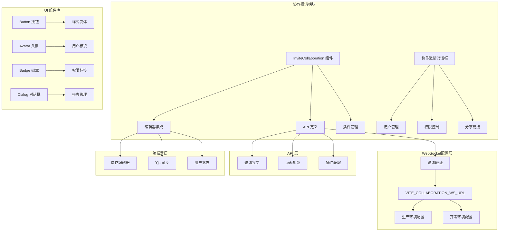

**图表来源**
- [packages/plugin-main/src/pages/InviteCollaboration/index.tsx](file://packages/plugin-main/src/pages/InviteCollaboration/index.tsx#L1-L617)
- [packages/plugin-main/src/api/index.ts](file://packages/plugin-main/src/api/index.ts#L150-L171)
- [packages/plugin-main/src/pages/components/CollaborationInvitationDlg.tsx](file://packages/plugin-main/src/pages/components/CollaborationInvitationDlg.tsx#L1-L561)
- [.env.example](file://.env.example#L8-L9)
- [apps/vite/.env.production](file://apps/vite/.env.production#L8-L9)

**章节来源**
- [packages/plugin-main/src/pages/InviteCollaboration/index.tsx](file://packages/plugin-main/src/pages/InviteCollaboration/index.tsx#L1-L617)
- [packages/plugin-main/src/api/index.ts](file://packages/plugin-main/src/api/index.ts#L1-L171)
- [packages/plugin-main/src/pages/components/CollaborationInvitationDlg.tsx](file://packages/plugin-main/src/pages/components/CollaborationInvitationDlg.tsx#L1-L561)

## 核心组件

协作邀请对话框由多个核心组件协同工作，形成完整的协作体验：

### 主要组件架构

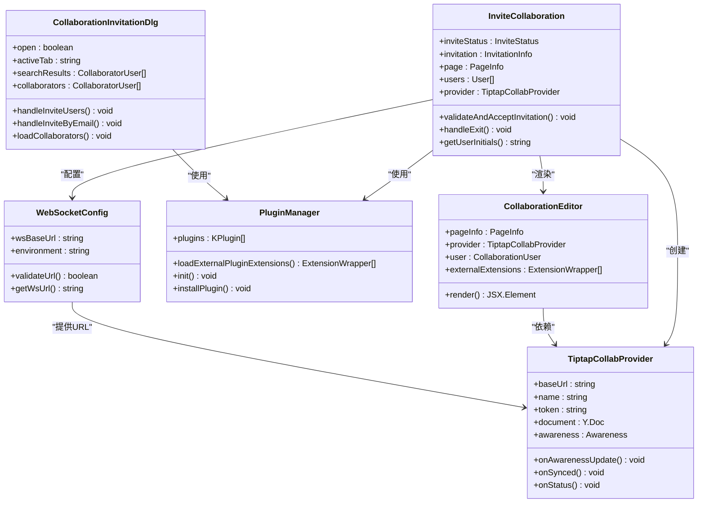

**图表来源**
- [packages/plugin-main/src/pages/InviteCollaboration/index.tsx](file://packages/plugin-main/src/pages/InviteCollaboration/index.tsx#L74-L617)
- [packages/plugin-main/src/pages/components/CollaborationInvitationDlg.tsx](file://packages/plugin-main/src/pages/components/CollaborationInvitationDlg.tsx#L41-L561)
- [packages/editor/src/editor/collaboration.tsx](file://packages/editor/src/editor/collaboration.tsx#L26-L161)
- [packages/common/src/core/PluginManager.ts](file://packages/common/src/core/PluginManager.ts#L99-L489)
- [.env.example](file://.env.example#L8-L9)

### 数据模型

协作邀请系统的核心数据结构包括：

| 结构类型 | 字段说明 | 数据类型 | 描述 |
|---------|----------|----------|------|
| InvitationInfo | 邀请信息 | 接口 | 包含邀请ID、页面ID、权限等级、状态等 |
| PageInfo | 页面信息 | 接口 | 包含页面标题、内容、空间信息等 |
| CollaborationUser | 协作者信息 | 接口 | 包含用户名称、颜色、ID等 |
| ConnectionStatus | 连接状态 | 枚举 | 连接中、已连接、断开连接 |
| CollaboratorUser | 协作者用户 | 接口 | 包含用户ID、名称、邮箱、权限等 |
| CollaborationInvitationDlgProps | 对话框属性 | 接口 | 包含页面标题、回调函数等 |
| WebSocketConfig | WebSocket配置 | 接口 | 包含服务器URL、环境配置等 |

**章节来源**
- [packages/plugin-main/src/pages/InviteCollaboration/index.tsx](file://packages/plugin-main/src/pages/InviteCollaboration/index.tsx#L32-L72)
- [packages/plugin-main/src/pages/components/CollaborationInvitationDlg.tsx](file://packages/plugin-main/src/pages/components/CollaborationInvitationDlg.tsx#L21-L32)

## 架构概览

协作邀请对话框采用分层架构设计，确保功能模块的清晰分离和可维护性：

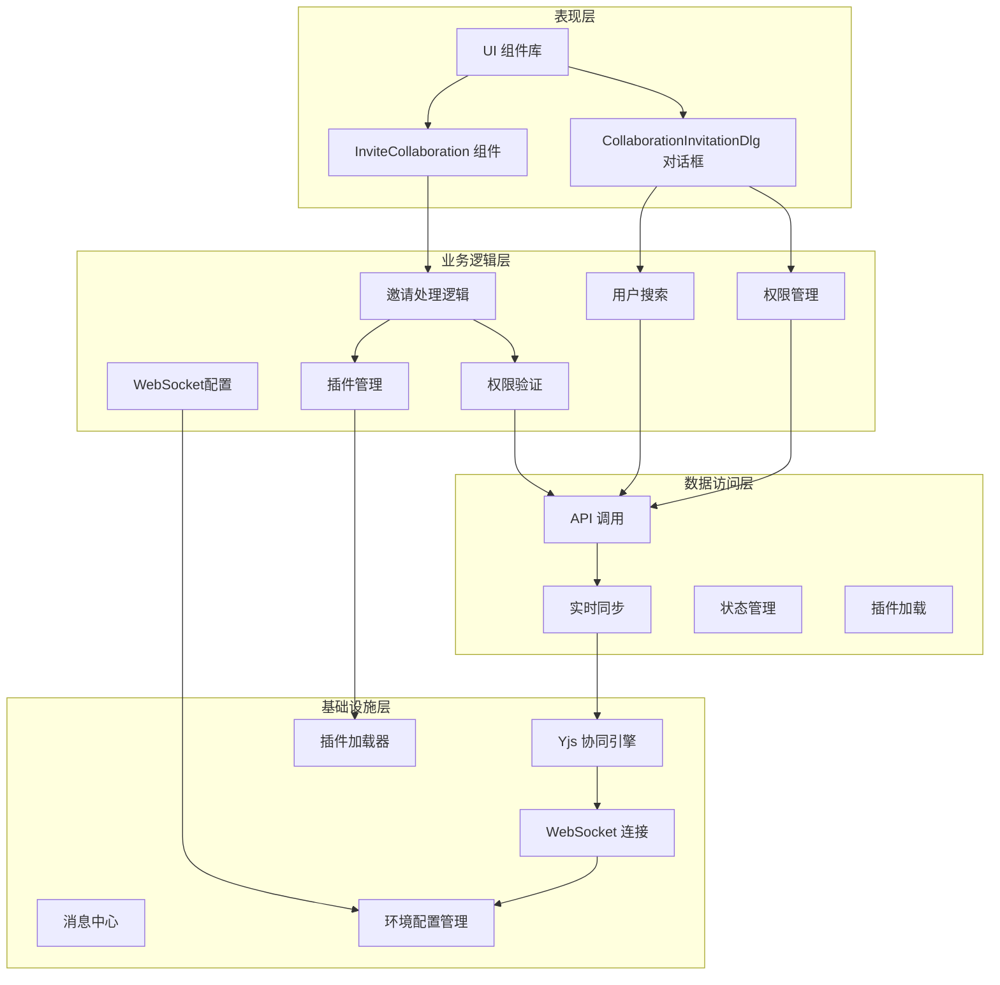

**图表来源**
- [packages/plugin-main/src/pages/InviteCollaboration/index.tsx](file://packages/plugin-main/src/pages/InviteCollaboration/index.tsx#L171-L241)
- [packages/plugin-main/src/pages/components/CollaborationInvitationDlg.tsx](file://packages/plugin-main/src/pages/components/CollaborationInvitationDlg.tsx#L76-L90)
- [packages/plugin-main/src/api/index.ts](file://packages/plugin-main/src/api/index.ts#L150-L171)
- [.env.example](file://.env.example#L8-L9)

### 状态管理流程

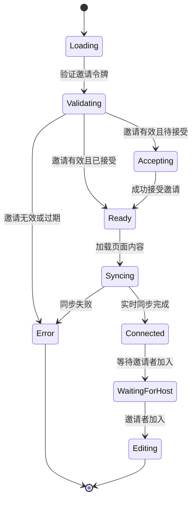

**图表来源**
- [packages/plugin-main/src/pages/InviteCollaboration/index.tsx](file://packages/plugin-main/src/pages/InviteCollaboration/index.tsx#L82-L92)

## 详细组件分析

### 邀请处理组件

InviteCollaboration 组件是协作邀请功能的核心，负责处理整个邀请生命周期：

#### 核心功能特性

1. **邀请令牌验证**：通过 API 验证邀请链接的有效性
2. **权限控制**：根据邀请权限决定编辑模式
3. **实时协作**：集成 Yjs 协同引擎实现多人实时编辑
4. **插件兼容**：动态加载邀请者安装的插件以确保一致的编辑体验
5. **会话监控**：实时监控邀请者状态，支持邀请者离开时的自动退出
6. **WebSocket配置**：通过环境变量灵活配置WebSocket服务器URL

#### 状态管理机制

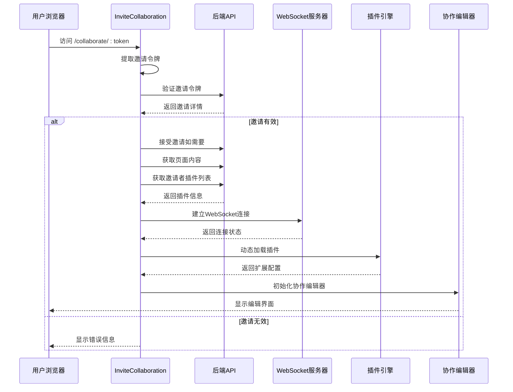

**图表来源**
- [packages/plugin-main/src/pages/InviteCollaboration/index.tsx](file://packages/plugin-main/src/pages/InviteCollaboration/index.tsx#L245-L303)
- [packages/plugin-main/src/api/index.ts](file://packages/plugin-main/src/api/index.ts#L150-L171)

**章节来源**
- [packages/plugin-main/src/pages/InviteCollaboration/index.tsx](file://packages/plugin-main/src/pages/InviteCollaboration/index.tsx#L74-L303)

### 协作编辑器集成

协作编辑器组件负责提供实时协作编辑功能：

#### 编辑器特性

1. **实时同步**：基于 Yjs 的 Operational Transformation 实现
2. **用户状态显示**：显示当前在线协作者及其光标位置
3. **权限控制**：根据用户权限启用或禁用编辑功能
4. **插件扩展**：支持动态加载第三方插件
5. **外部扩展支持**：支持加载邀请者的插件扩展以确保一致性
6. **WebSocket连接**：通过配置的服务器URL建立实时连接

#### 同步机制

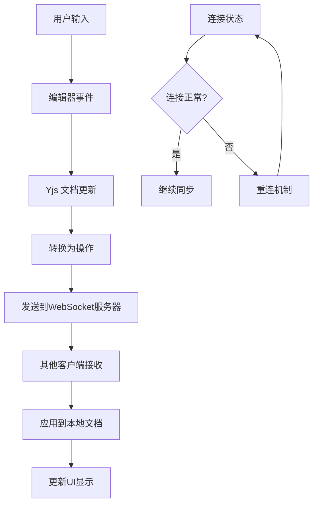

**图表来源**
- [packages/editor/src/editor/collaboration.tsx](file://packages/editor/src/editor/collaboration.tsx#L26-L161)

**章节来源**
- [packages/editor/src/editor/collaboration.tsx](file://packages/editor/src/editor/collaboration.tsx#L26-L161)

### 插件管理系统

插件管理器负责处理协作场景下的插件加载：

#### 外部插件加载

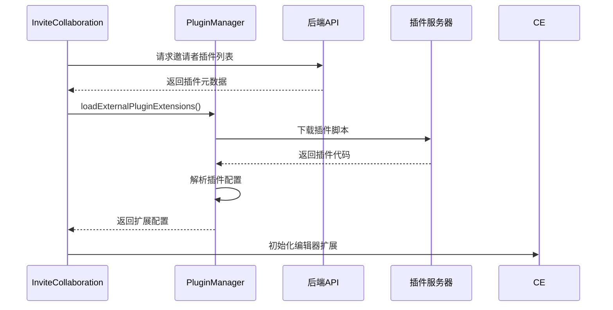

**图表来源**
- [packages/common/src/core/PluginManager.ts](file://packages/common/src/core/PluginManager.ts#L440-L484)

**章节来源**
- [packages/common/src/core/PluginManager.ts](file://packages/common/src/core/PluginManager.ts#L440-L484)

### 用户邀请对话框

CollaborationInvitationDlg 组件提供了传统的邀请管理功能：

#### 核心功能特性

1. **用户搜索**：支持按姓名或邮箱搜索用户
2. **权限管理**：支持三种权限级别（只读、可编辑、管理员）
3. **邮件邀请**：支持通过邮件发送邀请
4. **协作管理**：支持添加、移除和修改协作者权限
5. **分享链接**：支持生成公开或私有的分享链接

#### 对话框功能

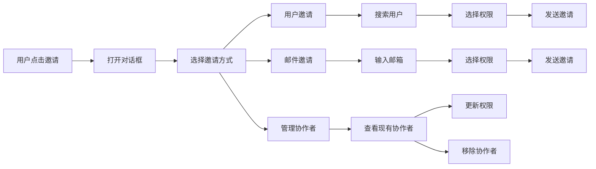

**图表来源**
- [packages/plugin-main/src/pages/components/CollaborationInvitationDlg.tsx](file://packages/plugin-main/src/pages/components/CollaborationInvitationDlg.tsx#L267-L561)

**章节来源**
- [packages/plugin-main/src/pages/components/CollaborationInvitationDlg.tsx](file://packages/plugin-main/src/pages/components/CollaborationInvitationDlg.tsx#L41-L561)

### UI 组件集成

协作邀请对话框集成了多个 UI 组件来提供丰富的用户体验：

#### 权限徽章系统

| 权限级别 | 颜色方案 | 标签文本 | 功能限制 |
|---------|----------|----------|----------|
| ADMIN | 主色调背景 | "完全访问" | 所有功能 |
| WRITE | 绿色背景 | "可编辑" | 编辑内容 |
| READ | 灰色背景 | "仅查看" | 只读模式 |

#### 用户头像系统

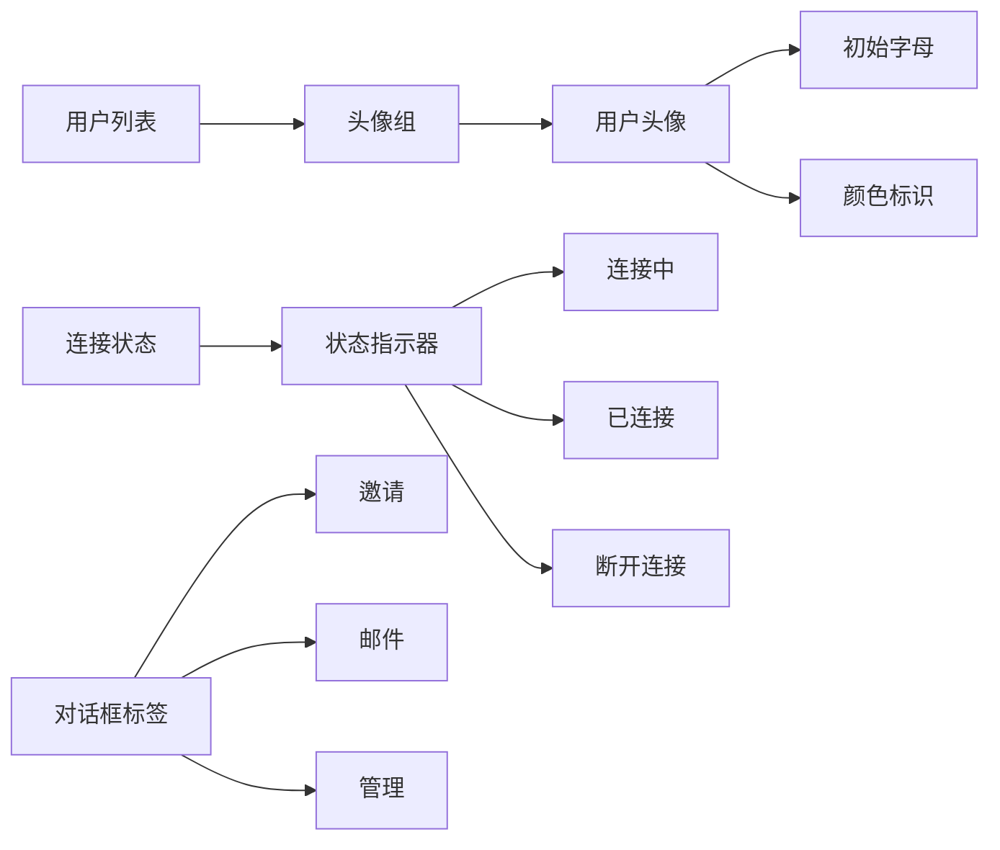

**图表来源**
- [packages/plugin-main/src/pages/InviteCollaboration/index.tsx](file://packages/plugin-main/src/pages/InviteCollaboration/index.tsx#L396-L431)

**章节来源**
- [packages/ui/src/components/ui/button.tsx](file://packages/ui/src/components/ui/button.tsx#L1-L57)
- [packages/ui/src/components/ui/avatar.tsx](file://packages/ui/src/components/ui/avatar.tsx#L1-L49)
- [packages/ui/src/components/ui/badge.tsx](file://packages/ui/src/components/ui/badge.tsx#L1-L37)

## WebSocket服务器配置

**更新** 协作邀请功能现在支持通过环境变量配置WebSocket服务器URL，确保在不同环境中正常工作。

### 环境变量配置

系统通过以下环境变量管理WebSocket服务器配置：

| 环境变量 | 默认值 | 用途 | 环境示例 |
|---------|--------|------|----------|
| VITE_COLLABORATION_WS_URL | ws://kotion.top:1234 | 协作WebSocket服务器URL | 生产环境 |
| NODE_ENV | development | 应用运行环境 | development/production |
| API_BASE_URL | https://kotion.top:888/api | API服务器基础URL | 后端服务地址 |

### 配置文件结构

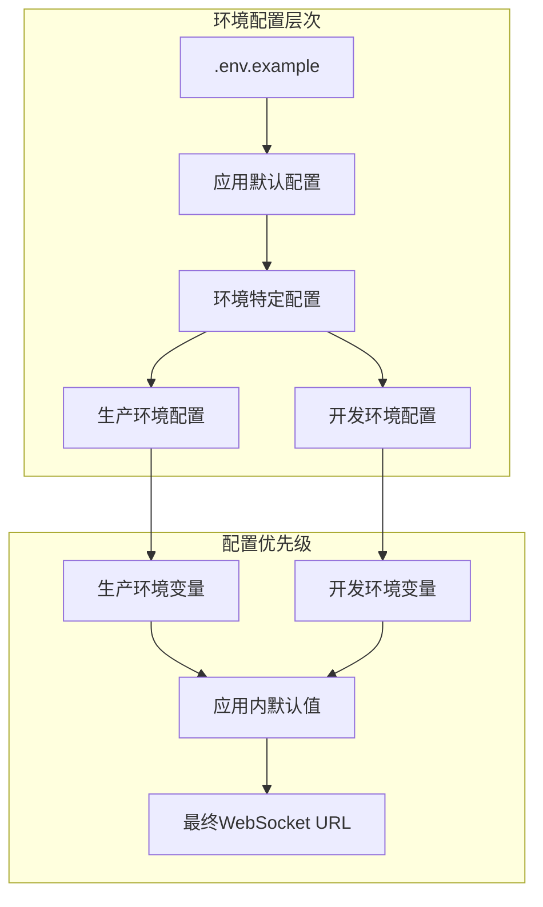

**图表来源**
- [.env.example](file://.env.example#L8-L9)
- [apps/vite/.env.production](file://apps/vite/.env.production#L8-L9)
- [apps/vite/.env.development](file://apps/vite/.env.development#L8-L9)

### WebSocket服务器URL解析

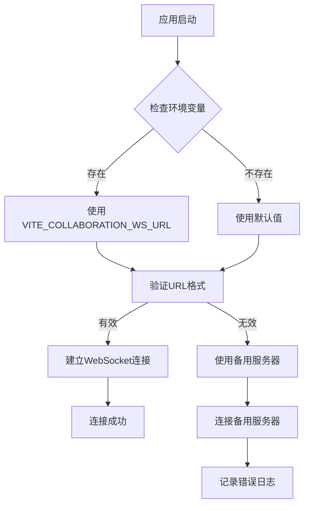

**图表来源**
- [packages/plugin-main/src/pages/InviteCollaboration/index.tsx](file://packages/plugin-main/src/pages/InviteCollaboration/index.tsx#L123-L124)

### 配置示例

#### 生产环境配置
```bash
# apps/vite/.env.production
VITE_COLLABORATION_WS_URL=ws://kotion.top:1234
```

#### 开发环境配置
```bash
# apps/vite/.env.development  
VITE_COLLABORATION_WS_URL=ws://localhost:1234
```

#### 自定义服务器配置
```bash
# 自定义环境变量
VITE_COLLABORATION_WS_URL=ws://your-server.com:1234
```

**章节来源**
- [.env.example](file://.env.example#L8-L9)
- [apps/vite/.env.production](file://apps/vite/.env.production#L8-L9)
- [apps/vite/.env.development](file://apps/vite/.env.development#L8-L9)

## 依赖关系分析

协作邀请对话框的功能实现涉及多个层次的依赖关系：

```mermaid
graph TB
subgraph "外部依赖"
A[React Hooks]
B[Yjs 协同引擎]
C[Tiptap 编辑器]
D[Radix UI 组件]
E[ahooks 工具库]
F[@hocuspocus/provider]
G[WebSocket API]
H[环境变量系统]
end
subgraph "内部模块"
I[PluginManager]
J[API 客户端]
K[全局状态]
L[工具函数]
M[消息通知]
N[WebSocket配置]
end
subgraph "协作邀请模块"
O[InviteCollaboration]
P[CollaborationEditor]
Q[Provider 管理]
R[CollaborationInvitationDlg]
end
O --> P
O --> Q
O --> I
O --> J
O --> N
P --> B
P --> C
P --> F
R --> I
R --> J
I --> A
J --> A
N --> H
N --> G
Q --> B
Q --> C
O --> D
R --> D
R --> M
```

**图表来源**
- [packages/plugin-main/src/pages/InviteCollaboration/index.tsx](file://packages/plugin-main/src/pages/InviteCollaboration/index.tsx#L1-L29)
- [packages/editor/src/editor/collaboration.tsx](file://packages/editor/src/editor/collaboration.tsx#L1-L23)
- [packages/plugin-main/src/pages/components/CollaborationInvitationDlg.tsx](file://packages/plugin-main/src/pages/components/CollaborationInvitationDlg.tsx#L1-L18)

### 关键依赖关系

1. **Yjs 协同引擎**：提供实时协作的基础
2. **Tiptap 编辑器**：提供富文本编辑功能
3. **PluginManager**：管理插件加载和扩展
4. **API 客户端**：处理后端通信
5. **WebSocket配置**：管理实时连接设置
6. **UI 组件库**：提供一致的用户界面
7. **消息通知系统**：提供实时状态反馈
8. **环境变量系统**：提供配置管理

**章节来源**
- [packages/plugin-main/src/api/index.ts](file://packages/plugin-main/src/api/index.ts#L1-L171)
- [packages/common/src/core/PluginManager.ts](file://packages/common/src/core/PluginManager.ts#L1-L489)

## 性能考虑

协作邀请对话框在设计时充分考虑了性能优化：

### 内存管理

1. **组件卸载清理**：自动清理 Yjs 文档和 WebSocket 连接
2. **状态缓存**：使用 useMemo 优化昂贵计算
3. **插件缓存**：避免重复加载相同的插件
4. **用户状态优化**：使用深比较避免不必要的重渲染

### 网络优化

1. **按需加载**：插件采用动态加载策略
2. **连接池管理**：复用 WebSocket 连接
3. **增量同步**：只传输必要的变更
4. **防抖搜索**：优化用户搜索性能
5. **环境变量缓存**：避免重复解析配置

### 渲染优化

1. **虚拟滚动**：大量协作者时使用虚拟化
2. **条件渲染**：根据状态切换不同的 UI 组件
3. **懒加载**：编辑器内容延迟加载
4. **骨架屏**：提供更好的加载体验

## 故障排除指南

### 常见问题及解决方案

#### 邀请链接无效

**症状**：显示 "无效邀请" 或 "邀请已过期" 错误

**可能原因**：
1. 邀请令牌不存在或格式错误
2. 邀请已过期
3. 邀请已被撤销

**解决步骤**：
1. 检查邀请链接是否完整
2. 确认邀请时间有效性
3. 联系邀请者重新发送邀请

#### 实时同步失败

**症状**：编辑器无法连接到协作服务

**可能原因**：
1. WebSocket 连接中断
2. 服务器不可达
3. 网络防火墙阻拦
4. WebSocket服务器URL配置错误

**解决步骤**：
1. 检查网络连接状态
2. 验证WebSocket服务器URL配置
3. 查看浏览器开发者工具中的网络请求
4. 检查环境变量配置

#### 插件加载失败

**症状**：编辑器功能不完整或出现错误

**可能原因**：
1. 插件资源路径错误
2. 插件版本不兼容
3. 网络下载超时

**解决步骤**：
1. 验证插件资源 URL
2. 检查插件版本兼容性
3. 尝试刷新页面重新加载

#### WebSocket服务器连接问题

**症状**：协作功能无法正常使用

**可能原因**：
1. WebSocket服务器URL配置错误
2. 服务器端口未开放
3. SSL证书问题
4. 环境变量未正确设置

**解决步骤**：
1. 检查 `.env` 文件中的 `VITE_COLLABORATION_WS_URL` 配置
2. 验证服务器端口和服务状态
3. 确认SSL证书有效
4. 在不同环境下测试连接
5. 查看浏览器控制台的WebSocket错误信息

#### 邀请者离开会话

**症状**：编辑器显示邀请者已离开并自动退出

**可能原因**：
1. 邀请者主动关闭协作窗口
2. 邀请者网络连接中断
3. 邀请者手动结束会话

**解决步骤**：
1. 等待邀请者重新加入
2. 联系邀请者确认会话状态
3. 重新发起协作邀请

**章节来源**
- [packages/plugin-main/src/pages/InviteCollaboration/index.tsx](file://packages/plugin-main/src/pages/InviteCollaboration/index.tsx#L290-L314)
- [packages/plugin-main/src/pages/InviteCollaboration/index.tsx](file://packages/plugin-main/src/pages/InviteCollaboration/index.tsx#L160-L169)

## 结论

协作邀请对话框是一个功能完整、架构清晰的协作功能模块。它通过精心设计的状态管理、实时同步机制和插件系统，为用户提供了无缝的协作体验。

**更新** 新的InviteCollaboration组件提供了比传统对话框更强大的功能，包括：

### 主要优势

1. **完整的协作体验**：从邀请到实时编辑的一站式解决方案
2. **灵活的权限控制**：支持多种协作权限级别
3. **强大的扩展性**：通过插件系统支持功能扩展
4. **实时会话监控**：支持邀请者状态跟踪和自动退出
5. **邀请者插件兼容**：确保编辑器功能一致性
6. **环境配置灵活性**：通过环境变量支持不同部署环境
7. **优秀的性能表现**：优化的内存管理和网络通信
8. **可靠的错误处理**：完善的异常处理和恢复机制

### 技术亮点

- 基于 Yjs 的高性能实时协作
- 动态插件加载确保编辑器一致性
- 响应式 UI 设计适配多种设备
- 完善的 TypeScript 类型支持
- 模块化的架构设计便于维护
- 实时会话状态监控和管理
- 灵活的WebSocket服务器配置

### 功能对比

| 功能特性 | 传统对话框 | 新InviteCollaboration组件 |
|---------|------------|---------------------------|
| 邀请管理 | ✅ 基础邀请 | ✅ 增强邀请管理 |
| 用户搜索 | ✅ 搜索功能 | ✅ 智能搜索建议 |
| 权限管理 | ✅ 三种权限 | ✅ 实时权限监控 |
| 邮件邀请 | ✅ 邮件发送 | ✅ 邀请状态跟踪 |
| 协作编辑 | ❌ 不支持 | ✅ 实时协作编辑 |
| 插件兼容 | ❌ 不支持 | ✅ 邀请者插件加载 |
| 会话监控 | ❌ 不支持 | ✅ 邀请者状态跟踪 |
| 自动退出 | ❌ 不支持 | ✅ 邀请者离开检测 |
| 环境配置 | ❌ 固定URL | ✅ 可配置WebSocket服务器 |

**更新** 通过引入环境变量配置系统，协作邀请功能现在能够更好地适应不同的部署环境，确保在生产环境中稳定运行。新的WebSocket服务器URL配置机制为系统的可维护性和可扩展性提供了重要保障。

该功能模块为知识库系统的协作能力奠定了坚实基础，为用户提供了专业级的协作编辑体验。新的InviteCollaboration组件进一步提升了系统的协作能力和用户体验。