# 协作邀请页面

<cite>
**本文档引用的文件**
- [packages/plugin-main/src/pages/InviteCollaboration/index.tsx](file://packages/plugin-main/src/pages/InviteCollaboration/index.tsx)
- [packages/plugin-main/src/api/index.ts](file://packages/plugin-main/src/api/index.ts)
- [packages/plugin-main/docs/COLLABORATION_API.md](file://packages/plugin-main/docs/COLLABORATION_API.md)
- [packages/editor/src/editor/collaboration.tsx](file://packages/editor/src/editor/collaboration.tsx)
- [packages/editor/src/extensions/collaboration-cursor/collaboration-cursor.ts](file://packages/editor/src/extensions/collaboration-cursor/collaboration-cursor.ts)
- [packages/editor/src/styles/editor.css](file://packages/editor/src/styles/editor.css)
- [packages/editor/src/styles/editor.ts](file://packages/editor/src/styles/editor.ts)
- [packages/common/src/core/PluginManager.ts](file://packages/common/src/core/PluginManager.ts)
- [packages/plugin-main/src/service/space-service.ts](file://packages/plugin-main/src/service/space-service.ts)
- [packages/plugin-main/src/model/Space.ts](file://packages/plugin-main/src/model/Space.ts)
- [packages/room-server/src/server.mjs](file://packages/room-server/src/server.mjs)
- [packages/room-server/.env.example](file://packages/room-server/.env.example)
- [packages/core/src/hooks/use-instant-message.ts](file://packages/core/src/hooks/use-instant-message.ts)
- [apps/vite/nginx/nginx.conf](file://apps/vite/nginx/nginx.conf)
</cite>

## 更新摘要
**变更内容**
- 全新重写的InviteCollaboration组件，替代旧的邀请对话框
- 新增插件同步功能，确保邀请人和被邀请人使用相同的编辑器扩展
- 新增实时监控功能，跟踪邀请人状态变化
- 新增inviterExtensions状态用于存储邀请人的插件扩展
- 新增loadExternalPluginExtensions方法的使用
- 新增GET_INVITER_PLUGINS API端点支持
- 新增等待邀请人加入的交互流程
- 新增邀请人离开会话的处理机制
- **更新** WebSocket服务器配置：协作邀请页面使用`ws://kotion.top:1234`（房间服务器），即时消息使用`wss://kotion.top:888`（消息服务器）
- **新增** 头像URL支持和协作光标头像显示功能，增强协作体验的个性化展示

## 目录
1. [简介](#简介)
2. [项目结构](#项目结构)
3. [核心组件](#核心组件)
4. [架构概览](#架构概览)
5. [详细组件分析](#详细组件分析)
6. [插件同步机制](#插件同步机制)
7. [实时监控功能](#实时监控功能)
8. [协作光标头像显示](#协作光标头像显示)
9. [WebSocket服务器配置](#websocket服务器配置)
10. [依赖关系分析](#依赖关系分析)
11. [性能考虑](#性能考虑)
12. [故障排除指南](#故障排除指南)
13. [结论](#结论)

## 简介

协作邀请页面是知识库系统中用于处理外部用户协作邀请的核心功能模块。该页面允许被邀请用户通过邀请链接加入文档协作，实现实时编辑、权限管理和插件扩展的一致性体验。

**更新** 全新的InviteCollaboration组件完全重写了原有的邀请对话框，提供了更加丰富和专业的协作体验。新组件不仅支持基本的邀请验证和接受功能，还包含了插件同步、实时监控、权限管理等高级特性。

**新增** 协作光标头像显示功能为用户提供了个性化的协作体验，每个协作用户都可以在光标位置显示自己的头像，增强了协作的真实感和识别度。

该功能基于WebRTC技术实现真正的实时协作，支持多用户同时编辑同一文档，并提供完整的权限控制和用户体验优化。

## 项目结构

协作邀请页面位于插件主包的页面目录中，采用模块化设计，包含以下关键文件：

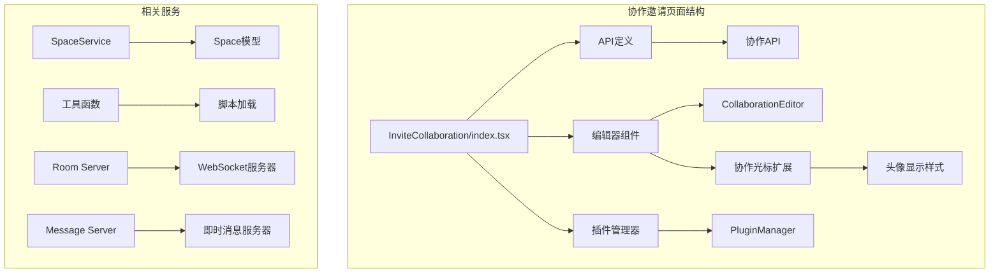

**图表来源**
- [packages/plugin-main/src/pages/InviteCollaboration/index.tsx](file://packages/plugin-main/src/pages/InviteCollaboration/index.tsx#L1-L619)
- [packages/plugin-main/src/api/index.ts](file://packages/plugin-main/src/api/index.ts#L1-L171)
- [packages/room-server/src/server.mjs](file://packages/room-server/src/server.mjs#L30-L57)

**章节来源**
- [packages/plugin-main/src/pages/InviteCollaboration/index.tsx](file://packages/plugin-main/src/pages/InviteCollaboration/index.tsx#L1-L50)
- [packages/plugin-main/src/api/index.ts](file://packages/plugin-main/src/api/index.ts#L1-L50)

## 核心组件

协作邀请页面由多个核心组件构成，每个组件负责特定的功能职责：

### 主要组件架构

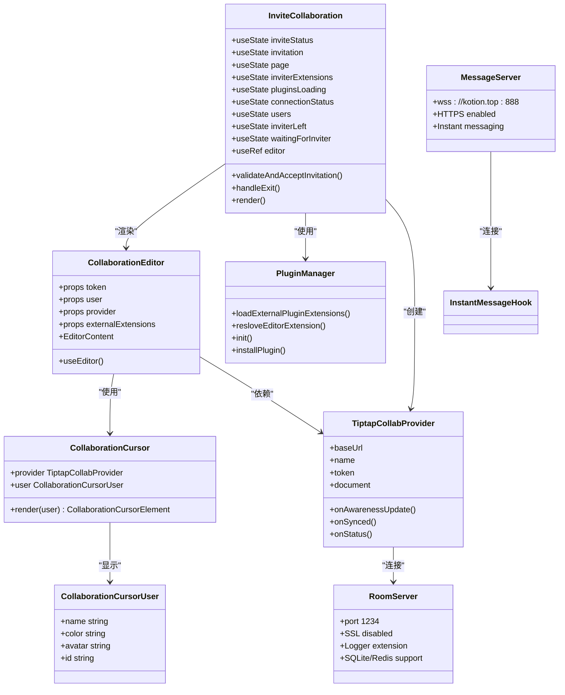

**图表来源**
- [packages/plugin-main/src/pages/InviteCollaboration/index.tsx](file://packages/plugin-main/src/pages/InviteCollaboration/index.tsx#L57-L619)
- [packages/editor/src/editor/collaboration.tsx](file://packages/editor/src/editor/collaboration.tsx#L26-L162)
- [packages/editor/src/extensions/collaboration-cursor/collaboration-cursor.ts](file://packages/editor/src/extensions/collaboration-cursor/collaboration-cursor.ts#L5-L9)
- [packages/common/src/core/PluginManager.ts](file://packages/common/src/core/PluginManager.ts#L440-L484)
- [packages/room-server/src/server.mjs](file://packages/room-server/src/server.mjs#L30-L57)
- [packages/core/src/hooks/use-instant-message.ts](file://packages/core/src/hooks/use-instant-message.ts#L74-L81)

### 状态管理架构

协作邀请页面采用React状态管理机制，通过useState和useEffect实现复杂的状态流转：

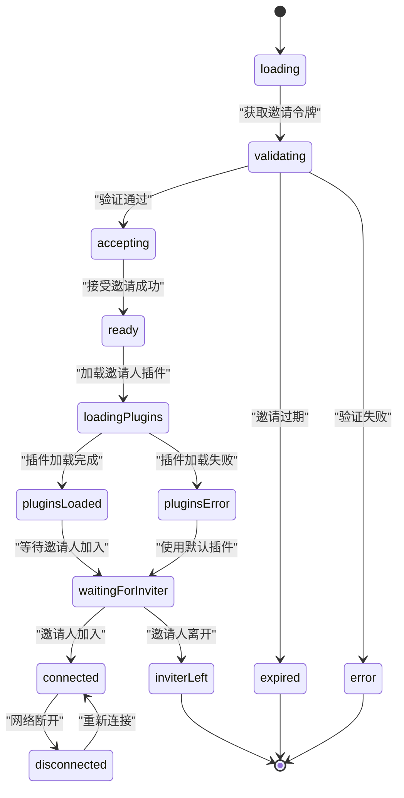

**图表来源**
- [packages/plugin-main/src/pages/InviteCollaboration/index.tsx](file://packages/plugin-main/src/pages/InviteCollaboration/index.tsx#L76-L96)

**章节来源**
- [packages/plugin-main/src/pages/InviteCollaboration/index.tsx](file://packages/plugin-main/src/pages/InviteCollaboration/index.tsx#L57-L180)

## 架构概览

协作邀请页面采用分层架构设计，确保功能模块的清晰分离和高内聚低耦合：

### 整体架构流程

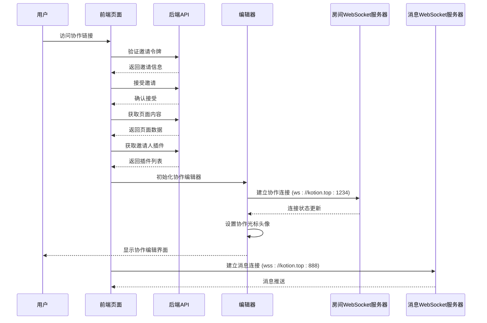

**图表来源**
- [packages/plugin-main/docs/COLLABORATION_API.md](file://packages/plugin-main/docs/COLLABORATION_API.md#L16-L805)
- [packages/plugin-main/src/pages/InviteCollaboration/index.tsx](file://packages/plugin-main/src/pages/InviteCollaboration/index.tsx#L245-L303)
- [packages/core/src/hooks/use-instant-message.ts](file://packages/core/src/hooks/use-instant-message.ts#L74-L81)

### 数据流架构

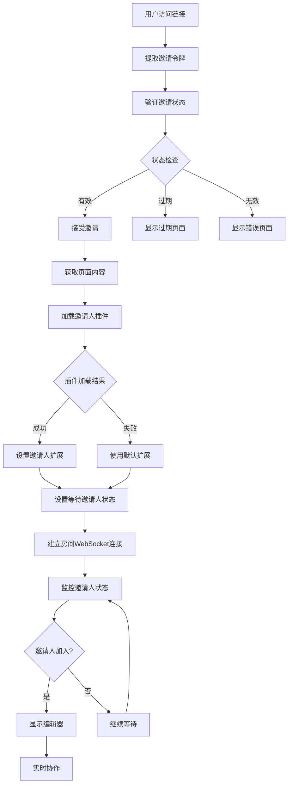

**图表来源**
- [packages/plugin-main/src/pages/InviteCollaboration/index.tsx](file://packages/plugin-main/src/pages/InviteCollaboration/index.tsx#L245-L303)
- [packages/plugin-main/src/api/index.ts](file://packages/plugin-main/src/api/index.ts#L166-L170)

**章节来源**
- [packages/plugin-main/docs/COLLABORATION_API.md](file://packages/plugin-main/docs/COLLABORATION_API.md#L1-L806)

## 详细组件分析

### 邀请验证与处理组件

邀请验证组件是协作邀请页面的核心逻辑处理模块，负责整个邀请流程的状态管理和业务逻辑处理。

#### 核心功能实现

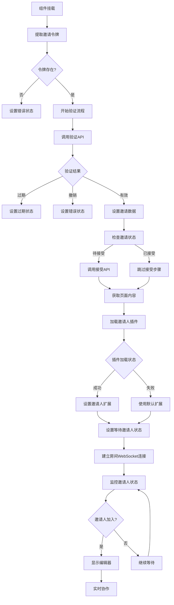

**图表来源**
- [packages/plugin-main/src/pages/InviteCollaboration/index.tsx](file://packages/plugin-main/src/pages/InviteCollaboration/index.tsx#L234-L303)

#### 权限管理系统

页面实现了完整的权限控制机制，支持三种不同的协作权限级别：

| 权限类型 | 描述 | 功能限制 | 视觉标识 |
|---------|------|----------|----------|
| READ | 只读权限 | 仅能查看文档内容 | 灰色标签，无编辑功能 |
| WRITE | 编辑权限 | 可以修改文档内容 | 绿色标签，可编辑 |
| ADMIN | 管理权限 | 完整的文档管理权限 | 蓝色标签，完全控制 |

**章节来源**
- [packages/plugin-main/src/pages/InviteCollaboration/index.tsx](file://packages/plugin-main/src/pages/InviteCollaboration/index.tsx#L32-L73)

### 实时协作编辑器

协作编辑器组件是基于Tiptap和Yjs构建的实时协作解决方案，提供流畅的多人编辑体验。

#### 编辑器架构设计

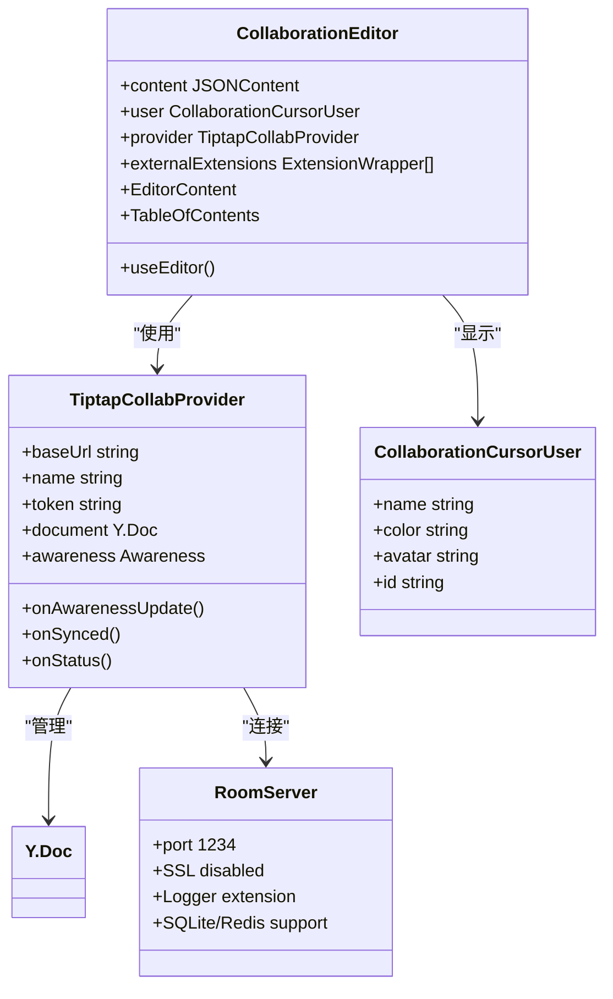

**图表来源**
- [packages/editor/src/editor/collaboration.tsx](file://packages/editor/src/editor/collaboration.tsx#L26-L162)
- [packages/room-server/src/server.mjs](file://packages/room-server/src/server.mjs#L30-L57)

#### 协作状态管理

编辑器实现了完整的协作状态管理机制，包括连接状态监控和用户活跃度跟踪：

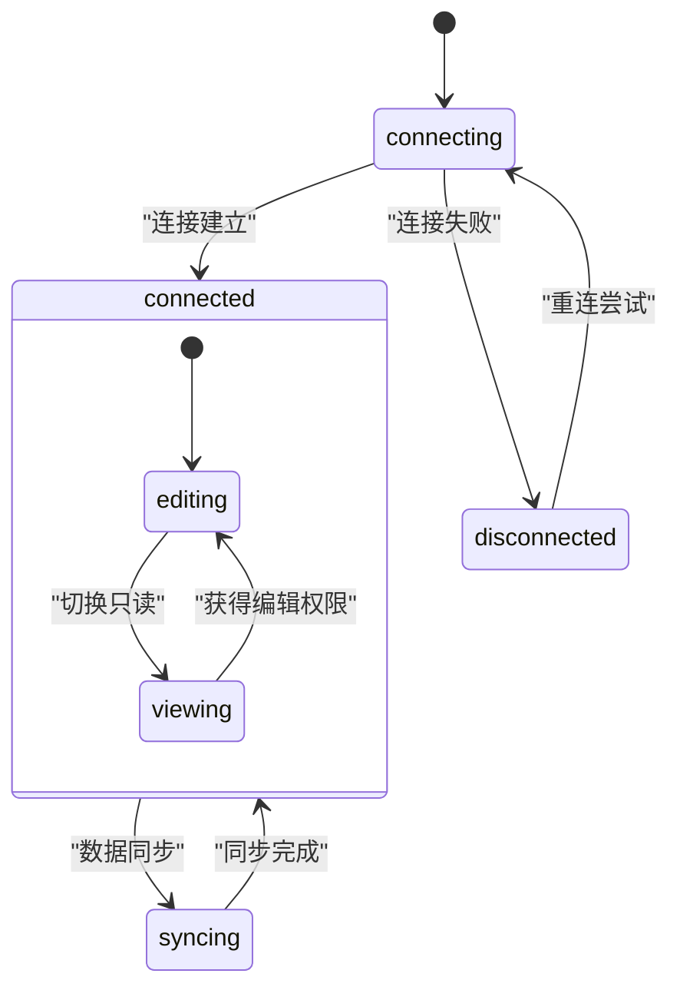

**图表来源**
- [packages/plugin-main/src/pages/InviteCollaboration/index.tsx](file://packages/plugin-main/src/pages/InviteCollaboration/index.tsx#L83-L86)

**章节来源**
- [packages/editor/src/editor/collaboration.tsx](file://packages/editor/src/editor/collaboration.tsx#L46-L162)

### 插件扩展系统

插件扩展系统是协作邀请页面的重要特性，确保邀请人和被邀请人使用相同的编辑器功能集。

**更新** 全新的插件同步功能通过loadExternalPluginExtensions方法动态加载邀请人的插件扩展，确保双方使用一致的编辑器体验。

#### 插件加载机制

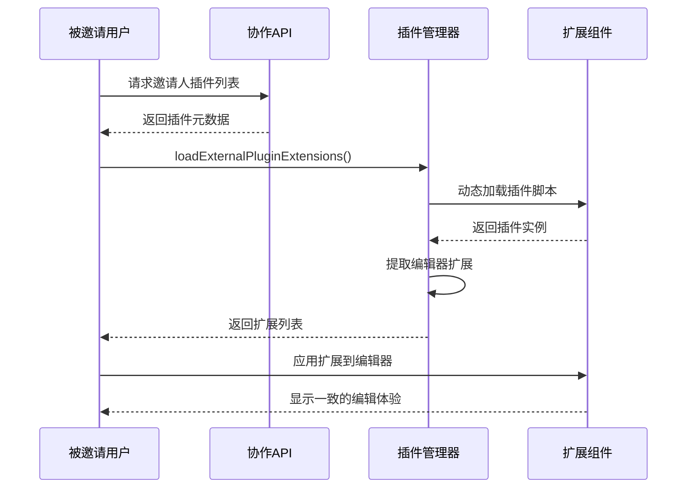

**图表来源**
- [packages/plugin-main/src/pages/InviteCollaboration/index.tsx](file://packages/plugin-main/src/pages/InviteCollaboration/index.tsx#L278-L295)
- [packages/common/src/core/PluginManager.ts](file://packages/common/src/core/PluginManager.ts#L440-L484)

#### 插件兼容性保证

系统通过以下机制确保插件兼容性：

1. **动态脚本加载**：使用importScript函数动态加载插件脚本
2. **扩展提取**：从插件实例中提取editorExtensions数组
3. **缓存机制**：避免重复加载相同插件
4. **降级处理**：插件加载失败时使用默认扩展

**章节来源**
- [packages/common/src/core/PluginManager.ts](file://packages/common/src/core/PluginManager.ts#L440-L484)

### 用户界面组件

协作邀请页面提供了完整的用户界面，包括头部状态栏、编辑区域和协作指示器。

#### 头部状态栏设计

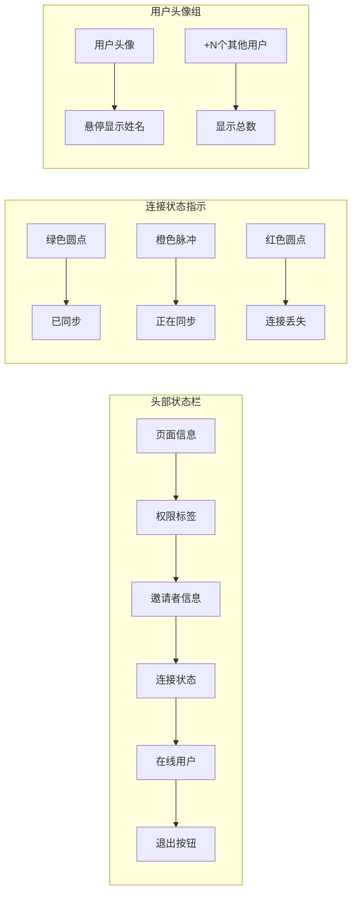

**图表来源**
- [packages/plugin-main/src/pages/InviteCollaboration/index.tsx](file://packages/plugin-main/src/pages/InviteCollaboration/index.tsx#L419-L543)

#### 响应式设计实现

页面采用响应式设计，适配不同屏幕尺寸：

- **桌面端**：完整显示所有功能组件
- **平板端**：隐藏部分文本信息，保留核心功能
- **移动端**：简化界面布局，优化触摸交互

**章节来源**
- [packages/plugin-main/src/pages/InviteCollaboration/index.tsx](file://packages/plugin-main/src/pages/InviteCollaboration/index.tsx#L416-L619)

## 插件同步机制

**更新** 全新的插件同步机制是协作邀请页面的核心创新功能，确保邀请人和被邀请人使用完全一致的编辑器体验。

### 插件同步工作流程

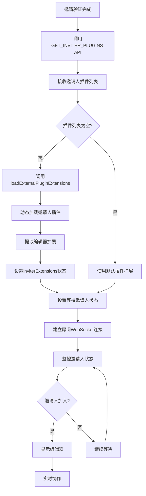

**图表来源**
- [packages/plugin-main/src/pages/InviteCollaboration/index.tsx](file://packages/plugin-main/src/pages/InviteCollaboration/index.tsx#L278-L295)
- [packages/plugin-main/src/api/index.ts](file://packages/plugin-main/src/api/index.ts#L166-L170)

### 插件同步状态管理

页面新增了专门的状态管理来处理插件同步过程：

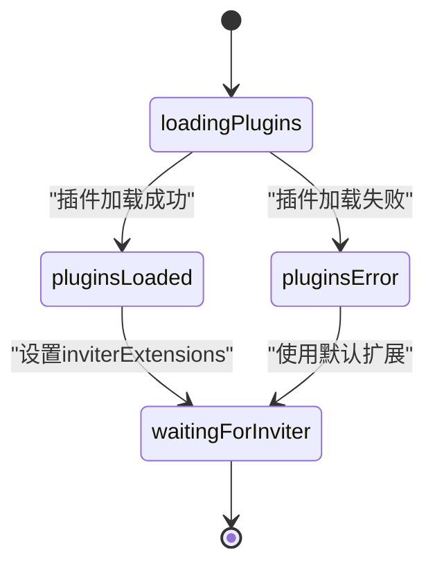

**图表来源**
- [packages/plugin-main/src/pages/InviteCollaboration/index.tsx](file://packages/plugin-main/src/pages/InviteCollaboration/index.tsx#L89-L96)

### 插件同步配置

协作编辑器通过externalExtensions属性接收邀请人的插件扩展：

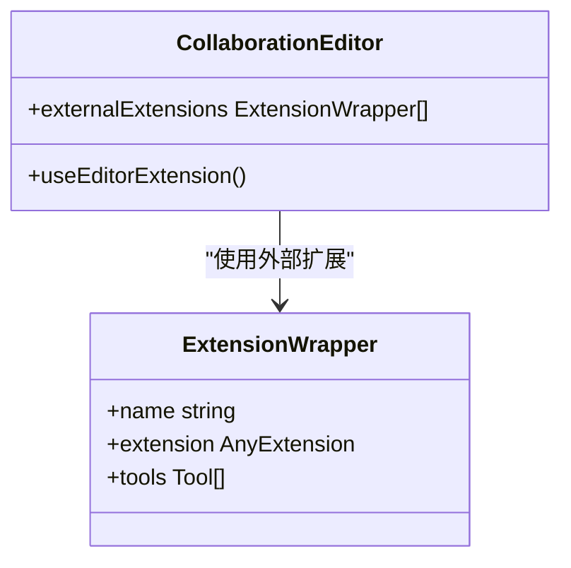

**图表来源**
- [packages/editor/src/editor/collaboration.tsx](file://packages/editor/src/editor/collaboration.tsx#L36-L42)

**章节来源**
- [packages/plugin-main/src/pages/InviteCollaboration/index.tsx](file://packages/plugin-main/src/pages/InviteCollaboration/index.tsx#L278-L295)
- [packages/plugin-main/src/api/index.ts](file://packages/plugin-main/src/api/index.ts#L166-L170)

## 实时监控功能

**新增** 全新的实时监控功能是InviteCollaboration组件的重要特性，能够跟踪邀请人的在线状态并提供相应的用户体验。

### 邀请人状态监控

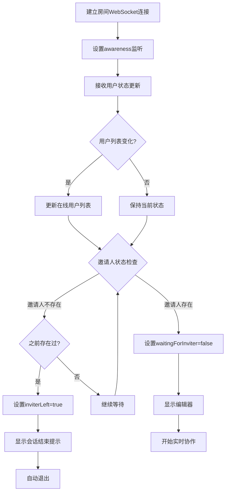

**图表来源**
- [packages/plugin-main/src/pages/InviteCollaboration/index.tsx](file://packages/plugin-main/src/pages/InviteCollaboration/index.tsx#L185-L231)

### 连接状态监控

页面实现了完整的连接状态监控机制：


**图表来源**
- [packages/plugin-main/src/pages/InviteCollaboration/index.tsx](file://packages/plugin-main/src/pages/InviteCollaboration/index.tsx#L83-L86)

### 用户活动跟踪

系统通过awareness机制跟踪用户活动：

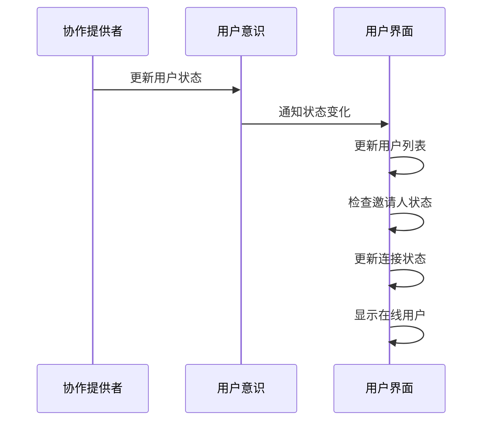

**图表来源**
- [packages/plugin-main/src/pages/InviteCollaboration/index.tsx](file://packages/plugin-main/src/pages/InviteCollaboration/index.tsx#L128-L155)

**章节来源**
- [packages/plugin-main/src/pages/InviteCollaboration/index.tsx](file://packages/plugin-main/src/pages/InviteCollaboration/index.tsx#L185-L231)

## 协作光标头像显示

**新增** 协作光标头像显示功能是本次更新的核心特性，为协作编辑器增加了个性化的用户标识功能。

### 头像显示架构设计

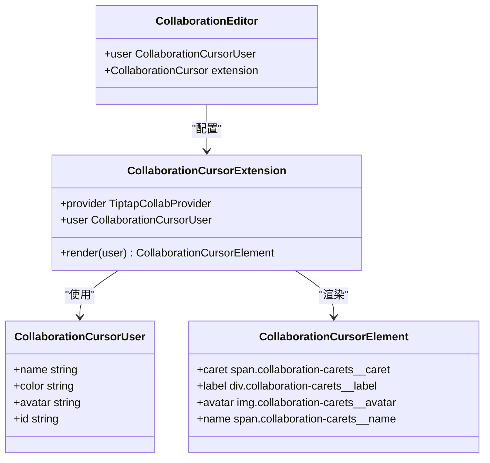

**图表来源**
- [packages/editor/src/editor/collaboration.tsx](file://packages/editor/src/editor/collaboration.tsx#L82-L116)
- [packages/editor/src/extensions/collaboration-cursor/collaboration-cursor.ts](file://packages/editor/src/extensions/collaboration-cursor/collaboration-cursor.ts#L5-L9)

### 头像渲染机制

协作编辑器中的协作光标扩展实现了智能的头像渲染逻辑：

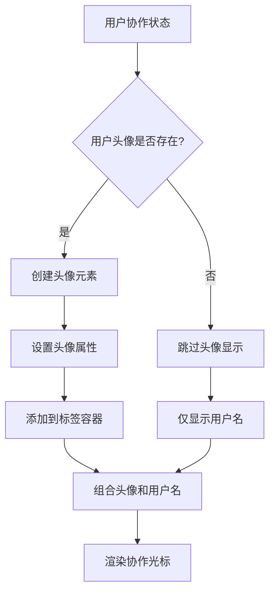

**图表来源**
- [packages/editor/src/editor/collaboration.tsx](file://packages/editor/src/editor/collaboration.tsx#L93-L110)

### 头像样式设计

协作光标头像采用了专门的CSS样式设计：

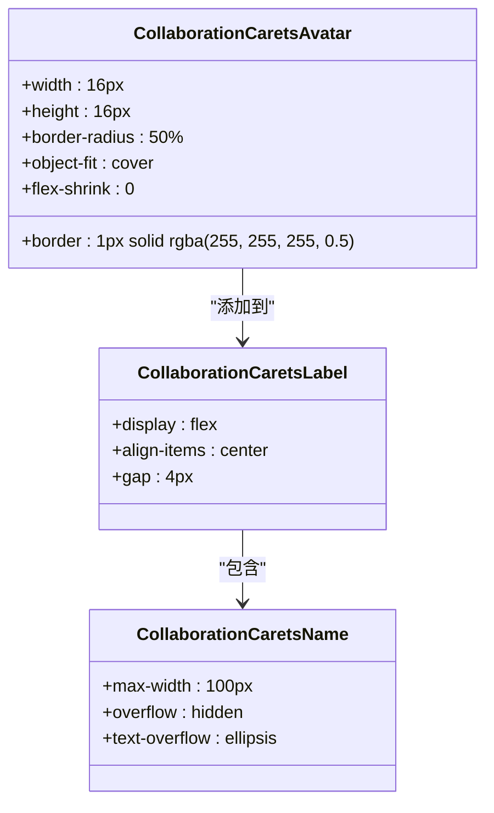

**图表来源**
- [packages/editor/src/styles/editor.css](file://packages/editor/src/styles/editor.css#L119-L134)

### 头像URL处理流程

协作邀请页面中的用户头像URL处理流程：

```mermaid
flowchart TD
A[用户信息] --> B{是否有头像URL?}
B --> |是| C[使用usePath处理URL]
B --> |否| D[使用默认头像]
C --> E[usePath(userInfo.avatar)]
E --> F[返回完整头像URL]
D --> G[undefined]
F --> H[设置到collaborationUser.avatar]
G --> H
H --> I[传递给CollaborationEditor]
I --> J[协作光标扩展渲染]
```

**图表来源**
- [packages/plugin-main/src/pages/InviteCollaboration/index.tsx](file://packages/plugin-main/src/pages/InviteCollaboration/index.tsx#L112-L118)

### 头像显示效果

协作光标头像显示具有以下特点：

1. **圆形头像**：使用border-radius: 50%实现圆形裁剪
2. **边框装饰**：白色半透明边框增强视觉效果
3. **自适应大小**：16px × 16px的固定尺寸
4. **对象填充**：object-fit: cover确保图片完整显示
5. **紧凑布局**：与用户名文本紧密排列

**章节来源**
- [packages/editor/src/editor/collaboration.tsx](file://packages/editor/src/editor/collaboration.tsx#L82-L116)
- [packages/editor/src/styles/editor.css](file://packages/editor/src/styles/editor.css#L119-L134)
- [packages/plugin-main/src/pages/InviteCollaboration/index.tsx](file://packages/plugin-main/src/pages/InviteCollaboration/index.tsx#L112-L118)

## WebSocket服务器配置

**更新** 系统采用了双WebSocket服务器架构，分别服务于不同的功能需求：

### 房间服务器配置

协作邀请页面使用独立的房间服务器，提供实时协作功能：

- **服务器地址**：`ws://kotion.top:1234`
- **协议**：WebSocket（非加密）
- **端口**：1234
- **SSL**：禁用（开发环境）
- **扩展**：Logger、SQLite、Redis支持
- **用途**：实时文档协作、用户状态同步

### 消息服务器配置

即时消息功能使用独立的消息服务器：

- **服务器地址**：`wss://kotion.top:888`
- **协议**：WebSocket Secure（加密）
- **端口**：888
- **SSL**：启用（HTTPS）
- **用途**：即时消息推送、用户通知

### 服务器架构

```mermaid
graph TB
subgraph "WebSocket服务器架构"
A[客户端] --> B[房间服务器 ws://kotion.top:1234]
A --> C[消息服务器 wss://kotion.top:888]
D[Room Server Config] --> E[PORT=1234]
D --> F[SSL_ENABLED=false]
D --> G[Logger Extension]
H[Message Server Config] --> I[PORT=888]
H --> J[SSL_ENABLED=true]
H --> K[HTTPS Enabled]
end
```

**图表来源**
- [packages/room-server/src/server.mjs](file://packages/room-server/src/server.mjs#L30-L57)
- [packages/room-server/.env.example](file://packages/room-server/.env.example#L1-L19)
- [packages/core/src/hooks/use-instant-message.ts](file://packages/core/src/hooks/use-instant-message.ts#L74-L81)
- [apps/vite/nginx/nginx.conf](file://apps/vite/nginx/nginx.conf#L32-L36)

### 服务器启动配置

房间服务器通过环境变量配置：

```mermaid
flowchart TD
A[启动服务器] --> B{SSL_ENABLED=true?}
B --> |是| C[加载SSL证书]
B --> |否| D[使用HTTP模式]
C --> E[监听PORT=1234]
D --> E
E --> F[启用Logger extension]
F --> G[准备就绪]
```

**图表来源**
- [packages/room-server/src/server.mjs](file://packages/room-server/src/server.mjs#L9-L57)

**章节来源**
- [packages/room-server/src/server.mjs](file://packages/room-server/src/server.mjs#L30-L57)
- [packages/room-server/.env.example](file://packages/room-server/.env.example#L1-L19)
- [packages/core/src/hooks/use-instant-message.ts](file://packages/core/src/hooks/use-instant-message.ts#L74-L81)

## 依赖关系分析

协作邀请页面涉及多个模块间的复杂依赖关系，需要进行深入的分析和理解。

### 核心依赖关系图

```mermaid
graph TB
subgraph "前端依赖"
A[InviteCollaboration] --> B[@kn/core]
A --> C[@kn/editor]
A --> D[@kn/ui]
A --> E[@kn/common]
A --> F[@kn/icon]
B --> G[useApi]
B --> H[useNavigator]
C --> I[CollaborationEditor]
C --> J[TiptapCollabProvider]
C --> K[CollaborationCursor]
E --> L[AppContext]
E --> M[PluginManager]
end
subgraph "后端API依赖"
N[APIS] --> O[VALIDATE_INVITATION]
N --> P[ACCEPT_INVITATION]
N --> Q[GET_INVITATION_PAGE]
N --> R[GET_INVITER_PLUGINS]
end
subgraph "WebSocket服务器依赖"
S[Room Server] --> T[ws://kotion.top:1234]
U[Message Server] --> V[wss://kotion.top:888]
end
subgraph "第三方库依赖"
W[Yjs] --> X[实时协作]
Y[Tiptap] --> Z[富文本编辑]
AA[React] --> AB[组件框架]
AC[CollaborationCursor] --> AD[协作光标扩展]
AE[CollaborationCarets] --> AF[协作光标样式]
end
A --> N
A --> S
A --> U
A --> W
A --> Y
A --> AC
A --> AE
```

**图表来源**
- [packages/plugin-main/src/pages/InviteCollaboration/index.tsx](file://packages/plugin-main/src/pages/InviteCollaboration/index.tsx#L1-L29)
- [packages/plugin-main/src/api/index.ts](file://packages/plugin-main/src/api/index.ts#L151-L170)
- [packages/room-server/src/server.mjs](file://packages/room-server/src/server.mjs#L30-L57)

### 组件间通信机制

协作邀请页面通过多种机制实现组件间通信：

#### 状态传递机制

```mermaid
sequenceDiagram
participant Parent as 父组件
participant Child as 子组件
participant State as 状态管理
Parent->>State : 更新邀请状态
State-->>Parent : 状态变更通知
Parent->>Child : 传递状态属性
Child->>Child : 更新本地状态
Child->>Parent : 触发回调函数
Parent->>State : 更新全局状态
```

#### 事件处理机制

页面实现了完整的事件处理体系：

1. **生命周期事件**：组件挂载、卸载时的资源清理
2. **用户交互事件**：点击、输入、滚动等用户操作
3. **网络事件**：WebSocket连接状态变化
4. **系统事件**：浏览器窗口关闭、页面刷新等

#### 头像URL处理机制

协作邀请页面中的头像URL处理通过usePath函数实现：

```mermaid
sequenceDiagram
participant UserInfo as 用户信息
participant UsePath as usePath函数
participant CollaborationUser as 协作用户对象
participant CollaborationEditor as 协作编辑器
UserInfo->>UsePath : 传入头像URL
UsePath->>UsePath : 处理相对路径
UsePath-->>CollaborationUser : 返回完整URL
CollaborationUser->>CollaborationEditor : 传递头像信息
CollaborationEditor->>CollaborationEditor : 渲染协作光标头像
```

**图表来源**
- [packages/plugin-main/src/pages/InviteCollaboration/index.tsx](file://packages/plugin-main/src/pages/InviteCollaboration/index.tsx#L112-L118)

**章节来源**
- [packages/plugin-main/src/pages/InviteCollaboration/index.tsx](file://packages/plugin-main/src/pages/InviteCollaboration/index.tsx#L162-L183)

## 性能考虑

协作邀请页面在设计时充分考虑了性能优化，特别是在实时协作和插件加载方面的性能表现。

### 性能优化策略

#### 内存管理优化

```mermaid
flowchart TD
A[组件挂载] --> B[初始化状态]
B --> C[创建房间WebSocket连接]
C --> D[加载插件扩展]
D --> E[进入编辑模式]
E --> F[用户操作]
F --> G{操作类型}
G --> |频繁操作| H[节流处理]
G --> |一次性操作| I[直接处理]
H --> J[更新状态]
I --> J
J --> K{内存使用}
K --> |过高| L[清理缓存]
K --> |正常| M[继续运行]
L --> N[断开连接]
N --> O[销毁实例]
O --> P[释放内存]
```

#### 加载性能优化

1. **懒加载策略**：插件和扩展按需加载
2. **缓存机制**：已加载的插件和扩展进行缓存
3. **并行处理**：多个API请求并行执行
4. **增量更新**：只更新变化的数据和UI

#### 网络性能优化

- **连接池管理**：复用房间WebSocket连接
- **心跳检测**：定期检测连接状态
- **断线重连**：自动处理网络中断
- **数据压缩**：传输过程中进行数据压缩

**更新** 新增了插件加载状态管理，通过pluginsLoading状态优化用户体验，避免插件加载时的界面闪烁。

**新增** 头像URL处理优化：通过usePath函数统一处理头像URL，支持相对路径转换和缓存机制，减少重复请求。

## 故障排除指南

协作邀请页面可能遇到各种问题，需要建立完善的故障排除机制。

### 常见问题及解决方案

#### 邀请验证失败

**问题症状**：
- 页面显示"无效邀请"或"邀请已过期"
- 无法进入协作编辑器

**排查步骤**：
1. 检查邀请链接是否完整
2. 验证邀请令牌格式
3. 确认邀请状态是否为PENDING
4. 检查服务器时间同步

**解决方案**：
- 重新生成邀请链接
- 联系邀请人确认邀请有效性
- 检查系统时间设置

#### 插件加载失败

**问题症状**：
- 编辑器功能不完整
- 某些功能不可用

**排查步骤**：
1. 检查网络连接状态
2. 验证插件URL可访问性
3. 查看浏览器控制台错误信息
4. 确认插件版本兼容性

**解决方案**：
- 清除浏览器缓存
- 重新加载页面
- 使用默认插件功能

#### 实时协作连接问题

**问题症状**：
- 无法与其他用户协作
- 编辑内容不同步
- 在线用户显示异常

**排查步骤**：
1. 检查房间WebSocket连接状态
2. 验证房间服务器网络连通性
3. 确认防火墙设置
4. 测试其他用户的连接情况

**解决方案**：
- 重启房间服务器
- 检查服务器负载
- 调整网络配置

#### WebSocket服务器连接问题

**问题症状**：
- 房间服务器连接失败
- 消息服务器连接失败
- WebSocket握手错误

**排查步骤**：
1. 检查服务器端口开放情况
2. 验证SSL证书配置
3. 确认服务器进程状态
4. 查看服务器日志

**解决方案**：
- 启动房间服务器（端口1234）
- 配置SSL证书（端口888）
- 检查防火墙规则
- 重启相关服务

#### 邀请人状态监控问题

**问题症状**：
- 无法正确跟踪邀请人状态
- 等待界面无法正常消失
- 邀请人离开后没有提示

**排查步骤**：
1. 检查GET_INVITER_PLUGINS API响应
2. 验证插件加载状态
3. 查看loadExternalPluginExtensions调用日志
4. 确认inviterExtensions状态
5. 检查awareness监听器状态

**解决方案**：
- 检查后端插件数据
- 验证插件URL和插件键
- 使用默认插件作为降级方案
- 重新建立房间WebSocket连接

#### 协作光标头像显示问题

**问题症状**：
- 协作光标缺少头像
- 头像显示异常
- 头像加载失败

**排查步骤**：
1. 检查用户头像URL是否有效
2. 验证usePath函数处理结果
3. 确认头像文件可访问性
4. 查看浏览器网络请求

**解决方案**：
- 检查用户头像设置
- 验证头像URL格式
- 使用默认头像占位符
- 清除浏览器缓存

#### 性能问题

**问题症状**：
- 页面响应缓慢
- 编辑器卡顿
- 内存占用过高

**排查步骤**：
1. 检查浏览器性能监控
2. 分析内存使用情况
3. 监控网络带宽
4. 查看服务器资源使用

**解决方案**：
- 优化插件数量
- 清理缓存数据
- 升级服务器配置

**章节来源**
- [packages/plugin-main/src/pages/InviteCollaboration/index.tsx](file://packages/plugin-main/src/pages/InviteCollaboration/index.tsx#L298-L303)

## 结论

协作邀请页面作为知识库系统的核心功能模块，经过全新重写后实现了完整的实时协作体验。通过精心设计的架构和优化的性能策略，该页面能够为用户提供流畅、可靠的协作编辑体验。

**更新** 全新的InviteCollaboration组件显著提升了协作体验的一致性和可靠性，通过智能的插件同步机制确保邀请人和被邀请人使用相同的编辑器功能集，通过实时监控功能提供更好的用户体验。**新增的双WebSocket服务器架构**（房间服务器1234端口和消息服务器888端口）为系统提供了更清晰的服务分离和更好的性能表现。

**新增** 协作光标头像显示功能为用户提供了个性化的协作体验，每个协作用户都可以在光标位置显示自己的头像，增强了协作的真实感和识别度。这一功能通过usePath函数统一处理头像URL，支持相对路径转换和缓存机制，确保头像加载的高效性和稳定性。

### 主要优势

1. **完整的协作功能**：支持多用户实时编辑、权限控制、插件扩展
2. **优秀的用户体验**：响应式设计、直观的操作界面、流畅的交互体验
3. **强大的技术基础**：基于成熟的WebRTC技术和Tiptap编辑器
4. **灵活的扩展机制**：支持插件系统，满足不同场景需求
5. **智能的插件同步**：自动同步邀请人的插件扩展，确保协作一致性
6. **实时状态监控**：跟踪邀请人状态变化，提供及时的用户反馈
7. **个性化的协作体验**：协作光标头像显示，增强用户识别度
8. **健壮的错误处理**：完善的错误处理和降级机制
9. **清晰的服务器架构**：双WebSocket服务器分离，提升系统稳定性

### 技术亮点

- **实时协作**：基于Yjs的实时协作技术，确保数据一致性
- **权限管理**：细粒度的权限控制，保障文档安全
- **插件系统**：动态插件加载，提供丰富的编辑功能
- **插件同步**：智能插件同步机制，确保协作一致性
- **状态监控**：实时用户状态跟踪，提供及时反馈
- **性能优化**：多项性能优化策略，确保流畅体验
- **双服务器架构**：房间服务器和消息服务器分离，提升系统可靠性
- **头像显示**：协作光标头像功能，增强个性化体验

### 发展方向

未来可以进一步优化的方向包括：
- 增强离线协作能力
- 改进插件加载性能
- 扩展更多协作功能
- 优化移动端体验
- 增强插件同步的实时性
- 添加更多协作状态可视化
- 优化双服务器之间的协调机制
- 扩展头像显示的个性化选项

协作邀请页面为知识库系统的协作功能奠定了坚实的基础，为用户提供了专业级的协作编辑体验。