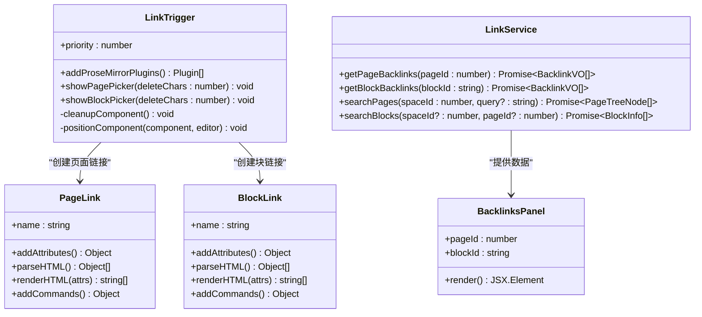
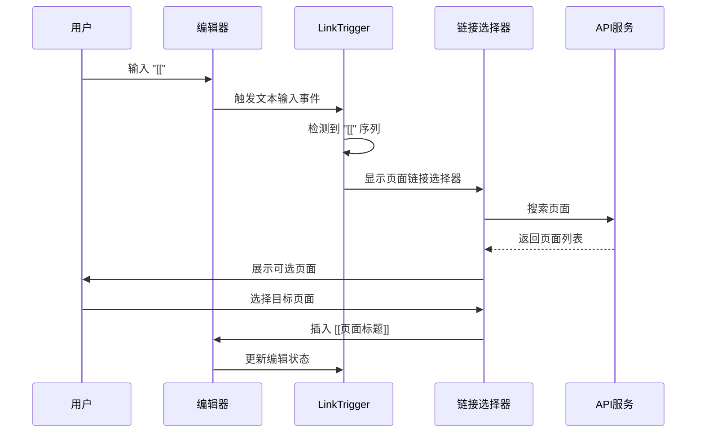
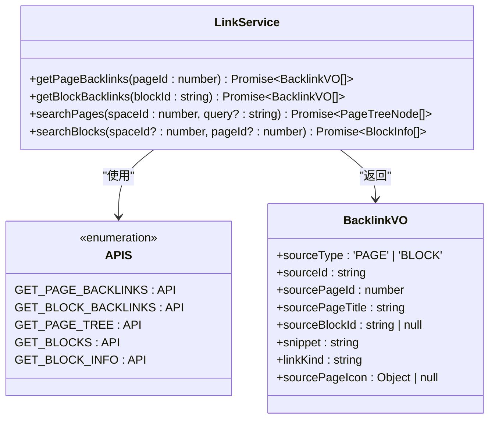
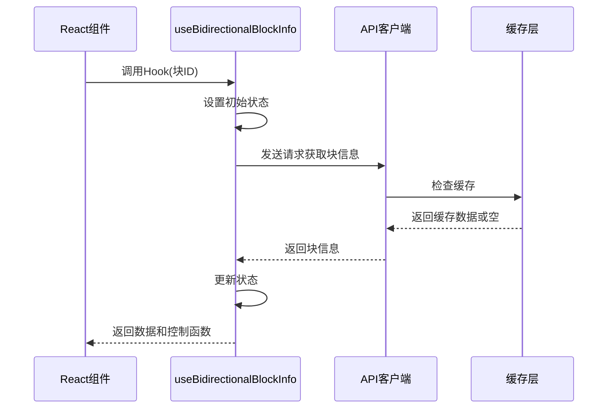
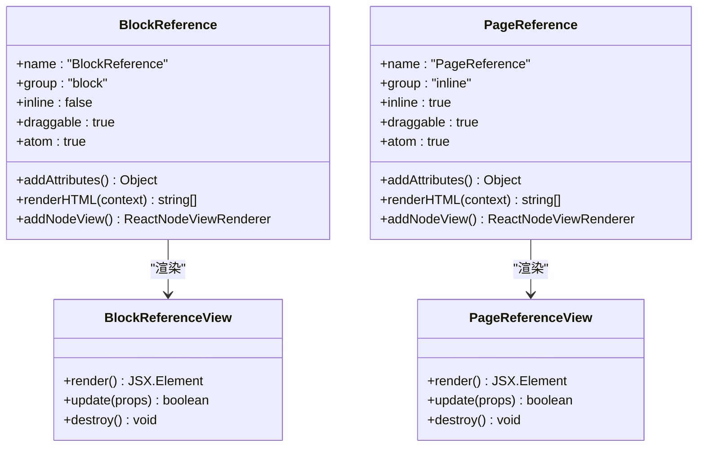

# 双向链接系统

<cite>
**本文档中引用的文件**
- [README.md](file://README.md)
- [package.json](file://package.json)
- [packages/plugin-block-reference/README.md](file://packages/plugin-block-reference/README.md)
- [packages/plugin-block-reference/package.json](file://packages/plugin-block-reference/package.json)
- [packages/plugin-block-reference/src/bidirectional-link/index.ts](file://packages/plugin-block-reference/src/bidirectional-link/index.ts)
- [packages/plugin-block-reference/src/bidirectional-link/api/index.ts](file://packages/plugin-block-reference/src/bidirectional-link/api/index.ts)
- [packages/plugin-block-reference/src/bidirectional-link/services/linkService.ts](file://packages/plugin-block-reference/src/bidirectional-link/services/linkService.ts)
- [packages/plugin-block-reference/src/bidirectional-link/hooks/useBidirectionalBlockInfo.ts](file://packages/plugin-block-reference/src/bidirectional-link/hooks/useBidirectionalBlockInfo.ts)
- [packages/plugin-block-reference/src/bidirectional-link/extensions/PageLink.ts](file://packages/plugin-block-reference/src/bidirectional-link/extensions/PageLink.ts)
- [packages/plugin-block-reference/src/bidirectional-link/extensions/LinkTrigger.ts](file://packages/plugin-block-reference/src/bidirectional-link/extensions/LinkTrigger.ts)
- [packages/plugin-block-reference/src/extension/block-reference/block-references.ts](file://packages/plugin-block-reference/src/extension/block-reference/block-references.ts)
- [packages/plugin-block-reference/src/extension/block-reference/page-reference.ts](file://packages/plugin-block-reference/src/extension/block-reference/page-reference.ts)
- [packages/plugin-block-reference/src/types/index.ts](file://packages/plugin-block-reference/src/types/index.ts)
- [packages/core/package.json](file://packages/core/package.json)
- [packages/editor/package.json](file://packages/editor/package.json)
</cite>

## 目录
1. [简介](#简介)
2. [项目结构](#项目结构)
3. [核心组件](#核心组件)
4. [架构概览](#架构概览)
5. [详细组件分析](#详细组件分析)
6. [依赖关系分析](#依赖关系分析)
7. [性能考虑](#性能考虑)
8. [故障排除指南](#故障排除指南)
9. [结论](#结论)

## 简介

双向链接系统是知识管理平台的核心功能之一，它允许用户在文档之间建立智能链接，并自动追踪反向链接（backlinks）。该系统基于 Tiptap 编辑器构建，提供了强大的双向链接功能，包括页面链接、块链接、智能搜索和反向链接面板。

系统的主要特性包括：
- 使用 `[[页面标题]]` 语法创建页面链接
- 使用 `((块ID))` 语法创建块链接  
- 自动检测触发符并弹出链接选择器
- 实时反向链接追踪和显示
- 智能搜索跨空间和页面的内容
- 高性能的 React 组件和缓存机制

## 项目结构

双向链接系统位于 `packages/plugin-block-reference` 包中，采用模块化设计，包含以下主要目录结构：

```mermaid
graph TB
subgraph "双向链接模块"
BL[index.ts<br/>模块入口]
API[api/index.ts<br/>API定义]
EXT[extensions/<br/>编辑器扩展]
SVC[services/<br/>服务层]
HOOK[hooks/<br/>自定义钩子]
CMP[components/<br/>React组件]
end
subgraph "核心包依赖"
CORE[@kn/core<br/>核心功能]
EDITOR[@kn/editor<br/>编辑器集成]
COMMON[@kn/common<br/>通用工具]
UI[@kn/ui<br/>UI组件]
end
BL --> API
BL --> EXT
BL --> SVC
BL --> HOOK
BL --> CMP
API --> CORE
EXT --> EDITOR
SVC --> CORE
HOOK --> CORE
CMP --> UI
```

**图表来源**
- [packages/plugin-block-reference/src/bidirectional-link/index.ts](file://packages/plugin-block-reference/src/bidirectional-link/index.ts#L1-L42)
- [packages/plugin-block-reference/package.json](file://packages/plugin-block-reference/package.json#L16-L24)

**章节来源**
- [packages/plugin-block-reference/README.md](file://packages/plugin-block-reference/README.md#L1-L105)
- [packages/plugin-block-reference/package.json](file://packages/plugin-block-reference/package.json#L1-L39)

## 核心组件

双向链接系统由多个相互协作的组件组成，每个组件都有明确的职责和功能：

### 主要组件架构



**图表来源**
- [packages/plugin-block-reference/src/bidirectional-link/extensions/LinkTrigger.ts](file://packages/plugin-block-reference/src/bidirectional-link/extensions/LinkTrigger.ts#L18-L161)
- [packages/plugin-block-reference/src/bidirectional-link/extensions/PageLink.ts](file://packages/plugin-block-reference/src/bidirectional-link/extensions/PageLink.ts#L24-L77)
- [packages/plugin-block-reference/src/bidirectional-link/services/linkService.ts](file://packages/plugin-block-reference/src/bidirectional-link/services/linkService.ts#L47-L95)

### 数据模型

系统使用多种数据结构来表示链接信息：

| 数据类型 | 结构 | 描述 |
|---------|------|------|
| BacklinkVO | 包含源类型、源ID、页面信息、块信息、片段内容等 | 反向链接值对象 |
| PageTreeNode | 包含ID、名称、父ID、子节点数组 | 页面树节点结构 |
| BlockInfo | 包含ID、页面ID、类型、内容 | 块信息结构 |
| PageReferenceAttrs | 包含页面ID、空间ID、引用类型 | 页面引用属性 |
| BlockReferenceAttrs | 包含块ID、空间ID、页面ID、类型 | 块引用属性 |

**章节来源**
- [packages/plugin-block-reference/src/types/index.ts](file://packages/plugin-block-reference/src/types/index.ts#L20-L60)
- [packages/plugin-block-reference/src/bidirectional-link/services/linkService.ts](file://packages/plugin-block-reference/src/bidirectional-link/services/linkService.ts#L12-L41)

## 架构概览

双向链接系统采用分层架构设计，从底层的数据访问到上层的用户界面都经过精心设计：

```mermaid
graph TB
subgraph "用户界面层"
UI[React组件<br/>PageLinkPicker<br/>BlockLinkPicker<br/>BacklinksPanel]
end
subgraph "业务逻辑层"
HOOKS[自定义Hook<br/>useBidirectionalBlockInfo<br/>useLinkTriggers]
SERVICES[服务层<br/>linkService<br/>SpaceService]
end
subgraph "编辑器集成层"
EXTENSIONS[编辑器扩展<br/>PageLink<br/>BlockLink<br/>LinkTrigger]
NODES[节点定义<br/>BlockReference<br/>PageReference]
end
subgraph "API层"
API[API定义<br/>GET_PAGE_BACKLINKS<br/>GET_BLOCK_BACKLINKS<br/>GET_PAGE_TREE<br/>GET_BLOCKS]
end
subgraph "核心依赖"
CORE[@kn/core<br/>API客户端]
EDITOR[@kn/editor<br/>Tiptap集成]
COMMON[@kn/common<br/>服务接口]
end
UI --> HOOKS
HOOKS --> SERVICES
SERVICES --> API
API --> CORE
HOOKS --> EXTENSIONS
EXTENSIONS --> NODES
NODES --> EDITOR
SERVICES --> COMMON
EXTENSIONS --> EDITOR
EDITOR --> CORE
```

**图表来源**
- [packages/plugin-block-reference/src/bidirectional-link/index.ts](file://packages/plugin-block-reference/src/bidirectional-link/index.ts#L13-L41)
- [packages/plugin-block-reference/src/bidirectional-link/api/index.ts](file://packages/plugin-block-reference/src/bidirectional-link/api/index.ts#L8-L43)

## 详细组件分析

### 链接触发器组件

链接触发器是双向链接系统的核心组件，负责监听编辑器中的特殊字符序列并自动弹出相应的链接选择器。



**图表来源**
- [packages/plugin-block-reference/src/bidirectional-link/extensions/LinkTrigger.ts](file://packages/plugin-block-reference/src/bidirectional-link/extensions/LinkTrigger.ts#L126-L159)

链接触发器的工作流程包括：
1. 监听编辑器的文本输入事件
2. 检测特定的触发字符序列（`[[` 和 `((`）
3. 自动清理触发字符并显示相应的选择器
4. 处理用户的选择并插入格式化的链接
5. 管理组件的生命周期和位置计算

**章节来源**
- [packages/plugin-block-reference/src/bidirectional-link/extensions/LinkTrigger.ts](file://packages/plugin-block-reference/src/bidirectional-link/extensions/LinkTrigger.ts#L1-L162)

### 页面链接扩展

页面链接扩展实现了 `[[页面标题]]` 语法的支持，提供了完整的页面链接功能。

```mermaid
flowchart TD
Start([开始创建页面链接]) --> Detect[检测链接语法]
Detect --> Parse[解析页面信息]
Parse --> Insert[插入链接内容]
Insert --> Format[格式化HTML输出]
Format --> Render[渲染链接视图]
Render --> End([完成])
Insert --> Attrs[设置链接属性<br/>pageId, title]
Attrs --> HTML[生成HTML标签<br/>data-page-link="true"]
HTML --> Style[应用样式<br/>颜色, 边框样式]
```

**图表来源**
- [packages/plugin-block-reference/src/bidirectional-link/extensions/PageLink.ts](file://packages/plugin-block-reference/src/bidirectional-link/extensions/PageLink.ts#L57-L76)

页面链接扩展的关键特性：
- 支持 `setPageLink` 和 `unsetPageLink` 命令
- 自动解析页面ID和标题
- 提供格式化的HTML输出
- 支持点击交互和样式定制

**章节来源**
- [packages/plugin-block-reference/src/bidirectional-link/extensions/PageLink.ts](file://packages/plugin-block-reference/src/bidirectional-link/extensions/PageLink.ts#L1-L78)

### 链接服务层

链接服务层提供了所有与后端API交互的功能，包括反向链接查询、页面搜索和块搜索。



**图表来源**
- [packages/plugin-block-reference/src/bidirectional-link/services/linkService.ts](file://packages/plugin-block-reference/src/bidirectional-link/services/linkService.ts#L47-L95)
- [packages/plugin-block-reference/src/bidirectional-link/api/index.ts](file://packages/plugin-block-reference/src/bidirectional-link/api/index.ts#L8-L43)

链接服务层的设计特点：
- 使用统一的API客户端进行网络请求
- 提供错误处理和降级机制
- 支持异步数据加载和状态管理
- 返回标准化的数据结构

**章节来源**
- [packages/plugin-block-reference/src/bidirectional-link/services/linkService.ts](file://packages/plugin-block-reference/src/bidirectional-link/services/linkService.ts#L1-L96)

### 自定义Hook系统

自定义Hook提供了可重用的数据获取和状态管理逻辑。



**图表来源**
- [packages/plugin-block-reference/src/bidirectional-link/hooks/useBidirectionalBlockInfo.ts](file://packages/plugin-block-reference/src/bidirectional-link/hooks/useBidirectionalBlockInfo.ts#L28-L60)

自定义Hook的优势：
- 提高代码复用性
- 简化组件逻辑
- 提供一致的状态管理
- 支持条件加载和重新获取

**章节来源**
- [packages/plugin-block-reference/src/bidirectional-link/hooks/useBidirectionalBlockInfo.ts](file://packages/plugin-block-reference/src/bidirectional-link/hooks/useBidirectionalBlockInfo.ts#L1-L61)

### 编辑器节点集成

系统通过自定义编辑器节点实现块引用和页面引用的功能。



**图表来源**
- [packages/plugin-block-reference/src/extension/block-reference/block-references.ts](file://packages/plugin-block-reference/src/extension/block-reference/block-references.ts#L10-L42)
- [packages/plugin-block-reference/src/extension/block-reference/page-reference.ts](file://packages/plugin-block-reference/src/extension/block-reference/page-reference.ts#L6-L35)

**章节来源**
- [packages/plugin-block-reference/src/extension/block-reference/block-references.ts](file://packages/plugin-block-reference/src/extension/block-reference/block-references.ts#L1-L42)
- [packages/plugin-block-reference/src/extension/block-reference/page-reference.ts](file://packages/plugin-block-reference/src/extension/block-reference/page-reference.ts#L1-L35)

## 依赖关系分析

双向链接系统的依赖关系体现了清晰的分层架构和模块化设计：

```mermaid
graph TB
subgraph "外部依赖"
REACT[React 18<br/>状态管理]
TIP[TipTap 3.15.3<br/>富文本编辑]
YJS[Yjs 13.6.21<br/>实时协作]
HOCUS[Hocuspocus<br/>协作后端]
end
subgraph "内部包依赖"
PBR[@kn/plugin-block-reference<br/>双向链接插件]
CORE[@kn/core<br/>核心功能]
EDITOR[@kn/editor<br/>编辑器集成]
COMMON[@kn/common<br/>通用工具]
UI[@kn/ui<br/>UI组件库]
ICON[@kn/icon<br/>图标库]
end
PBR --> CORE
PBR --> EDITOR
PBR --> COMMON
PBR --> UI
PBR --> ICON
EDITOR --> REACT
EDITOR --> TIP
EDITOR --> YJS
EDITOR --> HOCUS
CORE --> COMMON
CORE --> UI
CORE --> ICON
```

**图表来源**
- [packages/plugin-block-reference/package.json](file://packages/plugin-block-reference/package.json#L16-L24)
- [packages/core/package.json](file://packages/core/package.json#L17-L33)
- [packages/editor/package.json](file://packages/editor/package.json#L16-L93)

**章节来源**
- [package.json](file://package.json#L1-L120)
- [packages/plugin-block-reference/package.json](file://packages/plugin-block-reference/package.json#L16-L24)

## 性能考虑

双向链接系统在设计时充分考虑了性能优化，采用了多种策略来确保良好的用户体验：

### 性能优化策略

1. **React.memo 优化**：所有组件都使用 React.memo 进行优化，减少不必要的重新渲染
2. **缓存机制**：实现智能缓存避免重复的API调用
3. **事件监听器清理**：确保组件卸载时正确清理事件监听器，防止内存泄漏
4. **防抖搜索**：对搜索功能使用防抖技术，减少API调用频率
5. **条件加载**：支持按需加载和条件触发，避免不必要的初始化

### 内存管理

系统实现了完善的内存管理机制：
- 组件销毁时自动清理所有事件监听器
- ReactRenderer 组件的生命周期管理
- API请求的取消和清理
- DOM元素的正确移除和引用清理

**章节来源**
- [packages/plugin-block-reference/README.md](file://packages/plugin-block-reference/README.md#L76-L83)

## 故障排除指南

### 常见问题及解决方案

#### 链接无法正常工作

**问题描述**：用户输入 `[[` 或 `((` 后没有出现链接选择器

**可能原因**：
1. 编辑器扩展未正确注册
2. 权限配置问题
3. 网络请求失败

**解决步骤**：
1. 检查编辑器是否正确初始化
2. 验证 API 服务是否可用
3. 查看浏览器控制台错误信息
4. 确认用户权限配置

#### 反向链接不显示

**问题描述**：页面或块的反向链接面板为空

**可能原因**：
1. 数据库中缺少反向链接记录
2. API 查询参数错误
3. 缓存数据过期

**解决步骤**：
1. 检查后端服务日志
2. 验证查询参数格式
3. 清除缓存并重新加载
4. 检查数据库连接状态

#### 组件渲染异常

**问题描述**：链接选择器或反向链接面板显示异常

**可能原因**：
1. React 组件状态管理问题
2. DOM 元素定位计算错误
3. 样式冲突

**解决步骤**：
1. 检查组件的生命周期方法
2. 验证 DOM 定位算法
3. 检查 CSS 样式冲突
4. 确认 z-index 层级设置

**章节来源**
- [packages/plugin-block-reference/src/bidirectional-link/extensions/LinkTrigger.ts](file://packages/plugin-block-reference/src/bidirectional-link/extensions/LinkTrigger.ts#L26-L36)
- [packages/plugin-block-reference/src/bidirectional-link/hooks/useBidirectionalBlockInfo.ts](file://packages/plugin-block-reference/src/bidirectional-link/hooks/useBidirectionalBlockInfo.ts#L33-L51)

## 结论

双向链接系统是一个设计精良、功能完备的知识管理功能模块。它通过以下关键特性为用户提供卓越的体验：

### 核心优势

1. **直观的语法**：简单的 `[[页面]]` 和 `((块))` 语法降低了学习成本
2. **智能触发**：自动检测触发符并提供即时反馈
3. **高性能设计**：多层优化确保流畅的用户体验
4. **模块化架构**：清晰的分层设计便于维护和扩展
5. **完整的生态**：与整个知识管理平台无缝集成

### 技术亮点

- 基于 Tiptap 的强大编辑器框架
- 实时协作支持确保多人同时编辑
- 完整的 TypeScript 类型系统
- 模块化的包结构便于独立开发
- 丰富的自定义Hook提升开发效率

### 未来发展

系统已经具备了坚实的基础，未来可以进一步增强：
- 更智能的链接建议和自动补全
- 高级搜索和过滤功能
- 移动端优化和支持
- 更丰富的可视化选项
- 扩展的权限和安全机制

双向链接系统为知识管理平台提供了强大的基础能力，是构建现代协作知识库不可或缺的重要组成部分。