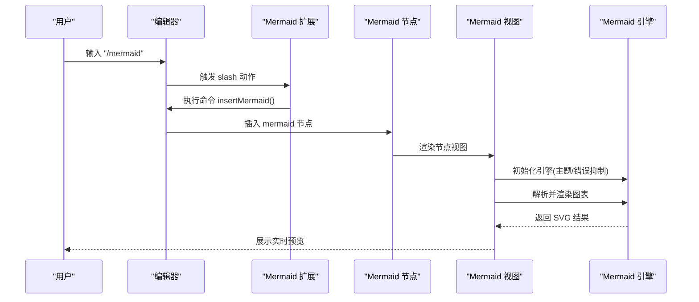
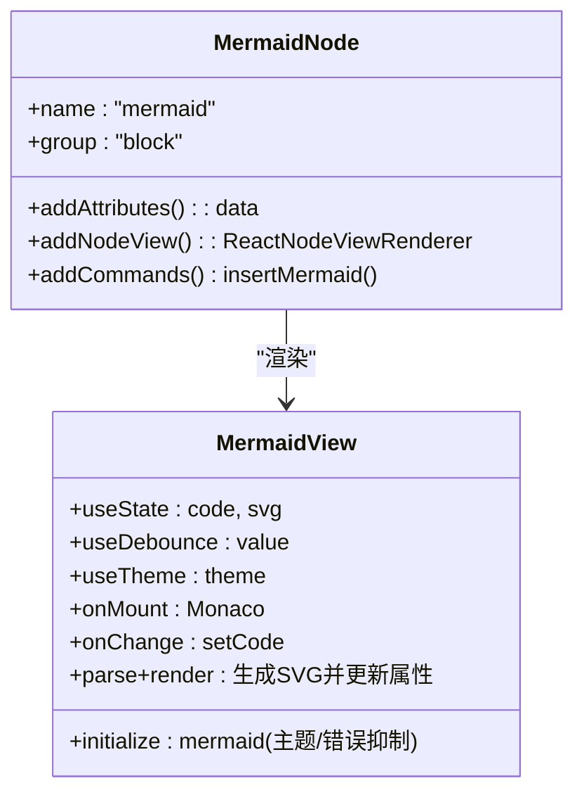
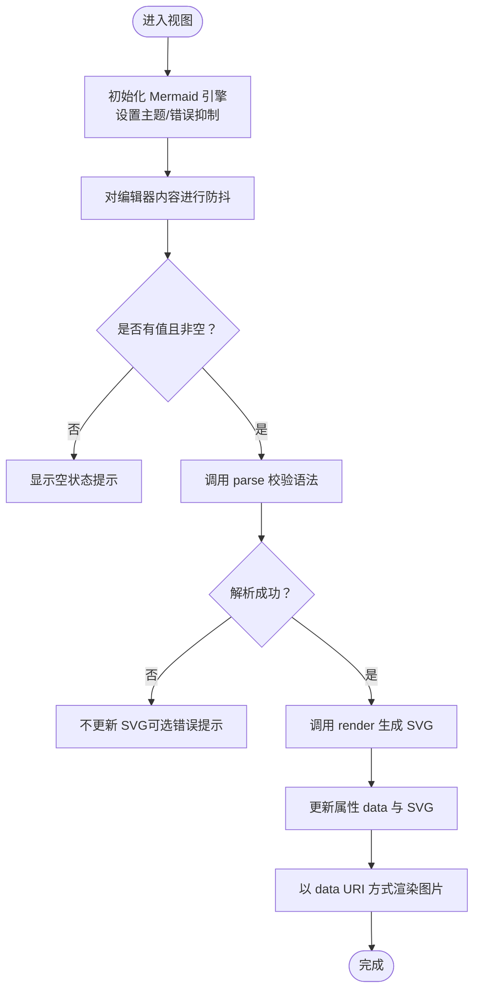
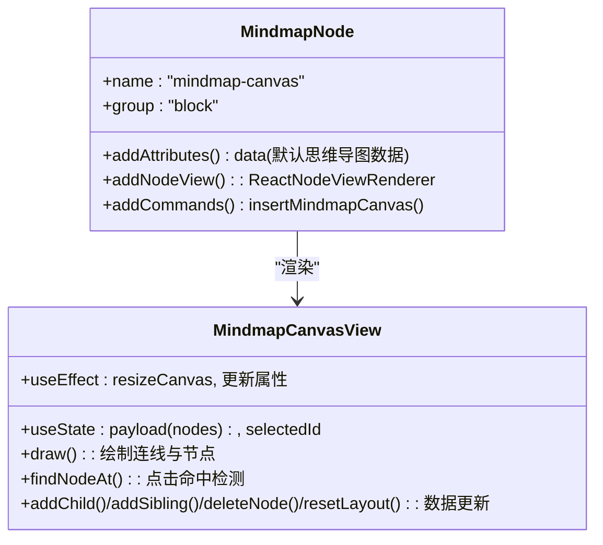
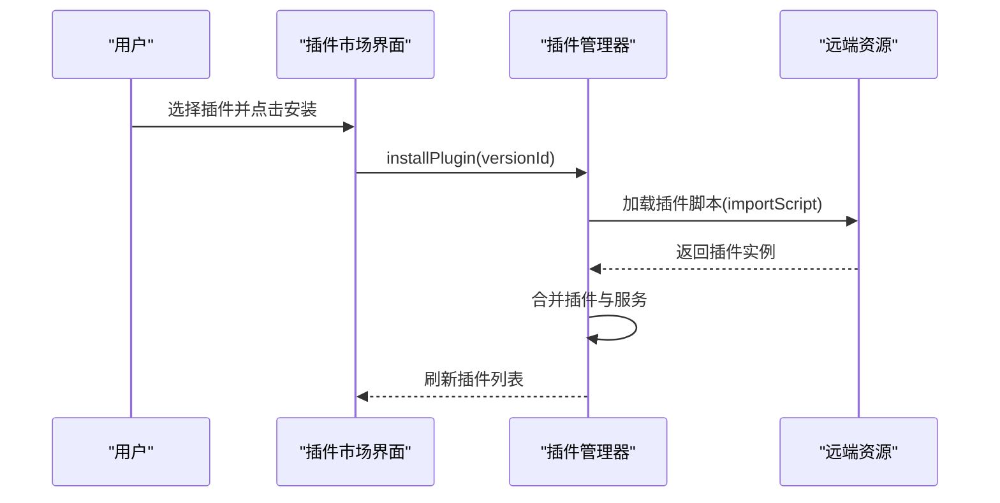
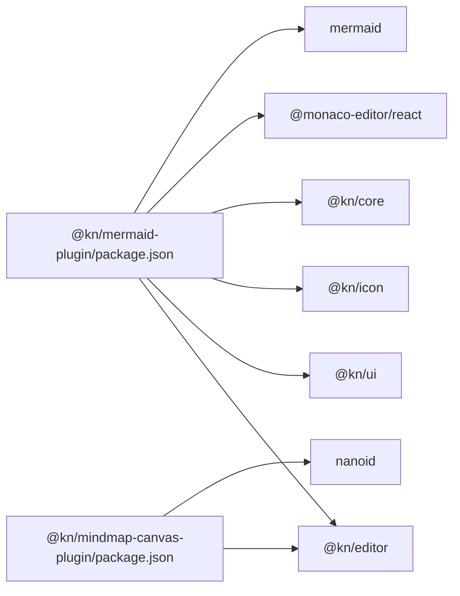

# 图表插件

<cite>
**本文引用的文件**
- [packages/plugin-mermaid/src/index.tsx](file://packages/plugin-mermaid/src/index.tsx)
- [packages/plugin-mermaid/src/editor-extension/mermaid/index.tsx](file://packages/plugin-mermaid/src/editor-extension/mermaid/index.tsx)
- [packages/plugin-mermaid/src/editor-extension/mermaid/mermaid.ts](file://packages/plugin-mermaid/src/editor-extension/mermaid/mermaid.ts)
- [packages/plugin-mermaid/src/editor-extension/mermaid/MermaidView.tsx](file://packages/plugin-mermaid/src/editor-extension/mermaid/MermaidView.tsx)
- [packages/plugin-mermaid/package.json](file://packages/plugin-mermaid/package.json)
- [packages/plugin-mindmap-canvas/src/index.tsx](file://packages/plugin-mindmap-canvas/src/index.tsx)
- [packages/plugin-mindmap-canvas/src/mindmap-extension.tsx](file://packages/plugin-mindmap-canvas/src/mindmap-extension.tsx)
- [packages/plugin-mindmap-canvas/src/nodes/mindmap-canvas.tsx](file://packages/plugin-mindmap-canvas/src/nodes/mindmap-canvas.tsx)
- [packages/plugin-mindmap-canvas/src/views/MindmapCanvasView.tsx](file://packages/plugin-mindmap-canvas/src/views/MindmapCanvasView.tsx)
- [packages/common/src/core/PluginManager.ts](file://packages/common/src/core/PluginManager.ts)
- [packages/core/src/components/Shop/Marketplace/index.tsx](file://packages/core/src/components/Shop/Marketplace/index.tsx)
</cite>

## 目录
1. [简介](#简介)
2. [项目结构](#项目结构)
3. [核心组件](#核心组件)
4. [架构总览](#架构总览)
5. [详细组件分析](#详细组件分析)
6. [依赖关系分析](#依赖关系分析)
7. [性能考虑](#性能考虑)
8. [故障排查指南](#故障排查指南)
9. [结论](#结论)
10. [附录](#附录)

## 简介
本文件系统性地介绍图表插件（以 Mermaid 与思维导图为例）在编辑器中的实现与使用方法。内容覆盖：
- 图表类型：Mermaid 流程图/时序图/类图/状态图等；思维导图画布
- 图表视图：渲染、交互、编辑模式
- 语法支持与样式定制：主题切换、错误抑制、基础样式
- 导出能力：当前实现以 SVG 渲染为主，可结合导出模块进行扩展
- 使用示例与最佳实践：插入、编辑、性能优化与排错

## 项目结构
图表插件采用“插件化 + 编辑器扩展”的组织方式：
- 插件入口负责注册编辑器扩展，并暴露给插件管理器
- 编辑器扩展定义节点类型、命令与菜单/快捷指令
- 节点视图负责渲染与交互（Mermaid 使用内嵌编辑器 + 实时渲染；思维导图使用 Canvas）

```mermaid
graph TB
subgraph "Mermaid 插件"
MIndex["Mermaid 插件入口<br/>packages/plugin-mermaid/src/index.tsx"]
MExt["Mermaid 扩展<br/>packages/plugin-mermaid/src/editor-extension/mermaid/index.tsx"]
MNode["Mermaid 节点定义<br/>packages/plugin-mermaid/src/editor-extension/mermaid/mermaid.ts"]
MView["Mermaid 视图组件<br/>packages/plugin-mermaid/src/editor-extension/mermaid/MermaidView.tsx"]
end
subgraph "思维导图插件"
MMIndex["思维导图插件入口<br/>packages/plugin-mindmap-canvas/src/index.tsx"]
MMExt["思维导图扩展<br/>packages/plugin-mindmap-canvas/src/mindmap-extension.tsx"]
MMNode["思维导图节点<br/>packages/plugin-mindmap-canvas/src/nodes/mindmap-canvas.tsx"]
MMView["思维导图画布视图<br/>packages/plugin-mindmap-canvas/src/views/MindmapCanvasView.tsx"]
end
subgraph "插件管理"
PM["插件管理器<br/>packages/common/src/core/PluginManager.ts"]
Market["插件市场安装界面<br/>packages/core/src/components/Shop/Marketplace/index.tsx"]
end
MIndex --> MExt --> MNode --> MView
MMIndex --> MMExt --> MMNode --> MMView
PM <- --> MIndex
PM <- --> MMIndex
Market --> PM
```

**图表来源**
- [packages/plugin-mermaid/src/index.tsx](file://packages/plugin-mermaid/src/index.tsx#L1-L17)
- [packages/plugin-mermaid/src/editor-extension/mermaid/index.tsx](file://packages/plugin-mermaid/src/editor-extension/mermaid/index.tsx#L1-L20)
- [packages/plugin-mermaid/src/editor-extension/mermaid/mermaid.ts](file://packages/plugin-mermaid/src/editor-extension/mermaid/mermaid.ts#L1-L43)
- [packages/plugin-mermaid/src/editor-extension/mermaid/MermaidView.tsx](file://packages/plugin-mermaid/src/editor-extension/mermaid/MermaidView.tsx#L1-L75)
- [packages/plugin-mindmap-canvas/src/index.tsx](file://packages/plugin-mindmap-canvas/src/index.tsx#L1-L13)
- [packages/plugin-mindmap-canvas/src/mindmap-extension.tsx](file://packages/plugin-mindmap-canvas/src/mindmap-extension.tsx#L1-L18)
- [packages/plugin-mindmap-canvas/src/nodes/mindmap-canvas.tsx](file://packages/plugin-mindmap-canvas/src/nodes/mindmap-canvas.tsx#L1-L52)
- [packages/plugin-mindmap-canvas/src/views/MindmapCanvasView.tsx](file://packages/plugin-mindmap-canvas/src/views/MindmapCanvasView.tsx#L1-L249)
- [packages/common/src/core/PluginManager.ts](file://packages/common/src/core/PluginManager.ts#L76-L103)
- [packages/core/src/components/Shop/Marketplace/index.tsx](file://packages/core/src/components/Shop/Marketplace/index.tsx#L33-L61)

**章节来源**
- [packages/plugin-mermaid/src/index.tsx](file://packages/plugin-mermaid/src/index.tsx#L1-L17)
- [packages/plugin-mindmap-canvas/src/index.tsx](file://packages/plugin-mindmap-canvas/src/index.tsx#L1-L13)

## 核心组件
- Mermaid 插件入口：注册编辑器扩展，暴露名称与扩展列表
- Mermaid 扩展：定义节点、命令、Slash 指令
- Mermaid 节点：声明属性 data 存放图表源码，绑定 React 视图
- Mermaid 视图：集成 Monaco 编辑器，实时解析与渲染 Mermaid，支持主题切换
- 思维导图插件：提供 Canvas 绘制、节点增删改与布局重置等交互

**章节来源**
- [packages/plugin-mermaid/src/index.tsx](file://packages/plugin-mermaid/src/index.tsx#L1-L17)
- [packages/plugin-mermaid/src/editor-extension/mermaid/index.tsx](file://packages/plugin-mermaid/src/editor-extension/mermaid/index.tsx#L1-L20)
- [packages/plugin-mermaid/src/editor-extension/mermaid/mermaid.ts](file://packages/plugin-mermaid/src/editor-extension/mermaid/mermaid.ts#L1-L43)
- [packages/plugin-mermaid/src/editor-extension/mermaid/MermaidView.tsx](file://packages/plugin-mermaid/src/editor-extension/mermaid/MermaidView.tsx#L1-L75)
- [packages/plugin-mindmap-canvas/src/index.tsx](file://packages/plugin-mindmap-canvas/src/index.tsx#L1-L13)
- [packages/plugin-mindmap-canvas/src/mindmap-extension.tsx](file://packages/plugin-mindmap-canvas/src/mindmap-extension.tsx#L1-L18)
- [packages/plugin-mindmap-canvas/src/nodes/mindmap-canvas.tsx](file://packages/plugin-mindmap-canvas/src/nodes/mindmap-canvas.tsx#L1-L52)
- [packages/plugin-mindmap-canvas/src/views/MindmapCanvasView.tsx](file://packages/plugin-mindmap-canvas/src/views/MindmapCanvasView.tsx#L1-L249)

## 架构总览
图表插件通过“节点 + 视图 + 命令 + Slash”实现一体化体验：
- 节点定义：声明属性与渲染标签
- 视图渲染：ReactNodeViewRenderer 将节点映射到视图组件
- 命令注入：统一的 insertMermaid/insertMindmapCanvas 命令
- 快捷指令：Slash 菜单提供“/mermaid”“/mindmap”等插入入口
- 插件管理：插件管理器加载与卸载插件，市场页面支持安装



**图表来源**
- [packages/plugin-mermaid/src/editor-extension/mermaid/index.tsx](file://packages/plugin-mermaid/src/editor-extension/mermaid/index.tsx#L1-L20)
- [packages/plugin-mermaid/src/editor-extension/mermaid/mermaid.ts](file://packages/plugin-mermaid/src/editor-extension/mermaid/mermaid.ts#L1-L43)
- [packages/plugin-mermaid/src/editor-extension/mermaid/MermaidView.tsx](file://packages/plugin-mermaid/src/editor-extension/mermaid/MermaidView.tsx#L1-L75)

## 详细组件分析

### Mermaid 组件分析
- 节点定义：声明节点名为 mermaid，分组为块级元素，提供 data 属性存储源码，注册 React 视图渲染器
- 命令：insertMermaid 用于在光标处插入 mermaid 节点
- 视图组件：集成 Monaco 编辑器，支持主题切换；对输入进行防抖处理，调用 mermaid.parse 与 mermaid.render 实时生成 SVG 并以 data URI 显示



**图表来源**
- [packages/plugin-mermaid/src/editor-extension/mermaid/mermaid.ts](file://packages/plugin-mermaid/src/editor-extension/mermaid/mermaid.ts#L1-L43)
- [packages/plugin-mermaid/src/editor-extension/mermaid/MermaidView.tsx](file://packages/plugin-mermaid/src/editor-extension/mermaid/MermaidView.tsx#L1-L75)

**章节来源**
- [packages/plugin-mermaid/src/editor-extension/mermaid/mermaid.ts](file://packages/plugin-mermaid/src/editor-extension/mermaid/mermaid.ts#L1-L43)
- [packages/plugin-mermaid/src/editor-extension/mermaid/MermaidView.tsx](file://packages/plugin-mermaid/src/editor-extension/mermaid/MermaidView.tsx#L1-L75)

### Mermaid 视图渲染流程


**图表来源**
- [packages/plugin-mermaid/src/editor-extension/mermaid/MermaidView.tsx](file://packages/plugin-mermaid/src/editor-extension/mermaid/MermaidView.tsx#L1-L75)

**章节来源**
- [packages/plugin-mermaid/src/editor-extension/mermaid/MermaidView.tsx](file://packages/plugin-mermaid/src/editor-extension/mermaid/MermaidView.tsx#L1-L75)

### 思维导图画布组件分析
- 节点定义：提供默认数据，渲染 HTML 容器，注册 React 视图
- 视图组件：基于 Canvas 绘制连线与节点，支持点击选择、添加子/兄弟节点、删除节点、重置布局等交互
- 数据模型：节点数组包含位置、父子关系与标签，绘制时按父子关系连线



**图表来源**
- [packages/plugin-mindmap-canvas/src/nodes/mindmap-canvas.tsx](file://packages/plugin-mindmap-canvas/src/nodes/mindmap-canvas.tsx#L1-L52)
- [packages/plugin-mindmap-canvas/src/views/MindmapCanvasView.tsx](file://packages/plugin-mindmap-canvas/src/views/MindmapCanvasView.tsx#L1-L249)

**章节来源**
- [packages/plugin-mindmap-canvas/src/nodes/mindmap-canvas.tsx](file://packages/plugin-mindmap-canvas/src/nodes/mindmap-canvas.tsx#L1-L52)
- [packages/plugin-mindmap-canvas/src/views/MindmapCanvasView.tsx](file://packages/plugin-mindmap-canvas/src/views/MindmapCanvasView.tsx#L1-L249)

### 插件管理与市场安装
- 插件管理器：支持远程插件加载、合并服务、卸载插件并触发刷新事件
- 市场页面：提供插件列表、分类筛选、安装流程，安装后通过插件管理器注入插件



**图表来源**
- [packages/common/src/core/PluginManager.ts](file://packages/common/src/core/PluginManager.ts#L76-L103)
- [packages/core/src/components/Shop/Marketplace/index.tsx](file://packages/core/src/components/Shop/Marketplace/index.tsx#L33-L61)

**章节来源**
- [packages/common/src/core/PluginManager.ts](file://packages/common/src/core/PluginManager.ts#L76-L103)
- [packages/core/src/components/Shop/Marketplace/index.tsx](file://packages/core/src/components/Shop/Marketplace/index.tsx#L33-L61)

## 依赖关系分析
- Mermaid 插件依赖：
  - @kn/editor：节点与视图渲染
  - @kn/ui/@kn/icon/@kn/core：主题、图标、异步效果
  - @monaco-editor/react：内嵌编辑器
  - mermaid：图表渲染引擎
- 思维导图插件依赖：
  - @kn/editor：节点与视图渲染
  - nanoid：生成唯一 ID
  - React/Canvas API：绘制与交互



**图表来源**
- [packages/plugin-mermaid/package.json](file://packages/plugin-mermaid/package.json#L1-L33)

**章节来源**
- [packages/plugin-mermaid/package.json](file://packages/plugin-mermaid/package.json#L1-L33)

## 性能考虑
- Mermaid 视图
  - 防抖：对编辑器输入进行 500ms 防抖，降低解析与渲染频率
  - 主题切换：仅在主题变化时重新初始化引擎，避免重复初始化
  - 渲染缓存：将 SVG 以 Base64 data URI 存储，减少重复渲染开销
  - 错误抑制：关闭错误渲染，避免异常语法导致 UI 抖动
- Canvas 思维导图
  - 设备像素比：根据设备像素比设置画布尺寸，保证清晰度
  - 重绘范围：仅在节点集合或容器尺寸变化时重绘
  - 交互操作：通过命中检测定位节点，批量更新数据模型后一次性重绘

**章节来源**
- [packages/plugin-mermaid/src/editor-extension/mermaid/MermaidView.tsx](file://packages/plugin-mermaid/src/editor-extension/mermaid/MermaidView.tsx#L1-L75)
- [packages/plugin-mindmap-canvas/src/views/MindmapCanvasView.tsx](file://packages/plugin-mindmap-canvas/src/views/MindmapCanvasView.tsx#L1-L249)

## 故障排查指南
- Mermaid 无预览
  - 检查是否提供有效源码；确认 parse 校验通过后再渲染
  - 确认主题切换后已重新初始化引擎
  - 若出现语法错误，当前实现会抑制错误渲染，请检查源码
- 视图空白或未更新
  - 确认节点属性 data 已更新
  - 检查防抖时间是否过长导致延迟
- 思维导图画布不显示
  - 检查容器尺寸计算与 Canvas 尺寸设置
  - 确认节点数组存在且包含根节点
- 插件未生效
  - 确认插件已安装并被插件管理器加载
  - 如从市场安装，确认安装流程完成并触发了刷新事件

**章节来源**
- [packages/plugin-mermaid/src/editor-extension/mermaid/MermaidView.tsx](file://packages/plugin-mermaid/src/editor-extension/mermaid/MermaidView.tsx#L1-L75)
- [packages/plugin-mindmap-canvas/src/views/MindmapCanvasView.tsx](file://packages/plugin-mindmap-canvas/src/views/MindmapCanvasView.tsx#L1-L249)
- [packages/common/src/core/PluginManager.ts](file://packages/common/src/core/PluginManager.ts#L76-L103)

## 结论
本图表插件以 Mermaid 与 Canvas 思维导图为典型代表，展示了“节点 + 视图 + 命令 + Slash + 插件管理”的完整闭环。Mermaid 提供强大的语法与实时渲染能力，思维导图提供直观的交互式编辑体验。通过主题适配、防抖与缓存策略，兼顾了可用性与性能。

## 附录

### 使用示例与最佳实践
- 插入 Mermaid 图表
  - 在编辑器中输入“/mermaid”，选择对应条目，即可插入空节点
  - 在右侧编辑器中编写 Mermaid 源码，实时预览
- 插入思维导图
  - 在编辑器中输入“/mindmap”，选择对应条目，即可插入默认思维导图
  - 点击画布选择节点，使用工具栏添加子节点/兄弟节点、删除节点、重置布局
- 语法与样式建议
  - Mermaid：优先使用官方语法，合理分组与注释；在深色/浅色主题间切换时保持一致性
  - 思维导图：控制节点数量，避免过度密集；必要时调整容器尺寸
- 导出建议
  - 当前以 SVG 渲染为主，可结合导出模块将 SVG 转换为 PNG 或 PDF
- 性能优化
  - 对频繁编辑的图表启用较长防抖间隔
  - 大型思维导图尽量减少重绘次数，批量更新数据模型后再渲染

**章节来源**
- [packages/plugin-mermaid/src/editor-extension/mermaid/index.tsx](file://packages/plugin-mermaid/src/editor-extension/mermaid/index.tsx#L1-L20)
- [packages/plugin-mindmap-canvas/src/mindmap-extension.tsx](file://packages/plugin-mindmap-canvas/src/mindmap-extension.tsx#L1-L18)