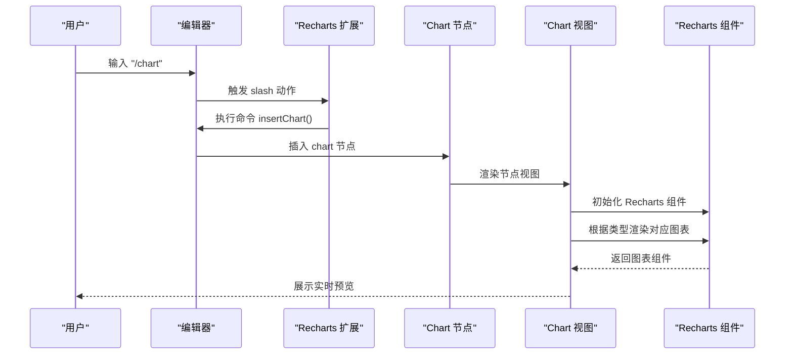
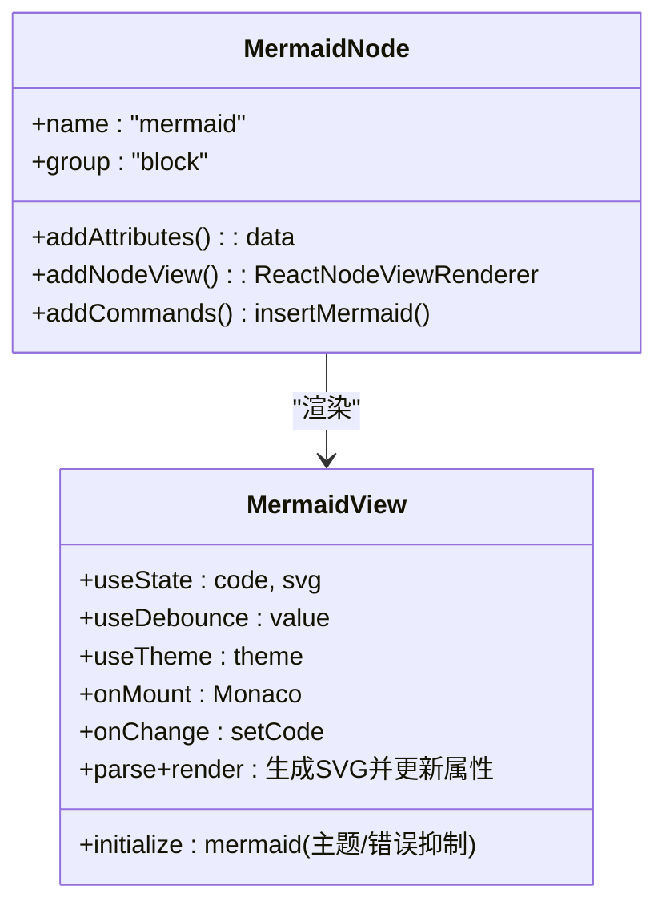
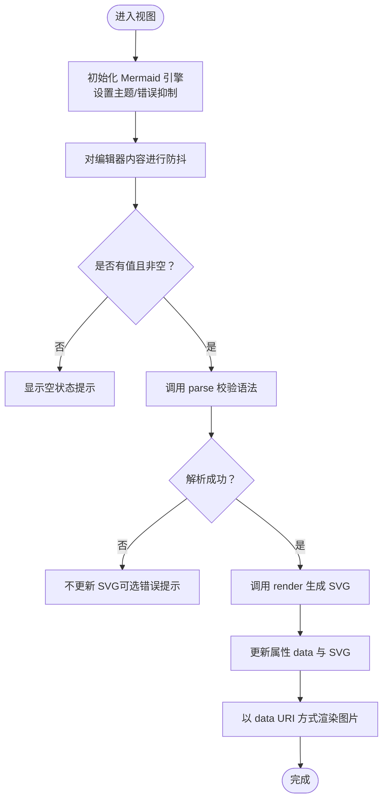
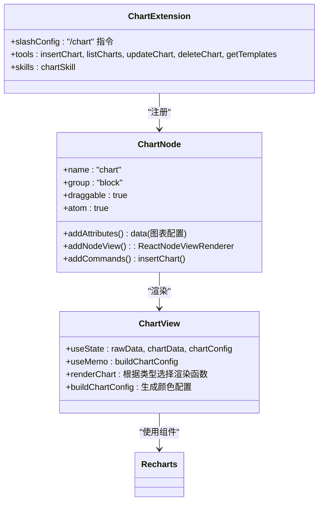
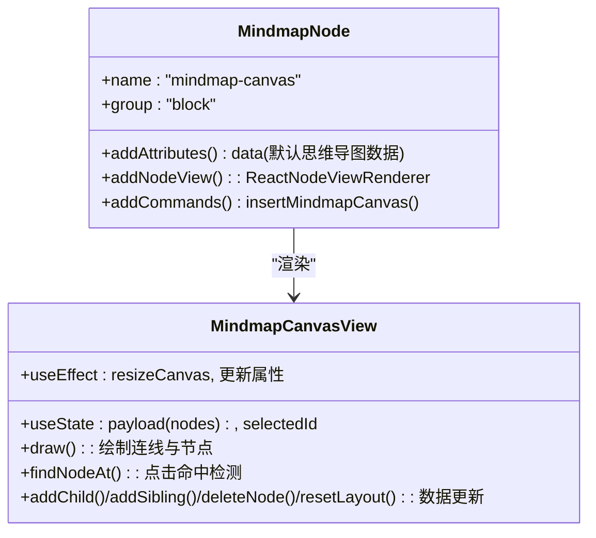
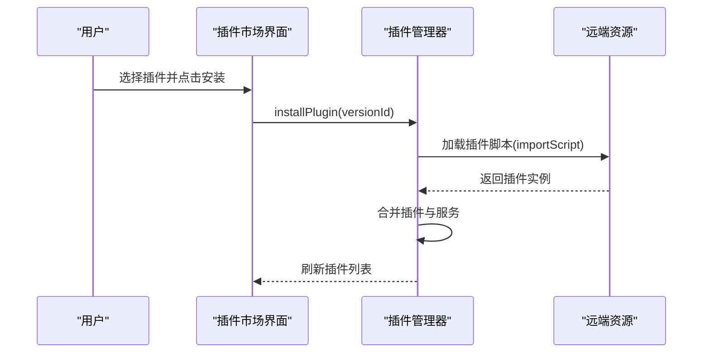
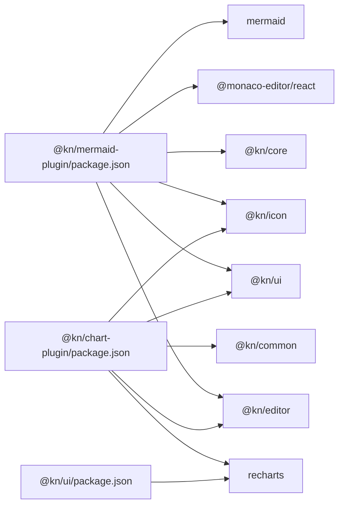

# 图表插件

<cite>
**本文引用的文件**
- [packages/plugin-mermaid/src/index.tsx](file://packages/plugin-mermaid/src/index.tsx)
- [packages/plugin-mermaid/src/editor-extension/mermaid/index.tsx](file://packages/plugin-mermaid/src/editor-extension/mermaid/index.tsx)
- [packages/plugin-mermaid/src/editor-extension/mermaid/mermaid.ts](file://packages/plugin-mermaid/src/editor-extension/mermaid/mermaid.ts)
- [packages/plugin-mermaid/src/editor-extension/mermaid/MermaidView.tsx](file://packages/plugin-mermaid/src/editor-extension/mermaid/MermaidView.tsx)
- [packages/plugin-mermaid/package.json](file://packages/plugin-mermaid/package.json)
- [packages/plugin-mindmap-canvas/src/index.tsx](file://packages/plugin-mindmap-canvas/src/index.tsx)
- [packages/plugin-mindmap-canvas/src/mindmap-extension.tsx](file://packages/plugin-mindmap-canvas/src/mindmap-extension.tsx)
- [packages/plugin-mindmap-canvas/src/nodes/mindmap-canvas.tsx](file://packages/plugin-mindmap-canvas/src/nodes/mindmap-canvas.tsx)
- [packages/plugin-mindmap-canvas/src/views/MindmapCanvasView.tsx](file://packages/plugin-mindmap-canvas/src/views/MindmapCanvasView.tsx)
- [packages/plugin-chart/src/index.tsx](file://packages/plugin-chart/src/index.tsx)
- [packages/plugin-chart/src/editor-extension/chart/chart.ts](file://packages/plugin-chart/src/editor-extension/chart/chart.ts)
- [packages/plugin-chart/src/editor-extension/chart/ChartView.tsx](file://packages/plugin-chart/src/editor-extension/chart/ChartView.tsx)
- [packages/plugin-chart/src/editor-extension/chart/index.tsx](file://packages/plugin-chart/src/editor-extension/chart/index.tsx)
- [packages/plugin-chart/src/editor-extension/chart/skills/chart-skill.ts](file://packages/plugin-chart/src/editor-extension/chart/skills/chart-skill.ts)
- [packages/plugin-chart/package.json](file://packages/plugin-chart/package.json)
- [packages/ui/src/components/ui/chart.tsx](file://packages/ui/src/components/ui/chart.tsx)
- [packages/common/src/core/PluginManager.ts](file://packages/common/src/core/PluginManager.ts)
- [packages/core/src/components/Shop/Marketplace/index.tsx](file://packages/core/src/components/Shop/Marketplace/index.tsx)
</cite>

## 更新摘要
**变更内容**
- 新增基于Recharts的全新图表可视化插件
- 支持七种图表类型：柱状图、折线图、面积图、饼图、雷达图、径向条形图、散点图
- 包含完整的编辑器扩展和ProseMirror集成
- 提供智能代理技能和工具集支持
- 集成shadcn/ui图表组件生态系统

## 目录
1. [简介](#简介)
2. [项目结构](#项目结构)
3. [核心组件](#核心组件)
4. [架构总览](#架构总览)
5. [详细组件分析](#详细组件分析)
6. [图表类型详解](#图表类型详解)
7. [智能代理集成](#智能代理集成)
8. [依赖关系分析](#依赖关系分析)
9. [性能考虑](#性能考虑)
10. [故障排查指南](#故障排查指南)
11. [结论](#结论)
12. [附录](#附录)

## 简介
本文件系统性地介绍图表插件在编辑器中的实现与使用方法，涵盖传统Mermaid图表和全新的基于Recharts的可视化图表插件。内容覆盖：
- 图表类型：Mermaid 流程图/时序图/类图/状态图等；七种Recharts图表类型
- 图表视图：渲染、交互、编辑模式
- 语法支持与样式定制：主题切换、错误抑制、基础样式
- 智能代理集成：图表生成、更新、删除的自动化支持
- 导出能力：当前实现以 SVG 渲染为主，可结合导出模块进行扩展
- 使用示例与最佳实践：插入、编辑、性能优化与排错

## 项目结构
图表插件采用"插件化 + 编辑器扩展"的组织方式，现已扩展为双插件架构：
- Mermaid 插件：传统图表渲染，基于Mermaid引擎
- Recharts 插件：现代数据可视化，基于shadcn/ui图表组件
- 插件入口负责注册编辑器扩展，并暴露给插件管理器
- 编辑器扩展定义节点类型、命令与菜单/快捷指令
- 节点视图负责渲染与交互（Mermaid 使用内嵌编辑器 + 实时渲染；Recharts 使用Recharts组件）

```mermaid
graph TB
subgraph "Mermaid 插件"
MIndex["Mermaid 插件入口<br/>packages/plugin-mermaid/src/index.tsx"]
MExt["Mermaid 扩展<br/>packages/plugin-mermaid/src/editor-extension/mermaid/index.tsx"]
MNode["Mermaid 节点定义<br/>packages/plugin-mermaid/src/editor-extension/mermaid/mermaid.ts"]
MView["Mermaid 视图组件<br/>packages/plugin-mermaid/src/editor-extension/mermaid/MermaidView.tsx"]
end
subgraph "Recharts 插件"
CIndex["Recharts 插件入口<br/>packages/plugin-chart/src/index.tsx"]
CExt["Recharts 扩展<br/>packages/plugin-chart/src/editor-extension/chart/index.tsx"]
CNode["Chart 节点定义<br/>packages/plugin-chart/src/editor-extension/chart/chart.ts"]
CView["Chart 视图组件<br/>packages/plugin-chart/src/editor-extension/chart/ChartView.tsx"]
CSkill["图表技能<br/>packages/plugin-chart/src/editor-extension/chart/skills/chart-skill.ts"]
end
subgraph "通用UI组件"
UIChart["UI图表组件<br/>packages/ui/src/components/ui/chart.tsx"]
end
subgraph "插件管理"
PM["插件管理器<br/>packages/common/src/core/PluginManager.ts"]
Market["插件市场安装界面<br/>packages/core/src/components/Shop/Marketplace/index.tsx"]
end
MIndex --> MExt --> MNode --> MView
CIndex --> CExt --> CNode --> CView
CExt --> CSkill
CView --> UIChart
PM <- --> MIndex
PM <- --> CIndex
Market --> PM
```

**图表来源**
- [packages/plugin-mermaid/src/index.tsx:1-17](file://packages/plugin-mermaid/src/index.tsx#L1-L17)
- [packages/plugin-mermaid/src/editor-extension/mermaid/index.tsx:1-20](file://packages/plugin-mermaid/src/editor-extension/mermaid/index.tsx#L1-L20)
- [packages/plugin-mermaid/src/editor-extension/mermaid/mermaid.ts:1-43](file://packages/plugin-mermaid/src/editor-extension/mermaid/mermaid.ts#L1-L43)
- [packages/plugin-mermaid/src/editor-extension/mermaid/MermaidView.tsx:1-75](file://packages/plugin-mermaid/src/editor-extension/mermaid/MermaidView.tsx#L1-L75)
- [packages/plugin-chart/src/index.tsx:1-17](file://packages/plugin-chart/src/index.tsx#L1-L17)
- [packages/plugin-chart/src/editor-extension/chart/index.tsx:1-453](file://packages/plugin-chart/src/editor-extension/chart/index.tsx#L1-L453)
- [packages/plugin-chart/src/editor-extension/chart/chart.ts:1-81](file://packages/plugin-chart/src/editor-extension/chart/chart.ts#L1-L81)
- [packages/plugin-chart/src/editor-extension/chart/ChartView.tsx:1-391](file://packages/plugin-chart/src/editor-extension/chart/ChartView.tsx#L1-L391)
- [packages/plugin-chart/src/editor-extension/chart/skills/chart-skill.ts:1-50](file://packages/plugin-chart/src/editor-extension/chart/skills/chart-skill.ts#L1-L50)
- [packages/ui/src/components/ui/chart.tsx:1-364](file://packages/ui/src/components/ui/chart.tsx#L1-L364)

**章节来源**
- [packages/plugin-mermaid/src/index.tsx:1-17](file://packages/plugin-mermaid/src/index.tsx#L1-L17)
- [packages/plugin-chart/src/index.tsx:1-17](file://packages/plugin-chart/src/index.tsx#L1-L17)

## 核心组件
- Mermaid 插件入口：注册编辑器扩展，暴露名称与扩展列表
- Mermaid 扩展：定义节点、命令、Slash 指令
- Mermaid 节点：声明属性 data 存放图表源码，绑定 React 视图
- Mermaid 视图：集成 Monaco 编辑器，实时解析与渲染 Mermaid，支持主题切换
- Recharts 插件入口：注册编辑器扩展，支持七种图表类型
- Recharts 扩展：定义节点、命令、Slash 指令和智能代理技能
- Chart 节点：声明属性 data 存放图表配置，绑定 React 视图
- Chart 视图：集成 Recharts 组件，支持多种图表类型渲染
- UI图表组件：基于shadcn/ui的ChartContainer、ChartTooltip等组件

**章节来源**
- [packages/plugin-mermaid/src/index.tsx:1-17](file://packages/plugin-mermaid/src/index.tsx#L1-L17)
- [packages/plugin-mermaid/src/editor-extension/mermaid/index.tsx:1-20](file://packages/plugin-mermaid/src/editor-extension/mermaid/index.tsx#L1-L20)
- [packages/plugin-mermaid/src/editor-extension/mermaid/mermaid.ts:1-43](file://packages/plugin-mermaid/src/editor-extension/mermaid/mermaid.ts#L1-L43)
- [packages/plugin-mermaid/src/editor-extension/mermaid/MermaidView.tsx:1-75](file://packages/plugin-mermaid/src/editor-extension/mermaid/MermaidView.tsx#L1-L75)
- [packages/plugin-chart/src/index.tsx:1-17](file://packages/plugin-chart/src/index.tsx#L1-L17)
- [packages/plugin-chart/src/editor-extension/chart/chart.ts:1-81](file://packages/plugin-chart/src/editor-extension/chart/chart.ts#L1-L81)
- [packages/plugin-chart/src/editor-extension/chart/ChartView.tsx:1-391](file://packages/plugin-chart/src/editor-extension/chart/ChartView.tsx#L1-L391)
- [packages/ui/src/components/ui/chart.tsx:1-364](file://packages/ui/src/components/ui/chart.tsx#L1-L364)

## 架构总览
图表插件通过"节点 + 视图 + 命令 + Slash + 智能代理"实现一体化体验：
- 节点定义：声明属性与渲染标签
- 视图渲染：ReactNodeViewRenderer 将节点映射到视图组件
- 命令注入：统一的 insertChart/insertMermaid/insertMindmapCanvas 命令
- 快捷指令：Slash 菜单提供"/chart"、"/mermaid"、"/mindmap"等插入入口
- 智能代理：Recharts插件提供完整的图表生成、更新、删除工具集
- 插件管理：插件管理器加载与卸载插件，市场页面支持安装

```mermaid
sequenceDiagram
participant U as "用户"
participant E as "编辑器"
participant CE as "Recharts 扩展"
participant CN as "Chart 节点"
participant CV as "Chart 视图"
participant RC as "Recharts 组件"
U->>E : 输入 "/chart"
E->>CE : 触发 slash 动作
CE->>E : 执行命令 insertChart()
E->>CN : 插入 chart 节点
CN->>CV : 渲染节点视图
CV->>RC : 初始化 Recharts 组件
CV->>RC : 根据类型渲染对应图表
RC-->>CV : 返回图表组件
CV-->>U : 展示实时预览
```

**图表来源**
- [packages/plugin-chart/src/editor-extension/chart/index.tsx:158-170](file://packages/plugin-chart/src/editor-extension/chart/index.tsx#L158-L170)
- [packages/plugin-chart/src/editor-extension/chart/chart.ts:44-81](file://packages/plugin-chart/src/editor-extension/chart/chart.ts#L44-L81)
- [packages/plugin-chart/src/editor-extension/chart/ChartView.tsx:321-391](file://packages/plugin-chart/src/editor-extension/chart/ChartView.tsx#L321-L391)

## 详细组件分析

### Mermaid 组件分析
- 节点定义：声明节点名为 mermaid，分组为块级元素，提供 data 属性存储源码，注册 React 视图渲染器
- 命令：insertMermaid 用于在光标处插入 mermaid 节点
- 视图组件：集成 Monaco 编辑器，支持主题切换；对输入进行防抖处理，调用 mermaid.parse 与 mermaid.render 实时生成 SVG 并以 data URI 显示

```mermaid
classDiagram
class MermaidNode {
+name : "mermaid"
+group : "block"
+addAttributes() : data
+addNodeView() : ReactNodeViewRenderer
+addCommands() : insertMermaid()
}
class MermaidView {
+useState : code, svg
+useDebounce : value
+useTheme : theme
+onMount : Monaco
+onChange : setCode
+initialize : mermaid(主题/错误抑制)
+parse+render : 生成SVG并更新属性
}
MermaidNode --> MermaidView : "渲染"
```

**图表来源**
- [packages/plugin-mermaid/src/editor-extension/mermaid/mermaid.ts:1-43](file://packages/plugin-mermaid/src/editor-extension/mermaid/mermaid.ts#L1-L43)
- [packages/plugin-mermaid/src/editor-extension/mermaid/MermaidView.tsx:1-75](file://packages/plugin-mermaid/src/editor-extension/mermaid/MermaidView.tsx#L1-L75)

**章节来源**
- [packages/plugin-mermaid/src/editor-extension/mermaid/mermaid.ts:1-43](file://packages/plugin-mermaid/src/editor-extension/mermaid/mermaid.ts#L1-L43)
- [packages/plugin-mermaid/src/editor-extension/mermaid/MermaidView.tsx:1-75](file://packages/plugin-mermaid/src/editor-extension/mermaid/MermaidView.tsx#L1-L75)

### Mermaid 视图渲染流程

```mermaid
flowchart TD
Start(["进入视图"]) --> Init["初始化 Mermaid 引擎<br/>设置主题/错误抑制"]
Init --> Debounce["对编辑器内容进行防抖"]
Debounce --> HasValue{"是否有值且非空？"}
HasValue -- 否 --> Empty["显示空状态提示"]
HasValue -- 是 --> Parse["调用 parse 校验语法"]
Parse --> Parsed{"解析成功？"}
Parsed -- 否 --> Error["不更新 SVG可选错误提示"]
Parsed -- 是 --> Render["调用 render 生成 SVG"]
Render --> Update["更新属性 data 与 SVG"]
Update --> Show["以 data URI 方式渲染图片"]
Show --> End(["完成"])
```

**图表来源**
- [packages/plugin-mermaid/src/editor-extension/mermaid/MermaidView.tsx:1-75](file://packages/plugin-mermaid/src/editor-extension/mermaid/MermaidView.tsx#L1-L75)

**章节来源**
- [packages/plugin-mermaid/src/editor-extension/mermaid/MermaidView.tsx:1-75](file://packages/plugin-mermaid/src/editor-extension/mermaid/MermaidView.tsx#L1-L75)

### Recharts 组件分析
- 节点定义：声明节点名为 chart，分组为块级元素，提供 data 属性存储图表配置，注册 React 视图渲染器
- 命令：insertChart 用于在光标处插入 chart 节点
- 视图组件：集成 Recharts 组件，支持七种图表类型渲染；根据配置动态选择渲染函数
- 智能代理：提供完整的工具集，包括插入、查询、更新、删除图表等操作

```mermaid
classDiagram
class ChartNode {
+name : "chart"
+group : "block"
+draggable : true
+atom : true
+addAttributes() : data(图表配置)
+addNodeView() : ReactNodeViewRenderer
+addCommands() : insertChart()
}
class ChartView {
+useState : rawData, chartData, chartConfig
+useMemo : buildChartConfig
+renderChart : 根据类型选择渲染函数
+buildChartConfig : 生成颜色配置
}
class ChartExtension {
+slashConfig : "/chart" 指令
+tools : insertChart, listCharts, updateChart, deleteChart, getTemplates
+skills : chartSkill
}
ChartNode --> ChartView : "渲染"
ChartExtension --> ChartNode : "注册"
ChartView --> Recharts : "使用组件"
```

**图表来源**
- [packages/plugin-chart/src/editor-extension/chart/chart.ts:44-81](file://packages/plugin-chart/src/editor-extension/chart/chart.ts#L44-L81)
- [packages/plugin-chart/src/editor-extension/chart/ChartView.tsx:321-391](file://packages/plugin-chart/src/editor-extension/chart/ChartView.tsx#L321-L391)
- [packages/plugin-chart/src/editor-extension/chart/index.tsx:158-170](file://packages/plugin-chart/src/editor-extension/chart/index.tsx#L158-L170)

**章节来源**
- [packages/plugin-chart/src/editor-extension/chart/chart.ts:1-81](file://packages/plugin-chart/src/editor-extension/chart/chart.ts#L1-L81)
- [packages/plugin-chart/src/editor-extension/chart/ChartView.tsx:1-391](file://packages/plugin-chart/src/editor-extension/chart/ChartView.tsx#L1-L391)
- [packages/plugin-chart/src/editor-extension/chart/index.tsx:1-453](file://packages/plugin-chart/src/editor-extension/chart/index.tsx#L1-L453)

### 思维导图画布组件分析
- 节点定义：提供默认数据，渲染 HTML 容器，注册 React 视图
- 视图组件：基于 Canvas 绘制连线与节点，支持点击选择、添加子/兄弟节点、删除节点、重置布局等交互
- 数据模型：节点数组包含位置、父子关系与标签，绘制时按父子关系连线

```mermaid
classDiagram
class MindmapNode {
+name : "mindmap-canvas"
+group : "block"
+addAttributes() : data(默认思维导图数据)
+addNodeView() : ReactNodeViewRenderer
+addCommands() : insertMindmapCanvas()
}
class MindmapCanvasView {
+useState : payload(nodes), selectedId
+useEffect : resizeCanvas, 更新属性
+draw() : 绘制连线与节点
+findNodeAt() : 点击命中检测
+addChild()/addSibling()/deleteNode()/resetLayout() : 数据更新
}
MindmapNode --> MindmapCanvasView : "渲染"
```

**图表来源**
- [packages/plugin-mindmap-canvas/src/nodes/mindmap-canvas.tsx:1-52](file://packages/plugin-mindmap-canvas/src/nodes/mindmap-canvas.tsx#L1-L52)
- [packages/plugin-mindmap-canvas/src/views/MindmapCanvasView.tsx:1-249](file://packages/plugin-mindmap-canvas/src/views/MindmapCanvasView.tsx#L1-L249)

**章节来源**
- [packages/plugin-mindmap-canvas/src/nodes/mindmap-canvas.tsx:1-52](file://packages/plugin-mindmap-canvas/src/nodes/mindmap-canvas.tsx#L1-L52)
- [packages/plugin-mindmap-canvas/src/views/MindmapCanvasView.tsx:1-249](file://packages/plugin-mindmap-canvas/src/views/MindmapCanvasView.tsx#L1-L249)

### 插件管理与市场安装
- 插件管理器：支持远程插件加载、合并服务、卸载插件并触发刷新事件
- 市场页面：提供插件列表、分类筛选、安装流程，安装后通过插件管理器注入插件

```mermaid
sequenceDiagram
participant U as "用户"
participant UI as "插件市场界面"
participant PM as "插件管理器"
participant Net as "远端资源"
U->>UI : 选择插件并点击安装
UI->>PM : installPlugin(versionId)
PM->>Net : 加载插件脚本(importScript)
Net-->>PM : 返回插件实例
PM->>PM : 合并插件与服务
PM-->>UI : 刷新插件列表
```

**图表来源**
- [packages/common/src/core/PluginManager.ts:76-103](file://packages/common/src/core/PluginManager.ts#L76-L103)
- [packages/core/src/components/Shop/Marketplace/index.tsx:33-61](file://packages/core/src/components/Shop/Marketplace/index.tsx#L33-L61)

**章节来源**
- [packages/common/src/core/PluginManager.ts:76-103](file://packages/common/src/core/PluginManager.ts#L76-L103)
- [packages/core/src/components/Shop/Marketplace/index.tsx:33-61](file://packages/core/src/components/Shop/Marketplace/index.tsx#L33-L61)

## 图表类型详解

### Recharts 支持的七种图表类型
Recharts插件支持以下七种图表类型，每种都有特定的数据结构和配置选项：

#### 1. 柱状图 (Bar Chart)
- **用途**：比较不同类别的数值大小
- **数据结构**：需要categoryKey作为x轴标签，dataKeys作为y轴数值
- **特性**：支持堆叠、水平布局、数据标签

#### 2. 折线图 (Line Chart)
- **用途**：展示趋势变化和连续数据
- **数据结构**：支持平滑曲线和直线两种类型
- **特性**：可配置点标记、线条粗细、数据标签

#### 3. 面积图 (Area Chart)
- **用途**：展示趋势和累积量
- **数据结构**：与折线图类似，但填充区域
- **特性**：支持堆叠面积图、透明度控制

#### 4. 饼图 (Pie Chart)
- **用途**：展示比例分布和构成
- **数据结构**：单个dataKey用于数值，categoryKey用于标签
- **特性**：支持环形图(innerRadius)、自定义颜色

#### 5. 雷达图 (Radar Chart)
- **用途**：多维度数据对比
- **数据结构**：多个dataKeys表示不同维度
- **特性**：极坐标网格、多系列对比

#### 6. 径向条形图 (Radial Bar Chart)
- **用途**：展示进度和完成度
- **数据结构**：单个dataKey表示百分比
- **特性**：圆形背景、圆角设计

#### 7. 散点图 (Scatter Chart)
- **用途**：展示两个变量之间的关系
- **数据结构**：需要至少两个dataKeys表示x和y坐标
- **特性**：支持第三个维度(ZAxis)表示大小

**章节来源**
- [packages/plugin-chart/src/editor-extension/chart/ChartView.tsx:88-316](file://packages/plugin-chart/src/editor-extension/chart/ChartView.tsx#L88-L316)
- [packages/plugin-chart/src/editor-extension/chart/index.tsx:13-131](file://packages/plugin-chart/src/editor-extension/chart/index.tsx#L13-L131)

### 图表配置参数详解
所有图表都支持以下通用配置参数：

| 参数名 | 类型 | 默认值 | 描述 |
|--------|------|--------|------|
| type | enum | 必填 | 图表类型：bar、line、area、pie、radar、radialBar、scatter |
| title | string | 无 | 图表标题 |
| description | string | 无 | 图表描述 |
| data | array | 必填 | 数据数组，每个元素为对象 |
| dataKeys | array | 必填 | 数据系列键名数组 |
| categoryKey | string | "name" | 分类键名（x轴/标签） |
| colors | object | 自动分配 | 颜色映射，key为dataKey，value为CSS颜色值 |
| showLegend | boolean | true | 是否显示图例 |
| showGrid | boolean | true | 是否显示网格线 |
| showDataLabels | boolean | false | 是否显示数据标签 |
| smoothLine | boolean | true | 折线/面积图是否使用平滑曲线 |
| stacked | boolean | false | 是否堆叠显示 |
| horizontal | boolean | false | 是否水平显示（仅柱状图） |
| height | number | 300 | 图表高度（像素） |
| innerRadius | number | 0 | 饼图内半径（用于环形图） |

**章节来源**
- [packages/plugin-chart/src/editor-extension/chart/chart.ts:8-34](file://packages/plugin-chart/src/editor-extension/chart/chart.ts#L8-L34)

## 智能代理集成

### 图表技能系统
Recharts插件提供了完整的智能代理技能系统，支持自动化的图表生成和管理：

#### chartSkill 技能
- **名称**：chart-skill
- **描述**：数据可视化图表技能，使用shadcn/ui图表组件创建各种数据可视化图表
- **支持工具**：insertChart、listCharts、updateChart、deleteChart、getChartTemplates
- **系统提示**：指导AI助手正确创建和管理图表

#### 图表工具集
插件提供了五个核心工具，支持完整的图表生命周期管理：

1. **insertChart**：插入新的图表
2. **listCharts**：列出文档中所有图表
3. **updateChart**：更新现有图表配置
4. **deleteChart**：删除图表
5. **getChartTemplates**：获取图表模板

**章节来源**
- [packages/plugin-chart/src/editor-extension/chart/skills/chart-skill.ts:1-50](file://packages/plugin-chart/src/editor-extension/chart/skills/chart-skill.ts#L1-L50)
- [packages/plugin-chart/src/editor-extension/chart/index.tsx:1-453](file://packages/plugin-chart/src/editor-extension/chart/index.tsx#L1-L453)

### 图表模板系统
插件内置了七种图表类型的完整模板，包含示例数据和配置：

- **柱状图模板**：月度收入对比
- **折线图模板**：用户增长趋势
- **面积图模板**：网站流量分布
- **饼图模板**：市场份额分布
- **雷达图模板**：技能评估对比
- **径向条形图模板**：项目完成进度
- **散点图模板**：身高体重关系

**章节来源**
- [packages/plugin-chart/src/editor-extension/chart/index.tsx:13-131](file://packages/plugin-chart/src/editor-extension/chart/index.tsx#L13-L131)

## 依赖关系分析
- Mermaid 插件依赖：
  - @kn/editor：节点与视图渲染
  - @kn/ui/@kn/icon/@kn/core：主题、图标、异步效果
  - @monaco-editor/react：内嵌编辑器
  - mermaid：图表渲染引擎
- Recharts 插件依赖：
  - @kn/editor：节点与视图渲染
  - @kn/ui：shadcn/ui图表组件
  - @kn/icon：图标库
  - @kn/common：通用工具
  - recharts：图表渲染引擎
- UI图表组件依赖：
  - recharts：底层图表库
  - shadcn/ui：设计系统

```mermaid
graph LR
M["@kn/mermaid-plugin/package.json"] --> E["@kn/editor"]
M --> UI["@kn/ui"]
M --> ICON["@kn/icon"]
M --> CORE["@kn/core"]
M --> MONACO["@monaco-editor/react"]
M --> MERMAID["mermaid"]
C["@kn/chart-plugin/package.json"] --> E
C --> UI
C --> ICON
C --> COMMON["@kn/common"]
C --> RECHARTS["recharts"]
U["@kn/ui/package.json"] --> RECHARTS
```

**图表来源**
- [packages/plugin-mermaid/package.json:1-33](file://packages/plugin-mermaid/package.json#L1-L33)
- [packages/plugin-chart/package.json:15-23](file://packages/plugin-chart/package.json#L15-L23)

**章节来源**
- [packages/plugin-mermaid/package.json:1-33](file://packages/plugin-mermaid/package.json#L1-L33)
- [packages/plugin-chart/package.json:1-31](file://packages/plugin-chart/package.json#L1-L31)

## 性能考虑
- Mermaid 视图
  - 防抖：对编辑器输入进行 500ms 防抖，降低解析与渲染频率
  - 主题切换：仅在主题变化时重新初始化引擎，避免重复初始化
  - 渲染缓存：将 SVG 以 Base64 data URI 存储，减少重复渲染开销
  - 错误抑制：关闭错误渲染，避免异常语法导致 UI 抖动
- Recharts 视图
  - 组件缓存：使用useMemo缓存图表配置和数据
  - 条件渲染：空数据时显示占位符而非渲染图表
  - 主题适配：通过CSS变量支持明暗主题切换
  - 响应式设计：使用ResponsiveContainer自动适应容器尺寸
- Canvas 思维导图
  - 设备像素比：根据设备像素比设置画布尺寸，保证清晰度
  - 重绘范围：仅在节点集合或容器尺寸变化时重绘
  - 交互操作：通过命中检测定位节点，批量更新数据模型后一次性重绘

**章节来源**
- [packages/plugin-mermaid/src/editor-extension/mermaid/MermaidView.tsx:1-75](file://packages/plugin-mermaid/src/editor-extension/mermaid/MermaidView.tsx#L1-L75)
- [packages/plugin-chart/src/editor-extension/chart/ChartView.tsx:1-391](file://packages/plugin-chart/src/editor-extension/chart/ChartView.tsx#L1-L391)
- [packages/plugin-mindmap-canvas/src/views/MindmapCanvasView.tsx:1-249](file://packages/plugin-mindmap-canvas/src/views/MindmapCanvasView.tsx#L1-L249)

## 故障排查指南
- Mermaid 无预览
  - 检查是否提供有效源码；确认 parse 校验通过后再渲染
  - 确认主题切换后已重新初始化引擎
  - 若出现语法错误，当前实现会抑制错误渲染，请检查源码
- Recharts 图表不显示
  - 检查图表配置是否正确：type、data、dataKeys、categoryKey
  - 确认数据格式符合要求：data必须是非空数组
  - 验证数据键名是否存在：确保dataKeys在数据对象中存在
  - 检查图表类型兼容性：某些配置仅适用于特定图表类型
- 视图空白或未更新
  - 确认节点属性 data 已更新
  - 检查防抖时间是否过长导致延迟
- 思维导图画布不显示
  - 检查容器尺寸计算与 Canvas 尺寸设置
  - 确认节点数组存在且包含根节点
- 插件未生效
  - 确认插件已安装并被插件管理器加载
  - 如从市场安装，确认安装流程完成并触发了刷新事件
- 智能代理问题
  - 检查图表技能是否正确注册
  - 验证工具调用参数格式是否正确
  - 确认图表模板是否可访问

**章节来源**
- [packages/plugin-mermaid/src/editor-extension/mermaid/MermaidView.tsx:1-75](file://packages/plugin-mermaid/src/editor-extension/mermaid/MermaidView.tsx#L1-L75)
- [packages/plugin-chart/src/editor-extension/chart/ChartView.tsx:321-391](file://packages/plugin-chart/src/editor-extension/chart/ChartView.tsx#L321-L391)
- [packages/plugin-mindmap-canvas/src/views/MindmapCanvasView.tsx:1-249](file://packages/plugin-mindmap-canvas/src/views/MindmapCanvasView.tsx#L1-L249)
- [packages/common/src/core/PluginManager.ts:76-103](file://packages/common/src/core/PluginManager.ts#L76-L103)

## 结论
本图表插件系统现已发展为双插件架构，既保留了传统的Mermaid图表能力，又引入了现代化的Recharts数据可视化解决方案。Mermaid适合技术文档和流程图，Recharts适合数据分析和商业报告。两者通过统一的插件管理机制集成，为用户提供完整的图表创作体验。通过智能代理技能、模板系统和工具集的支持，Recharts插件实现了从数据准备到图表展示的全流程自动化。

## 附录

### 使用示例与最佳实践
- 插入 Mermaid 图表
  - 在编辑器中输入"/mermaid"，选择对应条目，即可插入空节点
  - 在右侧编辑器中编写 Mermaid 源码，实时预览
- 插入 Recharts 图表
  - 在编辑器中输入"/chart"，选择对应条目，即可插入图表节点
  - 使用智能代理技能或工具集自动创建图表
  - 参考内置模板快速开始
- 插入思维导图
  - 在编辑器中输入"/mindmap"，选择对应条目，即可插入默认思维导图
  - 点击画布选择节点，使用工具栏添加子节点/兄弟节点、删除节点、重置布局
- 语法与样式建议
  - Mermaid：优先使用官方语法，合理分组与注释；在深色/浅色主题间切换时保持一致性
  - Recharts：使用标准数据结构，合理选择图表类型；利用模板系统快速上手
  - 思维导图：控制节点数量，避免过度密集；必要时调整容器尺寸
- 智能代理最佳实践
  - 使用getChartTemplates获取示例配置
  - 通过listCharts了解文档中现有图表
  - 使用updateChart进行增量修改
- 导出建议
  - 当前以 SVG 渲染为主，可结合导出模块将 SVG 转换为 PNG 或 PDF
- 性能优化
  - 对频繁编辑的图表启用较长防抖间隔
  - 大型思维导图尽量减少重绘次数，批量更新数据模型后再渲染
  - Recharts图表使用useMemo缓存配置，避免不必要的重新渲染

**章节来源**
- [packages/plugin-mermaid/src/editor-extension/mermaid/index.tsx:1-20](file://packages/plugin-mermaid/src/editor-extension/mermaid/index.tsx#L1-L20)
- [packages/plugin-chart/src/editor-extension/chart/index.tsx:158-170](file://packages/plugin-chart/src/editor-extension/chart/index.tsx#L158-L170)
- [packages/plugin-mindmap-canvas/src/mindmap-extension.tsx:1-18](file://packages/plugin-mindmap-canvas/src/mindmap-extension.tsx#L1-L18)