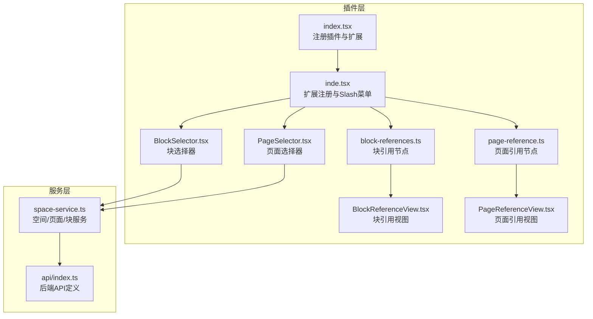
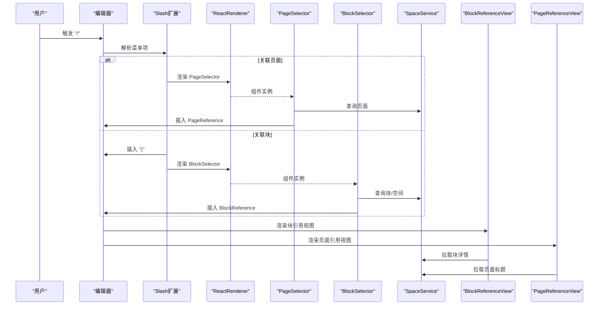
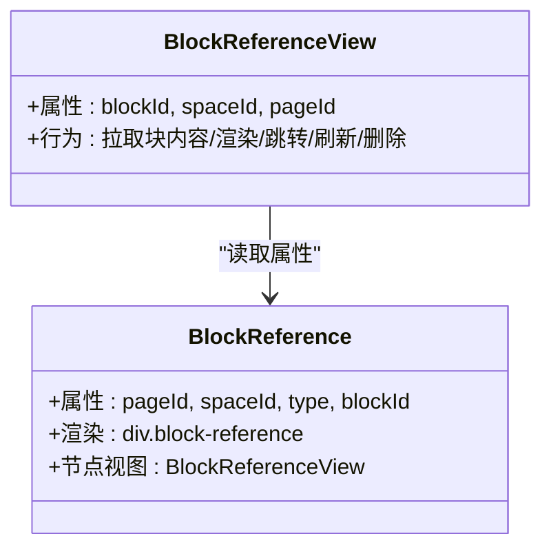
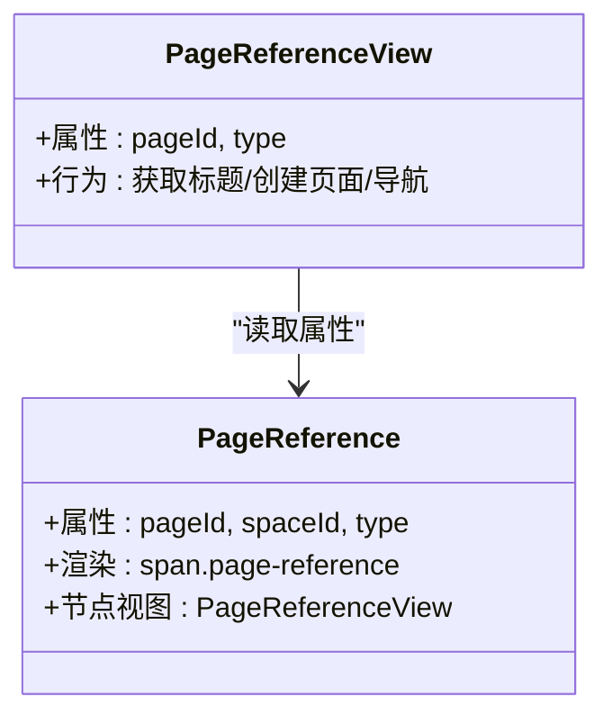
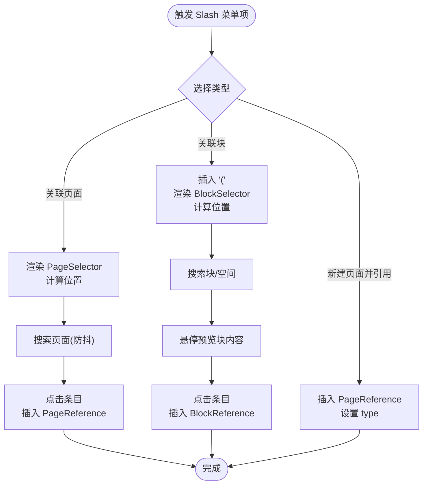
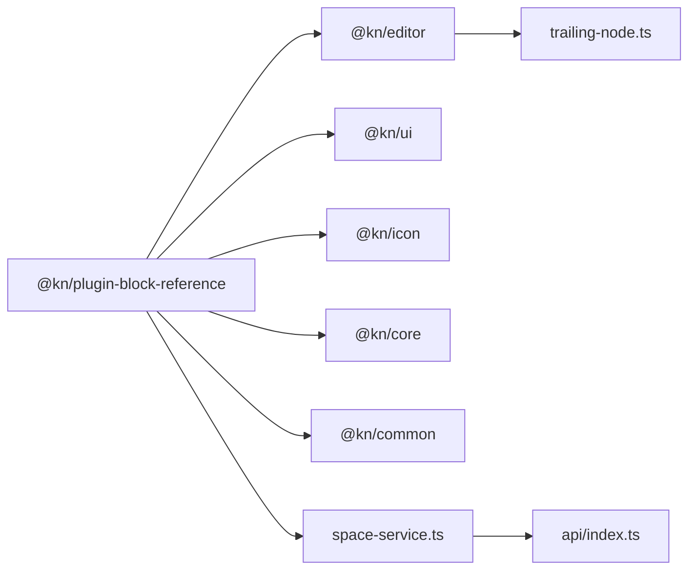

# 块引用插件

<cite>
**本文档引用的文件**
- [packages/plugin-block-reference/src/index.tsx](file://packages/plugin-block-reference/src/index.tsx)
- [packages/plugin-block-reference/src/extension/block-reference/inde.tsx](file://packages/plugin-block-reference/src/extension/block-reference/inde.tsx)
- [packages/plugin-block-reference/src/extension/block-reference/block-references.ts](file://packages/plugin-block-reference/src/extension/block-reference/block-references.ts)
- [packages/plugin-block-reference/src/extension/block-reference/page-reference.ts](file://packages/plugin-block-reference/src/extension/block-reference/page-reference.ts)
- [packages/plugin-block-reference/src/extension/block-reference/BlockSelector.tsx](file://packages/plugin-block-reference/src/extension/block-reference/BlockSelector.tsx)
- [packages/plugin-block-reference/src/extension/block-reference/PageSelector.tsx](file://packages/plugin-block-reference/src/extension/block-reference/PageSelector.tsx)
- [packages/plugin-block-reference/src/extension/block-reference/BlockReferenceView.tsx](file://packages/plugin-block-reference/src/extension/block-reference/BlockReferenceView.tsx)
- [packages/plugin-block-reference/src/extension/block-reference/PageReferenceView.tsx](file://packages/plugin-block-reference/src/extension/block-reference/PageReferenceView.tsx)
- [packages/plugin-main/src/service/space-service.ts](file://packages/plugin-main/src/service/space-service.ts)
- [packages/plugin-main/src/api/index.ts](file://packages/plugin-main/src/api/index.ts)
- [packages/common/src/event/index.ts](file://packages/common/src/event/index.ts)
- [packages/core/src/hooks/use-service.ts](file://packages/core/src/hooks/use-service.ts)
- [packages/editor/src/extensions/slash/slash.tsx](file://packages/editor/src/extensions/slash/slash.tsx)
- [packages/editor/src/utilities/position.ts](file://packages/editor/src/utilities/position.ts)
- [packages/editor/src/extensions/trailing-node/trailing-node.ts](file://packages/editor/src/extensions/trailing-node/trailing-node.ts)
</cite>

## 目录
1. [简介](#简介)
2. [项目结构](#项目结构)
3. [核心组件](#核心组件)
4. [架构总览](#架构总览)
5. [详细组件分析](#详细组件分析)
6. [依赖分析](#依赖分析)
7. [性能考虑](#性能考虑)
8. [故障排查指南](#故障排查指南)
9. [结论](#结论)
10. [附录：使用示例与最佳实践](#附录使用示例与最佳实践)

## 简介
本插件提供“块引用”与“页面引用”的能力，允许用户在编辑器中通过“/”快捷菜单插入并管理跨页面或跨空间的块引用与页面引用。其核心由以下部分组成：
- 编辑器扩展：注册块引用与页面引用节点，并提供“/”菜单项（slash）入口。
- 选择器组件：页面选择器与块选择器，用于搜索并插入目标页面或块。
- 节点视图：块引用视图与页面引用视图，负责渲染引用内容、交互跳转与刷新。
- 数据与服务：通过空间服务查询页面与块信息，维护引用关系与状态。

## 项目结构
插件位于 packages/plugin-block-reference，关键目录与文件如下：
- 扩展入口与注册：index.tsx 将扩展注入编辑器。
- 扩展定义：inde.tsx 注册节点与“/”菜单项；block-references.ts 定义块引用节点；page-reference.ts 定义页面引用节点。
- 选择器组件：BlockSelector.tsx 与 PageSelector.tsx 提供搜索与插入能力。
- 节点视图：BlockReferenceView.tsx 与 PageReferenceView.tsx 负责渲染与交互。
- 服务与接口：space-service.ts 提供查询页面、块、空间等能力；API 定义位于 plugin-main 的 api/index.ts。

图表来源
- [packages/plugin-block-reference/src/index.tsx](file://packages/plugin-block-reference/src/index.tsx#L1-L17)
- [packages/plugin-block-reference/src/extension/block-reference/inde.tsx](file://packages/plugin-block-reference/src/extension/block-reference/inde.tsx#L1-L121)
- [packages/plugin-block-reference/src/extension/block-reference/block-references.ts](file://packages/plugin-block-reference/src/extension/block-reference/block-references.ts#L1-L42)
- [packages/plugin-block-reference/src/extension/block-reference/page-reference.ts](file://packages/plugin-block-reference/src/extension/block-reference/page-reference.ts#L1-L35)
- [packages/plugin-block-reference/src/extension/block-reference/BlockSelector.tsx](file://packages/plugin-block-reference/src/extension/block-reference/BlockSelector.tsx#L1-L149)
- [packages/plugin-block-reference/src/extension/block-reference/PageSelector.tsx](file://packages/plugin-block-reference/src/extension/block-reference/PageSelector.tsx#L1-L55)
- [packages/plugin-block-reference/src/extension/block-reference/BlockReferenceView.tsx](file://packages/plugin-block-reference/src/extension/block-reference/BlockReferenceView.tsx#L1-L74)
- [packages/plugin-block-reference/src/extension/block-reference/PageReferenceView.tsx](file://packages/plugin-block-reference/src/extension/block-reference/PageReferenceView.tsx#L1-L66)
- [packages/plugin-main/src/service/space-service.ts](file://packages/plugin-main/src/service/space-service.ts#L1-L59)
- [packages/plugin-main/src/api/index.ts](file://packages/plugin-main/src/api/index.ts#L98-L120)

章节来源
- [packages/plugin-block-reference/src/index.tsx](file://packages/plugin-block-reference/src/index.tsx#L1-L17)
- [packages/plugin-block-reference/src/extension/block-reference/inde.tsx](file://packages/plugin-block-reference/src/extension/block-reference/inde.tsx#L1-L121)

## 核心组件
- 块引用节点 BlockReference
  - 属性：pageId、spaceId、type、blockId。
  - 渲染：HTML 包装器 div，类名 block-reference；节点视图为 BlockReferenceView。
- 页面引用节点 PageReference
  - 属性：pageId、spaceId、type。
  - 渲染：HTML 包装器 span，类名 page-reference；节点视图为 PageReferenceView。
- Slash 菜单扩展 BlockReferenceExtension
  - 提供“新建页面并引用（兄弟/子级）”、“关联页面”、“关联块”三个入口。
  - 使用 ReactRenderer 动态挂载选择器组件，并基于选区位置计算定位。
- 选择器组件
  - PageSelector：搜索空间内页面，插入 PageReference。
  - BlockSelector：按空间与关键词搜索块，插入 BlockReference，并预览块内容。
- 节点视图组件
  - BlockReferenceView：根据 blockId 拉取块内容并以只读编辑器渲染，支持跳转详情、刷新、删除。
  - PageReferenceView：根据 pageId 拉取页面标题，支持创建新页面并自动更新引用属性。

章节来源
- [packages/plugin-block-reference/src/extension/block-reference/block-references.ts](file://packages/plugin-block-reference/src/extension/block-reference/block-references.ts#L1-L42)
- [packages/plugin-block-reference/src/extension/block-reference/page-reference.ts](file://packages/plugin-block-reference/src/extension/block-reference/page-reference.ts#L1-L35)
- [packages/plugin-block-reference/src/extension/block-reference/inde.tsx](file://packages/plugin-block-reference/src/extension/block-reference/inde.tsx#L1-L121)
- [packages/plugin-block-reference/src/extension/block-reference/BlockSelector.tsx](file://packages/plugin-block-reference/src/extension/block-reference/BlockSelector.tsx#L1-L149)
- [packages/plugin-block-reference/src/extension/block-reference/PageSelector.tsx](file://packages/plugin-block-reference/src/extension/block-reference/PageSelector.tsx#L1-L55)
- [packages/plugin-block-reference/src/extension/block-reference/BlockReferenceView.tsx](file://packages/plugin-block-reference/src/extension/block-reference/BlockReferenceView.tsx#L1-L74)
- [packages/plugin-block-reference/src/extension/block-reference/PageReferenceView.tsx](file://packages/plugin-block-reference/src/extension/block-reference/PageReferenceView.tsx#L1-L66)

## 架构总览
下图展示了从“/”菜单到选择器、再到节点视图渲染的整体流程。

图表来源
- [packages/plugin-block-reference/src/extension/block-reference/inde.tsx](file://packages/plugin-block-reference/src/extension/block-reference/inde.tsx#L1-L121)
- [packages/plugin-block-reference/src/extension/block-reference/PageSelector.tsx](file://packages/plugin-block-reference/src/extension/block-reference/PageSelector.tsx#L1-L55)
- [packages/plugin-block-reference/src/extension/block-reference/BlockSelector.tsx](file://packages/plugin-block-reference/src/extension/block-reference/BlockSelector.tsx#L1-L149)
- [packages/plugin-block-reference/src/extension/block-reference/BlockReferenceView.tsx](file://packages/plugin-block-reference/src/extension/block-reference/BlockReferenceView.tsx#L1-L74)
- [packages/plugin-block-reference/src/extension/block-reference/PageReferenceView.tsx](file://packages/plugin-block-reference/src/extension/block-reference/PageReferenceView.tsx#L1-L66)
- [packages/plugin-main/src/service/space-service.ts](file://packages/plugin-main/src/service/space-service.ts#L1-L59)

## 详细组件分析

### 块引用节点与视图
- 数据结构
  - 属性：pageId、spaceId、type、blockId。
  - 渲染包装器：div，类名 block-reference。
  - 节点视图：BlockReferenceView，内部使用只读编辑器渲染块内容，支持跳转详情、刷新、删除。
- 渲染与交互
  - 刷新：点击刷新按钮触发重新拉取块内容。
  - 跳转：点击箭头图标跳转至块所在页面并高亮块。
  - 删除：当编辑器可编辑时显示删除按钮，调用节点视图提供的删除方法。
- 引用关系管理
  - 通过 blockId、pageId、spaceId 维持跨页面/跨空间引用。
  - 当块不存在时，视图提示“该块不存在”。

图表来源
- [packages/plugin-block-reference/src/extension/block-reference/block-references.ts](file://packages/plugin-block-reference/src/extension/block-reference/block-references.ts#L1-L42)
- [packages/plugin-block-reference/src/extension/block-reference/BlockReferenceView.tsx](file://packages/plugin-block-reference/src/extension/block-reference/BlockReferenceView.tsx#L1-L74)

章节来源
- [packages/plugin-block-reference/src/extension/block-reference/block-references.ts](file://packages/plugin-block-reference/src/extension/block-reference/block-references.ts#L1-L42)
- [packages/plugin-block-reference/src/extension/block-reference/BlockReferenceView.tsx](file://packages/plugin-block-reference/src/extension/block-reference/BlockReferenceView.tsx#L1-L74)

### 页面引用节点与视图
- 数据结构
  - 属性：pageId、spaceId、type。
  - 渲染包装器：span，类名 page-reference。
  - 节点视图：PageReferenceView，支持创建新页面并自动更新引用属性。
- 渲染与交互
  - 加载状态：异步获取页面标题，加载中显示旋转指示器。
  - 导航：点击打开对应页面链接。
  - 创建：若 pageId 为空且存在参数 id，则调用服务创建页面并回填属性，同时发出页面刷新事件。

图表来源
- [packages/plugin-block-reference/src/extension/block-reference/page-reference.ts](file://packages/plugin-block-reference/src/extension/block-reference/page-reference.ts#L1-L35)
- [packages/plugin-block-reference/src/extension/block-reference/PageReferenceView.tsx](file://packages/plugin-block-reference/src/extension/block-reference/PageReferenceView.tsx#L1-L66)

章节来源
- [packages/plugin-block-reference/src/extension/block-reference/page-reference.ts](file://packages/plugin-block-reference/src/extension/block-reference/page-reference.ts#L1-L35)
- [packages/plugin-block-reference/src/extension/block-reference/PageReferenceView.tsx](file://packages/plugin-block-reference/src/extension/block-reference/PageReferenceView.tsx#L1-L66)

### Slash 菜单与选择器
- Slash 菜单扩展
  - 新建页面并引用（兄弟/子级）：插入 PageReference 并设置 type。
  - 关联页面：弹出 PageSelector，选择后插入 PageReference。
  - 关联块：在当前位置插入“(”，弹出 BlockSelector，选择后插入 BlockReference。
- 选择器定位
  - 使用 computePosition 与 posToDOMRect 计算组件绝对定位，支持翻转策略以适配边界。
- PageSelector
  - 搜索空间内页面，支持防抖搜索，点击条目插入 PageReference 并关闭面板。
- BlockSelector
  - 支持切换空间，按关键词搜索块，悬停卡片预览块内容，点击插入 BlockReference。
  - 通过 selectionUpdate 事件动态更新搜索词，计算面板位置。

图表来源
- [packages/plugin-block-reference/src/extension/block-reference/inde.tsx](file://packages/plugin-block-reference/src/extension/block-reference/inde.tsx#L1-L121)
- [packages/plugin-block-reference/src/extension/block-reference/PageSelector.tsx](file://packages/plugin-block-reference/src/extension/block-reference/PageSelector.tsx#L1-L55)
- [packages/plugin-block-reference/src/extension/block-reference/BlockSelector.tsx](file://packages/plugin-block-reference/src/extension/block-reference/BlockSelector.tsx#L1-L149)
- [packages/editor/src/extensions/slash/slash.tsx](file://packages/editor/src/extensions/slash/slash.tsx#L143-L191)
- [packages/editor/src/utilities/position.ts](file://packages/editor/src/utilities/position.ts#L1-L68)

章节来源
- [packages/plugin-block-reference/src/extension/block-reference/inde.tsx](file://packages/plugin-block-reference/src/extension/block-reference/inde.tsx#L1-L121)
- [packages/plugin-block-reference/src/extension/block-reference/PageSelector.tsx](file://packages/plugin-block-reference/src/extension/block-reference/PageSelector.tsx#L1-L55)
- [packages/plugin-block-reference/src/extension/block-reference/BlockSelector.tsx](file://packages/plugin-block-reference/src/extension/block-reference/BlockSelector.tsx#L1-L149)

### 引用解析与更新机制
- 引用解析
  - 块引用：通过 blockId 拉取块详情，解析 content 字段为 ProseMirror 内容，使用只读编辑器渲染。
  - 页面引用：通过 pageId 拉取页面标题，若不存在则创建页面并回填属性。
- 更新机制
  - 刷新：点击刷新按钮触发重新拉取块内容。
  - 页面刷新事件：创建页面成功后发出 ON_PAGE_REFRESH 事件，便于其他模块响应。
  - 删除：节点视图暴露删除方法，仅在编辑器可编辑时显示删除按钮。

章节来源
- [packages/plugin-block-reference/src/extension/block-reference/BlockReferenceView.tsx](file://packages/plugin-block-reference/src/extension/block-reference/BlockReferenceView.tsx#L1-L74)
- [packages/plugin-block-reference/src/extension/block-reference/PageReferenceView.tsx](file://packages/plugin-block-reference/src/extension/block-reference/PageReferenceView.tsx#L1-L66)
- [packages/common/src/event/index.ts](file://packages/common/src/event/index.ts#L1-L19)

## 依赖分析
- 插件依赖
  - @kn/editor：ProseMirror 扩展、React 节点视图、Slash 菜单、位置计算工具。
  - @kn/ui：UI 组件库（输入框、滚动区域、选择器、按钮等）。
  - @kn/icon：图标资源。
  - @kn/core：服务注入、键盘事件、切换器等 Hook。
  - @kn/common：事件总线、插件基类。
- 服务依赖
  - space-service：提供查询空间、页面、块等能力；API 定义位于 plugin-main 的 api/index.ts。
- 外部扩展
  - trailing-node：确保文档末尾有可编辑节点，改善编辑体验。

图表来源
- [packages/plugin-block-reference/package.json](file://packages/plugin-block-reference/package.json#L1-L32)
- [packages/plugin-main/src/service/space-service.ts](file://packages/plugin-main/src/service/space-service.ts#L1-L59)
- [packages/plugin-main/src/api/index.ts](file://packages/plugin-main/src/api/index.ts#L98-L120)
- [packages/editor/src/extensions/trailing-node/trailing-node.ts](file://packages/editor/src/extensions/trailing-node/trailing-node.ts#L1-L42)

章节来源
- [packages/plugin-block-reference/package.json](file://packages/plugin-block-reference/package.json#L1-L32)
- [packages/plugin-main/src/service/space-service.ts](file://packages/plugin-main/src/service/space-service.ts#L1-L59)
- [packages/plugin-main/src/api/index.ts](file://packages/plugin-main/src/api/index.ts#L98-L120)

## 性能考虑
- 防抖搜索
  - PageSelector 与 BlockSelector 对搜索值使用防抖，降低请求频率。
- 位置计算
  - 使用 computePosition 与 posToDOMRect 计算面板位置，避免重绘抖动。
- 只读渲染
  - BlockReferenceView 使用只读编辑器渲染块内容，减少交互开销。
- 文档末尾节点
  - trailing-node 确保文档末尾始终有可编辑节点，避免插入时的布局问题。
- 事件与服务
  - 通过 useService 注入服务，避免重复初始化带来的性能损耗。

章节来源
- [packages/plugin-block-reference/src/extension/block-reference/PageSelector.tsx](file://packages/plugin-block-reference/src/extension/block-reference/PageSelector.tsx#L1-L55)
- [packages/plugin-block-reference/src/extension/block-reference/BlockSelector.tsx](file://packages/plugin-block-reference/src/extension/block-reference/BlockSelector.tsx#L1-L149)
- [packages/editor/src/utilities/position.ts](file://packages/editor/src/utilities/position.ts#L1-L68)
- [packages/editor/src/extensions/trailing-node/trailing-node.ts](file://packages/editor/src/extensions/trailing-node/trailing-node.ts#L1-L42)
- [packages/core/src/hooks/use-service.ts](file://packages/core/src/hooks/use-service.ts#L1-L15)

## 故障排查指南
- 无法显示块内容
  - 检查 blockId 是否有效；若返回空，视图会提示“该块不存在”。
  - 确认 space-service.getBlockInfo 返回数据格式正确。
- 页面引用标题不显示
  - 检查 pageId 是否存在；若不存在，尝试创建页面后再刷新。
  - 确认 ON_PAGE_REFRESH 事件是否被监听并触发刷新。
- Slash 菜单不出现或面板位置异常
  - 检查 Slash 扩展是否正确注册。
  - 确认 computePosition 与 posToDOMRect 的调用是否传入正确的 DOMRect。
- 选择器无法关闭
  - 确认 ESC 键盘事件与点击外部区域的点击离开逻辑生效。
- 删除按钮不可见
  - 确认编辑器处于可编辑模式，且节点视图 deleteNode 方法可用。

章节来源
- [packages/plugin-block-reference/src/extension/block-reference/BlockReferenceView.tsx](file://packages/plugin-block-reference/src/extension/block-reference/BlockReferenceView.tsx#L1-L74)
- [packages/plugin-block-reference/src/extension/block-reference/PageReferenceView.tsx](file://packages/plugin-block-reference/src/extension/block-reference/PageReferenceView.tsx#L1-L66)
- [packages/plugin-block-reference/src/extension/block-reference/inde.tsx](file://packages/plugin-block-reference/src/extension/block-reference/inde.tsx#L1-L121)
- [packages/plugin-block-reference/src/extension/block-reference/BlockSelector.tsx](file://packages/plugin-block-reference/src/extension/block-reference/BlockSelector.tsx#L1-L149)
- [packages/common/src/event/index.ts](file://packages/common/src/event/index.ts#L1-L19)

## 结论
块引用插件通过节点扩展、Slash 菜单、选择器组件与节点视图，完整实现了页面引用与块引用的创建、渲染与管理。其设计强调可扩展性与易用性，结合服务层与事件系统，能够稳定地支撑跨页面/跨空间的内容组织与导航。

## 附录：使用示例与最佳实践
- 在编辑器中输入“/”打开菜单，选择“关联页面”或“关联块”完成引用插入。
- 在块引用视图中，点击“箭头”跳转到块所在页面；点击“刷新”重新拉取块内容；在可编辑状态下点击“垃圾桶”删除引用。
- 页面引用视图会在缺少 pageId 时自动创建页面并回填属性，随后发出页面刷新事件。
- 最佳实践
  - 使用防抖搜索提升交互流畅度。
  - 合理使用 trailing-node，避免插入时的布局问题。
  - 对于大量块引用场景，建议在服务端进行分页与缓存优化。
  - 对外链/跨空间引用，注意权限与可见性控制。